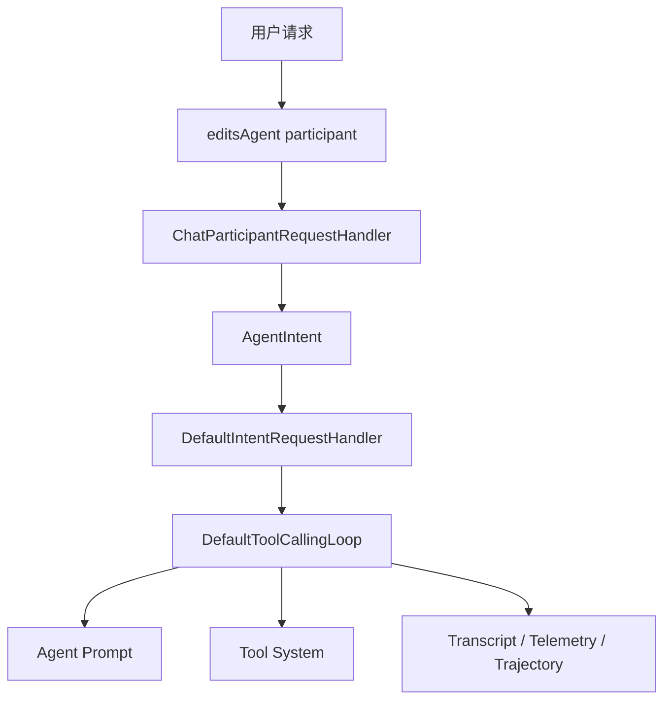
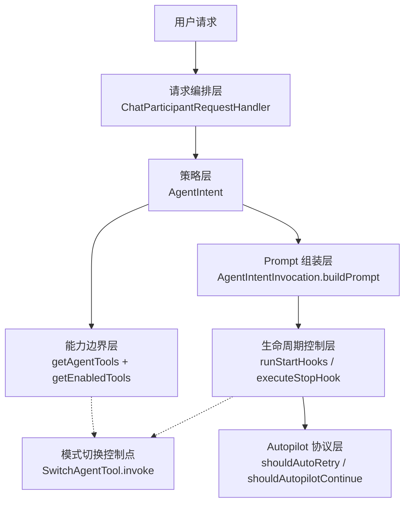

# Copilot Chat Agent Mode 架构设计（上篇）

## 文档目标

本文是 Agent Mode 设计文档的上篇，重点说明其在整个 Copilot Chat 系统中的架构定位、能力边界、分层组织方式以及与其他 agent execution path 的关系。

为降低术语门槛，文中仍保留少量辅助性比喻；但整体表述以架构分析与实现映射为主。

本文的写法刻意同时覆盖两类阅读目标：一类是先建立全局认知，理解 Agent Mode 为什么存在、在系统里处于什么位置；另一类是直接进入实现细节，理解分层、职责边界与关键代码入口。

如果是第一次接触这些概念，可以先带着以下对照关系进入阅读：

- **Agent**：像一个会自己规划步骤并推动任务落地的技术负责人
- **Participant**：像聊天界面里暴露出来的角色入口
- **Intent**：像系统内部决定“这次请求按什么工作方式处理”的策略开关
- **Tool Calling Loop**：像“计划一次、执行一次、复盘一次、再继续”的闭环引擎
- **Subagent**：像主代理委派出去的专门小组

---

## 1. Agent Mode 的系统定位

在这个项目里，**Agent Mode** 不是“模型回答得更聪明一点”的增强模式，而是一套完整的 **autonomous execution architecture**。

它的核心目标不是“一次性生成答案”，而是：

1. 理解用户目标
2. 自主分解任务
3. 选择合适工具
4. 按多轮步骤执行
5. 根据中间结果调整计划
6. 在能力条件满足且有必要时调用子代理继续推进
7. 最终把复杂任务真正做完

如果把普通 Chat 看作“顾问模式”，那么 Agent Mode 更接近“执行模式”。它的职责不是停留在建议层，而是将建议落实为可验证的工作结果。

---

## 2. 核心设计原则

Agent Mode 的设计原则可以概括为四点：

| 设计思想 | 通俗解释 | 工程含义 |
| --- | --- | --- |
| 从“回答问题”升级为“执行任务” | 不只说，还要做 | 以 tool-calling loop 为执行核心 |
| 从“单轮对话”升级为“多轮闭环” | 做一步，看一步，再决定下一步 | 每一轮都基于最新工具结果重建 prompt |
| 从“单体代理”升级为“主代理 + 条件子代理” | 大任务可以拆给专门小组 | 在模型与实验开关允许时支持 search subagent 和 execution subagent |
| 从“黑盒输出”升级为“可追踪执行” | 不只知道结果，还知道过程 | transcript、telemetry、trajectory 全部保留 |

---

## 3. 架构总览

### 3.1 总体视图

### 3.2 关键入口

项目中显式的 Agent Mode 入口是 `editsAgent`：

- Agent participant 注册：[`src/extension/conversation/vscode-node/chatParticipants.ts`](../src/extension/conversation/vscode-node/chatParticipants.ts)
- Agent 名称定义：[`src/platform/chat/common/chatAgents.ts`](../src/platform/chat/common/chatAgents.ts)
- Agent intent 定义：[`src/extension/intents/node/agentIntent.ts`](../src/extension/intents/node/agentIntent.ts)

这说明 Agent Mode 并非临时拼接出的模式，而是系统内部具有稳定身份和明确生命周期的 chat participant。

---

## 4. 核心概念与角色分工

### 4.1 Participant

**Participant** 可以理解为“聊天系统向用户暴露的角色入口”。

在这个项目里：

- `default` 更像通用顾问
- `editingSession` 更像受限编辑助手
- `editsAgent` 则是 Agent Mode 的自治执行入口

### 4.2 Intent

**Intent** 可以理解为“系统对当前请求所采用的处理模式”。

例如：

- `Edit` 表示按编辑模式处理
- `AskAgent` 表示默认聊天里走带工具能力的 ask-agent 流程
- `Agent` 表示显式进入自治执行模式

项目里 `Intent.Agent` 的值是 `editAgent`，定义在 [`src/extension/common/constants.ts`](../src/extension/common/constants.ts)。

### 4.3 Tool Calling Loop

**Tool Calling Loop** 是 Agent Mode 的执行核心。

它负责反复执行这个循环：

1. 基于当前上下文构造 prompt
2. 让模型决定下一步要调用哪些工具
3. 执行工具
4. 收集结果
5. 把结果再送回模型继续推理
6. 直到任务完成、达到轮次上限或被用户中断

基类定义在 [`src/extension/intents/node/toolCallingLoop.ts`](../src/extension/intents/node/toolCallingLoop.ts)。

### 4.4 Subagent

**Subagent** 是主代理为了提升复杂任务完成率而引入的专用执行单元。

但这里要注意一个工程事实：它不是每次 Agent 会话都会出现的“默认固定部件”。在当前实现里，子代理是否可用取决于模型家族与实验开关；也就是说，它更准确地说是 **conditional capability**，而不是无条件常驻的执行层组成部分。

可以把它想象成一个工程团队：

- 主代理像 Tech Lead
- Search Subagent 像检索/情报小组
- Execution Subagent 像执行/验证小组

---

## 5. 微架构分层设计

从实现职责看，Agent Mode 的微架构可分为五层。

| 层次 | 主要职责 | 对应代码 |
| --- | --- | --- |
| Entry Layer | 注册 chat participant，接住请求 | `chatParticipants.ts` |
| Orchestration Layer | 组装会话、选择 intent、做前置校验 | `chatParticipantRequestHandler.ts` |
| Execution Layer | 启动工具调用闭环、处理多轮执行 | `defaultIntentRequestHandler.ts`, `toolCallingLoop.ts` |
| Capability Layer | 暴露工具、条件子代理、任务能力 | `toolNames.ts`, `tools/**` |
| Observability Layer | 记录 transcript、trajectory、telemetry | `sessionTranscriptService.ts`, `trajectoryLoggerAdapter.ts` |

### 5.1 Entry Layer

`ChatParticipants.registerEditsAgent()` 将 `editsAgent` 注册为 chat participant，见 [../src/extension/conversation/vscode-node/chatParticipants.ts](../src/extension/conversation/vscode-node/chatParticipants.ts)。

### 5.2 Orchestration Layer

核心类是 `ChatParticipantRequestHandler`，负责：

- 识别当前请求来自哪个 participant
- 创建 conversation / turn
- 清洗变量和引用
- 处理 ignored files 和 auth upgrade
- 选择 intent

对应代码： [../src/extension/prompt/node/chatParticipantRequestHandler.ts](../src/extension/prompt/node/chatParticipantRequestHandler.ts)

### 5.3 Execution Layer

执行层由 `AgentIntent` 与 `DefaultIntentRequestHandler + DefaultToolCallingLoop` 组成。

- `AgentIntent` 负责给 Agent Mode 注入特定执行策略
- `DefaultIntentRequestHandler` 是执行外壳
- `DefaultToolCallingLoop` 是自治执行内核

### 5.4 Capability Layer

能力层负责定义：

- Agent 可以调用什么工具
- 某个模型能否使用某种编辑工具
- 某些能力是否由 feature flag 或实验开关决定
- 条件启用的子代理能使用哪些更窄的能力子集

### 5.5 Observability Layer

可观测层负责回答三个问题：

1. Agent 做了什么
2. Agent 是怎么做的
3. 如果效果不好，问题出在哪一轮

它依赖三类记录：

- Transcript
- Telemetry / OTel
- Trajectory

---

## 6. 跨 Agent 对比设计

理解 Agent Mode 的高效方式，不是孤立地看它自己，而是将其与同仓库中的其他 agent execution path 放在一起比较。

### 6.1 对比视图

| 路径 | 入口形态 | 执行模型 | 工具来源 | 适合场景 |
| --- | --- | --- | --- | --- |
| AskAgent | 默认聊天中的 agent 化问答 | 面向问答，带有限工具能力 | 由 ask-agent 策略选择 | 一边问一边查，但不以重执行为主 |
| Edit Mode | 受限编辑代理 | allowlist 内编辑 | 只允许读写受限文件 | 小范围、低风险编辑 |
| Agent Mode | `editsAgent` participant | 多轮自治执行闭环 | 本地工具系统 + 子代理 | 跨文件、多步骤、需要验证的复杂任务 |
| Copilot CLI Session | 独立 chat session provider | SDK / CLI 驱动的外部 agent | CLI / SDK / 扩展桥接工具 | 与 CLI 工作流深度集成 |
| Claude Code Session | 独立 Claude session provider | Claude SDK 驱动会话 | Claude SDK + MCP + hook | 依赖 Claude 生态与外部协议的场景 |

### 6.2 AskAgent 与 Agent Mode

AskAgent 更像“增强版问答代理”，它会使用工具，但默认目标仍然偏向回答与辅助理解。对应实现见 [../src/extension/intents/node/askAgentIntent.ts](../src/extension/intents/node/askAgentIntent.ts)。

Agent Mode 则将目标切换为“把任务做完”。它会把 request location 视为 `ChatLocation.Agent`，并为多轮工具调用、自主继续执行以及复杂任务闭环做额外优化，见 [../src/extension/intents/node/agentIntent.ts](../src/extension/intents/node/agentIntent.ts)。

### 6.3 Copilot CLI 与 Agent Mode

Copilot CLI 路径不是在本地 `DefaultToolCallingLoop` 内直接编排，而是通过独立 session 与 SDK/CLI 生态协作完成，核心入口在 [../src/extension/chatSessions/copilotcli/node/copilotcliSession.ts](../src/extension/chatSessions/copilotcli/node/copilotcliSession.ts)。

它更像“把 VS Code 接到一个外部 agent runtime 上”。

相比之下，Agent Mode 是扩展内部的原生执行路径：

- participant、intent、loop 都在扩展内
- 工具由本地工具系统统一管理
- transcript 与 trajectory 更直接地和主对话会话对齐

### 6.4 Claude Code 与 Agent Mode

Claude Code 路径通过 `ClaudeAgentManager` 管理会话，核心入口在 [../src/extension/chatSessions/claude/node/claudeCodeAgent.ts](../src/extension/chatSessions/claude/node/claudeCodeAgent.ts)。

它更像“通过 Claude SDK 驱动的外部 agent 会话”，其执行模型、hook 系统、MCP server 组织方式都和原生 Agent Mode 不同。

相比之下，Agent Mode 的优势在于：

- 与 VS Code chat participant 体系天然一致
- 与本地工具定义和权限机制一致
- 更容易和 `DefaultIntentRequestHandler`、`ToolCallingLoop`、workspace 工具能力做统一抽象

### 6.5 为什么需要同时存在这些路径

因为它们解决的问题并不完全相同：

- AskAgent 解决“问答增强”
- Edit Mode 解决“低风险编辑”
- Agent Mode 解决“本地自治执行”
- Copilot CLI 解决“CLI / SDK 工作流集成”
- Claude Code 解决“Claude agent 生态集成”

这不是功能重复，而是 **execution model diversification**。

---

## 7. 关键设计取舍与演进方向

### 7.1 设计取舍

Agent Mode 的当前架构体现了若干明确的设计取舍。

#### 取舍一：选择“多轮闭环”而不是“单轮生成”

优点是能够在信息不完整、工具执行可能失败、任务需要验证的前提下持续推进；代价是执行时延、token 消耗与运行态复杂度显著增加。

#### 取舍二：选择“本地原生工具系统”而不是“完全外部 agent runtime”

优点是可以与 VS Code participant、权限体系、workspace state 和 transcript/trajectory 做统一抽象；代价是扩展内部需要承担更多调度与兼容逻辑。

#### 取舍三：选择“主代理 + 子代理”而不是“单体代理承担全部职责”

优点是可以降低上下文污染、缩窄工具暴露面、提高复杂任务处理稳定性；代价是引入额外的委派协议、状态传递与观测成本。

#### 取舍四：选择“动态工具集”而不是“固定工具全集”

优点是可以针对模型能力、风险级别与用户设置进行裁剪；代价是系统行为会更依赖上下文条件，调试门槛更高。

### 7.2 可能的演进方向

基于当前实现，后续演进大致可以沿四个方向展开：

1. 更细粒度的工具治理：继续收紧按模型、场景、权限和实验开关的工具裁剪策略。
2. 更稳定的子代理编排：将 search、execution 之外的专门执行单元逐步产品化。
3. 更强的状态恢复能力：提升长任务中断后的恢复、续跑与部分结果重用能力。
4. 更统一的跨 runtime 抽象：在原生 Agent Mode、Copilot CLI、Claude Code 等执行路径之间沉淀可复用执行语义。

---

## 8. 控制面的静态责任边界

如果说上篇前半部分主要回答“执行体系是如何分层的”，那么这一节专门回答另一个容易被忽略的问题：在静态架构上，谁负责控制 Agent，谁又不应该越权。

这里所说的控制面，不是指某一个单独类，而是几组稳定协作的职责边界：

1. 请求进入前，谁能阻断或改写这次执行。
2. prompt 发出去前，谁能注入额外约束。
3. 工具暴露前，谁能收紧能力边界。
4. loop 准备停止时，谁能把“结束”改写成“继续”。
5. 会话是否允许切换到另一种 agent mode。

### 8.0 静态控制面分层图

这张图的重点不是重复“主执行链路怎么跑”，而是用静态结构回答一个更容易混淆的问题：控制权分别落在哪些层，而且这些层之间不是彼此替代关系。

从上到下可以把它理解为一条逐步收缩的控制栈：

1. 请求编排层先决定“这次请求能不能安全进入 Agent”。
2. 策略层再决定“这次请求按什么协议运行”。
3. 能力边界层再决定“原则上允许什么、这一轮实际看到什么”。
4. 生命周期控制层再决定“什么时候允许开始、什么时候允许停止”。
5. Autopilot 协议层只在特定权限下接管更激进的恢复与完成判定。
6. Handoff 控制点不是常驻主链路，而是一个受限分支，用于切换 agent mode。

### 8.1 请求前控制归请求编排层，而不是归 loop

代表实现：

- [ChatParticipantRequestHandler.getResult](../src/extension/prompt/node/chatParticipantRequestHandler.ts#L204)
- [sanitizeVariables](../src/extension/prompt/node/chatParticipantRequestHandler.ts#L146)

静态职责上，请求编排层负责把一条用户请求变成“可安全进入 Agent 主链路的请求对象”。这包括：

1. 变量与引用清洗。
2. ignored files 与安全边界处理。
3. conversation / turn / document context 的建立。

但它不应该开始模拟多轮自治控制。如果把 hook、权限或工具裁剪的大量语义前移到这里，这一层就会从 orchestrator 退化成半个 runtime。

```mermaid
flowchart LR
    RawRequest["原始用户请求"] --> AuthGate["鉴权与准入检查<br/>_shouldAskForPermissiveAuth()"]
    AuthGate -->|允许继续| VariableGate["引用清洗<br/>sanitizeVariables()"]
    AuthGate -->|需要升级权限| UpgradePrompt["在 Chat 中请求更宽权限"]
    VariableGate --> IntentSelect["命令校验与 Intent 选择"]
    IntentSelect --> HookGate["首轮前控制<br/>runStartHooks + UserPromptSubmit"]
    HookGate -->|block| Blocked["请求被拦下或要求用户调整"]
    HookGate -->|allow| Strategy["策略层初筛<br/>getAgentTools()"]
    Strategy -->|按模型能力| ModelFiltered["模型能力兼容子集"]
    Strategy -->|按实验/工作区/权限| PolicyFiltered["策略允许子集"]
    ModelFiltered --> Visible["请求级可见工具<br/>getEnabledTools()"]
    PolicyFiltered --> Visible
    Visible -->|tool picker / filter / toolReferences| RoundTools["本轮真正暴露给模型的工具集"]
    RoundTools --> MainLoop["进入 Agent 主执行链"]
```

这张总图把前面两种“收缩”放进了一条连续链路里看：先收缩请求的准入，再收缩工具的暴露。

前半段回答的是“这条请求能不能进入 Agent 主链路”：

1. 鉴权与 permissive session upgrade 检查，决定是否连 workspace 级能力都能申请。
2. `sanitizeVariables()`，决定哪些引用能够带进后续上下文。
3. 命令与 intent 选择，决定这次请求到底走哪条 execution path。
4. `UserPromptSubmit`，在 loop 真正启动前做最后一次 block/allow 判定。

后半段回答的是“即便允许进入，模型这一轮究竟能看到什么工具”：

1. `getAgentTools()` 先做策略层初筛。
2. `getEnabledTools()` 再做请求级可见性裁剪。
3. 只有最后得到的 `RoundTools` 才会真正进入当前轮执行。

因此，请求编排层与能力边界层虽然分属不同职责，但它们在运行结果上共同构成了一条连续的控制收缩链。

### 8.2 执行策略归 AgentIntent，而不是归 prompt 模板

代表实现：

- [AgentIntent.getIntentHandlerOptions](../src/extension/intents/node/agentIntent.ts#L192)
- [AgentIntent.handleRequest](../src/extension/intents/node/agentIntent.ts#L201)

`AgentIntent` 是控制面中最重要的静态策略层。它负责定义：

1. 这次请求是不是 Agent Mode。
2. 这次执行的 location、temperature 和 tool iteration 上限。
3. 哪些特殊分支需要脱离常规主链处理，例如 `/compact`。

这一层的边界非常重要，因为它把“这次请求应该按什么协议运行”从 prompt 文本里剥离出来了。也就是说，prompt 是执行协议的承载体，但不应该成为协议本身的唯一出处。

### 8.3 能力边界归工具策略层，而不是归模型临场决定

代表实现：

- [getAgentTools](../src/extension/intents/node/agentIntent.ts#L67)
- [toolsService.getEnabledTools](../src/extension/tools/vscode-node/toolsService.ts#L235)

静态上，Agent 的能力边界先由 `getAgentTools()` 决定，再由 `toolsService.getEnabledTools()` 与请求级设置继续收窄。这里体现的是双层控制：

1. 策略层决定“原则上允许哪些工具”。
2. 工具服务决定“这一轮实际上能看到哪些工具”。

这也解释了为什么“仓库里有这个工具”与“模型本轮一定能调用它”是两回事。控制面在这里体现为显式 capability boundary，而不是把能力选择交给模型自己试探。

上面的总图已经把能力边界收缩链并入整体准入路径。这里最关键的不是起点，而是最后一跳：即便某个工具已经通过 `getAgentTools()` 进入策略允许集合，它仍然可能在 `getEnabledTools()` 阶段因为 tool picker、请求 filter 或 request tool references 的条件而不对当前轮暴露。

因此，理解能力边界时最好不要只问“Agent 支持哪些工具”，而要问两次：

1. 策略层原则上允许哪些工具。
2. 本轮请求实际上把哪些工具暴露给了模型。

### 8.4 生命周期 Hook 归 loop 控制层，而不是归工具层

代表实现：

- [runWithToolCalling](../src/extension/prompt/node/defaultIntentRequestHandler.ts#L318)
- [ToolCallingLoop.runStartHooks](../src/extension/intents/node/toolCallingLoop.ts#L585)
- [ToolCallingLoop.executeStopHook](../src/extension/intents/node/toolCallingLoop.ts#L281)

从静态职责看，hooks 属于 loop 的生命周期控制协议，而不是某个具体工具的附属回调：

1. `SessionStart` / `SubagentStart` 控制首轮 prompt 前的上下文注入。
2. `UserPromptSubmit` 控制本轮请求是否允许进入主执行。
3. `Stop` / `SubagentStop` 控制 loop 是否真的允许结束。

把 hooks 放在这一层有一个重要效果：控制逻辑可以直接重写执行状态，而不必把“继续执行”的判断塞进模型输出或某个单独工具结果里。

### 8.5 Autopilot 是控制协议，不只是权限标签

代表实现：

- [ToolCallingLoop.shouldAutopilotContinue](../src/extension/intents/node/toolCallingLoop.ts#L356)
- [ToolCallingLoop.shouldAutoRetry](../src/extension/intents/node/toolCallingLoop.ts#L397)

静态架构上，`autopilot` 不应被理解成“开放更多动作”这么简单。它其实会改写 loop 的结束协议与错误恢复协议：

1. 要求模型显式调用 `task_complete`。
2. 允许在特定错误下自动重试。
3. 允许在命中轮次限制时进入受限扩容，而不是立刻停下。

这说明权限级别并不是 UI 层标记，而是会下沉到 runtime protocol 的一部分。

### 8.6 Handoff 归受限模式切换，而不是归子代理委派

代表实现：

- [SwitchAgentTool.invoke](../src/extension/tools/vscode-node/switchAgentTool.ts#L20)

`switch_agent` 在当前实现里不是一个任意 agent router。它本质上是一次受限 handoff：

1. 通过工具触发模式切换。
2. 切换绑定到当前 chat session。
3. 当前只支持切到 `Plan`。

因此它在静态架构中的位置更接近“模式切换阀门”，而不是“可嵌套的子代理调用接口”。把这点说清楚很重要，否则很容易把 handoff 与 subagent delegation 混为一谈。

### 8.7 用一张表收束这组边界

| 控制问题 | 静态归属层 | 代表实现 | 不应越权到哪里 |
| --- | --- | --- | --- |
| 请求能否安全进入 Agent | 请求编排层 | `ChatParticipantRequestHandler` | 不应直接接管 loop |
| 本次请求按什么执行协议运行 | Intent 策略层 | `AgentIntent` | 不应退化为 prompt 内暗规则 |
| 哪些工具原则上可用、实际上可见 | 能力边界层 | `getAgentTools()` + `getEnabledTools()` | 不应交给模型临场试探 |
| 首轮前注入什么、停止前是否继续 | Loop 生命周期控制层 | `runStartHooks()` / `executeStopHook()` | 不应塞进单个工具语义 |
| 失败后是否自动恢复、何时算完成 | Autopilot 控制协议 | `shouldAutoRetry()` / `shouldAutopilotContinue()` | 不应只留在 UI 权限标签 |
| 是否切换到另一 agent mode | Handoff 控制点 | `SwitchAgentTool.invoke()` | 不应误写成子代理委派 |

---

## 9. 关键代码映射

| 主题 | 文件 |
| --- | --- |
| Agent participant 注册 | [`src/extension/conversation/vscode-node/chatParticipants.ts`](../src/extension/conversation/vscode-node/chatParticipants.ts) |
| Agent 名称与 participant ID | [`src/platform/chat/common/chatAgents.ts`](../src/platform/chat/common/chatAgents.ts) |
| Intent 枚举与命名 | [`src/extension/common/constants.ts`](../src/extension/common/constants.ts) |
| 请求编排入口 | [`src/extension/prompt/node/chatParticipantRequestHandler.ts`](../src/extension/prompt/node/chatParticipantRequestHandler.ts) |
| Agent intent | [`src/extension/intents/node/agentIntent.ts`](../src/extension/intents/node/agentIntent.ts) |
| AskAgent intent | [`src/extension/intents/node/askAgentIntent.ts`](../src/extension/intents/node/askAgentIntent.ts) |
| Copilot CLI session | [`src/extension/chatSessions/copilotcli/node/copilotcliSession.ts`](../src/extension/chatSessions/copilotcli/node/copilotcliSession.ts) |
| Claude Agent manager | [`src/extension/chatSessions/claude/node/claudeCodeAgent.ts`](../src/extension/chatSessions/claude/node/claudeCodeAgent.ts) |
| 工具可见性过滤 | [`src/extension/tools/vscode-node/toolsService.ts`](../src/extension/tools/vscode-node/toolsService.ts) |
| Loop 生命周期 hooks | [`src/extension/intents/node/toolCallingLoop.ts`](../src/extension/intents/node/toolCallingLoop.ts) |
| Agent mode handoff | [`src/extension/tools/vscode-node/switchAgentTool.ts`](../src/extension/tools/vscode-node/switchAgentTool.ts) |

---

## 10. 类与方法级源码索引

如果希望从“架构职责”直接映射到“实现符号”，建议先看以下类与方法。这里不仅给出文件，还给出建议关注的关键行段，便于快速读码。

| 架构职责 | 类 / 方法 | 关键位置 | 说明 |
| --- | --- | --- | --- |
| Agent 注册 | `ChatParticipants.registerEditsAgent()` | [../src/extension/conversation/vscode-node/chatParticipants.ts#L141](../src/extension/conversation/vscode-node/chatParticipants.ts#L141) | 将 `editsAgent` 暴露为独立 participant，并绑定 Agent intent |
| 请求桥接 | `ChatParticipants.getChatParticipantHandler()` | [../src/extension/conversation/vscode-node/chatParticipants.ts#L197](../src/extension/conversation/vscode-node/chatParticipants.ts#L197) | 将 VS Code participant 请求桥接到 `ChatParticipantRequestHandler` |
| 请求处理 | `ChatParticipantRequestHandler.getResult()` | [../src/extension/prompt/node/chatParticipantRequestHandler.ts#L204](../src/extension/prompt/node/chatParticipantRequestHandler.ts#L204) | 单次请求的总体入口，串联鉴权、变量清洗、intent 选择和执行 |
| 请求预处理 | `ChatParticipantRequestHandler.sanitizeVariables()` | [../src/extension/prompt/node/chatParticipantRequestHandler.ts#L146](../src/extension/prompt/node/chatParticipantRequestHandler.ts#L146) | 处理 ignored files 与敏感路径相关的引用清洗 |
| Intent 策略注入 | `AgentIntent.getIntentHandlerOptions()` | [../src/extension/intents/node/agentIntent.ts#L192](../src/extension/intents/node/agentIntent.ts#L192) | 设置温度、轮次上限与 `ChatLocation.Agent` |
| Agent 请求处理 | `AgentIntent.handleRequest()` | [../src/extension/intents/node/agentIntent.ts#L201](../src/extension/intents/node/agentIntent.ts#L201) | 处理 Agent 模式下的请求分支与 `/compact` 特殊路径 |
| 同步压缩入口 | `AgentIntent.handleSummarizeCommand()` | [../src/extension/intents/node/agentIntent.ts#L219](../src/extension/intents/node/agentIntent.ts#L219) | 处理 `/compact`，生成并持久化会话摘要 |
| 工具能力裁剪 | `getAgentTools()` | [../src/extension/intents/node/agentIntent.ts#L67](../src/extension/intents/node/agentIntent.ts#L67) | 按模型、实验开关、权限与 workspace 能力动态选择工具 |
| Request 级工具过滤 | `ToolsService.getEnabledTools()` | [../src/extension/tools/vscode-node/toolsService.ts#L235](../src/extension/tools/vscode-node/toolsService.ts#L235) | 将策略允许工具进一步压缩为本轮可见工具 |
| Prompt 构造 | `AgentIntentInvocation.buildPrompt()` | [../src/extension/intents/node/agentIntent.ts#L366](../src/extension/intents/node/agentIntent.ts#L366) | Agent prompt 的主要构造点，包括 codebase references 与 summarization 相关逻辑 |
| Summary 恢复 | `normalizeSummariesOnRounds()` | [../src/extension/prompt/common/conversation.ts#L199](../src/extension/prompt/common/conversation.ts#L199) | 将历史摘要重新挂回对应的 tool call round |
| 启动时 hook 控制 | `ToolCallingLoop.runStartHooks()` | [../src/extension/intents/node/toolCallingLoop.ts#L585](../src/extension/intents/node/toolCallingLoop.ts#L585) | 在首轮 prompt 前执行 SessionStart/SubagentStart 并注入 additional context |
| 停止前 hook 控制 | `ToolCallingLoop.executeStopHook()` | [../src/extension/intents/node/toolCallingLoop.ts#L281](../src/extension/intents/node/toolCallingLoop.ts#L281) | 将“准备停止”改写为“继续执行” |
| Autopilot 完成判定 | `ToolCallingLoop.shouldAutopilotContinue()` | [../src/extension/intents/node/toolCallingLoop.ts#L356](../src/extension/intents/node/toolCallingLoop.ts#L356) | 将 `task_complete` 提升为显式完成信号 |
| Agent mode 切换 | `SwitchAgentTool.invoke()` | [../src/extension/tools/vscode-node/switchAgentTool.ts#L20](../src/extension/tools/vscode-node/switchAgentTool.ts#L20) | 通过受限 handoff 将当前会话切到 `Plan` agent |

---

## 11. 源码阅读索引

如果希望按“从入口到核心”的顺序阅读源码，建议采用以下路径：

1. 从 [../src/extension/conversation/vscode-node/chatParticipants.ts](../src/extension/conversation/vscode-node/chatParticipants.ts) 确认 Agent participant 的注册入口。
2. 阅读 [../src/platform/chat/common/chatAgents.ts](../src/platform/chat/common/chatAgents.ts) 了解 participant 名称与标识映射。
3. 阅读 [../src/extension/prompt/node/chatParticipantRequestHandler.ts](../src/extension/prompt/node/chatParticipantRequestHandler.ts) 理解请求如何进入内部编排层。
4. 阅读 [../src/extension/common/constants.ts](../src/extension/common/constants.ts) 与 [../src/extension/intents/node/agentIntent.ts](../src/extension/intents/node/agentIntent.ts) 理解 intent 命名与 Agent 策略注入。
5. 阅读 [../src/extension/prompt/node/defaultIntentRequestHandler.ts](../src/extension/prompt/node/defaultIntentRequestHandler.ts) 理解通用执行外壳与 loop 启动点。
6. 阅读 [../src/extension/intents/node/toolCallingLoop.ts](../src/extension/intents/node/toolCallingLoop.ts) 理解多轮自治执行的核心抽象。
7. 对照 [../src/extension/prompts/node/panel/toolCalling.tsx](../src/extension/prompts/node/panel/toolCalling.tsx) 理解工具调用 prompt 的组织方式。
8. 最后阅读 [../src/platform/chat/common/sessionTranscriptService.ts](../src/platform/chat/common/sessionTranscriptService.ts) 与 [../src/platform/trajectory/node/trajectoryLoggerAdapter.ts](../src/platform/trajectory/node/trajectoryLoggerAdapter.ts) 理解可观测性落点。

---

## 12. 读码导览：为什么看这些代码

如果你的目标不是“知道有哪些文件”，而是“知道每段代码为什么重要”，可以按下面的导览顺序阅读。

### 第一步：确认 Agent Mode 是如何作为独立 participant 暴露出来的

先看 [registerEditsAgent](../src/extension/conversation/vscode-node/chatParticipants.ts#L141)。

这段代码值得先看，因为它回答了一个最基础的问题：Agent Mode 在产品层面是怎样进入系统的。只有先确认 `editsAgent` 的注册方式，后面去看 intent、loop、tool system 才有清晰入口。

紧接着看 [getChatParticipantHandler](../src/extension/conversation/vscode-node/chatParticipants.ts#L197)。

这段代码的价值在于，它展示了 VS Code chat participant 与扩展内部请求处理框架之间的桥接点。你会看到 participant 请求如何被包装为 `ChatParticipantRequestHandler`，这决定了后续所有架构分析的主调用链。

### 第二步：确认单次请求是如何进入内部编排层的

看 [ChatParticipantRequestHandler.getResult](../src/extension/prompt/node/chatParticipantRequestHandler.ts#L204)。

这段代码是整个请求编排层的主入口。读它时，建议重点关注三件事：

1. 请求前置校验和鉴权升级是在哪里发生的。
2. conversation 与 turn 是如何建立的。
3. 请求最终如何流向 intent handler。

配合看 [sanitizeVariables](../src/extension/prompt/node/chatParticipantRequestHandler.ts#L146)。

这段代码值得看，是因为它体现了这套系统并不是“直接把用户所有输入原样喂给模型”，而是会在进入 Agent 主链路前做引用清洗与安全过滤。这是理解系统边界控制的重要切面。

### 第三步：确认 Agent Mode 相对其他 intent 的专有策略是什么

看 [AgentIntent.getIntentHandlerOptions](../src/extension/intents/node/agentIntent.ts#L192)。

这段代码很短，但非常关键。它基本定义了 Agent Mode 相对于普通 ask 或 edit 路径的几个核心差异：工具调用轮次、temperature，以及强制使用 `ChatLocation.Agent`。

再看 [AgentIntent.handleRequest](../src/extension/intents/node/agentIntent.ts#L201)。

这段代码能帮助你看清 Agent intent 并不只是“换一个 prompt”，而是可以接管特殊分支，例如 `/compact`。这说明 Agent Mode 是一个有自己控制面和特例处理逻辑的执行模式。

### 第四步：确认工具能力为什么是动态的，而不是写死的

看 [getAgentTools](../src/extension/intents/node/agentIntent.ts#L67)。

这段代码是理解能力层的核心入口。建议重点看以下判断：

1. 不同模型家族对 `apply_patch`、`replace_string` 等编辑工具的差异化开放。
2. tests、tasks、subagent 等工具是否受 workspace 能力和实验开关影响。
3. 为什么 Agent Mode 的工具集会随着请求上下文变化。

如果你理解了这里，就会明白为什么 Agent Mode 不能被简化成“固定工具表 + 固定 prompt”。

### 第五步：确认架构层是如何落到 prompt 构造上的

看 [AgentIntentInvocation.buildPrompt](../src/extension/intents/node/agentIntent.ts#L366)。

这一段代码值得看，因为它是“策略层”转为“提示构造层”的关键桥接点。建议重点关注：

1. codebase references 是如何并入 prompt context 的。
2. tools token 计算为什么会影响 prompt budgeting。
3. summarization 与上下文压缩为何会出现在 Agent prompt 路径里。

如果你准备继续往“长任务为什么还能跑得下去”这个方向深入，最值得连着看的不是一段代码，而是一个三段组合：`handleSummarizeCommand()` 解释显式 `/compact`，`AgentIntentInvocation.buildPrompt()` 解释自动压缩与预算控制，`normalizeSummariesOnRounds()` 解释压缩结果如何在后续轮次继续生效。

到这里为止，你基本能建立起上篇的完整静态架构理解：participant 入口、编排层、intent 策略层、能力层、prompt 组装层如何连接。

---

## 13. 读码路线图

如果你不想完全按文件顺序读，而是想按“问题域”进入代码，可以采用下面三条路线。

### 路线 A：架构入口路线

适合第一次建立全局认知时使用。

1. 先看 [registerEditsAgent](../src/extension/conversation/vscode-node/chatParticipants.ts#L141)，确认 Agent Mode 如何被注册为独立 participant。
2. 再看 [getChatParticipantHandler](../src/extension/conversation/vscode-node/chatParticipants.ts#L197)，确认 participant 请求如何转入内部处理器。
3. 接着看 [ChatParticipantRequestHandler.getResult](../src/extension/prompt/node/chatParticipantRequestHandler.ts#L204)，建立请求编排主链路的整体印象。

这条路线的目标不是理解所有细节，而是先回答“入口在哪里，第一跳到哪里”。

### 路线 B：策略与能力路线

适合理解 Agent Mode 为什么和 Ask / Edit 路径不同。

1. 看 [AgentIntent.getIntentHandlerOptions](../src/extension/intents/node/agentIntent.ts#L192)，理解 Agent 专有运行参数。
2. 看 [AgentIntent.handleRequest](../src/extension/intents/node/agentIntent.ts#L201)，理解 Agent 的控制面和特殊分支。
3. 看 [getAgentTools](../src/extension/intents/node/agentIntent.ts#L67)，理解能力层为什么是动态的。
4. 看 [AgentIntentInvocation.buildPrompt](../src/extension/intents/node/agentIntent.ts#L366)，理解策略如何落到 prompt 构造。

这条路线的目标是回答“为什么同样是聊天请求，Agent Mode 的执行方式会不同”。

### 路线 C：观测与调优路线

适合在你已经理解主链路之后，用来理解系统如何被调试和优化。

1. 先看 [../src/platform/chat/common/sessionTranscriptService.ts](../src/platform/chat/common/sessionTranscriptService.ts)，理解 transcript 的事件记录接口。
2. 再看 [../src/platform/trajectory/node/trajectoryLoggerAdapter.ts](../src/platform/trajectory/node/trajectoryLoggerAdapter.ts)，理解 trajectory 如何记录结构化执行轨迹。
3. 最后回看 [DefaultToolCallingLoop](../src/extension/prompt/node/defaultIntentRequestHandler.ts#L606)，理解这些观测能力如何嵌入主 loop。

这条路线的目标是回答“系统为什么不是黑盒，以及失败后为什么还能复盘”。

---

## 14. 关键方法剖面：输入、输出与状态变化

下面这张表不是重复索引，而是帮助你在读关键方法时，快速抓住“它吃进什么、吐出什么、改变了什么状态”。

| 方法 | 输入 | 输出 | 关键状态变化 |
| --- | --- | --- | --- |
| [registerEditsAgent](../src/extension/conversation/vscode-node/chatParticipants.ts#L141) | participant 名称与默认 intent | 注册完成的 agent disposable | 将 `editsAgent` 挂入 participant 注册表，并绑定标题与 welcome message |
| [getChatParticipantHandler](../src/extension/conversation/vscode-node/chatParticipants.ts#L197) | `request`、`context`、`stream`、`token` | `vscode.ChatResult` | 计算 default intent，实例化 `ChatParticipantRequestHandler`，建立第一次桥接 |
| [ChatParticipantRequestHandler.getResult](../src/extension/prompt/node/chatParticipantRequestHandler.ts#L204) | 原始请求、历史 turn、document context、agent args | `ICopilotChatResult` | 执行鉴权检查、变量清洗、intent 选择，并推动 conversation/turn 进入执行态 |
| [sanitizeVariables](../src/extension/prompt/node/chatParticipantRequestHandler.ts#L146) | 请求中的 references | 清洗后的 `ChatRequest` | 过滤 ignored 引用，并在必要时同步修改 turn 上的用户消息文本 |
| [AgentIntent.getIntentHandlerOptions](../src/extension/intents/node/agentIntent.ts#L192) | 当前 `ChatRequest` | `IDefaultIntentRequestHandlerOptions` | 确定 Agent 模式的 tool iteration 上限、temperature 与 request location |
| [getAgentTools](../src/extension/intents/node/agentIntent.ts#L67) | services accessor、当前请求、模型信息 | `LanguageModelToolInformation[]` | 根据模型、实验、权限与 workspace 能力构造动态工具集 |
| [AgentIntentInvocation.buildPrompt](../src/extension/intents/node/agentIntent.ts#L366) | `IBuildPromptContext`、progress、token | `IBuildPromptResult` | 解析 customizations、并入 codebase references、计算 tool tokens，并形成 Agent prompt |

---

## 15. 关键方法剖面：调用前条件、调用后保证与失败路径

这一节关注的不是“方法做了什么”，而是“系统在调用这个方法时，默认依赖了什么；调用结束后，系统可以假定什么；如果失败，会在哪里表现出来”。

### [registerEditsAgent](../src/extension/conversation/vscode-node/chatParticipants.ts#L141)

调用前条件：

1. `ChatParticipants` 已经完成基础服务注入。
2. `editsAgentName` 与 `Intent.Agent` 常量可用。
3. participant 注册生命周期仍处于初始化阶段。

调用后保证：

1. `editsAgent` 会以独立 participant 身份出现在系统里。
2. 后续请求可以通过该 participant 进入 Agent Mode。
3. title provider 与 welcome message 已绑定到该 participant。

失败路径：

1. 如果 participant 创建失败，Agent Mode 将在产品入口层不可见。
2. 这类失败通常会表现为功能缺失，而不是运行时执行错误。

### [ChatParticipantRequestHandler.getResult](../src/extension/prompt/node/chatParticipantRequestHandler.ts#L204)

调用前条件：

1. conversation、turn、document context 已在构造阶段准备完成。
2. 原始 request、history、stream、token 都已绑定到 handler 实例。
3. chat agent args 已能标识当前 participant 与 intent 候选。

调用后保证：

1. 请求会被推进到一个确定结果状态：成功、过滤、取消、错误或需要确认。
2. 如果执行正常进入后续链路，conversation 中的 turn 会带上相应响应元数据。
3. 调用方可以拿到统一形态的 `ICopilotChatResult`。

失败路径：

1. 鉴权升级、变量清洗、intent 解析或后续 handler 执行都可能导致提前返回。
2. 失败不一定表现为异常抛出，也可能表现为带 `errorDetails` 的结构化结果。

### [AgentIntent.getIntentHandlerOptions](../src/extension/intents/node/agentIntent.ts#L192)

调用前条件：

1. 当前请求已被判定为进入 Agent intent。
2. 配置系统与实验开关可用。
3. iteration limit 与 temperature 的来源可被解析。

调用后保证：

1. 后续默认请求处理器会拿到 Agent 专用执行参数。
2. 请求 location 会被强制解释为 `ChatLocation.Agent`。
3. loop 的轮次上限与温度策略会明确化。

失败路径：

1. 如果配置异常，通常会回退到默认值，而不是直接使执行中断。
2. 因此它更像“策略退化点”，而不是“崩溃点”。

### [getAgentTools](../src/extension/intents/node/agentIntent.ts#L67)

调用前条件：

1. request 已具备可解析的模型信息或可通过 endpoint provider 获取模型。
2. tools service、tasks service、test service、configuration service 等依赖均可用。
3. 当前 workspace 状态允许判断 tests/tasks 是否存在。

调用后保证：

1. 返回的工具集合是基于当前模型、权限、实验与 workspace 能力裁剪后的结果。
2. 后续 prompt 构造阶段可以安全地把这组工具暴露给模型。
3. 编辑工具、测试工具、任务工具、子代理工具的开放边界被显式确定。

失败路径：

1. 如果模型能力判断或工具查询出现异常，可能导致部分工具缺失。
2. 这类问题通常表现为“能力降级”，而不是整个请求立即失败。

### [AgentIntentInvocation.buildPrompt](../src/extension/intents/node/agentIntent.ts#L366)

调用前条件：

1. prompt context 已由 loop 构造完成。
2. endpoint、tokenizer、prompt customizations 解析链路可用。
3. 如果有 codebase references，它们仍可被解析并合并到变量集合中。

调用后保证：

1. 返回的 `IBuildPromptResult` 可被后续 fetch 直接消费。
2. prompt 中会包含当前轮所需的历史、变量、工具信息与额外上下文。
3. token budgeting 与 summarization 相关元数据会在这一层被计算或注入。

失败路径：

1. tokenizer、prompt renderer、customization 解析或 codebase reference 处理失败，都可能导致 prompt 构造失败。
2. 这类失败通常会在后续执行层被表现为请求错误，而不会进入正常的多轮闭环。

---

## 16. 时序中的责任边界

理解 Agent Mode 时，一个常见误区是把整条链路看成“一个大方法不断往下调”。这样会很难判断某个问题应该在哪一层修，或者某一层是否承担了不该承担的职责。

更准确的理解方式，是把它看成一条按时间推进的责任传递链：每一层只在自己的时间窗口内负责有限职责，并把处理后的状态交给下一层。

### 阶段一：Participant 入口层

代表实现：

- [registerEditsAgent](../src/extension/conversation/vscode-node/chatParticipants.ts#L141)
- [getChatParticipantHandler](../src/extension/conversation/vscode-node/chatParticipants.ts#L197)

应该负责：

1. 暴露 Agent Mode 的产品入口。
2. 将 VS Code participant 请求桥接到内部请求处理器。
3. 绑定默认 intent 或 intent getter。

不应该负责：

1. 解析复杂业务上下文。
2. 决定具体工具集。
3. 承担多轮执行逻辑。

如果这一层承担过多职责，系统会出现的典型问题是：入口层变成“半个执行器”，导致 participant 注册和运行时逻辑耦合过深。

### 阶段二：请求编排层

代表实现：

- [ChatParticipantRequestHandler.getResult](../src/extension/prompt/node/chatParticipantRequestHandler.ts#L204)
- [sanitizeVariables](../src/extension/prompt/node/chatParticipantRequestHandler.ts#L146)

应该负责：

1. 建立 conversation、turn 与 document context。
2. 做请求级前置处理，例如变量清洗、鉴权升级、intent 选择。
3. 将请求交给正确的 intent/request handler 路径。

不应该负责：

1. 直接决定某一轮 prompt 的具体长相。
2. 在这一层执行多轮工具调用。
3. 对模型返回做工具级细粒度调度。

这一层的边界一旦失守，最典型的后果是：handler 同时承担“编排器 + 执行器”双重角色，后续 intent 和 loop 的可替换性会显著下降。

### 阶段三：Intent 策略层

代表实现：

- [AgentIntent.getIntentHandlerOptions](../src/extension/intents/node/agentIntent.ts#L192)
- [AgentIntent.handleRequest](../src/extension/intents/node/agentIntent.ts#L201)
- [getAgentTools](../src/extension/intents/node/agentIntent.ts#L67)

应该负责：

1. 决定当前请求采用什么执行策略。
2. 注入 Agent 专有参数，例如 location、temperature、tool iteration limit。
3. 定义 Agent 能使用的能力边界。

不应该负责：

1. 直接驱动一轮轮 loop 前进。
2. 把所有运行态细节都塞进一个 intent 类里。
3. 在策略层直接处理底层 transcript/trajectory 写入。

这一层最重要的边界，是“定义规则，不亲自跑执行主循环”。

### 阶段四：Prompt 组装层

代表实现：

- [AgentIntentInvocation.buildPrompt](../src/extension/intents/node/agentIntent.ts#L366)

应该负责：

1. 将历史、变量、工具、references 和 customizations 组织成 prompt。
2. 做 prompt budgeting 与相关元数据拼装。
3. 为下一层模型请求提供稳定输入。

不应该负责：

1. 直接选择最终执行哪些工具。
2. 决定 loop 是否终止。
3. 直接承担网络请求或工具执行职责。

这一层若越权，最容易出现的现象是 prompt 模板与运行时控制逻辑缠在一起，导致 prompt 调整时意外影响执行语义。
