# Copilot Chat Agent Mode 架构设计（上篇）

## 文档目标

本文是 Agent Mode 设计文档的上篇，重点说明其在整个 Copilot Chat 系统中的架构定位、能力边界、分层组织方式以及与其他 agent execution path 的关系。

为降低术语门槛，文中仍保留少量辅助性比喻；但整体表述以架构分析与实现映射为主。

本文的写法刻意同时覆盖两类阅读目标：一类是先建立全局认知，理解 Agent Mode 为什么存在、在系统里处于什么位置；另一类是直接进入实现细节，理解分层、职责边界与关键代码入口。

如果是第一次接触这些概念，可以先带着以下对照关系进入阅读：

- **Agent**：像一个会自己规划步骤并推动任务落地的技术负责人
- **Participant**：像聊天界面里暴露出来的角色入口
- **Intent**：像系统内部决定“这次请求按什么工作方式处理”的策略开关
- **Tool Calling Loop**：像“计划一次、执行一次、复盘一次、再继续”的闭环引擎
- **Subagent**：像主代理委派出去的专门小组

---

## 1. Agent Mode 的系统定位

在这个项目里，**Agent Mode** 不是“模型回答得更聪明一点”的增强模式，而是一套完整的 **autonomous execution architecture**。

它的核心目标不是“一次性生成答案”，而是：

1. 理解用户目标
2. 自主分解任务
3. 选择合适工具
4. 按多轮步骤执行
5. 根据中间结果调整计划
6. 在能力条件满足且有必要时调用子代理继续推进
7. 最终把复杂任务真正做完

如果把普通 Chat 看作“顾问模式”，那么 Agent Mode 更接近“执行模式”。它的职责不是停留在建议层，而是将建议落实为可验证的工作结果。

---

## 2. 核心设计原则

Agent Mode 的设计原则可以概括为四点：

| 设计思想 | 通俗解释 | 工程含义 |
| --- | --- | --- |
| 从“回答问题”升级为“执行任务” | 不只说，还要做 | 以 tool-calling loop 为执行核心 |
| 从“单轮对话”升级为“多轮闭环” | 做一步，看一步，再决定下一步 | 每一轮都基于最新工具结果重建 prompt |
| 从“单体代理”升级为“主代理 + 条件子代理” | 大任务可以拆给专门小组 | 在模型与实验开关允许时支持 search subagent 和 execution subagent |
| 从“黑盒输出”升级为“可追踪执行” | 不只知道结果，还知道过程 | transcript、telemetry、trajectory 全部保留 |

---

## 3. 架构总览

### 3.1 总体视图

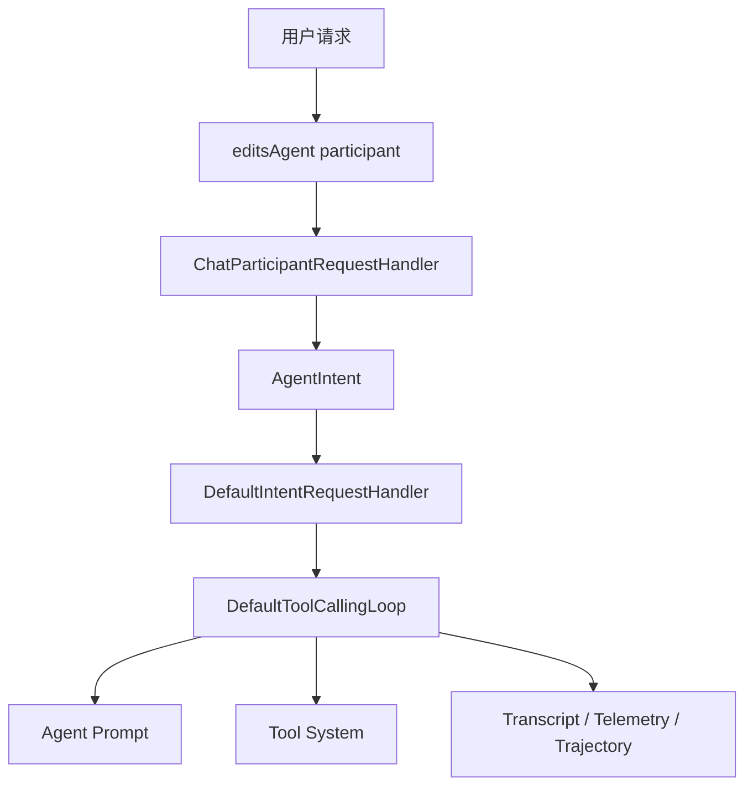

### 3.2 关键入口

项目中显式的 Agent Mode 入口是 `editsAgent`：

- Agent participant 注册：[`src/extension/conversation/vscode-node/chatParticipants.ts`](../src/extension/conversation/vscode-node/chatParticipants.ts)
- Agent 名称定义：[`src/platform/chat/common/chatAgents.ts`](../src/platform/chat/common/chatAgents.ts)
- Agent intent 定义：[`src/extension/intents/node/agentIntent.ts`](../src/extension/intents/node/agentIntent.ts)

这说明 Agent Mode 并非临时拼接出的模式，而是系统内部具有稳定身份和明确生命周期的 chat participant。

---

## 4. 核心概念与角色分工

### 4.1 Participant

**Participant** 可以理解为“聊天系统向用户暴露的角色入口”。

在这个项目里：

- `default` 更像通用顾问
- `editingSession` 更像受限编辑助手
- `editsAgent` 则是 Agent Mode 的自治执行入口

### 4.2 Intent

**Intent** 可以理解为“系统对当前请求所采用的处理模式”。

例如：

- `Edit` 表示按编辑模式处理
- `AskAgent` 表示默认聊天里走带工具能力的 ask-agent 流程
- `Agent` 表示显式进入自治执行模式

项目里 `Intent.Agent` 的值是 `editAgent`，定义在 [`src/extension/common/constants.ts`](../src/extension/common/constants.ts)。

### 4.2.1 到底是谁决定这次请求用哪一种 Intent

这是一个非常关键、而且很容易被误解的问题。

先说结论：**在当前 Copilot Chat Agent Mode 实现里，intent 的决定权主要在代码侧，不在大语言模型侧。** 更准确地说，是“请求编排代码先决定这次请求按哪条执行路径进入系统”，然后后续才会进入对应 intent 的执行逻辑与 prompt 构造阶段。

也就是说，这里不是下面这种模式：

1. 先把原始请求交给 LLM。
2. 再让 LLM 自己判断“我想当 Ask、Edit 还是 Agent”。
3. 最后系统再按模型意见决定 intent。

当前实现更接近另一种模式：

1. 先由 participant 入口代码给这次请求准备一个默认 intent。
2. 如果用户显式用了某个 command，就由 command 到 intent 的映射覆盖默认值。
3. 然后 `ChatParticipantRequestHandler` 再把这个 intent 解析成真正的 intent 对象。
4. 只有在 intent 已经确定之后，系统才进入该 intent 对应的处理链路。

所以，至少在 Agent Mode 这条主路径里，**intent selection 是 pre-LLM orchestration，不是 LLM-driven arbitration**。

源码里的决定链可以直接拆成三步。

第一步：participant 入口先给出默认 intent。

在 [getChatParticipantHandler](../src/extension/conversation/vscode-node/chatParticipants.ts#L197) 里，`defaultIntentIdOrGetter` 会先被计算成 `defaultIntentId`。对于 `editsAgent` 这种显式 Agent participant，这个默认值在注册时就已经绑定为 `Intent.Agent`，见 [registerEditsAgent](../src/extension/conversation/vscode-node/chatParticipants.ts#L141)。

第二步：如果请求带 command，就由代码映射覆盖默认 intent。

同一段代码里会先查 `agentsToCommands[defaultIntentId]`，然后根据 `request.command` 得到最终 `intentId`：

1. 如果 command 存在，并且这个 participant 支持该 command，就选 command 对应的 intent。
2. 否则就回退到默认 intent。

这一步完全是代码映射，不涉及模型参与，也不是“模型和代码一起投票”。

第三步：`ChatParticipantRequestHandler` 再把 `intentId` 解析成真正的 intent 对象。

在 [ChatParticipantRequestHandler.getResult](../src/extension/prompt/node/chatParticipantRequestHandler.ts#L204) 里，系统先根据 `chatAgentArgs.intentId` 取到 command，再在 [selectIntent](../src/extension/prompt/node/chatParticipantRequestHandler.ts#L283) 中返回真正的 `IIntent`：

1. 对 panel/chat participant 路径，通常就是 `command?.intent`。
2. 对 editor inline chat，存在少量本地启发式分支，例如首轮空行更偏 `Generate`、跨行选区更偏 `Edit`。
3. 如果没有匹配到，就回退到 `unknownIntent`。

这里也可以看出另一个重要事实：即便系统会做“判断”，这个判断依然是**代码里的规则判断**，不是把意图选择外包给 LLM。

### 4.2.2 那大语言模型在 Intent 决策里有没有任何作用

如果严格问“最终拍板当前 intent 是谁”，答案仍然是：**代码**。

但如果问“LLM 在整个请求前期有没有任何影响周边决策的地方”，那要区分主路径和旁路。

在这段主链路里，有一个容易让人误会的点是 [promptCategorizerService.categorizePrompt](../src/extension/conversation/vscode-node/chatParticipants.ts#L216)。它会对首轮 prompt 做分类，但这一步是 fire-and-forget 的分类/分析路径，并没有被用来给当前请求选 intent。也就是说，它不是“先跑一个模型，再由模型决定 intent”的路由器。

因此，当前可以把关系概括成下面这张表：

| 说法 | 是否准确 | 更准确的版本 |
| --- | --- | --- |
| intent 是模型自己决定的 | 不准确 | 当前主路径里 intent 由代码在进入 LLM 前决定 |
| intent 是代码和模型协商后选出来的 | 不准确 | 当前没有“代码 + LLM 联合选举 intent”的主链机制 |
| intent 是 participant + command + 本地规则共同决定的 | 准确 | 这是当前实现里最接近真实情况的表述 |
| 确定了 intent 之后，才进入对应的 LLM 执行链 | 准确 | intent 先于 prompt/build/fetch |

如果把这个问题放回 Agent Mode 语境里，用一句最短的话概括就是：

> 不是模型先决定“我要当 Agent”，而是系统先因为你进了 `editsAgent` participant 或命中了相应 command，把这次请求路由到 `Intent.Agent`，然后模型才在这个既定 intent 下开始工作。

这也是为什么上篇一直把 intent 放在 orchestration / strategy 侧，而不是放在 prompt 或 loop 内部。它在架构位置上更像“执行协议选择器”，而不是“模型运行中自发涌现出来的身份”。

### 4.2.3 当前代码库里的全量 Intent 总表

这一节回答一个比“谁决定 intent”更落地的问题：**一旦 intent 选定，系统接下来到底会走哪条执行链。**

先给一个总原则，否则下面的大表很容易看花：

1. 如果某个 intent 只实现了 `invoke(...)`，那么它的主路径通常是 `intent.invoke(...) -> DefaultIntentRequestHandler -> runWithToolCalling(...) -> DefaultToolCallingLoop`。
2. 这里的 “走了 loop” 不等于 “一定会发生很多次工具调用”。很多 intent 只是复用了同一套默认执行框架，但可用工具很少，甚至主要是一次 prompt/render + response processor。
3. 真正和 Agent Mode 最相关的“强自治、多轮工具调用、subagent 委派”，主要集中在 `Agent` / `AskAgent` / `Edit` / `notebookEditor` / `InlineChat` 这些链路上；其他很多 intent 更像是复用统一外壳的专用 prompt 模式。

另外要先分清两类名字：

1. **已注册 intent**：在 [../src/extension/intents/node/allIntents.ts](../src/extension/intents/node/allIntents.ts) 里真正注册到 `IntentRegistry` 的实现。
2. **枚举/路由标签**：在 [../src/extension/common/constants.ts](../src/extension/common/constants.ts) 的 `Intent` 枚举里存在，但不一定对应一个独立注册类；有些只是 participant/command 路由层使用的标签。

下面这张表先覆盖当前已注册的 intent。

| Intent | 选定后接下来的动作，包括 calling / loop | 代码参考 | 注释 |
| --- | --- | --- | --- |
| `Doc` | `invoke(...)` 返回 `DocInvocation`，然后走默认请求处理链；主路径仍是 `DefaultIntentRequestHandler -> runWithToolCalling(...) -> DefaultToolCallingLoop` | [../src/extension/intents/node/docIntent.tsx](../src/extension/intents/node/docIntent.tsx) | 面向 editor 的补文档注释 intent；响应解释器会把输出转成流式文档插入，而不是 Agent 风格的多工具自治 |
| `Edit` | `handleRequest(...)` 先处理确认编辑、可选 code-search 预处理；若命中 codebase 预处理会先跑 `CodebaseToolCallingLoop`，随后进入 `EditIntentRequestHandler`，再回到默认请求处理链和 `DefaultToolCallingLoop` | [../src/extension/intents/node/editCodeIntent.ts](../src/extension/intents/node/editCodeIntent.ts) | 最容易误读的一行。`CodebaseToolCallingLoop` 不是它的唯一主 loop，而是某个前置分支；主执行框架仍复用默认 handler |
| `Agent` | `handleRequest(...)`；如果是 `/compact`，直接走会话压缩分支；否则复用 `EditCodeIntent` 的主链，只是带上 Agent 专属 handler 选项，最终仍落到默认请求处理链和 `DefaultToolCallingLoop` | [../src/extension/intents/node/agentIntent.ts](../src/extension/intents/node/agentIntent.ts) | Agent Mode 的顶层主 intent。search/execution subagent loop 是它运行过程中可能派生出来的内部执行单元，不是另一行独立 top-level intent |
| `Search` | `invoke(...)` 返回 `SearchIntentInvocation`，然后走默认请求处理链和 `DefaultToolCallingLoop` | [../src/extension/intents/node/searchIntent.ts](../src/extension/intents/node/searchIntent.ts) | 目标是生成 workspace search 参数，并通过 response processor 追加搜索 follow-up 按钮；更像“搜索参数规划器” |
| `Tests` | `handleRequest(...)` 先进入自定义 `RequestHandler`，选择从 source 还是从 test 语境生成，再复用默认请求处理链和 `DefaultToolCallingLoop` | [../src/extension/intents/node/testIntent/testIntent.tsx](../src/extension/intents/node/testIntent/testIntent.tsx) | 有自己的一层前置语境决策，但最终仍落回统一 handler 外壳 |
| `Fix` | `invoke(...)` 返回 panel 或 inline 的 fix invocation，再进入默认请求处理链和 `DefaultToolCallingLoop` | [../src/extension/intents/node/fixIntent.ts](../src/extension/intents/node/fixIntent.ts) | panel/editor/notebook 路径会选不同 invocation，但不是一个单独自定义 loop 系统 |
| `Explain` | `invoke(...)` 返回 explain invocation，再进入默认请求处理链和 `DefaultToolCallingLoop` | [../src/extension/intents/node/explainIntent.ts](../src/extension/intents/node/explainIntent.ts) | 典型的“专用 prompt + 默认外壳” intent |
| `Review` | `invoke(...)` 返回 panel 或 inline review invocation，再进入默认请求处理链和 `DefaultToolCallingLoop` | [../src/extension/intents/node/reviewIntent.ts](../src/extension/intents/node/reviewIntent.ts) | inline 分支会挂 review 专用 response interpreter，但外层执行骨架仍是默认 handler |
| `Terminal` | `invoke(...)` 返回 `TerminalIntentInvocation`，再进入默认请求处理链和 `DefaultToolCallingLoop` | [../src/extension/intents/node/terminalIntent.ts](../src/extension/intents/node/terminalIntent.ts) | 用于“怎么在终端做某事”，不是解释上一条终端输出 |
| `TerminalExplain` | `invoke(...)` 返回 `TerminalExplainIntentInvocation`，再进入默认请求处理链和 `DefaultToolCallingLoop` | [../src/extension/intents/node/terminalExplainIntent.ts](../src/extension/intents/node/terminalExplainIntent.ts) | 专门解释最近终端发生了什么 |
| `Unknown` | `invoke(...)` 返回 generic panel/inline invocation，再进入默认请求处理链和 `DefaultToolCallingLoop` | [../src/extension/intents/node/unknownIntent.ts](../src/extension/intents/node/unknownIntent.ts) | 未命中更具体 intent 时的回退策略 |
| `Generate` | `invoke(...)` 返回 `GenericInlineIntentInvocation`，强制使用插入式编辑策略，再进入默认请求处理链和 `DefaultToolCallingLoop` | [../src/extension/intents/node/generateCodeIntent.ts](../src/extension/intents/node/generateCodeIntent.ts) | editor 首轮空白行附近常被本地规则偏向到这一行 |
| `NewNotebook` | `invoke(...)` 返回 `NewNotebookPlanningInvocation`，再进入默认请求处理链和 `DefaultToolCallingLoop` | [../src/extension/intents/node/newNotebookIntent.contribution.ts](../src/extension/intents/node/newNotebookIntent.contribution.ts) | 更像 notebook 创建规划 + response processor 链，而不是通用 agentic editing |
| `New` | `invoke(...)` 返回 `NewWorkspaceIntentInvocation`，再进入默认请求处理链和 `DefaultToolCallingLoop` | [../src/extension/intents/node/newIntent.ts](../src/extension/intents/node/newIntent.ts) | 主要面向新项目/新 workspace 脚手架类请求 |
| `VSCode` | `invoke(...)` 返回 `VSCodeIntentInvocation`，再进入默认请求处理链和 `DefaultToolCallingLoop` | [../src/extension/intents/node/vscodeIntent.ts](../src/extension/intents/node/vscodeIntent.ts) | 面向 VS Code 产品知识问答 |
| `SetupTests` | `invoke(...)`；如果 prompt 为空，先进入框架询问 invocation；否则进入 setup invocation；之后统一走默认请求处理链和 `DefaultToolCallingLoop` | [../src/extension/intents/node/setupTests.ts](../src/extension/intents/node/setupTests.ts) | 一个带前置提问分支的测试搭建 intent |
| `SearchPanel` | `invoke(...)` 返回 `SearchPanelIntentInvocation`，再进入默认请求处理链和 `DefaultToolCallingLoop` | [../src/extension/intents/node/searchPanelIntent.ts](../src/extension/intents/node/searchPanelIntent.ts) | 面向 search panel 的专用 prompt |
| `SearchKeywords` | `invoke(...)` 返回 `SearchKeywordsIntentInvocation`，再进入默认请求处理链和 `DefaultToolCallingLoop` | [../src/extension/intents/node/searchKeywordsIntent.ts](../src/extension/intents/node/searchKeywordsIntent.ts) | 更偏轻量关键词搜索生成 |
| `AskAgent` | `handleRequest(...)` 直接实例化 `DefaultIntentRequestHandler`，带上 agent-like 选项；随后进入 `runWithToolCalling(...)` 和 `DefaultToolCallingLoop` | [../src/extension/intents/node/askAgentIntent.ts](../src/extension/intents/node/askAgentIntent.ts) | 不是顶层 `Agent` 的别名，而是一条“用 agent prompt/工具能力来回答”的专门链路 |
| `notebookEditor` | 继承 `EditCodeIntent` 的 `handleRequest(...)` 主链；可选先做 code-search 预处理，再进入 `EditIntentRequestHandler`，最后回到默认请求处理链和 `DefaultToolCallingLoop` | [../src/extension/intents/node/notebookEditorIntent.ts](../src/extension/intents/node/notebookEditorIntent.ts) | 本质上是 notebook 场景下的 `Edit` 变体，重写了可用工具和 request location |
| `InlineChat` | `handleRequest(...)` 完全自定义。旧链路会先本地选 intent，再进入 `DefaultIntentRequestHandler`；新链路则进入 inline chat 自己的 edit strategy/tool strategy 执行系统，不直接复用普通 `ChatParticipantRequestHandler` 主链 | [../src/extension/inlineChat/node/inlineChatIntent.ts](../src/extension/inlineChat/node/inlineChatIntent.ts) | 这是最“例外”的一行。它不是普通 panel intent 的一个轻微变种，而是有自己专门的 inline runtime |

上表之外，还要把 **枚举里存在、但不应直接等同为一个独立注册 intent 类** 的项单独列出来，否则读代码时很容易误会。

| 枚举/路由标签 | 当前状态 | 代码参考 | 注释 |
| --- | --- | --- | --- |
| `SemanticSearch` | 在 `Intent` 枚举里存在，但不在当前 `IntentRegistry` 注册表中作为独立 intent 类出现 | [../src/extension/common/constants.ts](../src/extension/common/constants.ts)<br/>[../src/extension/intents/node/allIntents.ts](../src/extension/intents/node/allIntents.ts) | 更像历史/路由层标签，而不是当前这套 node intents 里的独立实现 |
| `Editor` | 在 `Intent` 枚举和 `agentsToCommands` 映射里存在，但不在当前 `IntentRegistry` 里单独注册 | [../src/extension/common/constants.ts](../src/extension/common/constants.ts)<br/>[../src/extension/intents/node/allIntents.ts](../src/extension/intents/node/allIntents.ts) | 它更多是 participant/command 路由侧的名字，不应直接理解成一行和 `Edit` 平级的 node intent 实现 |

如果把这张表再压缩成一句架构判断，可以得到一个很实用的经验法则：

> 绝大多数 intent 的差异，主要体现在 `invoke(...)` 产出的 invocation、prompt、response processor 和可用工具集合；真正的“外层执行骨架”大量复用了 `DefaultIntentRequestHandler + runWithToolCalling(...) + DefaultToolCallingLoop`。只有少数 intent 会在进入这套默认骨架之前，先做显式的自定义前置分支或完全改走自己的 runtime。

#### 4.2.3.1 Agent 里的“按模型能力和配置筛选工具”到底是谁决定的

先说结论：**这一步的最终决定权仍然在代码侧。** 但如果再说得更精确一点，它不是“纯硬编码”，而是一个 **代码主导、读取配置、读取模型能力、读取当前请求状态、再做最终收敛** 的过程。

换句话说，真正的结构不是：

1. 先把所有工具告诉 LLM。
2. 再让 LLM 说“我这次想用哪些工具”。
3. 系统再按 LLM 意见隐藏一部分工具。

当前实现更接近下面这四层。

**第一层：intent / loop 先定义“候选工具集合”。**

这是最上游的门。不同 intent、不同内部 loop，会先从代码上决定“这一类请求理论上允许看到哪些工具”。

例如：

1. `Agent` 主链通过 [src/extension/intents/node/agentIntent.ts](src/extension/intents/node/agentIntent.ts) 里的 `getAgentTools(...)` 组装候选工具。
2. `AskAgent` 只拿带 `vscode_codesearch` tag 的工具，再加上当前请求显式引用的工具，见 [src/extension/intents/node/askAgentIntent.ts](src/extension/intents/node/askAgentIntent.ts)。
3. `notebookEditor` 只拿 notebook 编辑相关工具，见 [src/extension/intents/node/notebookEditorIntent.ts](src/extension/intents/node/notebookEditorIntent.ts)。
4. `VSCode` intent 只暴露扩展搜索和 VS Code API 两类工具，见 [src/extension/intents/node/vscodeIntent.ts](src/extension/intents/node/vscodeIntent.ts)。
5. `searchSubagent` 和 `executionSubagent` 更严格，分别只暴露搜索集和终端执行集，见 [src/extension/prompt/node/searchSubagentToolCallingLoop.ts](src/extension/prompt/node/searchSubagentToolCallingLoop.ts) 与 [src/extension/prompt/node/executionSubagentToolCallingLoop.ts](src/extension/prompt/node/executionSubagentToolCallingLoop.ts)。

这一层已经说明，**不是所有 intent 都把同一套大工具箱交给模型。**

**第二层：候选集合内部，再按模型能力、实验配置、环境状态做硬条件裁剪。**

`Agent` 是这里最典型的一条链。它在 [src/extension/intents/node/agentIntent.ts](src/extension/intents/node/agentIntent.ts) 的 `getAgentTools(...)` 里，会继续读取：

1. **模型能力**：
    - `modelSupportsReplaceString(...)`
    - `modelSupportsMultiReplaceString(...)`
    - `modelSupportsApplyPatch(...)`
    - `modelCanUseApplyPatchExclusively(...)`
    - `modelCanUseReplaceStringExclusively(...)`

    也就是说，像 `replace_string`、`multi_replace_string`、`apply_patch` 这些编辑工具，是否可见，首先要看当前 endpoint/model 能不能稳妥支持。

2. **实验/配置开关**：
    - `SearchSubagentToolEnabled`
    - `ExecutionSubagentToolEnabled`
    - `Gemini3MultiReplaceString`
    - `Gpt5AlternativePatch`

    所以 search subagent / execution subagent 并不是永远存在，而是受配置与实验开关控制。

3. **环境状态**：
    - 当前 workspace 是否存在测试，决定 `CoreRunTest`
    - 当前 workspace 是否存在 task，决定 `CoreRunTask`

4. **请求状态**：
    - `request.permissionLevel === 'autopilot'` 时，才显式开启 `task_complete`
    - 如果请求里通过 tool picker 或兼容逻辑禁用了 `EditFilesPlaceholder`，会连带关掉 `ApplyPatch` / `EditFile` / `ReplaceString` / `MultiReplaceString`

5. **模型特例**：
    - 例如 `grok-code` 家族会禁用 `CoreManageTodoList`
    - Anthropic custom tool search 会单独决定是否暴露 `CUSTOM_TOOL_SEARCH_NAME`

所以到这里你可以看到，这一步本质上是：

> **代码读取“当前请求 + 当前模型 + 当前配置 + 当前环境”的状态，然后同步算出一份工具白名单。**

**第三层：通用 ToolsService 再把“请求级工具选择”和“模型覆盖”合并进去。**

上面只是某个 intent 自己的候选逻辑。真正统一收口的是 [src/extension/tools/vscode-node/toolsService.ts](src/extension/tools/vscode-node/toolsService.ts) 的 `getEnabledTools(...)`。

它会继续做几件事：

1. 如果 tool picker 明确把某个工具关掉，直接禁用。
2. 如果调用方传了 `filter(...)`，按调用方要求显式开/关。
3. 如果 `request.toolReferences` 中某个工具带有 `enable_other_tool_*` 标签，可以间接启用别的工具。
4. 如果某个工具是在另一个工具调用期间动态装进来的扩展工具，并带有 `extension_installed_by_tool` 标签，也可以被放行。
5. 如果 endpoint 有 model-specific tool override，会用该模型对应的定义覆盖默认工具定义。

也就是说，**intent 代码不是唯一来源；它只是“这一轮从业务语义上先怎么收窄”的来源。最终真正交给模型的工具列表，还要过一遍统一工具服务的规则。**

**第四层：DefaultToolCallingLoop 还会做一次工具分组/压缩优化。**

在 [src/extension/prompt/node/defaultIntentRequestHandler.ts](src/extension/prompt/node/defaultIntentRequestHandler.ts) 里，`DefaultToolCallingLoop.getAvailableTools(...)` 不会直接把 invocation 给出的原始工具集合原封不动交给模型，而是还可能经过 `toolGrouping.compute(...)`。

对应的实现见 [src/extension/tools/common/virtualTools/toolGrouping.ts](src/extension/tools/common/virtualTools/toolGrouping.ts)。这一步做的是：

1. 对工具做分组
2. 按 query 做 embedding/相关性重排
3. 超过阈值时折叠部分工具
4. 对用户已显式引用的工具优先展开

这也是为什么 UI 上会出现 “Optimizing tool selection...” 的进度提示。

但这里仍然要强调：**这一步依然是代码侧的工具编排，不是主 LLM 在“投票决定自己想看什么工具”。** 更准确地说，它是一个检索/分组/裁剪逻辑，而不是一次独立的模型协商过程。

#### 4.2.3.2 那大语言模型在工具选择里到底有没有参与

如果你问的是“最终有哪些工具可见，是不是由模型拍板”，答案是：**不是。**

如果你问的是“模型有没有任何选择权”，答案要分成两段：

1. **在工具暴露阶段没有。**
    - 哪些工具进入 prompt/tool schema，是代码先算好的。
    - 代码会读取配置、模型能力、实验开关、workspace 状态、tool picker 状态。
    - 但不会先问 LLM “你想不想要这个工具”。

2. **在工具使用阶段有。**
    - 一旦某组工具已经暴露给模型，模型可以在这些可见工具里决定这轮先调用谁、要不要继续调用、参数怎么填。
    - 这属于“使用已暴露工具”的决策，而不是“定义可暴露工具集合”的决策。

所以最准确的说法应该是：

> **工具集合的边界由代码和配置决定；LLM 只在这个边界内部做策略选择。**

#### 4.2.3.3 当前代码库里最重要的 intent / agent tool matrix

如果你想要一个最实用的“矩阵视图”，当前代码里最值得看的不是“每个 intent 全都列一遍”，而是 **哪些 intent / agent loop 真正自定义了工具集合**。

下面这张表把最重要的几条列出来。

| intent / agent loop | 工具集合来源 | 暴露给模型的工具 | 额外门槛 |
| --- | --- | --- | --- |
| `Agent` | [src/extension/intents/node/agentIntent.ts](src/extension/intents/node/agentIntent.ts) 的 `getAgentTools(...)` | 编辑工具族 `EditFile / ReplaceString / MultiReplaceString / ApplyPatch`，任务工具 `CoreRunTest / CoreRunTask`，子代理工具 `SearchSubagent / ExecutionSubagent`，以及少量特殊工具如 `task_complete`、Anthropic custom tool search | 受模型能力、实验开关、workspace 是否有 tests/tasks、permissionLevel、tool picker、模型家族特例共同控制 |
| `AskAgent` | [src/extension/intents/node/askAgentIntent.ts](src/extension/intents/node/askAgentIntent.ts) | 带 `vscode_codesearch` tag 的工具，加上当前请求显式引用的工具 | 更偏 search/ask 路径，没有 `Agent` 那么宽的执行工具面 |
| `Edit` | [src/extension/intents/node/editCodeIntent.ts](src/extension/intents/node/editCodeIntent.ts) | 默认没有一套单独的“主 loop 工具白名单”；但如果命中 code-search 预处理，会先进入 `CodebaseToolCallingLoop` | 是否先跑 code-search 取决于配置和 `request.toolReferences` 里是否引用 `CodebaseTool` |
| `notebookEditor` | [src/extension/intents/node/notebookEditorIntent.ts](src/extension/intents/node/notebookEditorIntent.ts) | `EditFile`，以及 notebook 相关工具 `EditNotebook / GetNotebookSummary / RunNotebookCell / ReadCellOutput`，外加所有带 `notebooks` tag 的工具 | 是否附加 notebook 摘要/运行工具，还会看当前请求是否真的带 notebook refs |
| `VSCode` | [src/extension/intents/node/vscodeIntent.ts](src/extension/intents/node/vscodeIntent.ts) | `vscode_searchExtensions_internal` 与 `VSCodeAPI` | 明显是产品知识问答，不是通用 agent 执行链 |
| `CodebaseToolCallingLoop` | [src/extension/prompt/node/codebaseToolCalling.ts](src/extension/prompt/node/codebaseToolCalling.ts) | 所有带 `vscode_codesearch` tag 的工具 | 主要作为 `Edit` 前置 code-search 预处理，不是顶层 intent |
| `searchSubagent` | [src/extension/prompt/node/searchSubagentToolCallingLoop.ts](src/extension/prompt/node/searchSubagentToolCallingLoop.ts) | `Codebase`、`FindFiles`、`FindTextInFiles`、`ReadFile` | endpoint 可能来自主模型、配置模型或 agentic proxy；但工具集合本身被硬限制为搜索集 |
| `executionSubagent` | [src/extension/prompt/node/executionSubagentToolCallingLoop.ts](src/extension/prompt/node/executionSubagentToolCallingLoop.ts) | `CoreRunInTerminal` | endpoint 可配置；若配置模型不支持 tool calling 会回退主 endpoint |
| 其他大多数 intent，如 `Doc` / `Explain` / `Review` / `Terminal` / `Search` / `Generate` / `Unknown` | 各自 invocation / prompt 类 | 通常没有像 `Agent` 这样一套专门的 agentic tool 白名单，更多是“专用 prompt + 默认外壳” | 主要差异在 prompt、response processor、上下文构造，而不是工具编排 |

这张表还有一个很重要的阅读结论：

> **当前代码库里，真正把“工具筛选”做成一等架构问题的，集中在 `Agent`、`AskAgent`、`notebookEditor` 以及几个内部 subagent loop；并不是每个 intent 都拥有一套同等级别的工具系统。**

#### 4.2.3.4 源码审计版工具矩阵

如果把前面的解释进一步压成一张更偏工程实现的表，可以得到下面这张“源码审计版工具矩阵”。

这张表只关心五件事：

1. `getAvailableTools` 或等价工具入口在哪
2. 最终暴露给模型的工具大致有哪些
3. 配置/实验开关会不会影响它
4. 模型能力会不会影响它
5. 这一条链本身会不会再进入 subagent

| intent / loop | `getAvailableTools` 入口 | 最终工具名清单 | 配置 / 实验门槛 | 模型能力门槛 | 是否会进入 subagent |
| --- | --- | --- | --- | --- | --- |
| `Agent` | [src/extension/intents/node/agentIntent.ts](src/extension/intents/node/agentIntent.ts) 的 `getAgentTools(...)`，由 [src/extension/intents/node/agentIntent.ts](src/extension/intents/node/agentIntent.ts) 的 `AgentIntentInvocation.getAvailableTools()` 调用 | `EditFile`、`ReplaceString`、`MultiReplaceString`、`ApplyPatch`、`CoreRunTest`、`CoreRunTask`、`SearchSubagent`、`ExecutionSubagent`、`task_complete`、`CUSTOM_TOOL_SEARCH_NAME` 等 | `SearchSubagentToolEnabled`、`ExecutionSubagentToolEnabled`、`Gemini3MultiReplaceString`、`Gpt5AlternativePatch`，以及 tests/tasks 是否存在、`permissionLevel`、tool picker 状态 | `modelSupportsReplaceString`、`modelSupportsMultiReplaceString`、`modelSupportsApplyPatch`、`modelCanUseApplyPatchExclusively`、`modelCanUseReplaceStringExclusively`，以及部分模型家族特例 | 会。主链可调用 `searchSubagent` 与 `executionSubagent` |
| `AskAgent` | [src/extension/intents/node/askAgentIntent.ts](src/extension/intents/node/askAgentIntent.ts) 的 `AskAgentIntentInvocation.getAvailableTools()` | 所有带 `vscode_codesearch` tag 的工具，加上当前请求显式引用的工具 | 无专属布尔开关，但受请求里显式 `toolReferences` 影响 | 通过 `ToolsService.getEnabledTools(...)` 间接受 endpoint / override 影响；无 `Agent` 那种复杂编辑能力判断 | 不会主动派生 `searchSubagent` / `executionSubagent`；本身更像 ask + search |
| `Edit` | [src/extension/intents/node/editCodeIntent.ts](src/extension/intents/node/editCodeIntent.ts) 的 `EditCodeIntentInvocation.getAvailableTools()`，默认返回 `undefined` | 主 loop 默认没有专门工具白名单，可视为“默认不主动暴露 agent 工具”；但前置 code-search 分支可调用 `CodebaseToolCallingLoop` | 是否进入前置 code-search 取决于 `CodeSearchAgentEnabled` / `Advanced.CodeSearchAgentEnabled`，以及 `request.toolReferences` 是否包含 `CodebaseTool` | 前置 code-search 使用其自身 endpoint 和工具集；`Edit` 主 invocation 本身无显式能力筛选逻辑 | 不会进入 `searchSubagent` / `executionSubagent`；最多先跑 code-search 预处理 |
| `notebookEditor` | [src/extension/intents/node/notebookEditorIntent.ts](src/extension/intents/node/notebookEditorIntent.ts) 的 `NotebookEditorIntentInvocation.getAvailableTools()`，内部复用 [src/extension/intents/node/editCodeIntent2.ts](src/extension/intents/node/editCodeIntent2.ts) 风格 | `EditFile`、`EditNotebook`、`GetNotebookSummary`、`RunNotebookCell`、`ReadCellOutput`，以及所有带 `notebooks` tag 的工具 | 是否把 notebook 运行/摘要工具加入集合，取决于当前请求是否真的带 notebook refs | `EditCodeIntent2` 内部仍会看 `modelSupportsReplaceString` / `modelSupportsMultiReplaceString` 决定是否加入字符串替换类工具 | 不会进入 `searchSubagent` / `executionSubagent` |
| `VSCode` | [src/extension/intents/node/vscodeIntent.ts](src/extension/intents/node/vscodeIntent.ts) 的 `VSCodeIntentInvocation.getAvailableTools()` | `vscode_searchExtensions_internal`、`VSCodeAPI` | 无专属实验开关 | 无显式模型能力分支；主要通过通用 `ToolsService` 规则放行 | 不会 |
| `CodebaseToolCallingLoop` | [src/extension/prompt/node/codebaseToolCalling.ts](src/extension/prompt/node/codebaseToolCalling.ts) 的 `getAvailableTools()` | 所有带 `vscode_codesearch` tag 的工具 | 无专属实验开关；由调用方是否进入这条前置分支决定 | 无专属模型能力判断 | 不会；这是 `Edit` 前置分支，不再派生 subagent |
| `searchSubagent` | [src/extension/prompt/node/searchSubagentToolCallingLoop.ts](src/extension/prompt/node/searchSubagentToolCallingLoop.ts) 的 `getAvailableTools()` | `Codebase`、`FindFiles`、`FindTextInFiles`、`ReadFile` | `SearchSubagentModel`、`SearchSubagentUseAgenticProxy`、`SearchSubagentToolCallLimit` 会影响所用模型与回合数 | endpoint 可切到配置模型或 agentic proxy，但工具集合本身被硬限制为搜索集 | 这是 subagent 本身，不再继续派生子 subagent |
| `executionSubagent` | [src/extension/prompt/node/executionSubagentToolCallingLoop.ts](src/extension/prompt/node/executionSubagentToolCallingLoop.ts) 的 `getAvailableTools()` | `CoreRunInTerminal` | `ExecutionSubagentModel`、`ExecutionSubagentToolCallLimit` | 如果配置模型不支持 tool calls，会回退主请求 endpoint | 这是 subagent 本身，不再继续派生子 subagent |
| `InlineChat` 新 runtime | 不走普通 node intent 的 `invocation.getAvailableTools()`，而是在 [src/extension/inlineChat/node/inlineChatIntent.ts](src/extension/inlineChat/node/inlineChatIntent.ts) 的 `InlineChatEditToolsStrategy._getAvailableTools(...)` 中单独处理 | 以 `ApplyPatch`、`EditFile`、`ReplaceString`、`MultiReplaceString` 为核心的 inline 编辑工具集，另带退出工具 | 受 `inlineChat.enableV2`、是否大文件、以及 inline chat 自己的策略选择影响 | 明确要求 `endpoint.supportsToolCalls`，否则直接不能走新 runtime | 不会经过 `searchSubagent` / `executionSubagent` |
| `Doc` / `Explain` / `Review` / `Terminal` / `TerminalExplain` / `Search` / `SearchPanel` / `SearchKeywords` / `Generate` / `Unknown` / `Fix` / `Tests` / `SetupTests` / `New` / `NewNotebook` | 当前这些 node intents 的 invocation 没有像 `Agent` / `AskAgent` / `VSCode` / `notebookEditor` 那样显式重写一套独立工具白名单入口 | 通常可以视为“没有专门的 agentic tool 暴露矩阵”；它们主要依赖 prompt、response processor、上下文构造，而不是一组丰富工具 | 各自可能有前置分支或语境选择，但不是以“动态工具编排”作为主特征 | 无统一的模型能力筛选矩阵；最多继承默认 endpoint 行为 | 通常不会 |

这里最容易误读的有三点。

第一，**不是所有 intent 都真的在“给模型一组工具”。**

很多 intent 虽然复用了 `DefaultIntentRequestHandler + DefaultToolCallingLoop` 这个外壳，但它们自己的 invocation 并没有显式提供一套丰富的可调用工具，因此从行为上更接近“专用 prompt + 专用 response processor + 默认执行外壳”。

第二，**`Edit` 和 `Agent` 不能简单等同。**

`Agent` 的工具系统是显式设计过的，主链里就会认真计算工具白名单；而 `Edit` 更像“编辑语义 + 可选 code-search 预处理 + 默认执行框架”，它没有 `Agent` 那种大而全的 agent 工具面。

第三，**`InlineChat` 是这一节的例外值。**

它虽然也注册在 `IntentRegistry`，但新 runtime 已经开始走 inline chat 自己的工具策略，不应和普通 panel / agent path 的 node-intent 工具暴露逻辑完全混为一谈。

#### 4.2.3.5 横向对比版工具暴露表

如果你更关心“某个 intent / loop 到底能不能看到某个工具”，那最直观的方式就是把工具摊成列。

先约定四种标记：

| 标记 | 含义 |
| --- | --- |
| `直接` | 主链会把这类工具直接暴露给模型 |
| `条件` | 只有在模型能力、配置、实验开关、请求状态或 workspace 状态满足时才暴露 |
| `前置` | 不是主 loop 工具，而是某个前置分支里会用到 |
| `-` | 不暴露 |

下面这张表只挑最关键的工具族，不试图把所有零散工具一口气全铺开。

| intent / loop | `EditFile` | `ReplaceString` | `MultiReplaceString` | `ApplyPatch` | 搜索工具族 | `RunTest` | `RunTask` | `SearchSubagent` | `ExecutionSubagent` | `RunInTerminal` | Notebook 工具族 | VS Code 工具族 | 备注 |
| --- | --- | --- | --- | --- | --- | --- | --- | --- | --- | --- | --- | --- | --- |
| `Agent` | `条件` | `条件` | `条件` | `条件` | `-` | `条件` | `条件` | `条件` | `条件` | `-` | `-` | `-` | 最完整的 agent 工具面；编辑、任务、subagent 都集中在这里 |
| `AskAgent` | `-` | `-` | `-` | `-` | `直接` | `-` | `-` | `-` | `-` | `-` | `-` | `-` | 主要是 ask/search 路径；拿 code-search 标签工具 |
| `Edit` | `-` | `-` | `-` | `-` | `前置` | `-` | `-` | `-` | `-` | `-` | `-` | `-` | 主 loop 没有专门 agent 工具白名单；但可先跑 code-search 预处理 |
| `notebookEditor` | `直接` | `条件` | `条件` | `-` | `-` | `-` | `-` | `-` | `-` | `-` | `直接` | `-` | 本质是 notebook 编辑变体；重点在 notebook 工具与部分字符串替换工具 |
| `VSCode` | `-` | `-` | `-` | `-` | `-` | `-` | `-` | `-` | `-` | `-` | `-` | `直接` | 只回答 VS Code 产品知识，不走通用 agent 工具面 |
| `CodebaseToolCallingLoop` | `-` | `-` | `-` | `-` | `直接` | `-` | `-` | `-` | `-` | `-` | `-` | `-` | `Edit` 前置 code-search 分支本体 |
| `searchSubagent` | `-` | `-` | `-` | `-` | `直接` | `-` | `-` | `-` | `-` | `-` | `-` | `-` | 工具集合被硬限制为 `Codebase / FindFiles / FindTextInFiles / ReadFile` |
| `executionSubagent` | `-` | `-` | `-` | `-` | `-` | `-` | `-` | `-` | `-` | `直接` | `-` | `-` | 工具集合被硬限制为 `CoreRunInTerminal` |
| `InlineChat` 新 runtime | `直接` | `直接` | `直接` | `直接` | `-` | `-` | `-` | `-` | `-` | `-` | `-` | `-` | inline chat 自己维护编辑工具策略，不复用 panel Agent 那套筛选逻辑 |
| `Doc` / `Explain` / `Review` / `Terminal` / `TerminalExplain` / `Search` / `SearchPanel` / `SearchKeywords` / `Generate` / `Unknown` / `Fix` / `Tests` / `SetupTests` / `New` / `NewNotebook` | `-` | `-` | `-` | `-` | `-` | `-` | `-` | `-` | `-` | `-` | `-` | `-` | 这些 intent 的主要差异不在“工具暴露矩阵”，而在 prompt、上下文与 response processor |

如果把这张表再压缩成一句话，可以得到一个很实用的判断：

> **横向看下来，真正拥有“丰富工具面”的只有 `Agent`；真正拥有“严格专用工具面”的是 `AskAgent`、`notebookEditor`、`VSCode`、`searchSubagent`、`executionSubagent` 和 `InlineChat`；而其余大多数 intent 更像 prompt 模式，而不是工具模式。**

#### 4.2.3.6 `Agent` 条件暴露判定表

上面那张横向表里，`Agent` 一行几乎全是“条件”。如果不把这些条件拆开，就很容易把 `Agent` 误读成“总是把所有工具都暴露给模型”。

实际上，[src/extension/intents/node/agentIntent.ts](src/extension/intents/node/agentIntent.ts) 的 `getAgentTools(...)` 做的是一连串同步判定。下面把最关键的条件逐条展开。

| 工具 / 工具族 | 默认倾向 | 真正放行条件 | 会被什么覆盖或反转 | 代码侧含义 |
| --- | --- | --- | --- | --- |
| `EditFile` | 倾向开启 | 如果没有 BYOK 学习结果，默认先设为 `true` | 1. BYOK 学习结果可直接改写 2. `modelCanUseApplyPatchExclusively(...)` 时会被关掉 3. `modelCanUseReplaceStringExclusively(...)` 时也会被关掉 4. tool picker 关闭 `EditFilesPlaceholder` 时会被强制关掉 | 兜底编辑工具，但在模型更适合 patch / replace-string 时会退居次要 |
| `ReplaceString` | 条件开启 | `modelSupportsReplaceString(model)` 为真，或者 BYOK 学习结果明确偏好它 | 1. BYOK 学习结果可改写 2. tool picker 关闭编辑占位工具时会被强制关掉 | 只有模型确实支持字符串替换协议时才给 |
| `MultiReplaceString` | 条件开启 | 先要求 `ReplaceString` 已可用，再要求 `modelSupportsMultiReplaceString(model)` 为真 | 1. BYOK 学习结果可改写 2. tool picker 可整体关掉 3. `gemini-3` + `Gemini3MultiReplaceString` 实验开关可以额外放开它 | 属于更强的批量字符串替换能力，不是所有模型都稳 |
| `ApplyPatch` | 条件开启 | `modelSupportsApplyPatch(model)` 为真，且工具注册表里真的存在 `ApplyPatch` | 1. BYOK 学习结果可改写 2. tool picker 关闭编辑占位工具时会被强制关掉 3. 若 `modelSupportsSimplifiedApplyPatchInstructions(model)` 且开了 `Gpt5AlternativePatch`，描述文案还会被替换 | 面向 patch 协议的强编辑能力，依赖模型和工具都可用 |
| `CoreRunTest` | 条件开启 | `testService.hasAnyTests()` 为真 | 没有 tests 就不开 | Agent 不会把“运行测试”工具暴露给一个没有测试资产的工作区 |
| `CoreRunTask` | 条件开启 | `tasksService.getTasks().length > 0` | 没有 tasks 就不开 | 同样是环境感知，不会给空工具 |
| `SearchSubagent` | 条件开启 | 同时满足：1. 当前模型是 GPT 或 Anthropic 家族 2. `SearchSubagentToolEnabled` 实验/配置打开 | 只要模型家族或开关不满足就不开 | 不是所有模型都允许 search subagent，也不是所有配置都启用它 |
| `ExecutionSubagent` | 条件开启 | 同时满足：1. 当前模型是 GPT 或 Anthropic 家族 2. `ExecutionSubagentToolEnabled` 实验/配置打开 | 只要模型家族或开关不满足就不开 | execution subagent 的入口和 search subagent 一样，先由代码做硬门控 |
| `task_complete` | 默认关闭 | 只有 `request.permissionLevel === 'autopilot'` 时才开启 | 非 autopilot 永远不开 | 这是让模型显式声明“任务完成”的信号工具，不属于普通交互模式 |
| `CUSTOM_TOOL_SEARCH_NAME` | 条件开启 | `isAnthropicCustomToolSearchEnabled(...)` 为真 | 非 Anthropic 或未启用相应配置时不开 | 属于 Anthropic 家族的特殊搜索工具通道 |
| `CoreManageTodoList` | 默认跟随通用规则 | 一般由 `ToolsService` 正常放行 | `model.family.includes('grok-code')` 时被显式关掉 | 这是一个模型家族特例，说明 Agent 工具集里也存在按模型黑名单禁用的情况 |

如果把这些判定顺序再压缩一下，可以得到一个很重要的理解方式：

1. 先看 BYOK 学习结果有没有直接给出编辑工具偏好
2. 如果没有，再按模型能力判断编辑工具协议
3. 再按环境状态决定 test / task
4. 再按实验开关与模型家族决定 subagent
5. 再按权限决定 `task_complete`
6. 最后再经过 `ToolsService.getEnabledTools(...)` 把 tool picker、tool reference、model override 等统一规则合并进去

也就是说，**`Agent` 的工具暴露不是单一 if/else，而是多层收敛后的最终白名单。**

#### 4.2.3.7 `AskAgent` / `Agent` / `InlineChat` 三者对比

这三条链很容易被一起误称为“都会动手的 agent 路径”，但从代码结构上看，它们其实代表了三种不同的产品语义。

| 维度 | `AskAgent` | `Agent` | `InlineChat` |
| --- | --- | --- | --- |
| 顶层定位 | 用 agent prompt 和工具能力来回答问题，偏 ask/search | 真正的自治执行主链，偏任务落地 | 编辑器内联编辑 runtime，偏局部代码改写 |
| 主要入口 | [src/extension/intents/node/askAgentIntent.ts](src/extension/intents/node/askAgentIntent.ts) | [src/extension/intents/node/agentIntent.ts](src/extension/intents/node/agentIntent.ts) | [src/extension/inlineChat/node/inlineChatIntent.ts](src/extension/inlineChat/node/inlineChatIntent.ts) |
| 运行位置 | `ChatLocation.Panel` | 显式 Agent mode，`overrideRequestLocation: ChatLocation.Agent` | `ChatLocation.Editor` |
| 外层执行骨架 | 直接走 `DefaultIntentRequestHandler` | 继承 `EditCodeIntent`，再落到 `DefaultIntentRequestHandler` | 旧 runtime 可复用默认 handler；新 runtime 走 inline chat 自己的工具策略与请求流程 |
| prompt 风格 | 继承 `AgentPrompt`，但 `extraPromptProps = { codesearchMode: true }` | 标准 `AgentPrompt` | 新 runtime 用 `InlineChat2Prompt` 或 `InlineChatEditCodePrompt`，不是 `AgentPrompt` |
| 主工具面 | 搜索/代码检索工具 | 编辑 + 任务 + subagent 的全量 agent 工具面 | 以局部编辑工具为核心的精简工具面 |
| `EditFile` | 通常不暴露 | 条件暴露 | 暴露，但如果有更好的编辑工具会尽量压低其优先级 |
| `ReplaceString` / `MultiReplaceString` / `ApplyPatch` | 通常不暴露 | 条件暴露 | 直接以编辑为目标暴露；但若当前 selection 非空，会主动移除 `MultiReplaceString` |
| 搜索工具族 | 直接暴露 | 主链不直接暴露为普通搜索工具，而是更倾向通过 `SearchSubagent` 间接完成 | 默认不暴露 |
| `SearchSubagent` / `ExecutionSubagent` | 不暴露 | 条件暴露 | 不暴露 |
| `RunInTerminal` | 不暴露 | 不作为主链直接工具暴露给主 LLM，而是经 `executionSubagent` 间接使用 | 不暴露 |
| 是否要求模型支持 tool calls | 实际上依赖可用工具路径，但没有像 inline chat 新 runtime 那样在入口硬报错 | Agent 模式本身就是围绕 tool-calling loop 设计的 | 新 runtime 明确要求 `endpoint.supportsToolCalls`，否则直接不能使用 |
| 对用户语义的假设 | “帮我查、帮我回答、帮我基于代码库分析” | “帮我把任务做完，并在必要时自己找线索、改代码、验证结果” | “帮我直接在当前文件/当前选区附近改代码” |
| 对工具选择的态度 | 工具面刻意窄，避免演变成全自治执行 | 工具面刻意宽，允许多轮计划-执行-验证闭环 | 工具面刻意收缩到编辑本身，尽量减少无关动作 |

这三者最短的区分可以压缩成下面三句话。

1. `AskAgent` 是 **会用搜索工具回答问题的 agent-style QA**。
2. `Agent` 是 **会自己推进任务落地的自治执行链**。
3. `InlineChat` 是 **发生在编辑器里的局部编辑 runtime**。

所以如果只说“它们都会 tool calling”，这个概括太粗。真正重要的是：

> **三者虽然都可能让模型调用工具，但它们的产品目标、prompt 形态、工具边界和运行时都不是同一种东西。**

#### 4.2.3.8 这些工具到底来自哪里：原生工具、shell、skill、MCP 分别在什么阶段进入

这一节回答一个非常关键、但前面几张表故意没有展开的问题：

> 前面看到的这些 tools，到底是不是 Copilot Chat 自己原生实现的工具？搜索、查找、修改是不是一把大工具里的不同模式，还是每个都是单独工具？shell、skill、MCP 又是在什么阶段进入系统的？

先说结论：**在当前这套 Agent Mode 实现里，“工具”并不是只有一种来源。** 更准确地说，至少要分成四类：

1. **Copilot 扩展自己注册的工具**
2. **VS Code / core 提供的内建工具**
3. **MCP 服务器发布出来的工具**
4. **skill / instructions / prompt file 这类 prompt 资源**

而这四类东西里，前 3 类才是严格意义上的 “Language Model Tools”；第 4 类多数时候根本不是 tool，而是 **prompt construction resource**。

##### 第一类：Copilot 扩展自己注册的工具

这类工具就是我们前面讨论最多的那一批，例如：

1. `Codebase`
2. `ApplyPatch`
3. `ReplaceString`
4. `MultiReplaceString`
5. `CreateFile`
6. `EditNotebook`
7. `SearchSubagent`
8. `ExecutionSubagent`

它们的共同特点是：

1. 在这个仓库里有明确实现类
2. 通过 `ToolRegistry.registerTool(...)` 注册
3. 再由 [src/extension/tools/vscode-node/tools.ts](src/extension/tools/vscode-node/tools.ts) 注册到 `vscode.lm`

这条链路可以从三层代码一起看出来：

1. [src/extension/tools/common/toolsRegistry.ts](src/extension/tools/common/toolsRegistry.ts)
    - `ToolRegistry` 维护 Copilot 自己的 tool constructors
2. [src/extension/tools/vscode-node/tools.ts](src/extension/tools/vscode-node/tools.ts)
    - `ToolsContribution` 会遍历 `toolsService.copilotTools`
    - 然后调用 `vscode.lm.registerTool(...)`
3. 具体工具实现文件
    - 例如 [src/extension/tools/node/codebaseTool.tsx](src/extension/tools/node/codebaseTool.tsx)
    - 例如 [src/extension/tools/node/applyPatchTool.tsx](src/extension/tools/node/applyPatchTool.tsx)

所以如果你问“`Codebase`、`ApplyPatch` 这些是不是 Copilot Chat 自己原生实现的”，答案是：**很多是。**

##### 第二类：它们不是“一把大工具”的不同模式，而是很多独立工具

这也是前面几张表的一个隐含前提：**搜索、查找、读取、编辑，并不是一个巨型万能工具里的子模式，而是很多单独的 tool definition。**

例如在当前代码和运行时语义里，下面这些都应该理解成独立工具：

1. `Codebase`
2. `FindFiles`
3. `FindTextInFiles`
4. `ReadFile`
5. `EditFile`
6. `ReplaceString`
7. `MultiReplaceString`
8. `ApplyPatch`
9. `CreateFile`
10. `EditNotebook`
11. `RunInTerminal`

为什么要拆这么细？因为它们在架构上承担的职责不同：

1. `Codebase` 更像语义搜索工具
2. `FindFiles` / `FindTextInFiles` 更像基于文件名或文本的检索原语
3. `ReadFile` 是读取原语
4. `EditFile` / `ReplaceString` / `MultiReplaceString` / `ApplyPatch` 是不同编辑协议
5. `RunInTerminal` 是执行原语

这也解释了为什么 `searchSubagent` 的工具集会被硬限制成 `Codebase / FindFiles / FindTextInFiles / ReadFile`，因为它们本来就是四把不同工具，不是“一把 search 工具的四种模式”。

##### 第三类：这些工具通常不是 shell 包装器，shell 只是其中一把专门工具

这里也要把一个很容易混淆的点拆开：

> 模型能不能“利用 shell 里原有的工具”？

答案是：**能，但前提是系统把“终端执行”作为一把明确的 tool 暴露给它；不是所有工具都会偷偷退化成 shell 命令。**

也就是说：

1. `Codebase` 不等于 “偷偷帮你跑 `rg`”
2. `ApplyPatch` 不等于 “偷偷帮你跑 shell 里的 `patch`”
3. `ReplaceString` 不等于 “偷偷帮你跑 `sed`”

这些工具大多数都有自己独立的扩展内实现，走的是 VS Code service / workspace API / 本地编辑逻辑，而不是先把需求翻译成 shell 再执行。

最典型的例子就是：

1. [src/extension/tools/node/codebaseTool.tsx](src/extension/tools/node/codebaseTool.tsx)
    - 它走的是 `workspaceChunkSearchService` 这类工作区语义搜索服务
2. [src/extension/tools/node/applyPatchTool.tsx](src/extension/tools/node/applyPatchTool.tsx)
    - 它有自己的 patch 解析、应用、诊断与 telemetry 逻辑

真正把 shell 暴露给模型的是专门的终端执行工具，也就是我们前面表里写的 `RunInTerminal` / `CoreRunInTerminal`。因此：

1. 如果主链没有暴露 terminal tool，模型就不能直接借壳去跑 shell 命令
2. 如果暴露了 terminal tool，模型才可以把 shell 当成一个执行后端来用
3. 在 `Agent` 主链里，主 LLM 通常不会直接看到 `RunInTerminal`，而是经 `executionSubagent` 间接使用它

所以 shell 在这里不是“所有工具的底层共用实现”，而是 **工具体系里的其中一把专门执行工具**。

##### 第四类：不是所有工具都在这个仓库里实现，有一部分来自 VS Code / core

前面几张表里你会看到一些 `Core*` 前缀的工具，例如：

1. `CoreRunInTerminal`
2. `CoreRunTest`
3. `CoreRunTask`
4. `CoreAskQuestions`
5. 各种 confirmation tool

这类工具并不一定都在这个仓库里有一份对等实现。当前这套工具系统底层读取的是 [src/extension/tools/vscode-node/toolsService.ts](src/extension/tools/vscode-node/toolsService.ts) 里的 `vscode.lm.tools`，也就是说它读到的是 **当前 VS Code 运行时里已经注册好的全部 LM tools**。

因此从 Copilot 扩展视角看，工具来源至少有两种：

1. 这个仓库自己通过 `ToolRegistry + vscode.lm.registerTool(...)` 注册进去的
2. VS Code / 其他扩展 / MCP 服务器已经注册到 `vscode.lm.tools` 里的

所以答案不是“全部都在 Copilot 仓库里原生实现”，而是：

> **有一部分是 Copilot 原生工具，有一部分是运行时环境已经提供好的工具，而 Copilot 的 `ToolsService` 统一把它们看成同一层 `LanguageModelToolInformation`。**

##### 第五类：MCP 工具是在“工具发现阶段”进入，不是在 prompt 文件阶段进入

MCP 和 skill 最容易被混在一起，但它们在体系里完全不是一回事。

先说 MCP。

从当前 `ToolsService` 的实现看，它不是只看 Copilot 自己的 registry，而是直接读取：

1. [src/extension/tools/vscode-node/toolsService.ts](src/extension/tools/vscode-node/toolsService.ts) 里的 `vscode.lm.tools`

而在同一个文件里，`invokeTool(...)` 还会专门判断：

1. `const isMcpTool = String(name).includes('mcp_')`

这说明对 Copilot 来说，**MCP tool 是运行时已发现工具池的一部分**。它不是在 prompt 渲染阶段临时拼出来的，而是先被 VS Code / MCP service 发现并注册，再进入工具池。

所以 MCP 工具进入标准 Agent path 的时机是：

1. MCP server 被配置并启动
2. VS Code / MCP service 把它发布的工具放进 `vscode.lm.tools`
3. `ToolsService.tools` 读取 `vscode.lm.tools`
4. `getEnabledTools(...)` 再根据当前 request、tool picker、filter、tool references 把其中一部分放行给当前 intent / loop

也就是说，**MCP 是在“工具发现与过滤阶段”进入的，不是在 prompt 文件/skill 阶段进入的。**

这也是为什么前面的 `Agent` 主链图里没有把 MCP 单独画成一个固定框：因为对那条链来说，MCP tool 更像“可能混入总工具池的一类外部工具来源”，而不是一个固定会发生的独立步骤。

##### 第六类：skill 大多数时候不是 tool，而是在“prompt 资源解析阶段”进入

skill 和 MCP 的最大差异在这里：**skill 在标准 Copilot Chat Agent path 里，通常不是 Language Model Tool，而是 prompt resource。**

这点可以从两组代码看出来：

1. [src/extension/agents/vscode-node/promptFileContrib.ts](src/extension/agents/vscode-node/promptFileContrib.ts)
    - 这里通过 `vscode.chat.registerSkillProvider(...)` 注册 skill provider
2. [src/extension/prompts/node/panel/chatVariables.tsx](src/extension/prompts/node/panel/chatVariables.tsx)
    - skill 文件会被当成 prompt file / chat variable 资源处理
    - `/my-skill do something` 这类 slash command 会被转换成 `Follow instructions in #my-skill with these arguments: ...`

这说明在标准面板聊天 / Agent path 里，skill 更像：

1. 一份 `SKILL.md` 指令资源
2. 在 prompt 构造阶段被解析进用户消息或 custom instructions
3. 最终影响模型“怎么思考、遵循什么步骤”

而不是像 `ReadFile` / `ApplyPatch` 那样，在 tool-calling loop 里被模型作为可调用函数来点名执行。

所以前面的 Agent tool flow 没把 skill 画进去，是因为：

> **在那条标准 `editsAgent -> DefaultIntentRequestHandler -> DefaultToolCallingLoop` 主链里，skill 通常属于 prompt shaping，不属于 tool invocation。**

##### 第七类：为什么你又会看到一个叫 `skill` 的“工具”

这里有一个非常容易混淆、但必须明确指出的例外：

在 **Copilot CLI / Claude session 那套独立 runtime** 里，`skill` 的确可以表现成一个真正的工具。

例如：

1. [src/extension/chatSessions/copilotcli/common/copilotCLITools.ts](src/extension/chatSessions/copilotcli/common/copilotCLITools.ts)
    - 定义了 `type SkillTool = { toolName: 'skill', ... }`
    - 也定义了 `'skill': [l10n.t('Invoke Skill'), ...]`

这说明“skill 作为 tool”并不是你前面那条标准 Agent Mode 文档主链的事情，而是另一套 session runtime 的能力。

所以一定要区分两种上下文：

1. **标准 Copilot Chat Agent Mode**
    - skill 主要是 prompt resource
2. **Copilot CLI / Claude session runtime**
    - skill 可能变成真正的 tool invocation

这也是为什么如果只看前面那条 Agent 主链图，会感觉 skill “消失了”：不是它不存在，而是它属于 **另一层或另一套 runtime**。

##### 最后把四类东西压成一句话

如果把这一节所有区别压成一句最短的话，可以这样记：

> **Copilot Agent path 里的搜索、读取、编辑多数是独立工具；其中一部分是 Copilot 原生实现，一部分来自 VS Code/core 或 MCP；shell 只是专门的终端执行工具，不是所有工具的共同后端；而 skill 在标准 Agent path 里通常属于 prompt 资源，不属于 tool invocation。**

#### 4.2.3.9 工具从哪里进入 Agent：来源图

如果把前面几节压成一张来源图，可以得到下面这条更接近运行时实际情况的链路。

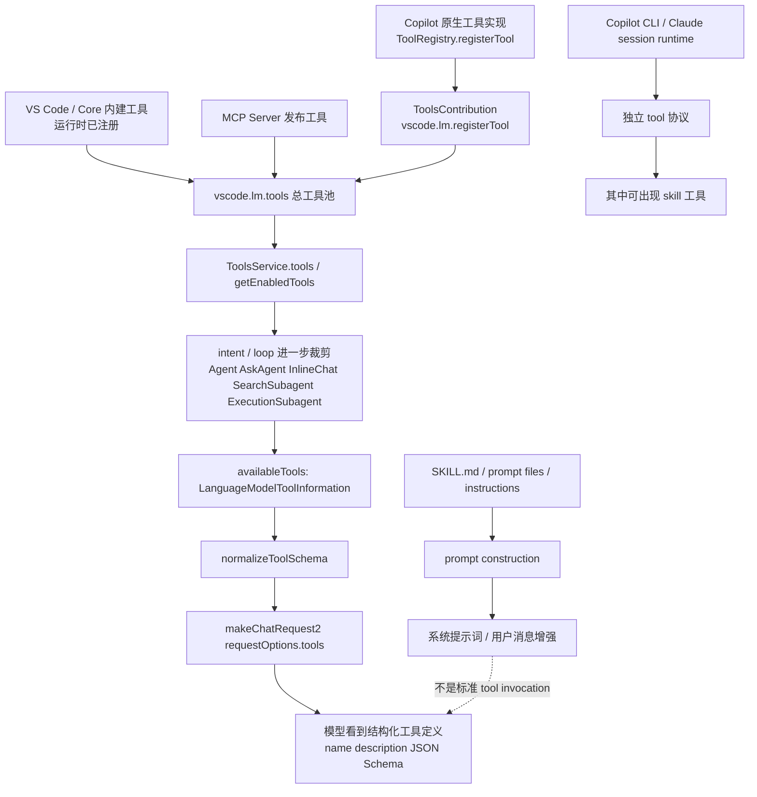

这张图里最关键的是两条不同入口：

1. `Tool` 走的是 `注册 -> 工具池 -> 过滤 -> schema 下发给模型`
2. `Skill` 在标准 Agent path 里多数走的是 `资源解析 -> prompt 注入`

所以它们不是同一条管线。

#### 4.2.3.10 四类来源矩阵

如果你想把“哪些东西算 tool，哪些只是 prompt 资源”压成一个工程审计表，可以看下面这个四列表。

| 类别 | 典型例子 | 进入系统的阶段 | 模型看到的形态 |
| --- | --- | --- | --- |
| Copilot 原生工具 | `Codebase`、`ApplyPatch`、`ReplaceString`、`SearchSubagent`、`ExecutionSubagent` | 扩展启动时由 `ToolRegistry` 注册，再由 `vscode.lm.registerTool(...)` 暴露到运行时工具池 | 标准 tool definition，带 `name`、`description`、`inputSchema` |
| VS Code / Core 工具 | `RunInTerminal`、`RunTask`、`RunTests`、`AskQuestions`、confirmation tools | VS Code runtime 或 core 侧已注册到 `vscode.lm.tools` | 标准 tool definition，和 Copilot 原生工具在 `ToolsService` 里被统一对待 |
| MCP 工具 | 各种 `mcp_*` 工具 | MCP server 启动并发布后进入 `vscode.lm.tools`，再被 `ToolsService` 读取和过滤 | 标准 tool definition，但来源是外部 server；调用时可被识别为 MCP tool |
| Prompt 资源 | `SKILL.md`、instructions、prompt files | prompt construction 阶段被解析并注入消息 | 通常不是 tool，而是 prompt 文本、约束、步骤说明 |
| CLI session 专有工具 | 独立 `skill`、`task`、`bash`、`grep` 等 | Copilot CLI / Claude session runtime 自己定义一套 tool 协议 | 是 tool，但属于另一套 session runtime，不等同于标准 Agent 面板工具 |

这个表背后的关键结论是：

1. **标准 Agent 面板看到的 tool，大多数都会被归一成 `LanguageModelToolInformation`。**
2. **prompt 资源不会自动变成 tool。**
3. **CLI session 那个独立 `skill` 工具，属于另一套 runtime 的 tool 协议，不应和 `SKILL.md` 混为一谈。**

#### 4.2.3.11 模型是怎么知道工具用法和参数的

这也是你刚才追问的核心：

> 如果工具不是只靠 prompt 里一句话，那模型到底是通过什么统一格式知道“这个工具叫什么、怎么用、参数有哪些”的？

答案是：**这里同时存在“软提示”和“硬 schema”两层机制，但真正决定调用格式的是结构化 tool schema。**

##### 第一层：运行时统一把工具整理成 `LanguageModelToolInformation`

不管工具来自 Copilot 原生注册、VS Code/core，还是 MCP，在标准 Agent path 里都会先被整理成统一的运行时对象，核心字段就是：

1. `name`
2. `description`
3. `inputSchema`

从代码上看，这个统一层来自：

1. [src/extension/tools/vscode-node/toolsService.ts](src/extension/tools/vscode-node/toolsService.ts)
2. [src/extension/intents/node/toolCallingLoop.ts](src/extension/intents/node/toolCallingLoop.ts)

所以站在 tool-calling loop 视角，模型前面并不是一堆随意的扩展对象，而是一组标准化后的 `LanguageModelToolInformation[]`。

##### 第二层：在请求发给模型前，会被转换成 provider 能理解的 function/tool declaration

标准 Agent loop 在真正发请求前，会把 `availableTools` 映射成统一的函数声明，再放进 `requestOptions.tools`。这一步在 [src/extension/intents/node/toolCallingLoop.ts](src/extension/intents/node/toolCallingLoop.ts) 里非常直接：

1. 先把每个工具映射成 `{ name, description, parameters }`
2. 再放进 `requestOptions.tools`
3. 最后通过 `makeChatRequest2(...)` 发给具体模型 provider

而在 [src/extension/prompt/node/defaultIntentRequestHandler.ts](src/extension/prompt/node/defaultIntentRequestHandler.ts) 里，还会在真正发送前调用 `normalizeToolSchema(...)`，对 schema 做兼容性修正，例如：

1. 保证参数 schema 是 object
2. 补齐空 description
3. 去掉某些模型不支持的 JSON Schema 关键字
4. 针对 Gemini、GPT、Claude 做兼容变形

也就是说，模型收到的不是“自然语言随便描述一下这个工具怎么用”，而是类似下面这种结构化定义：

```json
{
    "type": "function",
    "function": {
        "name": "read_file",
        "description": "Read the contents of a file.",
        "parameters": {
            "type": "object",
            "properties": {
                "filePath": { "type": "string" },
                "startLine": { "type": "number" },
                "endLine": { "type": "number" }
            },
            "required": ["filePath", "startLine", "endLine"]
        }
    }
}
```

这就是模型知道“参数有哪些、哪些必填、参数名是什么”的硬约束来源。

##### 第三层：不同 provider 还会把这份 schema 再翻译成各家自己的协议

虽然上游统一成了 `requestOptions.tools`，但不同模型后端仍然要做一次适配：

1. [src/extension/byok/vscode-node/anthropicProvider.ts](src/extension/byok/vscode-node/anthropicProvider.ts)
        - 会转成 Anthropic 的 `input_schema`
2. [src/extension/byok/vscode-node/geminiNativeProvider.ts](src/extension/byok/vscode-node/geminiNativeProvider.ts)
        - 会转成 Gemini 的 `functionDeclarations`
3. [src/extension/conversation/vscode-node/languageModelAccess.ts](src/extension/conversation/vscode-node/languageModelAccess.ts)
        - 也会把 VS Code 侧工具转换成 OpenAI 风格的 function tool

所以准确地说，系统里有三层格式：

1. **Copilot/VS Code 统一内部格式**：`LanguageModelToolInformation`
2. **发请求前的统一函数格式**：`requestOptions.tools` / OpenAI-style function tool
3. **各 provider 自己的最终传输格式**：Anthropic `input_schema`、Gemini `functionDeclarations` 等

##### 第四层：prompt 仍然会补“什么时候该用哪类工具”的策略说明

虽然参数格式主要靠 schema 告诉模型，但 prompt 里仍然会额外告诉模型：

1. 什么情况下优先用 `SearchSubagent`
2. 什么情况下不要并行跑终端工具
3. 读取文件时应该一次多读一点
4. 某些工具不可用时该如何退化

例如 agent prompt 里会明确写出：

1. “For codebase exploration, prefer `SearchSubagent` ...”
2. “When using a tool, follow the JSON schema very carefully ...”
3. “Tools can be disabled by the user ... only use the tools that are currently available ...”

所以模型知道工具，不是靠单一机制，而是两层配合：

1. **schema 负责工具签名与参数边界**
2. **prompt 负责工具使用策略与偏好**

最短一句话就是：

> **模型不是“猜”工具参数，而是收到结构化 tool schema；prompt 只是补充什么时候该用它。**

#### 4.2.3.12 你问的那个“独立 `skill` 工具”到底是什么

这里必须把两个同名但不同层的东西彻底拆开。

##### 第一种：`SKILL.md` / prompt skill

这个我们前面已经解释过，它在标准 Agent 面板里主要是：

1. skill provider 提供出来的 prompt 资源
2. 在 prompt construction 阶段被解析
3. 变成 “Follow instructions in #xxx ...” 这类提示内容

它通常不是标准 tool invocation。

##### 第二种：Copilot CLI / Claude session runtime 里的独立 `skill` 工具

你这里追问的“不是 prompt 那个，而是独立的 `skill` 工具”，指的就是这个。

从 [src/extension/chatSessions/copilotcli/common/copilotCLITools.ts](src/extension/chatSessions/copilotcli/common/copilotCLITools.ts) 可以直接看到：

1. 定义了 `type SkillTool = { toolName: 'skill', arguments: { skill: string } }`
2. 也定义了 `formatSkillInvocation(...)`
3. 并且把 `'skill'` 注册进这套 CLI tool 的格式化映射表里

这说明它不是“标准 Agent 面板里的某个隐藏 MCP 工具”，而是：

> **Copilot CLI / Claude session runtime 自己定义的一把专用工具，用来显式触发某个 skill。**

它的语义更接近：

1. “调用名为 `pdf` 或 `launch` 的 skill”
2. 让这套 session runtime 把对应 skill 的能力、说明或后续流程接进来

而不是像 `ReadFile` 那样直接操作工作区，也不是像 `ApplyPatch` 那样直接改文件。

##### 第三种：为什么标准 Agent 图里没把它画进去

因为前面整章主要讲的是：

1. `editsAgent`
2. `Intent` 路由
3. `DefaultIntentRequestHandler`
4. `DefaultToolCallingLoop`
5. 标准 VS Code / Copilot Agent 面板的 tool-calling path

而独立 `skill` 工具属于：

1. `chatSessions/copilotcli/...`
2. 更偏 CLI / Claude session 的另一套对话运行时

所以它不在那条主链上，前面的图故意没有把它画成标准 Agent 的固定节点。

##### 第四种：可以把它理解成什么

如果用一句最不容易混淆的话来记：

> **标准面板里的 skill 更像“提示词资源”，CLI session 里的 `skill` 更像“显式调用某个专家模块”的专用工具。**

所以以后看到 `skill` 这个词，至少先问自己：

1. 这是 `SKILL.md` 资源吗？
2. 还是 Copilot CLI runtime 里的 `toolName: 'skill'`？

这两个名字一样，但不是同一个层次的东西。

Mermaid 兼容性与安全写法已移到独立文档：[docs/mermaid-safe-writing.md](docs/mermaid-safe-writing.md)。

### 4.2.4 用 `Doc` Intent 举一个完整小案例

这一节我们不再只看抽象定义，而是顺着一个具体请求，把 `Doc` 这条链从上往下走一遍。

先说明一个容易混淆的点：**这个案例虽然仍然从“用户发起 chat 请求”开始，但真正落到 `Doc` intent 的，不是 panel 里的 `@editsAgent` 主链，而是 editor 场景下的编辑入口。**

也就是说，如果用户真的走的是 panel 里的 `@editsAgent`，默认会先落到 `Intent.Agent`；而要进入 `Doc`，更贴近真实实现的路径是：用户在编辑器里打开一段代码，然后通过 editor chat / inline chat 的方式发起“补文档注释”请求。

下面用一个相对复杂、但又完全符合 `Doc` intent 设计意图的例子。

#### 案例设定

假设用户正在看一段 TypeScript 代码，光标落在下面这个函数上，或者选中了整个函数声明：

```ts
export async function fetchWithRetry<T>(
    request: RequestInfo,
    options: {
        parseAs: 'json' | 'text';
        retries?: number;
        retryOn?: readonly number[];
        signal?: AbortSignal;
    }
): Promise<T> {
    // ...
}
```

然后用户在 editor chat 里输入这样一条请求：

> `/doc 给这个 fetchWithRetry<T> 补一份完整的 TSDoc。除了参数和返回值，还要说明泛型 T、默认重试次数、429/5xx 的重试条件、AbortSignal 的取消行为，以及最终会在什么情况下把错误继续抛出。`

这个案例比“给函数写一句注释”更复杂，因为它同时覆盖了 `Doc` 链上几个关键点：

1. 有明确的 symbol 标识符 `fetchWithRetry`。
2. 语言是 TypeScript，所以 prompt 前缀会明确要求生成 `TSDoc comment`。
3. 用户 query 本身带了很多附加要求，而不是只说一句“帮我写注释”。
4. 最终输出必须只是一段文档注释代码块，不能把原函数重新抄回去。

#### 顶层流程图

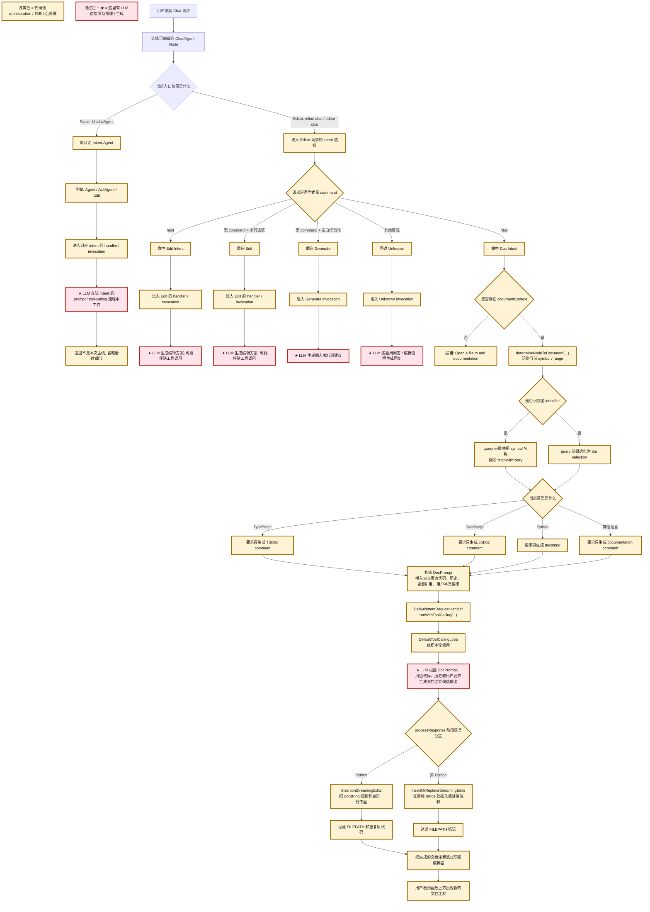

这张图里故意保留了几个非 `Doc` 分支，例如 `Agent`、`Edit`、`Generate`、`Unknown`，是为了说明：**`Doc` 并不是“所有 agent mode 都会走到的一条默认支路”，而是在 editor 场景下通过 command / 位置 / 规则选中的一个专用 intent。**

同时现在也能更直观看到：

1. `Agent` / `Edit` / `Generate` / `Unknown` 这些非 `Doc` 分支，也都会在各自链路里进入 LLM 工作阶段。
2. 只是它们的前置 orchestration、prompt 组织方式、可用工具集合和输出落地方式不同。
3. `Doc` 的特殊点不在于“只有它会调用模型”，而在于它把模型输出严格收敛成文档注释，并直接流式写回代码。

#### `Doc` Intent 内部二级放大图

如果把视角从“全局路由”继续收窄到 `Doc` 内部，真正最值得单独放大的就是这四步：

1. `buildPrompt`
2. LLM 生成
3. `processResponse`
4. streaming edits 写回

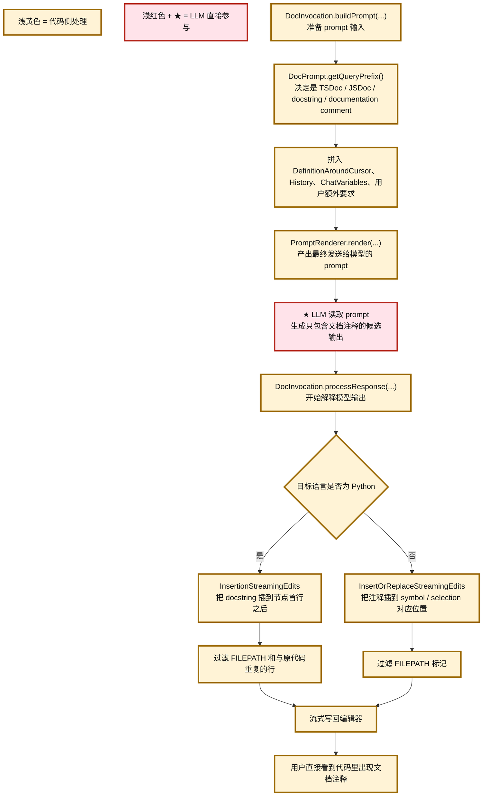

#### 顺着这个案例，`Doc` intent 下面到底还有哪些判断

如果把上面的图只聚焦到 `Doc` 那条粗线，后续其实还可以拆成三层判断。

#### 1. 入口层判断：这次请求能不能进入 `Doc`

这里最关键的不是模型，而是前面的 orchestration 是否已经把它路由到了 `Doc`。

对这个案例来说，真实的关键条件通常是：

1. 当前请求发生在 editor 场景，而不是单纯 panel 问答场景。
2. 请求显式带了 `/doc`，或者调用方已经把它映射成 `Doc` intent。
3. 编辑器里确实有一个可用的 `documentContext`。

一旦 `documentContext` 不存在，`InlineDocIntent.invoke(...)` 会直接报错 `Open a file to add documentation.`，这一支不会继续往下走。

#### 2. Prompt 构造层判断：到底让模型给谁写、写成什么格式

这部分主要发生在 [../src/extension/intents/node/docIntent.tsx](../src/extension/intents/node/docIntent.tsx) 的 `determineNodeToDocument(...)`、`DocPrompt.getQueryPrefix()` 和 `buildPrompt(...)` 里。

对这个案例，系统会继续判断：

1. 当前光标/选区附近能不能识别出一个明确的 symbol。
2. 如果能识别出来，它的 `identifier` 是不是非空。
3. 当前语言属于哪一类文档格式约定。

这会直接影响 prompt 前缀。

在我们的 TypeScript 案例里，它大致会被改写成这种意图：

> 请针对 `fetchWithRetry` 只生成一段 `TSDoc comment`，不要重复原函数代码；用户额外要求还包括解释泛型 `T`、重试条件、取消语义和抛错条件。

如果识别不到 symbol 名称，这条前缀不会写成 `fetchWithRetry`，而会退化成针对 `the selection` 生成文档注释。

如果语言换成 Python，这一层也不会再要求 `TSDoc comment`，而会改成 `docstring`。

#### 3. 响应落地层判断：生成的文档注释最终怎么写回文件

这部分是 `Doc` 分支最容易被忽视、但其实最有工程味道的一层。

`DocInvocation.processResponse(...)` 并不是简单把模型文本原样显示出来，而是把它解释成“应该如何落盘到编辑器”的流式编辑。

这里有两个重要分支。

第一，**Python 分支**：

1. 不是把 docstring 写到函数定义上方。
2. 而是用 `InsertionStreamingEdits`，把 docstring 插到节点第一行下面。
3. 同时还会过滤掉 `FILEPATH` 标记，以及那些和原始代码重复的行，避免模型把函数本体又抄一遍。

第二，**非 Python 分支**，也就是我们这个 TypeScript 案例所在的分支：

1. 使用 `InsertOrReplaceStreamingEdits`。
2. 目标位置通常是当前 symbol 对应的 `range`，或者当前 selection。
3. 仍然会过滤 `FILEPATH` 之类的伪标记，防止模型输出污染最终代码。

所以，对于 `fetchWithRetry<T>` 这个例子，最终最可能发生的结果不是“chat 面板里出现一大段解释文字”，而是：

1. 模型返回一段只包含 TSDoc 的代码块。
2. reply interpreter 把它解释成编辑操作。
3. 注释被流式插入到 `fetchWithRetry` 声明前面。
4. 用户在编辑器里直接看到新增的文档注释，而不是手动复制粘贴。

#### 这个案例为什么比普通 `Doc` 请求更能覆盖后续流程

因为它同时覆盖了 `Doc` 链上最有代表性的几个判断点：

1. **intent 选择**：通过 editor 场景和 `/doc` 显式命令进入 `Doc`，而不是落到 `Edit` 或 `Unknown`。
2. **symbol 识别**：`determineNodeToDocument(...)` 最好能识别出 `fetchWithRetry` 这个 identifier。
3. **语言分支**：TypeScript 会把输出格式压成 `TSDoc comment`。
4. **用户附加约束**：query 里不只是“写注释”，还要求解释泛型、重试和错误语义，这些都会进入 prompt。
5. **编辑落地**：最终不是普通 markdown 回复，而是流式写回编辑器。

如果你把它和 `Agent` 主链对比，会看到一个非常鲜明的差异：

1. `Agent` 更强调多轮自治、工具选择、可能的 subagent 扩展。
2. `Doc` 更强调“精确定位目标代码对象 -> 约束输出格式 -> 直接把结果写回代码”。

这也是为什么 `Doc` 虽然外层仍复用了默认 handler/loop 外壳，但它在产品语义上更像 **specialized inline documentation edit pipeline**，而不是一个完整自治 agent。

### 4.2.5 用 `Agent` Intent 举一个完整小案例

`Doc` 那条链更像“受约束的专用编辑流水线”，而 `Agent` 才是这个系统里最接近“通用自治执行器”的主分支。

因为它的分支明显更多，所以这里我不把它塞回上面那张 `Doc` 顶层图，而是单独给它一张放大的顶层流程图。

#### 案例设定

这里用一个相对复杂、能够把 `Agent` 主链上大部分关键分支都覆盖到的例子：

> 用户在 panel 里进入 `@editsAgent`，输入：
>
> “请帮我给 Agent Mode 的会话压缩链路补一层 telemetry。先在代码库里定位 `/compact`、background compaction、`SummarizedConversationHistoryMetadata` 相关实现，再修改核心实现和相关测试，最后运行相关测试验证；如果测试失败请继续修复，完成后总结还剩什么风险。”

这个案例之所以合适，是因为它天然会触发 `Agent` 主链里最核心的几类行为：

1. 顶层 participant 直接路由到 `Intent.Agent`。
2. 不是 `/compact` 这种特殊旁路，而是进入正常的 agentic loop 主路。
3. 大概率需要先搜索代码，再编辑文件，再跑测试或任务验证。
4. 如果模型和配置允许，还可能派生 search / execution subagent。
5. 如果工作轮次太多，还会碰到 tool call limit 继续确认。

#### `Agent` 顶层放大流程图

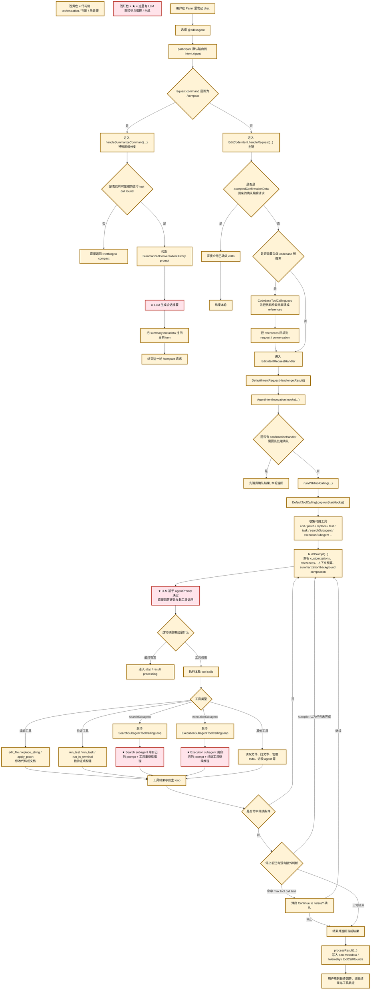

这张图表达的是：`Agent` 的复杂度不只在“它也会调用 LLM”，而在于它有一条真正的 **多轮自治主循环**，而且这条循环里还允许再派生 subagent、再回流结果、再决定下一轮动作。

#### `Agent` 主循环内部放大图

上面那张图已经把顶层主干摊开了，但如果只盯住 `A19 -> A20 -> A23 -> A30 -> A31` 这段，其实还能进一步放大成一张“主循环内部图”。

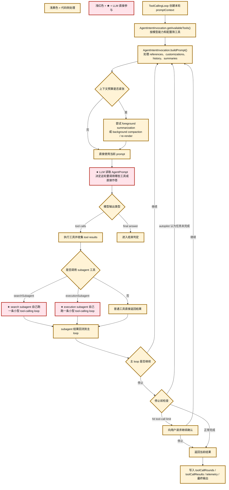

#### 顺着这个案例，`Agent` 这条线上的关键细化判断

如果把这个案例重新口头走一遍，可以分成下面几层。

#### 1. 顶层入口判断：是不是走到 `Agent`

和 `Doc` 不同，这里最典型的真实入口就是 panel 里的 `@editsAgent`。在 [../src/extension/conversation/vscode-node/chatParticipants.ts](../src/extension/conversation/vscode-node/chatParticipants.ts) 里，`registerEditsAgent()` 会把这个 participant 的默认 intent 直接绑定为 `Intent.Agent`。

所以对这个案例来说，用户一旦在 panel 里选择 `@editsAgent`，这次请求的默认顶层策略就是 `Agent`，不是 `Doc`、也不是 `Unknown`。

#### 2. 特殊旁路判断：是不是 `/compact`

`AgentIntent.handleRequest(...)` 的第一层特殊分支就是 `/compact`。

如果用户这轮输入的是 `/compact`，它不会进入常规自治 loop，而是直接走 `handleSummarizeCommand(...)`：

1. 检查是否有可压缩历史。
2. 检查最近是否存在可挂 summary 的 tool call round。
3. 如果可以压缩，就构造 `SummarizedConversationHistory` prompt。
4. 让 LLM 生成摘要，并把 `summary metadata` 挂回当前 turn。

但我们这个案例不是在做“手动压缩会话”，而是在做“修改压缩链路本身的实现”，所以它走的是正常主链，而不是这个特殊旁路。

#### 3. 继承自 `EditCodeIntent` 的前置分支

这也是 `Agent` 最容易被低估的地方之一：它不是从零开始定义一套全新 handler，而是继承了 `EditCodeIntent` 的主链，所以先天就带着几条前置分支。

第一条是 **确认编辑回流分支**：

1. 如果这轮请求其实是对上一次编辑确认的回流，`acceptedConfirmationData` 已经带着待应用 edits。
2. 那系统会直接应用这些 edits。
3. 这轮不再进入完整 agentic loop。

第二条是 **可选 code search 预处理分支**：

1. 如果配置开启且请求里带有 `Codebase` 工具引用。
2. 会先跑一个 `CodebaseToolCallingLoop`。
3. 把检索到的代码线索转成新的 references 回填给主请求。
4. 然后再进入后面的 `DefaultIntentRequestHandler`。

这意味着 `Agent` 的“第一轮上下文”并不一定完全来自用户原始 prompt；它有可能先做一次检索预热，再把结果喂回主链。

#### 4. 进入默认 handler 后，真正的 Agent invocation 才开始成形

进入 `DefaultIntentRequestHandler.getResult()` 后，这一轮才真正进入 `AgentIntentInvocation` 驱动的 prompt/build/loop 阶段。

这里最关键的事有三件：

1. `invoke(...)` 产出的是 `AgentIntentInvocation`，而不是普通 edit invocation。
2. `getAvailableTools()` 会按模型能力、实验开关和请求权限动态筛选工具集合。
3. `buildPrompt()` 会把 customizations、references、history、summaries、上下文预算和 compaction 状态一起纳入。

所以，用户表面上只说了一句“帮我补 telemetry 并跑测试”，系统底层实际上会先把“这轮到底能用哪些工具、历史要不要压缩、上下文是否超预算”这些问题都处理掉，然后才把 prompt 真正交给 LLM。

#### 5. `Agent` 的最大主分支，其实是工具循环而不是单次问答

`Agent` 最核心的地方在这里：LLM 不是只回答一次，然后系统机械执行；而是在 `DefaultToolCallingLoop` 里不断做“思考 -> 调工具 -> 看结果 -> 再思考”。

对这个 telemetry 案例，一条非常典型的可能路径是：

1. 先用搜索能力定位 `/compact`、background compaction、summary metadata 相关实现。
2. 决定修改 `agentIntent.ts`、相关 prompt metadata 或 telemetry 埋点代码。
3. 调用编辑工具修改实现。
4. 再调用测试/任务/终端工具验证。
5. 如果验证失败，根据日志继续修复。
6. 最后在确认结果看起来完整时输出最终总结。

这正是 `Agent` 与 `Doc` 的根本差异：`Doc` 更像“单次受限生成 + 写回”，`Agent` 更像“闭环问题求解”。

#### 6. Subagent 是 `Agent` 大链路里的重要扩展分支

如果配置和模型都允许，`Agent` 在主 loop 中还可以调用 `searchSubagent` 和 `executionSubagent`。

这两个不是简单工具函数，而是各自再起一条小型 tool-calling loop：

1. `searchSubagent` 会带着自己的 prompt、自己的 `subAgentInvocationId`、以及受限的搜索工具集合继续推理。
2. `executionSubagent` 会带着自己的 prompt 和执行工具集合继续推理。
3. 它们的结果最后再回流给父 `Agent` 主 loop。

所以在这个案例里，如果主 agent 觉得“需要先大范围搜清楚，再回来编辑”，或者“需要把验证步骤委托给执行子代理”，它完全可以这么做。

#### `searchSubagent` 子图

`searchSubagent` 的角色不是直接改代码，而是替主 Agent 把“大范围找资料、找实现、找线索”这件事打包成一条受限的小型代理链。

它的关键特点有三个：

1. 它会生成独立的 `subAgentInvocationId`。
2. 它有自己专门的 prompt 和独立 loop。
3. 它的可用工具会被严格收窄到搜索相关集合，而不是继承父 Agent 的全部工具。

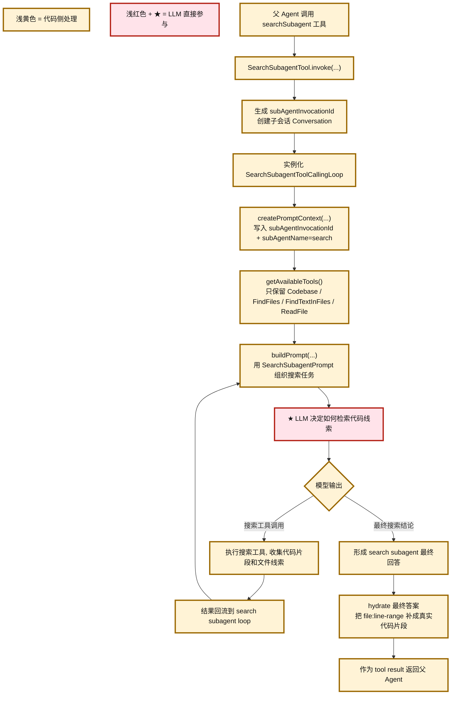

这里最值得注意的是最后那一步 `hydrate`。`searchSubagent` 返回给父 Agent 的不只是抽象结论，还会尽量把 `file:line-range` 解析成更可消费的代码片段，这样父 Agent 下一轮就能更高质量地继续推理或编辑。

#### `executionSubagent` 子图

`executionSubagent` 则更像“验证/执行小组”。它不是替父 Agent 做代码搜索，而是替父 Agent 把“去终端里跑点东西看看结果”这件事封装成一个受限的小型代理链。

和 `searchSubagent` 类似，它也有独立的 invocation id、独立 loop、独立 prompt；但它的工具集合更窄，几乎就是围绕执行能力展开。

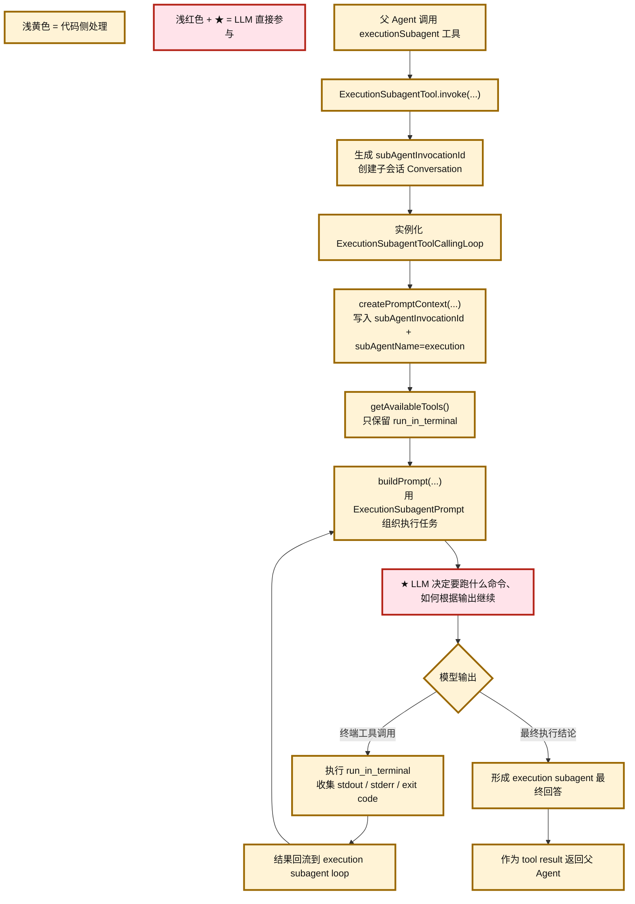

如果把这两个子图和父 `Agent` 主图一起看，就会更容易理解一件事：

1. 父 `Agent` 不是“自己做所有事”。
2. 它可以把“搜索”和“执行验证”这两类高频但相对独立的工作，外包给受限 subagent。
3. 但最终的全局任务收敛、下一步决策和结果整合，仍然回到父 `Agent` 主 loop 来完成。

#### 同一个 `Agent` 案例的时序图

前面的流程图更像“控制流视角”，而下面这张时序图要表达的是另一件事：**在同一个 Agent 案例里，主 Agent 内部的不同 component 如何和 LLM、工具、subagent 相互交互，以及中间来回传递了什么 prompt / response。**

这里沿用上面同一个案例：

> 用户在 `@editsAgent` 中要求系统定位 `/compact` 与 background compaction 相关实现，补 telemetry，修改代码，跑测试，失败后继续修复，最后总结风险。

为了把“是否会切换不同 LLM”这件事也画清楚，这张图里我把 LLM 拆成了三个参与者：

1. **Main Agent LLM**：主 Agent 当前请求使用的模型。
2. **Search Subagent LLM**：search subagent 可能使用和主 Agent 相同的模型，也可能使用配置指定模型，或者 agentic proxy 默认模型。
3. **Execution Subagent LLM**：execution subagent 可能使用主 Agent 模型，也可能使用单独配置的执行模型。

也就是说，对这个案例而言，**主链通常是一条主 LLM；但一旦进入 subagent，完全可能出现不同的 LLM endpoint。**

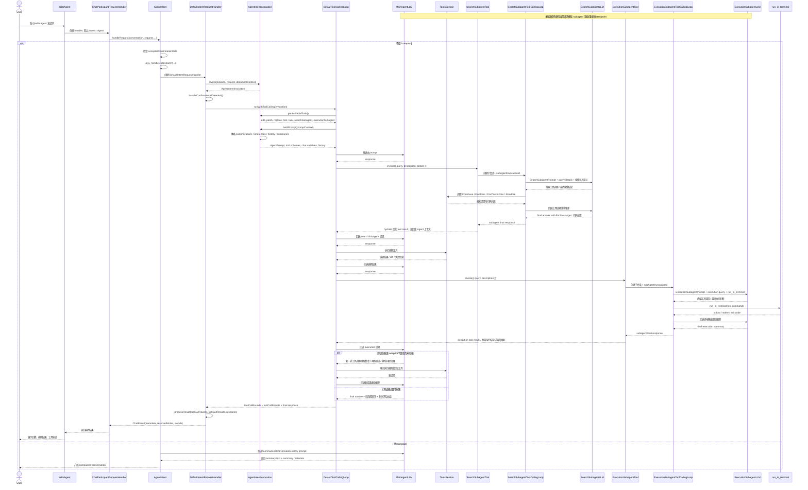

这张时序图最值得读的有四个点。

第一，**主 Agent 并不是直接把用户原话扔给 LLM 就结束**。

在真正发给主 LLM 前，系统已经经过了：

1. participant 路由
2. `AgentIntent.handleRequest(...)`
3. `DefaultIntentRequestHandler`
4. `AgentIntentInvocation.buildPrompt(...)`

也就是说，主 LLM 看到的不是“裸 prompt”，而是一个包含工具定义、历史、references、summary 状态、customizations 的结构化 prompt。

第二，**主 LLM 和 subagent LLM 不一定是同一个 endpoint**。

这在图里已经拆成了三个参与者。更精确地说：

1. 主 Agent 这轮通常先绑定当前请求的模型。
2. `searchSubagent` 可能沿用主 Agent 模型，也可能切到配置指定模型，或者 agentic proxy 默认模型。
3. `executionSubagent` 也可能沿用主模型，或者切到单独配置的执行模型。

所以如果你问“这个过程中只有一种 LLM 吗”，答案是：**不一定。主链常常是一种，但 subagent 分支完全可能切到不同模型。**

第三，**subagent 不是简单函数调用，而是又起了一条小型 agentic conversation**。

这一点从时序图里能看得更清楚：

1. 父 Agent 调用的是一个工具。
2. 这个工具内部又创建了新的 conversation、新的 invocation id、自己的 loop。
3. 子代理自己也会和自己的 LLM 多轮来回。
4. 最后再把结果当成 tool result 回给父 Agent。

第四，**主 Agent 真正像“大脑”的地方，是结果整合与下一步决策仍然发生在主 loop 中**。

也就是说：

1. search subagent 找到线索后，父 Agent 再决定改什么。
2. execution subagent 跑完验证后，父 Agent 再决定是否继续修复。
3. 最终对用户负责输出完整结论的，还是父 Agent，而不是某个子代理。

#### 7. 停止条件也不是单一的“模型说结束了就结束”

`Agent` 主 loop 的结束并不只取决于模型有没有输出最终答案，还受几类外部约束控制：

1. **Autopilot 内部 stop hook**：如果系统判断任务其实还没完成，即便模型似乎想停，也可以继续迭代。
2. **tool call limit**：如果迭代轮数打到上限，可以弹出 `Continue to iterate?` 让用户决定是否继续。
3. **取消 / 错误 / hook abort**：这些都会提前终止当前执行。

这也是为什么 `Agent` 更像一个带控制平面的执行器，而不是一个“把 prompt 扔给模型就完事”的普通聊天模式。

#### 这个案例为什么能代表 `Agent` 的最大主路

因为它基本覆盖了 `Agent` 最重要的几个结构特征：

1. **panel 顶层 participant -> Intent.Agent** 的主入口。
2. **`/compact` 特殊旁路** 与 **正常主链** 的分流。
3. **继承自 `EditCodeIntent` 的前置处理**。
4. **动态工具选择 + prompt 构建 + summarization/background compaction**。
5. **LLM 驱动的多轮 tool-calling 主循环**。
6. **subagent 扩展分支**。
7. **tool-call limit / autopilot / stop hook** 等停止判定。

所以如果你想从“最像 Agent Mode 本体”的路径来理解这个系统，看 `Agent` 这一节会比看 `Doc` 更接近整个架构的中心。

### 4.3 Tool Calling Loop

**Tool Calling Loop** 是 Agent Mode 的执行核心。

它负责反复执行这个循环：

1. 基于当前上下文构造 prompt
2. 让模型决定下一步要调用哪些工具
3. 执行工具
4. 收集结果
5. 把结果再送回模型继续推理
6. 直到任务完成、达到轮次上限或被用户中断

基类定义在 [`src/extension/intents/node/toolCallingLoop.ts`](../src/extension/intents/node/toolCallingLoop.ts)。

### 4.4 Subagent

**Subagent** 是主代理为了提升复杂任务完成率而引入的专用执行单元。

但这里要注意一个工程事实：它不是每次 Agent 会话都会出现的“默认固定部件”。在当前实现里，子代理是否可用取决于模型家族与实验开关；也就是说，它更准确地说是 **conditional capability**，而不是无条件常驻的执行层组成部分。

可以把它想象成一个工程团队：

- 主代理像 Tech Lead
- Search Subagent 像检索/情报小组
- Execution Subagent 像执行/验证小组

### 4.5 Participant、主 Agent 与 Subagent 在一个 Session 里的关系

这一点和很多人第一次看到 Agent Mode 时的直觉非常接近，但文档里最好明确说死，否则很容易把“用户可见 agent”与“内部委派出来的 subagent”混成同一层概念。

先说结论：**在 Agent Mode 语境里，participant 基本可以理解为当前 chat session 里那个直接和用户对话的顶层入口；subagent 不是第二个用户可见 participant，而是这个顶层 agent 在内部派生出来的执行单元。**

更具体地说，可以分成三层来理解：

1. `participant` 是产品层入口，也就是用户在界面上看到并直接对话的那个 agent 身份。
2. `main agent` 是当前 session 里实际承接用户请求的顶层执行者；在 Agent Mode 下，它通常就是 `editsAgent` 对应的那条主执行链。
3. `subagent` 是主 agent 通过工具或受限执行路径派生出来的内部工作单元，负责处理更窄的问题空间。

这三者在工程上不是完全同义词，但在 Agent Mode 这条路径里，它们通常满足下面这个关系：

- 用户看到并直接发消息的，是顶层 participant。
- 顶层 participant 背后承载的是当前 session 的主 agent。
- 主 agent 可以在运行时生成多个 subagent。
- 这些 subagent 不会各自变成新的用户可见聊天入口。

因此，如果你问“一个 session 里是不是通常只有一个主的、直接跟用户聊天的 agent”，在当前 Agent Mode 实现里，答案是：**对，通常是这样，而且这正是文档里所说的 top-level participant / main agent。**

但这里要补一个非常重要的限定：

1. “只有一个主 agent”说的是**任一时刻的当前顶层接管者**。
2. 它不意味着这个 session 永远不能切换到别的顶层 agent mode。
3. 它也不意味着内部不能同时存在多个 subagent 执行分支。

源码里有两个直接证据支撑这件事。

第一，顶层用户请求与 subagent 请求在请求形态上就是分开的。`getChatParticipantHandler()` 里只有当请求 **没有** `subAgentInvocationId` 时，才把它视为用户开始一次正常交互；一旦请求带有 `subAgentInvocationId`，它就不再被当成普通顶层用户请求处理，见 [../src/extension/conversation/vscode-node/chatParticipants.ts#L210](../src/extension/conversation/vscode-node/chatParticipants.ts#L210)。

第二，运行时链路也明确把主请求与 subagent 请求分开建模。`DefaultIntentRequestHandler` 会在主请求时用 VS Code 的 `sessionId` 作为会话标识，而在 subagent 请求时改用 `subAgentInvocationId` 作为该子代理自己的执行标识，并保留与父 session 的链接，见 [../src/extension/prompt/node/defaultIntentRequestHandler.ts#L137](../src/extension/prompt/node/defaultIntentRequestHandler.ts#L137)。这说明 subagent 并不是“又开了一个新的用户主聊天入口”，而是主 session 下面派生出的内部执行轨迹。

`ToolCallingLoop.runStartHooks()` 也体现了同样的分层：普通顶层 session 走 `SessionStart`，subagent 请求则走 `SubagentStart`，见 [../src/extension/intents/node/toolCallingLoop.ts#L578](../src/extension/intents/node/toolCallingLoop.ts#L578)。这进一步说明系统自己也把两者当成不同级别的实体，而不是两个平级 participant。

所以，把你的判断整理成更精确的话，可以写成下面这样：

| 说法 | 是否准确 | 更精确的版本 |
| --- | --- | --- |
| participant 就是用户在界面上看到并直接聊天的那个 Agent | 基本准确 | 更准确地说，它是用户可见的顶层聊天入口；背后由主 agent 承接执行 |
| 一个 session 下面通常只有一个主的、直接和用户聊天的 Agent | 在 Agent Mode 语境下准确 | 任一时刻通常只有一个当前顶层接管者 |
| 这个主 Agent 后期可以生成多个 subagent | 准确 | subagent 是内部委派执行单元，不是新的用户可见 participant |
| 所以一个 session 里只有一个主 Agent | 需要加限定 | 更准确地说，是任一时刻只有一个当前顶层主 agent，但它可以 handoff 到另一种顶层 mode |

最后还要把 handoff 单独摘出来。`switch_agent` 不是生成 subagent，而是把当前 session 切换到新的顶层 agent mode，而且切换绑定到当前 `chatSessionResource`，见 [../src/extension/tools/vscode-node/switchAgentTool.ts#L31](../src/extension/tools/vscode-node/switchAgentTool.ts#L31)。

这意味着：

1. subagent 是“主 agent 派出去干活的人”。
2. handoff 是“当前 session 改由另一个顶层 agent 接管”。

两者绝对不能混为一谈。

---

## 5. 微架构分层设计

从实现职责看，Agent Mode 的微架构可分为五层。

| 层次 | 主要职责 | 对应代码 |
| --- | --- | --- |
| Entry Layer | 注册 chat participant，接住请求 | `chatParticipants.ts` |
| Orchestration Layer | 组装会话、选择 intent、做前置校验 | `chatParticipantRequestHandler.ts` |
| Execution Layer | 启动工具调用闭环、处理多轮执行 | `defaultIntentRequestHandler.ts`, `toolCallingLoop.ts` |
| Capability Layer | 暴露工具、条件子代理、任务能力 | `toolNames.ts`, `tools/**` |
| Observability Layer | 记录 transcript、trajectory、telemetry | `sessionTranscriptService.ts`, `trajectoryLoggerAdapter.ts` |

### 5.1 Entry Layer

`ChatParticipants.registerEditsAgent()` 将 `editsAgent` 注册为 chat participant，见 [../src/extension/conversation/vscode-node/chatParticipants.ts](../src/extension/conversation/vscode-node/chatParticipants.ts)。

### 5.2 Orchestration Layer

核心类是 `ChatParticipantRequestHandler`，负责：

- 识别当前请求来自哪个 participant
- 创建 conversation / turn
- 清洗变量和引用
- 处理 ignored files 和 auth upgrade
- 选择 intent

对应代码： [../src/extension/prompt/node/chatParticipantRequestHandler.ts](../src/extension/prompt/node/chatParticipantRequestHandler.ts)

### 5.3 Execution Layer

执行层由 `AgentIntent` 与 `DefaultIntentRequestHandler + DefaultToolCallingLoop` 组成。

- `AgentIntent` 负责给 Agent Mode 注入特定执行策略
- `DefaultIntentRequestHandler` 是执行外壳
- `DefaultToolCallingLoop` 是自治执行内核

### 5.4 Capability Layer

能力层负责定义：

- Agent 可以调用什么工具
- 某个模型能否使用某种编辑工具
- 某些能力是否由 feature flag 或实验开关决定
- 条件启用的子代理能使用哪些更窄的能力子集

### 5.5 Observability Layer

可观测层负责回答三个问题：

1. Agent 做了什么
2. Agent 是怎么做的
3. 如果效果不好，问题出在哪一轮

它依赖三类记录：

- Transcript
- Telemetry / OTel
- Trajectory

---

## 6. 跨 Agent 对比设计

理解 Agent Mode 的高效方式，不是孤立地看它自己，而是将其与同仓库中的其他 agent execution path 放在一起比较。

### 6.1 对比视图

| 路径 | 入口形态 | 执行模型 | 工具来源 | 适合场景 |
| --- | --- | --- | --- | --- |
| AskAgent | 默认聊天中的 agent 化问答 | 面向问答，带有限工具能力 | 由 ask-agent 策略选择 | 一边问一边查，但不以重执行为主 |
| Edit Mode | 受限编辑代理 | allowlist 内编辑 | 只允许读写受限文件 | 小范围、低风险编辑 |
| Agent Mode | `editsAgent` participant | 多轮自治执行闭环 | 本地工具系统 + 子代理 | 跨文件、多步骤、需要验证的复杂任务 |
| Copilot CLI Session | 独立 chat session provider | SDK / CLI 驱动的外部 agent | CLI / SDK / 扩展桥接工具 | 与 CLI 工作流深度集成 |
| Claude Code Session | 独立 Claude session provider | Claude SDK 驱动会话 | Claude SDK + MCP + hook | 依赖 Claude 生态与外部协议的场景 |

### 6.2 AskAgent 与 Agent Mode

AskAgent 更像“增强版问答代理”，它会使用工具，但默认目标仍然偏向回答与辅助理解。对应实现见 [../src/extension/intents/node/askAgentIntent.ts](../src/extension/intents/node/askAgentIntent.ts)。

Agent Mode 则将目标切换为“把任务做完”。它会把 request location 视为 `ChatLocation.Agent`，并为多轮工具调用、自主继续执行以及复杂任务闭环做额外优化，见 [../src/extension/intents/node/agentIntent.ts](../src/extension/intents/node/agentIntent.ts)。

### 6.3 Copilot CLI 与 Agent Mode

Copilot CLI 路径不是在本地 `DefaultToolCallingLoop` 内直接编排，而是通过独立 session 与 SDK/CLI 生态协作完成，核心入口在 [../src/extension/chatSessions/copilotcli/node/copilotcliSession.ts](../src/extension/chatSessions/copilotcli/node/copilotcliSession.ts)。

它更像“把 VS Code 接到一个外部 agent runtime 上”。

相比之下，Agent Mode 是扩展内部的原生执行路径：

- participant、intent、loop 都在扩展内
- 工具由本地工具系统统一管理
- transcript 与 trajectory 更直接地和主对话会话对齐

### 6.4 Claude Code 与 Agent Mode

Claude Code 路径通过 `ClaudeAgentManager` 管理会话，核心入口在 [../src/extension/chatSessions/claude/node/claudeCodeAgent.ts](../src/extension/chatSessions/claude/node/claudeCodeAgent.ts)。

它更像“通过 Claude SDK 驱动的外部 agent 会话”，其执行模型、hook 系统、MCP server 组织方式都和原生 Agent Mode 不同。

相比之下，Agent Mode 的优势在于：

- 与 VS Code chat participant 体系天然一致
- 与本地工具定义和权限机制一致
- 更容易和 `DefaultIntentRequestHandler`、`ToolCallingLoop`、workspace 工具能力做统一抽象

### 6.5 为什么需要同时存在这些路径

因为它们解决的问题并不完全相同：

- AskAgent 解决“问答增强”
- Edit Mode 解决“低风险编辑”
- Agent Mode 解决“本地自治执行”
- Copilot CLI 解决“CLI / SDK 工作流集成”
- Claude Code 解决“Claude agent 生态集成”

这不是功能重复，而是 **execution model diversification**。

---

## 7. 关键设计取舍与演进方向

### 7.1 设计取舍

Agent Mode 的当前架构体现了若干明确的设计取舍。

#### 取舍一：选择“多轮闭环”而不是“单轮生成”

优点是能够在信息不完整、工具执行可能失败、任务需要验证的前提下持续推进；代价是执行时延、token 消耗与运行态复杂度显著增加。

#### 取舍二：选择“本地原生工具系统”而不是“完全外部 agent runtime”

优点是可以与 VS Code participant、权限体系、workspace state 和 transcript/trajectory 做统一抽象；代价是扩展内部需要承担更多调度与兼容逻辑。

#### 取舍三：选择“主代理 + 子代理”而不是“单体代理承担全部职责”

优点是可以降低上下文污染、缩窄工具暴露面、提高复杂任务处理稳定性；代价是引入额外的委派协议、状态传递与观测成本。

#### 取舍四：选择“动态工具集”而不是“固定工具全集”

优点是可以针对模型能力、风险级别与用户设置进行裁剪；代价是系统行为会更依赖上下文条件，调试门槛更高。

### 7.2 可能的演进方向

基于当前实现，后续演进大致可以沿四个方向展开：

1. 更细粒度的工具治理：继续收紧按模型、场景、权限和实验开关的工具裁剪策略。
2. 更稳定的子代理编排：将 search、execution 之外的专门执行单元逐步产品化。
3. 更强的状态恢复能力：提升长任务中断后的恢复、续跑与部分结果重用能力。
4. 更统一的跨 runtime 抽象：在原生 Agent Mode、Copilot CLI、Claude Code 等执行路径之间沉淀可复用执行语义。

---

## 8. 控制面的静态责任边界

如果说上篇前半部分主要回答“执行体系是如何分层的”，那么这一节专门回答另一个容易被忽略的问题：在静态架构上，谁负责控制 Agent，谁又不应该越权。

这里所说的控制面，不是指某一个单独类，而是几组稳定协作的职责边界：

1. 请求进入前，谁能阻断或改写这次执行。
2. prompt 发出去前，谁能注入额外约束。
3. 工具暴露前，谁能收紧能力边界。
4. loop 准备停止时，谁能把“结束”改写成“继续”。
5. 会话是否允许切换到另一种 agent mode。

### 8.0 静态控制面分层图

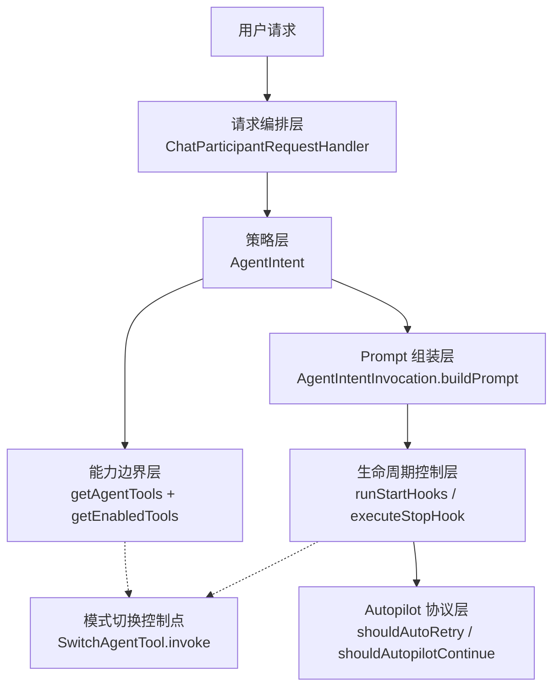

这张图的重点不是重复“主执行链路怎么跑”，而是用静态结构回答一个更容易混淆的问题：控制权分别落在哪些层，而且这些层之间不是彼此替代关系。

从上到下可以把它理解为一条逐步收缩的控制栈：

1. 请求编排层先决定“这次请求能不能安全进入 Agent”。
2. 策略层再决定“这次请求按什么协议运行”。
3. 能力边界层再决定“原则上允许什么、这一轮实际看到什么”。
4. 生命周期控制层再决定“什么时候允许开始、什么时候允许停止”。
5. Autopilot 协议层只在特定权限下接管更激进的恢复与完成判定。
6. Handoff 控制点不是常驻主链路，而是一个受限分支，用于切换 agent mode。

### 8.1 请求前控制归请求编排层，而不是归 loop

代表实现：

- [ChatParticipantRequestHandler.getResult](../src/extension/prompt/node/chatParticipantRequestHandler.ts#L204)
- [sanitizeVariables](../src/extension/prompt/node/chatParticipantRequestHandler.ts#L146)

静态职责上，请求编排层负责把一条用户请求变成“可安全进入 Agent 主链路的请求对象”。这包括：

1. 变量与引用清洗。
2. ignored files 与安全边界处理。
3. conversation / turn / document context 的建立。

但它不应该开始模拟多轮自治控制。如果把 hook、权限或工具裁剪的大量语义前移到这里，这一层就会从 orchestrator 退化成半个 runtime。

```mermaid
flowchart LR
    RawRequest["原始用户请求"] --> AuthGate["鉴权与准入检查<br/>_shouldAskForPermissiveAuth()"]
    AuthGate -->|允许继续| VariableGate["引用清洗<br/>sanitizeVariables()"]
    AuthGate -->|需要升级权限| UpgradePrompt["在 Chat 中请求更宽权限"]
    VariableGate --> IntentSelect["命令校验与 Intent 选择"]
    IntentSelect --> HookGate["首轮前控制<br/>runStartHooks + UserPromptSubmit"]
    HookGate -->|block| Blocked["请求被拦下或要求用户调整"]
    HookGate -->|allow| Strategy["策略层初筛<br/>getAgentTools()"]
    Strategy -->|按模型能力| ModelFiltered["模型能力兼容子集"]
    Strategy -->|按实验/工作区/权限| PolicyFiltered["策略允许子集"]
    ModelFiltered --> Visible["请求级可见工具<br/>getEnabledTools()"]
    PolicyFiltered --> Visible
    Visible -->|tool picker / filter / toolReferences| RoundTools["本轮真正暴露给模型的工具集"]
    RoundTools --> MainLoop["进入 Agent 主执行链"]
```

这张总图把前面两种“收缩”放进了一条连续链路里看：先收缩请求的准入，再收缩工具的暴露。

前半段回答的是“这条请求能不能进入 Agent 主链路”：

1. 鉴权与 permissive session upgrade 检查，决定是否连 workspace 级能力都能申请。
2. `sanitizeVariables()`，决定哪些引用能够带进后续上下文。
3. 命令与 intent 选择，决定这次请求到底走哪条 execution path。
4. `UserPromptSubmit`，在 loop 真正启动前做最后一次 block/allow 判定。

后半段回答的是“即便允许进入，模型这一轮究竟能看到什么工具”：

1. `getAgentTools()` 先做策略层初筛。
2. `getEnabledTools()` 再做请求级可见性裁剪。
3. 只有最后得到的 `RoundTools` 才会真正进入当前轮执行。

因此，请求编排层与能力边界层虽然分属不同职责，但它们在运行结果上共同构成了一条连续的控制收缩链。

### 8.2 执行策略归 AgentIntent，而不是归 prompt 模板

代表实现：

- [AgentIntent.getIntentHandlerOptions](../src/extension/intents/node/agentIntent.ts#L192)
- [AgentIntent.handleRequest](../src/extension/intents/node/agentIntent.ts#L201)

`AgentIntent` 是控制面中最重要的静态策略层。它负责定义：

1. 这次请求是不是 Agent Mode。
2. 这次执行的 location、temperature 和 tool iteration 上限。
3. 哪些特殊分支需要脱离常规主链处理，例如 `/compact`。

这一层的边界非常重要，因为它把“这次请求应该按什么协议运行”从 prompt 文本里剥离出来了。也就是说，prompt 是执行协议的承载体，但不应该成为协议本身的唯一出处。

### 8.3 能力边界归工具策略层，而不是归模型临场决定

代表实现：

- [getAgentTools](../src/extension/intents/node/agentIntent.ts#L67)
- [toolsService.getEnabledTools](../src/extension/tools/vscode-node/toolsService.ts#L235)

静态上，Agent 的能力边界先由 `getAgentTools()` 决定，再由 `toolsService.getEnabledTools()` 与请求级设置继续收窄。这里体现的是双层控制：

1. 策略层决定“原则上允许哪些工具”。
2. 工具服务决定“这一轮实际上能看到哪些工具”。

这也解释了为什么“仓库里有这个工具”与“模型本轮一定能调用它”是两回事。控制面在这里体现为显式 capability boundary，而不是把能力选择交给模型自己试探。

上面的总图已经把能力边界收缩链并入整体准入路径。这里最关键的不是起点，而是最后一跳：即便某个工具已经通过 `getAgentTools()` 进入策略允许集合，它仍然可能在 `getEnabledTools()` 阶段因为 tool picker、请求 filter 或 request tool references 的条件而不对当前轮暴露。

因此，理解能力边界时最好不要只问“Agent 支持哪些工具”，而要问两次：

1. 策略层原则上允许哪些工具。
2. 本轮请求实际上把哪些工具暴露给了模型。

### 8.4 生命周期 Hook 归 loop 控制层，而不是归工具层

代表实现：

- [runWithToolCalling](../src/extension/prompt/node/defaultIntentRequestHandler.ts#L318)
- [ToolCallingLoop.runStartHooks](../src/extension/intents/node/toolCallingLoop.ts#L585)
- [ToolCallingLoop.executeStopHook](../src/extension/intents/node/toolCallingLoop.ts#L281)

从静态职责看，hooks 属于 loop 的生命周期控制协议，而不是某个具体工具的附属回调：

1. `SessionStart` / `SubagentStart` 控制首轮 prompt 前的上下文注入。
2. `UserPromptSubmit` 控制本轮请求是否允许进入主执行。
3. `Stop` / `SubagentStop` 控制 loop 是否真的允许结束。

把 hooks 放在这一层有一个重要效果：控制逻辑可以直接重写执行状态，而不必把“继续执行”的判断塞进模型输出或某个单独工具结果里。

### 8.5 Autopilot 是控制协议，不只是权限标签

代表实现：

- [ToolCallingLoop.shouldAutopilotContinue](../src/extension/intents/node/toolCallingLoop.ts#L356)
- [ToolCallingLoop.shouldAutoRetry](../src/extension/intents/node/toolCallingLoop.ts#L397)

静态架构上，`autopilot` 不应被理解成“开放更多动作”这么简单。它其实会改写 loop 的结束协议与错误恢复协议：

1. 要求模型显式调用 `task_complete`。
2. 允许在特定错误下自动重试。
3. 允许在命中轮次限制时进入受限扩容，而不是立刻停下。

这说明权限级别并不是 UI 层标记，而是会下沉到 runtime protocol 的一部分。

### 8.6 Handoff 归受限模式切换，而不是归子代理委派

代表实现：

- [SwitchAgentTool.invoke](../src/extension/tools/vscode-node/switchAgentTool.ts#L20)

`switch_agent` 在当前实现里不是一个任意 agent router。它本质上是一次受限 handoff：

1. 通过工具触发模式切换。
2. 切换绑定到当前 chat session。
3. 当前只支持切到 `Plan`。

因此它在静态架构中的位置更接近“模式切换阀门”，而不是“可嵌套的子代理调用接口”。把这点说清楚很重要，否则很容易把 handoff 与 subagent delegation 混为一谈。

### 8.7 用一张表收束这组边界

| 控制问题 | 静态归属层 | 代表实现 | 不应越权到哪里 |
| --- | --- | --- | --- |
| 请求能否安全进入 Agent | 请求编排层 | `ChatParticipantRequestHandler` | 不应直接接管 loop |
| 本次请求按什么执行协议运行 | Intent 策略层 | `AgentIntent` | 不应退化为 prompt 内暗规则 |
| 哪些工具原则上可用、实际上可见 | 能力边界层 | `getAgentTools()` + `getEnabledTools()` | 不应交给模型临场试探 |
| 首轮前注入什么、停止前是否继续 | Loop 生命周期控制层 | `runStartHooks()` / `executeStopHook()` | 不应塞进单个工具语义 |
| 失败后是否自动恢复、何时算完成 | Autopilot 控制协议 | `shouldAutoRetry()` / `shouldAutopilotContinue()` | 不应只留在 UI 权限标签 |
| 是否切换到另一 agent mode | Handoff 控制点 | `SwitchAgentTool.invoke()` | 不应误写成子代理委派 |

---

## 9. 关键代码映射

| 主题 | 文件 |
| --- | --- |
| Agent participant 注册 | [`src/extension/conversation/vscode-node/chatParticipants.ts`](../src/extension/conversation/vscode-node/chatParticipants.ts) |
| Agent 名称与 participant ID | [`src/platform/chat/common/chatAgents.ts`](../src/platform/chat/common/chatAgents.ts) |
| Intent 枚举与命名 | [`src/extension/common/constants.ts`](../src/extension/common/constants.ts) |
| 请求编排入口 | [`src/extension/prompt/node/chatParticipantRequestHandler.ts`](../src/extension/prompt/node/chatParticipantRequestHandler.ts) |
| Agent intent | [`src/extension/intents/node/agentIntent.ts`](../src/extension/intents/node/agentIntent.ts) |
| AskAgent intent | [`src/extension/intents/node/askAgentIntent.ts`](../src/extension/intents/node/askAgentIntent.ts) |
| Copilot CLI session | [`src/extension/chatSessions/copilotcli/node/copilotcliSession.ts`](../src/extension/chatSessions/copilotcli/node/copilotcliSession.ts) |
| Claude Agent manager | [`src/extension/chatSessions/claude/node/claudeCodeAgent.ts`](../src/extension/chatSessions/claude/node/claudeCodeAgent.ts) |
| 工具可见性过滤 | [`src/extension/tools/vscode-node/toolsService.ts`](../src/extension/tools/vscode-node/toolsService.ts) |
| Loop 生命周期 hooks | [`src/extension/intents/node/toolCallingLoop.ts`](../src/extension/intents/node/toolCallingLoop.ts) |
| Agent mode handoff | [`src/extension/tools/vscode-node/switchAgentTool.ts`](../src/extension/tools/vscode-node/switchAgentTool.ts) |

---

## 10. 类与方法级源码索引

如果希望从“架构职责”直接映射到“实现符号”，建议先看以下类与方法。这里不仅给出文件，还给出建议关注的关键行段，便于快速读码。

| 架构职责 | 类 / 方法 | 关键位置 | 说明 |
| --- | --- | --- | --- |
| Agent 注册 | `ChatParticipants.registerEditsAgent()` | [../src/extension/conversation/vscode-node/chatParticipants.ts#L141](../src/extension/conversation/vscode-node/chatParticipants.ts#L141) | 将 `editsAgent` 暴露为独立 participant，并绑定 Agent intent |
| 请求桥接 | `ChatParticipants.getChatParticipantHandler()` | [../src/extension/conversation/vscode-node/chatParticipants.ts#L197](../src/extension/conversation/vscode-node/chatParticipants.ts#L197) | 将 VS Code participant 请求桥接到 `ChatParticipantRequestHandler` |
| 请求处理 | `ChatParticipantRequestHandler.getResult()` | [../src/extension/prompt/node/chatParticipantRequestHandler.ts#L204](../src/extension/prompt/node/chatParticipantRequestHandler.ts#L204) | 单次请求的总体入口，串联鉴权、变量清洗、intent 选择和执行 |
| 请求预处理 | `ChatParticipantRequestHandler.sanitizeVariables()` | [../src/extension/prompt/node/chatParticipantRequestHandler.ts#L146](../src/extension/prompt/node/chatParticipantRequestHandler.ts#L146) | 处理 ignored files 与敏感路径相关的引用清洗 |
| Intent 策略注入 | `AgentIntent.getIntentHandlerOptions()` | [../src/extension/intents/node/agentIntent.ts#L192](../src/extension/intents/node/agentIntent.ts#L192) | 设置温度、轮次上限与 `ChatLocation.Agent` |
| Agent 请求处理 | `AgentIntent.handleRequest()` | [../src/extension/intents/node/agentIntent.ts#L201](../src/extension/intents/node/agentIntent.ts#L201) | 处理 Agent 模式下的请求分支与 `/compact` 特殊路径 |
| 同步压缩入口 | `AgentIntent.handleSummarizeCommand()` | [../src/extension/intents/node/agentIntent.ts#L219](../src/extension/intents/node/agentIntent.ts#L219) | 处理 `/compact`，生成并持久化会话摘要 |
| 工具能力裁剪 | `getAgentTools()` | [../src/extension/intents/node/agentIntent.ts#L67](../src/extension/intents/node/agentIntent.ts#L67) | 按模型、实验开关、权限与 workspace 能力动态选择工具 |
| Request 级工具过滤 | `ToolsService.getEnabledTools()` | [../src/extension/tools/vscode-node/toolsService.ts#L235](../src/extension/tools/vscode-node/toolsService.ts#L235) | 将策略允许工具进一步压缩为本轮可见工具 |
| Prompt 构造 | `AgentIntentInvocation.buildPrompt()` | [../src/extension/intents/node/agentIntent.ts#L366](../src/extension/intents/node/agentIntent.ts#L366) | Agent prompt 的主要构造点，包括 codebase references 与 summarization 相关逻辑 |
| Summary 恢复 | `normalizeSummariesOnRounds()` | [../src/extension/prompt/common/conversation.ts#L199](../src/extension/prompt/common/conversation.ts#L199) | 将历史摘要重新挂回对应的 tool call round |
| 启动时 hook 控制 | `ToolCallingLoop.runStartHooks()` | [../src/extension/intents/node/toolCallingLoop.ts#L585](../src/extension/intents/node/toolCallingLoop.ts#L585) | 在首轮 prompt 前执行 SessionStart/SubagentStart 并注入 additional context |
| 停止前 hook 控制 | `ToolCallingLoop.executeStopHook()` | [../src/extension/intents/node/toolCallingLoop.ts#L281](../src/extension/intents/node/toolCallingLoop.ts#L281) | 将“准备停止”改写为“继续执行” |
| Autopilot 完成判定 | `ToolCallingLoop.shouldAutopilotContinue()` | [../src/extension/intents/node/toolCallingLoop.ts#L356](../src/extension/intents/node/toolCallingLoop.ts#L356) | 将 `task_complete` 提升为显式完成信号 |
| Agent mode 切换 | `SwitchAgentTool.invoke()` | [../src/extension/tools/vscode-node/switchAgentTool.ts#L20](../src/extension/tools/vscode-node/switchAgentTool.ts#L20) | 通过受限 handoff 将当前会话切到 `Plan` agent |

---

## 11. 源码阅读索引

如果希望按“从入口到核心”的顺序阅读源码，建议采用以下路径：

1. 从 [../src/extension/conversation/vscode-node/chatParticipants.ts](../src/extension/conversation/vscode-node/chatParticipants.ts) 确认 Agent participant 的注册入口。
2. 阅读 [../src/platform/chat/common/chatAgents.ts](../src/platform/chat/common/chatAgents.ts) 了解 participant 名称与标识映射。
3. 阅读 [../src/extension/prompt/node/chatParticipantRequestHandler.ts](../src/extension/prompt/node/chatParticipantRequestHandler.ts) 理解请求如何进入内部编排层。
4. 阅读 [../src/extension/common/constants.ts](../src/extension/common/constants.ts) 与 [../src/extension/intents/node/agentIntent.ts](../src/extension/intents/node/agentIntent.ts) 理解 intent 命名与 Agent 策略注入。
5. 阅读 [../src/extension/prompt/node/defaultIntentRequestHandler.ts](../src/extension/prompt/node/defaultIntentRequestHandler.ts) 理解通用执行外壳与 loop 启动点。
6. 阅读 [../src/extension/intents/node/toolCallingLoop.ts](../src/extension/intents/node/toolCallingLoop.ts) 理解多轮自治执行的核心抽象。
7. 对照 [../src/extension/prompts/node/panel/toolCalling.tsx](../src/extension/prompts/node/panel/toolCalling.tsx) 理解工具调用 prompt 的组织方式。
8. 最后阅读 [../src/platform/chat/common/sessionTranscriptService.ts](../src/platform/chat/common/sessionTranscriptService.ts) 与 [../src/platform/trajectory/node/trajectoryLoggerAdapter.ts](../src/platform/trajectory/node/trajectoryLoggerAdapter.ts) 理解可观测性落点。

---

## 12. 读码导览：为什么看这些代码

如果你的目标不是“知道有哪些文件”，而是“知道每段代码为什么重要”，可以按下面的导览顺序阅读。

### 第一步：确认 Agent Mode 是如何作为独立 participant 暴露出来的

先看 [registerEditsAgent](../src/extension/conversation/vscode-node/chatParticipants.ts#L141)。

这段代码值得先看，因为它回答了一个最基础的问题：Agent Mode 在产品层面是怎样进入系统的。只有先确认 `editsAgent` 的注册方式，后面去看 intent、loop、tool system 才有清晰入口。

紧接着看 [getChatParticipantHandler](../src/extension/conversation/vscode-node/chatParticipants.ts#L197)。

这段代码的价值在于，它展示了 VS Code chat participant 与扩展内部请求处理框架之间的桥接点。你会看到 participant 请求如何被包装为 `ChatParticipantRequestHandler`，这决定了后续所有架构分析的主调用链。

### 第二步：确认单次请求是如何进入内部编排层的

看 [ChatParticipantRequestHandler.getResult](../src/extension/prompt/node/chatParticipantRequestHandler.ts#L204)。

这段代码是整个请求编排层的主入口。读它时，建议重点关注三件事：

1. 请求前置校验和鉴权升级是在哪里发生的。
2. conversation 与 turn 是如何建立的。
3. 请求最终如何流向 intent handler。

配合看 [sanitizeVariables](../src/extension/prompt/node/chatParticipantRequestHandler.ts#L146)。

这段代码值得看，是因为它体现了这套系统并不是“直接把用户所有输入原样喂给模型”，而是会在进入 Agent 主链路前做引用清洗与安全过滤。这是理解系统边界控制的重要切面。

### 第三步：确认 Agent Mode 相对其他 intent 的专有策略是什么

看 [AgentIntent.getIntentHandlerOptions](../src/extension/intents/node/agentIntent.ts#L192)。

这段代码很短，但非常关键。它基本定义了 Agent Mode 相对于普通 ask 或 edit 路径的几个核心差异：工具调用轮次、temperature，以及强制使用 `ChatLocation.Agent`。

再看 [AgentIntent.handleRequest](../src/extension/intents/node/agentIntent.ts#L201)。

这段代码能帮助你看清 Agent intent 并不只是“换一个 prompt”，而是可以接管特殊分支，例如 `/compact`。这说明 Agent Mode 是一个有自己控制面和特例处理逻辑的执行模式。

### 第四步：确认工具能力为什么是动态的，而不是写死的

看 [getAgentTools](../src/extension/intents/node/agentIntent.ts#L67)。

这段代码是理解能力层的核心入口。建议重点看以下判断：

1. 不同模型家族对 `apply_patch`、`replace_string` 等编辑工具的差异化开放。
2. tests、tasks、subagent 等工具是否受 workspace 能力和实验开关影响。
3. 为什么 Agent Mode 的工具集会随着请求上下文变化。

如果你理解了这里，就会明白为什么 Agent Mode 不能被简化成“固定工具表 + 固定 prompt”。

### 第五步：确认架构层是如何落到 prompt 构造上的

看 [AgentIntentInvocation.buildPrompt](../src/extension/intents/node/agentIntent.ts#L366)。

这一段代码值得看，因为它是“策略层”转为“提示构造层”的关键桥接点。建议重点关注：

1. codebase references 是如何并入 prompt context 的。
2. tools token 计算为什么会影响 prompt budgeting。
3. summarization 与上下文压缩为何会出现在 Agent prompt 路径里。

如果你准备继续往“长任务为什么还能跑得下去”这个方向深入，最值得连着看的不是一段代码，而是一个三段组合：`handleSummarizeCommand()` 解释显式 `/compact`，`AgentIntentInvocation.buildPrompt()` 解释自动压缩与预算控制，`normalizeSummariesOnRounds()` 解释压缩结果如何在后续轮次继续生效。

到这里为止，你基本能建立起上篇的完整静态架构理解：participant 入口、编排层、intent 策略层、能力层、prompt 组装层如何连接。

---

## 13. 读码路线图

如果你不想完全按文件顺序读，而是想按“问题域”进入代码，可以采用下面三条路线。

### 路线 A：架构入口路线

适合第一次建立全局认知时使用。

1. 先看 [registerEditsAgent](../src/extension/conversation/vscode-node/chatParticipants.ts#L141)，确认 Agent Mode 如何被注册为独立 participant。
2. 再看 [getChatParticipantHandler](../src/extension/conversation/vscode-node/chatParticipants.ts#L197)，确认 participant 请求如何转入内部处理器。
3. 接着看 [ChatParticipantRequestHandler.getResult](../src/extension/prompt/node/chatParticipantRequestHandler.ts#L204)，建立请求编排主链路的整体印象。

这条路线的目标不是理解所有细节，而是先回答“入口在哪里，第一跳到哪里”。

### 路线 B：策略与能力路线

适合理解 Agent Mode 为什么和 Ask / Edit 路径不同。

1. 看 [AgentIntent.getIntentHandlerOptions](../src/extension/intents/node/agentIntent.ts#L192)，理解 Agent 专有运行参数。
2. 看 [AgentIntent.handleRequest](../src/extension/intents/node/agentIntent.ts#L201)，理解 Agent 的控制面和特殊分支。
3. 看 [getAgentTools](../src/extension/intents/node/agentIntent.ts#L67)，理解能力层为什么是动态的。
4. 看 [AgentIntentInvocation.buildPrompt](../src/extension/intents/node/agentIntent.ts#L366)，理解策略如何落到 prompt 构造。

这条路线的目标是回答“为什么同样是聊天请求，Agent Mode 的执行方式会不同”。

### 路线 C：观测与调优路线

适合在你已经理解主链路之后，用来理解系统如何被调试和优化。

1. 先看 [../src/platform/chat/common/sessionTranscriptService.ts](../src/platform/chat/common/sessionTranscriptService.ts)，理解 transcript 的事件记录接口。
2. 再看 [../src/platform/trajectory/node/trajectoryLoggerAdapter.ts](../src/platform/trajectory/node/trajectoryLoggerAdapter.ts)，理解 trajectory 如何记录结构化执行轨迹。
3. 最后回看 [DefaultToolCallingLoop](../src/extension/prompt/node/defaultIntentRequestHandler.ts#L606)，理解这些观测能力如何嵌入主 loop。

这条路线的目标是回答“系统为什么不是黑盒，以及失败后为什么还能复盘”。

---

## 14. 关键方法剖面：输入、输出与状态变化

下面这张表不是重复索引，而是帮助你在读关键方法时，快速抓住“它吃进什么、吐出什么、改变了什么状态”。

| 方法 | 输入 | 输出 | 关键状态变化 |
| --- | --- | --- | --- |
| [registerEditsAgent](../src/extension/conversation/vscode-node/chatParticipants.ts#L141) | participant 名称与默认 intent | 注册完成的 agent disposable | 将 `editsAgent` 挂入 participant 注册表，并绑定标题与 welcome message |
| [getChatParticipantHandler](../src/extension/conversation/vscode-node/chatParticipants.ts#L197) | `request`、`context`、`stream`、`token` | `vscode.ChatResult` | 计算 default intent，实例化 `ChatParticipantRequestHandler`，建立第一次桥接 |
| [ChatParticipantRequestHandler.getResult](../src/extension/prompt/node/chatParticipantRequestHandler.ts#L204) | 原始请求、历史 turn、document context、agent args | `ICopilotChatResult` | 执行鉴权检查、变量清洗、intent 选择，并推动 conversation/turn 进入执行态 |
| [sanitizeVariables](../src/extension/prompt/node/chatParticipantRequestHandler.ts#L146) | 请求中的 references | 清洗后的 `ChatRequest` | 过滤 ignored 引用，并在必要时同步修改 turn 上的用户消息文本 |
| [AgentIntent.getIntentHandlerOptions](../src/extension/intents/node/agentIntent.ts#L192) | 当前 `ChatRequest` | `IDefaultIntentRequestHandlerOptions` | 确定 Agent 模式的 tool iteration 上限、temperature 与 request location |
| [getAgentTools](../src/extension/intents/node/agentIntent.ts#L67) | services accessor、当前请求、模型信息 | `LanguageModelToolInformation[]` | 根据模型、实验、权限与 workspace 能力构造动态工具集 |
| [AgentIntentInvocation.buildPrompt](../src/extension/intents/node/agentIntent.ts#L366) | `IBuildPromptContext`、progress、token | `IBuildPromptResult` | 解析 customizations、并入 codebase references、计算 tool tokens，并形成 Agent prompt |

---

## 15. 关键方法剖面：调用前条件、调用后保证与失败路径

这一节关注的不是“方法做了什么”，而是“系统在调用这个方法时，默认依赖了什么；调用结束后，系统可以假定什么；如果失败，会在哪里表现出来”。

### [registerEditsAgent](../src/extension/conversation/vscode-node/chatParticipants.ts#L141)

调用前条件：

1. `ChatParticipants` 已经完成基础服务注入。
2. `editsAgentName` 与 `Intent.Agent` 常量可用。
3. participant 注册生命周期仍处于初始化阶段。

调用后保证：

1. `editsAgent` 会以独立 participant 身份出现在系统里。
2. 后续请求可以通过该 participant 进入 Agent Mode。
3. title provider 与 welcome message 已绑定到该 participant。

失败路径：

1. 如果 participant 创建失败，Agent Mode 将在产品入口层不可见。
2. 这类失败通常会表现为功能缺失，而不是运行时执行错误。

### [ChatParticipantRequestHandler.getResult](../src/extension/prompt/node/chatParticipantRequestHandler.ts#L204)

调用前条件：

1. conversation、turn、document context 已在构造阶段准备完成。
2. 原始 request、history、stream、token 都已绑定到 handler 实例。
3. chat agent args 已能标识当前 participant 与 intent 候选。

调用后保证：

1. 请求会被推进到一个确定结果状态：成功、过滤、取消、错误或需要确认。
2. 如果执行正常进入后续链路，conversation 中的 turn 会带上相应响应元数据。
3. 调用方可以拿到统一形态的 `ICopilotChatResult`。

失败路径：

1. 鉴权升级、变量清洗、intent 解析或后续 handler 执行都可能导致提前返回。
2. 失败不一定表现为异常抛出，也可能表现为带 `errorDetails` 的结构化结果。

### [AgentIntent.getIntentHandlerOptions](../src/extension/intents/node/agentIntent.ts#L192)

调用前条件：

1. 当前请求已被判定为进入 Agent intent。
2. 配置系统与实验开关可用。
3. iteration limit 与 temperature 的来源可被解析。

调用后保证：

1. 后续默认请求处理器会拿到 Agent 专用执行参数。
2. 请求 location 会被强制解释为 `ChatLocation.Agent`。
3. loop 的轮次上限与温度策略会明确化。

失败路径：

1. 如果配置异常，通常会回退到默认值，而不是直接使执行中断。
2. 因此它更像“策略退化点”，而不是“崩溃点”。

### [getAgentTools](../src/extension/intents/node/agentIntent.ts#L67)

调用前条件：

1. request 已具备可解析的模型信息或可通过 endpoint provider 获取模型。
2. tools service、tasks service、test service、configuration service 等依赖均可用。
3. 当前 workspace 状态允许判断 tests/tasks 是否存在。

调用后保证：

1. 返回的工具集合是基于当前模型、权限、实验与 workspace 能力裁剪后的结果。
2. 后续 prompt 构造阶段可以安全地把这组工具暴露给模型。
3. 编辑工具、测试工具、任务工具、子代理工具的开放边界被显式确定。

失败路径：

1. 如果模型能力判断或工具查询出现异常，可能导致部分工具缺失。
2. 这类问题通常表现为“能力降级”，而不是整个请求立即失败。

### [AgentIntentInvocation.buildPrompt](../src/extension/intents/node/agentIntent.ts#L366)

调用前条件：

1. prompt context 已由 loop 构造完成。
2. endpoint、tokenizer、prompt customizations 解析链路可用。
3. 如果有 codebase references，它们仍可被解析并合并到变量集合中。

调用后保证：

1. 返回的 `IBuildPromptResult` 可被后续 fetch 直接消费。
2. prompt 中会包含当前轮所需的历史、变量、工具信息与额外上下文。
3. token budgeting 与 summarization 相关元数据会在这一层被计算或注入。

失败路径：

1. tokenizer、prompt renderer、customization 解析或 codebase reference 处理失败，都可能导致 prompt 构造失败。
2. 这类失败通常会在后续执行层被表现为请求错误，而不会进入正常的多轮闭环。

---

## 16. 时序中的责任边界

理解 Agent Mode 时，一个常见误区是把整条链路看成“一个大方法不断往下调”。这样会很难判断某个问题应该在哪一层修，或者某一层是否承担了不该承担的职责。

更准确的理解方式，是把它看成一条按时间推进的责任传递链：每一层只在自己的时间窗口内负责有限职责，并把处理后的状态交给下一层。

### 阶段一：Participant 入口层

代表实现：

- [registerEditsAgent](../src/extension/conversation/vscode-node/chatParticipants.ts#L141)
- [getChatParticipantHandler](../src/extension/conversation/vscode-node/chatParticipants.ts#L197)

应该负责：

1. 暴露 Agent Mode 的产品入口。
2. 将 VS Code participant 请求桥接到内部请求处理器。
3. 绑定默认 intent 或 intent getter。

不应该负责：

1. 解析复杂业务上下文。
2. 决定具体工具集。
3. 承担多轮执行逻辑。

如果这一层承担过多职责，系统会出现的典型问题是：入口层变成“半个执行器”，导致 participant 注册和运行时逻辑耦合过深。

### 阶段二：请求编排层

代表实现：

- [ChatParticipantRequestHandler.getResult](../src/extension/prompt/node/chatParticipantRequestHandler.ts#L204)
- [sanitizeVariables](../src/extension/prompt/node/chatParticipantRequestHandler.ts#L146)

应该负责：

1. 建立 conversation、turn 与 document context。
2. 做请求级前置处理，例如变量清洗、鉴权升级、intent 选择。
3. 将请求交给正确的 intent/request handler 路径。

不应该负责：

1. 直接决定某一轮 prompt 的具体长相。
2. 在这一层执行多轮工具调用。
3. 对模型返回做工具级细粒度调度。

这一层的边界一旦失守，最典型的后果是：handler 同时承担“编排器 + 执行器”双重角色，后续 intent 和 loop 的可替换性会显著下降。

### 阶段三：Intent 策略层

代表实现：

- [AgentIntent.getIntentHandlerOptions](../src/extension/intents/node/agentIntent.ts#L192)
- [AgentIntent.handleRequest](../src/extension/intents/node/agentIntent.ts#L201)
- [getAgentTools](../src/extension/intents/node/agentIntent.ts#L67)

应该负责：

1. 决定当前请求采用什么执行策略。
2. 注入 Agent 专有参数，例如 location、temperature、tool iteration limit。
3. 定义 Agent 能使用的能力边界。

不应该负责：

1. 直接驱动一轮轮 loop 前进。
2. 把所有运行态细节都塞进一个 intent 类里。
3. 在策略层直接处理底层 transcript/trajectory 写入。

这一层最重要的边界，是“定义规则，不亲自跑执行主循环”。

### 阶段四：Prompt 组装层

代表实现：

- [AgentIntentInvocation.buildPrompt](../src/extension/intents/node/agentIntent.ts#L366)

应该负责：

1. 将历史、变量、工具、references 和 customizations 组织成 prompt。
2. 做 prompt budgeting 与相关元数据拼装。
3. 为下一层模型请求提供稳定输入。

不应该负责：

1. 直接选择最终执行哪些工具。
2. 决定 loop 是否终止。
3. 直接承担网络请求或工具执行职责。

这一层若越权，最容易出现的现象是 prompt 模板与运行时控制逻辑缠在一起，导致 prompt 调整时意外影响执行语义。

### 阶段五：控制协议下沉层

代表实现：

- [ToolCallingLoop.runStartHooks](../src/extension/intents/node/toolCallingLoop.ts#L585)
- [ToolCallingLoop.executeStopHook](../src/extension/intents/node/toolCallingLoop.ts#L281)
- [ToolCallingLoop.shouldAutopilotContinue](../src/extension/intents/node/toolCallingLoop.ts#L356)
- [SwitchAgentTool.invoke](../src/extension/tools/vscode-node/switchAgentTool.ts#L20)

应该负责：

1. 把 hooks、stop gate、autopilot continuation 和 handoff 组织成清晰控制协议。
2. 在 loop 即将开始、即将停止、即将切换模式这些关键时刻改写执行状态。
3. 把“是否继续执行”从模型的纯文本意图提升为显式运行时协议。

不应该负责：

1. 亲自承担业务工具执行。
2. 回退成一个把所有策略、能力和执行细节全部吞进来的超级类。
3. 把控制理由只留在 UI 文案里而不回写到后续可见状态。

这一层是上篇和下篇之间最关键的交界面。上篇在这里先划清责任边界，下篇再继续说明这些协议在运行态到底怎样接管 loop。

### 阶段六：可观测与复盘层

代表实现：

- [../src/platform/chat/common/sessionTranscriptService.ts](../src/platform/chat/common/sessionTranscriptService.ts)
- [../src/platform/trajectory/node/trajectoryLoggerAdapter.ts](../src/platform/trajectory/node/trajectoryLoggerAdapter.ts)

应该负责：

1. 记录会话事件、工具轮次、控制理由和关键执行轨迹。
2. 让 Agent Mode 的行为可以被回放、比较和追责。
3. 为调试和后续调优提供稳定观察面，而不是事后靠猜测还原执行过程。

不应该负责：

1. 反向充当业务真相来源。
2. 决定主执行链路的策略。
3. 因记录失败而直接破坏主执行闭环。

静态上，observability 不是执行器的一部分；但如果没有这一层，Agent Mode 对外仍然会表现得像一个难以复盘的黑盒系统。

---

## 17. 本篇收束：从静态架构走向运行时协议

到这里，上篇真正回答完的不是“Agent 能做什么”，而是以下三类更基础的问题：

1. Agent Mode 在整个 Copilot Chat 系统里的架构位置是什么。
2. 这条执行路径与 AskAgent、Edit Mode、Copilot CLI、Claude Code 的边界差异是什么。
3. 哪些职责属于 participant、orchestration、intent、prompt、control plane 和 observability，哪些又不应该混写。

为了避免三篇文档后续继续重复同一批解释，下面用一张交接表把“哪个问题该在哪篇看”明确下来。

| 如果你现在的问题是 | 本篇里的主落点 | 下篇里的接续落点 |
| --- | --- | --- |
| Agent Mode 在系统里到底算哪一层能力 | 第 1、3、5 节 | 第 1 节 |
| 为什么它不是普通 AskAgent | 第 6 节 | 第 8 节 |
| 工具、权限、hook、handoff 的静态边界怎么划 | 第 8 节 | 第 19、20 节 |
| 哪些方法定义了静态职责骨架 | 第 9 到第 15 节 | 第 11 到第 17 节 |
| 一次请求在运行态如何一步步推进 | 本篇只做责任划界 | 下篇第 1、18 节 |
| 为什么它在长任务里不会立刻失忆 | 本篇第 10 到第 15 节的入口索引 | 下篇第 6、17 节 |
| 为什么系统会“该停不停”或“继续催做” | 本篇第 8、16 节 | 下篇第 19、20 节 |

如果只想用最短路径把上篇和下篇接起来，建议直接按下面顺序继续：

1. 在本篇回看第 8 节，确认静态控制面是谁在负责。
2. 然后跳到下篇第 18 节，看这些静态职责如何沿时间顺序接管执行。
3. 最后读下篇第 19 和第 20 节，把 stop hook、autopilot 和 handoff 放回同一个运行时协议中理解。

这样读，三篇文档会形成一条更清晰的闭环：导航页解决“从哪进”，上篇解决“谁负责什么”，下篇解决“这些职责如何真正跑起来”。
