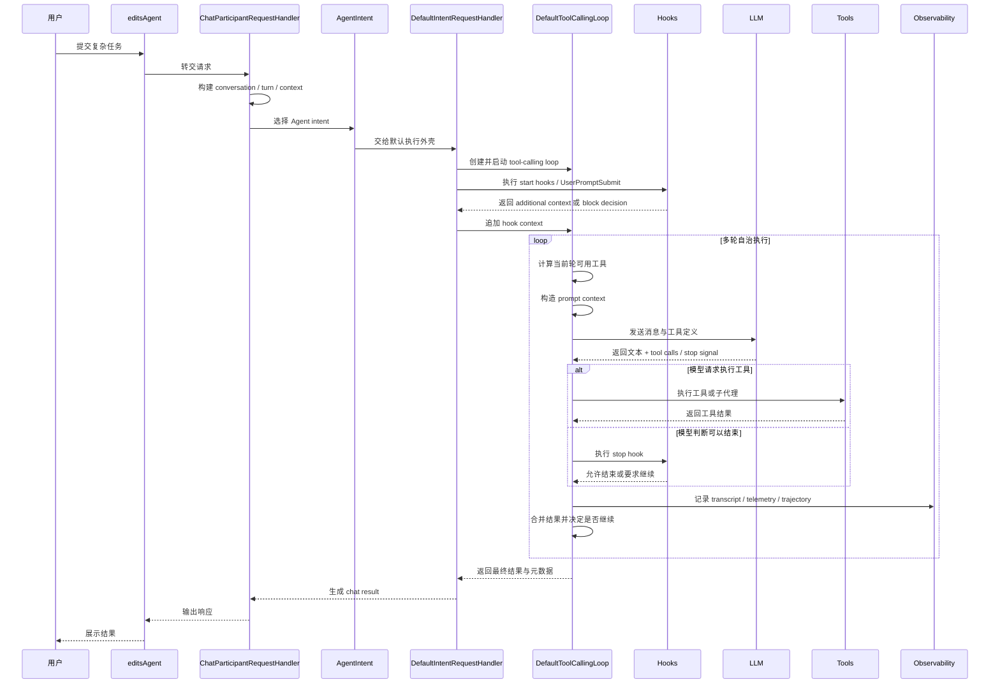
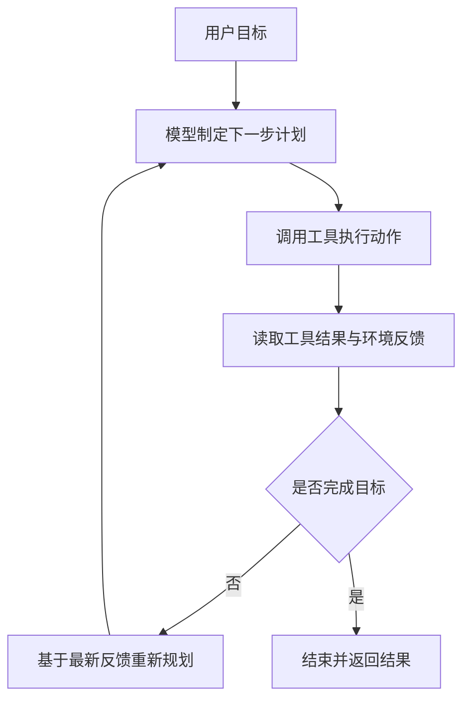
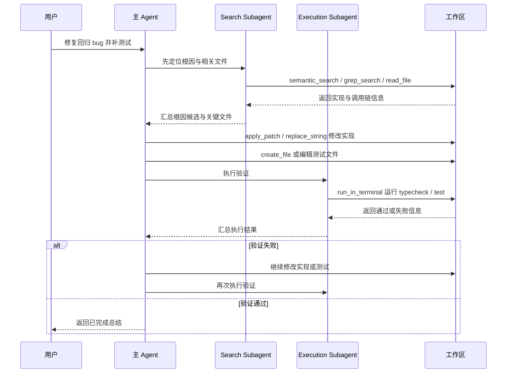
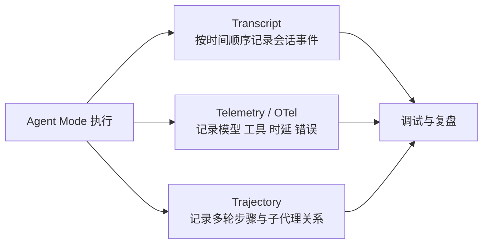
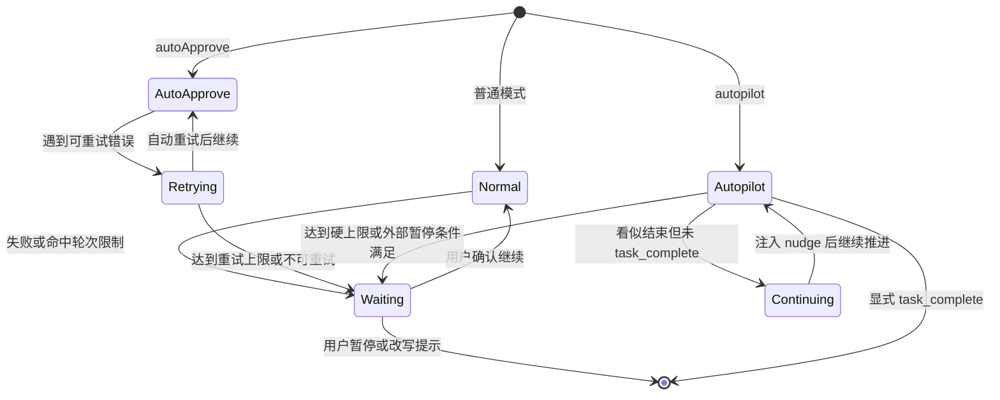
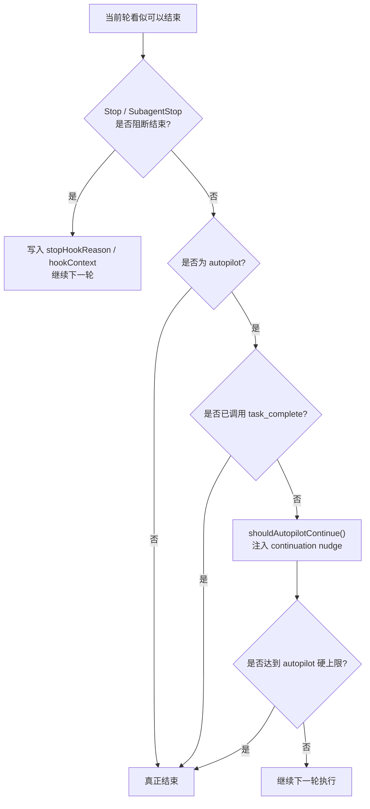
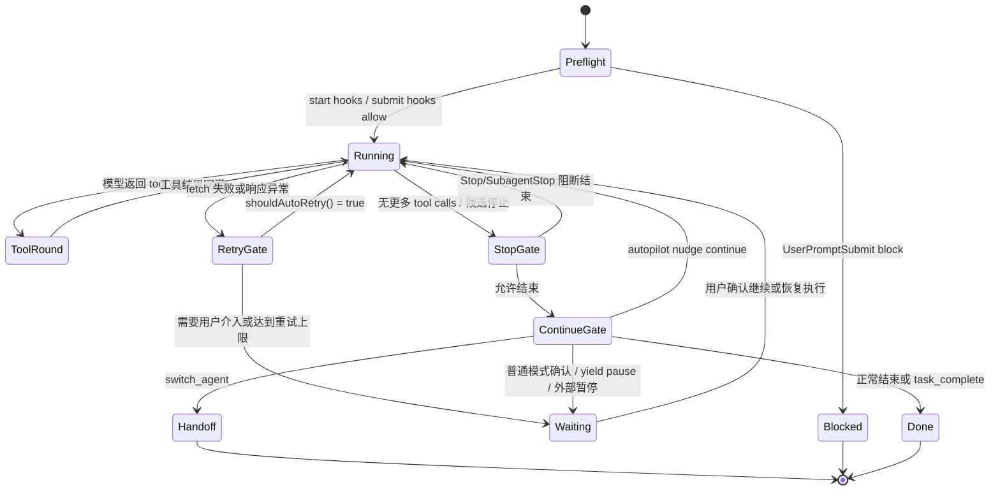
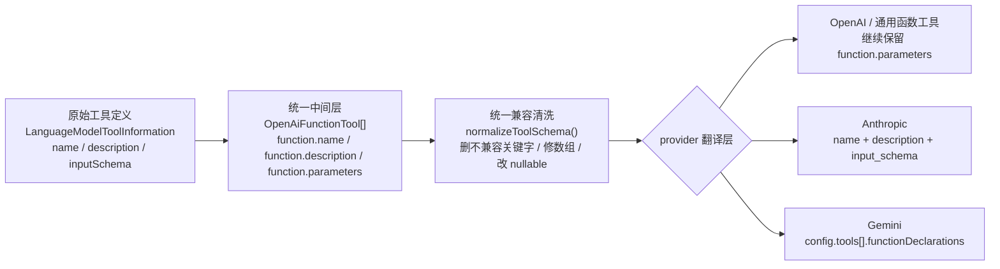

# Copilot Chat Agent Mode 执行链路与自治机制（下篇）

## 文档目标

本文是 Agent Mode 设计文档的下篇，重点解释它在运行时如何推进复杂任务，以及它为何能够在 Agent Mode 下自主完成多步骤工作。

如果将上篇理解为“系统长什么样”，那么下篇回答的是“系统如何运转”。

为了避免把执行链路理解成纯概念图，本文也吸收两个已校验样本作为运行时边界：`hello` 负责说明“Agent 骨架可以在首轮直接收口”，`create-file` 负责说明“同一条骨架如何真正展开成多轮工具闭环、approval、continuation 与回退”。

---

## 1. Agent Mode 的主执行链路

### 1.1 运行时时序图



这张时序图刻意把 hook 与 observability 放进主链路，是因为在这个项目里，Agent Mode 并不是“模型决定一切”的黑盒流程。执行前、停止前、以及每轮执行之后，都有明确的控制面和记录面插在链路中。

### 1.2 关键步骤拆解

#### Step 1：入口识别

系统首先根据 participant 与 command 判断当前请求是否进入 Agent Mode。当请求进入 `editsAgent` 时，默认 intent 会被绑定到 `Intent.Agent`，也就是 `AgentIntent`。

#### Step 2：建立 conversation 和 turn

`ChatParticipantRequestHandler` 会将历史 turn、当前请求与 document context 组装成完整的 conversation。这意味着 Agent 不是“孤立处理当前一句话”，而是在既有上下文之上继续工作。

#### Step 3：进入 AgentIntent

`AgentIntent` 主要做三件事情：

1. 设置 `maxToolCallIterations`
2. 设置 agent temperature
3. 把 request location 视为 `ChatLocation.Agent`

这里需要特别补一句，因为这正是很多人会误解的地方：**intent 选定之后，系统下一步并不是让模型自己决定“我要不要造一个什么 loop”，而是先进入该 intent 对应的代码处理分支。**

以 Agent Mode 为例，`AgentIntent.handleRequest()` 会先检查这次请求是不是特殊分支：

1. 如果 `request.command === 'compact'`，它会直接走 `handleSummarizeCommand()`。
2. 只有在普通 Agent 请求下，才会继续落回默认的 request handler 主链。

这说明“intent 已确定”之后，下一步首先是**代码侧执行分支选择**，而不是 loop 选择权先交给模型。

#### Step 4：启动 DefaultToolCallingLoop

`DefaultIntentRequestHandler.runWithToolCalling()` 会构造 `DefaultToolCallingLoop`。它是整个自治执行的引擎实例。

这一步也非常关键：在当前实现里，主 Agent 请求使用哪一种 loop，并不是由 LLM 根据聊天内容临时生成或投票决定的，而是由代码把它绑定到具体类上。

对主 Agent 路径来说，绑定关系大致是：

1. 先确定当前 intent。
2. intent 构造对应的 `IIntentInvocation`。
3. `DefaultIntentRequestHandler.runWithToolCalling()` 明确实例化 `DefaultToolCallingLoop`。

也就是说，**主 loop 类型是代码固定下来的，模型只是在这个既定 loop 协议里决定“本轮调用什么工具、下一步做什么”，并不决定 loop 类本身是什么。**

### 1.3 Intent 选定之后，到底是谁决定用哪一种 Loop

这个问题最好直接拆开回答，因为里面其实混了两层不同的“决定”：

1. 决定是否进入 loop。
2. 决定进入哪一种 loop。

#### 第一层：不是所有 intent 都一定进入 tool-calling loop

intent 确定之后，系统先进入该 intent 的 `handleRequest()` 或默认 request handler 逻辑。也就是说，下一跳首先是“这个 intent 对应的处理分支”，而不是无条件进入某个 loop。

以 Agent intent 为例：

1. `/compact` 是特殊分支，会直接走同步压缩逻辑。
2. 普通 Agent 请求才会继续进入 `DefaultIntentRequestHandler`。

因此，intent 之后并不是“立刻生成 loop”，而是先看这次请求是否命中该 intent 自己定义的特殊路径。

#### 第二层：一旦要进入 loop，loop 类型由代码绑定，不由 LLM 生成

当请求确实需要进入多轮工具执行时，当前实现采用的是**代码显式绑定 loop 类**，而不是让模型根据内容临时创造一种 loop 结构。

主 Agent 路径里，这个绑定在 [runWithToolCalling](../src/extension/prompt/node/defaultIntentRequestHandler.ts#L318) 写得很直接：它会创建 `DefaultToolCallingLoop`。

子代理路径则是另一组同样由代码预定义好的 loop：

1. 检索子代理使用 [SearchSubagentToolCallingLoop](../src/extension/prompt/node/searchSubagentToolCallingLoop.ts#L39)
2. 执行子代理使用 [ExecutionSubagentToolCallingLoop](../src/extension/prompt/node/executionSubagentToolCallingLoop.ts#L38)

所以这里真正“可变”的，是：

1. 当前请求会不会走特殊分支。
2. 当前主代理会不会调用某个 subagent 工具。
3. 模型在既定 loop 内会不会使用某些工具。

而这里**不变**的，是：

1. 主 Agent 主链默认使用 `DefaultToolCallingLoop`。
2. search subagent 默认使用 `SearchSubagentToolCallingLoop`。
3. execution subagent 默认使用 `ExecutionSubagentToolCallingLoop`。

#### 第三层：LLM 决定的是工具调用内容，不是 loop 类型

大模型真正参与决定的部分，主要发生在 loop 已经建立之后：

1. 这一轮要不要调用工具。
2. 要调用哪个工具。
3. 工具调用参数是什么。
4. 在收到工具结果后是否继续推进。

但它并不负责：

1. 选择 `DefaultToolCallingLoop` 还是 `SearchSubagentToolCallingLoop` 这种类级别执行器。
2. 在运行中“发明一种新的 loop 类型”。
3. 把执行框架从默认 loop 改写成另一套运行时实现。

所以，最精确的说法是：**LLM 决定的是 loop 里的动作，不是 loop 的类绑定。**

#### 可以把它压成一张判断表

| 问题 | 谁决定 |
| --- | --- |
| 当前请求是不是进入 Agent intent | 代码侧的 participant / command / intent 选择链 |
| 当前 intent 是否先走特殊分支，例如 `/compact` | 该 intent 的 `handleRequest()` 代码 |
| 主 Agent 请求使用哪一种主 loop | 代码，当前绑定到 `DefaultToolCallingLoop` |
| 某个 subagent 请求使用哪一种子 loop | 代码，分别绑定到 search / execution 子代理 loop |
| loop 内这一轮具体调用什么工具 | LLM 在既定 loop 协议中决定 |

#### Step 5：构造 prompt context

Loop 会把下面这些内容放进 prompt context：

- 当前 query
- 历史对话
- 已完成的 tool call rounds
- 工具调用结果
- chat variables / references
- mode instructions
- hook 追加的上下文

#### Step 6：模型选择工具

模型返回的不只是文本，还可能返回多个 tool calls。例如：

1. `read_file` 看出错文件
2. `grep_search` 找调用链
3. `apply_patch` 修复实现
4. `run_task` 或 `runTests` 验证结果

#### Step 7：执行工具并回灌结果

工具执行结果会回灌到下一轮 prompt。该机制决定了 Agent 具备“边做边修正”的能力。

### 1.4 用三个真实样本看执行谱系

只看运行时图，很容易把所有 Agent 请求脑补成同一种长度的执行链。真实情况不是这样。`hello`、`create-file` 与 `database qna` 更像同一条执行谱系上的三种代表性负载：

| 维度 | [`hello`](./example%20-%20chat%20with%20simple%20hello/hello-agent-panel-case-study.md) | [`create-file`](./example%20-%20create%20a%20file/create-file-agent-panel-case-study.md) | [`database qna`](./example%20-%20database%20qna/agent-mode-codebase-qa-case-study.md) | 执行层应如何解读 |
| --- | --- | --- | --- | --- |
| participant / intent | `editsAgent` + `Intent.Agent` | `editsAgent` + `Intent.Agent` | `editsAgent` + `Intent.Agent` | 三者入口骨架一致 |
| 首轮模型判断 | greeting，不需要 tools | 先定位目录，再逐轮完成文件改写 | 先做宽搜，再逐轮收缩到 completion protocol / hook / compaction / observability | LLM 决定的是本轮动作，不是 loop 类绑定 |
| 可见工具回合 | 无真实外显 tool round | 4 次工具执行 + 1 次最终自然语言回答 | 6 个研究 turn + pre-final 收束轮 | 同一条 loop 可以首轮结束，也可以扩展成编辑闭环或研究闭环 |
| prompt 组装期副作用 | 出现 `manage_todo_list(read)` 探测 todo，但未形成 tool round | prompt plumbing 仍然存在，只是主视角已被真实工具回合覆盖 | 当前轮 `renderedUserMessage` 与历史/marker 折叠同时存在 | 不要把 prompt 装配期上下文探测误判成模型规划出的第一步 |
| approval | 无 | `create_file`、`read_file`、`apply_patch` 共 3 次 | 无外显 approval，主成本在读码与重规划 | approval 绑定资源访问，不绑定最终回答 |
| continuation / cache | 单轮 cache read，不存在 `previous_response_id` | 第 2 轮后可见 stateful continuation 与高比例 cache read | 有 marker / 续接链，但实际 `query` 仍是普通当前轮请求，不是 `Please continue` | `cached tokens` 和 continuation query 改写不是一回事 |

所以更准确的说法是：**Agent Mode 的运行时不是固定长度的剧本，而是一套可提前收口、也可逐轮扩张成“编辑闭环”或“研究闭环”的执行协议。**

### 1.5 多轮执行里的三种“复用”不要混在一起

理解 `create-file` 这类真实多轮执行时，最容易把“复用”说成一个词。但运行时里至少有三种不同层面的复用：

| 复用层次 | `hello` | `create-file` | 真正含义 |
| --- | --- | --- | --- |
| 扩展端已渲染片段复用 | 有 | 有 | 例如全局上下文、当前轮用户消息等片段在客户端侧被冻结、重用，避免每轮重新做同样的 prompt 组装劳动 |
| provider 侧 prompt cache / cache read | 有，且只发生在单轮 | 有，且从第 2 轮开始占比极高 | 表示 provider 将稳定前缀当成可复用输入处理；这是 usage/计费和 prefill 优化层面的事 |
| Responses API stateful continuation | 没有 | 有 | 通过 `stateful_marker -> previous_response_id` 让下一轮请求接在上一轮 provider 状态之后继续 |

这三者不是同一个东西，因此也不能混着解释：

1. 在 `hello` 里看到 `cached tokens`，只能说明单轮请求命中了某些稳定前缀缓存，不能据此声称已经发生 continuation。
2. 在 `create-file` 里看到 `previous_response_id` 或 stateful marker，才可以说明这条链路进入了 provider 侧的续接协议。
3. 即便发生了 continuation，Agent 侧语义上仍然是“每轮重建完整逻辑上下文，再让 endpoint 决定 wire-level 请求该如何裁剪”。
4. `database qna` 还证明了另一层经常被说混的区别：进入 Responses API stateful continuation，不等于这一轮 `query` 就一定被改写成 `Please continue`。真实日志里完全可能继续保留原始 `<userRequest>`，只是 transport 层用 marker 折叠了历史前缀。

还要再补一个经常被说错的细节：`previous_response_id` 失效和 prompt cache miss 不是一回事。前者会触发 endpoint 的 fallback retry，退回不用 marker 的完整语义请求；后者通常只是性能收益没拿到，不会单独导致这轮业务失败。

---

## 2. Agent 是如何自主完成复杂工作的

### 2.1 自主性来自闭环，不来自魔法

很多人第一次接触 Agent，会误以为“它之所以能完成复杂工作，是因为模型足够强”。但从工程实现看，更关键的是 **闭环设计**。



如果缺少这个闭环，再强的模型也可能：

- 只给建议不执行
- 执行一步后停住
- 执行失败后不知道如何恢复
- 任务做了一半却误判已完成

`hello` 正好也是这条结论的一个反向样本：它并没有否定闭环的重要性，而是说明闭环系统可以在第一轮判断“没有必要进入执行阶段”后直接收口。换句话说，自主性来自“系统有能力继续推进”，不来自“每次都必须把所有能力都用一遍”。

### 2.2 为什么要多轮而不是单轮

复杂任务通常有三个特点：

1. 信息不完整
2. 操作有副作用
3. 中间结果会改变下一步最优策略

因此，Agent 必须先搜索与阅读，再做最小改动，再进行验证，并基于验证结果决定是否继续修复。

### 2.3 为什么要引入 Subagent

当主代理既要思考全局策略，又要亲自执行所有细碎操作时，很容易出现上下文污染。

这里可以用一个生活化比喻：

- 主代理像项目经理 + 主程
- Search Subagent 像资料检索组
- Execution Subagent 像实验验证组

项目里目前有两个典型子代理，但它们不是无条件暴露给所有 Agent 会话的固定能力，而是要同时满足模型家族与实验开关条件后才会进入可用工具集：

- `SearchSubagentToolCallingLoop`：偏检索，只开放 `semantic_search`、`file_search`、`grep_search`、`read_file`
- `ExecutionSubagentToolCallingLoop`：偏执行，只开放 `run_in_terminal`

---

## 3. 工具系统的微架构设计

### 3.1 工具不是固定清单，而是动态能力集

Agent Mode 的工具集合不是硬编码的一张静态表，而是根据以下因素动态决定：

- 当前模型能力
- feature flags / experiments
- 当前请求权限级别
- 用户手动关闭的工具
- 当前工作区是否存在 task / tests

相关逻辑位于 [`src/extension/intents/node/agentIntent.ts`](../src/extension/intents/node/agentIntent.ts) 的 `getAgentTools()`。

### 3.2 这样设计的原因

| 设计目标 | 价值 |
| --- | --- |
| 模型适配 | 不同模型使用不同编辑工具策略 |
| 风险控制 | 没必要的危险工具不开放 |
| 成本优化 | 通过工具分组和选择优化 prompt 体积 |

### 3.3 工具分组与选择优化

`DefaultToolCallingLoop.getAvailableTools()` 中还包含一层工具分组逻辑。其目的不是将全部工具无差别暴露给模型，而是先构造一个与当前任务更匹配的候选工具集。

---

## 4. 复杂任务示例：Agent 如何完成一个跨文件问题

假设用户提出如下任务：

> 修复某个回归 bug，涉及 3 个 TypeScript 文件，并补一条单元测试，最后确认类型检查通过。



这个示例体现了 Agent Mode 的三个核心能力：

1. 先获取证据，再行动
2. 先做最小可验证改动，再验证
3. 验证失败时自动继续迭代

但这类“跨文件修复 + 验证”的例子只覆盖了执行型复杂任务，还没有覆盖研究型复杂任务。`database qna` 样本补上了另一半现实：主代理可以长时间停留在只读研究 loop 中，通过 `Codebase` 预取、`grep_search`、`read_file` 和多轮重规划逐步锁定答案，过程中不一定真的派生 `SearchSubagent`。所以这里更准确的执行谱系应该理解成两类高负载主路并存：

1. `create-file` 代表“有外部副作用的编辑/验证闭环”。
2. `database qna` 代表“无副作用但高重规划密度的研究/检索闭环”。

---

## 5. 为什么 Agent Mode 在这个项目里是可控的

“自治”并不等于“失控”。

Agent Mode 的可控性主要来自以下几层机制：

- 工具边界控制
- 轮次上限控制
- Hook 控制
- Transcript 与 Trajectory 的可回放能力

这些机制的共同目标，是在提升任务完成率的同时，将工具滥用、无限循环、无证据修改与不可解释行为控制在可接受范围内。

## 6. 长上下文管理与压缩机制

### 6.1 为什么长上下文管理是 Agent Mode 的一等机制

复杂任务和普通问答最大的差异之一，是它们更容易把上下文窗口迅速吃满。

原因并不神秘：

1. Agent 不只要记住用户问题，还要记住多轮工具调用历史。
2. 工具结果本身往往很长，尤其是文件内容、终端输出和测试日志。
3. 同一个任务常常要经历“搜索 -> 修改 -> 验证 -> 继续修改”的闭环，而不是一次性结束。

所以在这个项目里，长上下文管理不是一个附属优化，而是 Agent Mode 执行架构的一部分。否则系统很快就会落入两种坏状态：

1. 历史保留过多，prompt 超预算，任务中途失忆。
2. 历史裁剪过猛，模型看不到关键前因后果，开始重复劳动或误判已完成。

这里的解决思路不是单靠一种“压缩按钮”，而是把一整套机制叠在一起：

1. 用户显式触发的 `/compact`
2. prompt 构造阶段的前台 summarization
3. 运行中的 background compaction
4. tool token budgeting
5. transcript lookup 提示
6. 某些 endpoint 自带的 context management / truncation

可以把它理解成一个分层记忆系统：

- 最近、最关键的上下文保留原文
- 较早但仍重要的历史被压缩成 summary
- 真正完整的原始过程保存在 transcript 中，必要时再回查

### 6.2 `/compact`：用户显式触发的同步压缩链路

`/compact` 不是一个 UI 层小命令，而是 Agent Mode 控制面的一部分。

当请求命中 `request.command === 'compact'` 时，`AgentIntent.handleRequest()` 不再走普通执行链路，而是进入 `handleSummarizeCommand()`。

这条链路大致做了六件事：

1. 先调用 `normalizeSummariesOnRounds()`，把之前挂在 metadata 上的 summary 恢复到 rounds。
2. 排除当前 `/compact` 这一轮，只对已有历史做压缩。
3. 检查最后一个历史 round 是否存在，因为 summary 需要挂到一个具体 round 上。
4. 如果当前 endpoint 已启用 responses context management，则直接退出，避免和 endpoint 自带压缩策略重复。
5. 使用 `SummarizedConversationHistory` prompt 生成摘要。
6. 把 `SummarizedConversationHistoryMetadata` 写回当前 turn metadata 与 `chatResult.metadata.summary`。

这说明 `/compact` 的本质不是“删除历史”，而是把历史从“原始多轮记录”转换成“绑定到某个 tool call round 的结构化摘要”。

### 6.3 前台 summarization：在 prompt 构造时同步救场

除了显式 `/compact`，Agent Mode 还会在 `AgentIntentInvocation.buildPrompt()` 中做一套同步压缩判断。

这里最关键的点是：**summary 和 prompt budget 是同一个决策过程的一部分**。

核心逻辑包括：

1. 先计算当前 tools 的 token 开销。
2. 根据 `summarizeAgentConversationHistoryThreshold` 与模型最大上下文，得到 base budget。
3. 再扣掉 tool tokens，并留出安全余量，形成 budget threshold。
4. 如果直接 render 触发 `BudgetExceededError`，就转入 summarization 路径重新构造 prompt。

这体现了一个很工程化的设计思路：系统不只是管理“历史对话有多长”，也在管理“为了这轮任务暴露给模型的工具定义本身有多贵”。

### 6.4 Background compaction：把压缩工作提前到未来轮次之前

如果说 `/compact` 是用户主动整理会话历史，那么 background compaction 更像系统在后台提前收拾会议纪要。

它的目标是两件事：

1. 不要每次都等预算爆炸后再同步压缩。
2. 尽量把压缩工作提前做完，等后续轮次真正需要时直接复用结果。

从实现上看，这是一套双阈值策略：

1. 当上下文占用达到约 `75%`，且后台 summarizer 处于 `Idle` 或 `Failed`，就启动后台压缩。
2. 当上下文占用达到约 `95%`，且后台压缩仍在进行，主流程会阻塞等待压缩完成，再应用 summary。
3. 如果上一轮后台压缩已经 `Completed`，那么本轮可以在 render 前直接消费结果。

这套机制的好处是，它把“压缩是否发生”从一个二元开关变成了平滑的运行时策略：

- `75%` 更像预警线
- `95%` 更像强制切换线
- `Completed` 则像命中预计算缓存

### 6.5 Summary 是如何跨轮次继续生效的

压缩链路真正难的地方，不是“生成一段摘要”，而是让后续轮次还能正确用上它。

这个项目里的做法是两段式的：

1. 先把 summary 作为 metadata 挂到当前 turn 上。
2. 再由 `normalizeSummariesOnRounds()` 在后续请求开始时，把 summary 恢复到对应的历史 round 上。

`normalizeSummariesOnRounds()` 的处理逻辑有三个关键点：

1. 它优先读取 `turn.resultMetadata.summaries`，兼容旧格式时也会回退到单个 `summary` 字段。
2. 每个 turn 只认最后一个 summary，因为新 summary 会覆盖旧 summary。
3. 它会先在当前 turn 查找目标 round，找不到再向前扫描 previous turns。

这意味着 summary 并不是一段孤立文本，而是和具体的 `toolCallRoundId` 绑定。系统因此可以明确知道“这段摘要替代的是哪一轮原始历史”，而不是把所有压缩结果混成一个全局注释。

### 6.6 Transcript lookup：让压缩不等于丢失原始证据

长上下文管理还有一个经常被忽略的配套点：压缩并不意味着原始历史彻底不可见。

`github.copilot.chat.conversationTranscriptLookup.enabled` 这个配置的设计意图是：当 conversation history 已经被 summarized 后，模型会被提醒“完整 transcript 仍然可以通过 `read_file` 回查”。

这件事的意义很大，因为它把上下文管理从“二选一”变成了“多层存储”：

1. prompt 内只保留最有价值的压缩结果
2. 完整历史仍然存在 transcript 中
3. 真有必要时，模型可以显式回查原始过程

换句话说，这里做的不是信息删除，而是信息分层。

### 6.7 这一整套机制解决了什么问题

把 `/compact`、前台 summarization、background compaction、summary 恢复、transcript lookup 串起来看，会发现它们共同解决的是一个核心矛盾：

> Agent 想完成长任务，就必须保留足够多的历史；但 Agent 想继续执行，又必须把 prompt 控制在模型预算之内。

这个项目当前的答案不是“永远保留”或“永远裁剪”，而是：

1. 先尽量保留原始历史
2. 接近预算时转成结构化 summary
3. 完整原始过程交给 transcript 承担
4. 在后台提前做压缩，把同步等待成本降下来

这也解释了为什么长上下文管理在 Agent Mode 里不是一个补丁，而是和执行链路深度耦合的基础机制。

---

## 7. 可观测性微架构

### 7.1 Transcript、Request Logger 与 Trajectory

Session transcript 的职责是按时间顺序记录一次 Agent 会话中的关键事件，对应接口见 [../src/platform/chat/common/sessionTranscriptService.ts](../src/platform/chat/common/sessionTranscriptService.ts)。

Trajectory 更偏向结构化追踪，对应实现见 [../src/platform/trajectory/node/trajectoryLoggerAdapter.ts](../src/platform/trajectory/node/trajectoryLoggerAdapter.ts)。

而 `database qna` 样本说明，在复杂多轮场景里还必须把 request logger / raw request 单独拎出来，因为很多 prompt 与 transport 事实只会在那里出现：例如 `renderedUserMessage`、`toolCallRounds`、`statefulMarker`、以及 pre-final commentary round 这种比 trajectory 更细的序列化粒度。

可以把二者关系理解为：

- Transcript = 日志本
- Request Logger = 原始证据仓
- Trajectory = 战术地图

### 7.2 可观测性视图



### 7.3 一条最短排障链：先看 discovery，再看 raw request，再看 trajectory

把 `hello` 的最小样本和 `create-file` 的多轮样本合起来，可以压出一条很稳定的排障顺序：

1. 先看 debug/discovery 面，确认 instructions、hooks、agents、skills、todo probe、approval 等外围事件有没有跑偏。
2. 再看 raw request 或 chatreplay，确认真正送给模型的 `messages`、tool declarations、resolved model、usage 以及 request location。
3. 然后看 trajectory，确认系统最终把这次请求压成了怎样的结构化步骤，以及有没有真正形成 tool round / subagent round。
4. 如果前三层仍不能解释问题，再向外补 transcript 与 OTel，分别看 turn 顺序和时序开销。

这条顺序的价值在于，它能先把“路由错了、prompt 组装错了、trajectory 被语义压缩了但 raw request 其实有更多 transport 细节”这三类最常见问题分开，而不是一上来就陷进全量日志。`database qna` 里的 turn 对齐、pre-final commentary round、以及 `renderedUserMessage` / marker 链，都是只有 request logger 才看得最清楚的例子。

---

## 8. Agent Mode 与 Ask / Edit 模式的关系

| 模式 | 目标 | 典型特点 |
| --- | --- | --- |
| Ask | 回答问题 | 工具能力可选，更偏解释与建议 |
| Edit | 在受限文件范围内编辑 | 强约束、低风险、少自治 |
| Agent | 自治完成复杂任务 | 多轮执行、跨文件、可调工具、可派生子代理 |

其中一个值得注意的设计是：**Edit Mode 可以 handoff 到 Agent Mode**。这说明它们不是彼此孤立的产品能力，而是一条逐步升级的能力链。

---

## 9. 关键设计取舍与演进方向

### 9.1 设计取舍

从执行链路视角看，Agent Mode 当前至少体现了三项关键取舍。

#### 取舍一：选择“验证驱动执行”而不是“生成后立即结束”

这种设计使系统能够将测试、类型检查、命令执行与错误结果纳入闭环，但也意味着整体耗时更长，且对工具执行稳定性更加敏感。

#### 取舍二：选择“运行时重规划”而不是“预先一次性规划到结束”

优点是可以针对中间结果动态调整策略；代价是轨迹更长，决策路径更复杂，调试与复现成本更高。

#### 取舍三：选择“受约束自治”而不是“无边界自治”

工具边界、轮次上限、权限机制与 observability 构成了当前系统的约束框架。它牺牲了部分自由度，但换来了可预测性与可运营性。

### 9.2 可能的演进方向

后续如果继续增强 Agent Mode，其演进重点很可能集中在以下方向：

1. 更强的跨轮状态压缩与恢复能力，降低长链路任务的上下文负担。
2. 更细粒度的验证策略，将 typecheck、unit test、lint 与任务目标做更紧密的动态绑定。
3. 更成熟的子代理协作协议，包括委派目标表达、结果摘要与失败升级机制。
4. 更完善的轨迹分析能力，用于复盘长任务、比较不同执行策略并支持后续调优。

---

## 10. 架构总结

从执行机制视角看，这个项目中的 Agent Mode 有三个最重要的特征：

1. 它不是一个“回答型模型能力”，而是一个“执行型系统能力”
2. 它的微架构是“分层 + 闭环 + 可观测”
3. 它的自治性来自反馈回路，而不是来自一次性生成

---

## 11. 类与方法级源码索引

如果目标是理解“自治执行循环”如何在代码中落地，建议优先关注以下类与方法。这里给出关键行锚点，方便直接跳到主实现段。

| 执行职责 | 类 / 方法 | 关键位置 | 说明 |
| --- | --- | --- | --- |
| 启动 loop | `DefaultIntentRequestHandler.runWithToolCalling()` | [../src/extension/prompt/node/defaultIntentRequestHandler.ts#L318](../src/extension/prompt/node/defaultIntentRequestHandler.ts#L318) | 创建并启动 `DefaultToolCallingLoop`，是执行链路最关键的桥接点 |
| Loop 实现 | `DefaultToolCallingLoop` | [../src/extension/prompt/node/defaultIntentRequestHandler.ts#L606](../src/extension/prompt/node/defaultIntentRequestHandler.ts#L606) | 主执行 loop 的具体实现，聚合 telemetry、tool grouping 与 fetch 行为 |
| Prompt 上下文构造 | `ToolCallingLoop.createPromptContext()` | [../src/extension/intents/node/toolCallingLoop.ts#L217](../src/extension/intents/node/toolCallingLoop.ts#L217) | 将历史、工具结果、变量和 hook 上下文装配为每轮上下文 |
| Tool availability | `DefaultToolCallingLoop.getAvailableTools()` | [../src/extension/prompt/node/defaultIntentRequestHandler.ts#L734](../src/extension/prompt/node/defaultIntentRequestHandler.ts#L734) | 执行时动态决定当前轮工具集，并处理 tool grouping |
| Prompt 构造 | `DefaultToolCallingLoop.buildPrompt()` | [../src/extension/prompt/node/defaultIntentRequestHandler.ts#L685](../src/extension/prompt/node/defaultIntentRequestHandler.ts#L685) | 调用 invocation 生成 prompt，并修正消息命名 |
| 模型请求 | `DefaultToolCallingLoop.fetch()` | [../src/extension/prompt/node/defaultIntentRequestHandler.ts#L691](../src/extension/prompt/node/defaultIntentRequestHandler.ts#L691) | 发起真实模型调用，注入 debugName、location 与 telemetry properties |
| Stop hook | `ToolCallingLoop.executeStopHook()` | [../src/extension/intents/node/toolCallingLoop.ts#L281](../src/extension/intents/node/toolCallingLoop.ts#L281) | 停止前的 hook 阻断点，用于阻止错误地过早结束 |
| `/compact` 同步压缩 | `AgentIntent.handleSummarizeCommand()` | [../src/extension/intents/node/agentIntent.ts#L219](../src/extension/intents/node/agentIntent.ts#L219) | 显式触发会话压缩，并把摘要落到当前 turn metadata |
| 自动压缩与预算控制 | `AgentIntentInvocation.buildPrompt()` | [../src/extension/intents/node/agentIntent.ts#L366](../src/extension/intents/node/agentIntent.ts#L366) | 计算 tool tokens、预算阈值，并决定前台或后台压缩路径 |
| Summary 恢复 | `normalizeSummariesOnRounds()` | [../src/extension/prompt/common/conversation.ts#L199](../src/extension/prompt/common/conversation.ts#L199) | 将 metadata 中的 summary 恢复到对应历史 rounds |
| Search 子代理 | `SearchSubagentToolCallingLoop` | [../src/extension/prompt/node/searchSubagentToolCallingLoop.ts#L39](../src/extension/prompt/node/searchSubagentToolCallingLoop.ts#L39) | 检索子代理的主类入口，负责收缩为只读检索能力 |
| Execution 子代理 | `ExecutionSubagentToolCallingLoop` | [../src/extension/prompt/node/executionSubagentToolCallingLoop.ts#L38](../src/extension/prompt/node/executionSubagentToolCallingLoop.ts#L38) | 执行子代理的主类入口，负责收缩为终端执行能力 |

---

## 12. 源码阅读索引

如果目标是理解“自治执行是如何在代码里落地的”，建议按以下顺序阅读：

1. 从 [../src/extension/intents/node/agentIntent.ts](../src/extension/intents/node/agentIntent.ts) 了解 Agent Mode 的策略入口与工具裁剪。
2. 阅读 [../src/extension/prompt/node/defaultIntentRequestHandler.ts](../src/extension/prompt/node/defaultIntentRequestHandler.ts) 了解执行外壳如何启动 loop。
3. 阅读 [../src/extension/intents/node/toolCallingLoop.ts](../src/extension/intents/node/toolCallingLoop.ts) 了解多轮自治执行的核心状态机。
4. 阅读 [../src/extension/intents/node/agentIntent.ts](../src/extension/intents/node/agentIntent.ts) 中的 `handleSummarizeCommand()` 与 `buildPrompt()`，理解 `/compact`、预算控制和自动压缩。
5. 阅读 [../src/extension/prompt/common/conversation.ts](../src/extension/prompt/common/conversation.ts) 的 `normalizeSummariesOnRounds()`，理解 summary 如何跨轮次继续生效。
6. 阅读 [../src/extension/prompts/node/panel/toolCalling.tsx](../src/extension/prompts/node/panel/toolCalling.tsx) 理解工具调用 prompt 如何组织。
7. 阅读 [../src/extension/prompt/node/searchSubagentToolCallingLoop.ts](../src/extension/prompt/node/searchSubagentToolCallingLoop.ts) 与 [../src/extension/prompt/node/executionSubagentToolCallingLoop.ts](../src/extension/prompt/node/executionSubagentToolCallingLoop.ts) 理解子代理如何缩窄能力边界。
8. 最后阅读 [../src/platform/chat/common/sessionTranscriptService.ts](../src/platform/chat/common/sessionTranscriptService.ts) 与 [../src/platform/trajectory/node/trajectoryLoggerAdapter.ts](../src/platform/trajectory/node/trajectoryLoggerAdapter.ts) 理解结果如何被记录与追踪。

---

## 13. 建议的阅读顺序

如果你准备继续深入源码，建议按这个顺序阅读：

1. [`src/extension/conversation/vscode-node/chatParticipants.ts`](../src/extension/conversation/vscode-node/chatParticipants.ts)
2. [`src/extension/prompt/node/chatParticipantRequestHandler.ts`](../src/extension/prompt/node/chatParticipantRequestHandler.ts)
3. [`src/extension/intents/node/agentIntent.ts`](../src/extension/intents/node/agentIntent.ts)
4. [`src/extension/prompt/node/defaultIntentRequestHandler.ts`](../src/extension/prompt/node/defaultIntentRequestHandler.ts)
5. [`src/extension/intents/node/toolCallingLoop.ts`](../src/extension/intents/node/toolCallingLoop.ts)
6. [`src/extension/prompt/common/conversation.ts`](../src/extension/prompt/common/conversation.ts)
7. [`src/extension/prompt/node/searchSubagentToolCallingLoop.ts`](../src/extension/prompt/node/searchSubagentToolCallingLoop.ts)
8. [`src/extension/prompt/node/executionSubagentToolCallingLoop.ts`](../src/extension/prompt/node/executionSubagentToolCallingLoop.ts)
9. [`src/platform/trajectory/node/trajectoryLoggerAdapter.ts`](../src/platform/trajectory/node/trajectoryLoggerAdapter.ts)

---

## 14. 读码导览：为什么看这些代码

如果你的目标是理解“Agent 为什么能连续做事、修错、再继续”，建议按下面的顺序读，并带着明确问题进入每一段代码。

### 第一步：看 loop 是从哪里被真正启动的

先看 [runWithToolCalling](../src/extension/prompt/node/defaultIntentRequestHandler.ts#L318)。

这段代码是运行时链路里最重要的桥接点，因为它把上层 intent invocation 和下层 `DefaultToolCallingLoop` 真正接起来了。读这段时，建议重点关注：

1. `DefaultToolCallingLoop` 初始化时接收了哪些执行参数。
2. tool call limit、temperature、location 这些运行参数是在哪里注入的。
3. hooks、response handlers、telemetry 是怎样在 loop 生命周期里挂上的。

### 第二步：看主执行 loop 的具体实现长什么样

接着看 [DefaultToolCallingLoop](../src/extension/prompt/node/defaultIntentRequestHandler.ts#L606)。

这一段代码重要的原因是：它不是抽象接口，而是当前 Agent Mode 主执行器的具体实现。读它时，重点不是把每一行都看完，而是先弄清楚它在构造函数里接入了哪些横切能力，例如 telemetry、tool grouping、transcript、hooks。

### 第三步：看每一轮 prompt context 是如何被重建的

然后看 [createPromptContext](../src/extension/intents/node/toolCallingLoop.ts#L217)。

这段代码解释了 Agent 的“记忆”到底来自哪里。建议重点看：

1. 历史 turn 如何进入本轮上下文。
2. tool call results 与 tool call rounds 如何进入本轮上下文。
3. continuation、stop hook reason、mode instructions 如何影响当前 query。

理解这里之后，你就会知道 Agent 的“持续执行感”并不是魔法，而是每一轮都在重建上下文。

### 第四步：看一轮执行里是如何选择工具的

看 [getAvailableTools](../src/extension/prompt/node/defaultIntentRequestHandler.ts#L734)。

这段代码值得看，是因为它说明了“当前轮可用工具”并不是简单等于“Agent 总工具集”。它还会结合 tool grouping 做进一步裁剪与优化。这也是为什么同一个 Agent 在不同轮次里可见的工具集合可能不同。

### 第五步：看 prompt 和真实模型请求是怎样串起来的

看 [buildPrompt](../src/extension/prompt/node/defaultIntentRequestHandler.ts#L685) 和 [fetch](../src/extension/prompt/node/defaultIntentRequestHandler.ts#L691)。

这两段代码最好连着看：

1. `buildPrompt()` 负责把 invocation 侧生成的 prompt 真正送入 loop。
2. `fetch()` 负责把这一轮消息、工具 schema、telemetry properties 和 debugName 送到模型端。

如果只看其中一段，你会失去“prompt 如何变成真实请求”的完整视角。

### 第六步：看系统为什么不会轻易在错误时停止

看 [executeStopHook](../src/extension/intents/node/toolCallingLoop.ts#L281)。

这段代码值得看，是因为它体现了 Agent Mode 的一个重要工程取向：系统不是简单地“模型说结束就结束”，而是在停止前还允许 hook 机制阻断。这是“受约束自治”落到代码层面的典型例子。

### 第七步：看子代理为什么能降低复杂任务的上下文污染

看 [SearchSubagentToolCallingLoop](../src/extension/prompt/node/searchSubagentToolCallingLoop.ts#L39) 和 [ExecutionSubagentToolCallingLoop](../src/extension/prompt/node/executionSubagentToolCallingLoop.ts#L38)。

读这两段代码时，建议重点关注它们如何通过更窄的工具集定义能力边界。这里的关键不是“又多了两个 loop”，而是主代理把某类问题隔离到更小的执行空间里，从而降低主上下文污染和工具滥用风险。

### 第八步：看执行结果为什么是可回放的

最后回看 [../src/platform/chat/common/sessionTranscriptService.ts](../src/platform/chat/common/sessionTranscriptService.ts) 和 [../src/platform/trajectory/node/trajectoryLoggerAdapter.ts](../src/platform/trajectory/node/trajectoryLoggerAdapter.ts)。

这一步的重点不是再理解执行逻辑，而是回答另一个问题：当 Agent 执行失败、跑偏或过慢时，系统为什么还能被分析和调优。没有 transcript 和 trajectory，这条链路本质上仍然是黑盒。

---

## 15. 读码路线图

如果你已经理解上篇的静态架构，接下来可以按下面三条路线阅读执行链路。

### 路线 A：执行主链路路线

适合优先理解“Agent 为什么能自己一直做下去”。

1. 先看 [runWithToolCalling](../src/extension/prompt/node/defaultIntentRequestHandler.ts#L318)，确认 loop 在哪里被真正启动。
2. 再看 [DefaultToolCallingLoop](../src/extension/prompt/node/defaultIntentRequestHandler.ts#L606)，确认主执行器的职责边界。
3. 接着看 [createPromptContext](../src/extension/intents/node/toolCallingLoop.ts#L217)，理解每一轮上下文如何被重建。
4. 最后看 [buildPrompt](../src/extension/prompt/node/defaultIntentRequestHandler.ts#L685) 和 [fetch](../src/extension/prompt/node/defaultIntentRequestHandler.ts#L691)，完成“从上下文到真实模型请求”的闭环理解。

### 路线 B：能力收缩与风险控制路线

适合理解为什么 Agent 能自治，但又不会完全失控。

1. 看 [getAvailableTools](../src/extension/prompt/node/defaultIntentRequestHandler.ts#L734)，理解当前轮工具是如何被裁剪的。
2. 看 [executeStopHook](../src/extension/intents/node/toolCallingLoop.ts#L281)，理解停止前的阻断机制。
3. 看 [SearchSubagentToolCallingLoop](../src/extension/prompt/node/searchSubagentToolCallingLoop.ts#L39) 和 [ExecutionSubagentToolCallingLoop](../src/extension/prompt/node/executionSubagentToolCallingLoop.ts#L38)，理解子代理如何通过更窄能力边界降低风险。

### 路线 C：观测与调优路线

适合在系统“已经能跑”的前提下理解如何复盘执行效果。

1. 先看 [../src/platform/chat/common/sessionTranscriptService.ts](../src/platform/chat/common/sessionTranscriptService.ts)，理解按时间顺序的事件记录。
2. 再看 [../src/platform/trajectory/node/trajectoryLoggerAdapter.ts](../src/platform/trajectory/node/trajectoryLoggerAdapter.ts)，理解结构化轨迹记录。
3. 然后回到 [DefaultToolCallingLoop](../src/extension/prompt/node/defaultIntentRequestHandler.ts#L606)，观察 transcript、telemetry、trajectory 是如何在主执行 loop 中协同工作的。

---

## 16. 关键方法剖面：输入、输出与状态变化

下面这张表用于帮助你快速把“多轮自治执行”拆成几个稳定的状态转换点。

| 方法 | 输入 | 输出 | 关键状态变化 |
| --- | --- | --- | --- |
| [runWithToolCalling](../src/extension/prompt/node/defaultIntentRequestHandler.ts#L318) | `IIntentInvocation`、request、document context、handler options | `IInternalRequestResult` | 创建 `DefaultToolCallingLoop`，挂接 hooks/response handlers，驱动整轮执行开始 |
| [DefaultToolCallingLoop.buildPrompt](../src/extension/prompt/node/defaultIntentRequestHandler.ts#L685) | `IBuildPromptContext`、progress、token | `IBuildPromptResult` | 通过 invocation 构造本轮 prompt，并修正消息命名 |
| [DefaultToolCallingLoop.fetch](../src/extension/prompt/node/defaultIntentRequestHandler.ts#L691) | 当前轮消息、工具 schema、request options | `ChatResponse` | 发起真实模型请求，注入 debugName、location 与 telemetry properties |
| [DefaultToolCallingLoop.getAvailableTools](../src/extension/prompt/node/defaultIntentRequestHandler.ts#L734) | output stream、token、invocation 能力 | `LanguageModelToolInformation[]` | 基于当前轮上下文和 tool grouping 生成有效工具集 |
| [ToolCallingLoop.createPromptContext](../src/extension/intents/node/toolCallingLoop.ts#L217) | available tools、output stream、conversation、历史轮次 | `IBuildPromptContext` | 将 query、history、tool results、mode instructions、hook context 汇总成新一轮上下文 |
| [ToolCallingLoop.runStartHooks](../src/extension/intents/node/toolCallingLoop.ts#L585) | output stream、token、request hooks、conversation/session state | `Promise<void>` | 在第一轮 prompt 前启动 transcript，执行 SessionStart/SubagentStart，并把 additional context 注入 loop |
| [ToolCallingLoop.executeStopHook](../src/extension/intents/node/toolCallingLoop.ts#L281) | stop hook input、session id、output stream、token | `StopHookResult` | 在 loop 停止前执行阻断检查，必要时把停止改写为继续 |
| [ToolCallingLoop.shouldAutopilotContinue](../src/extension/intents/node/toolCallingLoop.ts#L356) | 当前轮结果、历史 rounds、autopilot 状态位 | `string \| undefined` | 当模型试图结束但尚未 `task_complete` 时，生成内部 continuation nudge |
| [ToolCallingLoop.shouldAutoRetry](../src/extension/intents/node/toolCallingLoop.ts#L397) | `ChatResponse`、permission level、retry count | `boolean` | 在 `autoApprove`/`autopilot` 模式下决定失败后是否自动重试 |
| [ExecutionSubagentToolCallingLoop.getAvailableTools](../src/extension/prompt/node/executionSubagentToolCallingLoop.ts#L113) | execution subagent options、token | `LanguageModelToolInformation[]` | 将子代理能力压缩为终端执行相关工具集合 |
| [SwitchAgentTool.invoke](../src/extension/tools/vscode-node/switchAgentTool.ts#L20) | `agentName`、chat session resource | `LanguageModelToolResult` | 通过受限工具把当前会话切换到另一个 agent mode，并回写 handoff 指令 |

---

## 17. 关键方法剖面：调用前条件、调用后保证与失败路径

这一节聚焦运行时自治链路中的关键状态转换点。读这些方法时，建议不要只看“实现逻辑”，也要看它们在系统协议中的语义承诺。

### [runWithToolCalling](../src/extension/prompt/node/defaultIntentRequestHandler.ts#L318)

调用前条件：

1. `IIntentInvocation` 已准备完成，并可提供 prompt/build/fetch 所需能力。
2. request、document context、handler options 已经由上层 intent 解析完成。
3. stream、token、hooks、telemetry builder 已处于可用状态。

调用后保证：

1. 会创建并启动一个 `DefaultToolCallingLoop` 实例。
2. start hooks、response handlers、telemetry、websocket 关联生命周期会被统一接入。
3. 返回结果会被规范化为 `IInternalRequestResult`，供更上层组装成最终 chat result。

失败路径：

1. hooks、loop 初始化、prompt 构造或模型调用都可能导致失败。
2. 失败既可能表现为异常，也可能表现为结构化错误结果。
3. `finally` 块保证 websocket 关闭与 handler 清理，即使中途失败也不会完全泄漏生命周期状态。

### [ToolCallingLoop.createPromptContext](../src/extension/intents/node/toolCallingLoop.ts#L217)

调用前条件：

1. 当前 turn 已存在。
2. 已有 conversation、available tools、request 以及可能的 tool call history。
3. continuation 状态与 stop hook reason 已可判断。

调用后保证：

1. 返回一个可供本轮 prompt renderer 使用的完整 `IBuildPromptContext`。
2. query、history、toolCallResults、toolCallRounds、mode instructions 与 hook context 会被汇总到同一对象中。
3. 当前轮是 continuation 还是新请求，会被显式编码进上下文。

失败路径：

1. 这个方法本身更偏纯装配逻辑，典型失败较少。
2. 真正的风险在于上游状态不一致时构造出不完整上下文，进而在后续 buildPrompt/fetch 阶段表现为行为异常。

### [DefaultToolCallingLoop.getAvailableTools](../src/extension/prompt/node/defaultIntentRequestHandler.ts#L734)

调用前条件：

1. invocation 必须能够返回基础工具集合，或者至少返回空数组。
2. 当前会话的 tool grouping 状态可被初始化或复用。
3. output stream 可选地可用于显示“Optimizing tool selection...”进度。

调用后保证：

1. 返回本轮真正可见给模型的工具集，而不是原始全集。
2. Anthropic 特殊路径和 tool grouping 路径会得到一致处理。
3. 当前会话的工具可见性状态会被同步到 grouping 机制中。

失败路径：

1. tool grouping 计算失败或工具查询失败，可能导致能力降级或回退。
2. 常见结果是“工具变少”或“优化失效”，而不是整个 loop 立即崩溃。

### [DefaultToolCallingLoop.fetch](../src/extension/prompt/node/defaultIntentRequestHandler.ts#L691)

调用前条件：

1. 本轮 prompt 已构造完成。
2. endpoint 已选定且具备当前请求所需能力。
3. request options、tools schema、telemetry properties 均可被序列化并发送给模型端。

调用后保证：

1. 会发起一次真实模型请求，并返回 `ChatResponse`。
2. telemetry 中的 message id、conversation id、debugName 和 request kind 会被写入请求元数据。
3. 如果模型返回 token 流，telemetry 会同步记录 token 接收情况。

失败路径：

1. 网络错误、过滤、限流、配额、状态错误等都可能在这一层表现出来。
2. 这些失败大多不会直接抛给用户，而是会在上层被归一化成 `ChatFetchResponseType.*` 的结果分支。

### [ToolCallingLoop.executeStopHook](../src/extension/intents/node/toolCallingLoop.ts#L281)

调用前条件：

1. loop 已接近停止条件。
2. request.hooks 中存在可执行的 stop hook，或者至少系统允许尝试执行。
3. session id 与 output stream 可用于记录 hook 反馈。

调用后保证：

1. 返回 `StopHookResult`，明确给出是否应该继续执行。
2. 如果 hook 阻断了停止，阻断理由会被收集并可写入输出流。
3. stop hook 的异常不会无条件拖垮整个 loop。

失败路径：

1. hook 内部失败可能被降级为“允许停止”或“记录阻断原因”，取决于输出类型。
2. 只有显式的 hook abort 语义才会被向上传递为真正的中断信号。

### [ToolCallingLoop.runStartHooks](../src/extension/intents/node/toolCallingLoop.ts#L585)

调用前条件：

1. request、conversation、turn 已经建立完成，loop 但尚未进入第一轮模型请求。
2. `request.hooks`、`hasHooksEnabled`、`subAgentInvocationId` 等控制位已经可读。
3. 当前方法必须在 `run()` 之前调用，否则首轮 prompt 看不到 hooks 注入的上下文。

调用后保证：

1. 常规会话会在有 hooks 时启动 transcript，并把既有历史回放给 transcript service。
2. 顶层会话仅在第一 turn 执行 `SessionStart`，子代理请求则执行 `SubagentStart`。
3. hooks 返回的 `additionalContext` 会被拼接并保存到 loop 的 `additionalHookContext`，随后进入 prompt context。
4. 当前用户消息会在这一阶段写入 transcript，而不是等模型返回后再补记。

失败路径：

1. `SessionStart` 和 `SubagentStart` 的普通错误会被记录并吞掉，系统退化为“没有附加上下文”而不是整轮失败。
2. 只有显式 `HookAbortError` 才会真正终止后续执行。
3. 如果调用方遗漏这一步，常见后果不是立刻抛错，而是 hooks 配置“看似生效但首轮没有被模型看到”。

### [ToolCallingLoop.shouldAutopilotContinue](../src/extension/intents/node/toolCallingLoop.ts#L356)

调用前条件：

1. 当前请求已处于 `autopilot` 权限级别。
2. loop 已经拿到一轮成功结果，并正准备在“无更多 tool calls”条件下决定是否停止。
3. `taskCompleted` 标志位与历史 `toolCallRounds` 可被检查。

调用后保证：

1. 如果本轮或历史轮次已经调用 `task_complete`，方法返回 `undefined`，允许 loop 真正结束。
2. 如果尚未显式完成任务，方法返回一段 continuation nudge，把“继续工作直到调用 `task_complete`”编码回下一轮上下文。
3. 该方法同时维护 `autopilotIterationCount` 这一安全阀，避免无限自激继续。

失败路径：

1. 这不是一个以异常为主的失败点，最主要的“失败”是命中最大 continuation 次数后返回 `undefined`，让 loop 被迫结束。
2. 如果历史中遗漏了 `task_complete` 记录，系统会表现为持续催促模型继续，而不是结构性崩溃。

### [ToolCallingLoop.shouldAutoRetry](../src/extension/intents/node/toolCallingLoop.ts#L397)

调用前条件：

1. 本轮 fetch 已返回非理想结果，loop 需要判断要不要自动再试一次。
2. `request.permissionLevel` 与当前 `autopilotRetryCount` 已可读取。
3. response 已经被归一化为 `ChatFetchResponseType.*`。

调用后保证：

1. 仅在 `autoApprove` 或 `autopilot` 权限下，系统才可能进入自动重试分支。
2. `RateLimited`、`QuotaExceeded`、`Canceled`、`OffTopic` 会被明确排除，不会被误判为可重试错误。
3. 自动重试次数受 `MAX_AUTOPILOT_RETRIES` 约束，避免在坏状态下无限循环。

失败路径：

1. 这里的典型失败不是抛异常，而是返回 `false` 导致 loop 直接进入 stop hook 或停止分支。
2. 如果权限级别判断错误，外在表现通常是“该自动重试时没有重试”或“错误地继续重试”，而不是 prompt 构造出错。

### [SwitchAgentTool.invoke](../src/extension/tools/vscode-node/switchAgentTool.ts#L20)

调用前条件：

1. 当前 agent 已经拿到 `switch_agent` 这一工具，并且请求上下文允许调用该工具。
2. 输入中必须给出 `agentName`，且当前实现只接受 `Plan`。
3. `chatSessionResource` 必须可用，以便将切换绑定到当前会话而不是全局状态。

调用后保证：

1. 会通过 `workbench.action.chat.toggleAgentMode` 把当前会话切换到新的 agent mode。
2. 返回结果中不仅确认切换成功，还会把目标 agent 的初始 body 一并交给模型，帮助它在新模式下继续对话。
3. 结果明确提醒“当前工具在新 agent 中可能不再可见”，这说明它是一次真实的模式切换，不是单轮临时委派。

失败路径：

1. 如果输入不是 `Plan`，方法会直接抛错，而不是尝试模糊匹配或回退到其他 agent。
2. 如果命令执行失败，表现为 handoff 中断；当前实现不会自动恢复到旧 agent 内重试。

### [AgentIntent.handleSummarizeCommand](../src/extension/intents/node/agentIntent.ts#L219)

调用前条件：

1. 当前请求已经被识别为 `/compact`，并进入 Agent intent 的特殊分支。
2. conversation 中至少存在一段可压缩的历史，而不是空会话。
3. 历史里至少存在一个可绑定 summary 的 tool call round。

调用后保证：

1. 会尝试生成一份结构化会话摘要，而不是直接删除历史轮次。
2. 成功时，summary 会同时写入 `chatResult.metadata.summary` 与当前 turn metadata。
3. 后续轮次可以通过 `normalizeSummariesOnRounds()` 恢复这份 summary 到对应 round 上。

失败路径：

1. 如果会话为空，或者历史里没有 tool call round，会直接返回用户可读提示，而不是硬失败。
2. 如果当前 endpoint 已启用自己的 context management，会直接短路返回，避免双重压缩。
3. render 失败时会向用户输出失败原因；若是取消，则静默结束并返回空结果。

### [AgentIntentInvocation.buildPrompt](../src/extension/intents/node/agentIntent.ts#L366)

调用前条件：

1. promptContext 已经包含当前 query、history、tools、variables 与 conversation。
2. endpoint 已确定，且 tokenizer 可用于计算 tool tokens。
3. 当前会话的 summarization、background compaction、responses truncation 等配置已可读取。

调用后保证：

1. 会返回一个可直接送入模型端的 `IBuildPromptResult`。
2. 会把 codebase references、tool token 成本、budget threshold 与 customizations 一并纳入 render 过程。
3. 在需要时，会选择前台 summarization、消费后台 compaction 结果，或启动新的后台压缩流程。

失败路径：

1. 最典型的失败是 `BudgetExceededError`，它不会立刻让方法失败，而是优先触发同步或后台压缩补救路径。
2. 如果 summarization 自身失败，代码会降级回更保守的 render 路径，而不是立刻放弃本轮 prompt 构造。
3. 只有在常规 render、summarization fallback 与最终保底路径都失败时，才会上抛不可恢复错误。

### [normalizeSummariesOnRounds](../src/extension/prompt/common/conversation.ts#L199)

调用前条件：

1. turns 已经存在，并可能携带 `resultMetadata.summary` 或 `resultMetadata.summaries`。
2. 每条 summary 都带有目标 `toolCallRoundId`，可以用于定位历史 round。
3. 当前调用方准备在新的请求开始前，对历史轮次做一次一致化恢复。

调用后保证：

1. 每个 turn 最后的有效 summary 会被恢复到对应的 round.summary 字段上。
2. 如果目标 round 不在当前 turn，会向前扫描 previous turns 尝试恢复。
3. 后续 prompt 构造逻辑读取 rounds 时，就能看到已经压缩后的历史表示，而不只是一段挂在 metadata 上的孤立文本。

失败路径：

1. 这个方法本身不抛显式业务错误，更多是“找不到匹配 round 时不生效”。
2. 如果 metadata 和真实 round id 失配，系统通常表现为 summary 无法恢复，而不是整个 conversation 结构损坏。

### [ExecutionSubagentToolCallingLoop.getAvailableTools](../src/extension/prompt/node/executionSubagentToolCallingLoop.ts#L113)

调用前条件：

1. execution subagent 已经被主代理创建。
2. execution subagent 的 endpoint 选择和 options 已准备完成。
3. 当前任务需要被压缩到一个更窄的执行能力空间。

调用后保证：

1. 返回仅面向 execution subagent 的受限工具集。
2. 主代理不会把完整工具面暴露给该子代理。
3. 子代理执行范围会被压缩到终端执行相关路径。

失败路径：

1. 如果子代理工具选择失败，通常表现为 execution subagent 无法继续推进或退化为更弱执行能力。
2. 这类问题常见影响是“委派失败”，而不是主代理立即失效。

---

## 18. 时序中的责任边界

如果说上篇回答的是“静态上谁负责什么”，那么这一节回答的是“在运行时推进过程中，每个阶段什么时候接管责任，又应该在什么时候把责任交出去”。

### 阶段一：Loop 启动阶段

代表实现：

- [runWithToolCalling](../src/extension/prompt/node/defaultIntentRequestHandler.ts#L318)

应该负责：

1. 创建 `DefaultToolCallingLoop`。
2. 绑定 start hooks、response handlers、telemetry 与清理逻辑。
3. 把已经完成解析的 request/intention/document state 交给 loop。

不应该负责：

1. 在这里写死每一轮 prompt 的具体内容。
2. 在 handler 内部直接模拟 loop 的轮次控制。
3. 把所有错误分支提前展开成大而全的条件树。

这一阶段的责任边界很明确：它是“启动器”，不是“执行器本体”。

### 阶段二：上下文重建阶段

代表实现：

- [ToolCallingLoop.createPromptContext](../src/extension/intents/node/toolCallingLoop.ts#L217)

应该负责：

1. 汇总当前轮所需的 query、history、toolCallResults、mode instructions 与 hook context。
2. 明确当前轮是 continuation 还是新的推进轮。
3. 为 prompt 构造阶段准备稳定的上下文快照。

不应该负责：

1. 在这里直接调用模型。
2. 在这里决定最终结束条件。
3. 把工具执行副作用混进上下文装配逻辑。

这一阶段的本质是“状态装配”，不是“决策执行”。

### 阶段三：工具可见性裁剪阶段

代表实现：

- [DefaultToolCallingLoop.getAvailableTools](../src/extension/prompt/node/defaultIntentRequestHandler.ts#L734)

应该负责：

1. 基于当前轮次和会话状态决定本轮对模型暴露哪些工具。
2. 处理 tool grouping 与能力裁剪。
3. 在必要时给用户显示“Optimizing tool selection...”这类进度反馈。

不应该负责：

1. 真正执行工具。
2. 修改 prompt 的业务语义。
3. 替代上层策略层去决定整场会话允许什么工具。

这里的关键边界是：它解决的是“这一轮看见什么工具”，而不是“整个 Agent 具备什么能力”。

### 阶段四：Prompt 到模型请求的转换阶段

代表实现：

- [DefaultToolCallingLoop.buildPrompt](../src/extension/prompt/node/defaultIntentRequestHandler.ts#L685)
- [DefaultToolCallingLoop.fetch](../src/extension/prompt/node/defaultIntentRequestHandler.ts#L691)

应该负责：

1. 把上下文快照转换成模型可消费的消息集合。
2. 将工具 schema、request options、telemetry properties 发送给模型端。
3. 记录请求级 debug 信息与 token 接收统计。

不应该负责：

1. 在这里重新解释高层 intent 语义。
2. 在 fetch 阶段重做复杂状态装配。
3. 将错误恢复逻辑全部硬编码在单次模型请求里。

这一步的边界是：把“已决策的执行状态”翻译成“可发送的模型请求”。

### 阶段五：停止判定与继续执行阶段

代表实现：

- [ToolCallingLoop.executeStopHook](../src/extension/intents/node/toolCallingLoop.ts#L281)

应该负责：

1. 在 loop 准备停止前执行 hook 阻断检查。
2. 给系统一个“不要过早停止”的最后保护点。
3. 将阻断理由显式返回给上层控制逻辑。

不应该负责：

1. 替代 loop 本身管理全部停止条件。
2. 在 hook 层重新实现完整规划逻辑。
3. 让 hook 错误无限放大为整场会话不可恢复错误。

这一阶段的边界可以概括为：它是“停止守门员”，不是“主规划器”。

### 阶段六：子代理委派阶段

代表实现：

- [SearchSubagentToolCallingLoop](../src/extension/prompt/node/searchSubagentToolCallingLoop.ts#L39)
- [ExecutionSubagentToolCallingLoop](../src/extension/prompt/node/executionSubagentToolCallingLoop.ts#L38)

应该负责：

1. 把特定问题压缩到更窄的能力空间中解决。
2. 避免主代理同时暴露全部工具与全部上下文。
3. 返回被主代理继续消费的子结果，而不是直接取代主代理控制流。

不应该负责：

1. 扩张为新的无边界主代理。
2. 直接接管整场会话的最终输出语义。
3. 绕过主代理的观测和控制框架。

这一步的责任边界非常关键：子代理是“局部问题求解器”，不是“新的顶层 orchestrator”。

### 阶段七：观测记录阶段

代表实现：

- [../src/platform/chat/common/sessionTranscriptService.ts](../src/platform/chat/common/sessionTranscriptService.ts)
- [../src/platform/trajectory/node/trajectoryLoggerAdapter.ts](../src/platform/trajectory/node/trajectoryLoggerAdapter.ts)

应该负责：

1. 把执行事件记录为 transcript 与 trajectory。
2. 为调试、复盘和后续优化提供稳定观测面。
3. 保持观测逻辑与核心执行逻辑之间的相对解耦。

不应该负责：

1. 反向决定主执行链路的业务策略。
2. 成为唯一的状态来源。
3. 让观测失败直接破坏核心执行闭环。

这一步的边界决定了系统能否做到“可观测但不过度侵入”。

---

## 19. 控制面深描：Hooks、权限边界与切换

前面几节已经解释了 loop 如何运行、长上下文如何维持，以及 stop hook 如何把“本该结束”改写为“继续执行”。但如果只停留在这些点，仍然容易把 Agent Mode 误读成一个“执行面很强的 loop”。

更准确的说法是：Agent Mode 有一套独立控制面。它不直接生成业务答案，却持续决定以下问题：

1. 哪些外部约束要在首轮 prompt 前被注入。
2. 当前失败是否允许自动重试。
3. 当前看似结束的状态是否真的可以结束。
4. 现在暴露给模型的到底是哪些工具。
5. 当前会话是否允许切换到另一种 agent 模式。

这一节把这些问题按控制链拆开。

### 19.1 Hook 链不是装饰，而是执行前后两个闸门

在 [runWithToolCalling](../src/extension/prompt/node/defaultIntentRequestHandler.ts#L357) 这条主链里，hooks 的触发顺序是明确编码的：

1. 先执行 `runStartHooks()`，也就是 `SessionStart` 或 `SubagentStart`。
2. 然后执行 `UserPromptSubmit`。
3. 只有这两步完成后，loop 才真正进入 `run()`。

这意味着 hooks 并不是“附加日志回调”，而是 prompt 前控制面的一部分。特别是 `UserPromptSubmit`，它不仅能返回 `additionalContext`，还可以通过 `decision === 'block'` 把本轮请求直接拦下，并抛出 `HookAbortError`。从执行语义上说，这相当于一个明确的前置准入闸门。

停止侧也同样不是被动记录。在 [ToolCallingLoop._runLoop](../src/extension/intents/node/toolCallingLoop.ts#L857) 中，只要 loop 发现本轮没有继续的 tool calls，或者响应不再是成功推进态，它并不会立即结束，而是先进入 `Stop` 或 `SubagentStop`。如果 hook 返回 block reason，这些 reason 会同时进入：

1. 用户可见的 `hookProgress`。
2. loop 的 `stopHookReason`。
3. 当前 round 的 `hookContext`。

第三点尤其重要。它意味着“停止被阻断”不是一次性的 UI 提示，而是会变成下一轮 prompt 可见的状态输入。换句话说，hook 不只是外部观察者，它会反过来重写下一轮模型可见上下文。

### 19.2 权限边界不是一个开关，而是三层收缩链

Agent Mode 的权限边界并不只靠 `permissionLevel` 一个字段决定，而是至少有三层。

第一层是策略层显式允许。在 [getAgentTools](../src/extension/intents/node/agentIntent.ts#L67) 中，系统先基于模型家族、实验开关、workspace 状态和权限级别生成 `allowTools`：

1. 编辑工具会按模型能力在 `edit_file`、`replace_string`、`multi_replace_string`、`apply_patch` 之间做互斥或偏置。
2. 测试工具、任务工具是否开放，取决于 workspace 里是否真的存在 tests/tasks。
3. `search_subagent`、`execution_subagent` 要同时满足模型家族和实验开关。
4. `task_complete` 只在 `autopilot` 权限下显式开放。

第二层是 request/tool picker 过滤。在 [toolsService.getEnabledTools](../src/extension/tools/vscode-node/toolsService.ts#L235) 中，系统还会叠加：

1. 用户在 tool picker 中显式禁用的结果。
2. 调用方传入的 filter。
3. 某些 tool reference 通过 `enable_other_tool_*` 间接放开的附属工具。
4. 动态安装扩展后才出现的工具例外。

因此“一个工具理论上存在于仓库里”并不等于“这一轮一定能被模型看到”。

第三层是运行时权限语义。在 [ToolCallingLoop._runLoop](../src/extension/intents/node/toolCallingLoop.ts#L782) 和 [ToolCallingLoop.shouldAutoRetry](../src/extension/intents/node/toolCallingLoop.ts#L397) 中，`autoApprove` 与 `autopilot` 还会改写 loop 行为本身：

1. 失败后是否自动重试。
2. 命中 tool call limit 后是弹确认还是静默扩容。
3. 收到 yield 请求时是允许暂停，还是在 autopilot 下继续完成任务。

所以权限边界并不是“只影响能不能点某个按钮”，而是会深度影响 loop 的推进协议。

### 19.3 Handoff 不是任意路由，而是受限模式切换

很多人第一次看到 `switch_agent`，会自然联想到“主代理把任务路由给另一个代理，然后再回来”。当前实现并不是这个语义。

在 [SwitchAgentTool.invoke](../src/extension/tools/vscode-node/switchAgentTool.ts#L20) 中，这个工具目前只允许切到 `Plan`。它做的事是：

1. 调用 `workbench.action.chat.toggleAgentMode`。
2. 把切换绑定到当前 `chatSessionResource`。
3. 返回一段文本，告诉模型“你现在已经是新的 agent”，并附上目标 agent 的 body。

这说明它本质上不是“在当前 loop 里开一个子代理分支”，而是把当前产品态切换到另一种 agent mode。它更接近一次 handoff，而不是一个可嵌套、可回收的函数式调用。

这也是为什么返回文本里明确提醒：当前工具在新 agent 中可能不再可见。换句话说，切过去之后，能力边界和控制协议都可能一起变化。

### 19.4 Autopilot 是内建控制面，而不只是更激进的权限级别

Autopilot 容易被误解成“只是自动批准更多动作”。源码里实际做得更多。

在 [ToolCallingLoop.shouldAutopilotContinue](../src/extension/intents/node/toolCallingLoop.ts#L356) 和 [ToolCallingLoop._runLoop](../src/extension/intents/node/toolCallingLoop.ts#L880) 里，系统把“没有调用 `task_complete` 就想结束”解释为一种内部 stop hook 触发条件。其结果不是报错，而是生成一段 continuation nudge，再把它写回 `stopHookReason` 和 `round.hookContext`，驱动模型继续工作。

与此同时，它又不是无限放任的：

1. continuation nudge 次数有 `MAX_AUTOPILOT_ITERATIONS = 5` 上限。
2. 自动重试有 `MAX_AUTOPILOT_RETRIES = 3` 上限。
3. tool call limit 即便扩容，也有 200 的硬上限。

测试也印证了这套语义并不是偶然副作用。例如 [toolCallingLoopHooks.spec.ts](../src/extension/intents/test/node/toolCallingLoopHooks.spec.ts#L632) 专门验证了 `SubagentStart` 不会因为 `runStartHooks()` 和 `run()` 双重调用而重复触发；[toolCallingLoopAutopilot.spec.ts](../src/extension/intents/test/node/toolCallingLoopAutopilot.spec.ts#L161) 则验证了 autopilot 在未调用 `task_complete` 时会持续 nudge，但也会在达到上限后放手。

因此更准确的结论是：autopilot 不是“更大的权限”，而是一套附加在 loop 上的内部控制协议。它把“什么时候算完成”从模型的隐式语言判断，升级成显式工具信号和受限自动恢复机制。

### 19.5 权限级别矩阵：普通模式、`autoApprove`、`autopilot` 到底差在哪

前面已经解释了权限边界不是一个 UI 开关，而是会改写 loop 协议。为了避免这一点停留在抽象描述里，可以直接把三种常见运行语义并排看。

| 维度 | 普通模式 | `autoApprove` | `autopilot` | 用户体感 |
| --- | --- | --- | --- | --- |
| `task_complete` 是否进入工具集 | 否 | 否 | 是，由 [getAgentTools](../src/extension/intents/node/agentIntent.ts#L118) 显式开启 | 只有 `autopilot` 会表现出“系统强迫你把任务明确收口”的执行风格 |
| fetch 失败后是否自动重试 | 否 | 是，但仅限非 `RateLimited` / `QuotaExceeded` / `Canceled` / `OffTopic`，且最多 3 次 | 是，规则同 `autoApprove`，最多 3 次 | 普通模式更容易在错误点停下来；后两者更像“系统先自己再试几次” |
| 命中 tool call limit 后怎么处理 | 按 `onHitToolCallLimit` 配置走 `confirm` 或 `stop`；在当前 Agent 路径里通常会给出继续确认 | 规则同普通模式 | 静默扩容，不弹确认，对上限按 $\min(\lceil 1.5 \times \text{currentLimit} \rceil, 200)$ 增长 | 普通模式和 `autoApprove` 更容易出现“是否继续”的显式停顿；`autopilot` 更像系统自己接着干 |
| 收到 `yieldRequested` 后是否暂停 | 可以在轮次边界暂停 | 可以在轮次边界暂停 | 只有任务已显式完成时才暂停，否则继续 | `autopilot` 更不容易被中途打断，连续执行感更强 |
| 在“看似可结束”时是否允许直接结束 | stop hook 允许即可结束 | stop hook 允许即可结束 | stop hook 允许后仍要再过一层 `shouldAutopilotContinue()` 判定 | 只有 `autopilot` 会出现“明明看起来做完了，系统还再推一轮确认”的现象 |
| 完成信号的语义 | 由模型文本与 stop 条件隐式推断 | 仍以隐式推断为主 | 需要显式 `task_complete`，否则系统会持续 nudge | `autopilot` 会更像一个有完成协议的执行器，而不是普通聊天助手 |

这张表可以帮助你避免一个常见误读：`autoApprove` 和 `autopilot` 都比普通模式更“自动”，但它们不是同一类自动化。

1. `autoApprove` 主要改写的是失败恢复成本，减少用户在错误重试上的介入。
2. `autopilot` 改写的不只是重试，还改写了“什么时候算真正完成”这条停止协议。
3. 因此 `autopilot` 更像一种执行契约，而不仅是更激进的批准级别。

如果把这三种模式翻译成用户感受，可以粗略理解为：

1. 普通模式像“需要频繁确认的助手”。
2. `autoApprove` 像“默认愿意替你先重试的助手”。
3. `autopilot` 像“拿到任务后会持续推进，直到拿出显式完成信号的执行者”。



这张小图不是新的执行架构，而是把上一张矩阵翻译成用户更容易感知的状态迁移：

---

## 20. Agent Mode 里的提示词是如何按阶段组织的

如果不按 intent，而是按运行阶段来看，Agent Mode 并不是“只生成一次 prompt”。更准确地说，它会反复经历下面几层：

1. 先收集和改写本轮要用的上下文。
2. 再决定这一轮到底有哪些工具可见。
3. 然后把系统规则、历史、附件、用户请求、工具结果渲染成 messages。
4. 最后再把 tools schema、request options、telemetry 一起封装成真实模型请求。

这里最容易混淆的一点是：

1. 狭义的“prompt”通常指 `messages` 里的文本与多模态内容。
2. 广义的“模型输入”还包括工具 schema、tool choice、temperature、location 等结构化参数。
3. 对模型行为来说，这两部分都重要；但源码里它们不是在同一个函数里一次性拼出来的。

### 20.1 先给结论：六个主要阶段

| 阶段 | 主要实现 | 主要输入来源 | 产物 | 是否直接进入本轮 `messages` | 这一阶段是否真的调用 LLM |
| --- | --- | --- | --- | --- | --- |
| 0. 会话前置控制 | [ToolCallingLoop.runStartHooks()](../src/extension/intents/node/toolCallingLoop.ts#L585) | `request.hooks`、session state、历史 turn、subagent 状态 | `additionalHookContext`、可能的阻断/追加上下文 | 否，先存到 loop 状态 | 否 |
| 1. 本轮上下文快照 | [ToolCallingLoop.createPromptContext()](../src/extension/intents/node/toolCallingLoop.ts#L217) | 用户请求或 continuation、stop hook reason、历史、tool results、references、mode instructions | `IBuildPromptContext` | 否，这是 render 前的结构化上下文 | 否 |
| 2. Prompt 策略与预算决策 | [AgentIntentInvocation.buildPrompt()](../src/extension/intents/node/agentIntent.ts#L366) | `promptContext`、endpoint、tokenizer、prompt registry、自定义 instructions、codebase refs、summary 状态 | `AgentPromptProps`、summarization 决策、最终 `IBuildPromptResult` | 间接进入，决定后续 render 内容 | 否 |
| 3. 文本 prompt 渲染 | [AgentPrompt](../src/extension/prompts/node/agent/agentPrompt.tsx#L83) | 系统规则、全局上下文、历史、附件、用户消息、工具结果、提醒语 | `messages` | 是 | 否 |
| 4. 请求封装与工具 schema 注入 | [DefaultToolCallingLoop.fetch()](../src/extension/prompt/node/defaultIntentRequestHandler.ts#L691) | `messages`、normalized tool schema、request options、telemetry | `makeChatRequest2(...)` 的请求体 | `messages` 原样进入；schema 作为并列结构进入 | 是，这一步真正发请求 |
| 5. 摘要/压缩子流程 | [SummarizedConversationHistory](../src/extension/prompts/node/agent/summarizedConversationHistory.tsx#L418) | 超预算历史、tool rounds、tool results、summary 模式 | summary 文本写回历史 round/metadata | 不一定直接进当前主 prompt，但会影响下一次 render | 是，但这是另一条 summarization 请求 |

所以如果把问题压缩成一句话，可以这样说：

> Agent Mode 的提示词不是一次性模板拼接，而是“控制面先产出上下文快照，prompt 层再把它渲染成 messages，请求层再把 messages 和工具 schema 一起送给模型”。

### 20.2 阶段 0：首轮 prompt 之前，hooks 先决定要不要加料

这一步发生在真正进入 loop 之前，见 [ToolCallingLoop.runStartHooks()](../src/extension/intents/node/toolCallingLoop.ts#L585)。它做的事情不是 render prompt，而是准备 prompt 之后要吃的“前置附加上下文”。

这一阶段可能提供的来源有：

1. `SessionStart` hook 返回的上下文。
2. `SubagentStart` hook 返回的上下文。
3. transcript service 对已有历史的回放。
4. 当前用户消息本身，被提前写入 transcript。

这里产出的关键变量是 `additionalHookContext`。它不会立刻变成 prompt 文本，而是先挂在 loop 上，等到下一步 `createPromptContext()` 时再进入 `promptContext.additionalHookContext`。

换句话说，hooks 先改写“原料”，不是直接改写最终 prompt 字符串。

### 20.3 阶段 1：`createPromptContext()` 把原料整理成一轮快照

真正的“这一轮 prompt 用什么”是在 [ToolCallingLoop.createPromptContext()](../src/extension/intents/node/toolCallingLoop.ts#L217) 里被收口的。

这个阶段的来源非常关键，因为它定义了每轮 prompt 的基底：

| 来源类别 | 具体来源 | 在 `promptContext` 中的落点 |
| --- | --- | --- |
| 当前 query | 普通用户消息、`Please continue`、或 stop hook reason 格式化后的文本 | `query` |
| 历史对话 | 去掉 `PromptFiltered` 轮次后的 `conversation.turns` | `history` |
| 用户附件/引用 | `request.references` | `chatVariables` |
| 工具相关 | 当前轮工具引用、tool invocation token、available tools | `tools` |
| 工具执行回灌 | 历史 round、当前 round 的 `toolCallRounds` / `toolCallResults` | `toolCallRounds`、`toolCallResults` |
| 模式指令 | `request.modeInstructions2` | `modeInstructions` |
| hook 注入 | `additionalHookContext` | `additionalHookContext` |
| 继续执行状态 | continuation / stop-hook continuation | `isContinuation`、`hasStopHookQuery` |

这一步仍然没有调用模型。它做的是把“散落在 request、conversation、hook、tools 里的信息”整理成一个稳定的 `IBuildPromptContext`。

这里最好再把三条容易混淆的 query 分支说死：

1. 普通多轮场景里，`query` 仍然就是当前 turn 的原始用户请求。
2. 只有 continuation 类 request 被代码显式标记时，才会改写成 `Please continue`。
3. 只有 stop hook 阻止收尾并写入 `stopHookReason` 时，才会改写成 hook reason。

`create-file` 与 `database qna` 合在一起给了一个很重要的校准：前者证明 wire-level 的 stateful continuation 确实会发生，后者又证明“发生 continuation”并不自动等于“当前轮 query 已被改写成 `Please continue`”。

### 20.4 阶段 2：`buildPrompt()` 决定这轮 prompt 用哪套模板、要不要先压缩历史

[AgentIntentInvocation.buildPrompt()](../src/extension/intents/node/agentIntent.ts#L366) 做的不是简单 render，它其实承担了 prompt 级策略层。

这里会组合几类来源：

1. [PromptRegistry.resolveAllCustomizations()](../src/extension/prompts/node/agent/promptRegistry.ts#L77) 解析模型家族对应的 system prompt、reminder、tool hint、identity rules、safety rules。
2. `promptContext.chatVariables` 中已有的附件变量。
3. codebase references，它们会在这里并入 variables，而不是只靠最初 request references。
4. tokenizer 计算出的工具 token 成本。
5. 当前会话的 summary / background compaction 状态。

这一步的关键不是“把文本写出来”，而是决定：

1. 用哪个 `SystemPrompt` 类。
2. `userQuery` 用什么 tag 名。
3. 是否触发前台 summarization。
4. 是否消费已有的后台 compaction 结果。
5. 当前 render 时是否启用 `SummarizedConversationHistory` 路径。

所以这一层更像 prompt 的“编排器”，不是最终的“字符串模板”。

### 20.5 阶段 3：`AgentPrompt` 才真正把 prompt 渲染成模型可见消息

真正把结构化上下文变成 `messages` 的，是 [AgentPrompt](../src/extension/prompts/node/agent/agentPrompt.tsx#L83) 这一层以及它调用的一系列 prompt elements。

如果把它拆开，可以看成五个块。

#### A. 系统规则块

来源：

1. `CopilotIdentityRules`。
2. `SafetyRules`。
3. 不同模型家族对应的 `SystemPrompt` 实现，比如默认 prompt、Anthropic prompt、Gemini prompt。
4. `MemoryInstructionsPrompt`。
5. autopilot 模式下的 `task_complete` 规则提醒。

这些内容主要在 [AgentPrompt.render()](../src/extension/prompts/node/agent/agentPrompt.tsx#L97) 和 [DefaultAgentPrompt](../src/extension/prompts/node/agent/defaultAgentInstructions.tsx#L110) 里组织。

#### B. 全局会话上下文块

来源：

1. 用户 OS。
2. workspace 结构与 workspace folders。
3. 用户偏好。
4. memory context。

这些内容由 `GlobalAgentContext` 渲染，属于“会话开头的静态环境信息”，不是每轮重新从业务逻辑现算的代码理解结果。

#### C. 历史块

来源：

1. 普通历史 turn。
2. 历史用户消息里冻结过的 `renderedUserMessage`。
3. 历史 tool call rounds 和 tool results。
4. 如果启用了压缩，则改走 [SummarizedConversationHistory](../src/extension/prompts/node/agent/summarizedConversationHistory.tsx#L418)。

对应实现主要是：

1. [AgentConversationHistory](../src/extension/prompts/node/agent/agentConversationHistory.tsx#L46)
2. [ChatToolCalls](../src/extension/prompts/node/panel/toolCalling.tsx)
3. [SummarizedConversationHistory](../src/extension/prompts/node/agent/summarizedConversationHistory.tsx#L418)

这里可以看到一个很重要的事实：工具结果并不是“只存在于 schema 外围”，它们会被重新编码进后续轮次的 prompt history 里，成为模型下一轮继续推理的文本依据。

#### D. 当前用户消息块

当前轮的 user message 不是只有一句用户原话，见 [AgentUserMessage](../src/extension/prompts/node/agent/agentPrompt.tsx#L341)。它会继续组合：

1. `ChatVariables` 渲染出来的附件内容。
2. `ToolReferencesHint`，告诉模型用户显式附加了哪些工具引用。
3. `context` tag 中的当前日期、edited file events、notebook summary change、terminal state、todo list context、additional hook context。
4. 当前 editor 位置上下文。
5. `reminderInstructions`，包括 edit tool 提醒、notebook 提醒、skill adherence 提醒。
6. 最后才是 `userRequest` tag 里的 `UserQuery`。

而 `UserQuery` 自身也不是简单回显原文，见 [UserQuery](../src/extension/prompts/node/panel/chatVariables.tsx#L90)。如果用户输入的是 prompt file slash command，它会先转成 `Follow instructions in #...` 这样的文本，再进入最终 prompt。

这解释了一个常见误解：Agent Mode 里的“用户消息”其实已经是二次加工过的结构化消息，不等于 UI 输入框里那一行原文。

`hello` 样本还提供了一个特别容易被误判的例子：debug 面板里出现的 `manage_todo_list(read)`，更接近 `AgentUserMessage` / todo context 组装阶段触发的上下文探测，而不是模型已经在第一轮正式规划出了一次独立工具调用。也就是说，看到某个 read 类动作出现在 discovery/debug 面，不应该立刻把它当成 trajectory 里的第一步自治执行。

#### E. 自定义 instructions 块

这一块的来源包括：

1. `CustomInstructions` 读到的 instructions 文件。
2. customizations index。
3. `modeInstructions`。
4. skill index 导出的 reminder。

它们主要在 [AgentPrompt.getAgentCustomInstructions()](../src/extension/prompts/node/agent/agentPrompt.tsx#L182) 中合成，并根据配置决定进入 `SystemMessage` 还是 `UserMessage`。

所以 Agent Mode 的 prompt 组织，不是“系统 prompt 一段 + 用户消息一段”那么简单，而是多层 prompt elements 叠加出来的。

### 20.6 阶段 4：真正发给模型时，`messages` 旁边还会带一层结构化输入

当 [DefaultToolCallingLoop.fetch()](../src/extension/prompt/node/defaultIntentRequestHandler.ts#L691) 调用 `makeChatRequest2(...)` 时，真正送给模型的不只是 `messages`，还包括：

1. 经过 `normalizeToolSchema(...)` 的 tool definitions。
2. `temperature`。
3. `location`。
4. `debugName`。
5. `conversationId`、`turnId`。
6. `requestKindOptions`，例如 subagent 请求会标记为 `kind: 'subagent'`。

因此如果你问“模型到底怎么知道有哪些工具可以用”，答案不是在 `AgentPrompt.tsx` 里找，而是在这一层找：

1. 文本 prompt 负责告诉模型行为规则、上下文和提醒。
2. tool schema 负责告诉模型调用名、参数结构和 description。
3. 两者一起构成完整的模型输入。

### 20.7 阶段 5：summary 其实也是一条独立 prompt 链

很多人会把 summary 当成“普通 prompt 里塞了一段历史摘要”。源码里更准确的情况是：summary 往往先通过单独的一次 prompt 请求被生成，然后再回写主会话。

这条链在 [SummarizedConversationHistory](../src/extension/prompts/node/agent/summarizedConversationHistory.tsx#L418) 和其中的 `ConversationHistorySummarizer` 里最清楚。

流程是：

1. 发现当前主 prompt 预算紧张，或显式触发 `/compact`。
2. 生成 summarization prompt。
3. 发起一次单独的模型请求得到 summary。
4. 把 summary 写回 `round.summary` 或 turn metadata。
5. 下一轮主 prompt 渲染历史时，再把这份 summary 当作历史的一部分读出来。

所以 summary 不是 prompt 的静态附录，而是另一条“为主 prompt 服务的 prompt 子流程”。

### 20.8 一个总图：从原始输入到模型可见输入

| 层次 | 主要内容 | 是否文本化 | 典型来源 |
| --- | --- | --- | --- |
| 控制层 | hooks、continuation、stop reasons、permission、summary 决策 | 大部分还不是 | request、conversation、hook outputs |
| 上下文层 | `IBuildPromptContext` | 否 | `createPromptContext()` 汇总 |
| 渲染层 | system messages、history、user message、tool call transcript | 是 | `AgentPrompt` 及子 elements |
| 请求层 | tools schema、temperature、location、request kind | 否 | `fetch()` / `makeChatRequest2()` |
| 压缩层 | summary prompt 与 summary metadata | 先是文本请求，再是结构化回写 | `SummarizedConversationHistory` |

如果只看 `AgentPrompt.tsx`，你会以为 prompt 主要是模板问题；如果只看 `fetch()`，你又会以为 prompt 只是 request 包装问题。实际上两者之间还隔着 `createPromptContext()` 和 `AgentIntentInvocation.buildPrompt()` 这两层编排。

### 20.9 最后回答“LLM 在哪里参与了提示词生成”

这个问题要分两种参与方式。

第一种，代码侧生成 prompt。这里 LLM 不参与：

1. `runStartHooks()` 收集上下文。
2. `createPromptContext()` 组装本轮快照。
3. `AgentIntentInvocation.buildPrompt()` 选择 prompt 组件和 budget 路径。
4. `AgentPrompt` / `AgentUserMessage` / `AgentConversationHistory` 把上下文渲染成 `messages`。
5. `fetch()` 把 `messages` 和 tool schema 封装成请求。

第二种，LLM 参与“为后续 prompt 生成新材料”。这里 LLM 会参与：

1. 主模型生成 tool calls、assistant response、thinking。
2. summarization 模型生成 summary。
3. 这些结果被写回 history / round metadata，成为下一轮 prompt 的输入来源。

所以更精确的表述不是“LLM 生成 prompt”，而是：

> prompt 的结构由代码决定，但 prompt 的部分后续内容来源，尤其是 history 中的 assistant output、tool-use transcript 和 summary，会由前一次或另一条 LLM 请求产出，再回流到下一轮 prompt 中。

这就是 Agent Mode 里提示词组织的核心闭环。

---

## 21. 不同模型家族下，system prompt 和 customizations 是怎么切换的

上一节解释的是“prompt 在运行时怎么被拼出来”。这一节回答另一个紧邻的问题：

1. 不同模型家族到底在哪里切换 prompt。
2. 切换时只换 `SystemPrompt`，还是还能换别的部件。
3. 如果多个 resolver 都可能命中，最终谁生效。

先给结论：Agent Mode 不是在 `AgentPrompt.tsx` 里写一串 `if/else` 来挑 prompt，而是通过 `PromptRegistry` 做模型到 prompt customization 的解析。

### 21.1 入口不在 `AgentPrompt`，而在 `PromptRegistry`

核心接口在 [promptRegistry.ts](../src/extension/prompts/node/agent/promptRegistry.ts#L24)。一个模型族 resolver 不只可以提供 `resolveSystemPrompt()`，还可以覆盖这些点：

1. `resolveSystemPrompt()`
2. `resolveReminderInstructions()`
3. `resolveToolReferencesHint()`
4. `resolveCopilotIdentityRules()`
5. `resolveSafetyRules()`
6. `resolveUserQueryTagName()`

而 [PromptRegistry.resolveAllCustomizations()](../src/extension/prompts/node/agent/promptRegistry.ts#L77) 会把这些覆盖点归并成一个 `AgentPromptCustomizations`：

1. 没有被 resolver 覆盖的部分，回退到默认实现。
2. 被覆盖的部分，只替换对应槽位，不要求整个 prompt 系统重写。

所以这里的切换不是“整套 prompt 文件完全分叉”，而是“多槽位 customization”。

### 21.2 注册入口：先把所有 resolver import 进来，再按 registry 规则匹配

[allAgentPrompts.ts](../src/extension/prompts/node/agent/allAgentPrompts.ts#L1) 是注册入口。它的职责很简单：

1. import 各模型家的 prompt 文件。
2. 让这些文件在模块加载时执行 `PromptRegistry.registerPrompt(...)`。

这里有一个非常重要的细节，源码自己就写了注释：

1. `vscModelPrompts` 必须在 `gpt5Prompt` 之前 import。
2. 目的就是保证某些更专门的 resolver 先注册，再参与后续匹配。

这说明“导入顺序”不是无关紧要的打包细节，而是 resolver 选择语义的一部分。

### 21.3 匹配优先级：先 `matchesModel()`，再 `familyPrefixes`

[PromptRegistry.getPromptResolver()](../src/extension/prompts/node/agent/promptRegistry.ts#L64) 的选择规则很清楚：

1. 先遍历所有带 `matchesModel()` 的 resolver。
2. 第一个返回 `true` 的 resolver 直接胜出。
3. 如果没有任何 `matchesModel()` 命中，再按 `familyPrefixes` 做前缀匹配。

因此优先级不是“谁的 family 更长”，而是：

1. 显式匹配函数优先。
2. 前缀匹配兜底。
3. 同类 resolver 的先后顺序受注册顺序影响。

这也解释了为什么很多 OpenAI 新模型 resolver 的 `familyPrefixes` 是空数组，而是只靠 `matchesModel()` 精确命中。这样它们就可以覆盖掉更泛化的默认 OpenAI resolver。

### 21.4 一个总表：不同模型族通常覆盖哪些 customization 槽位

| 模型族/分支 | 代表 resolver | 主要匹配方式 | 至少覆盖哪些槽位 | 备注 |
| --- | --- | --- | --- | --- |
| 通用 OpenAI | [DefaultOpenAIPromptResolver](../src/extension/prompts/node/agent/openai/defaultOpenAIPrompt.tsx#L123) | `familyPrefixes` | `SystemPrompt`、`ReminderInstructions` | OpenAI 的默认兜底 |
| GPT-5 | [DefaultGpt5PromptResolver](../src/extension/prompts/node/agent/openai/gpt5Prompt.tsx#L233) | `matchesModel()` | `SystemPrompt`、`ReminderInstructions`、`ToolReferencesHint`、`CopilotIdentityRules`、`SafetyRules` | 比默认 OpenAI 覆盖更深 |
| GPT-5.4 | [Gpt54PromptResolver](../src/extension/prompts/node/agent/openai/gpt54Prompt.tsx#L183) | `matchesModel()` | `SystemPrompt`、`ReminderInstructions`、`CopilotIdentityRules`、`SafetyRules` | 把一部分工作流提醒下沉到 reminder |
| GPT-5.1 | [Gpt51PromptResolver](../src/extension/prompts/node/agent/openai/gpt51Prompt.tsx#L280) | `matchesModel()` | `SystemPrompt`、`ReminderInstructions`、`CopilotIdentityRules`、`SafetyRules` | 与 GPT-5 系列共享一部分规则体系 |
| Anthropic | [AnthropicPromptResolver](../src/extension/prompts/node/agent/anthropicPrompts.tsx#L765) | `familyPrefixes` + 内部条件 | `SystemPrompt`、`ReminderInstructions` | 同一族内部还会细分 Claude 4.5/4.6 等 |
| Gemini | [GeminiPromptResolver](../src/extension/prompts/node/agent/geminiPrompts.tsx#L234) | `matchesModel()` / `familyPrefixes` | `SystemPrompt`、`ReminderInstructions` | 可按实验开关切到隐藏模型 prompt |
| xAI / Grok | [XAIPromptResolver](../src/extension/prompts/node/agent/xAIPrompts.tsx#L115) | `familyPrefixes` | `SystemPrompt`、`userQueryTagName` | 会把 `userRequest` tag 改成 `user_query` |
| Zai / GLM | [ZaiPromptResolver](../src/extension/prompts/node/agent/zaiPrompts.tsx#L170) | `matchesModel()` | `SystemPrompt`、`ReminderInstructions` | 主要靠 model 名精确匹配 |
| VSC 内部模型 | [VSCModelPromptResolverA/B](../src/extension/prompts/node/agent/vscModelPrompts.tsx#L272) | `matchesModel()` + `familyPrefixes` | `SystemPrompt`、`ReminderInstructions` | 需要先于 GPT-5 resolver 注册 |

这个表想表达的关键点是：**切换的对象不只是 system prompt 文本本身，而是一个可组合的 customization 集合。**

### 21.5 OpenAI 路线不是一层，而是“默认兜底 + 更具体模型覆盖”

OpenAI 这一支最能看出 registry 的设计意图。

最底层是 [DefaultOpenAIPromptResolver](../src/extension/prompts/node/agent/openai/defaultOpenAIPrompt.tsx#L123)：

1. 通过 `familyPrefixes = ['gpt', 'o4-mini', 'o3-mini', 'OpenAI']` 提供大范围默认匹配。
2. 默认提供 `DefaultOpenAIAgentPrompt`。
3. 还给出一个默认的 `OpenAIReminderInstructions`。

但在它之上，又叠了很多更具体的 resolver，例如：

1. [DefaultGpt5PromptResolver](../src/extension/prompts/node/agent/openai/gpt5Prompt.tsx#L233)
2. [Gpt54PromptResolver](../src/extension/prompts/node/agent/openai/gpt54Prompt.tsx#L183)
3. [Gpt51PromptResolver](../src/extension/prompts/node/agent/openai/gpt51Prompt.tsx#L280)

它们的共同特点是：

1. 大多使用 `matchesModel()` 精确命中。
2. 一旦命中，就不会再落回泛化的 OpenAI 默认 resolver。
3. 覆盖的槽位通常比默认 OpenAI 更多，不只是 `SystemPrompt`。

这就是一个典型的“粗粒度默认 + 细粒度覆写”结构。

### 21.6 GPT-5 分支为什么值得单独看

GPT-5 分支很有代表性，因为它不只换 `SystemPrompt`，还明显扩张了 customization 范围。

例如 [DefaultGpt5PromptResolver](../src/extension/prompts/node/agent/openai/gpt5Prompt.tsx#L233) 会同时覆盖：

1. `SystemPrompt`
2. `ReminderInstructions`
3. `ToolReferencesHint`
4. `CopilotIdentityRules`
5. `SafetyRules`

这说明在 GPT-5 路线上，设计者不是只想换一段 system text，而是把整套 agent 行为约束拆成多个可替换部件来调优。

换句话说，模型适配粒度已经从“系统提示词模版”升级成了“提示词组件组合”。

### 21.7 Anthropic 路线：同一大族内部还有二级分流

Anthropic 这支更像“先匹配大族，再在 resolver 内部细分版本”。

从 [AnthropicPromptResolver](../src/extension/prompts/node/agent/anthropicPrompts.tsx#L770) 往下看，可以发现它不是永远返回同一个类，而是根据 endpoint 和实验开关，选择不同的 prompt 变体，例如：

1. `DefaultAnthropicAgentPrompt`
2. `Claude45DefaultPrompt`
3. `Claude46DefaultPrompt`

这条路线的一个特点是：

1. 同一个大模型族共享不少总体行为语义。
2. 但某些版本会加入自己的上下文压缩、安全约束、任务跟踪、communication style 等细化要求。

所以 Anthropic 的适配不是“每个版本一个完全独立 registry entry”，而更像“一个 resolver 内部再做版本调度”。

### 21.8 Gemini 路线：同一 resolver 下可切换隐藏 prompt 变体

[GeminiPromptResolver](../src/extension/prompts/node/agent/geminiPrompts.tsx#L234) 很适合用来说明“实验开关也会参与 customization 选择”。

它的逻辑不是简单返回一个固定 prompt，而是：

1. 如果命中 hidden model F，并且实验开关打开，就返回 `HiddenModelFGeminiAgentPrompt`。
2. 否则返回 `DefaultGeminiAgentPrompt`。
3. reminder 部分则统一走 `GeminiReminderInstructions`。

这个 reminder 也不是普通兜底，它明确加入了两类 Gemini 特化约束：

1. stronger replace-string hint
2. “必须真的调用工具，不要用文字模拟 tool call”的强提醒

所以 Gemini 这里体现的是：**system prompt 和 reminder instructions 可以独立演化，不必总是成对完全替换。**

### 21.9 xAI 路线：连用户请求 tag 名都能改

[XAIPromptResolver](../src/extension/prompts/node/agent/xAIPrompts.tsx#L115) 提供了一个很容易被忽略、但很能说明机制灵活性的例子：它不仅换 system prompt，还重写了 `resolveUserQueryTagName()`。

结果就是：

1. 默认情况下，用户请求包在 `userRequest` tag 下。
2. 在 xAI/Grok 分支里，它会改成 `user_query`。

这说明 prompt customization 的覆盖面已经深入到 prompt 结构标记层，而不只是自然语言内容层。

### 21.10 Zai 和 VSC 模型分支说明了两种不同的“专门化”方式

Zai 分支见 [ZaiPromptResolver](../src/extension/prompts/node/agent/zaiPrompts.tsx#L170)：

1. `familyPrefixes` 为空。
2. 主要靠 `matchesModel()` 从 `endpoint.model` 字符串里识别 `glm-4.6` / `glm-4.7` 一类模式。

这代表的是一种“模型名特征识别型”专门化。

VSC 内部模型分支见 [VSCModelPromptResolverA](../src/extension/prompts/node/agent/vscModelPrompts.tsx#L272) 和 [VSCModelPromptResolverB](../src/extension/prompts/node/agent/vscModelPrompts.tsx#L285)：

1. 它们既有 `matchesModel()`，也有 `familyPrefixes`。
2. 并且依赖更靠前的注册顺序来压过后面的 GPT-5 路线。

这代表的是另一种“在共享 family 空间里优先抢占”的专门化。

### 21.11 最后把整条链连起来

如果把模型适配这件事串成一条最短路径，可以写成：

1. [allAgentPrompts.ts](../src/extension/prompts/node/agent/allAgentPrompts.ts#L1) 导入所有 resolver。
2. 每个 prompt 文件在模块初始化时执行 `PromptRegistry.registerPrompt(...)`。
3. [PromptRegistry.getPromptResolver()](../src/extension/prompts/node/agent/promptRegistry.ts#L64) 先试 `matchesModel()`，再试 `familyPrefixes`。
4. [PromptRegistry.resolveAllCustomizations()](../src/extension/prompts/node/agent/promptRegistry.ts#L77) 产出 `AgentPromptCustomizations`。
5. [AgentIntentInvocation.buildPrompt()](../src/extension/intents/node/agentIntent.ts#L366) 在 render 前先解析这些 customizations。
6. [AgentPrompt](../src/extension/prompts/node/agent/agentPrompt.tsx#L83) 再把这些 customization 槽位真正装进本轮 prompt。

所以“模型家族切 prompt”并不是发生在最后一步 render 时临时判断，而是在 render 之前，先选好一套 customization 组件，再由 `AgentPrompt` 去消费。

### 21.12 一句话总结

> Agent Mode 的模型适配不是“换一个 system prompt 文件”这么简单，而是通过 `PromptRegistry` 先解析一整组可覆盖槽位，再把 system prompt、reminder、identity、安全规则、tool hint，甚至 user query tag 名一起装配进最终 prompt。

---

## 22. 把第 20 节和第 21 节压成一张二维总表

如果把第 20 节回答的“prompt 在运行时按什么阶段组织”，和第 21 节回答的“模型家族在哪些槽位覆盖 prompt”叠到一起，可以得到一张更适合横向对比的二维表。

这张表只回答一个问题：

> 在不同运行阶段里，哪些东西是所有模型共享的，哪些东西会被模型家族 customization 改写。

### 22.1 阶段 × 定制点总表

| 运行阶段 | 共享主干 | 可能被模型家族改写的点 | 典型证据 |
| --- | --- | --- | --- |
| 会话前置控制 | `runStartHooks()`、transcript、continuation、stop-hook reason 收集 | 基本不按模型族分流 | [ToolCallingLoop.runStartHooks()](../src/extension/intents/node/toolCallingLoop.ts#L585) |
| 本轮上下文快照 | `createPromptContext()` 统一组装 `query/history/chatVariables/tools/modeInstructions` | 基本不按模型族分流 | [ToolCallingLoop.createPromptContext()](../src/extension/intents/node/toolCallingLoop.ts#L217) |
| Prompt 策略编排 | `AgentIntentInvocation.buildPrompt()` 统一处理 references、budget、summary、background compaction | 会在这里解析不同模型族的 `AgentPromptCustomizations` | [AgentIntentInvocation.buildPrompt()](../src/extension/intents/node/agentIntent.ts#L366) 、[PromptRegistry.resolveAllCustomizations()](../src/extension/prompts/node/agent/promptRegistry.ts#L77) |
| System prompt 渲染 | 都通过 `AgentPrompt` 进入 render 主链 | `SystemPrompt` 类、`CopilotIdentityRules`、`SafetyRules` 可替换 | [AgentPrompt](../src/extension/prompts/node/agent/agentPrompt.tsx#L83) |
| Reminder / hint 渲染 | 都会有 reminder 和 user-message 附近的约束块 | `ReminderInstructions`、`ToolReferencesHint`、`userQueryTagName` 可替换 | [AgentPrompt.getAgentCustomInstructions()](../src/extension/prompts/node/agent/agentPrompt.tsx#L182) 、[AgentUserMessage](../src/extension/prompts/node/agent/agentPrompt.tsx#L341) |
| 历史与附件渲染 | 历史、tool transcript、chat variables 的 render 机制共享 | 一般不按模型族单独分叉，但会受 `SystemPrompt`/Reminder 风格影响 | [AgentConversationHistory](../src/extension/prompts/node/agent/agentConversationHistory.tsx#L46) |
| 请求封装 | `fetch()` 统一调用 `makeChatRequest2(...)`，注入 `messages`、tools schema、telemetry | 主要不是 prompt customization，而是 provider 适配差异 | [DefaultToolCallingLoop.fetch()](../src/extension/prompt/node/defaultIntentRequestHandler.ts#L691) |
| Tool schema 归一化 | 所有 provider 上游都先吃 `normalizeToolSchema(...)` 的统一输出 | 会按模型 family 做 schema 兼容修剪 | [normalizeToolSchema()](../src/extension/tools/common/toolSchemaNormalizer.ts#L16) |
| Provider 最终翻译 | 都以 `requestOptions.tools` 为统一中间层 | Anthropic / Gemini / OpenAI family 各自翻译成不同协议 | [anthropicProvider.ts](../src/extension/byok/vscode-node/anthropicProvider.ts#L165) 、[geminiNativeProvider.ts](../src/extension/byok/vscode-node/geminiNativeProvider.ts#L121) |

这张表背后的核心判断是：

1. **第 20 节主要讲的是共享执行骨架。**
2. **第 21 节主要讲的是哪些 prompt 槽位能被模型族替换。**
3. **真正 provider 级的差异，大多不发生在 `AgentPrompt`，而发生在 `normalizeToolSchema()` 之后。**

### 22.2 哪些阶段最像“模板差异”，哪些阶段最像“协议差异”

如果进一步粗分，可以把二维表再压成两大片。

| 大类 | 对应阶段 | 主要问题 |
| --- | --- | --- |
| 模板/提示词差异 | 第 20 节的阶段 2、3，以及第 21 节的 customization 槽位 | “模型看到什么指令文本、提醒语、tag 结构” |
| 协议/传输差异 | 第 20 节的阶段 4，以及本节后面第 23 节 | “模型收到什么 tools schema，schema 以什么 provider 协议传输” |

所以如果只说“不同模型家族会切 prompt”，这句话只覆盖了一半。另一半其实是：

> 模型家族不只切文本提示词，还会切 tool schema 可接受的协议边界。

### 22.3 一个最实用的阅读顺序

如果你以后要重新读这块代码，最省力的顺序通常是：

1. 先看 [AgentIntentInvocation.buildPrompt()](../src/extension/intents/node/agentIntent.ts#L366)，确认共享阶段骨架。
2. 再看 [PromptRegistry.resolveAllCustomizations()](../src/extension/prompts/node/agent/promptRegistry.ts#L77)，确认模型族能改哪些 prompt 槽位。
3. 然后看 [DefaultToolCallingLoop.fetch()](../src/extension/prompt/node/defaultIntentRequestHandler.ts#L691)，确认 prompt 如何变成真实请求。
4. 最后再看 [normalizeToolSchema()](../src/extension/tools/common/toolSchemaNormalizer.ts#L16) 与各 provider adapter，确认 provider 协议差异。

这样读的好处是：不会把“提示词模板差异”和“工具协议差异”混成一件事。

---

## 23. Tool schema normalization 在不同 provider 下如何变化

前面已经多次提到：主 Agent 在真正发请求前，不会把原始 `LanguageModelToolInformation` 直接扔给模型，而是会先进入一层统一的 schema 归一化，再进入 provider 特定协议。

这一节回答三个问题：

1. `normalizeToolSchema()` 到底在修什么。
2. 为什么不同 provider 还要再做一层翻译。
3. OpenAI / Anthropic / Gemini 的差异具体落在哪。

### 23.1 先给结论：这里其实有三层格式

从主 Agent 到模型端，工具 schema 至少经过三层：

| 层级 | 形态 | 作用 |
| --- | --- | --- |
| 运行时工具信息层 | `LanguageModelToolInformation` | VS Code / Copilot 统一的工具元数据表示 |
| 统一函数工具层 | `OpenAiFunctionTool[]` 风格的 `type=function/function.parameters` | 作为 Copilot 内部发送前的统一中间层 |
| Provider 传输层 | Anthropic `input_schema`、Gemini `functionDeclarations`、OpenAI function tools | 真正发给具体模型后端的协议 |

所以 `normalizeToolSchema()` 并不是 provider 最终协议本身，而是“provider 之前的一层统一清洗器”。

### 23.2 `normalizeToolSchema()` 的职责不是增强语义，而是规避 provider 限制

[normalizeToolSchema()](../src/extension/tools/common/toolSchemaNormalizer.ts#L16) 的注释已经说得很直白：它存在的主要目的，是避免某些模型族因为 schema 不兼容而直接返回空洞的 400 错误。

也就是说，这一层不是在“让 schema 更强”，而是在“把 schema 修到各 provider 至少能吃下去”。

它主要做了几类事。

#### A. 统一基础形状

这部分对所有模型族都适用：

1. 如果 `parameters` 不是 object，就强制改成 object。
2. 如果 `properties` 缺失，就补空对象。
3. 如果 `description` 为空，就补默认 description。
4. 用 AJV 检查 schema 是否符合 JSON Schema 基本约束。
5. array 如果没有 `items`，直接报错。
6. `required` 里引用了不存在的属性，会被清掉。

这些规则的核心目的是：避免 provider 在收到明显损坏的 schema 时直接炸掉。

#### B. 清理通用不支持的组合关键字

有一类关键字，即使不是某个 provider 专有问题，也会被统一去掉，尤其是顶层组合逻辑：

1. `oneOf`
2. `anyOf`
3. `allOf`
4. `not`
5. `if`
6. `then`
7. `else`

这意味着系统在统一层就已经假设：复杂组合 schema 跨 provider 稳定性差，因此宁可牺牲一部分精确表达，也优先保活调用链。

#### C. 按模型族做差异化修剪

这是最重要的一层。

### 23.3 GPT-4-ish / OpenAI 路线：主要问题是“不支持太多 schema 关键字”

在 [toolSchemaNormalizer.ts](../src/extension/tools/common/toolSchemaNormalizer.ts#L91) 往后，`isGpt4ish(family)` 会触发一组针对 GPT-4 家族的修正规则。

最典型的两类限制是：

1. 长 description 会被截断到 `1024` 字符。
2. 一长串 JSON Schema 关键字会被直接删掉。

被视为不稳定或不支持的关键词包括：

1. `minLength` / `maxLength`
2. `pattern`
3. `default`
4. `format`
5. `minimum` / `maximum` / `multipleOf`
6. `patternProperties`
7. `unevaluatedProperties`
8. `propertyNames`
9. `minProperties` / `maxProperties`
10. `unevaluatedItems`
11. `contains` / `minContains` / `maxContains`
12. `minItems` / `maxItems` / `uniqueItems`

所以 OpenAI/GPT 路线的特点是：

> 上游 schema 可以写得很丰富，但到了统一清洗层，很多约束会被主动降级掉，只保留更保守的 object/property/required 主干。

这也是为什么文档里更适合把 OpenAI 路线描述成“弱化复杂 schema，保留最核心函数签名”。

### 23.4 Draft 2020-12 路线：GPT-4 / Claude / o4 会吃另一套数组兼容规则

[toolSchemaNormalizer.ts](../src/extension/tools/common/toolSchemaNormalizer.ts#L151) 里还有一条以 `isDraft2020_12Schema(family)` 为条件的规则。

这条规则处理的是：

1. 如果 array schema 的 `items` 是数组形式。
2. 就把它改写成 `{ anyOf: [...] }`。

当前被视为这一路线的 family 包括：

1. `gpt-4*`
2. `claude-*`
3. `o4*`

这说明系统内部已经默认认为：这些模型更接近 Draft 2020-12 语义，而不是老的 Draft 7 数组 tuple 语义。

### 23.5 Gemini 路线：最典型的问题是 nullable 类型表达方式不同

Gemini 的特殊逻辑在 [toolSchemaNormalizer.ts](../src/extension/tools/common/toolSchemaNormalizer.ts#L164) 以后最明显。

它专门处理 `type: ['string', 'null']` 这类 union nullable 写法。

规则是：

1. 如果只有一个非 null 类型，例如 `['string', 'null']`，就改写成：
    - `type: 'string'`
    - `nullable: true`
2. 如果是多个非 null 类型再加 `null`，例如 `['string', 'number', 'null']`，就直接去掉 `null`，保留非 null union。

源码注释已经明确说明第二种是有语义损失的：字段会从“nullable”变成“non-nullable”，但这仍然比 provider 直接 400 要好。

所以 Gemini 路线最值得记住的一句话是：

> Gemini 更偏 OpenAPI nullable 语义，而不是 JSON Schema 的 `type: [T, 'null']` 联合写法。

### 23.6 进入 provider 后，Anthropic 不是直接吃 OpenAI function tool

虽然主链上很多地方把 tools 构造成 `OpenAiFunctionTool[]` 风格，但到了 Anthropic provider，最终仍然会被翻译成 Anthropic 自己的协议。

在 [anthropicProvider.ts](../src/extension/byok/vscode-node/anthropicProvider.ts#L165) 这一段里，可以看到它会把每个工具变成：

1. `name`
2. `description`
3. `input_schema`

如果原工具没有 `inputSchema`，Anthropic provider 还会主动补：

1. `type: 'object'`
2. `properties: {}`
3. `required: []`

另外，Anthropic 路线还有两类 provider 级扩展，不是统一 normalizer 能表达的：

1. `defer_loading`，用于 tool search / deferred tools
2. 原生 Anthropic tool 类型，例如 `memory_20250818`、`web_search_20250305`

所以 Anthropic 路线的真实形态不是“单纯把 OpenAI function tool 原样转发”，而是：

1. 先吃统一清洗后的 schema。
2. 再翻译成 `input_schema`。
3. 再叠加 Anthropic 自己的 beta/native tool 语义。

### 23.7 Gemini provider 不是 `input_schema`，而是 `functionDeclarations`

Gemini 这边在 [geminiNativeProvider.ts](../src/extension/byok/vscode-node/geminiNativeProvider.ts#L121) 以后也非常清楚。

它会把 tools 组装成：

1. `Tool[]`
2. 每个 `Tool` 里是一组 `functionDeclarations`

如果某个工具没有 `inputSchema`，它也会补默认 object schema；如果有 schema，则进一步走 `toGeminiFunctionDeclaration(...)` 做专门转换。

因此 Gemini 路线的层次是：

1. 上游先统一成 `options.tools`。
2. provider 内再调用 `toGeminiFunctionDeclaration(...)`。
3. 最终放进 `config.tools[].functionDeclarations`。

这和 Anthropic 的 `input_schema` 已经是完全不同的最终协议形态。

### 23.8 OpenAI / VS Code LM access 路线：更接近统一函数工具中间层

从 [languageModelAccess.ts](../src/extension/conversation/vscode-node/languageModelAccess.ts#L605) 一带可以看到，OpenAI/VS Code 侧总体上更接近把 tools 保留在统一函数工具层：

1. 继续以 `requestOptions.tools` 形式向下传。
2. 再由 endpoint / provider 具体实现去消费。

也就是说，相比 Anthropic 和 Gemini 那种“在 provider 文件里能明显看到最终协议结构”，OpenAI 路线很多时候更像继续沿用统一的 function-tool 中间表示。

因此如果要对比三家，可以简单写成：

| 路线 | 最终显式协议形态 |
| --- | --- |
| OpenAI / 通用 function-tool 路线 | 继续保留 `type=function/function.parameters` 风格 |
| Anthropic | `input_schema` |
| Gemini | `functionDeclarations` |

### 23.9 一个总表：同一把工具 schema 经过不同 provider 后会发生什么

| 阶段 | OpenAI / 通用函数工具 | Anthropic | Gemini |
| --- | --- | --- | --- |
| 统一清洗前 | 来自 `LanguageModelToolInformation.inputSchema` | 同 | 同 |
| 统一清洗层 | 去掉复杂组合关键词，GPT-4-ish 会删更多 schema 关键字 | 也吃统一清洗结果 | 也吃统一清洗结果，且 nullable 会改写 |
| provider 翻译层 | 大体继续保留 `function.parameters` 中间层 | 转成 `input_schema` | 转成 `functionDeclarations` |
| provider 附加语义 | 相对少 | 可加入 `defer_loading`、native tool types、beta features | 走 Gemini 特定 declaration converter |
| 典型风险 | schema 约束被弱化 | native/beta tool 语义与普通 function tool 混用 | nullable / union 类型最容易出兼容问题 |

### 23.10 为什么这一层必须单独讲，而不能只归到“prompt 构造”

原因很简单：它解决的根本不是提示词文本，而是协议兼容。

如果把它混在 prompt 章节里，会产生两个错觉：

1. 以为 tools schema 只是 prompt 的附属文本。
2. 以为不同 provider 的差异主要体现在 system prompt 文案。

但从源码看，真实情况恰好相反：

1. `PromptRegistry` 解决的是“文本/组件级别的模型适配”。
2. `normalizeToolSchema()` + provider adapter 解决的是“协议/传输级别的模型适配”。

两者同样重要，但不是同一层问题。

### 23.11 一句话总结

> Tool schema 在主 Agent 链路里会先经过统一清洗，再分别翻译成 Anthropic 的 `input_schema`、Gemini 的 `functionDeclarations` 或 OpenAI 风格的 function tool；所以不同模型族不只切 prompt 文本，也切工具协议边界。

---

## 24. Tool schema 从 `LanguageModelToolInformation` 到 provider payload 的完整调用链时序图

前一节已经把概念拆开了，但如果还想真正把这层记牢，最有效的方式还是看一张完整时序图。

这一节只回答一个问题：

> 一把工具从 `LanguageModelToolInformation` 开始，到最后变成 Anthropic / Gemini / OpenAI provider 真正收到的 payload，中间到底经过了哪些组件。

### 24.1 总时序图

```mermaid
sequenceDiagram
    actor User
    participant Invocation as AgentIntentInvocation
    participant Loop as DefaultToolCallingLoop
    participant Fetch as fetch()
    participant Normalizer as normalizeToolSchema()
    participant Endpoint as endpoint.makeChatRequest2()
    participant Provider as Provider Adapter
    participant Model as Remote Model API

    User->>Invocation: 发起本轮 Agent 请求
    Invocation->>Invocation: getAvailableTools()
    Invocation-->>Loop: LanguageModelToolInformation[]

    Loop->>Invocation: buildPrompt(promptContext)
    Invocation-->>Loop: messages + requestOptions.tools(OpenAiFunctionTool[])

    Loop->>Fetch: fetch(opts)
    Fetch->>Normalizer: normalizeToolSchema(family, opts.requestOptions.tools)
    Normalizer-->>Fetch: 兼容化后的 function-tool schema

    Fetch->>Endpoint: makeChatRequest2({ messages, requestOptions.tools, ... })

    alt OpenAI / 通用 function-tool 路线
        Endpoint->>Provider: 保持 function.parameters 风格
        Provider->>Model: OpenAI-style function tools payload
    else Anthropic 路线
        Endpoint->>Provider: function-tool 中间层
        Provider->>Provider: 转成 name/description/input_schema
        Provider->>Model: Anthropic tools + input_schema
    else Gemini 路线
        Endpoint->>Provider: function-tool 中间层
        Provider->>Provider: toGeminiFunctionDeclaration()
        Provider->>Model: config.tools[].functionDeclarations
    end

    Model-->>Provider: tool calls / text / usage
    Provider-->>Endpoint: ChatResponse
    Endpoint-->>Loop: ChatResponse
```

这张图里最关键的是两点：

1. `normalizeToolSchema()` 发生在 provider 之前。
2. provider 最终协议翻译发生在 endpoint / provider 这一层，而不是发生在 prompt render 层。

### 24.2 每一跳在代码里分别对应哪里

如果把上面的时序图压成代码入口表，可以对应成下面这样。

| 时序步骤 | 代码入口 | 作用 |
| --- | --- | --- |
| 生成当前轮工具集合 | [AgentIntentInvocation.getAvailableTools()](../src/extension/intents/node/agentIntent.ts#L362) | 从 `LanguageModelToolInformation[]` 这一层开始 |
| 把工具放进本轮请求 | [DefaultToolCallingLoop.buildPrompt()](../src/extension/prompt/node/defaultIntentRequestHandler.ts#L683) | 生成 `messages` 和上游 `requestOptions.tools` |
| 发起 fetch 前统一清洗 schema | [DefaultToolCallingLoop.fetch()](../src/extension/prompt/node/defaultIntentRequestHandler.ts#L691) | 调用 `normalizeToolSchema(...)` |
| 统一 schema 清洗器 | [normalizeToolSchema()](../src/extension/tools/common/toolSchemaNormalizer.ts#L16) | 做 provider 兼容修剪 |
| 统一进入 endpoint | [endpoint.makeChatRequest2()](../src/extension/prompt/node/defaultIntentRequestHandler.ts#L699) | 把 `messages + tools + telemetry` 送进 endpoint |
| Anthropic provider 翻译 | [anthropicProvider.ts](../src/extension/byok/vscode-node/anthropicProvider.ts#L165) | 转成 `input_schema` |
| Gemini provider 翻译 | [geminiNativeProvider.ts](../src/extension/byok/vscode-node/geminiNativeProvider.ts#L121) | 转成 `functionDeclarations` |
| Gemini declaration converter | [toGeminiFunction()](../src/extension/byok/common/geminiFunctionDeclarationConverter.ts#L37) | 把 JSON schema 转成 Gemini 函数声明 |
| OpenAI endpoint 入口 | [OpenAIEndpoint.makeChatRequest2()](../src/extension/byok/node/openAIEndpoint.ts#L321) | 继续走统一 function-tool 路线 |

### 24.3 真正的边界在哪里

把这一节和上一节合起来看，最重要的其实不是“哪行代码调了哪行代码”，而是边界划分：

#### A. `LanguageModelToolInformation` 是运行时工具发现层

这一层回答的是：

1. 这轮有哪些工具可见。
2. 工具的原始名字、描述、输入 schema 是什么。

它还没有进入 provider 协议，也还没有 provider 特定约束。

#### B. `OpenAiFunctionTool[]` 是 Copilot 内部统一中间层

这一层回答的是：

1. 如何把不同来源的工具统一成 function tool 结构。
2. 如何在真正发请求前，先做一轮 provider 无关的 schema 清洗。

这是主 Agent 链路里最关键的“协议中间层”。

#### C. Provider payload 才是最终传输层

这一层回答的是：

1. Anthropic 最终收的是什么字段。
2. Gemini 最终收的是什么字段。
3. OpenAI 路线是否继续保留 function tool 结构。

所以如果以后再看这块代码，最容易混淆的错觉要主动避免：

1. `LanguageModelToolInformation` 不是最终 provider payload。
2. `normalizeToolSchema()` 不是最终 provider adapter。
3. `AgentPrompt` 也不负责 provider 级 schema 翻译。

### 24.4 Anthropic 和 Gemini 在图里的最大差别

虽然两条线都要先经过统一 normalizer，但它们最后真正分叉的地方并不一样。

| 路线 | 最终分叉点 | 最值得记住的差异 |
| --- | --- | --- |
| Anthropic | provider 内部把函数工具转成 `input_schema` | 还能叠加 `defer_loading`、native tool types、beta features |
| Gemini | provider 内部调用 `toGeminiFunctionDeclaration()` | 最终走 `functionDeclarations`，nullable 兼容最敏感 |
| OpenAI / 通用路线 | endpoint 继续沿用 function-tool 中间层 | 整体离统一中间层最近 |

### 24.5 如果你只想记一条最短链路

可以把整条调用链压缩成下面这一行：

> `LanguageModelToolInformation` -> `OpenAiFunctionTool[]` -> `normalizeToolSchema()` -> `makeChatRequest2()` -> provider 特定协议 (`input_schema` / `functionDeclarations` / function tool)

这就是 tool schema 从 Agent 主链进入不同 provider 的最短闭环。

1. 普通模式最容易落入 `Waiting`，因为它默认需要更多显式确认。
2. `autoApprove` 的核心体验差异是中间多了一段 `Retrying`，很多错误会被系统先内部消化。
3. `autopilot` 的核心体验差异是多了一段 `Continuing`，也就是系统认为“还不算真完成”，所以继续推进而不是直接收尾。

### 19.6 停止协议分叉图：`Stop hook`、`autopilot continue` 与 `task_complete`

前面的时序图解释了控制面什么时候介入，但还不够聚焦“为什么一次看似结束的轮次，有时会真正结束，有时却会被继续推进”。下面这张图只回答这一件事。



这张图把停止协议拆成两层判定：

1. 第一层是外部控制层，也就是 `Stop hook` / `SubagentStop` 是否明确阻断结束。
2. 第二层是 `autopilot` 的内部完成协议，也就是即便 stop hook 不阻断，系统仍然要检查是否已经有 `task_complete`。

因此，很多“为什么它没停”或“为什么它终于停了”的问题，都可以直接在这张分叉图里定位：

1. 如果停不下来，先看是不是 hook reasons 把它推回了下一轮。
2. 如果 hook 没拦但仍然没停，再看是不是 `autopilot` 还没拿到 `task_complete`。
3. 如果最终停了，要么是显式完成，要么是已经打到 `autopilot` 的硬上限。

### 19.7 统一运行态控制状态机：把 block、retry、continue、handoff 放进一张图

如果只分别看前面的矩阵、停止分叉图和控制面时序图，会得到三个都正确但视角不同的局部答案：

1. 矩阵告诉你不同权限级别的协议差异。
2. 停止分叉图告诉你“为什么这一次没停”。
3. 控制面时序图告诉你“谁在什么时候改写状态”。

但读源码时，最容易卡住的问题往往是另一个：**这些控制条件在运行时到底组成了什么状态机**。下面这张图专门把它收束成一条完整运行态控制链。



这张图里最关键的不是状态数量，而是三条最容易在脑中混掉的边界：

1. `RetryGate` 处理的是失败恢复，不处理“是否算完成”。
2. `StopGate` 处理的是外部控制层是否阻断结束。
3. `ContinueGate` 处理的是在“允许结束之后”，是否还要因为 `autopilot` 或 handoff 协议继续改写状态。

也就是说，运行态不是一个单层 loop，而是“执行面 + 多个控制门”的串联状态机。理解了这张图，再去看 [ToolCallingLoop._runLoop](../src/extension/intents/node/toolCallingLoop.ts#L782)、[shouldAutoRetry](../src/extension/intents/node/toolCallingLoop.ts#L397)、[executeStopHook](../src/extension/intents/node/toolCallingLoop.ts#L281) 和 [shouldAutopilotContinue](../src/extension/intents/node/toolCallingLoop.ts#L356)，会更容易把分散条件重新装回同一个脑图里。

---

## 20. 控制面时序图：Hooks、Autopilot 与 Handoff

前一节已经把控制面拆成了几条职责链，但对第一次读源码的人来说，还差最后一步：把这些链条放回同一条时间线上，看它们到底在什么时候接管执行。

下面这张图故意不再重复“普通工具执行”的完整主路径，而是只放控制面真正介入的几个关键时刻：首轮前、停止前、autopilot 续推，以及模式切换。


### 20.1 这张图要回答的不是“怎么跑”，而是“谁有权改写执行状态”

普通主时序图强调的是请求如何一路走到工具调用与最终结果；这张控制面时序图强调的是另一个问题：谁可以在关键节点把执行状态改写掉。

图里有四个关键改写点：

1. `SessionStart` / `SubagentStart` 可以在首轮 prompt 前增补上下文。
2. `UserPromptSubmit` 可以在 loop 启动前直接 block 当前请求。
3. `Stop` / `SubagentStop` 可以在看似结束时把状态改写成“继续执行”。
4. `shouldAutopilotContinue()` 可以在 stop hook 允许结束之后，再用内部 continuation 协议要求模型继续工作。

这四个点叠在一起，才能解释为什么 Agent Mode 不是“模型想停就停、想做什么就做什么”的执行器，而是一套受控自治系统。

### 20.2 Handoff 为什么要画进控制面图里

`switch_agent` 容易被误解成普通工具调用，所以这里专门把它与 stop hook、autopilot 放在同一张图里。

原因是它和普通读文件、跑任务、改代码不同。它不是在当前 loop 内产生一个业务结果，而是在当前 chat session 上触发一次模式切换。换句话说，它改写的不是工作区状态，而是“接下来由谁接管这段对话”的控制状态。

因此，把 handoff 画进控制面图，比把它画进一般工具执行图更准确。

### 20.3 控制面方法与执行面方法对照表

到这里，文中已经分别讲了执行主链、长上下文、stop 协议、权限矩阵和 handoff。如果继续只按时间顺序读，很容易再次把“负责推进工作的方法”和“负责改写推进协议的方法”混在一起。

下面这张表专门做一件事：把常用关键方法按“主要属于执行面还是控制面”重新归类，并给出最应该联读的对象。

| 侧面 | 方法 | 主要职责 | 最好联读的方法 | 为什么要联读 |
| --- | --- | --- | --- | --- |
| 执行面 | [runWithToolCalling](../src/extension/prompt/node/defaultIntentRequestHandler.ts#L318) | 启动 loop、接线 hooks/handlers/telemetry | [ToolCallingLoop.runStartHooks](../src/extension/intents/node/toolCallingLoop.ts#L585) | 一个负责把机器开起来，一个负责决定首轮前能不能起跑 |
| 执行面 | [ToolCallingLoop.createPromptContext](../src/extension/intents/node/toolCallingLoop.ts#L217) | 重建当前轮上下文 | [AgentIntentInvocation.buildPrompt](../src/extension/intents/node/agentIntent.ts#L366) | 一个提供上下文快照，一个把快照变成可发送 prompt |
| 执行面 | [DefaultToolCallingLoop.getAvailableTools](../src/extension/prompt/node/defaultIntentRequestHandler.ts#L734) | 形成当前轮可见工具集 | [getAgentTools](../src/extension/intents/node/agentIntent.ts#L67) | 前者是运行时裁剪，后者是策略层初筛 |
| 执行面 | [DefaultToolCallingLoop.fetch](../src/extension/prompt/node/defaultIntentRequestHandler.ts#L691) | 发起真实模型请求 | [ToolCallingLoop.shouldAutoRetry](../src/extension/intents/node/toolCallingLoop.ts#L397) | 一个制造响应，一个决定失败后是否再试 |
| 控制面 | [ToolCallingLoop.runStartHooks](../src/extension/intents/node/toolCallingLoop.ts#L585) | 首轮前注入约束与上下文 | [ChatParticipantRequestHandler.getResult](../src/extension/prompt/node/chatParticipantRequestHandler.ts#L204) | 一个管请求能否进入，另一个管进入后首轮前是否还能被拦 |
| 控制面 | [ToolCallingLoop.executeStopHook](../src/extension/intents/node/toolCallingLoop.ts#L281) | 把候选停止改写为继续 | [ToolCallingLoop.shouldAutopilotContinue](../src/extension/intents/node/toolCallingLoop.ts#L356) | 前者是外部 stop gate，后者是 autopilot 内部完成 gate |
| 控制面 | [ToolCallingLoop.shouldAutoRetry](../src/extension/intents/node/toolCallingLoop.ts#L397) | 决定失败恢复协议 | [ToolCallingLoop._runLoop](../src/extension/intents/node/toolCallingLoop.ts#L782) | 单独看重试条件不够，必须回到主循环里看它何时生效 |
| 控制面 | [SwitchAgentTool.invoke](../src/extension/tools/vscode-node/switchAgentTool.ts#L20) | 改写当前会话接管者 | [ToolCallingLoop.executeStopHook](../src/extension/intents/node/toolCallingLoop.ts#L281) | 两者都不直接做业务工作，但都会改写“接下来怎么走” |

如果你只想抓住 Agent Mode 最核心的工程区别，可以把这张表记成一句话：**执行面负责把任务往前做，控制面负责决定这条“往前做”的路什么时候能开始、什么时候必须继续、什么时候允许换人、什么时候才算真正结束。**

### 20.4 下篇收束：从运行时协议回到读码顺序

读到这里，下篇最重要的几个问题已经收束成一个完整闭环：

1. 主执行链路如何启动并反复推进。
2. 长上下文为什么不会让系统很快失忆。
3. hooks、retry、stop、autopilot、handoff 如何共同构成控制协议。

如果接下来要直接跟源码，建议不要再按全文顺序扫，而是按下面这个最短闭环重读：

1. [runWithToolCalling](../src/extension/prompt/node/defaultIntentRequestHandler.ts#L318)
2. [ToolCallingLoop.createPromptContext](../src/extension/intents/node/toolCallingLoop.ts#L217)
3. [AgentIntentInvocation.buildPrompt](../src/extension/intents/node/agentIntent.ts#L366)
4. [DefaultToolCallingLoop.fetch](../src/extension/prompt/node/defaultIntentRequestHandler.ts#L691)
5. [ToolCallingLoop.shouldAutoRetry](../src/extension/intents/node/toolCallingLoop.ts#L397)
6. [ToolCallingLoop.executeStopHook](../src/extension/intents/node/toolCallingLoop.ts#L281)
7. [ToolCallingLoop.shouldAutopilotContinue](../src/extension/intents/node/toolCallingLoop.ts#L356)
8. [SwitchAgentTool.invoke](../src/extension/tools/vscode-node/switchAgentTool.ts#L20)

这 8 个点串起来，基本就能把“如何执行”与“如何被控制”同时装回脑子里，而不必在 loop 细节和控制细节之间反复跳失上下文。

---

## 25. Tool schema 归一化前后对照图：同一把工具在链路里到底变了什么

第 23、24 节已经把“谁负责清洗 schema”和“谁负责做 provider 翻译”拆开了，但第一次读源码时，脑中仍然很容易混成一句模糊的话：

> 工具 schema 会被处理一下，然后送给不同模型。

这句话方向没错，但粒度太粗。真正值得记住的是：**同一把工具在链路里至少会经历三种形态**，而且每种形态回答的问题都不一样。

### 25.1 先看一张前后对照图



这张图最重要的不是箭头数量，而是中间那两个边界：

1. `LanguageModelToolInformation` 还只是“运行时发现到的工具定义”。
2. `OpenAiFunctionTool[]` 才是主 Agent 链路内部真正稳定的协议中间层。
3. `normalizeToolSchema()` 改的是兼容性，不改工具语义。
4. provider 翻译层才决定最终 wire format 是 `input_schema`、`functionDeclarations` 还是继续保留 function tool。

### 25.2 把“前”和“后”压成一张对照表

下面这张表专门回答：同一把工具在每一层“长什么样”。

| 层级 | 典型结构 | 这一层主要解决什么问题 | 典型代码入口 |
| --- | --- | --- | --- |
| 原始运行时工具层 | `LanguageModelToolInformation` | 当前轮有哪些工具可见 | [agentIntent.ts](../src/extension/intents/node/agentIntent.ts) |
| 统一函数工具层 | `OpenAiFunctionTool[]` | 把不同来源工具统一成一套内部函数调用协议 | [defaultIntentRequestHandler.ts](../src/extension/prompt/node/defaultIntentRequestHandler.ts) |
| 统一兼容清洗层 | 仍是 function-tool 结构，但 `parameters` 已被裁剪 | 去掉 provider 不兼容 schema 写法 | [toolSchemaNormalizer.ts](../src/extension/tools/common/toolSchemaNormalizer.ts) |
| Anthropic 最终传输层 | `name` / `description` / `input_schema` | 适配 Anthropic tools 协议 | [anthropicProvider.ts](../src/extension/byok/vscode-node/anthropicProvider.ts) |
| Gemini 最终传输层 | `functionDeclarations` | 适配 Gemini 函数声明协议 | [geminiNativeProvider.ts](../src/extension/byok/vscode-node/geminiNativeProvider.ts) |
| OpenAI / 通用最终传输层 | `function.parameters` | 基本保持统一中间层结构 | [openAIEndpoint.ts](../src/extension/byok/node/openAIEndpoint.ts) |

### 25.3 用一个最小例子看“改动发生在哪一层”

假设有一把原始工具，其概念形式大致如下：

```text
name = read_file
description = Read the contents of a file
inputSchema = {
    type: object,
    properties: {
        path: { type: string },
        lineRange: {
            type: ["array", "null"],
            items: { type: integer }
        }
    },
    required: ["path"]
}
```

这把工具在不同层里会发生三类典型变化：

1. 进入统一函数工具层后，主要是字段壳子变了，`inputSchema` 会被放进 `function.parameters`。
2. 进入 `normalizeToolSchema()` 后，若当前模型族不接受某些 schema 关键字，或者对数组/nullable 的表达更严格，`parameters` 会被裁剪或改写。
3. 真正进入 provider 时，Anthropic 会把它变成 `input_schema`，Gemini 会继续转换成 `FunctionDeclaration.parameters`。

换句话说，这不是“一次转换”，而是“结构统一一次、兼容修剪一次、provider 落地一次”。

### 25.4 哪些字段最容易在归一化前后发生变化

如果你想快速判断某个 schema 问题大概率出在哪层，最值得盯的就是下面这几类字段。

| 字段 / 语义 | 归一化前后最常见变化 | 变化原因 |
| --- | --- | --- |
| `type: ["x", "null"]` | Gemini 路线会改写成其可接受的 nullable 表达 | Gemini 对 nullable 表达更敏感 |
| `prefixItems` / Draft 2020-12 数组写法 | 会被重写为兼容的数组 schema 形式 | 部分模型族对数组 schema 版本支持不一致 |
| `allOf` / `anyOf` / `oneOf` / `not` | GPT-4-ish 路线可能被移除或弱化 | provider/function-calling 实现对组合关键字支持有限 |
| 缺省 `description` | normalizer 会尽量补默认值 | provider 侧通常更依赖字段描述 |
| `required` 与 `properties` 不匹配 | 会被清理 | 防止产生无效 schema |

### 25.5 这一节和第 24 节的关系

如果说第 24 节回答的是“这些组件按什么顺序跑”，那这一节回答的就是“跑完以后，schema 的外形具体怎么变”。

所以两节最好一起记：

1. 第 24 节负责时间顺序。
2. 第 25 节负责结构形态。

把两节叠在一起之后，就不容易再把 prompt customization、schema normalization 和 provider payload translation 混成一层。

---

## 26. Tool grouping / virtual tools 如何影响最终暴露给模型的工具集

前面几节讨论的都是“单把工具如何进入 provider”。但在真实运行时，模型往往并不会直接看到全部真实工具。只要工具太多，系统就会先做一层 **tool grouping**，把多个真实工具折叠成一个 virtual tool，再把这个折叠后的工具集暴露给模型。

这也是为什么只看 `getAgentTools()` 还不够。`getAgentTools()` 更像策略层初筛，而 `ToolGrouping.compute()` 才决定本轮真正发给模型的可见工具集合。

### 26.1 先给结论：virtual tool 是“暴露层代理”，不是最终真实工具

从 [virtualTool.ts](../src/extension/tools/common/virtualTools/virtualTool.ts) 可以直接看出，`VirtualTool.tools()` 在 group 未展开时，返回的不是组内真实工具列表，而是一个假的、可被模型调用的占位工具：

1. 名字是 `activate_` 前缀开头的 virtual tool 名。
2. 描述是该组的摘要描述。
3. `inputSchema` 可以是空的。

也就是说，在模型视角里，它先看到的是“激活某类工具”的代理入口，而不是这类工具里的每一把真实工具。

### 26.2 总时序图：从真实工具到 virtual tool，再回到真实工具

```mermaid
sequenceDiagram
        participant Invocation as AgentIntentInvocation
        participant Loop as DefaultToolCallingLoop
        participant Grouping as ToolGrouping
        participant Grouper as VirtualToolGrouper
        participant VT as VirtualTool
        participant Model as LLM

        Invocation->>Loop: getAvailableTools()
        Loop->>Grouping: create(...) / reuse existing grouping
        Grouping->>Grouper: addGroups(query, root, tools)
        Grouper-->>Grouping: root.contents = 真实工具 + virtual tools
        Grouping->>VT: root.tools()
        alt group 尚未展开
                VT-->>Grouping: 返回 activate_* 代理工具
        else group 已展开
                VT-->>Grouping: 返回组内真实工具
        end
        Grouping-->>Loop: 当前轮可见工具集
        Loop->>Model: fetch(prompt, visible tools)

        alt 模型调用 activate_* virtual tool
                Model-->>Loop: toolCall(name = activate_group)
                Loop->>Grouping: didCall(turnNo, toolCallName)
                Grouping->>VT: isExpanded = true
                Grouping-->>Loop: ToolResult("Tools activated: ...")
                Loop->>Grouping: 下一轮 compute(query)
                Grouping->>VT: root.tools()
                VT-->>Loop: 返回组内真实工具
        else 模型直接调用已暴露的真实工具
                Model-->>Loop: toolCall(real_tool)
        end
```

这张图里最关键的一点是：**virtual tool 不是给用户看的抽象层，而是给模型看的暴露层代理。**

### 26.3 这条链路在代码里分别落在哪些点

| 时序步骤 | 代码入口 | 作用 |
| --- | --- | --- |
| 当前轮拿工具 | [DefaultToolCallingLoop.getAvailableTools()](../src/extension/prompt/node/defaultIntentRequestHandler.ts#L734) | 决定本轮是否做 tool grouping |
| 创建 / 复用分组器 | [ToolGrouping](../src/extension/tools/common/virtualTools/toolGrouping.ts) | 保存 root tree、turnNo、expand 状态 |
| 生成 virtual groups | [VirtualToolGrouper.addGroups()](../src/extension/tools/common/virtualTools/virtualToolGrouper.ts#L46) | 把大量真实工具折叠成 group |
| 把 group 暴露成可调用工具 | [VirtualTool.tools()](../src/extension/tools/common/virtualTools/virtualTool.ts#L87) | 未展开时返回 `activate_*` 代理工具 |
| 模型命中 group 后展开 | [ToolGrouping.didCall()](../src/extension/tools/common/virtualTools/toolGrouping.ts#L50) | 把 virtual tool 标记为已展开，并返回激活结果 |
| 下轮重新计算可见工具 | [ToolGrouping.compute()](../src/extension/tools/common/virtualTools/toolGrouping.ts#L121) | 用展开后的 tree 重新生成可见工具集 |

### 26.4 为什么系统不直接把所有真实工具都给模型

从 [virtualToolsConstants.ts](../src/extension/tools/common/virtualTools/virtualToolsConstants.ts) 可以看出，这套机制本质上是在解决工具总量过大后的上下文压力与选择噪声问题。

最值得记住的常量语义是：

1. `START_GROUPING_AFTER_TOOL_COUNT` 表示从多少工具开始要考虑 grouping。
2. `TOOLS_AND_GROUPS_LIMIT` 表示当 group 全部折叠时，最终最多给模型看多少“工具或组”。
3. `TRIM_THRESHOLD` 表示什么时候应该把过度展开的 group 再收缩回去。

因此，这个机制不是单纯为了“UI 上看着整齐”，而是为了控制模型在每轮决策时面对的选择空间。

### 26.5 built-in、extension、MCP 工具在 grouping 里不是同一套路径

`VirtualToolGrouper.addGroups()` 里一个很关键但容易被忽略的细节是：系统会先按工具来源拆开处理。

大体上是三路：

1. built-in tools
2. extension tools
3. MCP tools

然后再决定：

1. built-in tools 是否走 built-in grouping。
2. extension / MCP 工具是否按 toolset 比例分配 slots。
3. 某个 toolset 是直接逐个暴露，还是先折叠成多个 virtual group。

所以 virtual tools 不是“把所有工具一起随便聚类”，而是先尊重 tool source，再做组装。

### 26.6 命中 virtual tool 后，系统并不是立刻重发同一轮

这点也很重要。`ToolGrouping.didCall()` 的职责不是在当前轮偷偷把组内真实工具塞回模型，而是：

1. 把对应 `VirtualTool.isExpanded` 设为 `true`。
2. 产出一个显式的 `LanguageModelToolResult`，告诉模型哪些工具已被激活。
3. 等到下一轮 `compute()` 时，再把展开后的真实工具真正暴露出来。

这意味着 virtual tool 更像一个显式的“能力解锁步骤”，而不是一次透明重写。

### 26.7 一句话总结

> Tool grouping 改写的不是单把工具的 schema，而是“本轮到底把哪些工具暴露给模型”这件事；virtual tool 先作为 `activate_*` 代理入口出现，只有在模型显式命中后，下一轮真实工具才会展开进入可见集合。

---

## 27. 大代码库 Q&A 专题已迁移

这一组与当前案例直接相关的内容已经单独拆到专题文档，避免本文件继续膨胀、影响打开和导航性能。

请直接阅读：

- [Agent Mode 大代码库 Q&A 专题：以当前案例为中心的检索、转录、预取与轨迹分析](./agent-mode-codebase-qa-case-study.md)

迁移内容包括原来的以下主题：

1. 以当前这次 codebase Q&A 为案例，解释 Agent Mode 在大代码库里如何检索与收敛
2. 把这次 codebase Q&A 还原成逐轮 transcript 风格的执行剖面
3. 主代理与 SearchSubagent 的双层 transcript 模型
4. `Codebase` 工具结果如何注入主 Agent prompt 和 metadata
5. `Codebase` 预取路径 vs 普通工具调用路径
6. `SearchSubagent` 的 `toolMetadata(subAgentInvocationId)` 如何连到 trajectory / request logging

如果只想看这个专题，而不想通读整份执行设计文档，优先看上面的独立文件。
