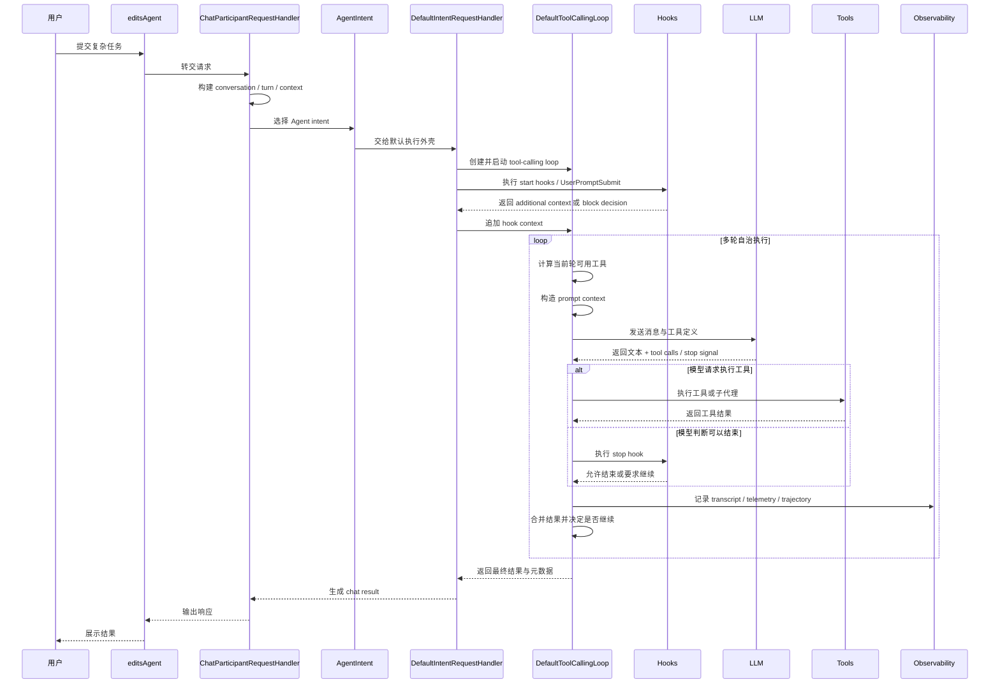
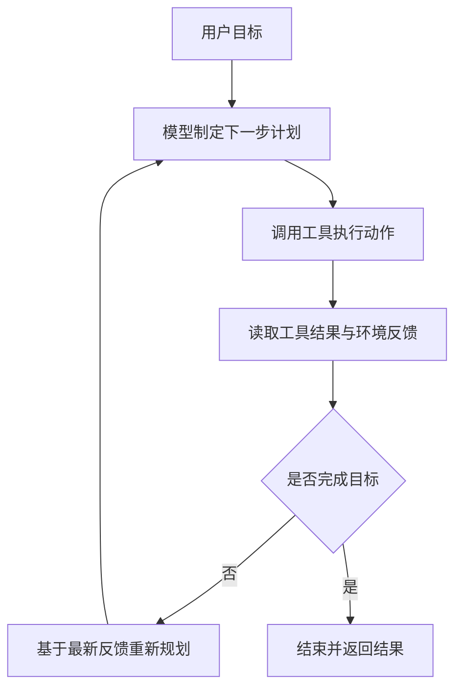
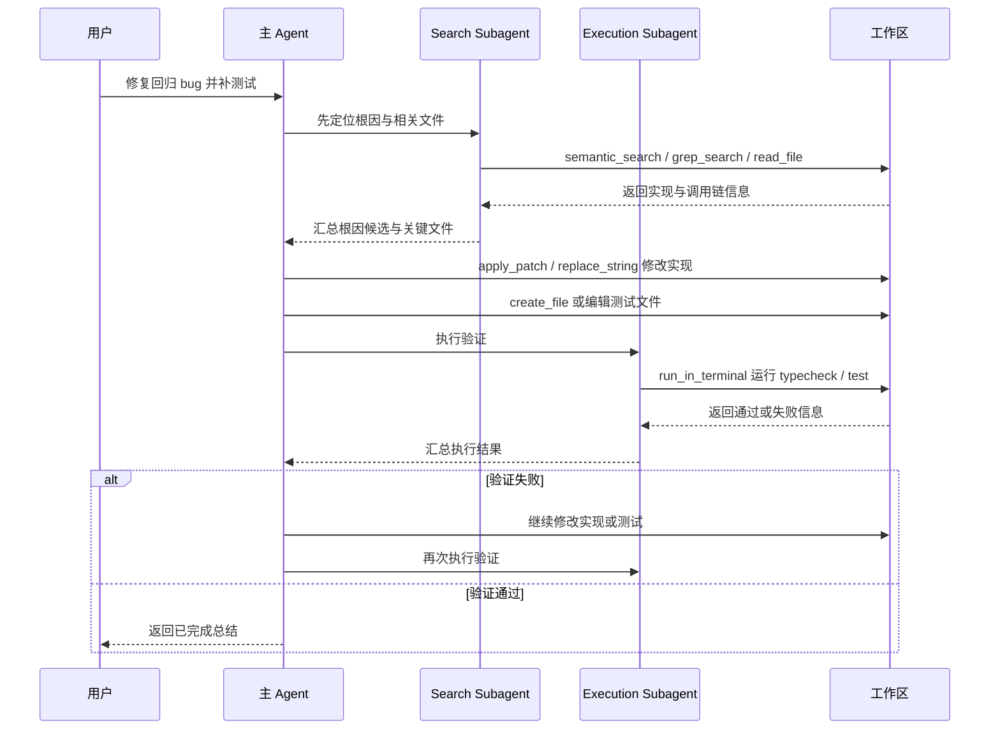
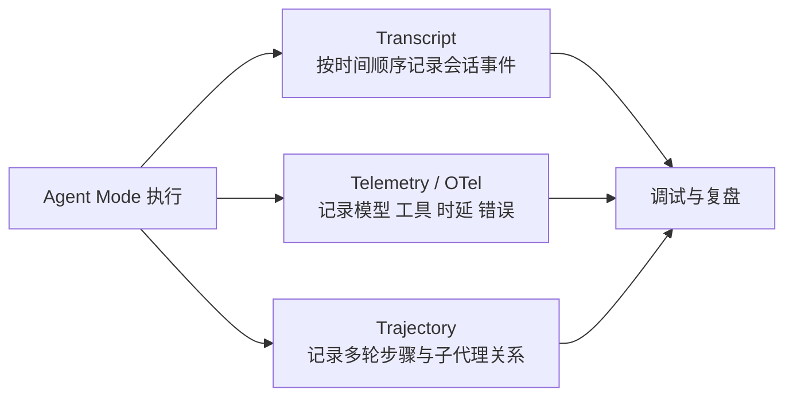
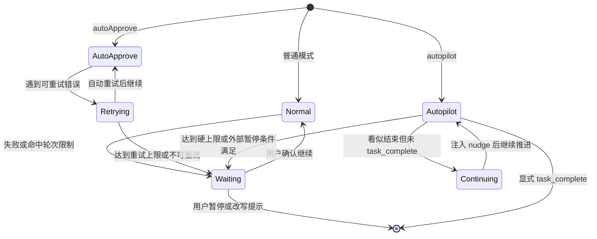
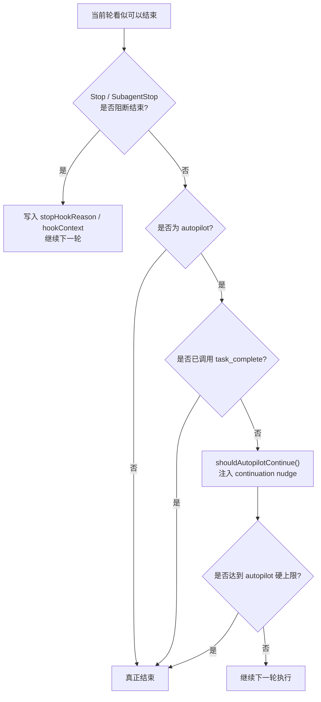
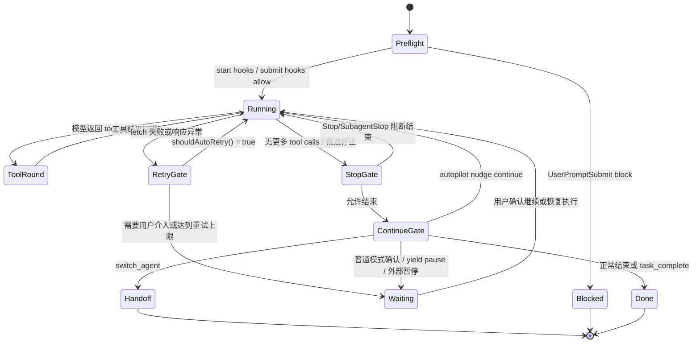
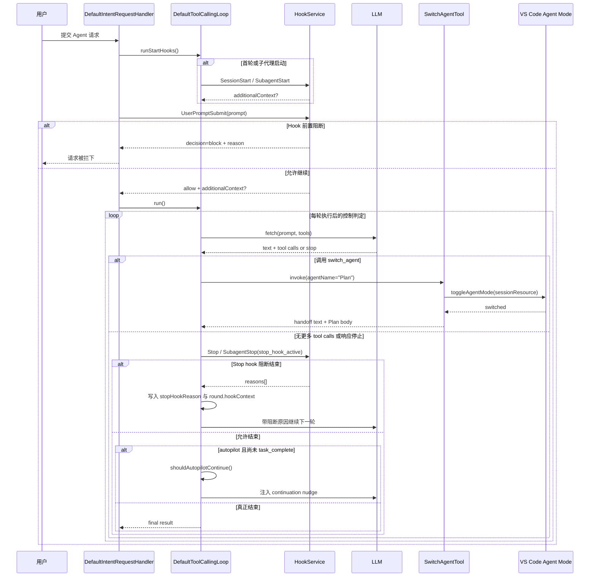

# Copilot Chat Agent Mode 执行链路与自治机制（下篇）

## 文档目标

本文是 Agent Mode 设计文档的下篇，重点解释它在运行时如何推进复杂任务，以及它为何能够在 Agent Mode 下自主完成多步骤工作。

如果将上篇理解为“系统长什么样”，那么下篇回答的是“系统如何运转”。

---

## 1. Agent Mode 的主执行链路

### 1.1 运行时时序图

这张时序图刻意把 hook 与 observability 放进主链路，是因为在这个项目里，Agent Mode 并不是“模型决定一切”的黑盒流程。执行前、停止前、以及每轮执行之后，都有明确的控制面和记录面插在链路中。

### 1.2 关键步骤拆解

#### Step 1：入口识别

系统首先根据 participant 与 command 判断当前请求是否进入 Agent Mode。当请求进入 `editsAgent` 时，默认 intent 会被绑定到 `Intent.Agent`，也就是 `AgentIntent`。

#### Step 2：建立 conversation 和 turn

`ChatParticipantRequestHandler` 会将历史 turn、当前请求与 document context 组装成完整的 conversation。这意味着 Agent 不是“孤立处理当前一句话”，而是在既有上下文之上继续工作。

#### Step 3：进入 AgentIntent

`AgentIntent` 主要做三件事情：

1. 设置 `maxToolCallIterations`
2. 设置 agent temperature
3. 把 request location 视为 `ChatLocation.Agent`

#### Step 4：启动 DefaultToolCallingLoop

`DefaultIntentRequestHandler.runWithToolCalling()` 会构造 `DefaultToolCallingLoop`。它是整个自治执行的引擎实例。

#### Step 5：构造 prompt context

Loop 会把下面这些内容放进 prompt context：

- 当前 query
- 历史对话
- 已完成的 tool call rounds
- 工具调用结果
- chat variables / references
- mode instructions
- hook 追加的上下文

#### Step 6：模型选择工具

模型返回的不只是文本，还可能返回多个 tool calls。例如：

1. `read_file` 看出错文件
2. `grep_search` 找调用链
3. `apply_patch` 修复实现
4. `run_task` 或 `runTests` 验证结果

#### Step 7：执行工具并回灌结果

工具执行结果会回灌到下一轮 prompt。该机制决定了 Agent 具备“边做边修正”的能力。

---

## 2. Agent 是如何自主完成复杂工作的

### 2.1 自主性来自闭环，不来自魔法

很多人第一次接触 Agent，会误以为“它之所以能完成复杂工作，是因为模型足够强”。但从工程实现看，更关键的是 **闭环设计**。

如果缺少这个闭环，再强的模型也可能：

- 只给建议不执行
- 执行一步后停住
- 执行失败后不知道如何恢复
- 任务做了一半却误判已完成

### 2.2 为什么要多轮而不是单轮

复杂任务通常有三个特点：

1. 信息不完整
2. 操作有副作用
3. 中间结果会改变下一步最优策略

因此，Agent 必须先搜索与阅读，再做最小改动，再进行验证，并基于验证结果决定是否继续修复。

### 2.3 为什么要引入 Subagent

当主代理既要思考全局策略，又要亲自执行所有细碎操作时，很容易出现上下文污染。

这里可以用一个生活化比喻：

- 主代理像项目经理 + 主程
- Search Subagent 像资料检索组
- Execution Subagent 像实验验证组

项目里目前有两个典型子代理，但它们不是无条件暴露给所有 Agent 会话的固定能力，而是要同时满足模型家族与实验开关条件后才会进入可用工具集：

- `SearchSubagentToolCallingLoop`：偏检索，只开放 `semantic_search`、`file_search`、`grep_search`、`read_file`
- `ExecutionSubagentToolCallingLoop`：偏执行，只开放 `run_in_terminal`

---

## 3. 工具系统的微架构设计

### 3.1 工具不是固定清单，而是动态能力集

Agent Mode 的工具集合不是硬编码的一张静态表，而是根据以下因素动态决定：

- 当前模型能力
- feature flags / experiments
- 当前请求权限级别
- 用户手动关闭的工具
- 当前工作区是否存在 task / tests

相关逻辑位于 [`src/extension/intents/node/agentIntent.ts`](../src/extension/intents/node/agentIntent.ts) 的 `getAgentTools()`。

### 3.2 这样设计的原因

| 设计目标 | 价值 |
| --- | --- |
| 模型适配 | 不同模型使用不同编辑工具策略 |
| 风险控制 | 没必要的危险工具不开放 |
| 成本优化 | 通过工具分组和选择优化 prompt 体积 |

### 3.3 工具分组与选择优化

`DefaultToolCallingLoop.getAvailableTools()` 中还包含一层工具分组逻辑。其目的不是将全部工具无差别暴露给模型，而是先构造一个与当前任务更匹配的候选工具集。

---

## 4. 复杂任务示例：Agent 如何完成一个跨文件问题

假设用户提出如下任务：

> 修复某个回归 bug，涉及 3 个 TypeScript 文件，并补一条单元测试，最后确认类型检查通过。

这个示例体现了 Agent Mode 的三个核心能力：

1. 先获取证据，再行动
2. 先做最小可验证改动，再验证
3. 验证失败时自动继续迭代

---

## 5. 为什么 Agent Mode 在这个项目里是可控的

“自治”并不等于“失控”。

Agent Mode 的可控性主要来自以下几层机制：

- 工具边界控制
- 轮次上限控制
- Hook 控制
- Transcript 与 Trajectory 的可回放能力

这些机制的共同目标，是在提升任务完成率的同时，将工具滥用、无限循环、无证据修改与不可解释行为控制在可接受范围内。

## 6. 长上下文管理与压缩机制

### 6.1 为什么长上下文管理是 Agent Mode 的一等机制

复杂任务和普通问答最大的差异之一，是它们更容易把上下文窗口迅速吃满。

原因并不神秘：

1. Agent 不只要记住用户问题，还要记住多轮工具调用历史。
2. 工具结果本身往往很长，尤其是文件内容、终端输出和测试日志。
3. 同一个任务常常要经历“搜索 -> 修改 -> 验证 -> 继续修改”的闭环，而不是一次性结束。

所以在这个项目里，长上下文管理不是一个附属优化，而是 Agent Mode 执行架构的一部分。否则系统很快就会落入两种坏状态：

1. 历史保留过多，prompt 超预算，任务中途失忆。
2. 历史裁剪过猛，模型看不到关键前因后果，开始重复劳动或误判已完成。

这里的解决思路不是单靠一种“压缩按钮”，而是把一整套机制叠在一起：

1. 用户显式触发的 `/compact`
2. prompt 构造阶段的前台 summarization
3. 运行中的 background compaction
4. tool token budgeting
5. transcript lookup 提示
6. 某些 endpoint 自带的 context management / truncation

可以把它理解成一个分层记忆系统：

- 最近、最关键的上下文保留原文
- 较早但仍重要的历史被压缩成 summary
- 真正完整的原始过程保存在 transcript 中，必要时再回查

### 6.2 `/compact`：用户显式触发的同步压缩链路

`/compact` 不是一个 UI 层小命令，而是 Agent Mode 控制面的一部分。

当请求命中 `request.command === 'compact'` 时，`AgentIntent.handleRequest()` 不再走普通执行链路，而是进入 `handleSummarizeCommand()`。

这条链路大致做了六件事：

1. 先调用 `normalizeSummariesOnRounds()`，把之前挂在 metadata 上的 summary 恢复到 rounds。
2. 排除当前 `/compact` 这一轮，只对已有历史做压缩。
3. 检查最后一个历史 round 是否存在，因为 summary 需要挂到一个具体 round 上。
4. 如果当前 endpoint 已启用 responses context management，则直接退出，避免和 endpoint 自带压缩策略重复。
5. 使用 `SummarizedConversationHistory` prompt 生成摘要。
6. 把 `SummarizedConversationHistoryMetadata` 写回当前 turn metadata 与 `chatResult.metadata.summary`。

这说明 `/compact` 的本质不是“删除历史”，而是把历史从“原始多轮记录”转换成“绑定到某个 tool call round 的结构化摘要”。

### 6.3 前台 summarization：在 prompt 构造时同步救场

除了显式 `/compact`，Agent Mode 还会在 `AgentIntentInvocation.buildPrompt()` 中做一套同步压缩判断。

这里最关键的点是：**summary 和 prompt budget 是同一个决策过程的一部分**。

核心逻辑包括：

1. 先计算当前 tools 的 token 开销。
2. 根据 `summarizeAgentConversationHistoryThreshold` 与模型最大上下文，得到 base budget。
3. 再扣掉 tool tokens，并留出安全余量，形成 budget threshold。
4. 如果直接 render 触发 `BudgetExceededError`，就转入 summarization 路径重新构造 prompt。

这体现了一个很工程化的设计思路：系统不只是管理“历史对话有多长”，也在管理“为了这轮任务暴露给模型的工具定义本身有多贵”。

### 6.4 Background compaction：把压缩工作提前到未来轮次之前

如果说 `/compact` 是用户主动整理会话历史，那么 background compaction 更像系统在后台提前收拾会议纪要。

它的目标是两件事：

1. 不要每次都等预算爆炸后再同步压缩。
2. 尽量把压缩工作提前做完，等后续轮次真正需要时直接复用结果。

从实现上看，这是一套双阈值策略：

1. 当上下文占用达到约 `75%`，且后台 summarizer 处于 `Idle` 或 `Failed`，就启动后台压缩。
2. 当上下文占用达到约 `95%`，且后台压缩仍在进行，主流程会阻塞等待压缩完成，再应用 summary。
3. 如果上一轮后台压缩已经 `Completed`，那么本轮可以在 render 前直接消费结果。

这套机制的好处是，它把“压缩是否发生”从一个二元开关变成了平滑的运行时策略：

- `75%` 更像预警线
- `95%` 更像强制切换线
- `Completed` 则像命中预计算缓存

### 6.5 Summary 是如何跨轮次继续生效的

压缩链路真正难的地方，不是“生成一段摘要”，而是让后续轮次还能正确用上它。

这个项目里的做法是两段式的：

1. 先把 summary 作为 metadata 挂到当前 turn 上。
2. 再由 `normalizeSummariesOnRounds()` 在后续请求开始时，把 summary 恢复到对应的历史 round 上。

`normalizeSummariesOnRounds()` 的处理逻辑有三个关键点：

1. 它优先读取 `turn.resultMetadata.summaries`，兼容旧格式时也会回退到单个 `summary` 字段。
2. 每个 turn 只认最后一个 summary，因为新 summary 会覆盖旧 summary。
3. 它会先在当前 turn 查找目标 round，找不到再向前扫描 previous turns。

这意味着 summary 并不是一段孤立文本，而是和具体的 `toolCallRoundId` 绑定。系统因此可以明确知道“这段摘要替代的是哪一轮原始历史”，而不是把所有压缩结果混成一个全局注释。

### 6.6 Transcript lookup：让压缩不等于丢失原始证据

长上下文管理还有一个经常被忽略的配套点：压缩并不意味着原始历史彻底不可见。

`github.copilot.chat.conversationTranscriptLookup.enabled` 这个配置的设计意图是：当 conversation history 已经被 summarized 后，模型会被提醒“完整 transcript 仍然可以通过 `read_file` 回查”。

这件事的意义很大，因为它把上下文管理从“二选一”变成了“多层存储”：

1. prompt 内只保留最有价值的压缩结果
2. 完整历史仍然存在 transcript 中
3. 真有必要时，模型可以显式回查原始过程

换句话说，这里做的不是信息删除，而是信息分层。

### 6.7 这一整套机制解决了什么问题

把 `/compact`、前台 summarization、background compaction、summary 恢复、transcript lookup 串起来看，会发现它们共同解决的是一个核心矛盾：

> Agent 想完成长任务，就必须保留足够多的历史；但 Agent 想继续执行，又必须把 prompt 控制在模型预算之内。

这个项目当前的答案不是“永远保留”或“永远裁剪”，而是：

1. 先尽量保留原始历史
2. 接近预算时转成结构化 summary
3. 完整原始过程交给 transcript 承担
4. 在后台提前做压缩，把同步等待成本降下来

这也解释了为什么长上下文管理在 Agent Mode 里不是一个补丁，而是和执行链路深度耦合的基础机制。

---

## 7. 可观测性微架构

### 7.1 Transcript 与 Trajectory

Session transcript 的职责是按时间顺序记录一次 Agent 会话中的关键事件，对应接口见 [../src/platform/chat/common/sessionTranscriptService.ts](../src/platform/chat/common/sessionTranscriptService.ts)。

Trajectory 更偏向结构化追踪，对应实现见 [../src/platform/trajectory/node/trajectoryLoggerAdapter.ts](../src/platform/trajectory/node/trajectoryLoggerAdapter.ts)。

可以把二者关系理解为：

- Transcript = 日志本
- Trajectory = 战术地图

### 7.2 可观测性视图

---

## 8. Agent Mode 与 Ask / Edit 模式的关系

| 模式 | 目标 | 典型特点 |
| --- | --- | --- |
| Ask | 回答问题 | 工具能力可选，更偏解释与建议 |
| Edit | 在受限文件范围内编辑 | 强约束、低风险、少自治 |
| Agent | 自治完成复杂任务 | 多轮执行、跨文件、可调工具、可派生子代理 |

其中一个值得注意的设计是：**Edit Mode 可以 handoff 到 Agent Mode**。这说明它们不是彼此孤立的产品能力，而是一条逐步升级的能力链。

---

## 9. 关键设计取舍与演进方向

### 9.1 设计取舍

从执行链路视角看，Agent Mode 当前至少体现了三项关键取舍。

#### 取舍一：选择“验证驱动执行”而不是“生成后立即结束”

这种设计使系统能够将测试、类型检查、命令执行与错误结果纳入闭环，但也意味着整体耗时更长，且对工具执行稳定性更加敏感。

#### 取舍二：选择“运行时重规划”而不是“预先一次性规划到结束”

优点是可以针对中间结果动态调整策略；代价是轨迹更长，决策路径更复杂，调试与复现成本更高。

#### 取舍三：选择“受约束自治”而不是“无边界自治”

工具边界、轮次上限、权限机制与 observability 构成了当前系统的约束框架。它牺牲了部分自由度，但换来了可预测性与可运营性。

### 9.2 可能的演进方向

后续如果继续增强 Agent Mode，其演进重点很可能集中在以下方向：

1. 更强的跨轮状态压缩与恢复能力，降低长链路任务的上下文负担。
2. 更细粒度的验证策略，将 typecheck、unit test、lint 与任务目标做更紧密的动态绑定。
3. 更成熟的子代理协作协议，包括委派目标表达、结果摘要与失败升级机制。
4. 更完善的轨迹分析能力，用于复盘长任务、比较不同执行策略并支持后续调优。

---

## 10. 架构总结

从执行机制视角看，这个项目中的 Agent Mode 有三个最重要的特征：

1. 它不是一个“回答型模型能力”，而是一个“执行型系统能力”
2. 它的微架构是“分层 + 闭环 + 可观测”
3. 它的自治性来自反馈回路，而不是来自一次性生成

---

## 11. 类与方法级源码索引

如果目标是理解“自治执行循环”如何在代码中落地，建议优先关注以下类与方法。这里给出关键行锚点，方便直接跳到主实现段。

| 执行职责 | 类 / 方法 | 关键位置 | 说明 |
| --- | --- | --- | --- |
| 启动 loop | `DefaultIntentRequestHandler.runWithToolCalling()` | [../src/extension/prompt/node/defaultIntentRequestHandler.ts#L318](../src/extension/prompt/node/defaultIntentRequestHandler.ts#L318) | 创建并启动 `DefaultToolCallingLoop`，是执行链路最关键的桥接点 |
| Loop 实现 | `DefaultToolCallingLoop` | [../src/extension/prompt/node/defaultIntentRequestHandler.ts#L606](../src/extension/prompt/node/defaultIntentRequestHandler.ts#L606) | 主执行 loop 的具体实现，聚合 telemetry、tool grouping 与 fetch 行为 |
| Prompt 上下文构造 | `ToolCallingLoop.createPromptContext()` | [../src/extension/intents/node/toolCallingLoop.ts#L217](../src/extension/intents/node/toolCallingLoop.ts#L217) | 将历史、工具结果、变量和 hook 上下文装配为每轮上下文 |
| Tool availability | `DefaultToolCallingLoop.getAvailableTools()` | [../src/extension/prompt/node/defaultIntentRequestHandler.ts#L734](../src/extension/prompt/node/defaultIntentRequestHandler.ts#L734) | 执行时动态决定当前轮工具集，并处理 tool grouping |
| Prompt 构造 | `DefaultToolCallingLoop.buildPrompt()` | [../src/extension/prompt/node/defaultIntentRequestHandler.ts#L685](../src/extension/prompt/node/defaultIntentRequestHandler.ts#L685) | 调用 invocation 生成 prompt，并修正消息命名 |
| 模型请求 | `DefaultToolCallingLoop.fetch()` | [../src/extension/prompt/node/defaultIntentRequestHandler.ts#L691](../src/extension/prompt/node/defaultIntentRequestHandler.ts#L691) | 发起真实模型调用，注入 debugName、location 与 telemetry properties |
| Stop hook | `ToolCallingLoop.executeStopHook()` | [../src/extension/intents/node/toolCallingLoop.ts#L281](../src/extension/intents/node/toolCallingLoop.ts#L281) | 停止前的 hook 阻断点，用于阻止错误地过早结束 |
| `/compact` 同步压缩 | `AgentIntent.handleSummarizeCommand()` | [../src/extension/intents/node/agentIntent.ts#L219](../src/extension/intents/node/agentIntent.ts#L219) | 显式触发会话压缩，并把摘要落到当前 turn metadata |
| 自动压缩与预算控制 | `AgentIntentInvocation.buildPrompt()` | [../src/extension/intents/node/agentIntent.ts#L366](../src/extension/intents/node/agentIntent.ts#L366) | 计算 tool tokens、预算阈值，并决定前台或后台压缩路径 |
| Summary 恢复 | `normalizeSummariesOnRounds()` | [../src/extension/prompt/common/conversation.ts#L199](../src/extension/prompt/common/conversation.ts#L199) | 将 metadata 中的 summary 恢复到对应历史 rounds |
| Search 子代理 | `SearchSubagentToolCallingLoop` | [../src/extension/prompt/node/searchSubagentToolCallingLoop.ts#L39](../src/extension/prompt/node/searchSubagentToolCallingLoop.ts#L39) | 检索子代理的主类入口，负责收缩为只读检索能力 |
| Execution 子代理 | `ExecutionSubagentToolCallingLoop` | [../src/extension/prompt/node/executionSubagentToolCallingLoop.ts#L38](../src/extension/prompt/node/executionSubagentToolCallingLoop.ts#L38) | 执行子代理的主类入口，负责收缩为终端执行能力 |

---

## 12. 源码阅读索引

如果目标是理解“自治执行是如何在代码里落地的”，建议按以下顺序阅读：

1. 从 [../src/extension/intents/node/agentIntent.ts](../src/extension/intents/node/agentIntent.ts) 了解 Agent Mode 的策略入口与工具裁剪。
2. 阅读 [../src/extension/prompt/node/defaultIntentRequestHandler.ts](../src/extension/prompt/node/defaultIntentRequestHandler.ts) 了解执行外壳如何启动 loop。
3. 阅读 [../src/extension/intents/node/toolCallingLoop.ts](../src/extension/intents/node/toolCallingLoop.ts) 了解多轮自治执行的核心状态机。
4. 阅读 [../src/extension/intents/node/agentIntent.ts](../src/extension/intents/node/agentIntent.ts) 中的 `handleSummarizeCommand()` 与 `buildPrompt()`，理解 `/compact`、预算控制和自动压缩。
5. 阅读 [../src/extension/prompt/common/conversation.ts](../src/extension/prompt/common/conversation.ts) 的 `normalizeSummariesOnRounds()`，理解 summary 如何跨轮次继续生效。
6. 阅读 [../src/extension/prompts/node/panel/toolCalling.tsx](../src/extension/prompts/node/panel/toolCalling.tsx) 理解工具调用 prompt 如何组织。
7. 阅读 [../src/extension/prompt/node/searchSubagentToolCallingLoop.ts](../src/extension/prompt/node/searchSubagentToolCallingLoop.ts) 与 [../src/extension/prompt/node/executionSubagentToolCallingLoop.ts](../src/extension/prompt/node/executionSubagentToolCallingLoop.ts) 理解子代理如何缩窄能力边界。
8. 最后阅读 [../src/platform/chat/common/sessionTranscriptService.ts](../src/platform/chat/common/sessionTranscriptService.ts) 与 [../src/platform/trajectory/node/trajectoryLoggerAdapter.ts](../src/platform/trajectory/node/trajectoryLoggerAdapter.ts) 理解结果如何被记录与追踪。

---

## 13. 建议的阅读顺序

如果你准备继续深入源码，建议按这个顺序阅读：

1. [`src/extension/conversation/vscode-node/chatParticipants.ts`](../src/extension/conversation/vscode-node/chatParticipants.ts)
2. [`src/extension/prompt/node/chatParticipantRequestHandler.ts`](../src/extension/prompt/node/chatParticipantRequestHandler.ts)
3. [`src/extension/intents/node/agentIntent.ts`](../src/extension/intents/node/agentIntent.ts)
4. [`src/extension/prompt/node/defaultIntentRequestHandler.ts`](../src/extension/prompt/node/defaultIntentRequestHandler.ts)
5. [`src/extension/intents/node/toolCallingLoop.ts`](../src/extension/intents/node/toolCallingLoop.ts)
6. [`src/extension/prompt/common/conversation.ts`](../src/extension/prompt/common/conversation.ts)
7. [`src/extension/prompt/node/searchSubagentToolCallingLoop.ts`](../src/extension/prompt/node/searchSubagentToolCallingLoop.ts)
8. [`src/extension/prompt/node/executionSubagentToolCallingLoop.ts`](../src/extension/prompt/node/executionSubagentToolCallingLoop.ts)
9. [`src/platform/trajectory/node/trajectoryLoggerAdapter.ts`](../src/platform/trajectory/node/trajectoryLoggerAdapter.ts)

---

## 14. 读码导览：为什么看这些代码

如果你的目标是理解“Agent 为什么能连续做事、修错、再继续”，建议按下面的顺序读，并带着明确问题进入每一段代码。

### 第一步：看 loop 是从哪里被真正启动的

先看 [runWithToolCalling](../src/extension/prompt/node/defaultIntentRequestHandler.ts#L318)。

这段代码是运行时链路里最重要的桥接点，因为它把上层 intent invocation 和下层 `DefaultToolCallingLoop` 真正接起来了。读这段时，建议重点关注：

1. `DefaultToolCallingLoop` 初始化时接收了哪些执行参数。
2. tool call limit、temperature、location 这些运行参数是在哪里注入的。
3. hooks、response handlers、telemetry 是怎样在 loop 生命周期里挂上的。

### 第二步：看主执行 loop 的具体实现长什么样

接着看 [DefaultToolCallingLoop](../src/extension/prompt/node/defaultIntentRequestHandler.ts#L606)。

这一段代码重要的原因是：它不是抽象接口，而是当前 Agent Mode 主执行器的具体实现。读它时，重点不是把每一行都看完，而是先弄清楚它在构造函数里接入了哪些横切能力，例如 telemetry、tool grouping、transcript、hooks。

### 第三步：看每一轮 prompt context 是如何被重建的

然后看 [createPromptContext](../src/extension/intents/node/toolCallingLoop.ts#L217)。

这段代码解释了 Agent 的“记忆”到底来自哪里。建议重点看：

1. 历史 turn 如何进入本轮上下文。
2. tool call results 与 tool call rounds 如何进入本轮上下文。
3. continuation、stop hook reason、mode instructions 如何影响当前 query。

理解这里之后，你就会知道 Agent 的“持续执行感”并不是魔法，而是每一轮都在重建上下文。

### 第四步：看一轮执行里是如何选择工具的

看 [getAvailableTools](../src/extension/prompt/node/defaultIntentRequestHandler.ts#L734)。

这段代码值得看，是因为它说明了“当前轮可用工具”并不是简单等于“Agent 总工具集”。它还会结合 tool grouping 做进一步裁剪与优化。这也是为什么同一个 Agent 在不同轮次里可见的工具集合可能不同。

### 第五步：看 prompt 和真实模型请求是怎样串起来的

看 [buildPrompt](../src/extension/prompt/node/defaultIntentRequestHandler.ts#L685) 和 [fetch](../src/extension/prompt/node/defaultIntentRequestHandler.ts#L691)。

这两段代码最好连着看：

1. `buildPrompt()` 负责把 invocation 侧生成的 prompt 真正送入 loop。
2. `fetch()` 负责把这一轮消息、工具 schema、telemetry properties 和 debugName 送到模型端。

如果只看其中一段，你会失去“prompt 如何变成真实请求”的完整视角。

### 第六步：看系统为什么不会轻易在错误时停止

看 [executeStopHook](../src/extension/intents/node/toolCallingLoop.ts#L281)。

这段代码值得看，是因为它体现了 Agent Mode 的一个重要工程取向：系统不是简单地“模型说结束就结束”，而是在停止前还允许 hook 机制阻断。这是“受约束自治”落到代码层面的典型例子。

### 第七步：看子代理为什么能降低复杂任务的上下文污染

看 [SearchSubagentToolCallingLoop](../src/extension/prompt/node/searchSubagentToolCallingLoop.ts#L39) 和 [ExecutionSubagentToolCallingLoop](../src/extension/prompt/node/executionSubagentToolCallingLoop.ts#L38)。

读这两段代码时，建议重点关注它们如何通过更窄的工具集定义能力边界。这里的关键不是“又多了两个 loop”，而是主代理把某类问题隔离到更小的执行空间里，从而降低主上下文污染和工具滥用风险。

### 第八步：看执行结果为什么是可回放的

最后回看 [../src/platform/chat/common/sessionTranscriptService.ts](../src/platform/chat/common/sessionTranscriptService.ts) 和 [../src/platform/trajectory/node/trajectoryLoggerAdapter.ts](../src/platform/trajectory/node/trajectoryLoggerAdapter.ts)。

这一步的重点不是再理解执行逻辑，而是回答另一个问题：当 Agent 执行失败、跑偏或过慢时，系统为什么还能被分析和调优。没有 transcript 和 trajectory，这条链路本质上仍然是黑盒。

---

## 15. 读码路线图

如果你已经理解上篇的静态架构，接下来可以按下面三条路线阅读执行链路。

### 路线 A：执行主链路路线

适合优先理解“Agent 为什么能自己一直做下去”。

1. 先看 [runWithToolCalling](../src/extension/prompt/node/defaultIntentRequestHandler.ts#L318)，确认 loop 在哪里被真正启动。
2. 再看 [DefaultToolCallingLoop](../src/extension/prompt/node/defaultIntentRequestHandler.ts#L606)，确认主执行器的职责边界。
3. 接着看 [createPromptContext](../src/extension/intents/node/toolCallingLoop.ts#L217)，理解每一轮上下文如何被重建。
4. 最后看 [buildPrompt](../src/extension/prompt/node/defaultIntentRequestHandler.ts#L685) 和 [fetch](../src/extension/prompt/node/defaultIntentRequestHandler.ts#L691)，完成“从上下文到真实模型请求”的闭环理解。

### 路线 B：能力收缩与风险控制路线

适合理解为什么 Agent 能自治，但又不会完全失控。

1. 看 [getAvailableTools](../src/extension/prompt/node/defaultIntentRequestHandler.ts#L734)，理解当前轮工具是如何被裁剪的。
2. 看 [executeStopHook](../src/extension/intents/node/toolCallingLoop.ts#L281)，理解停止前的阻断机制。
3. 看 [SearchSubagentToolCallingLoop](../src/extension/prompt/node/searchSubagentToolCallingLoop.ts#L39) 和 [ExecutionSubagentToolCallingLoop](../src/extension/prompt/node/executionSubagentToolCallingLoop.ts#L38)，理解子代理如何通过更窄能力边界降低风险。

### 路线 C：观测与调优路线

适合在系统“已经能跑”的前提下理解如何复盘执行效果。

1. 先看 [../src/platform/chat/common/sessionTranscriptService.ts](../src/platform/chat/common/sessionTranscriptService.ts)，理解按时间顺序的事件记录。
2. 再看 [../src/platform/trajectory/node/trajectoryLoggerAdapter.ts](../src/platform/trajectory/node/trajectoryLoggerAdapter.ts)，理解结构化轨迹记录。
3. 然后回到 [DefaultToolCallingLoop](../src/extension/prompt/node/defaultIntentRequestHandler.ts#L606)，观察 transcript、telemetry、trajectory 是如何在主执行 loop 中协同工作的。

---

## 16. 关键方法剖面：输入、输出与状态变化

下面这张表用于帮助你快速把“多轮自治执行”拆成几个稳定的状态转换点。

| 方法 | 输入 | 输出 | 关键状态变化 |
| --- | --- | --- | --- |
| [runWithToolCalling](../src/extension/prompt/node/defaultIntentRequestHandler.ts#L318) | `IIntentInvocation`、request、document context、handler options | `IInternalRequestResult` | 创建 `DefaultToolCallingLoop`，挂接 hooks/response handlers，驱动整轮执行开始 |
| [DefaultToolCallingLoop.buildPrompt](../src/extension/prompt/node/defaultIntentRequestHandler.ts#L685) | `IBuildPromptContext`、progress、token | `IBuildPromptResult` | 通过 invocation 构造本轮 prompt，并修正消息命名 |
| [DefaultToolCallingLoop.fetch](../src/extension/prompt/node/defaultIntentRequestHandler.ts#L691) | 当前轮消息、工具 schema、request options | `ChatResponse` | 发起真实模型请求，注入 debugName、location 与 telemetry properties |
| [DefaultToolCallingLoop.getAvailableTools](../src/extension/prompt/node/defaultIntentRequestHandler.ts#L734) | output stream、token、invocation 能力 | `LanguageModelToolInformation[]` | 基于当前轮上下文和 tool grouping 生成有效工具集 |
| [ToolCallingLoop.createPromptContext](../src/extension/intents/node/toolCallingLoop.ts#L217) | available tools、output stream、conversation、历史轮次 | `IBuildPromptContext` | 将 query、history、tool results、mode instructions、hook context 汇总成新一轮上下文 |
| [ToolCallingLoop.runStartHooks](../src/extension/intents/node/toolCallingLoop.ts#L585) | output stream、token、request hooks、conversation/session state | `Promise<void>` | 在第一轮 prompt 前启动 transcript，执行 SessionStart/SubagentStart，并把 additional context 注入 loop |
| [ToolCallingLoop.executeStopHook](../src/extension/intents/node/toolCallingLoop.ts#L281) | stop hook input、session id、output stream、token | `StopHookResult` | 在 loop 停止前执行阻断检查，必要时把停止改写为继续 |
| [ToolCallingLoop.shouldAutopilotContinue](../src/extension/intents/node/toolCallingLoop.ts#L356) | 当前轮结果、历史 rounds、autopilot 状态位 | `string \| undefined` | 当模型试图结束但尚未 `task_complete` 时，生成内部 continuation nudge |
| [ToolCallingLoop.shouldAutoRetry](../src/extension/intents/node/toolCallingLoop.ts#L397) | `ChatResponse`、permission level、retry count | `boolean` | 在 `autoApprove`/`autopilot` 模式下决定失败后是否自动重试 |
| [ExecutionSubagentToolCallingLoop.getAvailableTools](../src/extension/prompt/node/executionSubagentToolCallingLoop.ts#L113) | execution subagent options、token | `LanguageModelToolInformation[]` | 将子代理能力压缩为终端执行相关工具集合 |
| [SwitchAgentTool.invoke](../src/extension/tools/vscode-node/switchAgentTool.ts#L20) | `agentName`、chat session resource | `LanguageModelToolResult` | 通过受限工具把当前会话切换到另一个 agent mode，并回写 handoff 指令 |

---

## 17. 关键方法剖面：调用前条件、调用后保证与失败路径

这一节聚焦运行时自治链路中的关键状态转换点。读这些方法时，建议不要只看“实现逻辑”，也要看它们在系统协议中的语义承诺。

### [runWithToolCalling](../src/extension/prompt/node/defaultIntentRequestHandler.ts#L318)

调用前条件：

1. `IIntentInvocation` 已准备完成，并可提供 prompt/build/fetch 所需能力。
2. request、document context、handler options 已经由上层 intent 解析完成。
3. stream、token、hooks、telemetry builder 已处于可用状态。

调用后保证：

1. 会创建并启动一个 `DefaultToolCallingLoop` 实例。
2. start hooks、response handlers、telemetry、websocket 关联生命周期会被统一接入。
3. 返回结果会被规范化为 `IInternalRequestResult`，供更上层组装成最终 chat result。

失败路径：

1. hooks、loop 初始化、prompt 构造或模型调用都可能导致失败。
2. 失败既可能表现为异常，也可能表现为结构化错误结果。
3. `finally` 块保证 websocket 关闭与 handler 清理，即使中途失败也不会完全泄漏生命周期状态。

### [ToolCallingLoop.createPromptContext](../src/extension/intents/node/toolCallingLoop.ts#L217)

调用前条件：

1. 当前 turn 已存在。
2. 已有 conversation、available tools、request 以及可能的 tool call history。
3. continuation 状态与 stop hook reason 已可判断。

调用后保证：

1. 返回一个可供本轮 prompt renderer 使用的完整 `IBuildPromptContext`。
2. query、history、toolCallResults、toolCallRounds、mode instructions 与 hook context 会被汇总到同一对象中。
3. 当前轮是 continuation 还是新请求，会被显式编码进上下文。

失败路径：

1. 这个方法本身更偏纯装配逻辑，典型失败较少。
2. 真正的风险在于上游状态不一致时构造出不完整上下文，进而在后续 buildPrompt/fetch 阶段表现为行为异常。

### [DefaultToolCallingLoop.getAvailableTools](../src/extension/prompt/node/defaultIntentRequestHandler.ts#L734)

调用前条件：

1. invocation 必须能够返回基础工具集合，或者至少返回空数组。
2. 当前会话的 tool grouping 状态可被初始化或复用。
3. output stream 可选地可用于显示“Optimizing tool selection...”进度。

调用后保证：

1. 返回本轮真正可见给模型的工具集，而不是原始全集。
2. Anthropic 特殊路径和 tool grouping 路径会得到一致处理。
3. 当前会话的工具可见性状态会被同步到 grouping 机制中。

失败路径：

1. tool grouping 计算失败或工具查询失败，可能导致能力降级或回退。
2. 常见结果是“工具变少”或“优化失效”，而不是整个 loop 立即崩溃。

### [DefaultToolCallingLoop.fetch](../src/extension/prompt/node/defaultIntentRequestHandler.ts#L691)

调用前条件：

1. 本轮 prompt 已构造完成。
2. endpoint 已选定且具备当前请求所需能力。
3. request options、tools schema、telemetry properties 均可被序列化并发送给模型端。

调用后保证：

1. 会发起一次真实模型请求，并返回 `ChatResponse`。
2. telemetry 中的 message id、conversation id、debugName 和 request kind 会被写入请求元数据。
3. 如果模型返回 token 流，telemetry 会同步记录 token 接收情况。

失败路径：

1. 网络错误、过滤、限流、配额、状态错误等都可能在这一层表现出来。
2. 这些失败大多不会直接抛给用户，而是会在上层被归一化成 `ChatFetchResponseType.*` 的结果分支。

### [ToolCallingLoop.executeStopHook](../src/extension/intents/node/toolCallingLoop.ts#L281)

调用前条件：

1. loop 已接近停止条件。
2. request.hooks 中存在可执行的 stop hook，或者至少系统允许尝试执行。
3. session id 与 output stream 可用于记录 hook 反馈。

调用后保证：

1. 返回 `StopHookResult`，明确给出是否应该继续执行。
2. 如果 hook 阻断了停止，阻断理由会被收集并可写入输出流。
3. stop hook 的异常不会无条件拖垮整个 loop。

失败路径：

1. hook 内部失败可能被降级为“允许停止”或“记录阻断原因”，取决于输出类型。
2. 只有显式的 hook abort 语义才会被向上传递为真正的中断信号。

### [ToolCallingLoop.runStartHooks](../src/extension/intents/node/toolCallingLoop.ts#L585)

调用前条件：

1. request、conversation、turn 已经建立完成，loop 但尚未进入第一轮模型请求。
2. `request.hooks`、`hasHooksEnabled`、`subAgentInvocationId` 等控制位已经可读。
3. 当前方法必须在 `run()` 之前调用，否则首轮 prompt 看不到 hooks 注入的上下文。

调用后保证：

1. 常规会话会在有 hooks 时启动 transcript，并把既有历史回放给 transcript service。
2. 顶层会话仅在第一 turn 执行 `SessionStart`，子代理请求则执行 `SubagentStart`。
3. hooks 返回的 `additionalContext` 会被拼接并保存到 loop 的 `additionalHookContext`，随后进入 prompt context。
4. 当前用户消息会在这一阶段写入 transcript，而不是等模型返回后再补记。

失败路径：

1. `SessionStart` 和 `SubagentStart` 的普通错误会被记录并吞掉，系统退化为“没有附加上下文”而不是整轮失败。
2. 只有显式 `HookAbortError` 才会真正终止后续执行。
3. 如果调用方遗漏这一步，常见后果不是立刻抛错，而是 hooks 配置“看似生效但首轮没有被模型看到”。

### [ToolCallingLoop.shouldAutopilotContinue](../src/extension/intents/node/toolCallingLoop.ts#L356)

调用前条件：

1. 当前请求已处于 `autopilot` 权限级别。
2. loop 已经拿到一轮成功结果，并正准备在“无更多 tool calls”条件下决定是否停止。
3. `taskCompleted` 标志位与历史 `toolCallRounds` 可被检查。

调用后保证：

1. 如果本轮或历史轮次已经调用 `task_complete`，方法返回 `undefined`，允许 loop 真正结束。
2. 如果尚未显式完成任务，方法返回一段 continuation nudge，把“继续工作直到调用 `task_complete`”编码回下一轮上下文。
3. 该方法同时维护 `autopilotIterationCount` 这一安全阀，避免无限自激继续。

失败路径：

1. 这不是一个以异常为主的失败点，最主要的“失败”是命中最大 continuation 次数后返回 `undefined`，让 loop 被迫结束。
2. 如果历史中遗漏了 `task_complete` 记录，系统会表现为持续催促模型继续，而不是结构性崩溃。

### [ToolCallingLoop.shouldAutoRetry](../src/extension/intents/node/toolCallingLoop.ts#L397)

调用前条件：

1. 本轮 fetch 已返回非理想结果，loop 需要判断要不要自动再试一次。
2. `request.permissionLevel` 与当前 `autopilotRetryCount` 已可读取。
3. response 已经被归一化为 `ChatFetchResponseType.*`。

调用后保证：

1. 仅在 `autoApprove` 或 `autopilot` 权限下，系统才可能进入自动重试分支。
2. `RateLimited`、`QuotaExceeded`、`Canceled`、`OffTopic` 会被明确排除，不会被误判为可重试错误。
3. 自动重试次数受 `MAX_AUTOPILOT_RETRIES` 约束，避免在坏状态下无限循环。

失败路径：

1. 这里的典型失败不是抛异常，而是返回 `false` 导致 loop 直接进入 stop hook 或停止分支。
2. 如果权限级别判断错误，外在表现通常是“该自动重试时没有重试”或“错误地继续重试”，而不是 prompt 构造出错。

### [SwitchAgentTool.invoke](../src/extension/tools/vscode-node/switchAgentTool.ts#L20)

调用前条件：

1. 当前 agent 已经拿到 `switch_agent` 这一工具，并且请求上下文允许调用该工具。
2. 输入中必须给出 `agentName`，且当前实现只接受 `Plan`。
3. `chatSessionResource` 必须可用，以便将切换绑定到当前会话而不是全局状态。

调用后保证：

1. 会通过 `workbench.action.chat.toggleAgentMode` 把当前会话切换到新的 agent mode。
2. 返回结果中不仅确认切换成功，还会把目标 agent 的初始 body 一并交给模型，帮助它在新模式下继续对话。
3. 结果明确提醒“当前工具在新 agent 中可能不再可见”，这说明它是一次真实的模式切换，不是单轮临时委派。

失败路径：

1. 如果输入不是 `Plan`，方法会直接抛错，而不是尝试模糊匹配或回退到其他 agent。
2. 如果命令执行失败，表现为 handoff 中断；当前实现不会自动恢复到旧 agent 内重试。

### [AgentIntent.handleSummarizeCommand](../src/extension/intents/node/agentIntent.ts#L219)

调用前条件：

1. 当前请求已经被识别为 `/compact`，并进入 Agent intent 的特殊分支。
2. conversation 中至少存在一段可压缩的历史，而不是空会话。
3. 历史里至少存在一个可绑定 summary 的 tool call round。

调用后保证：

1. 会尝试生成一份结构化会话摘要，而不是直接删除历史轮次。
2. 成功时，summary 会同时写入 `chatResult.metadata.summary` 与当前 turn metadata。
3. 后续轮次可以通过 `normalizeSummariesOnRounds()` 恢复这份 summary 到对应 round 上。

失败路径：

1. 如果会话为空，或者历史里没有 tool call round，会直接返回用户可读提示，而不是硬失败。
2. 如果当前 endpoint 已启用自己的 context management，会直接短路返回，避免双重压缩。
3. render 失败时会向用户输出失败原因；若是取消，则静默结束并返回空结果。

### [AgentIntentInvocation.buildPrompt](../src/extension/intents/node/agentIntent.ts#L366)

调用前条件：

1. promptContext 已经包含当前 query、history、tools、variables 与 conversation。
2. endpoint 已确定，且 tokenizer 可用于计算 tool tokens。
3. 当前会话的 summarization、background compaction、responses truncation 等配置已可读取。

调用后保证：

1. 会返回一个可直接送入模型端的 `IBuildPromptResult`。
2. 会把 codebase references、tool token 成本、budget threshold 与 customizations 一并纳入 render 过程。
3. 在需要时，会选择前台 summarization、消费后台 compaction 结果，或启动新的后台压缩流程。

失败路径：

1. 最典型的失败是 `BudgetExceededError`，它不会立刻让方法失败，而是优先触发同步或后台压缩补救路径。
2. 如果 summarization 自身失败，代码会降级回更保守的 render 路径，而不是立刻放弃本轮 prompt 构造。
3. 只有在常规 render、summarization fallback 与最终保底路径都失败时，才会上抛不可恢复错误。

### [normalizeSummariesOnRounds](../src/extension/prompt/common/conversation.ts#L199)

调用前条件：

1. turns 已经存在，并可能携带 `resultMetadata.summary` 或 `resultMetadata.summaries`。
2. 每条 summary 都带有目标 `toolCallRoundId`，可以用于定位历史 round。
3. 当前调用方准备在新的请求开始前，对历史轮次做一次一致化恢复。

调用后保证：

1. 每个 turn 最后的有效 summary 会被恢复到对应的 round.summary 字段上。
2. 如果目标 round 不在当前 turn，会向前扫描 previous turns 尝试恢复。
3. 后续 prompt 构造逻辑读取 rounds 时，就能看到已经压缩后的历史表示，而不只是一段挂在 metadata 上的孤立文本。

失败路径：

1. 这个方法本身不抛显式业务错误，更多是“找不到匹配 round 时不生效”。
2. 如果 metadata 和真实 round id 失配，系统通常表现为 summary 无法恢复，而不是整个 conversation 结构损坏。

### [ExecutionSubagentToolCallingLoop.getAvailableTools](../src/extension/prompt/node/executionSubagentToolCallingLoop.ts#L113)

调用前条件：

1. execution subagent 已经被主代理创建。
2. execution subagent 的 endpoint 选择和 options 已准备完成。
3. 当前任务需要被压缩到一个更窄的执行能力空间。

调用后保证：

1. 返回仅面向 execution subagent 的受限工具集。
2. 主代理不会把完整工具面暴露给该子代理。
3. 子代理执行范围会被压缩到终端执行相关路径。

失败路径：

1. 如果子代理工具选择失败，通常表现为 execution subagent 无法继续推进或退化为更弱执行能力。
2. 这类问题常见影响是“委派失败”，而不是主代理立即失效。

---

## 18. 时序中的责任边界

如果说上篇回答的是“静态上谁负责什么”，那么这一节回答的是“在运行时推进过程中，每个阶段什么时候接管责任，又应该在什么时候把责任交出去”。

### 阶段一：Loop 启动阶段

代表实现：

- [runWithToolCalling](../src/extension/prompt/node/defaultIntentRequestHandler.ts#L318)

应该负责：

1. 创建 `DefaultToolCallingLoop`。
2. 绑定 start hooks、response handlers、telemetry 与清理逻辑。
3. 把已经完成解析的 request/intention/document state 交给 loop。

不应该负责：

1. 在这里写死每一轮 prompt 的具体内容。
2. 在 handler 内部直接模拟 loop 的轮次控制。
3. 把所有错误分支提前展开成大而全的条件树。

这一阶段的责任边界很明确：它是“启动器”，不是“执行器本体”。

### 阶段二：上下文重建阶段

代表实现：

- [ToolCallingLoop.createPromptContext](../src/extension/intents/node/toolCallingLoop.ts#L217)

应该负责：

1. 汇总当前轮所需的 query、history、toolCallResults、mode instructions 与 hook context。
2. 明确当前轮是 continuation 还是新的推进轮。
3. 为 prompt 构造阶段准备稳定的上下文快照。

不应该负责：

1. 在这里直接调用模型。
2. 在这里决定最终结束条件。
3. 把工具执行副作用混进上下文装配逻辑。

这一阶段的本质是“状态装配”，不是“决策执行”。

### 阶段三：工具可见性裁剪阶段

代表实现：

- [DefaultToolCallingLoop.getAvailableTools](../src/extension/prompt/node/defaultIntentRequestHandler.ts#L734)

应该负责：

1. 基于当前轮次和会话状态决定本轮对模型暴露哪些工具。
2. 处理 tool grouping 与能力裁剪。
3. 在必要时给用户显示“Optimizing tool selection...”这类进度反馈。

不应该负责：

1. 真正执行工具。
2. 修改 prompt 的业务语义。
3. 替代上层策略层去决定整场会话允许什么工具。

这里的关键边界是：它解决的是“这一轮看见什么工具”，而不是“整个 Agent 具备什么能力”。

### 阶段四：Prompt 到模型请求的转换阶段

代表实现：

- [DefaultToolCallingLoop.buildPrompt](../src/extension/prompt/node/defaultIntentRequestHandler.ts#L685)
- [DefaultToolCallingLoop.fetch](../src/extension/prompt/node/defaultIntentRequestHandler.ts#L691)

应该负责：

1. 把上下文快照转换成模型可消费的消息集合。
2. 将工具 schema、request options、telemetry properties 发送给模型端。
3. 记录请求级 debug 信息与 token 接收统计。

不应该负责：

1. 在这里重新解释高层 intent 语义。
2. 在 fetch 阶段重做复杂状态装配。
3. 将错误恢复逻辑全部硬编码在单次模型请求里。

这一步的边界是：把“已决策的执行状态”翻译成“可发送的模型请求”。

### 阶段五：停止判定与继续执行阶段

代表实现：

- [ToolCallingLoop.executeStopHook](../src/extension/intents/node/toolCallingLoop.ts#L281)

应该负责：

1. 在 loop 准备停止前执行 hook 阻断检查。
2. 给系统一个“不要过早停止”的最后保护点。
3. 将阻断理由显式返回给上层控制逻辑。

不应该负责：

1. 替代 loop 本身管理全部停止条件。
2. 在 hook 层重新实现完整规划逻辑。
3. 让 hook 错误无限放大为整场会话不可恢复错误。

这一阶段的边界可以概括为：它是“停止守门员”，不是“主规划器”。

### 阶段六：子代理委派阶段

代表实现：

- [SearchSubagentToolCallingLoop](../src/extension/prompt/node/searchSubagentToolCallingLoop.ts#L39)
- [ExecutionSubagentToolCallingLoop](../src/extension/prompt/node/executionSubagentToolCallingLoop.ts#L38)

应该负责：

1. 把特定问题压缩到更窄的能力空间中解决。
2. 避免主代理同时暴露全部工具与全部上下文。
3. 返回被主代理继续消费的子结果，而不是直接取代主代理控制流。

不应该负责：

1. 扩张为新的无边界主代理。
2. 直接接管整场会话的最终输出语义。
3. 绕过主代理的观测和控制框架。

这一步的责任边界非常关键：子代理是“局部问题求解器”，不是“新的顶层 orchestrator”。

### 阶段七：观测记录阶段

代表实现：

- [../src/platform/chat/common/sessionTranscriptService.ts](../src/platform/chat/common/sessionTranscriptService.ts)
- [../src/platform/trajectory/node/trajectoryLoggerAdapter.ts](../src/platform/trajectory/node/trajectoryLoggerAdapter.ts)

应该负责：

1. 把执行事件记录为 transcript 与 trajectory。
2. 为调试、复盘和后续优化提供稳定观测面。
3. 保持观测逻辑与核心执行逻辑之间的相对解耦。

不应该负责：

1. 反向决定主执行链路的业务策略。
2. 成为唯一的状态来源。
3. 让观测失败直接破坏核心执行闭环。

这一步的边界决定了系统能否做到“可观测但不过度侵入”。

---

## 19. 控制面深描：Hooks、权限边界与切换

前面几节已经解释了 loop 如何运行、长上下文如何维持，以及 stop hook 如何把“本该结束”改写为“继续执行”。但如果只停留在这些点，仍然容易把 Agent Mode 误读成一个“执行面很强的 loop”。

更准确的说法是：Agent Mode 有一套独立控制面。它不直接生成业务答案，却持续决定以下问题：

1. 哪些外部约束要在首轮 prompt 前被注入。
2. 当前失败是否允许自动重试。
3. 当前看似结束的状态是否真的可以结束。
4. 现在暴露给模型的到底是哪些工具。
5. 当前会话是否允许切换到另一种 agent 模式。

这一节把这些问题按控制链拆开。

### 19.1 Hook 链不是装饰，而是执行前后两个闸门

在 [runWithToolCalling](../src/extension/prompt/node/defaultIntentRequestHandler.ts#L357) 这条主链里，hooks 的触发顺序是明确编码的：

1. 先执行 `runStartHooks()`，也就是 `SessionStart` 或 `SubagentStart`。
2. 然后执行 `UserPromptSubmit`。
3. 只有这两步完成后，loop 才真正进入 `run()`。

这意味着 hooks 并不是“附加日志回调”，而是 prompt 前控制面的一部分。特别是 `UserPromptSubmit`，它不仅能返回 `additionalContext`，还可以通过 `decision === 'block'` 把本轮请求直接拦下，并抛出 `HookAbortError`。从执行语义上说，这相当于一个明确的前置准入闸门。

停止侧也同样不是被动记录。在 [ToolCallingLoop._runLoop](../src/extension/intents/node/toolCallingLoop.ts#L857) 中，只要 loop 发现本轮没有继续的 tool calls，或者响应不再是成功推进态，它并不会立即结束，而是先进入 `Stop` 或 `SubagentStop`。如果 hook 返回 block reason，这些 reason 会同时进入：

1. 用户可见的 `hookProgress`。
2. loop 的 `stopHookReason`。
3. 当前 round 的 `hookContext`。

第三点尤其重要。它意味着“停止被阻断”不是一次性的 UI 提示，而是会变成下一轮 prompt 可见的状态输入。换句话说，hook 不只是外部观察者，它会反过来重写下一轮模型可见上下文。

### 19.2 权限边界不是一个开关，而是三层收缩链

Agent Mode 的权限边界并不只靠 `permissionLevel` 一个字段决定，而是至少有三层。

第一层是策略层显式允许。在 [getAgentTools](../src/extension/intents/node/agentIntent.ts#L67) 中，系统先基于模型家族、实验开关、workspace 状态和权限级别生成 `allowTools`：

1. 编辑工具会按模型能力在 `edit_file`、`replace_string`、`multi_replace_string`、`apply_patch` 之间做互斥或偏置。
2. 测试工具、任务工具是否开放，取决于 workspace 里是否真的存在 tests/tasks。
3. `search_subagent`、`execution_subagent` 要同时满足模型家族和实验开关。
4. `task_complete` 只在 `autopilot` 权限下显式开放。

第二层是 request/tool picker 过滤。在 [toolsService.getEnabledTools](../src/extension/tools/vscode-node/toolsService.ts#L235) 中，系统还会叠加：

1. 用户在 tool picker 中显式禁用的结果。
2. 调用方传入的 filter。
3. 某些 tool reference 通过 `enable_other_tool_*` 间接放开的附属工具。
4. 动态安装扩展后才出现的工具例外。

因此“一个工具理论上存在于仓库里”并不等于“这一轮一定能被模型看到”。

第三层是运行时权限语义。在 [ToolCallingLoop._runLoop](../src/extension/intents/node/toolCallingLoop.ts#L782) 和 [ToolCallingLoop.shouldAutoRetry](../src/extension/intents/node/toolCallingLoop.ts#L397) 中，`autoApprove` 与 `autopilot` 还会改写 loop 行为本身：

1. 失败后是否自动重试。
2. 命中 tool call limit 后是弹确认还是静默扩容。
3. 收到 yield 请求时是允许暂停，还是在 autopilot 下继续完成任务。

所以权限边界并不是“只影响能不能点某个按钮”，而是会深度影响 loop 的推进协议。

### 19.3 Handoff 不是任意路由，而是受限模式切换

很多人第一次看到 `switch_agent`，会自然联想到“主代理把任务路由给另一个代理，然后再回来”。当前实现并不是这个语义。

在 [SwitchAgentTool.invoke](../src/extension/tools/vscode-node/switchAgentTool.ts#L20) 中，这个工具目前只允许切到 `Plan`。它做的事是：

1. 调用 `workbench.action.chat.toggleAgentMode`。
2. 把切换绑定到当前 `chatSessionResource`。
3. 返回一段文本，告诉模型“你现在已经是新的 agent”，并附上目标 agent 的 body。

这说明它本质上不是“在当前 loop 里开一个子代理分支”，而是把当前产品态切换到另一种 agent mode。它更接近一次 handoff，而不是一个可嵌套、可回收的函数式调用。

这也是为什么返回文本里明确提醒：当前工具在新 agent 中可能不再可见。换句话说，切过去之后，能力边界和控制协议都可能一起变化。

### 19.4 Autopilot 是内建控制面，而不只是更激进的权限级别

Autopilot 容易被误解成“只是自动批准更多动作”。源码里实际做得更多。

在 [ToolCallingLoop.shouldAutopilotContinue](../src/extension/intents/node/toolCallingLoop.ts#L356) 和 [ToolCallingLoop._runLoop](../src/extension/intents/node/toolCallingLoop.ts#L880) 里，系统把“没有调用 `task_complete` 就想结束”解释为一种内部 stop hook 触发条件。其结果不是报错，而是生成一段 continuation nudge，再把它写回 `stopHookReason` 和 `round.hookContext`，驱动模型继续工作。

与此同时，它又不是无限放任的：

1. continuation nudge 次数有 `MAX_AUTOPILOT_ITERATIONS = 5` 上限。
2. 自动重试有 `MAX_AUTOPILOT_RETRIES = 3` 上限。
3. tool call limit 即便扩容，也有 200 的硬上限。

测试也印证了这套语义并不是偶然副作用。例如 [toolCallingLoopHooks.spec.ts](../src/extension/intents/test/node/toolCallingLoopHooks.spec.ts#L632) 专门验证了 `SubagentStart` 不会因为 `runStartHooks()` 和 `run()` 双重调用而重复触发；[toolCallingLoopAutopilot.spec.ts](../src/extension/intents/test/node/toolCallingLoopAutopilot.spec.ts#L161) 则验证了 autopilot 在未调用 `task_complete` 时会持续 nudge，但也会在达到上限后放手。

因此更准确的结论是：autopilot 不是“更大的权限”，而是一套附加在 loop 上的内部控制协议。它把“什么时候算完成”从模型的隐式语言判断，升级成显式工具信号和受限自动恢复机制。

### 19.5 权限级别矩阵：普通模式、`autoApprove`、`autopilot` 到底差在哪

前面已经解释了权限边界不是一个 UI 开关，而是会改写 loop 协议。为了避免这一点停留在抽象描述里，可以直接把三种常见运行语义并排看。

| 维度 | 普通模式 | `autoApprove` | `autopilot` | 用户体感 |
| --- | --- | --- | --- | --- |
| `task_complete` 是否进入工具集 | 否 | 否 | 是，由 [getAgentTools](../src/extension/intents/node/agentIntent.ts#L118) 显式开启 | 只有 `autopilot` 会表现出“系统强迫你把任务明确收口”的执行风格 |
| fetch 失败后是否自动重试 | 否 | 是，但仅限非 `RateLimited` / `QuotaExceeded` / `Canceled` / `OffTopic`，且最多 3 次 | 是，规则同 `autoApprove`，最多 3 次 | 普通模式更容易在错误点停下来；后两者更像“系统先自己再试几次” |
| 命中 tool call limit 后怎么处理 | 按 `onHitToolCallLimit` 配置走 `confirm` 或 `stop`；在当前 Agent 路径里通常会给出继续确认 | 规则同普通模式 | 静默扩容，不弹确认，对上限按 $\min(\lceil 1.5 \times \text{currentLimit} \rceil, 200)$ 增长 | 普通模式和 `autoApprove` 更容易出现“是否继续”的显式停顿；`autopilot` 更像系统自己接着干 |
| 收到 `yieldRequested` 后是否暂停 | 可以在轮次边界暂停 | 可以在轮次边界暂停 | 只有任务已显式完成时才暂停，否则继续 | `autopilot` 更不容易被中途打断，连续执行感更强 |
| 在“看似可结束”时是否允许直接结束 | stop hook 允许即可结束 | stop hook 允许即可结束 | stop hook 允许后仍要再过一层 `shouldAutopilotContinue()` 判定 | 只有 `autopilot` 会出现“明明看起来做完了，系统还再推一轮确认”的现象 |
| 完成信号的语义 | 由模型文本与 stop 条件隐式推断 | 仍以隐式推断为主 | 需要显式 `task_complete`，否则系统会持续 nudge | `autopilot` 会更像一个有完成协议的执行器，而不是普通聊天助手 |

这张表可以帮助你避免一个常见误读：`autoApprove` 和 `autopilot` 都比普通模式更“自动”，但它们不是同一类自动化。

1. `autoApprove` 主要改写的是失败恢复成本，减少用户在错误重试上的介入。
2. `autopilot` 改写的不只是重试，还改写了“什么时候算真正完成”这条停止协议。
3. 因此 `autopilot` 更像一种执行契约，而不仅是更激进的批准级别。

如果把这三种模式翻译成用户感受，可以粗略理解为：

1. 普通模式像“需要频繁确认的助手”。
2. `autoApprove` 像“默认愿意替你先重试的助手”。
3. `autopilot` 像“拿到任务后会持续推进，直到拿出显式完成信号的执行者”。

这张小图不是新的执行架构，而是把上一张矩阵翻译成用户更容易感知的状态迁移：

1. 普通模式最容易落入 `Waiting`，因为它默认需要更多显式确认。
2. `autoApprove` 的核心体验差异是中间多了一段 `Retrying`，很多错误会被系统先内部消化。
3. `autopilot` 的核心体验差异是多了一段 `Continuing`，也就是系统认为“还不算真完成”，所以继续推进而不是直接收尾。

### 19.6 停止协议分叉图：`Stop hook`、`autopilot continue` 与 `task_complete`

前面的时序图解释了控制面什么时候介入，但还不够聚焦“为什么一次看似结束的轮次，有时会真正结束，有时却会被继续推进”。下面这张图只回答这一件事。

这张图把停止协议拆成两层判定：

1. 第一层是外部控制层，也就是 `Stop hook` / `SubagentStop` 是否明确阻断结束。
2. 第二层是 `autopilot` 的内部完成协议，也就是即便 stop hook 不阻断，系统仍然要检查是否已经有 `task_complete`。

因此，很多“为什么它没停”或“为什么它终于停了”的问题，都可以直接在这张分叉图里定位：

1. 如果停不下来，先看是不是 hook reasons 把它推回了下一轮。
2. 如果 hook 没拦但仍然没停，再看是不是 `autopilot` 还没拿到 `task_complete`。
3. 如果最终停了，要么是显式完成，要么是已经打到 `autopilot` 的硬上限。

### 19.7 统一运行态控制状态机：把 block、retry、continue、handoff 放进一张图

如果只分别看前面的矩阵、停止分叉图和控制面时序图，会得到三个都正确但视角不同的局部答案：

1. 矩阵告诉你不同权限级别的协议差异。
2. 停止分叉图告诉你“为什么这一次没停”。
3. 控制面时序图告诉你“谁在什么时候改写状态”。

但读源码时，最容易卡住的问题往往是另一个：**这些控制条件在运行时到底组成了什么状态机**。下面这张图专门把它收束成一条完整运行态控制链。

这张图里最关键的不是状态数量，而是三条最容易在脑中混掉的边界：

1. `RetryGate` 处理的是失败恢复，不处理“是否算完成”。
2. `StopGate` 处理的是外部控制层是否阻断结束。
3. `ContinueGate` 处理的是在“允许结束之后”，是否还要因为 `autopilot` 或 handoff 协议继续改写状态。

也就是说，运行态不是一个单层 loop，而是“执行面 + 多个控制门”的串联状态机。理解了这张图，再去看 [ToolCallingLoop._runLoop](../src/extension/intents/node/toolCallingLoop.ts#L782)、[shouldAutoRetry](../src/extension/intents/node/toolCallingLoop.ts#L397)、[executeStopHook](../src/extension/intents/node/toolCallingLoop.ts#L281) 和 [shouldAutopilotContinue](../src/extension/intents/node/toolCallingLoop.ts#L356)，会更容易把分散条件重新装回同一个脑图里。

---

## 20. 控制面时序图：Hooks、Autopilot 与 Handoff

前一节已经把控制面拆成了几条职责链，但对第一次读源码的人来说，还差最后一步：把这些链条放回同一条时间线上，看它们到底在什么时候接管执行。

下面这张图故意不再重复“普通工具执行”的完整主路径，而是只放控制面真正介入的几个关键时刻：首轮前、停止前、autopilot 续推，以及模式切换。

### 20.1 这张图要回答的不是“怎么跑”，而是“谁有权改写执行状态”

普通主时序图强调的是请求如何一路走到工具调用与最终结果；这张控制面时序图强调的是另一个问题：谁可以在关键节点把执行状态改写掉。

图里有四个关键改写点：

1. `SessionStart` / `SubagentStart` 可以在首轮 prompt 前增补上下文。
2. `UserPromptSubmit` 可以在 loop 启动前直接 block 当前请求。
3. `Stop` / `SubagentStop` 可以在看似结束时把状态改写成“继续执行”。
4. `shouldAutopilotContinue()` 可以在 stop hook 允许结束之后，再用内部 continuation 协议要求模型继续工作。

这四个点叠在一起，才能解释为什么 Agent Mode 不是“模型想停就停、想做什么就做什么”的执行器，而是一套受控自治系统。

### 20.2 Handoff 为什么要画进控制面图里

`switch_agent` 容易被误解成普通工具调用，所以这里专门把它与 stop hook、autopilot 放在同一张图里。

原因是它和普通读文件、跑任务、改代码不同。它不是在当前 loop 内产生一个业务结果，而是在当前 chat session 上触发一次模式切换。换句话说，它改写的不是工作区状态，而是“接下来由谁接管这段对话”的控制状态。

因此，把 handoff 画进控制面图，比把它画进一般工具执行图更准确。

### 20.3 控制面方法与执行面方法对照表

到这里，文中已经分别讲了执行主链、长上下文、stop 协议、权限矩阵和 handoff。如果继续只按时间顺序读，很容易再次把“负责推进工作的方法”和“负责改写推进协议的方法”混在一起。

下面这张表专门做一件事：把常用关键方法按“主要属于执行面还是控制面”重新归类，并给出最应该联读的对象。

| 侧面 | 方法 | 主要职责 | 最好联读的方法 | 为什么要联读 |
| --- | --- | --- | --- | --- |
| 执行面 | [runWithToolCalling](../src/extension/prompt/node/defaultIntentRequestHandler.ts#L318) | 启动 loop、接线 hooks/handlers/telemetry | [ToolCallingLoop.runStartHooks](../src/extension/intents/node/toolCallingLoop.ts#L585) | 一个负责把机器开起来，一个负责决定首轮前能不能起跑 |
| 执行面 | [ToolCallingLoop.createPromptContext](../src/extension/intents/node/toolCallingLoop.ts#L217) | 重建当前轮上下文 | [AgentIntentInvocation.buildPrompt](../src/extension/intents/node/agentIntent.ts#L366) | 一个提供上下文快照，一个把快照变成可发送 prompt |
| 执行面 | [DefaultToolCallingLoop.getAvailableTools](../src/extension/prompt/node/defaultIntentRequestHandler.ts#L734) | 形成当前轮可见工具集 | [getAgentTools](../src/extension/intents/node/agentIntent.ts#L67) | 前者是运行时裁剪，后者是策略层初筛 |
| 执行面 | [DefaultToolCallingLoop.fetch](../src/extension/prompt/node/defaultIntentRequestHandler.ts#L691) | 发起真实模型请求 | [ToolCallingLoop.shouldAutoRetry](../src/extension/intents/node/toolCallingLoop.ts#L397) | 一个制造响应，一个决定失败后是否再试 |
| 控制面 | [ToolCallingLoop.runStartHooks](../src/extension/intents/node/toolCallingLoop.ts#L585) | 首轮前注入约束与上下文 | [ChatParticipantRequestHandler.getResult](../src/extension/prompt/node/chatParticipantRequestHandler.ts#L204) | 一个管请求能否进入，另一个管进入后首轮前是否还能被拦 |
| 控制面 | [ToolCallingLoop.executeStopHook](../src/extension/intents/node/toolCallingLoop.ts#L281) | 把候选停止改写为继续 | [ToolCallingLoop.shouldAutopilotContinue](../src/extension/intents/node/toolCallingLoop.ts#L356) | 前者是外部 stop gate，后者是 autopilot 内部完成 gate |
| 控制面 | [ToolCallingLoop.shouldAutoRetry](../src/extension/intents/node/toolCallingLoop.ts#L397) | 决定失败恢复协议 | [ToolCallingLoop._runLoop](../src/extension/intents/node/toolCallingLoop.ts#L782) | 单独看重试条件不够，必须回到主循环里看它何时生效 |
| 控制面 | [SwitchAgentTool.invoke](../src/extension/tools/vscode-node/switchAgentTool.ts#L20) | 改写当前会话接管者 | [ToolCallingLoop.executeStopHook](../src/extension/intents/node/toolCallingLoop.ts#L281) | 两者都不直接做业务工作，但都会改写“接下来怎么走” |

如果你只想抓住 Agent Mode 最核心的工程区别，可以把这张表记成一句话：**执行面负责把任务往前做，控制面负责决定这条“往前做”的路什么时候能开始、什么时候必须继续、什么时候允许换人、什么时候才算真正结束。**

### 20.4 下篇收束：从运行时协议回到读码顺序

读到这里，下篇最重要的几个问题已经收束成一个完整闭环：

1. 主执行链路如何启动并反复推进。
2. 长上下文为什么不会让系统很快失忆。
3. hooks、retry、stop、autopilot、handoff 如何共同构成控制协议。

如果接下来要直接跟源码，建议不要再按全文顺序扫，而是按下面这个最短闭环重读：

1. [runWithToolCalling](../src/extension/prompt/node/defaultIntentRequestHandler.ts#L318)
2. [ToolCallingLoop.createPromptContext](../src/extension/intents/node/toolCallingLoop.ts#L217)
3. [AgentIntentInvocation.buildPrompt](../src/extension/intents/node/agentIntent.ts#L366)
4. [DefaultToolCallingLoop.fetch](../src/extension/prompt/node/defaultIntentRequestHandler.ts#L691)
5. [ToolCallingLoop.shouldAutoRetry](../src/extension/intents/node/toolCallingLoop.ts#L397)
6. [ToolCallingLoop.executeStopHook](../src/extension/intents/node/toolCallingLoop.ts#L281)
7. [ToolCallingLoop.shouldAutopilotContinue](../src/extension/intents/node/toolCallingLoop.ts#L356)
8. [SwitchAgentTool.invoke](../src/extension/tools/vscode-node/switchAgentTool.ts#L20)

这 8 个点串起来，基本就能把“如何执行”与“如何被控制”同时装回脑子里，而不必在 loop 细节和控制细节之间反复跳失上下文。
