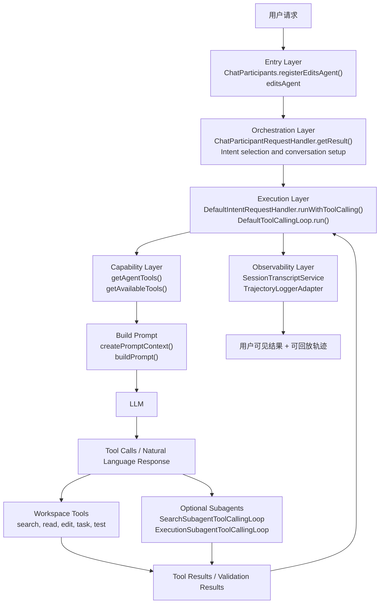

# Copilot Chat Agent Mode 设计文档导航

## 文档定位

本文是 Copilot Chat Agent Mode 设计文档的导航页，用于说明该能力的总体定位、文档结构、推荐阅读路径与源码索引。

完整文档拆分为“架构设计（上篇）”与“执行链路与自治机制（下篇）”。这种拆分方式的目的，是将静态架构视图与动态运行时视图分离，降低单篇文档的认知负担，同时便于后续独立演进。

这三份文档不只承担“简介”角色，也承担“设计导读 + 实现读码入口”的角色。因此它们既要给第一次接触 Agent Mode 的读者建立直观全局图景，也要给已经准备跟源码的人提供足够细的实现落点与责任边界。

## Executive Summary

如果用一句话概括本项目中的 Agent Mode，可以表述为：

> Agent Mode 是一个以 `editsAgent` 为入口、以 `tool-calling loop` 为执行内核、以多轮反馈闭环和子代理协作为核心机制、以 transcript 与 trajectory 为主要观测手段的自治软件工程执行系统。

从产品视角看，Agent Mode 解决的是“让 Copilot 从回答问题扩展为完成复杂任务”的问题。

从架构视角看，它不是单次模型调用，也不是单独的 prompt 模板，而是一条完整的运行时链路：

1. 通过 `Chat Participant` 暴露 Agent 入口
2. 通过 `Intent` 选择 Agent 模式策略
3. 通过 `DefaultIntentRequestHandler` 启动通用执行外壳
4. 通过 `DefaultToolCallingLoop` 让模型与工具进入多轮闭环
5. 通过工具系统与可选 Subagent 扩展问题求解能力
6. 通过 summarization、background compaction 与 transcript lookup 管理长上下文
7. 通过 transcript、telemetry、trajectory 提供可观测性与调试能力

其核心设计价值主要体现在四个方面：

| 维度 | Agent Mode 的设计价值 |
| --- | --- |
| 执行能力 | 从“给建议”升级到“做任务” |
| 复杂问题处理 | 通过多轮计划-执行-反馈闭环逐步逼近目标 |
| 稳定性 | 通过工具约束、轮次上限、hook 和权限机制控制风险 |
| 可观测性 | 通过 transcript 和 trajectory 把执行过程从黑盒变成可回放系统 |

---

## 统一架构总图

下图将“静态架构分层”与“运行时自治闭环”放在同一视图中，便于从一个入口同时理解系统结构与执行机制。

这张图里有一个容易混淆但非常关键的点：**Capability Layer 出现在模型调用之前，而不是之后**。因为在真实实现里，当前轮可见工具会先被计算出来，再被装入 prompt，模型只能在这个受约束的工具集合里做选择。

---

## 文档结构

### 上篇：架构设计

[上篇：Copilot Chat Agent Mode 架构设计](./agent-mode-architecture-design-part1.md)

上篇重点回答三个问题：

- Agent Mode 在系统里的位置是什么
- 它和 AskAgent、Edit Mode、Copilot CLI、Claude Code 有什么关系
- 它的微架构是如何按层拆分的

### 下篇：执行链路与自治机制

[下篇：Copilot Chat Agent Mode 执行链路与自治机制](./agent-mode-execution-design-part2.md)

下篇重点回答三个问题：

- 一次 Agent 请求在运行时究竟经过了哪些步骤
- Agent 为什么能够自主完成复杂工作
- 工具系统、子代理系统、长上下文管理系统、可观测性系统如何协同支撑自治执行

---

## 推荐阅读方式

| 你的目标 | 建议阅读 |
| --- | --- |
| 快速建立全局认知 | 先看本文 Executive Summary，再看上篇第 1 到第 4 节 |
| 理解自治执行原理 | 直接看下篇第 1 到第 4 节 |
| 理解为什么要有 Subagent | 看下篇“Agent 是如何自主完成复杂工作的” |
| 理解长任务为什么还能持续推进 | 看下篇“长上下文管理与压缩机制” |
| 理解和其他 agent 方案的关系 | 看上篇“跨 Agent 对比设计” |
| 想跟源码 | 先看上篇的关键代码映射，再按下篇时序图逐步跳转 |

---

## 源码阅读索引

为便于从设计文档跳转到实现，建议优先关注以下文件：

| 主题 | 入口文件 | 说明 |
| --- | --- | --- |
| Agent participant 注册 | [../src/extension/conversation/vscode-node/chatParticipants.ts](../src/extension/conversation/vscode-node/chatParticipants.ts) | `editsAgent` 的注册入口 |
| 请求编排 | [../src/extension/prompt/node/chatParticipantRequestHandler.ts](../src/extension/prompt/node/chatParticipantRequestHandler.ts) | participant 请求落入内部执行框架的主入口 |
| Agent 策略 | [../src/extension/intents/node/agentIntent.ts](../src/extension/intents/node/agentIntent.ts) | Agent Mode 的策略注入与工具选择 |
| 通用执行外壳 | [../src/extension/prompt/node/defaultIntentRequestHandler.ts](../src/extension/prompt/node/defaultIntentRequestHandler.ts) | 意图执行外壳与 tool-calling loop 启动点 |
| 多轮自治闭环 | [../src/extension/intents/node/toolCallingLoop.ts](../src/extension/intents/node/toolCallingLoop.ts) | 多轮工具调用闭环的核心抽象 |
| 子代理执行（启用时） | [../src/extension/prompt/node/searchSubagentToolCallingLoop.ts](../src/extension/prompt/node/searchSubagentToolCallingLoop.ts) | 检索子代理执行路径 |
| 子代理执行（启用时） | [../src/extension/prompt/node/executionSubagentToolCallingLoop.ts](../src/extension/prompt/node/executionSubagentToolCallingLoop.ts) | 执行子代理执行路径 |
| 会话记录 | [../src/platform/chat/common/sessionTranscriptService.ts](../src/platform/chat/common/sessionTranscriptService.ts) | transcript 接口定义 |
| 轨迹记录 | [../src/platform/trajectory/node/trajectoryLoggerAdapter.ts](../src/platform/trajectory/node/trajectoryLoggerAdapter.ts) | trajectory 记录适配器 |

### 类与方法级入口

如果希望直接从“实现入口方法”开始阅读，建议优先关注以下符号：

| 类 / 方法 | 文件 | 说明 |
| --- | --- | --- |
| `ChatParticipants.registerEditsAgent()` | [../src/extension/conversation/vscode-node/chatParticipants.ts](../src/extension/conversation/vscode-node/chatParticipants.ts) | Agent participant 注册入口 |
| `ChatParticipants.getChatParticipantHandler()` | [../src/extension/conversation/vscode-node/chatParticipants.ts](../src/extension/conversation/vscode-node/chatParticipants.ts) | participant 到 request handler 的桥接 |
| `ChatParticipantRequestHandler.getResult()` | [../src/extension/prompt/node/chatParticipantRequestHandler.ts](../src/extension/prompt/node/chatParticipantRequestHandler.ts) | 单次请求的主执行入口 |
| `DefaultIntentRequestHandler.runWithToolCalling()` | [../src/extension/prompt/node/defaultIntentRequestHandler.ts](../src/extension/prompt/node/defaultIntentRequestHandler.ts) | 启动 tool-calling loop 的关键方法 |
| `AgentIntent.getIntentHandlerOptions()` | [../src/extension/intents/node/agentIntent.ts](../src/extension/intents/node/agentIntent.ts) | 注入 Agent 专用执行参数 |
| `AgentIntent.handleSummarizeCommand()` | [../src/extension/intents/node/agentIntent.ts](../src/extension/intents/node/agentIntent.ts) | `/compact` 的同步压缩入口 |
| `getAgentTools()` | [../src/extension/intents/node/agentIntent.ts](../src/extension/intents/node/agentIntent.ts) | 动态工具选择总入口 |
| `DefaultToolCallingLoop.getAvailableTools()` | [../src/extension/prompt/node/defaultIntentRequestHandler.ts](../src/extension/prompt/node/defaultIntentRequestHandler.ts) | 运行时工具集裁剪与 grouping |
| `ToolCallingLoop.createPromptContext()` | [../src/extension/intents/node/toolCallingLoop.ts](../src/extension/intents/node/toolCallingLoop.ts) | 每轮 prompt context 构造入口 |
| `normalizeSummariesOnRounds()` | [../src/extension/prompt/common/conversation.ts](../src/extension/prompt/common/conversation.ts) | 将压缩后的 summary 恢复到历史 rounds |

---

## 相关阅读

- [Trajectory Logging Architecture](../src/extension/trajectory/ARCHITECTURE.md)
- [OTel Instrumentation — Developer Guide](./monitoring/agent_monitoring_arch.md)
- [Authoring Model-Specific Prompts](./prompts.md)
- [Agent Mode 汇报图（draw.io）](./media/agent-mode-unified-architecture.drawio)
