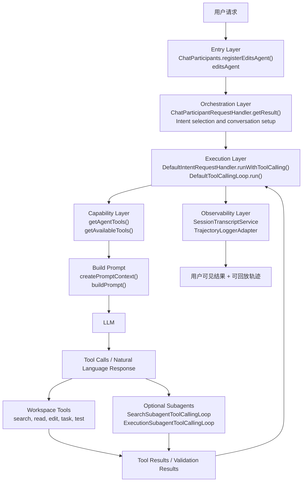

# Copilot Chat Agent Mode 设计文档导航与总览研究

## 文档定位

本文是 Copilot Chat Agent Mode 设计文档的导航页，同时也是一份独立可读的总览研究报告，用于说明该能力的总体定位、运行时骨架、文档结构、推荐阅读路径与源码索引。

完整文档拆分为“架构设计（上篇）”与“执行链路与自治机制（下篇）”。这种拆分方式的目的，是将静态架构视图与动态运行时视图分离，降低单篇文档的认知负担，同时便于后续独立演进。

这三份文档不只承担“简介”角色，也承担“设计导读 + 实现读码入口”的角色。因此它们既要给第一次接触 Agent Mode 的读者建立直观全局图景，也要给已经准备跟源码的人提供足够细的实现落点与责任边界。

本文还吸收了三个场景化研究样本的结论：最小的 `hello`、真正展开多轮工具循环的 `create-file`、以及大代码库研究链路的 `database qna`。它们在这里的作用不是替代主文档，而是帮助总览页把几个最常见的误读直接收掉。

## Executive Summary

如果用一句话概括本项目中的 Agent Mode，可以表述为：

> Agent Mode 是一个以 `editsAgent` 为入口、以 `tool-calling loop` 为执行内核、以多轮反馈闭环和子代理协作为核心机制、以 transcript 与 trajectory 为主要观测手段的自治软件工程执行系统。

从产品视角看，Agent Mode 解决的是“让 Copilot 从回答问题扩展为完成复杂任务”的问题。

从架构视角看，它不是单次模型调用，也不是单独的 prompt 模板，而是一条完整的运行时链路：

1. 通过 `Chat Participant` 暴露 Agent 入口
2. 通过 `Intent` 选择 Agent 模式策略
3. 通过 `DefaultIntentRequestHandler` 启动通用执行外壳
4. 通过 `DefaultToolCallingLoop` 让模型与工具进入多轮闭环
5. 通过工具系统与可选 Subagent 扩展问题求解能力
6. 通过 summarization、background compaction 与 transcript lookup 管理长上下文
7. 通过 transcript、telemetry、trajectory 提供可观测性与调试能力

其核心设计价值主要体现在四个方面：

| 维度 | Agent Mode 的设计价值 |
| --- | --- |
| 执行能力 | 从“给建议”升级到“做任务” |
| 复杂问题处理 | 通过多轮计划-执行-反馈闭环逐步逼近目标 |
| 稳定性 | 通过工具约束、轮次上限、hook 和权限机制控制风险 |
| 可观测性 | 通过 transcript 和 trajectory 把执行过程从黑盒变成可回放系统 |

如果只记三条最容易帮助校准认知的结论，可以记下面这三句：

1. Agent Mode 不是“模型先回答，再临时决定要不要当 Agent”，而是代码先把请求送上 Agent 车道，模型再在这条车道里决定动作。
2. 进入 Agent 车道不等于一定会出现很多轮工具调用；`hello` 这种 greeting 也可以在首轮直接收口。
3. `cached tokens`、prompt cache 和 `previous_response_id` 不是一个概念；`create-file` 证明了真正的多轮 continuation 还需要单独的 provider 续接句柄。

---

## 三个校准样本

如果把三份场景研究当成“校准样本”，它们最有价值的不是复述细节，而是限制错误理解：

| 样本 | 它帮你排除什么误解 | 它真正说明什么 |
| --- | --- | --- |
| [hello：最小 Agent 样本](./example%20-%20chat%20with%20simple%20hello/hello-agent-panel-case-study.md) | “只要进了 Agent 就一定会出现多轮工具执行”；“看到 todo read 就等于模型先调用了工具”；“看到 cached tokens 就说明发生了 continuation” | Agent 骨架可以在首轮直接收口；`manage_todo_list(read)` 更像 prompt 组装期上下文探测；单轮 cache read 只说明稳定前缀被复用 |
| [create-file：满载 Agent 样本](./example%20-%20create%20a%20file/create-file-agent-panel-case-study.md) | “approval 是在最终回答层弹出”；“create_file 失败后一定有硬编码恢复器”；“所有 provider 的 cache 与 response id 都是一回事” | 同一条 Agent 骨架可以展开成多轮目标导向闭环；approval 插在工具层；工具错误会作为下一轮真实世界反馈回灌；Responses API continuation 和普通 prompt cache 是不同层级的优化 |
| [database qna：研究型 Agent 样本](./example%20-%20database%20qna/agent-mode-codebase-qa-case-study.md) | “大代码库 Q&A 一定等于单一 RAG”；“复杂问题默认会起 SearchSubagent”；“trajectory 就是运行时全部真相” | 主代理可以长期停留在只读研究 loop 中；`Codebase` 预取、`SearchSubagent`、`runSubagent` 分属不同层；request logger 往往比 trajectory 更接近 transport 真相 |

因此，这三份场景稿在总览页里的正确位置不是“主文档的附庸”，而是“主文档结论的实证边界”。

---

## 统一架构总图

下图将“静态架构分层”与“运行时自治闭环”放在同一视图中，便于从一个入口同时理解系统结构与执行机制。

这张图里有一个容易混淆但非常关键的点：**Capability Layer 出现在模型调用之前，而不是之后**。因为在真实实现里，当前轮可见工具会先被计算出来，再被装入 prompt，模型只能在这个受约束的工具集合里做选择。

`database qna` 样本还能再帮这张图补一个限定：`Codebase` 更像 Prompt/Capability 边界上的局部上下文增强，`SearchSubagent` 才是独立的小型代理 loop，所以不要把 `Codebase` 误画成第四条代理链，也不要把“复杂检索”误画成必经的子代理阶段。

---

## 文档结构

### 上篇：架构设计

[上篇：Copilot Chat Agent Mode 架构设计](./agent-mode-architecture-design-part1.md)

上篇重点回答三个问题：

- Agent Mode 在系统里的位置是什么
- 它和 AskAgent、Edit Mode、Copilot CLI、Claude Code 有什么关系
- 它的微架构是如何按层拆分的

### 下篇：执行链路与自治机制

[下篇：Copilot Chat Agent Mode 执行链路与自治机制](./agent-mode-execution-design-part2.md)

### 场景化 Case Study

[hello 场景综合 Case Study：从一个干净窗口里的 hello 看穿 Chat Panel + Agent](./example%20-%20chat%20with%20simple%20hello/hello-agent-panel-case-study.md)

[create-file 场景综合 Case Study：从一句创建文件请求看穿多轮工具循环](./example%20-%20create%20a%20file/create-file-agent-panel-case-study.md)

[database qna 场景综合 Case Study：从一次大代码库问答看穿检索、子代理与观测层](./example%20-%20database%20qna/agent-mode-codebase-qa-case-study.md)

这三份场景报告分别承担三种不同职责：

- `hello` 提供最小可运行基线，适合回答路由、prompt 骨架、最短 smoke test 等问题
- `create-file` 提供真实多轮闭环样本，适合回答 approval、tool replay、continuation、fallback 与多轮反馈等问题
- `database qna` 提供研究型主链样本，适合回答 `Codebase`、`SearchSubagent`、request logger / trajectory / OTel 如何分层互补

其中，hello 报告已经吸收了原来三份 hello 研究稿里仍然有效的部分，统一回答三类问题：

- Agent 路由与 mode 预判到底在哪一层发生
- hello 作为最小样本时，提示词与执行骨架究竟长什么样
- 用哪些观测面最适合给这条最小链路做 smoke test

下篇重点回答三个问题：

- 一次 Agent 请求在运行时究竟经过了哪些步骤
- Agent 为什么能够自主完成复杂工作
- 工具系统、子代理系统、长上下文管理系统、可观测性系统如何协同支撑自治执行

## 问题归属矩阵

为了避免三篇文档都在反复解释同一件事，可以先把“哪类问题该去哪篇看”固定下来。

| 你当前最想搞清楚的问题 | 首先看哪里 | 再继续看哪里 |
| --- | --- | --- |
| Agent Mode 在整个系统里处于什么位置 | 上篇第 1、3、5 节 | 上篇第 6、8 节 |
| 它和 AskAgent、Edit、CLI、Claude Code 有什么边界差异 | 上篇第 6 节 | 上篇第 7 节 |
| 为什么它不是普通聊天，而是执行系统 | 本文 Executive Summary | 下篇第 1、2 节 |
| 为什么长任务还能继续跑 | 下篇第 6 节 | 下篇第 17 节中 `handleSummarizeCommand()`、`buildPrompt()`、`normalizeSummariesOnRounds()` |
| 为什么系统有时不让停，或者明明看起来做完了还继续推 | 上篇第 8 节 | 下篇第 19、20 节 |
| 为什么大代码库 Q&A 不一定真的起 `SearchSubagent` | 下篇第 2、4 节 | `database qna` case study 的第 10、15、18 节 |
| 如果想直接跟源码，先抓哪些入口最划算 | 上篇第 10 到第 15 节 | 下篇第 11 到第 17 节 |
| 如果只想知道谁负责记录轨迹和复盘 | 上篇第 5 节与第 17 节 | 下篇第 7 节与 `database qna` case study 的第 14 节 |

---

## 最短排障与验证闭环

如果你的目标不是通读设计，而是尽快判断一次 Agent 请求“到底错在哪一层”，最稳妥的顺序通常不是直接翻全量源码，而是沿着下面四层镜头往外扩：

1. 先看 debug / discovery：确认 instructions、hooks、agents、skills、approval、todo probe 等外围事件有没有偏移。
2. 再看 raw request / chatreplay / request logger：确认真正送给模型的 messages、tool schema、resolved model、usage、request location，以及有没有 `renderedUserMessage`、`toolCallRounds`、`statefulMarker` 这类 transport 细节。
3. 再看 trajectory：确认系统最终把这次请求压成了什么结构，是单轮收口、真实 tool round，还是出现了 subagent。
4. 最后再补 transcript / OTel：分别看 turn 顺序与耗时分布。

这个顺序来自三个样本的共同经验：`hello` 证明最小链路也足够覆盖 discovery、prompt 组装和结构化轨迹；`create-file` 证明一旦问题真的进入多轮执行、approval 和 continuation，前面三层依然是最快的定位入口；`database qna` 则证明 request logger 往往是区分“语义 turn”和“transport round”的关键证据层。

---

## 推荐阅读方式

| 你的目标 | 建议阅读 |
| --- | --- |
| 快速建立全局认知 | 先看本文 Executive Summary，再看上篇第 1 到第 4 节 |
| 理解自治执行原理 | 直接看下篇第 1 到第 4 节 |
| 理解为什么要有 Subagent | 看下篇“Agent 是如何自主完成复杂工作的” |
| 理解长任务为什么还能持续推进 | 看下篇“长上下文管理与压缩机制” |
| 理解控制面到底在哪几层接管执行 | 先看上篇第 8 节，再看下篇第 19、20 节 |
| 理解和其他 agent 方案的关系 | 看上篇“跨 Agent 对比设计” |
| 想跟源码 | 先看上篇的关键代码映射，再按下篇时序图逐步跳转 |

如果只想走最短闭环阅读路径，建议按四步：

1. 先读本文的统一架构总图，建立参与者和层次关系。
2. 再读上篇第 8 节，明确静态控制面和职责边界。
3. 接着读下篇第 18 到第 20 节，把这些边界放回运行时状态机。
4. 最后按上篇第 17 节和下篇第 20.4 节给出的最短源码路线跳转到具体方法。

---

## 源码阅读索引

为便于从设计文档跳转到实现，建议优先关注以下文件：

| 主题 | 入口文件 | 说明 |
| --- | --- | --- |
| Agent participant 注册 | [../src/extension/conversation/vscode-node/chatParticipants.ts](../src/extension/conversation/vscode-node/chatParticipants.ts) | `editsAgent` 的注册入口 |
| 请求编排 | [../src/extension/prompt/node/chatParticipantRequestHandler.ts](../src/extension/prompt/node/chatParticipantRequestHandler.ts) | participant 请求落入内部执行框架的主入口 |
| Agent 策略 | [../src/extension/intents/node/agentIntent.ts](../src/extension/intents/node/agentIntent.ts) | Agent Mode 的策略注入与工具选择 |
| 通用执行外壳 | [../src/extension/prompt/node/defaultIntentRequestHandler.ts](../src/extension/prompt/node/defaultIntentRequestHandler.ts) | 意图执行外壳与 tool-calling loop 启动点 |
| 多轮自治闭环 | [../src/extension/intents/node/toolCallingLoop.ts](../src/extension/intents/node/toolCallingLoop.ts) | 多轮工具调用闭环的核心抽象 |
| 子代理执行（启用时） | [../src/extension/prompt/node/searchSubagentToolCallingLoop.ts](../src/extension/prompt/node/searchSubagentToolCallingLoop.ts) | 检索子代理执行路径 |
| 子代理执行（启用时） | [../src/extension/prompt/node/executionSubagentToolCallingLoop.ts](../src/extension/prompt/node/executionSubagentToolCallingLoop.ts) | 执行子代理执行路径 |
| 会话记录 | [../src/platform/chat/common/sessionTranscriptService.ts](../src/platform/chat/common/sessionTranscriptService.ts) | transcript 接口定义 |
| 轨迹记录 | [../src/platform/trajectory/node/trajectoryLoggerAdapter.ts](../src/platform/trajectory/node/trajectoryLoggerAdapter.ts) | trajectory 记录适配器 |

### 类与方法级入口

如果希望直接从“实现入口方法”开始阅读，建议优先关注以下符号：

| 类 / 方法 | 文件 | 说明 |
| --- | --- | --- |
| `ChatParticipants.registerEditsAgent()` | [../src/extension/conversation/vscode-node/chatParticipants.ts](../src/extension/conversation/vscode-node/chatParticipants.ts) | Agent participant 注册入口 |
| `ChatParticipants.getChatParticipantHandler()` | [../src/extension/conversation/vscode-node/chatParticipants.ts](../src/extension/conversation/vscode-node/chatParticipants.ts) | participant 到 request handler 的桥接 |
| `ChatParticipantRequestHandler.getResult()` | [../src/extension/prompt/node/chatParticipantRequestHandler.ts](../src/extension/prompt/node/chatParticipantRequestHandler.ts) | 单次请求的主执行入口 |
| `DefaultIntentRequestHandler.runWithToolCalling()` | [../src/extension/prompt/node/defaultIntentRequestHandler.ts](../src/extension/prompt/node/defaultIntentRequestHandler.ts) | 启动 tool-calling loop 的关键方法 |
| `AgentIntent.getIntentHandlerOptions()` | [../src/extension/intents/node/agentIntent.ts](../src/extension/intents/node/agentIntent.ts) | 注入 Agent 专用执行参数 |
| `AgentIntent.handleSummarizeCommand()` | [../src/extension/intents/node/agentIntent.ts](../src/extension/intents/node/agentIntent.ts) | `/compact` 的同步压缩入口 |
| `getAgentTools()` | [../src/extension/intents/node/agentIntent.ts](../src/extension/intents/node/agentIntent.ts) | 动态工具选择总入口 |
| `DefaultToolCallingLoop.getAvailableTools()` | [../src/extension/prompt/node/defaultIntentRequestHandler.ts](../src/extension/prompt/node/defaultIntentRequestHandler.ts) | 运行时工具集裁剪与 grouping |
| `ToolCallingLoop.createPromptContext()` | [../src/extension/intents/node/toolCallingLoop.ts](../src/extension/intents/node/toolCallingLoop.ts) | 每轮 prompt context 构造入口 |
| `normalizeSummariesOnRounds()` | [../src/extension/prompt/common/conversation.ts](../src/extension/prompt/common/conversation.ts) | 将压缩后的 summary 恢复到历史 rounds |

---

## 相关阅读

- [Trajectory Logging Architecture](../src/extension/trajectory/ARCHITECTURE.md)
- [OTel Instrumentation — Developer Guide](./monitoring/agent_monitoring_arch.md)
- [Authoring Model-Specific Prompts](./prompts.md)
- [Agent Mode 汇报图（draw.io）](./media/agent-mode-unified-architecture.drawio)
