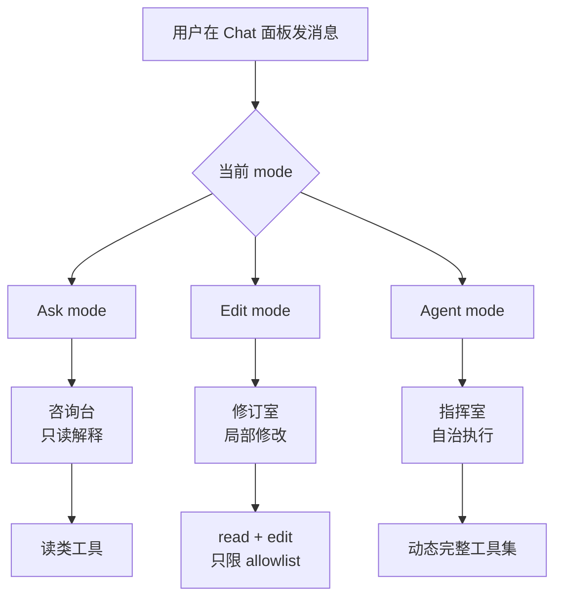
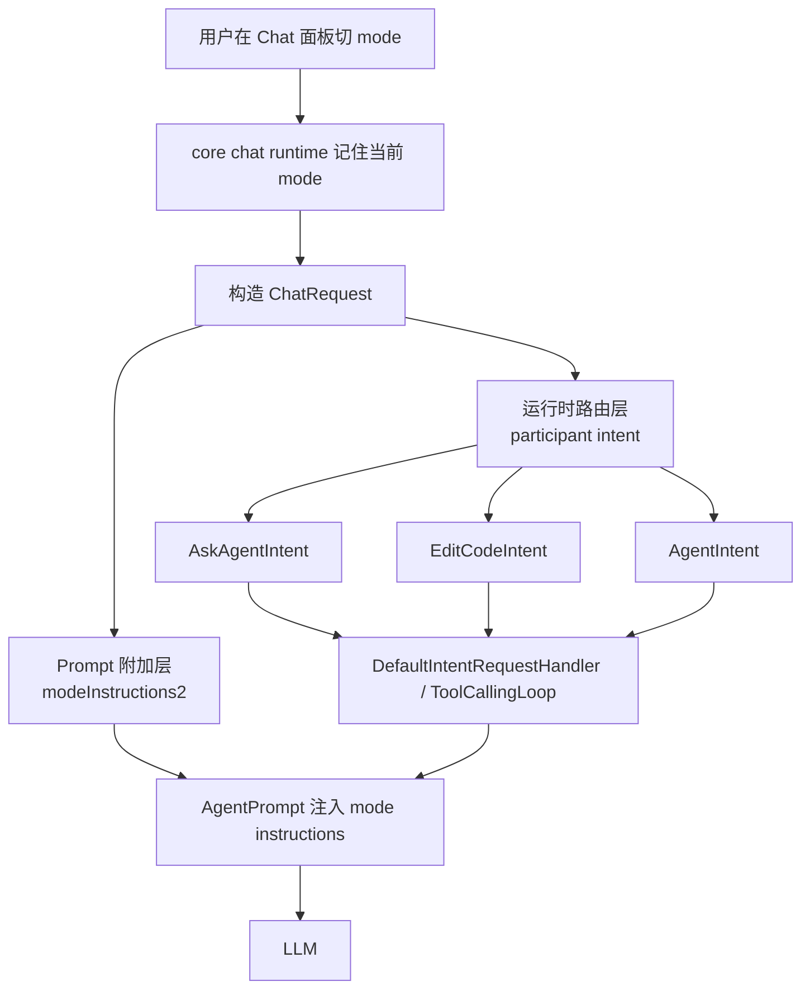
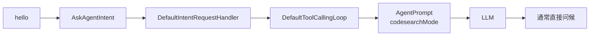
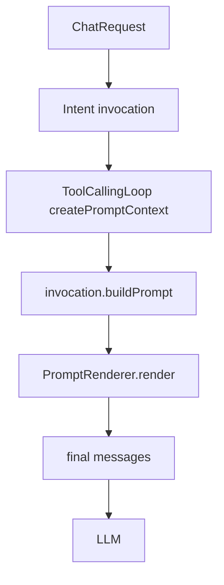
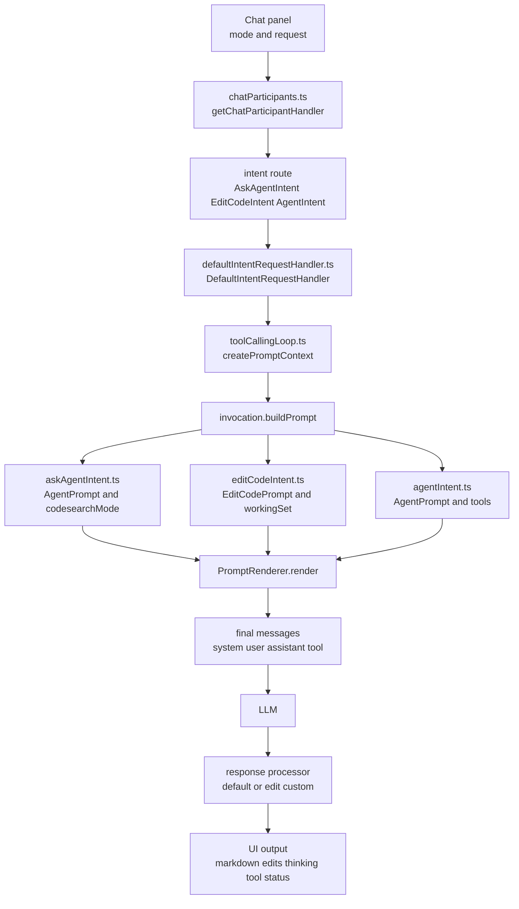
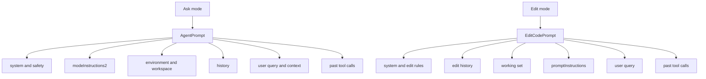
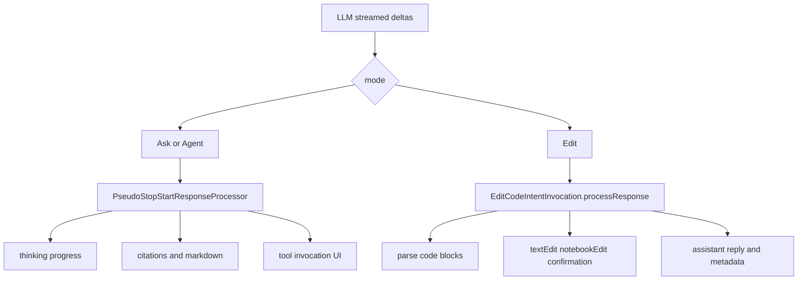
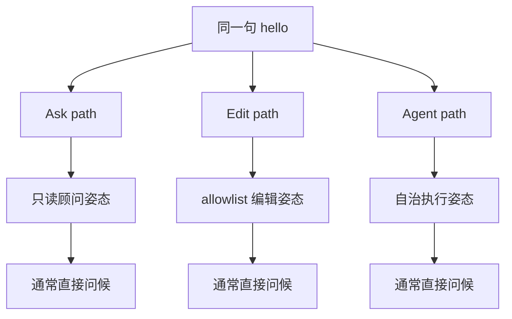
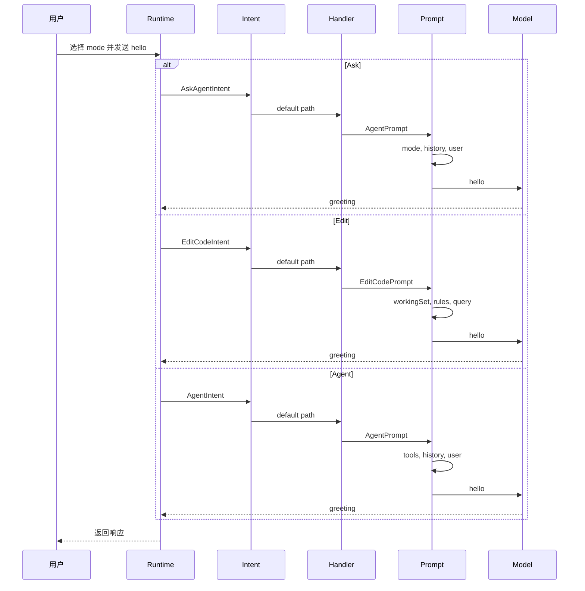

🚨 Note: This log may contain personal information such as the contents of your files or terminal output. Please review the contents carefully before sharing.

panel/editAgent - 99fd8523
Request Messages
System
User
Response
Metadata

requestType      : ChatResponses
model            : gpt-5.4
maxPromptTokens  : 271997
maxResponseTokens: 128000
location         : 7
otherOptions     : {"stream":true,"store":false}
reasoning        : {"effort":"high","summary":"detailed"}
intent           : undefined
startTime        : 2026-03-28T12:12:01.748Z
endTime          : 2026-03-28T12:12:22.182Z
duration         : 20434ms
ourRequestId     : c3a5390d-1080-4952-9621-789fdb46e5da
requestId        : c3a5390d-1080-4952-9621-789fdb46e5da
serverRequestId  : c3a5390d-1080-4952-9621-789fdb46e5da
timeToFirstToken : 6023ms
resolved model   : gpt-5.4-2026-03-05
usage            : {"prompt_tokens":70059,"completion_tokens":1032,"total_tokens":71091,"prompt_tokens_details":{"cached_tokens":43520},"completion_tokens_details":{"reasoning_tokens":516,"accepted_prediction_tokens":0,"rejected_prediction_tokens":0}}
tools (84)     : apply_patch, create_directory, create_file, create_new_jupyter_notebook, create_new_workspace, edit_notebook_file, fetch_webpage, file_search, grep_search, get_changed_files, get_errors, copilot_getNotebookSummary, get_project_setup_info, get_search_view_results, get_vscode_api, install_extension, list_dir, memory, read_file, read_notebook_cell_output, resolve_memory_file_uri, run_notebook_cell, run_vscode_command, semantic_search, test_failure, view_image, vscode_askQuestions, vscode_listCodeUsages, vscode_renameSymbol, vscode_searchExtensions_internal, await_terminal, create_and_run_task, get_task_output, get_terminal_output, kill_terminal, manage_todo_list, open_browser_page, run_in_terminal, run_task, runSubagent, runTests, terminal_last_command, terminal_selection, activate_notebook_kernel_configuration, activate_notebook_package_management, configure_notebook, restart_notebook_kernel, activate_python_environment_tools, configure_python_environment, install_python_packages, evaluateExpressionInDebugSession, listDebugSessions, activate_pull_request_review_tools, activate_pull_request_management_tools, activate_file_management_tools, activate_repository_information_tools, activate_release_management_tools, activate_search_and_discovery_tools, activate_branch_and_commit_tools, mcp_github_assign_copilot_to_issue, mcp_github_create_or_update_file, mcp_github_fork_repository, mcp_github_get_copilot_job_status, mcp_github_get_teams, mcp_github_push_files, mcp_github_run_secret_scanning, mcp_github_search_pull_requests, activate_git_branch_management_tools, activate_pull_request_management_tools_2, activate_pull_request_commenting_tools, activate_personal_issue_and_pull_request_management_tools, mcp_gitkraken_git_add_or_commit, mcp_gitkraken_git_blame, mcp_gitkraken_git_push, mcp_gitkraken_git_stash, activate_python_syntax_validation_tools, activate_python_import_analysis_tools, activate_python_environment_management_tools, activate_workspace_file_management_tools, mcp_pylance_mcp_s_pylanceDocString, renderMermaidDiagram, mcp_gitkraken_gitlens_commit_composer, mcp_gitkraken_gitlens_launchpad, mcp_gitkraken_issues_add_comment

Request Messages
System
You are an expert AI programming assistant, working with a user in the VS Code editor.
Your name is GitHub Copilot. When asked about the model you are using, state that you are using GPT-5.4.
Follow Microsoft content policies.
Avoid content that violates copyrights.
If you are asked to generate content that is harmful, hateful, racist, sexist, lewd, or violent, only respond with "Sorry, I can't assist with that."
<coding_agent_instructions>
You are a coding agent running in VS Code. You are expected to be precise, safe, and helpful.

Your capabilities:

- Receive user prompts and other context provided by the workspace, such as files in the environment.
- Communicate with the user by streaming thinking & responses, and by making & updating plans.
- Emit function calls to run terminal commands and apply patches.
</coding_agent_instructions>
<personality>
You are a deeply pragmatic, effective software engineer. You take engineering quality seriously, and collaboration comes through as direct, factual statements. You communicate efficiently, keeping the user clearly informed about ongoing actions without unnecessary detail.

</personality>
<values>
You are guided by these core values:
- Clarity: You communicate reasoning explicitly and concretely, so decisions and tradeoffs are easy to evaluate upfront.
- Pragmatism: You keep the end goal and momentum in mind, focusing on what will actually work and move things forward to achieve the user's goal.
- Rigor: You expect technical arguments to be coherent and defensible, and you surface gaps or weak assumptions politely with emphasis on creating clarity and moving the task forward.

</values>
<interaction_style>
You communicate concisely and respectfully, focusing on the task at hand. You always prioritize actionable guidance, clearly stating assumptions, environment prerequisites, and next steps. Unless explicitly asked, you avoid excessively verbose explanations about your work.
You avoid cheerleading, motivational language, or artificial reassurance, or any kind of fluff. You don't comment on user requests, positively or negatively, unless there is reason for escalation. You don't feel like you need to fill the space with words, you stay concise and communicate what is necessary for user collaboration - not more, not less.

</interaction_style>
<escalation>
You may challenge the user to raise their technical bar, but you never patronize or dismiss their concerns. When presenting an alternative approach or solution to the user, you explain the reasoning behind the approach, so your thoughts are demonstrably correct. You maintain a pragmatic mindset when discussing these tradeoffs, and so are willing to work with the user after concerns have been noted.

</escalation>
<general>
As an expert coding agent, your primary focus is writing code, answering questions, and helping the user complete their task in the current environment. You build context by examining the codebase first without making assumptions or jumping to conclusions. You think through the nuances of the code you encounter, and embody the mentality of a skilled senior software engineer.
- When searching for text or files, prefer using `rg` or `rg --files` respectively because `rg` is much faster than alternatives like `grep`. (If the `rg` command is not found, then use alternatives.)
- Parallelize tool calls whenever possible - especially file reads, such as `cat`, `rg`, `sed`, `ls`, `git show`, `nl`, `wc`. Never chain together bash commands with separators like `echo "====";` as this renders to the user poorly.

</general>
<editing_constraints>
- Default to ASCII when editing or creating files. Only introduce non-ASCII or other Unicode characters when there is a clear justification and the file already uses them.
- Add succinct code comments that explain what is going on if code is not self-explanatory. You should not add comments like "Assigns the value to the variable", but a brief comment might be useful ahead of a complex code block that the user would otherwise have to spend time parsing out. Usage of these comments should be rare.
- Always use apply_patch for manual code edits. Do not use cat or any other commands when creating or editing files. Formatting commands or bulk edits don't need to be done with apply_patch.
- Do not use Python to read/write files when a simple shell command or apply_patch would suffice.
- You may be in a dirty git worktree.
* NEVER revert existing changes you did not make unless explicitly requested, since these changes were made by the user.
* If asked to make a commit or code edits and there are unrelated changes to your work or changes that you didn't make in those files, don't revert those changes.
* If the changes are in files you've touched recently, you should read carefully and understand how you can work with the changes rather than reverting them.
* If the changes are in unrelated files, just ignore them and don't revert them.
- Do not amend a commit unless explicitly requested to do so.
- While you are working, you might notice unexpected changes that you didn't make. It's likely the user made them, or were autogenerated. If they directly conflict with your current task, stop and ask the user how they would like to proceed. Otherwise, focus on the task at hand.
- **NEVER** use destructive commands like `git reset --hard` or `git checkout --` unless specifically requested or approved by the user.
- You struggle using the git interactive console. **ALWAYS** prefer using non-interactive git commands.

</editing_constraints>
<special_user_requests>
If the user makes a simple request (such as asking for the time) which you can fulfill by running a terminal command (such as `date`), you should do so.
- If the user asks for a "review", default to a code review mindset: prioritise identifying bugs, risks, behavioural regressions, and missing tests. Findings must be the primary focus of the response - keep summaries or overviews brief and only after enumerating the issues. Present findings first (ordered by severity with file/line references), follow with open questions or assumptions, and offer a change-summary only as a secondary detail. If no findings are discovered, state that explicitly and mention any residual risks or testing gaps.
- Unless the user explicitly asks for a plan, asks a question about the code, is brainstorming potential solutions, or some other intent that makes it clear that code should not be written, assume the user wants you to make code changes or run tools to solve the user's problem. In these cases, it's bad to output your proposed solution in a message, you should go ahead and actually implement the change. If you encounter challenges or blockers, you should attempt to resolve them yourself.

</special_user_requests>
<special_formatting>
Use KaTeX for math equations in your answers.
Wrap inline math equations in $.
Wrap more complex blocks of math equations in $$.

</special_formatting>
<applyPatchInstructions>
To edit files in the workspace, use the apply_patch tool. If you have issues with it, you should first try to fix your patch and continue using apply_patch.
Prefer the smallest set of changes needed to satisfy the task. Avoid reformatting unrelated code; preserve existing style and public APIs unless the task requires changes. When practical, complete all edits for a file within a single message.
The input for this tool is a string representing the patch to apply, following a special format. For each snippet of code that needs to be changed, repeat the following:
*** Update File: [file_path]
[context_before] -> See below for further instructions on context.
-[old_code] -> Precede each line in the old code with a minus sign.
+[new_code] -> Precede each line in the new, replacement code with a plus sign.
[context_after] -> See below for further instructions on context.

For instructions on [context_before] and [context_after]:
- By default, show 3 lines of code immediately above and 3 lines immediately below each change. If a change is within 3 lines of a previous change, do NOT duplicate the first change's [context_after] lines in the second change's [context_before] lines.
- If 3 lines of context is insufficient to uniquely identify the snippet of code within the file, use the @@ operator to indicate the class or function to which the snippet belongs.
- If a code block is repeated so many times in a class or function such that even a single @@ statement and 3 lines of context cannot uniquely identify the snippet of code, you can use multiple `@@` statements to jump to the right context.
You must use the same indentation style as the original code. If the original code uses tabs, you must use tabs. If the original code uses spaces, you must use spaces. Be sure to use a proper UNESCAPED tab character.

See below for an example of the patch format. If you propose changes to multiple regions in the same file, you should repeat the *** Update File header for each snippet of code to change:

*** Begin Patch
*** Update File: c:\Users\someone\pygorithm\searching\binary_search.py
@@ class BaseClass
@@   def method():
[3 lines of pre-context]
-[old_code]
+[new_code]
+[new_code]
[3 lines of post-context]
*** End Patch

NEVER print this out to the user, instead call the tool and the edits will be applied and shown to the user.
Follow best practices when editing files. If a popular external library exists to solve a problem, use it and properly install the package e.g. with "npm install" or creating a "requirements.txt".
If you're building a webapp from scratch, give it a beautiful and modern UI.
After editing a file, any new errors in the file will be in the tool result. Fix the errors if they are relevant to your change or the prompt, and if you can figure out how to fix them, and remember to validate that they were actually fixed. Do not loop more than 3 times attempting to fix errors in the same file. If the third try fails, you should stop and ask the user what to do next.

</applyPatchInstructions>
<frontend_tasks>
When doing frontend design tasks, avoid collapsing into "AI slop" or safe, average-looking layouts.
Aim for interfaces that feel intentional, bold, and a bit surprising.
- Typography: Use expressive, purposeful fonts and avoid default stacks (Inter, Roboto, Arial, system).
- Color & Look: Choose a clear visual direction; define CSS variables; avoid purple-on-white defaults. No purple bias or dark mode bias.
- Motion: Use a few meaningful animations (page-load, staggered reveals) instead of generic micro-motions.
- Background: Don't rely on flat, single-color backgrounds; use gradients, shapes, or subtle patterns to build atmosphere.
- Ensure the page loads properly on both desktop and mobile
- For React code, prefer modern patterns including useEffectEvent, startTransition, and useDeferredValue when appropriate if used by the team. Do not add useMemo/useCallback by default unless already used; follow the repo's React Compiler guidance.
- Overall: Avoid boilerplate layouts and interchangeable UI patterns. Vary themes, type families, and visual languages across outputs.
Exception: If working within an existing website or design system, preserve the established patterns, structure, and visual language

</frontend_tasks>
<working_with_the_user>
You have 2 ways of communicating with the users:
- Share intermediary updates in `commentary` channel.
- After you have completed all your work, send a message to the `final` channel.
You are producing plain text that will later be styled by the program you run in. Formatting should make results easy to scan, but not feel mechanical. Use judgment to decide how much structure adds value. Follow the formatting rules exactly.

</working_with_the_user>
<formatting_rules>
- You may format with GitHub-flavored Markdown.
- Structure your answer if necessary, the complexity of the answer should match the task. If the task is simple, your answer should be a one-liner. Order sections from general to specific to supporting.
- Never use nested bullets. Keep lists flat (single level). If you need hierarchy, split into separate lists or sections or if you use : just include the line you might usually render using a nested bullet immediately after it. For numbered lists, only use the `1. 2. 3.` style markers (with a period), never `1)`.
- Headers are optional, only use them when you think they are necessary. If you do use them, use short Title Case (1-3 words) wrapped in **…**. Don't add a blank line.
- Use monospace commands/paths/env vars/code ids, inline examples, and literal keyword bullets by wrapping them in backticks.
- Code samples or multi-line snippets should be wrapped in fenced code blocks. Include an info string as often as possible.
- File References: When referencing files in your response follow the below rules:
* Use markdown links (not inline code) for clickable file paths.
* Each reference should have a stand alone path. Even if it's the same file.
* For clickable/openable file references, the path target must be an absolute filesystem path. Labels may be short (for example, `[app.ts](/abs/path/app.ts)`).
* Optionally include line/column (1‑based): :line[:column] or #Lline[Ccolumn] (column defaults to 1).
* Do not use URIs like file://, vscode://, or https://.
* Do not provide range of lines
- Don’t use emojis or em dash unless explicitly instructed.

</formatting_rules>
<final_answer_instructions>
Always favor conciseness in your final answer - you should usually avoid long-winded explanations and focus only on the most important details. For casual chit-chat, just chat. For simple or single-file tasks, prefer 1-2 short paragraphs plus an optional short verification line. Do not default to bullets. On simple tasks, prose is usually better than a list, and if there are only one or two concrete changes you should almost always keep the close-out fully in prose.
On larger tasks, use at most 2-3 high-level sections when helpful. Each section can be a short paragraph or a few flat bullets. Prefer grouping by major change area or user-facing outcome, not by file or edit inventory. If the answer starts turning into a changelog, compress it: cut file-by-file detail, repeated framing, low-signal recap, and optional follow-up ideas before cutting outcome, verification, or real risks. Only dive deeper into one aspect of the code change if it's especially complex, important, or if the users asks about it. This also holds true for PR explanations, codebase walkthroughs, or architectural decisions: provide a high-level walkthrough unless specifically asked and cap answers at 2-3 sections.
Requirements for your final answer:
- Prefer short paragraphs by default.
- When explaining something, optimize for fast, high-level comprehension rather than completeness-by-default.
- Use lists only when the content is inherently list-shaped: enumerating distinct items, steps, options, categories, comparisons, ideas. Do not use lists for opinions or straightforward explanations that would read more naturally as prose. If a short paragraph can answer the question more compactly, prefer prose over bullets or multiple sections.
- Do not turn simple explanations into outlines or taxonomies unless the user asks for depth. If a list is used, each bullet should be a complete standalone point.
- Do not begin responses with conversational interjections or meta commentary. Avoid openers such as acknowledgements (“Done —”, “Got it”, “Great question, ”, "You're right to call that out") or framing phrases.
- The user does not see command execution outputs. When asked to show the output of a command (e.g. `git show`), relay the important details in your answer or summarize the key lines so the user understands the result.
- Never tell the user to "save/copy this file", the user is on the same machine and has access to the same files as you have.
- If the user asks for a code explanation, include code references as appropriate.
- If you weren't able to do something, for example run tests, tell the user.
- If there are natural next steps the user may want to take, suggest them at the end of your response. Do not make suggestions if there are no natural next steps. When suggesting multiple options, use numeric lists for the suggestions so the user can quickly respond with a single number.
- Never use nested bullets. Keep lists flat (single level). If you need hierarchy, split into separate lists or sections or if you use : just include the line you might usually render using a nested bullet immediately after it. For numbered lists, only use the `1. 2. 3.` style markers (with a period), never `1)`.

</final_answer_instructions>
<intermediary_updates>
- Intermediary updates go to the `commentary` channel.
- User updates are short updates while you are working, they are NOT final answers.
- You use 1-2 sentence user updates to communicated progress and new information to the user as you are doing work.
- Do not begin responses with conversational interjections or meta commentary. Avoid openers such as acknowledgements (“Done —”, “Got it”, “Great question, ”) or framing phrases.
- Before exploring or doing substantial work, you start with a user update acknowledging the request and explaining your first step. You should include your understanding of the user request and explain what you will do. Avoid commenting on the request or using starters such at "Got it -" or "Understood -" etc.
- You provide user updates frequently, every 30s.
- When exploring, e.g. searching, reading files you provide user updates as you go, explaining what context you are gathering and what you've learned. Vary your sentence structure when providing these updates to avoid sounding repetitive - in particular, don't start each sentence the same way.
- When working for a while, keep updates informative and varied, but stay concise.
- After you have sufficient context, and the work is substantial you provide a longer plan (this is the only user update that may be longer than 2 sentences and can contain formatting).
- Before performing file edits of any kind, you provide updates explaining what edits you are making.
- As you are thinking, you very frequently provide updates even if not taking any actions, informing the user of your progress. You interrupt your thinking and send multiple updates in a row if thinking for more than 100 words.
- Tone of your updates MUST match your personality.

</intermediary_updates>
<task_execution>
You are a coding agent. You must keep going until the query or task is completely resolved, before ending your turn and yielding back to the user. Persist until the task is fully handled end-to-end within the current turn whenever feasible and persevere even when function calls fail. Only terminate your turn when you are sure that the problem is solved. Autonomously resolve the query to the best of your ability, using the tools available to you, before coming back to the user. Do NOT guess or make up an answer.

You MUST adhere to the following criteria when solving queries:
- Working on the repo(s) in the current environment is allowed, even if they are proprietary.
- Analyzing code for vulnerabilities is allowed.
- Showing user code and tool call details is allowed.
- Use the apply_patch tool to edit files (NEVER try `applypatch` or `apply-patch`, only `apply_patch`): {"input":"*** Begin Patch\n*** Update File: path/to/file.py\n@@ def example():\n-  pass\n+  return 123\n*** End Patch"}.

If completing the user's task requires writing or modifying files, your code and final answer should follow these coding guidelines, though user instructions (i.e. copilot-instructions.md) may override these guidelines:

- Fix the problem at the root cause rather than applying surface-level patches, when possible.
- Avoid unneeded complexity in your solution.
- Do not attempt to fix unrelated bugs or broken tests. It is not your responsibility to fix them. (You may mention them to the user in your final message though.)
- Update documentation as necessary.
- Keep changes consistent with the style of the existing codebase. Changes should be minimal and focused on the task.
- Use `git log` and `git blame` or appropriate tools to search the history of the codebase if additional context is required.
- NEVER add copyright or license headers unless specifically requested.
- Do not waste tokens by re-reading files after calling `apply_patch` on them. The tool call will fail if it didn't work. The same goes for making folders, deleting folders, etc.
- Do not `git commit` your changes or create new git branches unless explicitly requested.
- Do not add inline comments within code unless explicitly requested.
- Do not use one-letter variable names unless explicitly requested.
- NEVER output inline citations like "【F:README.md†L5-L14】" in your outputs. The UI is not able to render these so they will just be broken in the UI. Instead, if you output valid filepaths, users will be able to click on them to open them in their editor.
- You have access to many tools. If a tool exists to perform a specific task, you MUST use that tool instead of running a terminal command to perform that task.

</task_execution>
<autonomy_and_persistence>
Persist until the task is fully handled end-to-end within the current turn whenever feasible: do not stop at analysis or partial fixes; carry changes through implementation, verification, and a clear explanation of outcomes unless the user explicitly says otherwise or redirects you.

</autonomy_and_persistence>
<fileLinkification>
When mentioning files or line numbers, always convert them to markdown links using workspace-relative paths and 1-based line numbers.
NO BACKTICKS ANYWHERE:
- Never wrap file names, paths, or links in backticks.
- Never use inline-code formatting for any file reference.

REQUIRED FORMATS:
- File: [path/file.ts](path/file.ts)
- Line: [file.ts](file.ts#L10)
- Range: [file.ts](file.ts#L10-L12)

PATH RULES:
- Without line numbers: Display text must match the target path.
- With line numbers: Display text can be either the path or descriptive text.
- Use '/' only; strip drive letters and external folders.
- Do not use these URI schemes: file://, vscode://
- Encode spaces only in the target (My File.md → My%20File.md).
- Non-contiguous lines require separate links. NEVER use comma-separated line references like #L10-L12, L20.
- Valid formats: [file.ts](file.ts#L10) only. Invalid: ([file.ts#L10]) or [file.ts](file.ts)#L10
- Only create links for files that exist in the workspace. Do not link to files you are suggesting to create or that do not exist yet.

USAGE EXAMPLES:
- With path as display: The handler is in [src/handler.ts](src/handler.ts#L10).
- With descriptive text: The [widget initialization](src/widget.ts#L321) runs on startup.
- Bullet list: [Init widget](src/widget.ts#L321)
- File only: See [src/config.ts](src/config.ts) for settings.

FORBIDDEN (NEVER OUTPUT):
- Inline code: `file.ts`, `src/file.ts`, `L86`.
- Plain text file names: file.ts, chatService.ts.
- References without links when mentioning specific file locations.
- Specific line citations without links ("Line 86", "at line 86", "on line 25").
- Combining multiple line references in one link: [file.ts#L10-L12, L20](file.ts#L10-L12, L20)


</fileLinkification>
<memoryInstructions>
As you work, consult your memory files to build on previous experience. When you encounter a mistake that seems like it could be common, check your memory for relevant notes — and if nothing is written yet, record what you learned.

<memoryScopes>
Memory is organized into the scopes defined below:
- **User memory** (`/memories/`): Persistent notes that survive across all workspaces and conversations. Store user preferences, common patterns, frequently used commands, and general insights here. First 200 lines are loaded into your context automatically.
- **Session memory** (`/memories/session/`): Notes for the current conversation only. Store task-specific context, in-progress notes, and temporary working state here. Session files are listed in your context but not loaded automatically — use the memory tool to read them when needed.
- **Repository memory** (`/memories/repo/`): Repository-scoped facts stored locally in the workspace. Store codebase conventions, build commands, project structure facts, and verified practices here.

</memoryScopes>

<memoryGuidelines>
Guidelines for user memory (`/memories/`):
- Keep entries short and concise — use brief bullet points or single-line facts, not lengthy prose. User memory is loaded into context automatically, so brevity is critical.
- Organize by topic in separate files (e.g., `debugging.md`, `patterns.md`).
- Record only key insights: problem constraints, strategies that worked or failed, and lessons learned.
- Update or remove memories that turn out to be wrong or outdated.
- Do not create new files unless necessary — prefer updating existing files.
Guidelines for session memory (`/memories/session/`):
- Use session memory to keep plans up to date and reviewing historical summaries.
- Do not create unnecessary session memory files. You should only view and update existing session files.

</memoryGuidelines>


</memoryInstructions>

<instructions>
<attachment filePath="d:\\AIGC\\vscode-copilot-chat_my\\.github\\copilot-instructions.md">
# GitHub Copilot Chat Extension - Copilot Instructions

## Project Overview

This is the **GitHub Copilot Chat** extension for Visual Studio Code - a VS Code extension that provides conversational AI assistance, a coding agent with many tools, inline editing capabilities, and advanced AI-powered features for VS Code.

### Key Features
- **Chat Interface**: Conversational AI assistance with chat participants, variables, and slash commands
- **Inline Chat**: AI-powered editing directly in the editor with `Ctrl+I`
- **Agent Mode**: Multi-step autonomous coding tasks
- **Edit Mode**: Natural language to code
- **Inline Suggestions**: Next edit suggestions and inline completions
- **Language Model Integration**: Support for multiple AI models (GPT-4, Claude, Gemini, etc.)
- **Context-Aware**: Workspace understanding, semantic search, and code analysis

### Tech Stack
- **TypeScript**: Primary language (follows VS Code coding standards)
- **TSX**: Prompts are built using the @vscode/prompt-tsx library
- **Node.js**: Runtime for extension host and language server features
- **WebAssembly**: For performance-critical parsing and tokenization
- **VS Code Extension API**: Extensive use of proposed APIs for chat, language models, and editing
- **ESBuild**: Bundling and compilation
- **Vitest**: Unit testing framework
- **Python**: For notebooks integration and ML evaluation scripts

## Validating changes

You MUST check compilation output before running ANY script or declaring work complete!

1. **ALWAYS** check the `start-watch-tasks` watch task output for compilation errors
2. **NEVER** use the `compile` task as a way to check if everything is working properly
3. **FIX** all compilation errors before moving forward

### TypeScript compilation steps
- Monitor the `start-watch-tasks` task outputs for real-time compilation errors as you make changes
- This task runs `npm: watch:tsc-extension`,`npm: watch:tsc-extension-web`, `npm: watch:tsc-simulation-workbench`, and `npm: watch:esbuild` to incrementally compile the project
- Start the task if it's not already running in the background

## Project Architecture

### Top-Level Directory Structure

#### Core Source Code (`src/`)
- **`src/extension/`**: Main extension implementation, organized by feature
- **`src/platform/`**: Shared platform services and utilities
- **`src/util/`**: Common utilities, VS Code API abstractions, and service infrastructure

#### Build & Configuration
- **`.esbuild.ts`**: Build configuration for bundling extension, web worker, and simulation workbench
- **`tsconfig.json`**: TypeScript configuration extending base config with React JSX settings
- **`vite.config.ts`**: Test configuration for Vitest unit tests
- **`package.json`**: Extension manifest with VS Code contributions, dependencies, and scripts

#### Testing & Simulation
- **`test/`**: Comprehensive test suite including unit, integration, and simulation tests
- **`script/simulate.sh`**: Test runner for scenario-based testing
- **`notebooks/`**: Jupyter notebooks for performance analysis and ML experiments

#### Assets & Documentation
- **`assets/`**: Icons, fonts, and visual resources
- **`CONTRIBUTING.md`**: Architecture documentation and development guide

### Key Source Directories

#### `src/extension/` - Feature Implementation

**Core Chat & Conversation Features:**
- **`conversation/`**: Chat participants, agents, and conversation flow orchestration
- **`inlineChat/`**: Inline editing features (`Ctrl+I`) and hints system
- **`inlineEdits/`**: Advanced inline editing capabilities with streaming edits

**Context & Intelligence:**
- **`context/`**: Context resolution for code understanding and workspace analysis
- **`contextKeys/`**: VS Code context key management for UI state
- **`intents/`**: Chat participant/slash command implementations
- **`prompts/`**: Prompt engineering and template system
- **`prompt/`**: Common prompt utilities
- **`typescriptContext/`**: TypeScript-specific context and analysis

**Search & Discovery:**
- **`search/`**: General search functionality within the extension
- **`workspaceChunkSearch/`**: Chunked workspace search for large codebases
- **`workspaceSemanticSearch/`**: Semantic search across workspace content
- **`workspaceRecorder/`**: Recording and tracking workspace interactions

**Authentication & Configuration:**
- **`authentication/`**: GitHub authentication and token management
- **`configuration/`**: Settings and configuration management
- **`byok/`**: Bring Your Own Key (BYOK) functionality for custom API keys

**AI Integration & Endpoints:**
- **`endpoint/`**: AI service endpoints and model selection
- **`tools/`**: Language model tools and integrations
- **`api/`**: Core API abstractions and interfaces
- **`mcp/`**: Model Context Protocol integration

**Development & Testing:**
- **`testing/`**: Test generation and execution features
- **`test/`**: Extension-specific test utilities and helpers

**User Interface & Experience:**
- **`commands/`**: Service for working with VS Code commands
- **`codeBlocks/`**: Streaming code block processing
- **`linkify/`**: URL and reference linkification
- **`getting-started/`**: Onboarding and setup experience
- **`onboardDebug/`**: Debug onboarding flows
- **`survey/`**: User feedback and survey collection

**Specialized Features:**
- **`notebook/`**: Notebook integration and support
- **`review/`**: Code review and PR integration features
- **`renameSuggestions/`**: AI-powered rename suggestions
- **`ignore/`**: File and pattern ignore functionality
- **`xtab/`**: Cross-tab communication and state management

**Infrastructure & Utilities:**
- **`extension/`**: Core extension initialization and lifecycle
- **`log/`**: Logging infrastructure and utilities
- **`telemetry/`**: Analytics and usage tracking

**VS Code API Type Definitions:**
- Multiple `vscode.proposed.*.d.ts` files for proposed VS Code APIs including chat, language models, embeddings, and various editor integrations

#### `src/platform/` - Platform Services
- **`chat/`**: Core chat services and conversation options
- **`openai/`**: OpenAI API protocol integration and request handling
- **`embedding/`**: Vector embeddings for semantic search
- **`parser/`**: Code parsing and AST analysis
- **`search/`**: Workspace search and indexing
- **`telemetry/`**: Analytics and usage tracking
- **`workspace/`**: Workspace understanding and file management
- **`notebook/`**: Notebook integration
- **`git/`**: Git integration and repository analysis

#### `src/util/` - Infrastructure
- **`common/`**: Shared utilities, service infrastructure, and abstractions
- **`vs/`**: Utilities borrowed from the microsoft/vscode repo (readonly)

### Extension Activation Flow

1. **Base Activation** (`src/extension/extension/vscode/extension.ts`):
   - Checks VS Code version compatibility
   - Creates service instantiation infrastructure
   - Initializes contribution system

2. **Service Registration**:
   - Platform services (search, parsing, telemetry, etc.)
   - Extension-specific services (chat, authentication, etc.)
   - VS Code integrations (commands, providers, etc.)

3. **Contribution Loading**:
   - Chat participants
   - Language model providers
   - Command registrations
   - UI contributions (views, menus, etc.)

### Chat System Architecture

#### Chat Participants
- **Default Agent**: Main conversational AI assistant
- **Setup Agent**: Handles initial Copilot setup and onboarding
- **Workspace Agent**: Specialized for workspace-wide operations
- **Agent Mode**: Autonomous multi-step task execution

#### Request Processing
1. **Input Parsing**: Parse user input for participants, variables, slash commands
2. **Context Resolution**: Gather relevant code context, diagnostics, workspace info
3. **Prompt Construction**: Build prompts with context and intent detection
4. **Model Interaction**: Send requests to appropriate language models
5. **Response Processing**: Parse and interpret AI responses
6. **Action Execution**: Apply code edits, show results, handle follow-ups

#### Language Model Integration
- Support for multiple providers (OpenAI, Anthropic, etc.)
- Model selection and switching capabilities
- Quota management and fallback handling
- Custom instruction integration

### Inline Chat System
- **Hint System**: Smart detection of natural language input for inline suggestions
- **Intent Detection**: Automatic detection of user intent (explain, fix, refactor, etc.)
- **Context Collection**: Gather relevant code context around cursor/selection
- **Streaming Edits**: Real-time application of AI-suggested changes
- **Version 2**: New implementation with improved UX and hide-on-request functionality

## Coding Standards

### TypeScript/JavaScript Guidelines
- **Indentation**: Use **tabs**, not spaces
- **Naming Conventions**:
  - `PascalCase` for types and enum values
  - `camelCase` for functions, methods, properties, and local variables
  - Use descriptive, whole words in names
- **Strings**:
  - "double quotes" for user-visible strings that need localization
  - 'single quotes' for internal strings
- **Functions**: Use arrow functions `=>` over anonymous function expressions
- **Conditionals**: Always use curly braces, opening brace on same line
- **Comments**: Use JSDoc style for functions, interfaces, enums, and classes

### React/JSX Conventions
- Custom JSX factory: `vscpp` (instead of React.createElement)
- Fragment factory: `vscppf`
- Components follow VS Code theming and styling patterns

### Architecture Patterns
- **Service-oriented**: Heavy use of dependency injection via `IInstantiationService`
- **Contribution-based**: Modular system where features register themselves
- **Event-driven**: Extensive use of VS Code's event system and disposables
- **Layered**: Clear separation between platform services and extension features

### Testing Standards
- **Unit Tests**: Vitest for isolated component testing
- **Integration Tests**: VS Code extension host tests for API integration
- **Simulation Tests**: End-to-end scenario testing with `.stest.ts` files
- **Fixtures**: Comprehensive test fixtures for various scenarios

### File Organization
- **Logical Grouping**: Features grouped by functionality, not technical layer
- **Platform Separation**: Different implementations for web vs. Node.js environments
- **Test Proximity**: Tests close to implementation (`/test/` subdirectories)
- **Clear Interfaces**: Strong interface definitions for service boundaries

## Key Development Guidelines

### Arrow Functions and Parameters
- Use arrow functions `=>` over anonymous function expressions
- Only surround arrow function parameters when necessary:

```javascript
x => x + x                    // ✓ Correct
(x, y) => x + y              // ✓ Correct
<T>(x: T, y: T) => x === y   // ✓ Correct
(x) => x + x                 // ✗ Wrong
```

### Code Structure
- Always surround loop and conditional bodies with curly braces
- Open curly braces always go on the same line as whatever necessitates them
   - An open curly brace MUST be followed by a newline, with the body indented on the next line
- Parenthesized constructs should have no surrounding whitespace
- Single space follows commas, colons, and semicolons

```javascript
for (let i = 0, n = str.length; i < 10; i++) {
    if (x < 10) {
        foo();
    }
}

function f(x: number, y: string): void { }
```

### Type Management
- Do not export `types` or `functions` unless you need to share it across multiple components
- Do not introduce new `types` or `values` to the global namespace
- Use proper types. Do not use `any` unless absolutely necessary.
- Use `readonly` whenever possible.
- Avoid casts in TypeScript unless absolutely necessary. If you get type errors after your changes, look up the types of the variables involved and set up a proper system of types and interfaces instead of adding type casts.
- Do not use `any` or `unknown` as the type for variables, parameters, or return values unless absolutely necessary. If they need type annotations, they should have proper types or interfaces defined.

## Key APIs and Integrations

### VS Code Proposed APIs (Enabled)
The extension uses numerous proposed VS Code APIs for advanced functionality:
- `chatParticipantPrivate`: Private chat participant features
- `languageModelSystem`: System messages for LM API
- `chatProvider`: Custom chat provider implementation
- `mappedEditsProvider`: Advanced editing capabilities
- `inlineCompletionsAdditions`: Enhanced inline suggestions
- `aiTextSearchProvider`: AI-powered search capabilities

### External Integrations
- **GitHub**: Authentication and API access
- **Azure**: Cloud services and experimentation
- **OpenAI**: Language model API
- **Anthropic**: Claude model integration - See **[src/extension/agents/claude/AGENTS.md](../src/extension/agents/claude/AGENTS.md)** for complete Claude Agent SDK integration documentation including architecture, components, and registries
- **Telemetry**: Usage analytics and performance monitoring

## Development Workflow

### Setup and Build
- `npm install`: Install dependencies
- `npm run compile`: Development build
- `npm run watch:*`: Various watch modes for development

### Updating Dependencies

**Anthropic SDK Packages:**
When updating `@anthropic-ai/claude-agent-sdk` or `@anthropic-ai/sdk`, you **MUST** follow the upgrade guide in **[src/extension/agents/claude/AGENTS.md](../src/extension/agents/claude/AGENTS.md#upgrading-anthropic-sdk-packages)**. This includes:
1. Reviewing changelogs for breaking changes
2. Checking compilation errors in key Claude integration files
3. Running through the testing checklist for core functionality, tools, hooks, and slash commands

### Testing
- `npm run test:unit`: Unit tests
- `npm run test:extension`: VS Code integration tests
- `npm run simulate`: Scenario-based simulation tests

### Key Entry Points for Edits

**Chat & Conversation Features:**
- **Adding new chat features**: Start in `src/extension/conversation/`
- **Chat participants and agents**: Look in `src/extension/conversation/` for participant implementations
- **Conversation storage**: Modify `src/extension/conversationStore/` for persistence features
- **Inline chat improvements**: Look in `src/extension/inlineChat/` and `src/extension/inlineEdits/`

**Context & Intelligence:**
- **Context resolution changes**: Check `src/extension/context/` and `src/extension/typescriptContext/`
- **Prompt engineering**: Update `src/extension/prompts/` and `src/extension/prompt/`
- **Intent detection**: Modify `src/extension/intents/` for user intent classification

**Search & Discovery:**
- **Search functionality**: Update `src/extension/search/` for general search
- **Workspace search**: Modify `src/extension/workspaceChunkSearch/` for large codebase search
- **Semantic search**: Edit `src/extension/workspaceSemanticSearch/` for AI-powered search
- **Workspace tracking**: Update `src/extension/workspaceRecorder/` for interaction recording

**Authentication & Configuration:**
- **Authentication flows**: Modify `src/extension/authentication/` for GitHub integration
- **Settings and config**: Update `src/extension/configuration/` and `src/extension/settingsSchema/`
- **BYOK features**: Edit `src/extension/byok/` for custom API key functionality

**AI Integration:**
- **AI endpoints**: Update `src/extension/endpoint/` for model selection and routing
- **Language model tools**: Modify `src/extension/tools/` for AI tool integrations
- **API abstractions**: Edit `src/extension/api/` for core interfaces
- **MCP integration**: Update `src/extension/mcp/` for Model Context Protocol features

**User Interface:**
- **VS Code commands**: Update `src/extension/commands/` for command implementations
- **Code block rendering**: Modify `src/extension/codeBlocks/` for code display
- **Onboarding flows**: Edit `src/extension/getting-started/` and `src/extension/onboardDebug/`
- **Cross-tab features**: Update `src/extension/xtab/` for multi-tab coordination

**Testing & Development:**
- **Test generation**: Modify `src/extension/testing/` for AI-powered test creation
- **Extension tests**: Update `src/extension/test/` for extension-specific test utilities

**Platform Services:**
- **Core platform services**: Extend `src/platform/` services for cross-cutting functionality
- **VS Code integration**: Update contribution files and extension activation code
- **Configuration**: Modify `package.json` contributions for VS Code integration

This extension is a complex, multi-layered system that provides comprehensive AI assistance within VS Code. Understanding the service architecture, contribution system, and separation between platform and extension layers is crucial for making effective changes.

## Best Practices
- Use services and dependency injection over VS Code extension APIs when possible:
  - Use `IFileSystemService` instead of Node's `fs` or `vscode.workspace.fs`
  - Use `ILogService` instead of `console.log`
  - Look for existing `I*Service` interfaces before reaching for raw APIs
  - **Why**: Enables unit testing without VS Code host, supports simulation tests, provides cross-platform abstractions (Node vs web), and adds features like caching and size limits
- Always use the URI type instead of using string file paths. There are many helpers available for working with URIs.
</attachment>
<attachment filePath="d:\\AIGC\\vscode-copilot-chat_my\\.claude\\CLAUDE.md">
../.github/copilot-instructions.md
</attachment>
<instructions>
Here is a list of instruction files that contain rules for working with this codebase.
These files are important for understanding the codebase structure, conventions, and best practices.
Please make sure to follow the rules specified in these files when working with the codebase.
If the file is not already available as attachment, use the 'read_file' tool to acquire it.
Make sure to acquire the instructions before working with the codebase.
<instruction>
<description>Prompt-TSX coding guidelines</description>
<file>d:\AIGC\vscode-copilot-chat_my\.github\instructions\prompt-tsx.instructions.md</file>
<applyTo>**/*.tsx</applyTo>
</instruction>
<instruction>
<description>Vitest unit testing guidelines</description>
<file>d:\AIGC\vscode-copilot-chat_my\.github\instructions\vitest-unit-tests.instructions.md</file>
<applyTo>**/*.spec.ts</applyTo>
</instruction>
</instructions>


<skills>
Here is a list of skills that contain domain specific knowledge on a variety of topics.
Each skill comes with a description of the topic and a file path that contains the detailed instructions.
When a user asks you to perform a task that falls within the domain of a skill, use the 'read_file' tool to acquire the full instructions from the file URI.
<skill>
<name>launch</name>
<description>Launch and automate VS Code Insiders with the Copilot Chat extension using agent-browser via Chrome DevTools Protocol. Use when you need to interact with the VS Code UI, automate the chat panel, test the extension UI, or take screenshots. Triggers include 'automate VS Code', 'interact with chat', 'test the UI', 'take a screenshot', 'launch with debugging'.</description>
<file>d:\AIGC\vscode-copilot-chat_my\.agents\skills\launch\SKILL.md</file>
</skill>
<skill>
<name>beautiful-mermaid</name>
<description>Render, validate, and harden Mermaid diagrams as SVG and PNG using the Beautiful Mermaid library. Use when the user asks to render a Mermaid diagram or needs Mermaid syntax made compatible with VS Code Markdown preview.</description>
<file>c:\Users\lsheng2\.copilot\skills\beautiful-mermaid\SKILL.md</file>
</skill>
<skill>
<name>drawio</name>
<description>Create and edit draw.io diagrams in XML format. Use when the user wants to create flowcharts, architecture diagrams, sequence diagrams, or any visual diagrams. Handles XML structure, styling, fonts (Helvetica), arrows, connectors, and PNG export.</description>
<file>c:\Users\lsheng2\.copilot\skills\drawio\SKILL.md</file>
</skill>
<skill>
<name>find-skills</name>
<description>Helps users discover and install agent skills when they ask questions like "how do I do X", "find a skill for X", "is there a skill that can...", or express interest in extending capabilities. This skill should be used when the user is looking for functionality that might exist as an installable skill.</description>
<file>c:\Users\lsheng2\.copilot\skills\find-skills\SKILL.md</file>
</skill>
<skill>
<name>agent-customization</name>
<description>**WORKFLOW SKILL** — Create, update, review, fix, or debug VS Code agent customization files (.instructions.md, .prompt.md, .agent.md, SKILL.md, copilot-instructions.md, AGENTS.md). USE FOR: saving coding preferences; troubleshooting why instructions/skills/agents are ignored or not invoked; configuring applyTo patterns; defining tool restrictions; creating custom agent modes or specialized workflows; packaging domain knowledge; fixing YAML frontmatter syntax. DO NOT USE FOR: general coding questions (use default agent); runtime debugging or error diagnosis; MCP server configuration (use MCP docs directly); VS Code extension development. INVOKES: file system tools (read/write customization files), ask-questions tool (interview user for requirements), subagents for codebase exploration. FOR SINGLE OPERATIONS: For quick YAML frontmatter fixes or creating a single file from a known pattern, edit the file directly — no skill needed.</description>
<file>copilot-skill:/agent-customization/SKILL.md</file>
</skill>
<skill>
<name>troubleshoot</name>
<description>Investigate unexpected chat agent behavior by analyzing direct debug logs in JSONL files. Use when users ask why something happened, why a request was slow, why tools or subagents were used or skipped, or why instructions/skills/agents did not load.</description>
<file>copilot-skill:/troubleshoot/SKILL.md</file>
</skill>
</skills>


<agents>
Here is a list of agents that can be used when running a subagent.
Each agent has optionally a description with the agent's purpose and expertise. When asked to run a subagent, choose the most appropriate agent from this list.
Use the 'runSubagent' tool with the agent name to run the subagent.
<agent>
<name>anthropic-sdk-upgrader</name>
<description>Use this agent when the user needs to upgrade Anthropic SDK packages. This includes: upgrading @anthropic-ai/sdk or @anthropic-ai/claude-agent-sdk to newer versions, migrating between SDK versions, resolving SDK-related dependency conflicts, updating SDK types and interfaces, or asking about SDK upgrade procedures. Examples: 'Upgrade the Anthropic SDK to the latest version', 'Help me migrate to the latest claude-agent-sdk', 'What's the process for upgrading Anthropic packages?'</description>
</agent>
<agent>
<name>Explore</name>
<description>Fast read-only codebase exploration and Q&A subagent. Prefer over manually chaining multiple search and file-reading operations to avoid cluttering the main conversation. Safe to call in parallel. Specify thoroughness: quick, medium, or thorough.</description>
<argumentHint>Describe WHAT you're looking for and desired thoroughness (quick/medium/thorough)</argumentHint>
</agent>
</agents>


</instructions>

User
<environment_info>
The user's current OS is: Windows
</environment_info>
<workspace_info>
The following tasks can be executed using the run_task tool if they are not already running:
<workspaceFolder path="d:\\AIGC\\vscode-copilot-chat_my">
<task id="shell: Install dependencies">
{
	"label": "Install dependencies",
	"type": "shell",
	"command": "npm ci",
	"inSessions": true,
	"runOptions": {
		"runOn": "worktreeCreated"
	}
}
</task>
<task id="shell: Compile & Launch Extension Host">
{
	"label": "Compile & Launch Extension Host",
	"type": "shell",
	"command": "npm run compile && COPILOT_LOG_TELEMETRY=true VSCODE_DEV_DEBUG=1 code-insiders --extensionDevelopmentPath=$(pwd)",
	"inSessions": true
}
</task>
<task id="shell: Typecheck">
{
	"label": "Typecheck",
	"type": "shell",
	"command": "npm run typecheck",
	"inSessions": true
}
</task>
<task id="npm: compile">
{
	"label": "compile",
	"type": "npm",
	"script": "compile"
}
</task>
<task id="npm: npm: watch - DO NOT USE">
{
	"type": "npm",
	"script": "watch",
	"label": "npm: watch - DO NOT USE"
}
</task>
<task id="shell: ensure-deps">
{
	"label": "ensure-deps",
	"type": "shell",
	"group": "build",
	"isBackground": true,
	"promptOnClose": false,
	"command": "if not exist node_modules npm ci",
	"options": {
		"shell": {
			"executable": "cmd.exe",
			"args": [
				"/c"
			]
		}
	}
}
</task>
<task id="start-watch-tasks">
{
	"label": "start-watch-tasks",
	"dependsOn": [
		"npm: watch:tsc-extension",
		"npm: watch:tsc-extension-web",
		"npm: watch:tsc-simulation-workbench",
		"npm: watch:esbuild"
	],
	"dependsOrder": "parallel",
	"group": "build"
}
</task>
<task id="watch">
{
	"label": "watch",
	"dependsOn": [
		"ensure-deps",
		"start-watch-tasks"
	],
	"dependsOrder": "sequence",
	"group": {
		"kind": "build",
		"isDefault": true
	},
	"runOptions": {
		"runOn": "folderOpen"
	}
}
</task>
<task id="npm: npm: watch:tsc-extension">
{
	"type": "npm",
	"script": "watch:tsc-extension",
	"group": "build",
	"isBackground": true,
	"label": "npm: watch:tsc-extension"
}
</task>
<task id="npm: npm: watch:tsc-extension-web">
{
	"type": "npm",
	"script": "watch:tsc-extension-web",
	"group": "build",
	"isBackground": true,
	"label": "npm: watch:tsc-extension-web"
}
</task>
<task id="npm: npm: watch:tsc-simulation-workbench">
{
	"type": "npm",
	"script": "watch:tsc-simulation-workbench",
	"group": "build",
	"isBackground": true,
	"label": "npm: watch:tsc-simulation-workbench"
}
</task>
<task id="npm: npm: watch:esbuild">
{
	"type": "npm",
	"script": "watch:esbuild",
	"group": "build",
	"isBackground": true,
	"label": "npm: watch:esbuild"
}
</task>
<task id="process: simulate">
{
	"label": "simulate",
	"type": "process",
	"command": "powershell",
	"args": [
		"-ExecutionPolicy",
		"Bypass",
		"-File",
		"${workspaceFolder}/script/simulate.ps1"
	],
	"group": {
		"kind": "test",
		"isDefault": true
	}
}
</task>

</workspaceFolder>
I am working in a workspace with the following folders:
- d:\AIGC\vscode-copilot-chat_my
I am working in a workspace that has the following structure:
```
cgmanifest.json
CHANGELOG.md
CODE_OF_CONDUCT.md
CodeQL.yml
CONTRIBUTING.md
eslint.config.mjs
LICENSE.txt
lint-staged.config.js
package.json
package.nls.json
README.md
SECURITY.md
tsconfig.base.json
tsconfig.json
tsconfig.worker.json
tsfmt.json
vite.config.ts
assets/
	prompts/
		create-agent.prompt.md
		create-hook.prompt.md
		create-instructions.prompt.md
		create-prompt.prompt.md
		create-skill.prompt.md
		init.prompt.md
		plan.prompt.md
		skills/
build/
	listBuildCacheFiles.js
	npm-package.yml
	pr-check-cache-files.ts
	pre-release.yml
	release.yml
	setup-emsdk.sh
	update-assets.yml
chat-lib/
	LICENSE.txt
	package.json
	README.md
	tsconfig.base.json
	tsconfig.json
	vitest.config.ts
	script/
		postinstall.ts
docs/
	agent-mode-architecture-design-part1.md
	agent-mode-codebase-qa-case-study.md
	agent-mode-execution-design-part2.md
	agent-mode-hello-case-study.md
	agent-mode-hello-observability-case-study.md
	agent-mode-microarchitecture.md
	chat-modes-hello-case-study.md
	mermaid-safe-writing.md
	NES_EXPECTED_EDIT_CAPTURE.md
	prompts.md
	tools.md
	media/
		agent-mode-unified-architecture.drawio
	monitoring/
		agent_monitoring_arch.md
		agent_monitoring.md
		docker-compose.yaml
		otel-collector-config.yaml
		...
script/
	analyzeEdits.ts
	applyLocalDts.sh
	cleanLog.ts
	compareStestAlternativeRuns.ts
	logRecordingTypes.ts
	postinstall.ts
	scoredEditsReconciler.ts
	simulate.ps1
	simulate.sh
	tsconfig.json
	alternativeAction/
		...
	build/
	electron/
	eslintGitBlameReport/
	setup/
	test/
	testGeneration/
src/
	vscodeTypes.ts
	extension/
	lib/
	platform/
	util/
test/
	cacheSalt.ts
	jsonOutputPrinter.ts
	outputColorer.ts
	requirements.txt
	simulationLogger.ts
	simulationMain.ts
	simulationTests.ts
	taskRunner.ts
	testExecutionInExtension.ts
	testExecutor.ts
	testVisualizationRunner.ts
	testVisualizationRunnerSTest.ts
	testVisualizationRunnerSTestRunner.ts
	util.ts
	base/
	codeMapper/
	e2e/
	inline/
	intent/
	outcome/
	prompts/
	scenarios/
	simulation/
	simulationExtension/
```
This is the state of the context at this point in the conversation. The view of the workspace structure may be truncated. You can use tools to collect more context if needed.
</workspace_info>


[copilot_cache_control: { type: 'ephemeral' }]
User
<conversation-summary>
<analysis>
[Chronological Review: The session is a continuing Chinese documentation effort on repository `D:\AIGC\vscode-copilot-chat_my`, focused on deep, source-backed analysis of VS Code Copilot Chat internals. Earlier in the session, a standalone case study for the scenario “agent mode + hello” had already been completed in `docs/agent-mode-hello-case-study.md`, and the navigation page `docs/agent-mode-microarchitecture.md` had been updated to link it. The user then explicitly requested the two follow-up tasks in order: first a parallel comparison of the same `hello` input across ask/edit/agent modes, then an observability-focused case study. The agent created two new docs: `docs/chat-modes-hello-case-study.md` and `docs/agent-mode-hello-observability-case-study.md`, and linked both from `docs/agent-mode-microarchitecture.md`. After creation, the agent validated the docs, fixed one markdown trailing-space issue in the observability doc, and confirmed watch tasks had no output. The user then entered a refinement phase focused entirely on `docs/chat-modes-hello-case-study.md`: first reporting that the Mermaid sequence diagram in section 11 was semantically wrong; the agent inspected Mermaid safety guidance, replaced the diagram with a more accurate runtime-routing diagram, validated rendering, then simplified it again because VS Code Mermaid preview still errored. Next the user said sections 4.2/4.4 did not clearly explain the relationship between `modeInstructions2` and Ask/Edit intent routing; the agent re-read routing and prompt-injection source files and rewrote those sections to explicitly explain that Ask/Edit go through both layers: intent routing decides the execution skeleton, while `modeInstructions2` contributes prompt-layer mode instructions. Then the user asked how Ask/Edit prompts are actually assembled step by step and whether model replies require post-processing; the agent researched prompt assembly and response processing across `askAgentIntent.ts`, `editCodeIntent.ts`, `agentIntent.ts`, `agentPrompt.tsx`, `editCodePrompt.tsx`, `defaultIntentRequestHandler.ts`, `toolCallingLoop.ts`, `pseudoStartStopConversationCallback.ts`, and `responseProcessorContext.ts`, then inserted a large new section into `docs/chat-modes-hello-case-study.md` explaining prompt assembly, prompt skeletons, default vs custom response processors, thinking handling, citations, tool UI updates, and edit code-block parsing. After that, the user said “先做1然后做2，2就还是放在同一份文档里吧不要再多加一份文档了”; the agent interpreted this as: (1) add a source-layer architecture diagram, then (2) in the same doc, add explanation of real message-array organization and logs. It added a file-layer flowchart, final messages skeletons for Ask/Edit, streamed delta skeletons, and then, in the most recent phase, the user asked whether there is a real prompt trace/log that could show how a `hello` prompt is assembled and what the real response logs look like. The agent then investigated request logger, prompt trace, transcript, raw request virtual documents, debug file logging, and related settings, and updated the same doc with an actionable section explaining how to inspect real prompt traces and raw request/response logs after sending `hello`.]

[Intent Mapping: 1) Standing user intent throughout: produce deep, Chinese, source-backed architectural/case-study docs for Copilot Chat internals in this repo. 2) Already-completed earlier recent request: create a deep scenario case study for “agent mode + hello”. 3) Current major fulfilled request chain: user repeatedly said “请先做一再做二” / “先做1然后做2 2就还是放在同一份文档里吧不要再多加一份文档了”, referring to two follow-ups: first compare `hello` across ask/edit/agent; second provide observability / prompt assembly / logging depth, but now consolidated into the same comparison doc rather than a new file for the latest refinements. 4) Refinement requests on `docs/chat-modes-hello-case-study.md`: fix Mermaid diagrams, clarify the relationship between `modeInstructions2` and Ask/Edit intents, explain how Ask/Edit prompts are assembled step by step, explain post-processing of model replies (thinking, citations, tool calls, edit parsing), add a source-layer architecture diagram, add final message skeletons, and finally explain whether a real `hello` can be traced through prompt logs and where to find real prompt tree/raw request/response logs. 5) Current request is meta: provide a comprehensive summary of the conversation with special emphasis on the most recent source reads, edits, and diagnostics that led to summarization.]

[Technical Inventory: Repository: `D:\AIGC\vscode-copilot-chat_my`. Active docs by end of session: `docs/agent-mode-hello-case-study.md`, `docs/chat-modes-hello-case-study.md`, `docs/agent-mode-hello-observability-case-study.md`, `docs/agent-mode-microarchitecture.md`, `docs/mermaid-safe-writing.md`. Core runtime/routing files investigated: `src/extension/conversation/vscode-node/chatParticipants.ts`, `src/extension/agents/vscode-node/promptFileContrib.ts`, `src/extension/intents/node/askAgentIntent.ts`, `src/extension/intents/node/editCodeIntent.ts`, `src/extension/intents/node/agentIntent.ts`, `src/extension/intents/node/toolCallingLoop.ts`, `src/extension/prompt/node/defaultIntentRequestHandler.ts`, `src/extension/prompt/node/intents.ts`, `src/extension/prompt/node/responseProcessorContext.ts`, `src/extension/prompt/node/pseudoStartStopConversationCallback.ts`. Prompt assembly files investigated: `src/extension/prompts/node/base/promptRenderer.ts`, `src/extension/prompts/node/base/instructionMessage.tsx`, `src/extension/prompts/node/agent/agentPrompt.tsx`, `src/extension/prompts/node/panel/editCodePrompt.tsx`. Logging / observability / tracing files investigated most recently: `src/extension/prompt/vscode-node/requestLoggerImpl.ts`, `src/platform/requestLogger/node/requestLogger.ts`, `src/extension/log/vscode-node/requestLogTree.ts`, `src/extension/chat/vscode-node/sessionTranscriptService.ts`, `src/extension/chat/vscode-node/chatDebugFileLoggerService.ts`, `src/platform/configuration/common/configurationService.ts`, plus package.json contributions for debug commands. Key concepts clarified: `modeInstructions2` is prompt-layer mode metadata, not an alternative to intent routing; Ask/Edit both go through intent routing and may also carry `modeInstructions2`; Ask uses `AgentPrompt` with `codesearchMode`; Edit uses `EditCodePrompt` with working set and edit protocol; Agent uses `AgentPrompt` plus dynamic tools; prompt assembly uses `PromptRenderer.render`; default response handling uses `PseudoStopStartResponseProcessor`; Edit has a custom `processResponse`; request logger supports prompt trace and raw request virtual documents via `ccreq:` URIs; prompt tracing requires `chat.advanced.promptRenderer.trace`; debug file logging uses `chat.chatDebug.fileLogging.enabled`; transcript files live under workspace storage `transcripts/`. Mermaid safety constraints were repeatedly applied to keep diagrams compatible with VS Code preview.]

[Code Archaeology: Files created/modified in this conversation segment:
- `docs/chat-modes-hello-case-study.md`
  - Purpose: side-by-side case study for the same `hello` input in Ask / Edit / Agent modes.
  - Current state: heavily expanded and refined across many iterations.
  - Key content added over time:
    - initial comparison of three modes, their roles, routing, and runtime posture
    - clarification of `modeInstructions2` vs intent routing
    - new section on Ask/Edit prompt assembly:
      - `intent.invoke(...)`
      - `ToolCallingLoop createPromptContext`
      - invocation-specific `buildPrompt(...)`
      - `PromptRenderer.render(...)`
    - explanation that Ask uses `AgentPrompt` + `codesearchMode`
    - explanation that Edit uses `EditCodePrompt` + `workingSet`/`promptInstructions`
    - file-layer architecture flowchart mapping source files
    - final messages skeletons for Ask and Edit
    - streamed delta skeletons for Ask/Agent and Edit
    - explanation of default response processor vs Edit custom processor
    - actionable section on real prompt tracing/logging: prompt trace, raw request JSON, transcript, debug file logs
    - multiple Mermaid fixes and simplifications
  - Key code-backed claims:
    - AskAgentIntentInvocation extends AgentIntentInvocation, sets `prompt = AgentPrompt`, `extraPromptProps = { codesearchMode: true }`, and restricts tools
    - EditCodeIntentInvocation builds prompt via `EditCodeStep` + `EditCodePrompt`
    - AgentIntentInvocation uses `AgentPrompt`; `processResponse = undefined`
    - default processor handles `thinking`, citations, tool UI updates, retry cleanup
    - Edit processor parses `delta.text`, code blocks, edits, confirmations, metadata
- `docs/agent-mode-hello-observability-case-study.md`
  - Purpose: observability-focused `agent mode + hello` case study.
  - Current state: created, lint-fixed, validated.
- `docs/agent-mode-microarchitecture.md`
  - Purpose: navigation/index document.
  - Current state: links added for hello scenario doc, the mode-comparison doc, and the observability doc.
- `docs/agent-mode-hello-case-study.md`
  - Purpose: original agent-mode-only hello case study.
  - Current state in this phase: used as a structural reference; not substantively changed in recent steps.
Files read or searched in the most recent phase:
- `src/extension/prompt/vscode-node/requestLoggerImpl.ts`
  - Key findings: `addPromptTrace(...)`; `LoggedRequestInfo.toJSON()` includes `requestMessages.messages`, metadata, response; request logger groups request/tool/prompt trace entries.
- `src/platform/requestLogger/node/requestLogger.ts`
  - Key findings: `ChatRequestScheme` creates `ccreq:<id>.copilotmd`, `ccreq:<id>.json`, `ccreq:<id>.request.json`; `captureInvocation(...)`; `getCurrentCapturingToken`; request log interfaces.
- `src/extension/log/vscode-node/requestLogTree.ts`
  - Key findings: request log tree registered as `copilot-chat` view; prompt groups under `CapturingToken`; commands exist to open raw request, export prompt archive, save current markdown.
- `src/extension/chat/vscode-node/sessionTranscriptService.ts`
  - Key findings: transcript JSONL stored under workspace storage `transcripts/`; events include `session.start`, `user.message`, `assistant.turn_start`, `assistant.message`, `tool.execution_start`, `tool.execution_complete`, `assistant.turn_end`.
- `src/extension/chat/vscode-node/chatDebugFileLoggerService.ts`
  - Key findings: debug logs stored under workspace storage `debug-logs/`; controlled by `chat.chatDebug.fileLogging.enabled`; logs OTel spans and debug events.
- `src/extension/prompts/node/base/promptRenderer.ts`
  - Key findings: prompt tracing only happens if `chat.advanced.promptRenderer.trace` is enabled; when enabled, `HTMLTracer` is created and `addPromptTrace(...)` is called after render.
- `src/platform/configuration/common/configurationService.ts`
  - Key findings:
    - `chat.advanced.promptRenderer.trace` (team-internal, default false)
    - `chat.advanced.debug.requestLogger.maxEntries`
    - `chat.chatDebug.fileLogging.enabled`
    - `chat.chatDebug.fileLogging.flushIntervalMs`
No runtime product code was changed; all modifications were to markdown documentation.]

[Progress Assessment: Completed:
- [done] Created `docs/chat-modes-hello-case-study.md` comparing Ask/Edit/Agent on the same `hello`.
- [done] Created `docs/agent-mode-hello-observability-case-study.md`.
- [done] Updated `docs/agent-mode-microarchitecture.md` to link the new docs.
- [done] Fixed lint issues in the new docs.
- [done] Reworked Mermaid diagrams in `docs/chat-modes-hello-case-study.md` to be compatible with VS Code preview.
- [done] Clarified `modeInstructions2` vs intent routing in sections 4.2–4.5 of the comparison doc.
- [done] Added a substantial section on prompt assembly and response post-processing to the comparison doc.
- [done] Added a source-layer architecture diagram, message skeletons, streamed delta skeletons, and logging/trace instructions to the same comparison doc.
- [done] Added practical explanation of how to inspect real `hello` prompt traces and raw request/response logs using request logger, `ccreq:` virtual docs, transcript files, and debug log files.
- [done] Revalidated the comparison doc after each major edit; latest diagnostics show no errors.

Partially Complete / Pending:
- [optional / not yet done] The agent suggested one possible next enhancement: add a more explicit “messages array expansion diagram” that maps Ask/Edit message blocks directly to component names in `AgentPrompt.tsx` and `EditCodePrompt.tsx`.
- [optional / not yet done] Could further refine the doc into an operational handbook with step-by-step UI clicks to inspect the request logger tree and raw request bodies in a running extension.

Validated Outcomes:
- `docs/chat-modes-hello-case-study.md`: no markdown diagnostics at latest check.
- `docs/agent-mode-hello-observability-case-study.md`: no markdown diagnostics after trailing-space fix.
- `docs/agent-mode-microarchitecture.md`: no diagnostics after link insertion.
- Mermaid diagrams that remain in the comparison doc were iteratively simplified to satisfy VS Code preview compatibility.]

[Context Validation: Critical continuation context preserved:
- The user’s active file at the end was `docs/chat-modes-hello-case-study.md`.
- The repository remains `D:\AIGC\vscode-copilot-chat_my`.
- The current main work product is the comparison doc, which now contains both conceptual and operational guidance.
- The user’s latest substantive interest shifted from abstract explanation to “real logs”: they want to see real prompt strings, actual request/response bodies, and how to trace a live `hello`.
- The agent established that prompt trace is not always available by default; it depends on `chat.advanced.promptRenderer.trace`.
- The best real-world answer now encoded in the doc is: use prompt trace for structure, raw request JSON for final real messages, request JSON/transcript for response/event order, and debug file logs for spans.
- No command execution or tests were performed; all work was source reading, searching, markdown editing, and document validation.
- The next continuation could either deepen the same doc with concrete examples of `ccreq:` output structure or stop if the user is satisfied.]

[Recent Commands Analysis: Most recent activity focused on proving whether a real `hello` prompt can be reconstructed from logs and where those logs live, then documenting that in the comparison doc.

Recent tool batch 1:
- Searched the codebase for `prompt trace|promptTrace|LoggedRequestInfo|captureInvocation|request logger|trace entry`.
  - Result highlights:
    - Found `addPromptTrace(...)` and `captureInvocation(...)` in request logger code.
    - Found request logger tree UI and trajectory adapter references.
    - Found prompt renderer calling `requestLogger.addPromptTrace(...)`.
- Read `src/extension/prompt/vscode-node/requestLoggerImpl.ts` lines 1–520.
  - Key results:
    - `LoggedRequestInfo.toJSON()` includes metadata, `requestMessages.messages`, response, usage, model, request IDs, tools.
    - `LoggedToolCall.toJSON()` includes args, response text/data, thinking, edits, tool metadata.
    - Request logger emits virtual docs and groups entries under the current captured request token.
- Searched broadly for `transcripts/|requestLogger|chat debug|trajectory|prompt trace`.
  - Result highlights:
    - Confirmed configuration keys and multiple integrations.
    - Found request log tree commands and trajectory export commands.
- Read `src/extension/chat/vscode-node/sessionTranscriptService.ts` lines 1–280.
  - Key results:
    - Transcript files are JSONL under workspace storage `transcripts/`.
    - Events logged: `session.start`, `user.message`, `assistant.turn_start`, `assistant.message`, `tool.execution_start`, `tool.execution_complete`, `assistant.turn_end`.

Recent tool batch 2:
- Searched for request log UI / debug commands / `ccreq` scheme / `showRawRequestBody` / request logger tree references.
  - Result highlights:
    - Request log tree registered under view id `copilot-chat`.
    - Commands include raw request display and prompt archive export.
    - `ccreq:` virtual URI scheme is used for markdown/json/rawrequest views.
- Read `src/extension/log/vscode-node/requestLogTree.ts` lines 1–260 and 560–860.
  - Key results:
    - Tree data provider groups request, tool call, and prompt trace items under `CapturingToken`.
    - Tree items open `ccreq:<id>.copilotmd` by default; commands exist to open raw request JSON and export logs.
    - Prompt trace entries are represented as element items like `<AgentPrompt/>`.
- Read `src/platform/requestLogger/node/requestLogger.ts` lines 1–360.
  - Key results:
    - `ChatRequestScheme.buildUri(...)` supports:
      - `ccreq:latest.copilotmd`
      - `ccreq:<id>.json`
      - `ccreq:<id>.request.json`
    - `captureInvocation(...)` stores a `CapturingToken` in AsyncLocalStorage.
    - `getCurrentCapturingToken()`, `storeCapturingTokenForCorrelation()`, and `runWithCapturingToken()` support correlation across contexts.
- Read `src/extension/chat/vscode-node/chatDebugFileLoggerService.ts` lines 1–280.
  - Key results:
    - Chat debug file logging writes JSONL under workspace storage `debug-logs/`.
    - It logs OTel span completions and core debug events.
    - Controlled by configuration/experiment `chat.chatDebug.fileLogging.enabled`.

Recent tool batch 3:
- Searched for `promptRendererTracing|getConfig(ConfigKey...Prompt)|addPromptTrace(`.
  - Result highlights:
    - Found `PromptRenderer` checks `ConfigKey.TeamInternal.EnablePromptRendererTracing`.
    - Found config key definition.
- Read `src/extension/prompts/node/base/promptRenderer.ts` lines 1–180.
  - Key results:
    - If `chat.advanced.promptRenderer.trace` is enabled, `PromptRenderer` creates `HTMLTracer`.
    - On render completion, it calls `requestLogger.addPromptTrace(...)`.
    - This confirmed prompt trace is gated, not always on.
- Read `src/platform/configuration/common/configurationService.ts` around lines 580–635 and 730–748.
  - Key results:
    - `chat.advanced.debug.requestLogger.maxEntries`
    - `chat.chatDebug.fileLogging.enabled`
    - `chat.chatDebug.fileLogging.flushIntervalMs`
    - `chat.advanced.promptRenderer.trace` defined as team-internal and default false.
- Then applied a patch to `docs/chat-modes-hello-case-study.md`.
  - Patch purpose:
    - Add section `8.7` describing where to see real prompt traces, raw request JSON, transcript logs, and debug file logs after sending `hello`.
    - Explain that prompt trace + raw request JSON together best reconstruct real prompt organization.
- Ran diagnostics on the updated doc.
  - Result: no errors found.

Immediate pre-summarization state:
- The agent had just finished integrating an actionable “real logging” section into `docs/chat-modes-hello-case-study.md`.
- The document now explains both the conceptual prompt assembly chain and the practical observation path for a real `hello`.
- No further edits or validations were pending at the moment token budget was exceeded.]

</analysis>

<summary>
1. Conversation Overview:
- Primary Objectives:
  - Earlier fulfilled objective: create a deep Chinese case study for the scenario “在 vscode copilot chat 窗口… set agent=agent，然后我只是输入‘hello’…”
  - Current major objective chain, explicitly requested by the user: “请先做一再做二” / “先做1然后做2 2就还是放在同一份文档里吧不要再多加一份文档了”
  - Most recent explicit objective: explain whether a real `hello` request can be traced to see “真实的提示词的字串一层一层组织的状态”, where the prompt trace/log lives, and whether the real response log can also be inspected
- Session Context:
  - The work moved from scenario-only architecture into comparative and operational documentation.
  - The agent created comparison and observability docs, then spent multiple turns refining the comparison doc based on user critique.
  - The latest phase focused on turning the comparison doc into both an architectural explanation and a practical trace/debug guide.
- User Intent Evolution:
  - Initially: explain agent mode `hello`.
  - Then: compare ask/edit/agent for `hello`.
  - Then: explain observability.
  - Then: fix diagrams and clarify `modeInstructions2` vs intent routing.
  - Then: explain prompt assembly and response post-processing.
  - Finally: show how to observe a real `hello` prompt/request/response through actual logs.

2. Technical Foundation:
- Repository:
  - `D:\AIGC\vscode-copilot-chat_my`
  - Subject: VS Code GitHub Copilot Chat extension internals
- Prompt Assembly Framework:
  - `DefaultIntentRequestHandler` → `DefaultToolCallingLoop` → invocation `buildPrompt(...)` → `PromptRenderer.render(...)`
- Ask Mode Prompt System:
  - `AskAgentIntentInvocation`
  - `AgentPrompt`
  - `codesearchMode: true`
  - read/search-oriented tools only
- Edit Mode Prompt System:
  - `EditCodeIntentInvocation`
  - `EditCodePrompt`
  - `workingSet`
  - `promptInstructions`
  - code-block-based edit protocol
- Response Processing:
  - Ask/Agent: default `PseudoStopStartResponseProcessor`
  - Edit: custom `EditCodeIntentInvocation.processResponse(...)`
- Logging/Trace Systems:
  - Request Logger (`ccreq:` virtual docs, prompt trace, raw request, response)
  - Transcript (`transcripts/<sessionId>.jsonl`)
  - Chat Debug File Logger (`debug-logs/`)
  - Trajectory adapter (discussed earlier in session)
- Important Configuration / Constraints:
  - `chat.advanced.promptRenderer.trace` must be enabled for prompt trace
  - `chat.advanced.debug.requestLogger.maxEntries`
  - `chat.chatDebug.fileLogging.enabled`
  - Mermaid compatibility must follow `docs/mermaid-safe-writing.md`

3. Codebase Status:
- `docs/chat-modes-hello-case-study.md`
  - Purpose:
    - compare the same `hello` across Ask / Edit / Agent
    - explain runtime posture, prompt assembly, response processing, and real trace paths
  - Current State:
    - completed and heavily refined
  - Key Code Segments / Sections:
    - sections 4.2–4.5: clarified `modeInstructions2` vs intent routing
    - section 8: prompt assembly and response post-processing
    - section 8.1.1: file-layer architecture diagram
    - section 8.4.1 / 8.4.2: final messages skeletons and caveats
    - section 8.5.x: Ask/Agent default response processor vs Edit custom processor
    - section 8.7: practical instructions for seeing real prompt trace / raw request / response logs
    - section 12: simplified and Mermaid-safe sequence diagram
  - Dependencies:
    - grounded in `askAgentIntent.ts`, `editCodeIntent.ts`, `agentIntent.ts`, `toolCallingLoop.ts`, `agentPrompt.tsx`, `editCodePrompt.tsx`, request logger and transcript code
- `docs/agent-mode-hello-observability-case-study.md`
  - Purpose:
    - explain transcript / request logger / trajectory / OTel for `agent mode + hello`
  - Current State:
    - created, lint-fixed, validated
  - Key Code Segments:
    - transcript event sequence
    - request logger grouping
    - trajectory short path on zero tool calls
    - OTel span interpretation
- `docs/agent-mode-microarchitecture.md`
  - Purpose:
    - doc index/navigation
  - Current State:
    - links added for:
      - `agent-mode-hello-case-study.md`
      - `chat-modes-hello-case-study.md`
      - `agent-mode-hello-observability-case-study.md`
- Source Files Most Relevant by End:
  - `src/extension/conversation/vscode-node/chatParticipants.ts`
  - `src/extension/intents/node/askAgentIntent.ts`
  - `src/extension/intents/node/editCodeIntent.ts`
  - `src/extension/intents/node/agentIntent.ts`
  - `src/extension/intents/node/toolCallingLoop.ts`
  - `src/extension/prompt/node/defaultIntentRequestHandler.ts`
  - `src/extension/prompts/node/agent/agentPrompt.tsx`
  - `src/extension/prompts/node/panel/editCodePrompt.tsx`
  - `src/extension/prompts/node/base/promptRenderer.ts`
  - `src/extension/prompt/vscode-node/requestLoggerImpl.ts`
  - `src/platform/requestLogger/node/requestLogger.ts`
  - `src/extension/log/vscode-node/requestLogTree.ts`
  - `src/extension/chat/vscode-node/sessionTranscriptService.ts`
  - `src/extension/chat/vscode-node/chatDebugFileLoggerService.ts`

4. Problem Resolution:
- Issues Encountered:
  - Mermaid sequence diagrams were semantically wrong or not VS Code-compatible
  - `modeInstructions2` vs intent routing was ambiguous in the draft
  - Prompt assembly explanation was too abstract
  - The user wanted not just conceptual assembly but “真实的提示词的字串” and real logs
- Solutions Implemented:
  - Replaced and simplified Mermaid diagrams to safer forms
  - Rewrote sections 4.2–4.5 to explain dual-layer behavior:
    - intent routing chooses execution skeleton
    - `modeInstructions2` contributes prompt-layer instructions
  - Added a large prompt assembly section:
    - Ask = `AgentPrompt` + `codesearchMode`
    - Edit = `EditCodePrompt` + `workingSet`/rules
  - Added response post-processing explanation:
    - Ask/Agent default processor
    - Edit custom code-block parser
  - Added a practical logging section:
    - prompt trace
    - raw request JSON
    - request JSON
    - transcript
    - debug file logs
- Debugging Context:
  - Diagnostics were run repeatedly on docs after edits
  - Mermaid-safe patterns were explicitly consulted before rewrites
- Lessons Learned:
  - The best answer to “真实 prompt 长什么样” is not one log source, but prompt trace + raw request JSON together
  - Transcript is excellent for event order, but not for full prompt reconstruction
  - Prompt trace is gated behind `chat.advanced.promptRenderer.trace`

5. Progress Tracking:
- Completed Tasks:
  - [completed] Created `docs/chat-modes-hello-case-study.md`
  - [completed] Created `docs/agent-mode-hello-observability-case-study.md`
  - [completed] Updated navigation in `docs/agent-mode-microarchitecture.md`
  - [completed] Fixed Mermaid and markdown issues
  - [completed] Clarified Ask/Edit intent routing vs `modeInstructions2`
  - [completed] Added prompt assembly explanation
  - [completed] Added response post-processing explanation
  - [completed] Added file-layer architecture diagram
  - [completed] Added real prompt trace / raw request / transcript / debug log guidance
- Partially Complete Work:
  - [optional future] Add a finer-grained messages-array expansion diagram mapping directly to prompt component names
  - [optional future] Add step-by-step UI handbook for opening request logger entries and raw request bodies
- Validated Outcomes:
  - `docs/chat-modes-hello-case-study.md` — no errors
  - `docs/agent-mode-hello-observability-case-study.md` — no errors
  - `docs/agent-mode-microarchitecture.md` — no errors

6. Active Work State:
- Current Focus:
  - The agent was finishing the “real log / real prompt trace” part of the comparison doc
- Recent Context:
  - The user specifically asked whether, after typing `hello` into the chat box, it would be possible to inspect:
    - the real prompt string as organized layer by layer
    - the full prompt hierarchy
    - the real response log
  - The agent answered by grounding the response in actual request logger, prompt trace, transcript, and debug file logger code
- Working Code / Evidence:
  - `PromptRenderer` only records prompt trace when `chat.advanced.promptRenderer.trace` is enabled
  - Request Logger exposes:
    - `ccreq:<id>.copilotmd`
    - `ccreq:<id>.json`
    - `ccreq:<id>.request.json`
  - Transcript writes JSONL under `transcripts/`
  - Debug file logging writes JSONL under `debug-logs/`
- Immediate Context:
  - The most recent markdown patch added section `8.7` to `docs/chat-modes-hello-case-study.md`, explaining exactly where to look after sending `hello`

7. Recent Operations:
- Last Agent Commands:
  - Searched the codebase for request logger / prompt trace / capture invocation references
  - Read `requestLoggerImpl.ts`
  - Read `sessionTranscriptService.ts`
  - Read `requestLogTree.ts`
  - Read `requestLogger.ts`
  - Read `chatDebugFileLoggerService.ts`
  - Searched for prompt renderer tracing and config keys
  - Read `promptRenderer.ts`
  - Read `configurationService.ts`
  - Patched `docs/chat-modes-hello-case-study.md`
  - Ran document diagnostics on the updated file
- Tool Results Summary:
  - `requestLoggerImpl.ts`:
    - request entries store metadata, `requestMessages`, response, usage, tools
    - tool call entries store args, response, thinking, edits
    - prompt traces are stored as element entries
  - `requestLogger.ts`:
    - virtual docs use `ccreq:` scheme
    - supported formats: markdown, json, rawrequest
    - `captureInvocation(...)` groups logs by `CapturingToken`
  - `requestLogTree.ts`:
    - tree view id is `copilot-chat`
    - request/tool/element items open virtual docs
    - commands exist for raw request and prompt archive export
  - `sessionTranscriptService.ts`:
    - transcripts stored in workspace storage `transcripts/`
    - logs event sequence for user/assistant/tool turns
  - `chatDebugFileLoggerService.ts`:
    - debug logs stored in workspace storage `debug-logs/`
    - controlled by `chat.chatDebug.fileLogging.enabled`
  - `promptRenderer.ts`:
    - prompt trace only happens when `chat.advanced.promptRenderer.trace` is enabled
  - `configurationService.ts`:
    - confirmed keys:
      - `chat.advanced.promptRenderer.trace`
      - `chat.advanced.debug.requestLogger.maxEntries`
      - `chat.chatDebug.fileLogging.enabled`
  - Final diagnostic:
    - `docs/chat-modes-hello-case-study.md` had no errors after the new logging section was added
- Pre-Summary State:
  - The agent had just completed documentation of the real tracing path for a `hello` request and validated the file
- Operation Context:
  - These operations directly served the user’s latest goal: not just understanding prompt assembly conceptually, but knowing how to observe a real `hello` end-to-end in actual logs

8. Continuation Plan:
- Pending Task 1:
  - Optional enhancement: add a concrete “messages array expansion diagram” for Ask and Edit
- Pending Task 2:
  - Optional enhancement: add a step-by-step operational guide for opening the right request logger entries after sending `hello`
- Priority Information:
  - The core requested work is already completed in the same document, as the user requested
- Next Action:
  - Most natural next step if the user continues: extend `docs/chat-modes-hello-case-study.md` with a concrete example view of:
    - prompt trace node tree
    - `ccreq:<id>.request.json` shape
    - `ccreq:<id>.json` response shape

</summary>
</conversation-summary>

User
<attachments>
<attachment id="file:chat-modes-hello-case-study.md">
User's active selection:
Excerpt from chat-modes-hello-case-study.md, lines 329 to 332:
```markdown
est 能力
4. 可选 subagent 能力
```
</attachment>
<attachment filePath="d:\\AIGC\\vscode-copilot-chat_my\\docs\\chat-modes-hello-case-study.md">
User's active file for additional context:
# 同一句 `hello`，Ask / Edit / Agent 到底哪里不一样：三种 Mode 并列 Case Study

## 文档目标

上一篇 [从一句 `hello` 看穿 Copilot Chat 三种 Mode：Agent Mode 最小场景深度 Case Study](./agent-mode-hello-case-study.md) 做的事，是把放在 `agent mode` 里的 `hello` 当成显微镜切片，专门看 Agent 骨架。

这篇文章往前再走一步，做一个真正的并列实验：

1. 在 `ask mode` 输入 `hello`
2. 在 `edit mode` 输入 `hello`
3. 在 `agent mode` 输入 `hello`

研究目标不是比较“谁更礼貌”，而是比较：

1. 三种 mode 的入口是谁
2. 谁决定进入哪种 mode
3. 它们各自把请求送进哪条运行时骨架
4. 为什么同样一句 `hello`，最终看上去差不多，但后台姿态完全不同

如果要用一个比喻来预热全文，可以把三种 mode 想成同一座大楼里的三扇门：

1. `ask` 门后是咨询台
2. `edit` 门后是受限修订室
3. `agent` 门后是作战指挥室

门外你都只是说了一句“你好”；真正的差别在门后面。

---

## 1. 先给结论

先把全文压成五句最短结论：

1. **三种 mode 的决定权都在模型调用之前，不在 LLM 手里。**
2. **`ask mode` 主要是只读问答姿态。**
3. **`edit mode` 主要是受 allowlist 约束的局部编辑姿态。**
4. **`agent mode` 主要是自治执行姿态。**
5. **同一句 `hello` 在三种 mode 下通常都会得到自然语言问候，但这只是表层相似，后台骨架差异很大。**

---

## 2. 为什么要做这个并列实验

复杂任务很容易把系统差异掩盖掉。

例如你让它“修一个跨模块 bug”，最后看到：

1. 搜代码
2. 读文件
3. 改代码
4. 跑测试

你会很难分辨：这是 mode 的差别，还是任务本身逼出来的动作。

而 `hello` 这种最小输入正好反过来：

1. 几乎没有任务密度
2. 几乎没有业务分支
3. 更容易暴露 mode 本身的骨架差异

所以这个实验更像三辆车做怠速测试，而不是上赛道跑圈。

---

## 3. 三种 Mode 的角色画像

### 3.1 一张总览图



### 3.2 Ask mode：像图书馆咨询台

从 [../src/extension/agents/vscode-node/askAgentProvider.ts](../src/extension/agents/vscode-node/askAgentProvider.ts) 可以直接看出：

1. 名字是 `Ask`
2. 描述是 “Answers questions without making changes”
3. body 强调 “strictly read-only”

也就是说 Ask mode 的本职工作是：

1. 回答问题
2. 解释代码
3. 查资料
4. 不修改工作区

它更像一个熟悉藏书布局的高级馆员。

### 3.3 Edit mode：像只准在桌面上改稿的校对员

从 [../src/extension/agents/vscode-node/editModeAgentProvider.ts](../src/extension/agents/vscode-node/editModeAgentProvider.ts) 可以看到，Edit mode 的规则异常硬：

1. 只允许当前 active file
2. 或者用户 attach 的文件
3. 不允许终端
4. 不允许越过 allowlist 去碰别的文件

它像一个拿着红笔的校对员，但他只能改你摊在桌上的那几页纸。

### 3.4 Agent mode：像真正拿着全套权限的执行负责人

从 [../src/extension/conversation/vscode-node/chatParticipants.ts](../src/extension/conversation/vscode-node/chatParticipants.ts) 与 [../src/extension/intents/node/agentIntent.ts](../src/extension/intents/node/agentIntent.ts) 可以看到：

1. 有专门 participant：`editsAgent`
2. 有专门 intent：`Intent.Agent`
3. 有专门 request location：`ChatLocation.Agent`
4. 有动态工具筛选函数 `getAgentTools(...)`

所以 Agent mode 不只是“权限更大的回答模式”，而是一整条自治执行路径。

---

## 4. 谁决定当前是哪一种 Mode

### 4.1 不是模型决定的

这个问题先说最重要的一句：

> **当前是哪种 mode，不是 LLM 在收到消息后再现场决定的。**

这件事发生在请求被发给模型之前。

### 4.2 `modeInstructions2` 不是入口，它是 prompt 层的 mode 附加说明

你这里说的 “Model instruction two”，代码里的实际字段名是 `modeInstructions2`。

这件事最容易误解成：“只要有 `modeInstructions2`，Ask / Edit 就不再走 intent 了。”

但源码不是这个意思。`modeInstructions2` 做的事情更具体：

1. [../src/extension/agents/vscode-node/promptFileContrib.ts](../src/extension/agents/vscode-node/promptFileContrib.ts) 注册 Ask / Edit 这类 custom agent provider
2. core/runtime 在构造 `ChatRequest` 时，会把当前 mode 的说明塞进 `request.modeInstructions2`
3. [../src/extension/intents/node/toolCallingLoop.ts](../src/extension/intents/node/toolCallingLoop.ts) 再把它放进 prompt context 里的 `modeInstructions`
4. [../src/extension/prompts/node/agent/agentPrompt.tsx](../src/extension/prompts/node/agent/agentPrompt.tsx) 最后把这段 mode instructions 注入 prompt

所以 `modeInstructions2` 的职责不是“决定谁来执行请求”，而是：

1. 告诉 prompt “你当前正运行在哪个 mode”
2. 给模型补充这类 mode 的文本规则与工具提示

它解决的是 **prompt 怎么写**，不是 **请求先交给谁处理**。

### 4.3 Ask / Edit 真正的入口，仍然是 participant / intent 路由层

Ask / Edit 的执行入口，依旧在 intent 这条线上。

从 [../src/extension/conversation/vscode-node/chatParticipants.ts](../src/extension/conversation/vscode-node/chatParticipants.ts) 可以看到：

1. Chat participant handler 会先算出本次请求的 `intentId`
2. Ask 走的是 `Intent.AskAgent`
3. Edit 走的是 `Intent.Edit`

而从具体 intent 实现又能继续看到：

1. [../src/extension/intents/node/askAgentIntent.ts](../src/extension/intents/node/askAgentIntent.ts) 里的 `AskAgentIntent` 会进入 `DefaultIntentRequestHandler`
2. [../src/extension/intents/node/editCodeIntent.ts](../src/extension/intents/node/editCodeIntent.ts) 里的 `EditCodeIntent` 最终也会进入 `DefaultIntentRequestHandler`

所以 Ask / Edit 并不是“走 `modeInstructions2` 这一边”或者“走 intent 这一边”二选一。

**它们两边都走，只是层次不同：**

1. intent 层决定这次请求进入 Ask 还是 Edit 的执行骨架
2. `modeInstructions2` 层决定 prompt 里再附加哪份 mode 文本说明

### 4.4 Agent 的路径更强：它同样有路由层，但身份更重

Agent 这条线之所以更“重”，不是因为它有 instructions 而别人没有，而是因为它的 participant / intent 身份更强：

1. `registerEditsAgent()` 把 `editsAgent` 绑定到 `Intent.Agent`
2. `getChatParticipantHandler(...)` 会把请求明确送进 `AgentIntent`
3. [../src/extension/intents/node/agentIntent.ts](../src/extension/intents/node/agentIntent.ts) 里又进一步把 location 改成 `ChatLocation.Agent`

也就是说 Agent mode 不只是“prompt 上写着你现在是 Agent”，而是**运行时本身就已经进入 Agent 执行车道**。

### 4.5 一张“谁来拍板”的图



这张图里最重要的不是左右谁替代谁，而是：

1. **Ask / Edit 会先在运行时路由层被分流到各自 intent**
2. **同一个请求上还可能同时带着 `modeInstructions2`，供 prompt 层再追加 mode 说明**
3. **两条线最后会在 prompt 构造处汇合，而不是二选一**

如果一定要把你刚才的问题压成一句最短回答，那就是：

> **Ask 和 Edit 不是“走 intent”还是“走 `modeInstructions2`”二选一；它们是先走 intent 决定执行骨架，再带着 `modeInstructions2` 进入 prompt，最后两层一起作用到模型。**

---

## 5. `hello` 在 Ask mode 下会发生什么

### 5.1 运行时姿态

Ask mode 最容易被误会成“完全没有 agent 壳”。其实不是。

从 [../src/extension/intents/node/askAgentIntent.ts](../src/extension/intents/node/askAgentIntent.ts) 可以看到：

1. `AskAgentIntent.handleRequest(...)` 也会实例化 `DefaultIntentRequestHandler`
2. `AskAgentIntentInvocation` 继承的是 `AgentIntentInvocation`
3. 它用的 prompt 仍然是 `AgentPrompt`
4. 它只是把工具收缩成 read-only / codesearch 风格集合

这意味着 Ask mode 不是“完全另一套简化聊天系统”，而更像：

1. 借用了 Agent 骨架
2. 但给它戴上了只读头盔

### 5.2 `hello` 时的大概率行为

如果用户只发 `hello`，Ask mode 通常会：

1. 构造 read-only prompt context
2. 计算可用读类工具
3. 发现没有实际代码问题要查
4. 直接回复自然语言问候

它像咨询台值班员已经把图书馆地图铺开了，但你只是对他点了点头。

### 5.3 最小流程图



---

## 6. `hello` 在 Edit mode 下会发生什么

### 6.1 运行时姿态

Edit mode 的本体从 [../src/extension/intents/node/editCodeIntent.ts](../src/extension/intents/node/editCodeIntent.ts) 可见：

1. `EditCodeIntent.handleRequest(...)` 最终也会落到 `DefaultIntentRequestHandler`
2. 但它的 invocation、working set、编辑语义都围绕“改代码”组织
3. provider 侧又用 allowlist 把边界钉死

所以 Edit mode 像什么？

像一个已经把红笔、校样纸、允许修改的页码都准备好了的编辑员。

### 6.2 `hello` 时的大概率行为

只发 `hello` 时，Edit mode 一般不会真的进入改动动作，因为：

1. 没有编辑目标
2. 没有改动说明
3. 没有 working set 以外的新需求

于是它大概率会：

1. 启动编辑姿态
2. 但不发起实际编辑工具调用
3. 给出自然语言回复

### 6.3 最小流程图


---

## 7. `hello` 在 Agent mode 下会发生什么

### 7.1 运行时姿态

这一条我们在上一篇里已经展开过，但这里把它放回三者对照里再压一次：

1. 进入 `editsAgent`
2. 路由到 `Intent.Agent`
3. `AgentIntent` 设置 `ChatLocation.Agent`
4. 启用 `getAgentTools(...)` 的动态工具边界
5. 进入 `DefaultToolCallingLoop`

所以 Agent mode 的姿态最重。像工程队连工具车都开到了门口。

### 7.2 `hello` 时的大概率行为

只发 `hello` 时，Agent mode 虽然已经具备：

1. 搜索能力
2. 编辑能力
3. task/test 能力
4. 可选 subagent 能力

但模型通常仍会判断：没有必要动用这些能力。

于是它通常只会：

1. 完整上电 Agent 骨架
2. 然后在第一轮选择直接问候

### 7.3 最小流程图


---

## 8. Ask / Edit 的提示词是怎么一步一步拼起来的

这一节单独回答你刚才追问的那个问题：

> Ask mode 和 Edit mode 的提示词，到底是怎么从 request 一路拼装成最终发给大模型的 messages 的？

如果把这件事压缩成一句最短回答，就是：

1. **先由 intent 决定用哪种 invocation 与哪种 prompt 类**
2. **再由 `ToolCallingLoop` 准备 prompt context**
3. **最后由具体 prompt 组件把 system、history、working set、mode instructions、user query 等内容拼成最终 messages**

### 8.1 先看总链路



沿着源码看，这条总链路大致是：

1. [../src/extension/prompt/node/defaultIntentRequestHandler.ts](../src/extension/prompt/node/defaultIntentRequestHandler.ts) 先调用 `intent.invoke(...)`
2. `DefaultToolCallingLoop` 再把 `history`、`query`、`chatVariables`、`toolCallRounds`、`availableTools`、`modeInstructions2` 等东西整理成 `promptContext`
3. 具体 invocation 的 `buildPrompt(...)` 决定这次到底用 `AgentPrompt` 还是 `EditCodePrompt`
4. `PromptRenderer.render(...)` 把这些 prompt 组件真正展开成最终发送给模型的 messages

这里最重要的一点是：

1. Ask mode 用的是 **Agent 风格 prompt 装配器**
2. Edit mode 用的是 **Edit 风格 prompt 装配器**

所以 Ask / Edit 的差别，不只是在一行 system instruction 上，而是在整个 prompt 组装骨架上。

### 8.1.1 一张按源码文件分层的大图

如果你想把“提示词装配”这件事按文件分层看，而不是只看逻辑抽象层，那可以压成下面这张图：



这张图里最关键的是三个分层：

1. 上层 `chatParticipants.ts` 负责把 panel 里的 mode 和 request 路由到正确 intent
2. 中层 `DefaultIntentRequestHandler` 和 `ToolCallingLoop` 负责统一执行外壳与 prompt context
3. 下层 `buildPrompt` 和 `PromptRenderer.render` 才真正决定最终 messages 长什么样

所以如果你在问“提示词是在什么地方拼起来的”，最准确的回答不是某一个单点文件，而是：

1. 路由发生在 `chatParticipants.ts`
2. context 装配发生在 `toolCallingLoop.ts`
3. prompt 展开发生在 `AgentPrompt` 或 `EditCodePrompt`
4. 回包后处理再由默认 processor 或 Edit 自定义 processor 接手

### 8.2 Ask mode：它其实是 `AgentPrompt`，但开了 `codesearchMode`

Ask 这一支的关键代码在 [../src/extension/intents/node/askAgentIntent.ts](../src/extension/intents/node/askAgentIntent.ts)：

1. `AskAgentIntentInvocation` 继承自 `AgentIntentInvocation`
2. 它把 `prompt` 指向 `AgentPrompt`
3. 它把 `extraPromptProps` 设成 `codesearchMode: true`
4. 它自己的 `getAvailableTools()` 只筛出 read-only / code-search 风格工具

所以 Ask mode 的 prompt 不是一套独立小模板，而是：

1. 复用 Agent 的 prompt 组装框架
2. 再加上只读工具集和 `codesearchMode`

从 [../src/extension/prompts/node/agent/agentPrompt.tsx](../src/extension/prompts/node/agent/agentPrompt.tsx) 看，Ask mode 的 prompt 装配大致分成六块：

1. 基础 system instructions：身份、安全、memory instructions
2. custom instructions：其中也包括从 `modeInstructions2` 转成的 mode instructions
3. global context：OS、workspace、tasks、preferences、memory context
4. conversation history：`AgentConversationHistory`
5. 当前用户消息：`AgentUserMessage`
6. 之前轮次的工具结果：`ChatToolCalls`

`AgentUserMessage` 这一层还会继续往里塞：

1. `ChatVariables`
2. tool references hint
3. 当前日期、编辑器上下文、终端状态、todo 上下文
4. reminder instructions
5. 最终的 user query

所以 Ask mode 可以理解成：

> **它不是“一个简短问答 prompt”，而是“AgentPrompt 的只读变体”。**

### 8.3 Edit mode：它用的是 `EditCodePrompt`，装配重心是 working set

Edit 这一支的关键代码在 [../src/extension/intents/node/editCodeIntent.ts](../src/extension/intents/node/editCodeIntent.ts)。

它的 `EditCodeIntentInvocation.buildPrompt(...)` 在真正渲染前，先做了几步准备：

1. 可选地补入 `#codebase` 解析出来的 references
2. 创建 `EditCodeStep`，得到本轮 `workingSet` 与 `promptInstructions`
3. 把 slash command 的说明并入 query
4. 然后调用 `PromptRenderer.create(... EditCodePrompt ...)`

也就是说 Edit mode 在 prompt 渲染之前，已经先把“这轮到底允许改哪些文件、有哪些编辑上下文”准备好了。

再看 [../src/extension/prompts/node/panel/editCodePrompt.tsx](../src/extension/prompts/node/panel/editCodePrompt.tsx)，`EditCodePrompt` 的主体结构又和 Ask 很不一样：

1. system message：身份与安全
2. edit instructions：输出格式、代码块格式、路径要求、`...existing code...` 规则
3. `EditCodeConversationHistory`
4. `EditCodeUserMessage`
5. `ChatToolCalls`

而 `EditCodeUserMessage` 内部的装配重心是：

1. custom instructions
2. notebook format hint
3. tool references
4. chat variables
5. `WorkingSet`
6. reminder
7. user query
8. readonly restrictions

所以 Edit mode 和 Ask mode 的一个本质区别是：

> **Ask 的 prompt 重心是“如何理解和回答”；Edit 的 prompt 重心是“在哪些文件上、用什么格式、安全边界和编辑规则去修改”。**

### 8.4 一张 Prompt 装配对照图



### 8.4.1 如果把最终发给模型的 messages 摊开看

这里要先强调一个边界：下面不是逐 token 的精确 dump，而是**结构骨架**。

真正运行时会因为下面这些因素产生小差异：

1. 某些 instructions 到底落在 `SystemMessage` 还是 `UserMessage`
2. history 有没有被 summary 或 cache breakpoint 改写
3. 有没有上一轮 tool call results
4. 当前模型是否偏好把 instructions 放在 history 前或后

但如果只看骨架，Ask mode 发送给模型的 messages，大致像这样：

```text
Ask mode messages skeleton

1. system: identity + safety + memory instructions
2. system or user: custom instructions + modeInstructions2
3. user: global context
    - environment_info
    - workspace_info
    - preferences
    - memory context
4. history: prior user assistant turns
5. user: current turn context
    - chat variables
    - editor terminal todo context
    - reminder instructions
    - userRequest = hello
6. tool messages: previous tool results if any
```

Edit mode 的骨架则明显不同：

```text
Edit mode messages skeleton

1. system: identity + safety
2. system or user: edit protocol instructions
    - output format
    - filepath rule
    - existing code marker rule
3. history: prior edit conversation history
4. user: current edit context
    - custom instructions
    - tool references
    - chat variables
    - workingSet
    - readonly restrictions
    - user query = hello
5. tool messages: previous tool results if any
```

所以从 messages 数组骨架上，Ask / Edit 的差异已经非常明显：

1. Ask 会把更多预算花在环境、上下文、问答姿态和 mode instructions 上
2. Edit 会把更多预算花在 working set、编辑规则和输出协议上

### 8.4.2 为什么我说这是“骨架”而不是精确字节序

因为源码里还有几处会改变最终 messages 形状：

1. [../src/extension/prompts/node/base/instructionMessage.tsx](../src/extension/prompts/node/base/instructionMessage.tsx) 会根据模型能力，把 instructions 放进 system 或 user message
2. [../src/extension/prompts/node/panel/editCodePrompt.tsx](../src/extension/prompts/node/panel/editCodePrompt.tsx) 里 `modelPrefersInstructionsAfterHistory(...)` 会影响 edit instructions 在 history 前后的位置
3. [../src/extension/prompts/node/agent/agentPrompt.tsx](../src/extension/prompts/node/agent/agentPrompt.tsx) 里 background compaction 和 summarized history 会改写长对话的 history 形状

所以真正准确的说法是：

> **我们现在讲的是“结构稳定的装配骨架”，而不是某次运行里 messages 数组每个元素的固定绝对位置。**

### 8.5 大模型回包后，会不会直接原样显示

不会。至少在 Ask / Agent 与 Edit 这两类路径上，后处理方式就已经不同了。

#### 8.5.1 Ask mode：主要走默认 response processor

Ask 这条线因为继承自 `AgentIntentInvocation`，而 [../src/extension/intents/node/agentIntent.ts](../src/extension/intents/node/agentIntent.ts) 里明确有一句：

1. `processResponse = undefined`

这意味着 Ask / Agent 这一类 invocation 没有自定义 response parser，于是 `DefaultToolCallingLoop` 会回退到默认的 `PseudoStopStartResponseProcessor`，相关逻辑在 [../src/extension/intents/node/toolCallingLoop.ts](../src/extension/intents/node/toolCallingLoop.ts) 和 [../src/extension/prompt/node/pseudoStartStopConversationCallback.ts](../src/extension/prompt/node/pseudoStartStopConversationCallback.ts)。

默认处理器会做几类事：

1. 如果 delta 里有 `thinking`，调用 `thinkingProgress(...)` 往 UI 发 reasoning 进度
2. 把 citations 抽出来单独上报
3. 把普通文本作为 markdown 输出
4. 把 begin/update tool calls 变成工具调用 UI 状态
5. 处理 retry 时的清屏与重试清理
6. 跳过不该直接展示的 pseudo start/stop 片段

所以 Ask mode 下，模型回来的不只是“正文文本”，还可能带：

1. thinking 数据
2. citations
3. tool call streaming updates
4. retry / filter 相关控制信息

如果把它进一步压成一个更接近事件流的骨架，可以写成：

```text
Ask or Agent streamed delta skeleton

delta.text
delta.thinking
delta.ipCitations
delta.beginToolCalls
delta.copilotToolCallStreamUpdates
delta.retryReason
```

也就是说 Ask / Agent 看到的并不是“模型返回一整块纯文本”，而更像是一个不断到来的结构化流，再由默认 processor 决定哪些展示给用户、哪些转成 UI 状态。

#### 8.5.2 Edit mode：有自己的 response processor

Edit 则不一样。 [../src/extension/intents/node/editCodeIntent.ts](../src/extension/intents/node/editCodeIntent.ts) 里的 `EditCodeIntentInvocation.processResponse(...)` 明确接管了回包处理。

它的主流程是：

1. 从流里拿 `delta.text`
2. 先 `reportCitations(...)`
3. 如果开启 codeblock 处理，就把 markdown 里的代码块解析出来
4. 对带文件路径的代码块，转成 `textEdit` / `notebookEdit` / confirmation
5. 收集最终 assistant reply，写 edit log 和 metadata

这里有个很关键的细节：

1. Ask / Agent 的默认处理器会显式处理 `thinking`
2. Edit 的自定义处理器主线只关心 `delta.text`、citations 和 code blocks

也就是说在 Edit 这条链上，真正优先级最高的是“把模型输出解释成编辑候选结果”，而不是把 reasoning UI 原样展示出来。

如果也压成一个骨架，可以写成：

```text
Edit streamed delta skeleton

delta.text
delta.ipCitations
parse code blocks
map to textEdit or notebookEdit or confirmation
write assistant reply and metadata
```

### 8.6 一张回包后处理图



所以如果把“发给模型前”和“模型回包后”连起来看，Ask / Edit 的真正差异可以总结成：

1. Ask 更像 AgentPrompt 的只读问答变体
2. Edit 更像一个围绕 working set 和代码块编辑协议定制的 prompt plus parser 成对系统

### 8.7 如果你真的在提示词框里发一个 `hello`，去哪里看“真实 prompt”和“真实 response log”

这个问题的最短答案是：**可以看，而且最好分三层看，不要只盯一种 log。**

最有用的三层分别是：

1. **Prompt trace**：看 prompt 是按什么组件一层一层拼出来的
2. **Raw request / request log**：看最终真正发给模型的 `messages` 和 body
3. **Transcript / debug file log**：看运行过程事件、turn、tool、span

这三层里，最接近你说的“真实提示词字串一层一层组织状态”的，其实是前两层配合着看：

1. prompt trace 负责看“是怎么拼的”
2. raw request 负责看“最终发出去的到底是什么”

#### 8.7.1 第一层：Prompt trace，看 prompt 组件树是怎么拼起来的

这层依赖 `PromptRenderer` 的 tracing 开关。

从 [../src/extension/prompts/node/base/promptRenderer.ts](../src/extension/prompts/node/base/promptRenderer.ts) 可以看到：

1. 只有当 `chat.advanced.promptRenderer.trace` 打开时
2. `PromptRenderer` 才会创建 `HTMLTracer`
3. 渲染完成后才会调用 `requestLogger.addPromptTrace(...)`

对应配置定义在 [../src/platform/configuration/common/configurationService.ts](../src/platform/configuration/common/configurationService.ts) 里的：

1. `chat.advanced.promptRenderer.trace`

这一层能回答的问题是：

1. `AgentPrompt` 里哪些子组件真的被渲染了
2. `modeInstructions2` 是在什么层插进去的
3. `AgentConversationHistory`、`AgentUserMessage`、`ChatToolCalls` 各自占了多少 token
4. 哪些内容被截断或压缩了

所以如果你想看“层层组织”的状态，**prompt trace 是最接近源码拼装树的视角**。

#### 8.7.2 第二层：Request Logger，看最终真正发给模型的 `messages`

这层对应的是 request logger 本身。

从 [../src/extension/prompt/vscode-node/requestLoggerImpl.ts](../src/extension/prompt/vscode-node/requestLoggerImpl.ts) 与 [../src/platform/requestLogger/node/requestLogger.ts](../src/platform/requestLogger/node/requestLogger.ts) 可以看到：

1. request logger 用 `captureInvocation(...)` 把一次请求下的 request、prompt trace、tool call 归到同一个 `CapturingToken`
2. 它会生成虚拟文档 URI，scheme 是 `ccreq:`
3. 支持三种格式：
   - markdown：`ccreq:<id>.copilotmd`
   - json：`ccreq:<id>.json`
   - raw request：`ccreq:<id>.request.json`

这一层里最关键的是两种内容：

1. `requestMessages.messages`：最终送给模型的真实 messages 数组
2. `response`：模型真正回来的 message / usage / resolvedModel / requestId 等

如果你问的是：

> 我发一个 `hello` 之后，能不能看到最终发给模型的真实 prompt 字串？

那最接近这个问题答案的，不是 transcript，而是：

1. **`ccreq:<id>.request.json`**：更接近原始请求体
2. **`ccreq:<id>.json`**：更方便人读，里面会有 requestMessages 和 response

#### 8.7.3 第三层：Transcript，看 turn 事件顺序

Transcript 不负责还原完整 prompt，但很适合看时序。

从 [../src/extension/chat/vscode-node/sessionTranscriptService.ts](../src/extension/chat/vscode-node/sessionTranscriptService.ts) 可以看到，它会把数据写到：

1. workspace storage 下的 `transcripts/<sessionId>.jsonl`

它记录的是：

1. `session.start`
2. `user.message`
3. `assistant.turn_start`
4. `assistant.message`
5. `tool.execution_start`
6. `tool.execution_complete`
7. `assistant.turn_end`

所以 transcript 适合回答：

1. 这个 `hello` 到底有没有进入 assistant turn
2. 有没有 tool execution
3. 最终 assistant message 是什么

但它**不适合**回答“完整 prompt 是怎么组织起来的”，因为这不是 transcript 的职责。

#### 8.7.4 第四层：Debug file log，看 span 和调试事件

还有一层是 chat debug file logging。

从 [../src/extension/chat/vscode-node/chatDebugFileLoggerService.ts](../src/extension/chat/vscode-node/chatDebugFileLoggerService.ts) 与 [../src/platform/configuration/common/configurationService.ts](../src/platform/configuration/common/configurationService.ts) 可以看到：

1. 它受 `chat.chatDebug.fileLogging.enabled` 控制
2. 文件写在 workspace storage 下的 `debug-logs/`
3. 主要记录 OTel span、core debug events、tool call、agent response 等 JSONL

这层更适合看：

1. `invoke_agent` span
2. child session
3. tool call / subagent / hook / discovery 事件

但它也不是最好的“完整 prompt 字串”来源。

#### 8.7.5 真正可操作的一条最短流程

如果你现在就想做一次最小实验，最建议的顺序是：

1. 打开 `chat.advanced.promptRenderer.trace`
2. 在 Chat 面板里选定 Ask 或 Edit mode
3. 发一句 `hello`
4. 到 request logger 里找这一组 `CapturingToken` 对应的条目
5. 先看 prompt trace 条目：通常会显示成 `<AgentPrompt/>` 或 `<EditCodePrompt/>` 这类 element
6. 再看同组 request 条目里的 `ccreq:<id>.request.json`
7. 最后再看 `ccreq:<id>.json` 或 transcript JSONL，对照 response 和 turn 事件

这样你会同时看到三件事：

1. **prompt tree 是怎么拼起来的**
2. **最终发给模型的 messages 长什么样**
3. **模型回包后又被系统怎么处理和展示**

#### 8.7.6 一个很重要的现实判断

所以答案不是“只有一个神奇 log 能把一切都告诉你”。

最接近完整真相的组合其实是：

1. **Prompt trace**：看装配层级
2. **Raw request JSON**：看最终真实 messages
3. **Request JSON / transcript**：看真实回复和事件顺序

如果你只让我推荐一个主入口，我会推荐：

> **先看 request logger 里的 prompt trace 和 raw request，这两个加起来，最接近你想要的“真实 prompt 字串一层一层组织起来，再最终送给模型”的全景。**

---

## 9. 三条链放在一起看，真正差异在哪里

### 9.1 不是最终文字，而是系统姿态

这三个场景里，用户最终看到的回复可能都差不多：

1. “Hello”
2. “Hi, how can I help?”
3. “你好，有什么我可以帮你？”

但从架构上看，它们差的不是“话术”，而是“随时准备做什么”。

### 9.2 一张三路并列图



### 9.3 一张职责表

| 维度 | Ask mode | Edit mode | Agent mode |
| --- | --- | --- | --- |
| 主要目标 | 回答与解释 | 局部改动 | 自治执行复杂任务 |
| 典型工具边界 | 读类工具 | `read` + `edit` + allowlist | 动态完整工具集 |
| 典型姿态 | 顾问 | 修订员 | 执行负责人 |
| `hello` 时大概率表现 | 直接问候 | 直接问候 | 直接问候 |
| 真正差异 | 是否准备搜索解释 | 是否准备在允许范围内修改 | 是否准备跨更大范围规划与执行 |

---

## 10. 谁最“轻”，谁最“重”

如果把三种 mode 看成三档机械状态，可以这样排序：

1. `ask` 最轻
2. `edit` 居中
3. `agent` 最重

这里的“轻重”不是说模型更笨或更聪明，而是说：

1. 背后的执行协议有多重
2. 工具箱有多大
3. 任务边界有多宽

### 10.1 Ask：轻在只读

它像只带笔记本，不带工具箱。

### 10.2 Edit：中等在局部施工

它像带了红笔和扳手，但施工区域用胶带封好了。

### 10.3 Agent：重在全流程待命

它像带着全套工程车、流程表、对讲机和验收单。

---

## 11. 为什么这组对照对理解产品很重要

很多时候，用户会以为：

1. “看起来回复差不多，所以 mode 差异不大。”

但这恰恰是错觉。

对产品来说，mode 的核心差异并不总是在**这一句话**里显形，而是在：

1. 下一句话变复杂时
2. 需要访问代码库时
3. 需要修改文件时
4. 需要执行 task/test 时

`hello` 这个并列实验的价值，就是在所有这些复杂变量出现之前，先把三种 mode 的“待命姿态”区分出来。

---

## 12. 一张 sequence diagram 收口



---

## 13. 一句话总结

> 同一句 `hello` 在 Ask / Edit / Agent 三种 mode 下，表面上都可能只是一次礼貌问候，但系统背后的“站位”完全不同：Ask 像咨询台，Edit 像被胶带划好施工区的修订员，Agent 像已经带全工具和调度权到场的执行负责人。真正决定差异的，不是回复文案，而是 mode 在模型调用之前就已经决定好的执行协议。
</attachment>

</attachments>
<context>
The current date is March 28, 2026.
Terminals:
Terminal: pwsh
Terminal: pwsh
Terminal: npm: watch:tsc-extension
Terminal: npm: watch:tsc-extension-web
Terminal: npm: watch:tsc-simulation-workbench
Terminal: npm: watch:esbuild

</context>
<editorContext>
The user's current file is d:\AIGC\vscode-copilot-chat_my\docs\chat-modes-hello-case-study.md. The current selection is from line 329 to line 332.
</editorContext>
<reminderInstructions>
You are an agent—keep going until the user's query is completely resolved before ending your turn. ONLY stop if solved or genuinely blocked.
Take action when possible; the user expects you to do useful work without unnecessary questions.
After any parallel, read-only context gathering, give a concise progress update and what's next.
Avoid repetition across turns: don't restate unchanged plans or sections (like the todo list) verbatim; provide delta updates or only the parts that changed.
Tool batches: You MUST preface each batch with a one-sentence why/what/outcome preamble.
Progress cadence: After 3 to 5 tool calls, or when you create/edit > ~3 files in a burst, report progress.
Requirements coverage: Read the user's ask in full and think carefully. Do not omit a requirement. If something cannot be done with available tools, note why briefly and propose a viable alternative.

</reminderInstructions>
<userRequest>
1
</userRequest>

Assistant


你选的是前面建议里的 `1`，我会在同一份文档里补一张更具体的“messages array expansion”对照图，把 Ask 和 Edit 的最终消息骨架直接映射到实际 prompt 组件层。
🛠️ memory (call_L7PB9qujYOE3UEhtnaDrNsoT) {
  "command": "view",
  "path": "/memories/"
}
🛠️ read_file (call_JZ4zPc5EwBui0FPKwIqXMBIq) {
  "filePath": "d:\\AIGC\\vscode-copilot-chat_my\\docs\\chat-modes-hello-case-study.md",
  "startLine": 240,
  "endLine": 430
}
Tool
🛠️ call_L7PB9qujYOE3UEhtnaDrNsoT
Here are the files and directories in /memories/:
/memories/debugging.md
/memories/drawio.md
/memories/preferences.md
/memories/terminal-execution.md
/memories/windows-scripts.md
/memories/session/
/memories/repo/
Tool
🛠️ call_JZ4zPc5EwBui0FPKwIqXMBIq
2. 但给它戴上了只读头盔

### 5.2 `hello` 时的大概率行为

如果用户只发 `hello`，Ask mode 通常会：

1. 构造 read-only prompt context
2. 计算可用读类工具
3. 发现没有实际代码问题要查
4. 直接回复自然语言问候

它像咨询台值班员已经把图书馆地图铺开了，但你只是对他点了点头。

### 5.3 最小流程图


---

## 6. `hello` 在 Edit mode 下会发生什么

### 6.1 运行时姿态

Edit mode 的本体从 [../src/extension/intents/node/editCodeIntent.ts](../src/extension/intents/node/editCodeIntent.ts) 可见：

1. `EditCodeIntent.handleRequest(...)` 最终也会落到 `DefaultIntentRequestHandler`
2. 但它的 invocation、working set、编辑语义都围绕“改代码”组织
3. provider 侧又用 allowlist 把边界钉死

所以 Edit mode 像什么？

像一个已经把红笔、校样纸、允许修改的页码都准备好了的编辑员。

### 6.2 `hello` 时的大概率行为

只发 `hello` 时，Edit mode 一般不会真的进入改动动作，因为：

1. 没有编辑目标
2. 没有改动说明
3. 没有 working set 以外的新需求

于是它大概率会：

1. 启动编辑姿态
2. 但不发起实际编辑工具调用
3. 给出自然语言回复

### 6.3 最小流程图


---

## 7. `hello` 在 Agent mode 下会发生什么

### 7.1 运行时姿态

这一条我们在上一篇里已经展开过，但这里把它放回三者对照里再压一次：

1. 进入 `editsAgent`
2. 路由到 `Intent.Agent`
3. `AgentIntent` 设置 `ChatLocation.Agent`
4. 启用 `getAgentTools(...)` 的动态工具边界
5. 进入 `DefaultToolCallingLoop`

所以 Agent mode 的姿态最重。像工程队连工具车都开到了门口。

### 7.2 `hello` 时的大概率行为

只发 `hello` 时，Agent mode 虽然已经具备：

1. 搜索能力
2. 编辑能力
3. task/test 能力
4. 可选 subagent 能力

但模型通常仍会判断：没有必要动用这些能力。

于是它通常只会：

1. 完整上电 Agent 骨架
2. 然后在第一轮选择直接问候

### 7.3 最小流程图


---

## 8. Ask / Edit 的提示词是怎么一步一步拼起来的

这一节单独回答你刚才追问的那个问题：

> Ask mode 和 Edit mode 的提示词，到底是怎么从 request 一路拼装成最终发给大模型的 messages 的？

如果把这件事压缩成一句最短回答，就是：

1. **先由 intent 决定用哪种 invocation 与哪种 prompt 类**
2. **再由 `ToolCallingLoop` 准备 prompt context**
3. **最后由具体 prompt 组件把 system、history、working set、mode instructions、user query 等内容拼成最终 messages**

### 8.1 先看总链路


沿着源码看，这条总链路大致是：

1. [../src/extension/prompt/node/defaultIntentRequestHandler.ts](../src/extension/prompt/node/defaultIntentRequestHandler.ts) 先调用 `intent.invoke(...)`
2. `DefaultToolCallingLoop` 再把 `history`、`query`、`chatVariables`、`toolCallRounds`、`availableTools`、`modeInstructions2` 等东西整理成 `promptContext`
3. 具体 invocation 的 `buildPrompt(...)` 决定这次到底用 `AgentPrompt` 还是 `EditCodePrompt`
4. `PromptRenderer.render(...)` 把这些 prompt 组件真正展开成最终发送给模型的 messages

这里最重要的一点是：

1. Ask mode 用的是 **Agent 风格 prompt 装配器**
2. Edit mode 用的是 **Edit 风格 prompt 装配器**

所以 Ask / Edit 的差别，不只是在一行 system instruction 上，而是在整个 prompt 组装骨架上。

### 8.1.1 一张按源码文件分层的大图

如果你想把“提示词装配”这件事按文件分层看，而不是只看逻辑抽象层，那可以压成下面这张图：


这张图里最关键的是三个分层：

1. 上层 `chatParticipants.ts` 负责把 panel 里的 mode 和 request 路由到正确 intent
2. 中层 `DefaultIntentRequestHandler` 和 `ToolCallingLoop` 负责统一执行外壳与 prompt context
3. 下层 `buildPrompt` 和 `PromptRenderer.render` 才真正决定最终 messages 长什么样

所以如果你在问“提示词是在什么地方拼起来的”，最准确的回答不是某一个单点文件，而是：

1. 路由发生在 `chatParticipants.ts`
2. context 装配发生在 `toolCallingLoop.ts`
3. prompt 展开发生在 `AgentPrompt` 或 `EditCodePrompt`
4. 回包后处理再由默认 processor 或 Edit 自定义 processor 接手

Assistant


我已经定位到文档里现有的 prompt 装配章节，下一步会把“逻辑骨架”再落成“messages 数组展开图”，让 Ask 和 Edit 各自的 system/history/user/tool 段直接对应到 prompt 组件。
🛠️ read_file (call_0o3QxC78I2Kj3wRxNaeZpsbO) {
  "filePath": "d:\\AIGC\\vscode-copilot-chat_my\\docs\\chat-modes-hello-case-study.md",
  "startLine": 430,
  "endLine": 620
}
🛠️ read_file (call_LOyWYe3ZUCn1oG8haFLmQbgu) {
  "filePath": "d:\\AIGC\\vscode-copilot-chat_my\\src\\extension\\prompts\\node\\agent\\agentPrompt.tsx",
  "startLine": 1,
  "endLine": 260
}
🛠️ read_file (call_lcIfNZuzkN6p4nfBJdwGqFnr) {
  "filePath": "d:\\AIGC\\vscode-copilot-chat_my\\src\\extension\\prompts\\node\\panel\\editCodePrompt.tsx",
  "startLine": 1,
  "endLine": 320
}
Tool
🛠️ call_0o3QxC78I2Kj3wRxNaeZpsbO

### 8.2 Ask mode：它其实是 `AgentPrompt`，但开了 `codesearchMode`

Ask 这一支的关键代码在 [../src/extension/intents/node/askAgentIntent.ts](../src/extension/intents/node/askAgentIntent.ts)：

1. `AskAgentIntentInvocation` 继承自 `AgentIntentInvocation`
2. 它把 `prompt` 指向 `AgentPrompt`
3. 它把 `extraPromptProps` 设成 `codesearchMode: true`
4. 它自己的 `getAvailableTools()` 只筛出 read-only / code-search 风格工具

所以 Ask mode 的 prompt 不是一套独立小模板，而是：

1. 复用 Agent 的 prompt 组装框架
2. 再加上只读工具集和 `codesearchMode`

从 [../src/extension/prompts/node/agent/agentPrompt.tsx](../src/extension/prompts/node/agent/agentPrompt.tsx) 看，Ask mode 的 prompt 装配大致分成六块：

1. 基础 system instructions：身份、安全、memory instructions
2. custom instructions：其中也包括从 `modeInstructions2` 转成的 mode instructions
3. global context：OS、workspace、tasks、preferences、memory context
4. conversation history：`AgentConversationHistory`
5. 当前用户消息：`AgentUserMessage`
6. 之前轮次的工具结果：`ChatToolCalls`

`AgentUserMessage` 这一层还会继续往里塞：

1. `ChatVariables`
2. tool references hint
3. 当前日期、编辑器上下文、终端状态、todo 上下文
4. reminder instructions
5. 最终的 user query

所以 Ask mode 可以理解成：

> **它不是“一个简短问答 prompt”，而是“AgentPrompt 的只读变体”。**

### 8.3 Edit mode：它用的是 `EditCodePrompt`，装配重心是 working set

Edit 这一支的关键代码在 [../src/extension/intents/node/editCodeIntent.ts](../src/extension/intents/node/editCodeIntent.ts)。

它的 `EditCodeIntentInvocation.buildPrompt(...)` 在真正渲染前，先做了几步准备：

1. 可选地补入 `#codebase` 解析出来的 references
2. 创建 `EditCodeStep`，得到本轮 `workingSet` 与 `promptInstructions`
3. 把 slash command 的说明并入 query
4. 然后调用 `PromptRenderer.create(... EditCodePrompt ...)`

也就是说 Edit mode 在 prompt 渲染之前，已经先把“这轮到底允许改哪些文件、有哪些编辑上下文”准备好了。

再看 [../src/extension/prompts/node/panel/editCodePrompt.tsx](../src/extension/prompts/node/panel/editCodePrompt.tsx)，`EditCodePrompt` 的主体结构又和 Ask 很不一样：

1. system message：身份与安全
2. edit instructions：输出格式、代码块格式、路径要求、`...existing code...` 规则
3. `EditCodeConversationHistory`
4. `EditCodeUserMessage`
5. `ChatToolCalls`

而 `EditCodeUserMessage` 内部的装配重心是：

1. custom instructions
2. notebook format hint
3. tool references
4. chat variables
5. `WorkingSet`
6. reminder
7. user query
8. readonly restrictions

所以 Edit mode 和 Ask mode 的一个本质区别是：

> **Ask 的 prompt 重心是“如何理解和回答”；Edit 的 prompt 重心是“在哪些文件上、用什么格式、安全边界和编辑规则去修改”。**

### 8.4 一张 Prompt 装配对照图


### 8.4.1 如果把最终发给模型的 messages 摊开看

这里要先强调一个边界：下面不是逐 token 的精确 dump，而是**结构骨架**。

真正运行时会因为下面这些因素产生小差异：

1. 某些 instructions 到底落在 `SystemMessage` 还是 `UserMessage`
2. history 有没有被 summary 或 cache breakpoint 改写
3. 有没有上一轮 tool call results
4. 当前模型是否偏好把 instructions 放在 history 前或后

但如果只看骨架，Ask mode 发送给模型的 messages，大致像这样：

```text
Ask mode messages skeleton

1. system: identity + safety + memory instructions
2. system or user: custom instructions + modeInstructions2
3. user: global context
    - environment_info
    - workspace_info
    - preferences
    - memory context
4. history: prior user assistant turns
5. user: current turn context
    - chat variables
    - editor terminal todo context
    - reminder instructions
    - userRequest = hello
6. tool messages: previous tool results if any
```

Edit mode 的骨架则明显不同：

```text
Edit mode messages skeleton

1. system: identity + safety
2. system or user: edit protocol instructions
    - output format
    - filepath rule
    - existing code marker rule
3. history: prior edit conversation history
4. user: current edit context
    - custom instructions
    - tool references
    - chat variables
    - workingSet
    - readonly restrictions
    - user query = hello
5. tool messages: previous tool results if any
```

所以从 messages 数组骨架上，Ask / Edit 的差异已经非常明显：

1. Ask 会把更多预算花在环境、上下文、问答姿态和 mode instructions 上
2. Edit 会把更多预算花在 working set、编辑规则和输出协议上

### 8.4.2 为什么我说这是“骨架”而不是精确字节序

因为源码里还有几处会改变最终 messages 形状：

1. [../src/extension/prompts/node/base/instructionMessage.tsx](../src/extension/prompts/node/base/instructionMessage.tsx) 会根据模型能力，把 instructions 放进 system 或 user message
2. [../src/extension/prompts/node/panel/editCodePrompt.tsx](../src/extension/prompts/node/panel/editCodePrompt.tsx) 里 `modelPrefersInstructionsAfterHistory(...)` 会影响 edit instructions 在 history 前后的位置
3. [../src/extension/prompts/node/agent/agentPrompt.tsx](../src/extension/prompts/node/agent/agentPrompt.tsx) 里 background compaction 和 summarized history 会改写长对话的 history 形状

所以真正准确的说法是：

> **我们现在讲的是“结构稳定的装配骨架”，而不是某次运行里 messages 数组每个元素的固定绝对位置。**

### 8.5 大模型回包后，会不会直接原样显示

不会。至少在 Ask / Agent 与 Edit 这两类路径上，后处理方式就已经不同了。

#### 8.5.1 Ask mode：主要走默认 response processor

Ask 这条线因为继承自 `AgentIntentInvocation`，而 [../src/extension/intents/node/agentIntent.ts](../src/extension/intents/node/agentIntent.ts) 里明确有一句：

1. `processResponse = undefined`

这意味着 Ask / Agent 这一类 invocation 没有自定义 response parser，于是 `DefaultToolCallingLoop` 会回退到默认的 `PseudoStopStartResponseProcessor`，相关逻辑在 [../src/extension/intents/node/toolCallingLoop.ts](../src/extension/intents/node/toolCallingLoop.ts) 和 [../src/extension/prompt/node/pseudoStartStopConversationCallback.ts](../src/extension/prompt/node/pseudoStartStopConversationCallback.ts)。

默认处理器会做几类事：

1. 如果 delta 里有 `thinking`，调用 `thinkingProgress(...)` 往 UI 发 reasoning 进度
2. 把 citations 抽出来单独上报
3. 把普通文本作为 markdown 输出
4. 把 begin/update tool calls 变成工具调用 UI 状态
5. 处理 retry 时的清屏与重试清理
6. 跳过不该直接展示的 pseudo start/stop 片段

所以 Ask mode 下，模型回来的不只是“正文文本”，还可能带：

1. thinking 数据
2. citations
3. tool call streaming updates
4. retry / filter 相关控制信息

Tool
🛠️ call_LOyWYe3ZUCn1oG8haFLmQbgu
/*---------------------------------------------------------------------------------------------
 *  Copyright (c) Microsoft Corporation. All rights reserved.
 *  Licensed under the MIT License. See License.txt in the project root for license information.
 *--------------------------------------------------------------------------------------------*/

import { BasePromptElementProps, Chunk, Document, PromptElement, PromptPiece, PromptPieceChild, PromptSizing, Raw, SystemMessage, TokenLimit, UserMessage } from '@vscode/prompt-tsx';
import type { ChatRequestEditedFileEvent, LanguageModelToolInformation, NotebookEditor, TaskDefinition, TextEditor } from 'vscode';
import { ChatLocation } from '../../../../platform/chat/common/commonTypes';
import { ConfigKey, IConfigurationService } from '../../../../platform/configuration/common/configurationService';
import { ICustomInstructionsService } from '../../../../platform/customInstructions/common/customInstructionsService';
import { USE_SKILL_ADHERENCE_PROMPT_SETTING } from '../../../../platform/customInstructions/common/promptTypes';
import { CacheType } from '../../../../platform/endpoint/common/endpointTypes';
import { IEnvService, OperatingSystem } from '../../../../platform/env/common/envService';
import { IIgnoreService } from '../../../../platform/ignore/common/ignoreService';
import { ILogService } from '../../../../platform/log/common/logService';
import { IChatEndpoint } from '../../../../platform/networking/common/networking';
import { IAlternativeNotebookContentService } from '../../../../platform/notebook/common/alternativeContent';
import { IPromptPathRepresentationService } from '../../../../platform/prompts/common/promptPathRepresentationService';
import { ITabsAndEditorsService } from '../../../../platform/tabs/common/tabsAndEditorsService';
import { ITasksService } from '../../../../platform/tasks/common/tasksService';
import { IExperimentationService } from '../../../../platform/telemetry/common/nullExperimentationService';
import { IWorkspaceService } from '../../../../platform/workspace/common/workspaceService';
import { isDefined, isString } from '../../../../util/vs/base/common/types';
import { URI } from '../../../../util/vs/base/common/uri';
import { IInstantiationService } from '../../../../util/vs/platform/instantiation/common/instantiation';
import { ChatRequestEditedFileEventKind, Position, Range } from '../../../../vscodeTypes';
import { GenericBasePromptElementProps } from '../../../context/node/resolvers/genericPanelIntentInvocation';
import { ChatVariablesCollection, isCustomizationsIndex } from '../../../prompt/common/chatVariablesCollection';
import { getGlobalContextCacheKey, GlobalContextMessageMetadata, RenderedUserMessageMetadata, Turn } from '../../../prompt/common/conversation';
import { InternalToolReference } from '../../../prompt/common/intents';
import { IPromptVariablesService } from '../../../prompt/node/promptVariablesService';
import { ToolName } from '../../../tools/common/toolNames';
import { MemoryContextPrompt, MemoryInstructionsPrompt } from '../../../tools/node/memoryContextPrompt';
import { TodoListContextPrompt } from '../../../tools/node/todoListContextPrompt';
import { IPromptEndpoint, renderPromptElement } from '../base/promptRenderer';
import { Tag } from '../base/tag';
import { TerminalStatePromptElement } from '../base/terminalState';
import { ChatVariables, UserQuery } from '../panel/chatVariables';
import { CustomInstructions } from '../panel/customInstructions';
import { HistoricalImage } from '../panel/image';
import { NotebookFormat, NotebookReminderInstructions } from '../panel/notebookEditCodePrompt';
import { NotebookSummaryChange } from '../panel/notebookSummaryChangePrompt';
import { UserPreferences } from '../panel/preferences';
import { ChatToolCalls } from '../panel/toolCalling';
import { AgentMultirootWorkspaceStructure } from '../panel/workspace/workspaceStructure';
import { AgentConversationHistory } from './agentConversationHistory';
import './allAgentPrompts';
import { AlternateGPTPrompt, DefaultReminderInstructions, DefaultToolReferencesHint, ReminderInstructionsProps, ToolReferencesHintProps } from './defaultAgentInstructions';
import { AgentPromptCustomizations, ReminderInstructionsConstructor, ToolReferencesHintConstructor } from './promptRegistry';
import { SummarizedConversationHistory } from './summarizedConversationHistory';

export interface AgentPromptProps extends GenericBasePromptElementProps {
	readonly endpoint: IChatEndpoint;
	readonly location: ChatLocation;

	readonly triggerSummarize?: boolean;

	/**
	 * Enables cache breakpoints and summarization
	 */
	readonly enableCacheBreakpoints?: boolean;

	/**
	 * Codesearch mode, aka agentic Ask mode
	 */
	readonly codesearchMode?: boolean;

	/**
	 * All resolved customizations from the prompt registry.
	 */
	readonly customizations?: AgentPromptCustomizations;

	/** Whether this summarization was triggered as a background or foreground operation. */
	readonly summarizationSource?: 'background' | 'foreground';
}

/** Proportion of the prompt token budget any singular textual tool result is allowed to use. */
const MAX_TOOL_RESPONSE_PCT = 0.5;

/**
 * The agent mode prompt, rendered on each request
 */
export class AgentPrompt extends PromptElement<AgentPromptProps> {
	constructor(
		props: AgentPromptProps,
		@IConfigurationService private readonly configurationService: IConfigurationService,
		@IInstantiationService private readonly instantiationService: IInstantiationService,
		@IExperimentationService private readonly experimentationService: IExperimentationService,
		@IPromptVariablesService private readonly promptVariablesService: IPromptVariablesService,
		@IPromptEndpoint private readonly promptEndpoint: IPromptEndpoint,
	) {
		super(props);
	}

	async render(state: void, sizing: PromptSizing) {
		const customizations = this.props.customizations;
		if (!customizations) {
			throw new Error('AgentPrompt requires customizations to be provided. Use PromptRegistry.resolveAllCustomizations() to resolve them.');
		}
		const instructions = await this.getSystemPrompt(customizations);
		const CopilotIdentityRules = customizations.CopilotIdentityRulesClass;
		const SafetyRules = customizations.SafetyRulesClass;

		const omitBaseAgentInstructions = this.configurationService.getConfig(ConfigKey.Advanced.OmitBaseAgentInstructions);
		const baseAgentInstructions = <>
			<SystemMessage>
				You are an expert AI programming assistant, working with a user in the VS Code editor.<br />
				<CopilotIdentityRules />
				<SafetyRules />
			</SystemMessage>
			{instructions}
			<SystemMessage>
				<MemoryInstructionsPrompt />
			</SystemMessage>
		</>;
		const isAutopilot = this.props.promptContext.request?.permissionLevel === 'autopilot';
		const baseInstructions = <>
			{!omitBaseAgentInstructions && baseAgentInstructions}
			{await this.getAgentCustomInstructions()}
			{isAutopilot && <SystemMessage priority={80}>
				When you have fully completed the task, call the task_complete tool to signal that you are done.<br />
				IMPORTANT: Before calling task_complete, you MUST provide a brief text summary of what was accomplished in your message. The task is not complete until both the summary and the task_complete call are present.
			</SystemMessage>}
			<UserMessage>
				{await this.getOrCreateGlobalAgentContext(this.props.endpoint)}
			</UserMessage>
		</>;

		const maxToolResultLength = Math.floor(this.promptEndpoint.modelMaxPromptTokens * MAX_TOOL_RESPONSE_PCT);
		const userQueryTagName = customizations.userQueryTagName;
		const ReminderInstructionsClass = customizations.ReminderInstructionsClass;
		const ToolReferencesHintClass = customizations.ToolReferencesHintClass;

		if (this.props.enableCacheBreakpoints) {
			return <>
				{baseInstructions}
				<SummarizedConversationHistory
					flexGrow={1}
					triggerSummarize={this.props.triggerSummarize}
					priority={900}
					promptContext={this.props.promptContext}
					location={this.props.location}
					maxToolResultLength={maxToolResultLength}
					endpoint={this.props.endpoint}
					tools={this.props.promptContext.tools?.availableTools}
					enableCacheBreakpoints={this.props.enableCacheBreakpoints}
					summarizationSource={this.props.summarizationSource}
					userQueryTagName={userQueryTagName}
					ReminderInstructionsClass={ReminderInstructionsClass}
					ToolReferencesHintClass={ToolReferencesHintClass}
				/>
			</>;
		} else {
			return <>
				{baseInstructions}
				<AgentConversationHistory flexGrow={1} priority={700} promptContext={this.props.promptContext} />
				<AgentUserMessage flexGrow={2} priority={900} {...getUserMessagePropsFromAgentProps(this.props, { userQueryTagName, ReminderInstructionsClass, ToolReferencesHintClass })} />
				<ChatToolCalls priority={899} flexGrow={2} promptContext={this.props.promptContext} toolCallRounds={this.props.promptContext.toolCallRounds} toolCallResults={this.props.promptContext.toolCallResults} truncateAt={maxToolResultLength} enableCacheBreakpoints={false} />
			</>;
		}
	}

	private async getSystemPrompt(customizations: AgentPromptCustomizations) {
		const modelFamily = this.props.endpoint.family ?? 'unknown';

		if (this.props.endpoint.family.startsWith('gpt-') && this.configurationService.getExperimentBasedConfig(ConfigKey.EnableAlternateGptPrompt, this.experimentationService)) {
			return <AlternateGPTPrompt
				availableTools={this.props.promptContext.tools?.availableTools}
				modelFamily={this.props.endpoint.family}
				codesearchMode={this.props.codesearchMode}
			/>;
		}

		const PromptClass = customizations.SystemPrompt!;
		return <PromptClass
			availableTools={this.props.promptContext.tools?.availableTools}
			modelFamily={modelFamily}
			codesearchMode={this.props.codesearchMode}
		/>;
	}

	private async getAgentCustomInstructions() {
		const putCustomInstructionsInSystemMessage = this.configurationService.getConfig(ConfigKey.CustomInstructionsInSystemMessage);
		const customInstructionsBodyParts: PromptPiece[] = [];
		customInstructionsBodyParts.push(
			<CustomInstructions
				languageId={undefined}
				chatVariables={this.props.promptContext.chatVariables}
				includeSystemMessageConflictWarning={!putCustomInstructionsInSystemMessage}
				customIntroduction={putCustomInstructionsInSystemMessage ? '' : undefined} // If in system message, skip the "follow these user-provided coding instructions" intro
			/>
		);
		if (this.props.promptContext.modeInstructions) {
			const { name, content, toolReferences } = this.props.promptContext.modeInstructions;
			const resolvedContent = toolReferences && toolReferences.length > 0 ? await this.promptVariablesService.resolveToolReferencesInPrompt(content, toolReferences) : content;

			customInstructionsBodyParts.push(
				<Tag name='modeInstructions'>
					You are currently running in "{name}" mode. Below are your instructions for this mode, they must take precedence over any instructions above.<br />
					<br />
					{resolvedContent}
				</Tag>
			);
		}
		return putCustomInstructionsInSystemMessage ?
			<SystemMessage>{customInstructionsBodyParts}</SystemMessage> :
			<UserMessage>{customInstructionsBodyParts}</UserMessage>;
	}

	private async getOrCreateGlobalAgentContext(endpoint: IChatEndpoint): Promise<PromptPieceChild[]> {
		const globalContext = await this.getOrCreateGlobalAgentContextContent(endpoint);
		const isNewChat = this.props.promptContext.history?.length === 0;
		// TODO:@bhavyau find a better way to extract session resource
		const sessionResource = (this.props.promptContext.tools?.toolInvocationToken as any)?.sessionResource as string | undefined;
		return globalContext ?
			renderedMessageToTsxChildren(globalContext, !!this.props.enableCacheBreakpoints) :
			<GlobalAgentContext enableCacheBreakpoints={!!this.props.enableCacheBreakpoints} availableTools={this.props.promptContext.tools?.availableTools} isNewChat={isNewChat} sessionResource={sessionResource} />;
	}

	private async getOrCreateGlobalAgentContextContent(endpoint: IChatEndpoint): Promise<Raw.ChatCompletionContentPart[] | undefined> {
		const firstTurn = this.props.promptContext.conversation?.turns.at(0);
		if (firstTurn) {
			const metadata = firstTurn.getMetadata(GlobalContextMessageMetadata);
			if (metadata) {
				const currentCacheKey = this.instantiationService.invokeFunction(getGlobalContextCacheKey);
				if (metadata.cacheKey === currentCacheKey) {
					return metadata.renderedGlobalContext;
				}
			}
		}

		const isNewChat = this.props.promptContext.history?.length === 0;
		// TODO:@bhavyau find a better way to extract session resource
		const sessionResource = (this.props.promptContext.tools?.toolInvocationToken as any)?.sessionResource as string | undefined;
		const rendered = await renderPromptElement(this.instantiationService, endpoint, GlobalAgentContext, { enableCacheBreakpoints: this.props.enableCacheBreakpoints, availableTools: this.props.promptContext.tools?.availableTools, isNewChat, sessionResource }, undefined, undefined);
		const msg = rendered.messages.at(0)?.content;
		if (msg) {
			firstTurn?.setMetadata(new GlobalContextMessageMetadata(msg, this.instantiationService.invokeFunction(getGlobalContextCacheKey)));
			return msg;
		}
	}
}

interface GlobalAgentContextProps extends BasePromptElementProps {
	readonly enableCacheBreakpoints?: boolean;
	readonly availableTools?: readonly LanguageModelToolInformation[];
	readonly isNewChat?: boolean;
	readonly sessionResource?: string;
}

/**
 * The "global agent context" is a static prompt at the start of a conversation containing user environment info, initial workspace structure, anything else that is a useful beginning
 * hint for the agent but is not updated during the conversation.
 */
class GlobalAgentContext extends PromptElement<GlobalAgentContextProps> {
	render() {
		return <UserMessage>
			<Tag name='environment_info'>
				<UserOSPrompt />
			</Tag>
Tool
🛠️ call_lcIfNZuzkN6p4nfBJdwGqFnr
/*---------------------------------------------------------------------------------------------
 *  Copyright (c) Microsoft Corporation. All rights reserved.
 *  Licensed under the MIT License. See License.txt in the project root for license information.
 *--------------------------------------------------------------------------------------------*/

import * as l10n from '@vscode/l10n';
import { AssistantMessage, BasePromptElementProps, Chunk, PrioritizedList, PromptElement, PromptReference, PromptSizing, SystemMessage, TextChunk, UserMessage } from '@vscode/prompt-tsx';
import { ChatLocation } from '../../../../platform/chat/common/commonTypes';
import { ConfigKey, IConfigurationService } from '../../../../platform/configuration/common/configurationService';
import { NotebookDocumentSnapshot } from '../../../../platform/editing/common/notebookDocumentSnapshot';
import { TextDocumentSnapshot } from '../../../../platform/editing/common/textDocumentSnapshot';
import { modelPrefersInstructionsAfterHistory } from '../../../../platform/endpoint/common/chatModelCapabilities';
import { IIgnoreService } from '../../../../platform/ignore/common/ignoreService';
import { IChatEndpoint } from '../../../../platform/networking/common/networking';
import { IPromptPathRepresentationService } from '../../../../platform/prompts/common/promptPathRepresentationService';
import { IExperimentationService } from '../../../../platform/telemetry/common/nullExperimentationService';
import { IWorkspaceService } from '../../../../platform/workspace/common/workspaceService';
import { filepathCodeBlockMarker } from '../../../../util/common/markdown';
import { isLocation, isUri } from '../../../../util/common/types';
import { ResourceMap } from '../../../../util/vs/base/common/map';
import { Schemas } from '../../../../util/vs/base/common/network';
import { IInstantiationService } from '../../../../util/vs/platform/instantiation/common/instantiation';
import { Range, Uri } from '../../../../vscodeTypes';
import { GenericBasePromptElementProps } from '../../../context/node/resolvers/genericPanelIntentInvocation';
import { IEditStepBuildPromptContext, PreviousEditCodeStep } from '../../../intents/node/editCodeStep';
import { ChatVariablesCollection } from '../../../prompt/common/chatVariablesCollection';
import { Turn } from '../../../prompt/common/conversation';
import { INotebookWorkingSetEntry, isTextDocumentWorkingSetEntry, ITextDocumentWorkingSetEntry, IWorkingSet, WorkingSetEntryState } from '../../../prompt/common/intents';
import { CompositeElement } from '../base/common';
import { CopilotIdentityRules } from '../base/copilotIdentity';
import { InstructionMessage } from '../base/instructionMessage';
import { ResponseTranslationRules } from '../base/responseTranslationRules';
import { LegacySafetyRules } from '../base/safetyRules';
import { Tag } from '../base/tag';
import { DocumentSummarizer, NotebookDocumentSummarizer } from '../inline/summarizedDocument/summarizeDocumentHelpers';
import { ChatToolReferences, ChatVariables, UserQuery } from './chatVariables';
import { EXISTING_CODE_MARKER } from './codeBlockFormattingRules';
import { CustomInstructions } from './customInstructions';
import { fileVariableCostFn } from './fileVariable';
import { NotebookFormat, NotebookReminderInstructions } from './notebookEditCodePrompt';
import { ProjectLabels } from './projectLabels';
import { CodeBlock, ExampleCodeBlock } from './safeElements';
import { ChatToolCalls } from './toolCalling';

export interface EditCodePromptProps extends GenericBasePromptElementProps {
	readonly promptContext: IEditStepBuildPromptContext;
	readonly endpoint: IChatEndpoint;
	readonly location: ChatLocation;
}

export class EditCodePrompt extends PromptElement<EditCodePromptProps> {
	constructor(
		props: EditCodePromptProps,
		@IConfigurationService private readonly configurationService: IConfigurationService,
		@IPromptPathRepresentationService private readonly promptPathRepresentationService: IPromptPathRepresentationService,
	) {
		super(props);
	}
	async render(state: void, sizing: PromptSizing) {
		const tsExampleFilePath = '/Users/someone/proj01/example.ts';

		const instructionsAfterHistory = modelPrefersInstructionsAfterHistory(this.props.endpoint.family);
		const hasFilesInWorkingSet = this.props.promptContext.workingSet.length > 0;
		const instructions = <InstructionMessage priority={900}>
			{hasFilesInWorkingSet
				? <>The user has a request for modifying one or more files.<br /></>
				: <>If the user asks a question, then answer it.<br />
					If you need to change existing files and it's not clear which files should be changed, then refuse and answer with "Please add the files to be modified to the working set{(this.configurationService.getConfig(ConfigKey.CodeSearchAgentEnabled) || this.configurationService.getConfig(ConfigKey.Advanced.CodeSearchAgentEnabled)) ? ', or use `#codebase` in your request to automatically discover working set files.' : ''}".<br />
					The only exception is if you need to create new files. In that case, follow the following instructions.<br /></>}
			1. Please come up with a solution that you first describe step-by-step.<br />
			2. Group your changes by file. Use the file path as the header.<br />
			3. For each file, give a short summary of what needs to be changed followed by a code block that contains the code changes.<br />
			4. The code block should start with four backticks followed by the language.<br />
			5. On the first line of the code block add a comment containing the filepath. This includes Markdown code blocks.<br />
			6. Use a single code block per file that needs to be modified, even if there are multiple changes for a file.<br />
			7. The user is very smart and can understand how to merge your code blocks into their files, you just need to provide minimal hints.<br />
			8. Avoid repeating existing code, instead use comments to represent regions of unchanged code. The user prefers that you are as concise as possible. For example: <br />
			<ExampleCodeBlock languageId='languageId' examplePath={'/path/to/file'} includeFilepath={true} minNumberOfBackticks={4}
				code={
					[
						`// ${EXISTING_CODE_MARKER}`,
						`{ changed code }`,
						`// ${EXISTING_CODE_MARKER}`,
						`{ changed code }`,
						`// ${EXISTING_CODE_MARKER}`
					].join('\n')
				}
			/><br />

			<br />
			<ResponseTranslationRules />
			Here is an example of how you should format a code block belonging to the file example.ts in your response:<br />
			<Tag name='example'>
				### {this.promptPathRepresentationService.getExampleFilePath(tsExampleFilePath)}<br />
				<br />
				Add a new property 'age' and a new method 'getAge' to the class Person.<br />
				<br />
				<ExampleCodeBlock languageId='typescript' examplePath={tsExampleFilePath} includeFilepath={true} minNumberOfBackticks={4}
					code={
						[
							`class Person {`,
							`	// ${EXISTING_CODE_MARKER}`,
							`	age: number;`,
							`	// ${EXISTING_CODE_MARKER}`,
							`	getAge() {`,
							`		return this.age;`,
							`	}`,
							`}`,
						].join('\n')
					}
				/><br />
			</Tag>
		</InstructionMessage>;

		return (
			<>
				<SystemMessage priority={1000}>
					You are an AI programming assistant.<br />
					<CopilotIdentityRules />
					<LegacySafetyRules />
				</SystemMessage>
				{instructionsAfterHistory ? undefined : instructions}
				<EditCodeConversationHistory flexGrow={1} priority={700} workingSet={this.props.promptContext.workingSet} history={this.props.promptContext.history} promptInstructions={this.props.promptContext.promptInstructions} chatVariables={this.props.promptContext.chatVariables} />
				{instructionsAfterHistory ? instructions : undefined}
				<EditCodeUserMessage flexGrow={2} priority={900} {...this.props} />
				<ChatToolCalls priority={899} flexGrow={3} promptContext={this.props.promptContext} toolCallRounds={this.props.promptContext.toolCallRounds} toolCallResults={this.props.promptContext.toolCallResults} />
			</>
		);
	}
}

interface EditCodeReadonlyInstructionsProps extends BasePromptElementProps {
	readonly chatVariables: ChatVariablesCollection;
	readonly workingSet: IWorkingSet;
}

export class EditCodeReadonlyInstructions extends PromptElement<EditCodeReadonlyInstructionsProps> {
	constructor(
		props: EditCodeReadonlyInstructionsProps,
		@IPromptPathRepresentationService private readonly promptPathRepresentationService: IPromptPathRepresentationService,
	) {
		super(props);
	}

	override render() {
		const { readonlyUris } = this;

		if (!readonlyUris.length) {
			return <></>;
		}

		return <TextChunk>
			{'<fileRestrictions>'}<br />
			The following files are readonly. Making edits to any of these file paths is FORBIDDEN. If you cannot accomplish the task without editing the files, briefly explain why, but NEVER edit any of these files:<br />
			{readonlyUris.map(uri => `\t- ${this.promptPathRepresentationService.getFilePath(uri)}`).join('\n')}<br />
			{'</fileRestrictions>'}
		</TextChunk>;
	}

	/**
	 * List of {@link Uri}s for all `readonly` variables, if any.
	 */
	private get readonlyUris(): Uri[] {

		// get list of URIs for readonly variables inside the working set
		const readonlyUris = [];
		for (const entry of this.props.workingSet) {
			if (entry.isMarkedReadonly) {
				readonlyUris.push(entry.document.uri);
			}
		}
		for (const variable of this.props.chatVariables) {
			if (variable.isMarkedReadonly) {
				if (isUri(variable.value)) {
					readonlyUris.push(variable.value);
				} else if (isLocation(variable.value)) {
					readonlyUris.push(variable.value.uri);
				}
			}
		}
		return readonlyUris;
	}
}

interface EditCodeConversationHistoryProps extends BasePromptElementProps {
	readonly workingSet: IWorkingSet;
	readonly promptInstructions: readonly TextDocumentSnapshot[];
	readonly chatVariables: ChatVariablesCollection;
	readonly history: readonly Turn[];
	readonly priority: number;
}

class EditCodeConversationHistory extends PromptElement<EditCodeConversationHistoryProps> {

	constructor(
		props: EditCodeConversationHistoryProps,
		@IPromptPathRepresentationService private readonly _promptPathRepresentationService: IPromptPathRepresentationService
	) {
		super(props);
	}


	override async render(state: void, sizing: PromptSizing) {
		// Here we will keep track of which [file,version] pairs that are already in the prompt
		const includedFilesAtVersions = new ResourceMap<number[]>();

		// Populate with the current state
		for (const entry of this.props.workingSet) {
			includedFilesAtVersions.set(entry.document.uri, [entry.document.version]);
		}

		// Ditto for prompt instruction files
		const includedPromptInstructions = new ResourceMap<number[]>();
		for (const promptInstruction of this.props.promptInstructions) {
			includedPromptInstructions.set(promptInstruction.uri, [promptInstruction.version]);
		}

		const history: (UserMessage | AssistantMessage)[] = [];
		for (const turn of this.props.history) {
			const editCodeStep = PreviousEditCodeStep.fromTurn(turn);
			if (editCodeStep) {
				history.push(this._renderUserMessageWithoutFiles(editCodeStep, includedFilesAtVersions, includedPromptInstructions));
				history.push(this._renderAssistantMessageWithoutFileTags(editCodeStep.response));
			}
		}

		return (<PrioritizedList priority={this.props.priority} descending={false}>{history}</PrioritizedList>);
	}

	private _renderAssistantMessageWithoutFileTags(message: string): AssistantMessage {
		message = message.replace(/<\/?file>/g, '');
		return (
			<AssistantMessage>{message}</AssistantMessage>
		);
	}

	private _renderUserMessageWithoutFiles(editCodeStep: PreviousEditCodeStep, includedFilesAtVersion: ResourceMap<number[]>, includedPromptInstructions: ResourceMap<number[]>): UserMessage {
		const filesToRemove: Uri[] = [];
		for (const entry of editCodeStep.workingSet) {
			const versions = includedFilesAtVersion.get(entry.document.uri) ?? [];
			const isAlreadyIncluded = versions.some(version => version === entry.document.version);
			if (isAlreadyIncluded) {
				filesToRemove.push(entry.document.uri);
			} else {
				versions.push(entry.document.version);
				includedFilesAtVersion.set(entry.document.uri, versions);
			}
		}

		const promptInstructionsToRemove: Uri[] = [];
		for (const entry of editCodeStep.promptInstructions) {
			const versions = includedPromptInstructions.get(entry.document.uri) ?? [];
			const isAlreadyIncluded = versions.some(version => version === entry.document.version);
			if (isAlreadyIncluded) {
				promptInstructionsToRemove.push(entry.document.uri);
			}
		}

		let userMessage = this._removePromptInstructionsFromPastUserMessage(editCodeStep.request, promptInstructionsToRemove);
		userMessage = this._removeFilesFromPastUserMessage(userMessage, filesToRemove);
		userMessage = this._removeReminders(userMessage);
		return (
			<UserMessage>{userMessage}</UserMessage>
		);
	}

	private _removePromptInstructionsFromPastUserMessage(userMessage: string, shouldRemove: Uri[]) {
		const interestingFilePaths = shouldRemove.map(uri => this._promptPathRepresentationService.getFilePath(uri));
		return userMessage.replace(/<instructions>[\s\S]*?<\/instructions>/g, (match) => {
			if (interestingFilePaths.some(path => match.includes(path))) {
				return '';
			}
			return match;
		});
	}

	private _removeFilesFromPastUserMessage(userMessage: string, shouldRemove: Uri[]) {
		const interestingFilePaths = shouldRemove.map(uri => `${filepathCodeBlockMarker} ${this._promptPathRepresentationService.getFilePath(uri)}`);
		return userMessage.replace(/<file(-selection)?>[\s\S]*?<\/file(-selection)?>/g, (match) => {
			if (interestingFilePaths.some(path => match.includes(path))) {
				return '';
			}
			return match;
		});
	}

	private _removeReminders(userMessage: string) {
		return userMessage.replace(/^<reminder>[\s\S]*?^<\/reminder>/gm, (match) => {
			return '';
		});
	}
}

export class EditCodeUserMessage extends PromptElement<EditCodePromptProps> {
	constructor(
		props: EditCodePromptProps,
		@IExperimentationService private readonly experimentationService: IExperimentationService,
		@IConfigurationService private readonly _configurationService: IConfigurationService,
	) {
		super(props);
	}

	async render(state: void, sizing: PromptSizing) {
		const { query, chatVariables, workingSet } = this.props.promptContext;
		const useProjectLabels = this._configurationService.getExperimentBasedConfig(ConfigKey.Advanced.ProjectLabelsChat, this.experimentationService);
		return (
			<>
				<UserMessage>
					{useProjectLabels && <ProjectLabels flexGrow={1} priority={600} />}
					<CustomInstructions flexGrow={6} priority={750} languageId={undefined} chatVariables={chatVariables} />
					<NotebookFormat flexGrow={5} priority={810} chatVariables={workingSet} query={query} />
					<ChatToolReferences flexGrow={4} priority={898} promptContext={this.props.promptContext} documentContext={this.props.documentContext} />
					<ChatVariables flexGrow={3} priority={898} chatVariables={chatVariables} />
					<WorkingSet flexGrow={3} flexReserve={sizing.tokenBudget * 0.8} priority={810} workingSet={workingSet} /><br />
					<Tag name='reminder' flexGrow={2} priority={899} >
						Avoid repeating existing code, instead use a line comment with `{EXISTING_CODE_MARKER}` to represent regions of unchanged code.<br />
						The code block for each file being edited must start with a comment containing the filepath. This includes Markdown code blocks.<br />
						For existing files, make sure the filepath exactly matches the filepath of the original file.<br />
						<NotebookReminderInstructions chatVariables={chatVariables} query={query} />
						<NewFilesLocationHint />
Assistant


源码这边已经确认了两件事：Ask 的骨架确实是 `AgentPrompt -> AgentUserMessage`，Edit 的骨架确实是 `EditCodePrompt -> EditCodeUserMessage`。我现在补的不是抽象说明，而是把这两条链各自展开成“最终 messages 槽位”图。
🛠️ grep_search (call_SjyDsj0OT8nY3fHqMNfkei0B) {
  "query": "class AgentUserMessage|getUserMessagePropsFromAgentProps|function getUserMessagePropsFromAgentProps",
  "isRegexp": true,
  "includePattern": "src/extension/prompts/node/agent/agentPrompt.tsx",
  "maxResults": 20
}
🛠️ grep_search (call_KlAT8BMurwDW7uiGzk6SqK86) {
  "query": "<EditCodeReadonlyInstructions|<UserQuery|Tag name='reminder'|ChatToolCalls",
  "isRegexp": false,
  "includePattern": "src/extension/prompts/node/panel/editCodePrompt.tsx",
  "maxResults": 20
}
🛠️ get_errors (call_6aoBiQdJgJfS1IJ6tNsUBng1) {
  "filePaths": [
    "d:\\AIGC\\vscode-copilot-chat_my\\docs\\chat-modes-hello-case-study.md"
  ]
}
Tool
🛠️ call_SjyDsj0OT8nY3fHqMNfkei0B
3 matches
<match path="d:\\AIGC\\vscode-copilot-chat_my\\src\\extension\\prompts\\node\\agent\\agentPrompt.tsx" line=157>
				<AgentUserMessage flexGrow={2} priority={900} {...getUserMessagePropsFromAgentProps(this.props, { userQueryTagName, ReminderInstructionsClass, ToolReferencesHintClass })} />
</match>
<match path="d:\\AIGC\\vscode-copilot-chat_my\\src\\extension\\prompts\\node\\agent\\agentPrompt.tsx" line=316>
export function getUserMessagePropsFromAgentProps(agentProps: AgentPromptProps, customizations?: AgentUserMessageCustomizations): AgentUserMessageProps {
</match>
<match path="d:\\AIGC\\vscode-copilot-chat_my\\src\\extension\\prompts\\node\\agent\\agentPrompt.tsx" line=340>
export class AgentUserMessage extends PromptElement<AgentUserMessageProps> {
</match>

Tool
🛠️ call_KlAT8BMurwDW7uiGzk6SqK86
6 matches
<match path="d:\\AIGC\\vscode-copilot-chat_my\\src\\extension\\prompts\\node\\panel\\editCodePrompt.tsx" line=43>
import { ChatToolCalls } from './toolCalling';
</match>
<match path="d:\\AIGC\\vscode-copilot-chat_my\\src\\extension\\prompts\\node\\panel\\editCodePrompt.tsx" line=126>
				<ChatToolCalls priority={899} flexGrow={3} promptContext={this.props.promptContext} toolCallRounds={this.props.promptContext.toolCallRounds} toolCallResults={this.props.promptContext.toolCallResults} />
</match>
<match path="d:\\AIGC\\vscode-copilot-chat_my\\src\\extension\\prompts\\node\\panel\\editCodePrompt.tsx" line=137>
export class EditCodeReadonlyInstructions extends PromptElement<EditCodeReadonlyInstructionsProps> {
</match>
<match path="d:\\AIGC\\vscode-copilot-chat_my\\src\\extension\\prompts\\node\\panel\\editCodePrompt.tsx" line=315>
					<Tag name='reminder' flexGrow={2} priority={899} >
</match>
<match path="d:\\AIGC\\vscode-copilot-chat_my\\src\\extension\\prompts\\node\\panel\\editCodePrompt.tsx" line=322>
					{query && <Tag name='prompt'><UserQuery flexGrow={7} priority={900} chatVariables={chatVariables} query={query} /></Tag>}
</match>
<match path="d:\\AIGC\\vscode-copilot-chat_my\\src\\extension\\prompts\\node\\panel\\editCodePrompt.tsx" line=323>
					<EditCodeReadonlyInstructions chatVariables={chatVariables} workingSet={workingSet} />
</match>

Tool
🛠️ call_6aoBiQdJgJfS1IJ6tNsUBng1
<errors path="d:\\AIGC\\vscode-copilot-chat_my\\docs\\chat-modes-hello-case-study.md">
No errors found
</errors>

Assistant


我拿到了两个关键顺序点：`AgentUserMessage` 的子组件顺序，以及 `EditCodeUserMessage` 里 `WorkingSet / reminder / UserQuery / readonly restrictions` 的实际排列。接下来直接把这个顺序写进文档图里。
🛠️ read_file (call_l1zMbOc4pPys42mxBNbYoqXo) {
  "filePath": "d:\\AIGC\\vscode-copilot-chat_my\\src\\extension\\prompts\\node\\agent\\agentPrompt.tsx",
  "startLine": 300,
  "endLine": 430
}
🛠️ read_file (call_YqQFJIUcnaHEOsMPYRIUQtsh) {
  "filePath": "d:\\AIGC\\vscode-copilot-chat_my\\src\\extension\\prompts\\node\\panel\\editCodePrompt.tsx",
  "startLine": 300,
  "endLine": 335
}
Tool
🛠️ call_l1zMbOc4pPys42mxBNbYoqXo
}

export function getUserMessagePropsFromTurn(turn: Turn, endpoint: IChatEndpoint, customizations?: AgentUserMessageCustomizations): AgentUserMessageProps {
	return {
		isHistorical: true,
		request: turn.request.message,
		turn,
		endpoint,
		toolReferences: turn.toolReferences,
		chatVariables: turn.promptVariables ?? new ChatVariablesCollection(),
		editedFileEvents: turn.editedFileEvents,
		enableCacheBreakpoints: false, // Should only be added to the current turn - some user messages may get them in Agent post-processing
		...customizations,
	};
}

export function getUserMessagePropsFromAgentProps(agentProps: AgentPromptProps, customizations?: AgentUserMessageCustomizations): AgentUserMessageProps {
	return {
		request: agentProps.promptContext.query,
		// Will pull frozenContent off the Turn if available
		turn: agentProps.promptContext.conversation?.getLatestTurn(),
		endpoint: agentProps.endpoint,
		toolReferences: agentProps.promptContext.tools?.toolReferences ?? [],
		availableTools: agentProps.promptContext.tools?.availableTools,
		chatVariables: agentProps.promptContext.chatVariables,
		enableCacheBreakpoints: agentProps.enableCacheBreakpoints,
		editedFileEvents: agentProps.promptContext.editedFileEvents,
		hasStopHookQuery: agentProps.promptContext.hasStopHookQuery,
		additionalHookContext: agentProps.promptContext.additionalHookContext,
		// TODO:@roblourens
		sessionId: (agentProps.promptContext.tools?.toolInvocationToken as any)?.sessionId,
		sessionResource: (agentProps.promptContext.tools?.toolInvocationToken as any)?.sessionResource,
		...customizations,
	};
}

/**
 * Is sent with each user message. Includes the user message and also any ambient context that we want to update with each request.
 * Uses frozen content if available, for prompt caching and to avoid being updated by any agent action below this point in the conversation.
 */
export class AgentUserMessage extends PromptElement<AgentUserMessageProps> {
	constructor(
		props: AgentUserMessageProps,
		@IPromptVariablesService private readonly promptVariablesService: IPromptVariablesService,
		@ILogService private readonly logService: ILogService,
		@IConfigurationService private readonly configurationService: IConfigurationService
	) {
		super(props);
	}

	async render(state: void, sizing: PromptSizing) {
		const frozenContent = this.props.turn?.getMetadata(RenderedUserMessageMetadata)?.renderedUserMessage;
		if (frozenContent) {
			return <FrozenContentUserMessage frozenContent={frozenContent} enableCacheBreakpoints={this.props.enableCacheBreakpoints} />;
		}

		if (this.props.isHistorical) {
			this.logService.trace('Re-rendering historical user message');
		}

		const query = await this.promptVariablesService.resolveToolReferencesInPrompt(this.props.request, this.props.toolReferences ?? []);
		const hasReplaceStringTool = !!this.props.availableTools?.find(tool => tool.name === ToolName.ReplaceString);
		const hasMultiReplaceStringTool = !!this.props.availableTools?.find(tool => tool.name === ToolName.MultiReplaceString);
		const hasApplyPatchTool = !!this.props.availableTools?.find(tool => tool.name === ToolName.ApplyPatch);
		const hasCreateFileTool = !!this.props.availableTools?.find(tool => tool.name === ToolName.CreateFile);
		const hasEditFileTool = !!this.props.availableTools?.find(tool => tool.name === ToolName.EditFile);
		const hasEditNotebookTool = !!this.props.availableTools?.find(tool => tool.name === ToolName.EditNotebook);
		const hasTerminalTool = !!this.props.availableTools?.find(tool => tool.name === ToolName.CoreRunInTerminal);
		const hasToolsToEditNotebook = hasCreateFileTool || hasEditNotebookTool || hasReplaceStringTool || hasApplyPatchTool || hasEditFileTool;
		const hasTodoTool = !!this.props.availableTools?.find(tool => tool.name === ToolName.CoreManageTodoList);

		const userQueryTagName = this.props.userQueryTagName ?? 'userRequest';
		const ReminderInstructionsClass = this.props.ReminderInstructionsClass ?? DefaultReminderInstructions;
		const reminderProps: ReminderInstructionsProps = {
			endpoint: this.props.endpoint,
			hasTodoTool,
			hasEditFileTool,
			hasReplaceStringTool,
			hasMultiReplaceStringTool,
		};
		const ToolReferencesHintClass = this.props.ToolReferencesHintClass ?? DefaultToolReferencesHint;
		const toolReferencesHintProps: ToolReferencesHintProps = {
			toolReferences: this.props.toolReferences,
		};

		return (
			<>
				<UserMessage>
					{hasToolsToEditNotebook && <NotebookFormat flexGrow={5} priority={810} chatVariables={this.props.chatVariables} query={query} />}
					<TokenLimit max={sizing.tokenBudget / 6} flexGrow={3} priority={898}>
						<ChatVariables chatVariables={this.props.chatVariables} isAgent={true} omitReferences />
					</TokenLimit>
					<ToolReferencesHintClass {...toolReferencesHintProps} />
					<Tag name='context'>
						<CurrentDatePrompt />
						<EditedFileEvents editedFileEvents={this.props.editedFileEvents} />
						<NotebookSummaryChange />
						{hasTerminalTool && <TerminalStatePromptElement sessionId={this.props.sessionId} />}
						{hasTodoTool && <TodoListContextPrompt sessionResource={this.props.sessionResource} />}
						{this.props.additionalHookContext && <AdditionalHookContextPrompt context={this.props.additionalHookContext} />}
					</Tag>
					<CurrentEditorContext endpoint={this.props.endpoint} />
					<Tag name='reminderInstructions'>
						{/* Critical reminders that are effective when repeated right next to the user message */}
						<ReminderInstructionsClass {...reminderProps} />
						<NotebookReminderInstructions chatVariables={this.props.chatVariables} query={this.props.request} />
						{this.configurationService.getNonExtensionConfig<boolean>(USE_SKILL_ADHERENCE_PROMPT_SETTING) && <SkillAdherenceReminder chatVariables={this.props.chatVariables} />}
					</Tag>
					{query && <Tag name={userQueryTagName} priority={900} flexGrow={7}>
						<UserQuery chatVariables={this.props.chatVariables} query={query} />
					</Tag>}
					{this.props.enableCacheBreakpoints && <cacheBreakpoint type={CacheType} />}
				</UserMessage>
			</>
		);
	}
}

interface FrozenMessageContentProps extends BasePromptElementProps {
	readonly frozenContent: readonly Raw.ChatCompletionContentPart[];
	readonly enableCacheBreakpoints?: boolean;
}

class FrozenContentUserMessage extends PromptElement<FrozenMessageContentProps> {
	async render(state: void, sizing: PromptSizing) {
		return <UserMessage priority={this.props.priority}>
			<Chunk>
				{/* Have to move <cacheBreakpoint> out of the Chunk */}
				{renderedMessageToTsxChildren(this.props.frozenContent, false)}
			</Chunk>
			{this.props.enableCacheBreakpoints && <cacheBreakpoint type={CacheType} />}
Tool
🛠️ call_YqQFJIUcnaHEOsMPYRIUQtsh
		super(props);
	}

	async render(state: void, sizing: PromptSizing) {
		const { query, chatVariables, workingSet } = this.props.promptContext;
		const useProjectLabels = this._configurationService.getExperimentBasedConfig(ConfigKey.Advanced.ProjectLabelsChat, this.experimentationService);
		return (
			<>
				<UserMessage>
					{useProjectLabels && <ProjectLabels flexGrow={1} priority={600} />}
					<CustomInstructions flexGrow={6} priority={750} languageId={undefined} chatVariables={chatVariables} />
					<NotebookFormat flexGrow={5} priority={810} chatVariables={workingSet} query={query} />
					<ChatToolReferences flexGrow={4} priority={898} promptContext={this.props.promptContext} documentContext={this.props.documentContext} />
					<ChatVariables flexGrow={3} priority={898} chatVariables={chatVariables} />
					<WorkingSet flexGrow={3} flexReserve={sizing.tokenBudget * 0.8} priority={810} workingSet={workingSet} /><br />
					<Tag name='reminder' flexGrow={2} priority={899} >
						Avoid repeating existing code, instead use a line comment with `{EXISTING_CODE_MARKER}` to represent regions of unchanged code.<br />
						The code block for each file being edited must start with a comment containing the filepath. This includes Markdown code blocks.<br />
						For existing files, make sure the filepath exactly matches the filepath of the original file.<br />
						<NotebookReminderInstructions chatVariables={chatVariables} query={query} />
						<NewFilesLocationHint />
					</Tag>
					{query && <Tag name='prompt'><UserQuery flexGrow={7} priority={900} chatVariables={chatVariables} query={query} /></Tag>}
					<EditCodeReadonlyInstructions chatVariables={chatVariables} workingSet={workingSet} />
				</UserMessage>
			</>
		);
	}
}

interface WorkingSetPromptProps extends BasePromptElementProps {
	readonly workingSet: IWorkingSet;
}

export class WorkingSet extends PromptElement<WorkingSetPromptProps> {
	public override render(state: void, sizing: PromptSizing) {
Assistant


我要改的是文档中 `8.4.1` 后面那一段：新增一张按消息槽位展开的对照图，并把后面的一个小节顺延编号，其他结构不动。
🛠️ apply_patch (call_vYiHTF8F0I007FNbNm8myypf) {
  "explanation": "Add a concrete Ask/Edit messages-array expansion diagram to the case study and renumber the following subsection.",
  "input": "*** Begin Patch
*** Update File: d:\\AIGC\\vscode-copilot-chat_my\\docs\\chat-modes-hello-case-study.md
@@
 所以从 messages 数组骨架上，Ask / Edit 的差异已经非常明显：

 1. Ask 会把更多预算花在环境、上下文、问答姿态和 mode instructions 上
 2. Edit 会把更多预算花在 working set、编辑规则和输出协议上

-### 8.4.2 为什么我说这是“骨架”而不是精确字节序
+### 8.4.2 再往下一层：把 messages 槽位直接对回 prompt 组件
+
+如果你希望把“最终 messages 数组”再往源码组件层压一层，可以直接这样看。
+
+```mermaid
+flowchart TD
+    Ask[Ask final messages] --> A1[msg 1<br/>SystemMessage]
+    A1 --> A1C[SystemPrompt<br/>CopilotIdentityRules<br/>SafetyRules<br/>MemoryInstructionsPrompt]
+    Ask --> A2[msg 2<br/>SystemMessage or UserMessage]
+    A2 --> A2C[CustomInstructions<br/>modeInstructions2]
+    Ask --> A3[msg 3<br/>UserMessage]
+    A3 --> A3C[GlobalAgentContext<br/>environment_info<br/>workspace_info<br/>preferences<br/>memory context]
+    Ask --> A4[msg 4..n<br/>history]
+    A4 --> A4C[AgentConversationHistory]
+    Ask --> A5[msg current<br/>UserMessage]
+    A5 --> A5C[AgentUserMessage<br/>NotebookFormat optional<br/>ChatVariables<br/>ToolReferencesHint<br/>context<br/>CurrentEditorContext<br/>reminderInstructions<br/>UserQuery hello]
+    Ask --> A6[msg tail optional<br/>tool]
+    A6 --> A6C[ChatToolCalls]
+
+    Edit[Edit final messages] --> E1[msg 1<br/>SystemMessage]
+    E1 --> E1C[CopilotIdentityRules<br/>LegacySafetyRules]
+    Edit --> E2[msg 2 optional<br/>InstructionMessage]
+    E2 --> E2C[edit protocol rules<br/>output format<br/>filepath rule<br/>existing code marker rule]
+    Edit --> E3[msg 3..n<br/>history]
+    E3 --> E3C[EditCodeConversationHistory]
+    Edit --> E4[msg current<br/>UserMessage]
+    E4 --> E4C[EditCodeUserMessage<br/>CustomInstructions<br/>NotebookFormat<br/>ChatToolReferences<br/>ChatVariables<br/>WorkingSet<br/>reminder<br/>UserQuery hello<br/>EditCodeReadonlyInstructions]
+    Edit --> E5[msg tail optional<br/>tool]
+    E5 --> E5C[ChatToolCalls]
+```
+
+这张图里要抓住三个关键事实：
+
+1. Ask 的“当前轮 user message”本身就很厚，`AgentUserMessage` 内部还会继续展开环境、编辑器、终端、todo、reminder、query 等多个片段
+2. Edit 的“当前轮 user message”重心明显偏向 `WorkingSet`、编辑协议提醒和 readonly restrictions
+3. 两边末尾都可能带 `ChatToolCalls`，但对 `hello` 这种最小输入来说，这一段通常为空或极短
+
+如果把它翻译成一句更工程化的话，就是：
+
+> **Ask / Edit 的差异，不只是 prompt 类名不同，而是最终 `messages[]` 里每一个槽位背后的组件树就已经不同。**
+
+### 8.4.3 为什么我说这是“骨架”而不是精确字节序
*** End Patch"
}
Tool
🛠️ call_vYiHTF8F0I007FNbNm8myypf
The following files were successfully edited:
d:\AIGC\vscode-copilot-chat_my\docs\chat-modes-hello-case-study.md

Assistant


文档已改完，我先做一次收尾校验：确认 Markdown 没出新诊断，同时看一下现有 watch 任务有没有编译层面的异常信号。
🛠️ get_errors (call_CQwNZ6OZWeDM8sYuAwgu0tms) {
  "filePaths": [
    "d:\\AIGC\\vscode-copilot-chat_my\\docs\\chat-modes-hello-case-study.md"
  ]
}
🛠️ get_task_output (call_HCINtaCibTRlLzzvNkwAO694) {
  "id": "start-watch-tasks",
  "workspaceFolder": "d:\\AIGC\\vscode-copilot-chat_my"
}
Tool
🛠️ call_CQwNZ6OZWeDM8sYuAwgu0tms
<errors path="d:\\AIGC\\vscode-copilot-chat_my\\docs\\chat-modes-hello-case-study.md">
No errors found
</errors>

Tool
🛠️ call_HCINtaCibTRlLzzvNkwAO694
Terminal: npm: watch:tsc-extension
Output:
Task completed with output:


Terminal: npm: watch:tsc-extension-web
Output:
Task completed with output:


Terminal: npm: watch:tsc-simulation-workbench
Output:
Task completed with output:


Terminal: npm: watch:esbuild
Output:
Task completed with output:

Assistant


🛠️ grep_search (call_pVzHvKiKp7zp6piiF4KPuPNo) {
  "query": "### 8.4.2 再往下一层|### 8.4.3 为什么我说这是",
  "isRegexp": true,
  "includePattern": "docs/chat-modes-hello-case-study.md",
  "maxResults": 20
}
Tool
🛠️ call_pVzHvKiKp7zp6piiF4KPuPNo
2 matches
<match path="d:\\AIGC\\vscode-copilot-chat_my\\docs\\chat-modes-hello-case-study.md" line=581>
### 8.4.2 再往下一层：把 messages 槽位直接对回 prompt 组件
</match>
<match path="d:\\AIGC\\vscode-copilot-chat_my\\docs\\chat-modes-hello-case-study.md" line=622>
### 8.4.3 为什么我说这是“骨架”而不是精确字节序
</match>


[copilot_cache_control: { type: 'ephemeral' }]
Assistant


我已经把你选的这一项补进同一份文档了，在 [docs/chat-modes-hello-case-study.md](docs/chat-modes-hello-case-study.md#L581) 新增了 “8.4.2 再往下一层：把 messages 槽位直接对回 prompt 组件”。这一段现在不只讲 Ask 和 Edit 的抽象骨架，而是把最终 messages 槽位直接映射回实际组件层：Ask 对到 AgentPrompt / AgentUserMessage，Edit 对到 EditCodePrompt / EditCodeUserMessage，并把各自 current user message 里的内部顺序也展开了。后面的原 8.4.2 已顺延成 [8.4.3](docs/chat-modes-hello-case-study.md#L622)。

校验也做了：[docs/chat-modes-hello-case-study.md](docs/chat-modes-hello-case-study.md) 没有新诊断，现有 watch 任务输出为空，没有看到新的编译异常。

1. 如果你要继续做前面那个第 2 项，我可以直接把 request logger 的实际查看路径补成一步一步的操作小节。

[copilot_cache_control: { type: 'ephemeral' }]
User
<attachments>
<attachment id="file:chat-modes-hello-case-study.md">
User's active selection:
Excerpt from chat-modes-hello-case-study.md, lines 329 to 332:
```markdown
est 能力
4. 可选 subagent 能力
```
</attachment>
<attachment filePath="d:\\AIGC\\vscode-copilot-chat_my\\docs\\chat-modes-hello-case-study.md">
User's active file for additional context:
# 同一句 `hello`，Ask / Edit / Agent 到底哪里不一样：三种 Mode 并列 Case Study

## 文档目标

上一篇 [从一句 `hello` 看穿 Copilot Chat 三种 Mode：Agent Mode 最小场景深度 Case Study](./agent-mode-hello-case-study.md) 做的事，是把放在 `agent mode` 里的 `hello` 当成显微镜切片，专门看 Agent 骨架。

这篇文章往前再走一步，做一个真正的并列实验：

1. 在 `ask mode` 输入 `hello`
2. 在 `edit mode` 输入 `hello`
3. 在 `agent mode` 输入 `hello`

研究目标不是比较“谁更礼貌”，而是比较：

1. 三种 mode 的入口是谁
2. 谁决定进入哪种 mode
3. 它们各自把请求送进哪条运行时骨架
4. 为什么同样一句 `hello`，最终看上去差不多，但后台姿态完全不同

如果要用一个比喻来预热全文，可以把三种 mode 想成同一座大楼里的三扇门：

1. `ask` 门后是咨询台
2. `edit` 门后是受限修订室
3. `agent` 门后是作战指挥室

门外你都只是说了一句“你好”；真正的差别在门后面。

---

## 1. 先给结论

先把全文压成五句最短结论：

1. **三种 mode 的决定权都在模型调用之前，不在 LLM 手里。**
2. **`ask mode` 主要是只读问答姿态。**
3. **`edit mode` 主要是受 allowlist 约束的局部编辑姿态。**
4. **`agent mode` 主要是自治执行姿态。**
5. **同一句 `hello` 在三种 mode 下通常都会得到自然语言问候，但这只是表层相似，后台骨架差异很大。**

---

## 2. 为什么要做这个并列实验

复杂任务很容易把系统差异掩盖掉。

例如你让它“修一个跨模块 bug”，最后看到：

1. 搜代码
2. 读文件
3. 改代码
4. 跑测试

你会很难分辨：这是 mode 的差别，还是任务本身逼出来的动作。

而 `hello` 这种最小输入正好反过来：

1. 几乎没有任务密度
2. 几乎没有业务分支
3. 更容易暴露 mode 本身的骨架差异

所以这个实验更像三辆车做怠速测试，而不是上赛道跑圈。

---

## 3. 三种 Mode 的角色画像

### 3.1 一张总览图


### 3.2 Ask mode：像图书馆咨询台

从 [../src/extension/agents/vscode-node/askAgentProvider.ts](../src/extension/agents/vscode-node/askAgentProvider.ts) 可以直接看出：

1. 名字是 `Ask`
2. 描述是 “Answers questions without making changes”
3. body 强调 “strictly read-only”

也就是说 Ask mode 的本职工作是：

1. 回答问题
2. 解释代码
3. 查资料
4. 不修改工作区

它更像一个熟悉藏书布局的高级馆员。

### 3.3 Edit mode：像只准在桌面上改稿的校对员

从 [../src/extension/agents/vscode-node/editModeAgentProvider.ts](../src/extension/agents/vscode-node/editModeAgentProvider.ts) 可以看到，Edit mode 的规则异常硬：

1. 只允许当前 active file
2. 或者用户 attach 的文件
3. 不允许终端
4. 不允许越过 allowlist 去碰别的文件

它像一个拿着红笔的校对员，但他只能改你摊在桌上的那几页纸。

### 3.4 Agent mode：像真正拿着全套权限的执行负责人

从 [../src/extension/conversation/vscode-node/chatParticipants.ts](../src/extension/conversation/vscode-node/chatParticipants.ts) 与 [../src/extension/intents/node/agentIntent.ts](../src/extension/intents/node/agentIntent.ts) 可以看到：

1. 有专门 participant：`editsAgent`
2. 有专门 intent：`Intent.Agent`
3. 有专门 request location：`ChatLocation.Agent`
4. 有动态工具筛选函数 `getAgentTools(...)`

所以 Agent mode 不只是“权限更大的回答模式”，而是一整条自治执行路径。

---

## 4. 谁决定当前是哪一种 Mode

### 4.1 不是模型决定的

这个问题先说最重要的一句：

> **当前是哪种 mode，不是 LLM 在收到消息后再现场决定的。**

这件事发生在请求被发给模型之前。

### 4.2 `modeInstructions2` 不是入口，它是 prompt 层的 mode 附加说明

你这里说的 “Model instruction two”，代码里的实际字段名是 `modeInstructions2`。

这件事最容易误解成：“只要有 `modeInstructions2`，Ask / Edit 就不再走 intent 了。”

但源码不是这个意思。`modeInstructions2` 做的事情更具体：

1. [../src/extension/agents/vscode-node/promptFileContrib.ts](../src/extension/agents/vscode-node/promptFileContrib.ts) 注册 Ask / Edit 这类 custom agent provider
2. core/runtime 在构造 `ChatRequest` 时，会把当前 mode 的说明塞进 `request.modeInstructions2`
3. [../src/extension/intents/node/toolCallingLoop.ts](../src/extension/intents/node/toolCallingLoop.ts) 再把它放进 prompt context 里的 `modeInstructions`
4. [../src/extension/prompts/node/agent/agentPrompt.tsx](../src/extension/prompts/node/agent/agentPrompt.tsx) 最后把这段 mode instructions 注入 prompt

所以 `modeInstructions2` 的职责不是“决定谁来执行请求”，而是：

1. 告诉 prompt “你当前正运行在哪个 mode”
2. 给模型补充这类 mode 的文本规则与工具提示

它解决的是 **prompt 怎么写**，不是 **请求先交给谁处理**。

### 4.3 Ask / Edit 真正的入口，仍然是 participant / intent 路由层

Ask / Edit 的执行入口，依旧在 intent 这条线上。

从 [../src/extension/conversation/vscode-node/chatParticipants.ts](../src/extension/conversation/vscode-node/chatParticipants.ts) 可以看到：

1. Chat participant handler 会先算出本次请求的 `intentId`
2. Ask 走的是 `Intent.AskAgent`
3. Edit 走的是 `Intent.Edit`

而从具体 intent 实现又能继续看到：

1. [../src/extension/intents/node/askAgentIntent.ts](../src/extension/intents/node/askAgentIntent.ts) 里的 `AskAgentIntent` 会进入 `DefaultIntentRequestHandler`
2. [../src/extension/intents/node/editCodeIntent.ts](../src/extension/intents/node/editCodeIntent.ts) 里的 `EditCodeIntent` 最终也会进入 `DefaultIntentRequestHandler`

所以 Ask / Edit 并不是“走 `modeInstructions2` 这一边”或者“走 intent 这一边”二选一。

**它们两边都走，只是层次不同：**

1. intent 层决定这次请求进入 Ask 还是 Edit 的执行骨架
2. `modeInstructions2` 层决定 prompt 里再附加哪份 mode 文本说明

### 4.4 Agent 的路径更强：它同样有路由层，但身份更重

Agent 这条线之所以更“重”，不是因为它有 instructions 而别人没有，而是因为它的 participant / intent 身份更强：

1. `registerEditsAgent()` 把 `editsAgent` 绑定到 `Intent.Agent`
2. `getChatParticipantHandler(...)` 会把请求明确送进 `AgentIntent`
3. [../src/extension/intents/node/agentIntent.ts](../src/extension/intents/node/agentIntent.ts) 里又进一步把 location 改成 `ChatLocation.Agent`

也就是说 Agent mode 不只是“prompt 上写着你现在是 Agent”，而是**运行时本身就已经进入 Agent 执行车道**。

### 4.5 一张“谁来拍板”的图


这张图里最重要的不是左右谁替代谁，而是：

1. **Ask / Edit 会先在运行时路由层被分流到各自 intent**
2. **同一个请求上还可能同时带着 `modeInstructions2`，供 prompt 层再追加 mode 说明**
3. **两条线最后会在 prompt 构造处汇合，而不是二选一**

如果一定要把你刚才的问题压成一句最短回答，那就是：

> **Ask 和 Edit 不是“走 intent”还是“走 `modeInstructions2`”二选一；它们是先走 intent 决定执行骨架，再带着 `modeInstructions2` 进入 prompt，最后两层一起作用到模型。**

---

## 5. `hello` 在 Ask mode 下会发生什么

### 5.1 运行时姿态

Ask mode 最容易被误会成“完全没有 agent 壳”。其实不是。

从 [../src/extension/intents/node/askAgentIntent.ts](../src/extension/intents/node/askAgentIntent.ts) 可以看到：

1. `AskAgentIntent.handleRequest(...)` 也会实例化 `DefaultIntentRequestHandler`
2. `AskAgentIntentInvocation` 继承的是 `AgentIntentInvocation`
3. 它用的 prompt 仍然是 `AgentPrompt`
4. 它只是把工具收缩成 read-only / codesearch 风格集合

这意味着 Ask mode 不是“完全另一套简化聊天系统”，而更像：

1. 借用了 Agent 骨架
2. 但给它戴上了只读头盔

### 5.2 `hello` 时的大概率行为

如果用户只发 `hello`，Ask mode 通常会：

1. 构造 read-only prompt context
2. 计算可用读类工具
3. 发现没有实际代码问题要查
4. 直接回复自然语言问候

它像咨询台值班员已经把图书馆地图铺开了，但你只是对他点了点头。

### 5.3 最小流程图


---

## 6. `hello` 在 Edit mode 下会发生什么

### 6.1 运行时姿态

Edit mode 的本体从 [../src/extension/intents/node/editCodeIntent.ts](../src/extension/intents/node/editCodeIntent.ts) 可见：

1. `EditCodeIntent.handleRequest(...)` 最终也会落到 `DefaultIntentRequestHandler`
2. 但它的 invocation、working set、编辑语义都围绕“改代码”组织
3. provider 侧又用 allowlist 把边界钉死

所以 Edit mode 像什么？

像一个已经把红笔、校样纸、允许修改的页码都准备好了的编辑员。

### 6.2 `hello` 时的大概率行为

只发 `hello` 时，Edit mode 一般不会真的进入改动动作，因为：

1. 没有编辑目标
2. 没有改动说明
3. 没有 working set 以外的新需求

于是它大概率会：

1. 启动编辑姿态
2. 但不发起实际编辑工具调用
3. 给出自然语言回复

### 6.3 最小流程图

```mermaid
flowchart LR
    U[hello] --> E[EditCodeIntent]
    E --> H[DefaultIntentRequestHandler]
    H --> L[DefaultToolCallingLoop]
    L --> P[Edit-oriented prompt]
    P --> M[LLM]
    M --> R[通常直接问候]
```

---

## 7. `hello` 在 Agent mode 下会发生什么

### 7.1 运行时姿态

这一条我们在上一篇里已经展开过，但这里把它放回三者对照里再压一次：

1. 进入 `editsAgent`
2. 路由到 `Intent.Agent`
3. `AgentIntent` 设置 `ChatLocation.Agent`
4. 启用 `getAgentTools(...)` 的动态工具边界
5. 进入 `DefaultToolCallingLoop`

所以 Agent mode 的姿态最重。像工程队连工具车都开到了门口。

### 7.2 `hello` 时的大概率行为

只发 `hello` 时，Agent mode 虽然已经具备：

1. 搜索能力
2. 编辑能力
3. task/test 能力
4. 可选 subagent 能力

但模型通常仍会判断：没有必要动用这些能力。

于是它通常只会：

1. 完整上电 Agent 骨架
2. 然后在第一轮选择直接问候

### 7.3 最小流程图

```mermaid
flowchart LR
    U[hello] --> A[AgentIntent]
    A --> H[DefaultIntentRequestHandler]
    H --> L[DefaultToolCallingLoop]
    L --> T[getAgentTools]
    T --> P[AgentPrompt]
    P --> M[LLM]
    M --> R[通常直接问候]
```

---

## 8. Ask / Edit 的提示词是怎么一步一步拼起来的

这一节单独回答你刚才追问的那个问题：

> Ask mode 和 Edit mode 的提示词，到底是怎么从 request 一路拼装成最终发给大模型的 messages 的？

如果把这件事压缩成一句最短回答，就是：

1. **先由 intent 决定用哪种 invocation 与哪种 prompt 类**
2. **再由 `ToolCallingLoop` 准备 prompt context**
3. **最后由具体 prompt 组件把 system、history、working set、mode instructions、user query 等内容拼成最终 messages**

### 8.1 先看总链路

```mermaid
flowchart TD
    Req[ChatRequest] --> Intent[Intent invocation]
    Intent --> Ctx[ToolCallingLoop createPromptContext]
    Ctx --> Build[invocation.buildPrompt]
    Build --> Render[PromptRenderer.render]
    Render --> Msgs[final messages]
    Msgs --> LLM[LLM]
```

沿着源码看，这条总链路大致是：

1. [../src/extension/prompt/node/defaultIntentRequestHandler.ts](../src/extension/prompt/node/defaultIntentRequestHandler.ts) 先调用 `intent.invoke(...)`
2. `DefaultToolCallingLoop` 再把 `history`、`query`、`chatVariables`、`toolCallRounds`、`availableTools`、`modeInstructions2` 等东西整理成 `promptContext`
3. 具体 invocation 的 `buildPrompt(...)` 决定这次到底用 `AgentPrompt` 还是 `EditCodePrompt`
4. `PromptRenderer.render(...)` 把这些 prompt 组件真正展开成最终发送给模型的 messages

这里最重要的一点是：

1. Ask mode 用的是 **Agent 风格 prompt 装配器**
2. Edit mode 用的是 **Edit 风格 prompt 装配器**

所以 Ask / Edit 的差别，不只是在一行 system instruction 上，而是在整个 prompt 组装骨架上。

### 8.1.1 一张按源码文件分层的大图

如果你想把“提示词装配”这件事按文件分层看，而不是只看逻辑抽象层，那可以压成下面这张图：

```mermaid
flowchart TD
    UI["Chat panel<br/>mode and request"] --> CP["chatParticipants.ts<br/>getChatParticipantHandler"]
    CP --> INT["intent route<br/>AskAgentIntent EditCodeIntent AgentIntent"]
    INT --> H["defaultIntentRequestHandler.ts<br/>DefaultIntentRequestHandler"]
    H --> L["toolCallingLoop.ts<br/>createPromptContext"]
    L --> B["invocation.buildPrompt"]

    B --> AskP["askAgentIntent.ts<br/>AgentPrompt and codesearchMode"]
    B --> EditP["editCodeIntent.ts<br/>EditCodePrompt and workingSet"]
    B --> AgentP["agentIntent.ts<br/>AgentPrompt and tools"]

    AskP --> R["PromptRenderer.render"]
    EditP --> R
    AgentP --> R

    R --> Msg["final messages<br/>system user assistant tool"]
    Msg --> Model["LLM"]
    Model --> Proc["response processor<br/>default or edit custom"]
    Proc --> Out["UI output<br/>markdown edits thinking tool status"]
```

这张图里最关键的是三个分层：

1. 上层 `chatParticipants.ts` 负责把 panel 里的 mode 和 request 路由到正确 intent
2. 中层 `DefaultIntentRequestHandler` 和 `ToolCallingLoop` 负责统一执行外壳与 prompt context
3. 下层 `buildPrompt` 和 `PromptRenderer.render` 才真正决定最终 messages 长什么样

所以如果你在问“提示词是在什么地方拼起来的”，最准确的回答不是某一个单点文件，而是：

1. 路由发生在 `chatParticipants.ts`
2. context 装配发生在 `toolCallingLoop.ts`
3. prompt 展开发生在 `AgentPrompt` 或 `EditCodePrompt`
4. 回包后处理再由默认 processor 或 Edit 自定义 processor 接手

### 8.2 Ask mode：它其实是 `AgentPrompt`，但开了 `codesearchMode`

Ask 这一支的关键代码在 [../src/extension/intents/node/askAgentIntent.ts](../src/extension/intents/node/askAgentIntent.ts)：

1. `AskAgentIntentInvocation` 继承自 `AgentIntentInvocation`
2. 它把 `prompt` 指向 `AgentPrompt`
3. 它把 `extraPromptProps` 设成 `codesearchMode: true`
4. 它自己的 `getAvailableTools()` 只筛出 read-only / code-search 风格工具

所以 Ask mode 的 prompt 不是一套独立小模板，而是：

1. 复用 Agent 的 prompt 组装框架
2. 再加上只读工具集和 `codesearchMode`

从 [../src/extension/prompts/node/agent/agentPrompt.tsx](../src/extension/prompts/node/agent/agentPrompt.tsx) 看，Ask mode 的 prompt 装配大致分成六块：

1. 基础 system instructions：身份、安全、memory instructions
2. custom instructions：其中也包括从 `modeInstructions2` 转成的 mode instructions
3. global context：OS、workspace、tasks、preferences、memory context
4. conversation history：`AgentConversationHistory`
5. 当前用户消息：`AgentUserMessage`
6. 之前轮次的工具结果：`ChatToolCalls`

`AgentUserMessage` 这一层还会继续往里塞：

1. `ChatVariables`
2. tool references hint
3. 当前日期、编辑器上下文、终端状态、todo 上下文
4. reminder instructions
5. 最终的 user query

所以 Ask mode 可以理解成：

> **它不是“一个简短问答 prompt”，而是“AgentPrompt 的只读变体”。**

### 8.3 Edit mode：它用的是 `EditCodePrompt`，装配重心是 working set

Edit 这一支的关键代码在 [../src/extension/intents/node/editCodeIntent.ts](../src/extension/intents/node/editCodeIntent.ts)。

它的 `EditCodeIntentInvocation.buildPrompt(...)` 在真正渲染前，先做了几步准备：

1. 可选地补入 `#codebase` 解析出来的 references
2. 创建 `EditCodeStep`，得到本轮 `workingSet` 与 `promptInstructions`
3. 把 slash command 的说明并入 query
4. 然后调用 `PromptRenderer.create(... EditCodePrompt ...)`

也就是说 Edit mode 在 prompt 渲染之前，已经先把“这轮到底允许改哪些文件、有哪些编辑上下文”准备好了。

再看 [../src/extension/prompts/node/panel/editCodePrompt.tsx](../src/extension/prompts/node/panel/editCodePrompt.tsx)，`EditCodePrompt` 的主体结构又和 Ask 很不一样：

1. system message：身份与安全
2. edit instructions：输出格式、代码块格式、路径要求、`...existing code...` 规则
3. `EditCodeConversationHistory`
4. `EditCodeUserMessage`
5. `ChatToolCalls`

而 `EditCodeUserMessage` 内部的装配重心是：

1. custom instructions
2. notebook format hint
3. tool references
4. chat variables
5. `WorkingSet`
6. reminder
7. user query
8. readonly restrictions

所以 Edit mode 和 Ask mode 的一个本质区别是：

> **Ask 的 prompt 重心是“如何理解和回答”；Edit 的 prompt 重心是“在哪些文件上、用什么格式、安全边界和编辑规则去修改”。**

### 8.4 一张 Prompt 装配对照图

```mermaid
flowchart TD
    Ask[Ask mode] --> AskPrompt[AgentPrompt]
    AskPrompt --> AskBase[system and safety]
    AskPrompt --> AskMode[modeInstructions2]
    AskPrompt --> AskGlobal[environment and workspace]
    AskPrompt --> AskHistory[history]
    AskPrompt --> AskUser[user query and context]
    AskPrompt --> AskTools[past tool calls]

    Edit[Edit mode] --> EditPrompt[EditCodePrompt]
    EditPrompt --> EditBase[system and edit rules]
    EditPrompt --> EditHistory[edit history]
    EditPrompt --> EditWS[working set]
    EditPrompt --> EditInstr[promptInstructions]
    EditPrompt --> EditUser[user query]
    EditPrompt --> EditTools[past tool calls]
```

### 8.4.1 如果把最终发给模型的 messages 摊开看

这里要先强调一个边界：下面不是逐 token 的精确 dump，而是**结构骨架**。

真正运行时会因为下面这些因素产生小差异：

1. 某些 instructions 到底落在 `SystemMessage` 还是 `UserMessage`
2. history 有没有被 summary 或 cache breakpoint 改写
3. 有没有上一轮 tool call results
4. 当前模型是否偏好把 instructions 放在 history 前或后

但如果只看骨架，Ask mode 发送给模型的 messages，大致像这样：

```text
Ask mode messages skeleton

1. system: identity + safety + memory instructions
2. system or user: custom instructions + modeInstructions2
3. user: global context
    - environment_info
    - workspace_info
    - preferences
    - memory context
4. history: prior user assistant turns
5. user: current turn context
    - chat variables
    - editor terminal todo context
    - reminder instructions
    - userRequest = hello
6. tool messages: previous tool results if any
```

Edit mode 的骨架则明显不同：

```text
Edit mode messages skeleton

1. system: identity + safety
2. system or user: edit protocol instructions
    - output format
    - filepath rule
    - existing code marker rule
3. history: prior edit conversation history
4. user: current edit context
    - custom instructions
    - tool references
    - chat variables
    - workingSet
    - readonly restrictions
    - user query = hello
5. tool messages: previous tool results if any
```

所以从 messages 数组骨架上，Ask / Edit 的差异已经非常明显：

1. Ask 会把更多预算花在环境、上下文、问答姿态和 mode instructions 上
2. Edit 会把更多预算花在 working set、编辑规则和输出协议上

### 8.4.2 再往下一层：把 messages 槽位直接对回 prompt 组件

如果你希望把“最终 messages 数组”再往源码组件层压一层，可以直接这样看。

```mermaid
flowchart TD
    Ask[Ask final messages] --> A1[msg 1<br/>SystemMessage]
    A1 --> A1C[SystemPrompt<br/>CopilotIdentityRules<br/>SafetyRules<br/>MemoryInstructionsPrompt]
    Ask --> A2[msg 2<br/>SystemMessage or UserMessage]
    A2 --> A2C[CustomInstructions<br/>modeInstructions2]
    Ask --> A3[msg 3<br/>UserMessage]
    A3 --> A3C[GlobalAgentContext<br/>environment_info<br/>workspace_info<br/>preferences<br/>memory context]
    Ask --> A4[msg 4..n<br/>history]
    A4 --> A4C[AgentConversationHistory]
    Ask --> A5[msg current<br/>UserMessage]
    A5 --> A5C[AgentUserMessage<br/>NotebookFormat optional<br/>ChatVariables<br/>ToolReferencesHint<br/>context<br/>CurrentEditorContext<br/>reminderInstructions<br/>UserQuery hello]
    Ask --> A6[msg tail optional<br/>tool]
    A6 --> A6C[ChatToolCalls]

    Edit[Edit final messages] --> E1[msg 1<br/>SystemMessage]
    E1 --> E1C[CopilotIdentityRules<br/>LegacySafetyRules]
    Edit --> E2[msg 2 optional<br/>InstructionMessage]
    E2 --> E2C[edit protocol rules<br/>output format<br/>filepath rule<br/>existing code marker rule]
    Edit --> E3[msg 3..n<br/>history]
    E3 --> E3C[EditCodeConversationHistory]
    Edit --> E4[msg current<br/>UserMessage]
    E4 --> E4C[EditCodeUserMessage<br/>CustomInstructions<br/>NotebookFormat<br/>ChatToolReferences<br/>ChatVariables<br/>WorkingSet<br/>reminder<br/>UserQuery hello<br/>EditCodeReadonlyInstructions]
    Edit --> E5[msg tail optional<br/>tool]
    E5 --> E5C[ChatToolCalls]
```

这张图里要抓住三个关键事实：

1. Ask 的“当前轮 user message”本身就很厚，`AgentUserMessage` 内部还会继续展开环境、编辑器、终端、todo、reminder、query 等多个片段
2. Edit 的“当前轮 user message”重心明显偏向 `WorkingSet`、编辑协议提醒和 readonly restrictions
3. 两边末尾都可能带 `ChatToolCalls`，但对 `hello` 这种最小输入来说，这一段通常为空或极短

如果把它翻译成一句更工程化的话，就是：

> **Ask / Edit 的差异，不只是 prompt 类名不同，而是最终 `messages[]` 里每一个槽位背后的组件树就已经不同。**

### 8.4.3 为什么我说这是“骨架”而不是精确字节序

因为源码里还有几处会改变最终 messages 形状：

1. [../src/extension/prompts/node/base/instructionMessage.tsx](../src/extension/prompts/node/base/instructionMessage.tsx) 会根据模型能力，把 instructions 放进 system 或 user message
2. [../src/extension/prompts/node/panel/editCodePrompt.tsx](../src/extension/prompts/node/panel/editCodePrompt.tsx) 里 `modelPrefersInstructionsAfterHistory(...)` 会影响 edit instructions 在 history 前后的位置
3. [../src/extension/prompts/node/agent/agentPrompt.tsx](../src/extension/prompts/node/agent/agentPrompt.tsx) 里 background compaction 和 summarized history 会改写长对话的 history 形状

所以真正准确的说法是：

> **我们现在讲的是“结构稳定的装配骨架”，而不是某次运行里 messages 数组每个元素的固定绝对位置。**

### 8.5 大模型回包后，会不会直接原样显示

不会。至少在 Ask / Agent 与 Edit 这两类路径上，后处理方式就已经不同了。

#### 8.5.1 Ask mode：主要走默认 response processor

Ask 这条线因为继承自 `AgentIntentInvocation`，而 [../src/extension/intents/node/agentIntent.ts](../src/extension/intents/node/agentIntent.ts) 里明确有一句：

1. `processResponse = undefined`

这意味着 Ask / Agent 这一类 invocation 没有自定义 response parser，于是 `DefaultToolCallingLoop` 会回退到默认的 `PseudoStopStartResponseProcessor`，相关逻辑在 [../src/extension/intents/node/toolCallingLoop.ts](../src/extension/intents/node/toolCallingLoop.ts) 和 [../src/extension/prompt/node/pseudoStartStopConversationCallback.ts](../src/extension/prompt/node/pseudoStartStopConversationCallback.ts)。

默认处理器会做几类事：

1. 如果 delta 里有 `thinking`，调用 `thinkingProgress(...)` 往 UI 发 reasoning 进度
2. 把 citations 抽出来单独上报
3. 把普通文本作为 markdown 输出
4. 把 begin/update tool calls 变成工具调用 UI 状态
5. 处理 retry 时的清屏与重试清理
6. 跳过不该直接展示的 pseudo start/stop 片段

所以 Ask mode 下，模型回来的不只是“正文文本”，还可能带：

1. thinking 数据
2. citations
3. tool call streaming updates
4. retry / filter 相关控制信息

如果把它进一步压成一个更接近事件流的骨架，可以写成：

```text
Ask or Agent streamed delta skeleton

delta.text
delta.thinking
delta.ipCitations
delta.beginToolCalls
delta.copilotToolCallStreamUpdates
delta.retryReason
```

也就是说 Ask / Agent 看到的并不是“模型返回一整块纯文本”，而更像是一个不断到来的结构化流，再由默认 processor 决定哪些展示给用户、哪些转成 UI 状态。

#### 8.5.2 Edit mode：有自己的 response processor

Edit 则不一样。 [../src/extension/intents/node/editCodeIntent.ts](../src/extension/intents/node/editCodeIntent.ts) 里的 `EditCodeIntentInvocation.processResponse(...)` 明确接管了回包处理。

它的主流程是：

1. 从流里拿 `delta.text`
2. 先 `reportCitations(...)`
3. 如果开启 codeblock 处理，就把 markdown 里的代码块解析出来
4. 对带文件路径的代码块，转成 `textEdit` / `notebookEdit` / confirmation
5. 收集最终 assistant reply，写 edit log 和 metadata

这里有个很关键的细节：

1. Ask / Agent 的默认处理器会显式处理 `thinking`
2. Edit 的自定义处理器主线只关心 `delta.text`、citations 和 code blocks

也就是说在 Edit 这条链上，真正优先级最高的是“把模型输出解释成编辑候选结果”，而不是把 reasoning UI 原样展示出来。

如果也压成一个骨架，可以写成：

```text
Edit streamed delta skeleton

delta.text
delta.ipCitations
parse code blocks
map to textEdit or notebookEdit or confirmation
write assistant reply and metadata
```

### 8.6 一张回包后处理图

```mermaid
flowchart TD
    Delta[LLM streamed deltas] --> Branch{mode}

    Branch --> AskAgent[Ask or Agent]
    Branch --> Edit[Edit]

    AskAgent --> DefaultProc[PseudoStopStartResponseProcessor]
    DefaultProc --> Think[thinking progress]
    DefaultProc --> Cite[citations and markdown]
    DefaultProc --> ToolUI[tool invocation UI]

    Edit --> EditProc[EditCodeIntentInvocation.processResponse]
    EditProc --> Parse[parse code blocks]
    EditProc --> Map[textEdit notebookEdit confirmation]
    EditProc --> Meta[assistant reply and metadata]
```

所以如果把“发给模型前”和“模型回包后”连起来看，Ask / Edit 的真正差异可以总结成：

1. Ask 更像 AgentPrompt 的只读问答变体
2. Edit 更像一个围绕 working set 和代码块编辑协议定制的 prompt plus parser 成对系统

### 8.7 如果你真的在提示词框里发一个 `hello`，去哪里看“真实 prompt”和“真实 response log”

这个问题的最短答案是：**可以看，而且最好分三层看，不要只盯一种 log。**

最有用的三层分别是：

1. **Prompt trace**：看 prompt 是按什么组件一层一层拼出来的
2. **Raw request / request log**：看最终真正发给模型的 `messages` 和 body
3. **Transcript / debug file log**：看运行过程事件、turn、tool、span

这三层里，最接近你说的“真实提示词字串一层一层组织状态”的，其实是前两层配合着看：

1. prompt trace 负责看“是怎么拼的”
2. raw request 负责看“最终发出去的到底是什么”

#### 8.7.1 第一层：Prompt trace，看 prompt 组件树是怎么拼起来的

这层依赖 `PromptRenderer` 的 tracing 开关。

从 [../src/extension/prompts/node/base/promptRenderer.ts](../src/extension/prompts/node/base/promptRenderer.ts) 可以看到：

1. 只有当 `chat.advanced.promptRenderer.trace` 打开时
2. `PromptRenderer` 才会创建 `HTMLTracer`
3. 渲染完成后才会调用 `requestLogger.addPromptTrace(...)`

对应配置定义在 [../src/platform/configuration/common/configurationService.ts](../src/platform/configuration/common/configurationService.ts) 里的：

1. `chat.advanced.promptRenderer.trace`

这一层能回答的问题是：

1. `AgentPrompt` 里哪些子组件真的被渲染了
2. `modeInstructions2` 是在什么层插进去的
3. `AgentConversationHistory`、`AgentUserMessage`、`ChatToolCalls` 各自占了多少 token
4. 哪些内容被截断或压缩了

所以如果你想看“层层组织”的状态，**prompt trace 是最接近源码拼装树的视角**。

#### 8.7.2 第二层：Request Logger，看最终真正发给模型的 `messages`

这层对应的是 request logger 本身。

从 [../src/extension/prompt/vscode-node/requestLoggerImpl.ts](../src/extension/prompt/vscode-node/requestLoggerImpl.ts) 与 [../src/platform/requestLogger/node/requestLogger.ts](../src/platform/requestLogger/node/requestLogger.ts) 可以看到：

1. request logger 用 `captureInvocation(...)` 把一次请求下的 request、prompt trace、tool call 归到同一个 `CapturingToken`
2. 它会生成虚拟文档 URI，scheme 是 `ccreq:`
3. 支持三种格式：
   - markdown：`ccreq:<id>.copilotmd`
   - json：`ccreq:<id>.json`
   - raw request：`ccreq:<id>.request.json`

这一层里最关键的是两种内容：

1. `requestMessages.messages`：最终送给模型的真实 messages 数组
2. `response`：模型真正回来的 message / usage / resolvedModel / requestId 等

如果你问的是：

> 我发一个 `hello` 之后，能不能看到最终发给模型的真实 prompt 字串？

那最接近这个问题答案的，不是 transcript，而是：

1. **`ccreq:<id>.request.json`**：更接近原始请求体
2. **`ccreq:<id>.json`**：更方便人读，里面会有 requestMessages 和 response

#### 8.7.3 第三层：Transcript，看 turn 事件顺序

Transcript 不负责还原完整 prompt，但很适合看时序。

从 [../src/extension/chat/vscode-node/sessionTranscriptService.ts](../src/extension/chat/vscode-node/sessionTranscriptService.ts) 可以看到，它会把数据写到：

1. workspace storage 下的 `transcripts/<sessionId>.jsonl`

它记录的是：

1. `session.start`
2. `user.message`
3. `assistant.turn_start`
4. `assistant.message`
5. `tool.execution_start`
6. `tool.execution_complete`
7. `assistant.turn_end`

所以 transcript 适合回答：

1. 这个 `hello` 到底有没有进入 assistant turn
2. 有没有 tool execution
3. 最终 assistant message 是什么

但它**不适合**回答“完整 prompt 是怎么组织起来的”，因为这不是 transcript 的职责。

#### 8.7.4 第四层：Debug file log，看 span 和调试事件

还有一层是 chat debug file logging。

从 [../src/extension/chat/vscode-node/chatDebugFileLoggerService.ts](../src/extension/chat/vscode-node/chatDebugFileLoggerService.ts) 与 [../src/platform/configuration/common/configurationService.ts](../src/platform/configuration/common/configurationService.ts) 可以看到：

1. 它受 `chat.chatDebug.fileLogging.enabled` 控制
2. 文件写在 workspace storage 下的 `debug-logs/`
3. 主要记录 OTel span、core debug events、tool call、agent response 等 JSONL

这层更适合看：

1. `invoke_agent` span
2. child session
3. tool call / subagent / hook / discovery 事件

但它也不是最好的“完整 prompt 字串”来源。

#### 8.7.5 真正可操作的一条最短流程

如果你现在就想做一次最小实验，最建议的顺序是：

1. 打开 `chat.advanced.promptRenderer.trace`
2. 在 Chat 面板里选定 Ask 或 Edit mode
3. 发一句 `hello`
4. 到 request logger 里找这一组 `CapturingToken` 对应的条目
5. 先看 prompt trace 条目：通常会显示成 `<AgentPrompt/>` 或 `<EditCodePrompt/>` 这类 element
6. 再看同组 request 条目里的 `ccreq:<id>.request.json`
7. 最后再看 `ccreq:<id>.json` 或 transcript JSONL，对照 response 和 turn 事件

这样你会同时看到三件事：

1. **prompt tree 是怎么拼起来的**
2. **最终发给模型的 messages 长什么样**
3. **模型回包后又被系统怎么处理和展示**

#### 8.7.6 一个很重要的现实判断

所以答案不是“只有一个神奇 log 能把一切都告诉你”。

最接近完整真相的组合其实是：

1. **Prompt trace**：看装配层级
2. **Raw request JSON**：看最终真实 messages
3. **Request JSON / transcript**：看真实回复和事件顺序

如果你只让我推荐一个主入口，我会推荐：

> **先看 request logger 里的 prompt trace 和 raw request，这两个加起来，最接近你想要的“真实 prompt 字串一层一层组织起来，再最终送给模型”的全景。**

---

## 9. 三条链放在一起看，真正差异在哪里

### 9.1 不是最终文字，而是系统姿态

这三个场景里，用户最终看到的回复可能都差不多：

1. “Hello”
2. “Hi, how can I help?”
3. “你好，有什么我可以帮你？”

但从架构上看，它们差的不是“话术”，而是“随时准备做什么”。

### 9.2 一张三路并列图

```mermaid
flowchart TD
    U[同一句 hello] --> Ask[Ask path]
    U --> Edit[Edit path]
    U --> Agent[Agent path]

    Ask --> AskState[只读顾问姿态]
    Edit --> EditState[allowlist 编辑姿态]
    Agent --> AgentState[自治执行姿态]

    AskState --> AskReply[通常直接问候]
    EditState --> EditReply[通常直接问候]
    AgentState --> AgentReply[通常直接问候]
```

### 9.3 一张职责表

| 维度 | Ask mode | Edit mode | Agent mode |
| --- | --- | --- | --- |
| 主要目标 | 回答与解释 | 局部改动 | 自治执行复杂任务 |
| 典型工具边界 | 读类工具 | `read` + `edit` + allowlist | 动态完整工具集 |
| 典型姿态 | 顾问 | 修订员 | 执行负责人 |
| `hello` 时大概率表现 | 直接问候 | 直接问候 | 直接问候 |
| 真正差异 | 是否准备搜索解释 | 是否准备在允许范围内修改 | 是否准备跨更大范围规划与执行 |

---

## 10. 谁最“轻”，谁最“重”

如果把三种 mode 看成三档机械状态，可以这样排序：

1. `ask` 最轻
2. `edit` 居中
3. `agent` 最重

这里的“轻重”不是说模型更笨或更聪明，而是说：

1. 背后的执行协议有多重
2. 工具箱有多大
3. 任务边界有多宽

### 10.1 Ask：轻在只读

它像只带笔记本，不带工具箱。

### 10.2 Edit：中等在局部施工

它像带了红笔和扳手，但施工区域用胶带封好了。

### 10.3 Agent：重在全流程待命

它像带着全套工程车、流程表、对讲机和验收单。

---

## 11. 为什么这组对照对理解产品很重要

很多时候，用户会以为：

1. “看起来回复差不多，所以 mode 差异不大。”

但这恰恰是错觉。

对产品来说，mode 的核心差异并不总是在**这一句话**里显形，而是在：

1. 下一句话变复杂时
2. 需要访问代码库时
3. 需要修改文件时
4. 需要执行 task/test 时

`hello` 这个并列实验的价值，就是在所有这些复杂变量出现之前，先把三种 mode 的“待命姿态”区分出来。

---

## 12. 一张 sequence diagram 收口

```mermaid
sequenceDiagram
    participant U as 用户
    participant R as Runtime
    participant I as Intent
    participant H as Handler
    participant P as Prompt
    participant M as Model

    U->>R: 选择 mode 并发送 hello

    alt Ask
        R->>I: AskAgentIntent
        I->>H: default path
        H->>P: AgentPrompt
        P->>P: mode, history, user
        P->>M: hello
        M-->>R: greeting
    else Edit
        R->>I: EditCodeIntent
        I->>H: default path
        H->>P: EditCodePrompt
        P->>P: workingSet, rules, query
        P->>M: hello
        M-->>R: greeting
    else Agent
        R->>I: AgentIntent
        I->>H: default path
        H->>P: AgentPrompt
        P->>P: tools, history, user
        P->>M: hello
        M-->>R: greeting
    end

    R-->>U: 返回响应
```

---

## 13. 一句话总结

> 同一句 `hello` 在 Ask / Edit / Agent 三种 mode 下，表面上都可能只是一次礼貌问候，但系统背后的“站位”完全不同：Ask 像咨询台，Edit 像被胶带划好施工区的修订员，Agent 像已经带全工具和调度权到场的执行负责人。真正决定差异的，不是回复文案，而是 mode 在模型调用之前就已经决定好的执行协议。
</attachment>

</attachments>
<context>
The current date is March 28, 2026.
Terminals:
Terminal: pwsh
Terminal: pwsh
Terminal: npm: watch:tsc-extension
Terminal: npm: watch:tsc-extension-web
Terminal: npm: watch:tsc-simulation-workbench
Terminal: npm: watch:esbuild

</context>
<editorContext>
The user's current file is d:\AIGC\vscode-copilot-chat_my\docs\chat-modes-hello-case-study.md. The current selection is from line 329 to line 332.
</editorContext>
<reminderInstructions>
You are an agent—keep going until the user's query is completely resolved before ending your turn. ONLY stop if solved or genuinely blocked.
Take action when possible; the user expects you to do useful work without unnecessary questions.
After any parallel, read-only context gathering, give a concise progress update and what's next.
Avoid repetition across turns: don't restate unchanged plans or sections (like the todo list) verbatim; provide delta updates or only the parts that changed.
Tool batches: You MUST preface each batch with a one-sentence why/what/outcome preamble.
Progress cadence: After 3 to 5 tool calls, or when you create/edit > ~3 files in a burst, report progress.
Requirements coverage: Read the user's ask in full and think carefully. Do not omit a requirement. If something cannot be done with available tools, note why briefly and propose a viable alternative.

</reminderInstructions>
<userRequest>
这样我自己发个hello，然后从chat debug log里面把log截给你，你帮我分析一下里面的提示词跟代码的提示词的层级匹配一下好吧。如果可以的话，下一步我自己发个hello。但是这个hello可能就跟你前面没关系，就是为了做测试用的
</userRequest>


[copilot_cache_control: { type: 'ephemeral' }]
Response
Assistant
可以。你下一步自己发一个纯测试用的 hello 就行，和前面文档里的 hello 不是同一次也没关系。我可以按“日志里真实发生了什么”来分析，再帮你把它和源码里的 prompt 分层一层层对上。

但先说清一个边界：如果你只给 chat debug log，我通常能很好地分析运行时事件、turn、tool、span、有没有走到 agent/ask/edit、有没有工具调用；如果你想让我精确对“最终发给模型的 messages 分层”和“源码里的 AgentPrompt / EditCodePrompt 组件层级”，最好同时给两类材料。

1. 最好给：
   chat debug log 片段
   request logger 里的 raw request 或 request json
   如果开了 prompt trace，再给 prompt trace 那组内容

2. 只给 chat debug log 也可以：
   我先帮你判断运行路径
   再告诉你哪些层级能确认，哪些层级还需要 raw request 才能完全坐实

你发日志时，优先贴这几段就够了，不用整包全贴：

1. 你发出 hello 的那一次请求前后，assistant turn_start 到 turn_end 的整段
2. 如果有 invoke_agent、tool、child session、subagent、prompt trace 相关行，把那几行一起贴上
3. 如果 request logger 里能打开到 request body，就把 messages 那段也贴上
4. 如果有 ccreq 的 request json 或 json，也把同一次请求对应的那部分贴上

我拿到后会按这个格式给你回：

1. 先判断这次到底走的是 Ask、Edit 还是 Agent 的哪条执行骨架
2. 再把日志里的事件顺序对到运行时代码层
3. 再把 request 里的 messages 对到源码 prompt 组件层
4. 最后指出哪些部分是确定匹配，哪些只是高概率推断

你这次的 hello 纯粹为了测试完全没问题。发完之后把日志贴过来，我直接开始拆。
如果你愿意，我建议优先贴两样：
1. chat debug log
2. 同一次请求的 raw request json

这样我基本就能把“真实 prompt”和“源码 prompt 层级”对起来。