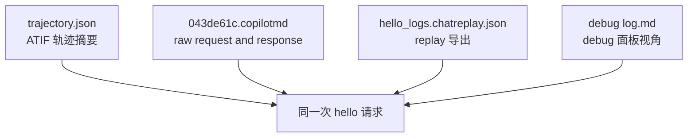
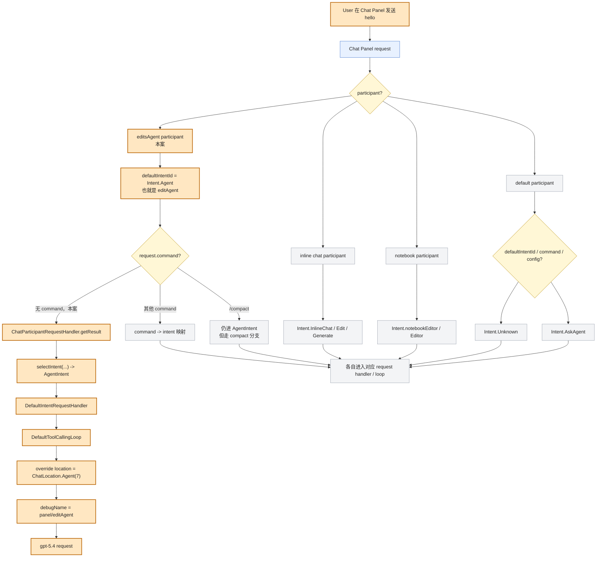
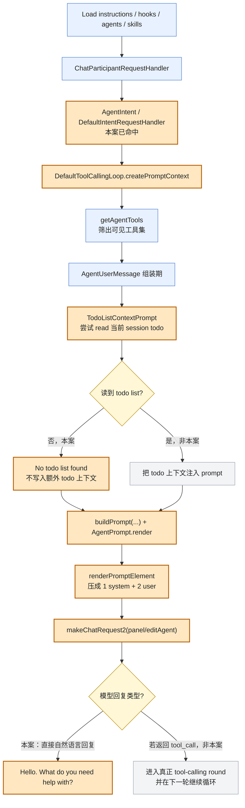
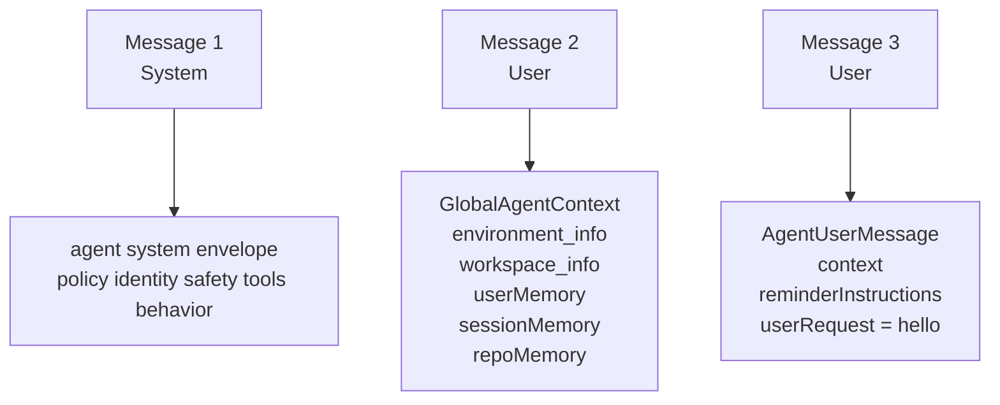
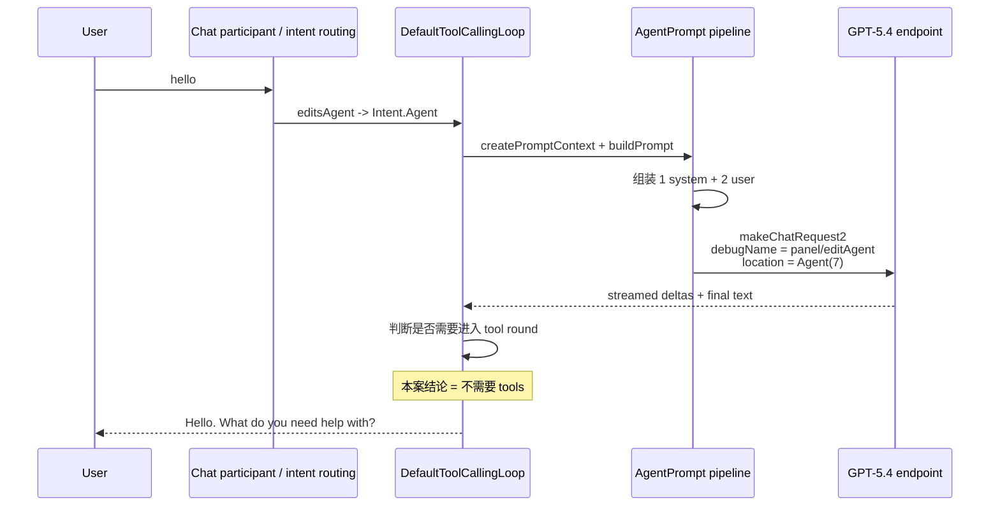
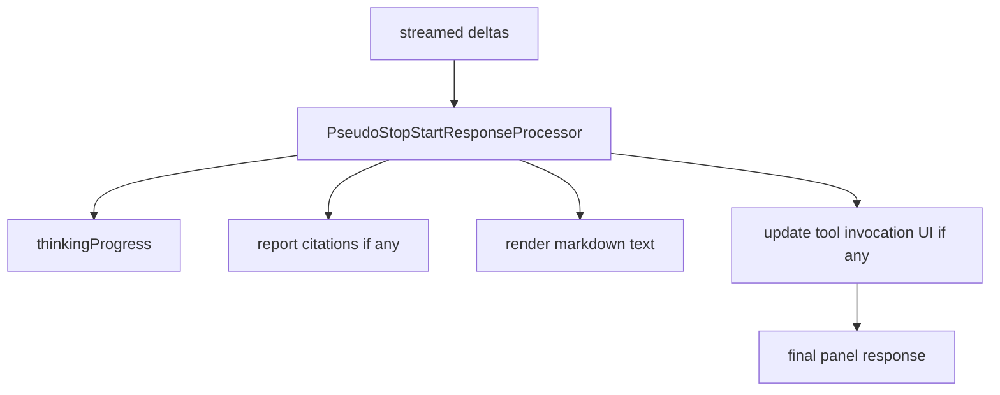
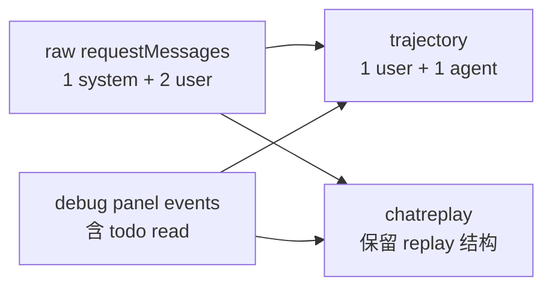

# 从一个干净窗口里的 `hello` 看穿 Chat Panel + Agent：基于 trajectory / raw request / chatreplay 的源码对照研究报告

## 文档目标

这份报告不再做抽象推演，而是基于同一次真实请求的四份证据，反向重建一次最小 Agent 会话：

1. [b9c99b6a-9ce4-4288-b028-431faa247615.trajectory.json](./b9c99b6a-9ce4-4288-b028-431faa247615.trajectory.json)
2. [043de61c.copilotmd](./043de61c.copilotmd)
3. [hello_logs.chatreplay.json](./hello_logs.chatreplay.json)
4. [Example of chat Hello - debug log.md](./Example%20of%20chat%20Hello%20-%20debug%20log.md)

研究对象非常具体：

1. 在一个干净的 VS Code 窗口里
2. 在 Chat Panel 中选择 Agent
3. 用户只发送一句 `hello`

这份报告要回答四件事：

1. 这次请求到底走的是哪条运行时路径
2. 发给模型之前，系统做了哪些前处理
3. 提示词到底是怎么组装成最终 `messages[]` 的
4. 这些导出文件和源码，哪些地方能一一对上，哪些地方仍然存在信息折叠或缺口

---

## 1. 先给结论

先把整篇压成六句最短结论：

1. 这次请求走的不是 Ask，而是 **Chat Panel 入口下的 Agent 路径**。
2. 调试名 `panel/editAgent` 和元数据里的 `location = 7` 并不冲突，它们分别代表 **入口名** 和 **真正发给模型的位置**。
3. 最终发给模型的核心请求不是“一坨字符串”，而是 **1 条 system + 2 条 user messages**。
4. 这 2 条 user message 分别承担了 **全局环境上下文** 与 **当前轮请求上下文**。
5. 日志里出现的 `manage_todo_list(read)` 更像是 **prompt 组装期的上下文读取**，而不是模型把 `hello` 当成复杂任务后主动规划出来的一步。
6. trajectory 文件并不是原始 prompt 的完整镜像，它对真实请求做了明显压缩：**只保留最后一个 user message、把 user 和 agent 步骤压到同一个起始时间、并遗漏了 prompt 组装期的 todo 读取**。
7. 这次虽然也出现了 `cached tokens = 4608`，但它只足以说明稳定前缀命中了 provider cache；**本案没有证据表明发生了 `stateful_marker -> previous_response_id` 那种多轮续接链**。
8. 当前是哪种 mode，也不是模型在收到 `hello` 之后临场投票出来的；**它在模型调用前就已经被 UI、runtime 和 participant / intent 路由层拍板**。

---

## 2. 四份证据分别记录什么

### 2.1 一张证据关系图

### 2.2 每份证据的职责

| 证据 | 最擅长回答什么 | 不擅长回答什么 |
| --- | --- | --- |
| [b9c99b6a-9ce4-4288-b028-431faa247615.trajectory.json](./b9c99b6a-9ce4-4288-b028-431faa247615.trajectory.json) | 高层 agent 轨迹、最终回复、reasoning 摘要、token 指标 | 完整 prompt 结构、prompt 组装副作用、全部 tool 细节 |
| [043de61c.copilotmd](./043de61c.copilotmd) | 最接近真实请求体的导出，能看见最终 `requestMessages` | 不能直接告诉你这些 messages 是由哪些 prompt 组件拼出来的 |
| [hello_logs.chatreplay.json](./hello_logs.chatreplay.json) | replay 结构、请求和回复的可重放表示 | 对 prompt 组件层级解释有限 |
| [Example of chat Hello - debug log.md](./Example%20of%20chat%20Hello%20-%20debug%20log.md) | 面板视角下的事件顺序、附加发现过程、额外 tool 读取 | 不是原始 request body，信息经过整理 |

### 2.3 这四份证据在本次案例里的分工

这次最关键的证据分工是：

1. [043de61c.copilotmd](./043de61c.copilotmd) 负责回答“最终发给模型的 messages 长什么样”
2. [b9c99b6a-9ce4-4288-b028-431faa247615.trajectory.json](./b9c99b6a-9ce4-4288-b028-431faa247615.trajectory.json) 负责回答“agent 轨迹最后留下了什么”
3. [Example of chat Hello - debug log.md](./Example%20of%20chat%20Hello%20-%20debug%20log.md) 负责补出“为什么会多出一次 `manage_todo_list(read)`”
4. 源码负责解释这些表象分别来自哪一层实现

### 2.4 为什么 `hello` 这种最小样本反而很适合研究

这正是前面几份旧报告里最值得保留的判断：`hello` 的价值，不在于业务复杂，而在于它几乎是一个 **空载基线**。

它像一次实验室里的空跑测试，特别适合把下面两类东西拆开看：

1. 哪些步骤是 mode 一旦选成 Agent 就一定会发生的默认骨架
2. 哪些步骤是任务复杂后才额外触发的真实施工行为

所以如果连这个最小样本都已经出现路径混乱、日志互相对不上、或者提示词装配讲不清楚，那么复杂场景只会把问题放大，不会把问题变简单。

---

## 3. 这次请求到底走了哪条运行时路径

### 3.1 一张入口到执行位置的图

### 3.2 为什么我说它是 Agent，而不是 Ask

从 [../../src/extension/conversation/vscode-node/chatParticipants.ts](../../src/extension/conversation/vscode-node/chatParticipants.ts) 可以看到，`registerEditsAgent()` 会把 `editsAgent` 注册成专用 participant，并绑定到 `Intent.Agent`。

而你这次导出的请求名字恰好就是 `panel/editAgent`，见 [043de61c.copilotmd](./043de61c.copilotmd) 与 [Example of chat Hello - debug log.md](./Example%20of%20chat%20Hello%20-%20debug%20log.md)。

所以入口层已经足够说明：

1. 这不是默认 Ask
2. 也不是普通 panel/user 路径
3. 而是 Chat Panel 中的 Agent participant

### 3.3 为什么元数据里又出现 `location = 7`

这一步来自 [../../src/extension/intents/node/agentIntent.ts](../../src/extension/intents/node/agentIntent.ts)。

`AgentIntent.getIntentHandlerOptions(...)` 里明确把 `overrideRequestLocation` 设成了 `ChatLocation.Agent`。

而 [../../src/platform/chat/common/commonTypes.ts](../../src/platform/chat/common/commonTypes.ts) 里 `ChatLocation.Agent = 7`。

这意味着：

1. 对外层调试名，它还是 `panel/editAgent`
2. 对真正发给模型的请求位置，它已经被提升为 `Agent`

这就是为什么你会同时看到：

1. `panel/editAgent`
2. `location : 7`

它们不是矛盾，而是 **两个不同维度的标识**。

### 3.4 路由层源码如何把它送进 intent

[../../src/extension/prompt/node/chatParticipantRequestHandler.ts](../../src/extension/prompt/node/chatParticipantRequestHandler.ts) 的职责是：

1. 读取 participant 上下文
2. 计算这次请求的 `intentId`
3. 创建对应 intent handler
4. 把请求送进去执行

这一步决定的是“这次请求属于哪条运行时骨架”，而不是提示词细节。

### 3.5 `modeInstructions2` 和 intent 路由不是二选一

旧版 hello 对照文档里有一个很容易被忽略、但非常关键的点：Ask / Edit / Agent 不是“走 intent”还是“走 `modeInstructions2`”的二选一分流。

更准确地说，它们是两层同时存在的机制：

1. participant / intent 路由层先决定这次请求进入哪条执行骨架
2. prompt 组装层再把 `request.modeInstructions2` 注入到 prompt context 里

这点可以直接从源码对上：

1. [../../src/extension/agents/vscode-node/promptFileContrib.ts](../../src/extension/agents/vscode-node/promptFileContrib.ts) 会注册 Ask / Edit 这类 custom agent provider
2. [../../src/extension/intents/node/toolCallingLoop.ts](../../src/extension/intents/node/toolCallingLoop.ts) 的 `createPromptContext(...)` 又会把 `request.modeInstructions2` 放进 `modeInstructions`

所以更准确的说法不是：

> Ask / Edit / Agent 由某一条单线机制决定。

而是：

> intent 决定“骨架走哪条车道”，`modeInstructions2` 决定“这条车道上再补哪些 mode 约束文本”，两者最后会在 prompt 构造阶段汇合。

放回本案里，这个结论的意义是：你这句 `hello` 之所以会带着完整 Agent 姿态进模型，不是因为模型读了 prompt 后才意识到“我现在想当 Agent”，而是因为请求在进模型之前，就已经被送上了 Agent 运行时车道。

---

## 4. 模型调用之前，系统做了哪些前处理

### 4.1 一张前处理总图

### 4.2 发现阶段：instructions、hooks、agents、skills

从 [Example of chat Hello - debug log.md](./Example%20of%20chat%20Hello%20-%20debug%20log.md) 可以看到，这次最开始经历了：

1. Load Instructions = 0
2. Load Hooks = 0
3. Load Agents = 3
4. Load Skills = 5

这说明：

1. 没有额外发现本地 instructions 文件
2. 没有额外 hooks
3. 但用户侧 agents 和 skills 发现流程是跑过的

这一步不是模型调用本身，但它会影响最终 prompt 可用能力与系统说明。

这份手工 debug log 还有一个额外价值：它不仅告诉你“发现了多少”，还把 discovery 的目录顺序也摊开了。所以当以后同类最小案例出现“为什么某份 instructions 没被加载”的问题时，这个 hello 样本也可以当作 discovery 基线来对照。

### 4.3 `DefaultIntentRequestHandler` 和 `DefaultToolCallingLoop`

真正进入执行骨架后，核心壳子是：

1. [../../src/extension/prompt/node/defaultIntentRequestHandler.ts](../../src/extension/prompt/node/defaultIntentRequestHandler.ts)
2. 其中的 `DefaultToolCallingLoop`

这两层做的不是具体业务，而是统一 orchestration：

1. 准备 prompt context
2. 获取可用工具
3. 调 invocation 的 `buildPrompt(...)`
4. 发起模型请求
5. 把回复交给 response processor

### 4.4 这次 Agent 能看到的工具从哪里来

工具集来自 [../../src/extension/intents/node/agentIntent.ts](../../src/extension/intents/node/agentIntent.ts) 里的 `getAgentTools(...)`。

这一步会根据：

1. 当前模型能力
2. 测试 / task 能力是否可用
3. execution/search subagent 实验开关
4. 编辑工具支持情况

筛出最终工具集。

你这次请求的 metadata 里也确实出现了大量工具定义，这和 `getAgentTools(...)` 的职责吻合。

### 4.5 为什么一个 `hello` 也会出现 `manage_todo_list(read)`

这是这次案例最容易误判的地方。

如果只看 debug 面板，你很容易得到结论：

> 模型先调用了一次 `manage_todo_list`，然后才决定回复 `Hello. What do you need help with?`

但源码更像下面这条链：

关键代码在：

1. [../../src/extension/prompts/node/agent/agentPrompt.tsx](../../src/extension/prompts/node/agent/agentPrompt.tsx) 里的 `AgentUserMessage`
2. [../../src/extension/tools/node/todoListContextPrompt.tsx](../../src/extension/tools/node/todoListContextPrompt.tsx)
3. [../../src/extension/prompt/node/todoListContextProvider.ts](../../src/extension/prompt/node/todoListContextProvider.ts)

这里的逻辑是：

1. 如果当前 AgentUserMessage 有 todo tool
2. 就尝试读取当前 chat session 的 todo context
3. 如果结果是 `No todo list found.`，就当成空上下文，不再写进 prompt

所以这次 `manage_todo_list(read)` 更像是 **prompt 组装期的上下文探测**，而不是“模型把 hello 当成复杂多步任务之后主动规划出的第一步”。

这个结论还能和 trajectory 里的 reasoning 对上：trajectory 里模型思考明确写着 “no tools are necessary”。

### 4.6 为什么我把它叫做“Agent 骨架空载”的案例

如果借用旧稿里那个比喻，这次 `hello` 很像一条已经启动的装配线，但传送带上没有真正的工单。

也就是说：

1. Agent 的发现、路由、工具筛选、prompt 组装这些默认骨架都已经启动
2. 但模型看完当前轮输入后，又判断不需要进入真实 tool round
3. 于是整条链在第一轮就自然收口成一句问候

这也解释了为什么本案很适合拿来区分两类成本：

1. 系统为了进入 Agent 姿态而必须支付的固定前置成本
2. 复杂任务才会继续叠加的多轮执行成本

你在 debug log 和 request metadata 里看到的大约两万输入 tokens，本质上更多反映的是前者，而不是某个复杂业务任务真的发生了。

---

## 5. 这次真实发给模型的提示词，核心上只有 3 条 messages

### 5.1 一张 messages 装配图

### 5.2 为什么我说是 1 条 system + 2 条 user

[hello_logs.chatreplay.json](./hello_logs.chatreplay.json) 里 `requestMessages` 明确出现了：

1. 一条 `role = 0`
2. 两条 `role = 1`

而 [043de61c.copilotmd](./043de61c.copilotmd) 则把这 3 条 message 的内容完整地展开出来了。

这对理解 Agent prompt 非常重要，因为它说明：

1. 真实请求并不是把所有上下文揉成一条 user message
2. 也不是 system 后面直接跟一句 `hello`
3. 中间还有一层单独的“全局环境上下文 user message”

### 5.3 第一条：System message 负责定义整套 agent 行为边界

在 [043de61c.copilotmd](./043de61c.copilotmd) 中，第一条 system message 非常长，里面包含：

1. Copilot 身份与模型说明
2. coding agent 行为规范
3. personality / interaction style / escalation
4. editing constraints
5. formatting / fileLinkification / memory instructions
6. skills / agents / instructions 相关说明

从代码结构上看，这一层对应的是：

1. [../../src/extension/prompts/node/agent/agentPrompt.tsx](../../src/extension/prompts/node/agent/agentPrompt.tsx) 里的基础 system 组装
2. [../../src/extension/prompts/node/agent/promptRegistry.ts](../../src/extension/prompts/node/agent/promptRegistry.ts) 解析出的模型定制化 prompt
3. 对于这次 `gpt-5.4`，命中的模型特化 resolver 是 [../../src/extension/prompts/node/agent/openai/gpt54Prompt.tsx](../../src/extension/prompts/node/agent/openai/gpt54Prompt.tsx)

这意味着：

1. 这次 system prompt 不是默认通用 prompt
2. 它已经进入了 GPT-5.4 专用 agent prompt 族

### 5.4 第二条：第一个 user message 是全局环境上下文

这条 message 在 [043de61c.copilotmd](./043de61c.copilotmd) 里能直接看到这些标签：

1. `<environment_info>`
2. `<workspace_info>`
3. `<userMemory>`
4. `<sessionMemory>`
5. `<repoMemory>`

这和 [../../src/extension/prompts/node/agent/agentPrompt.tsx](../../src/extension/prompts/node/agent/agentPrompt.tsx) 的 `GlobalAgentContext` 完全能对上：

1. `environment_info`
2. `workspace_info`
3. 新对话时再追加 `MemoryContextPrompt`

而 memory 三个标签则来自 [../../src/extension/tools/node/memoryContextPrompt.tsx](../../src/extension/tools/node/memoryContextPrompt.tsx)。

这次因为是干净窗口，没有 workspace，所以这条 message 里直接出现了：

> There is no workspace currently open.

这恰好是一个非常理想的最小案例，因为它把 GlobalAgentContext 的骨架暴露得很干净。

### 5.5 第三条：第二个 user message 才是当前轮请求上下文

这条 message 在 [043de61c.copilotmd](./043de61c.copilotmd) 里包含：

1. `<context>`
2. `<reminderInstructions>`
3. `<userRequest>`

它对应的是 [../../src/extension/prompts/node/agent/agentPrompt.tsx](../../src/extension/prompts/node/agent/agentPrompt.tsx) 里的 `AgentUserMessage`。

从源码顺序看，这层会依次尝试塞入：

1. notebook format hint
2. chat variables
3. tool references hint
4. `context`
5. current editor context
6. `reminderInstructions`
7. `userRequest`

这次因为场景极简，所以真正显性的重点只剩下：

1. terminal / date 这类 context
2. reminderInstructions
3. userRequest = `hello`

### 5.6 这次为什么没有 history 和 ChatToolCalls

这次 raw request 里没有再出现更早轮次的 conversation history，也没有尾部 tool result message，原因很直接：

1. 这是一个新会话
2. 模型最终没有进入真正的执行型工具回合

所以在这次案例里：

1. `AgentConversationHistory` 基本退化为空
2. `ChatToolCalls` 也没有形成真正的模型工具调用尾部消息

---

## 6. 这次请求是如何真正发给 GPT-5.4 的

### 6.1 一张请求发射图

### 6.2 请求元数据能直接回答什么

[043de61c.copilotmd](./043de61c.copilotmd) 给出了这次请求的关键元数据：

1. model = `gpt-5.4`
2. resolved model = `gpt-5.4-2026-03-05`
3. location = `7`
4. reasoning = `{"effort":"high","summary":"detailed"}`
5. prompt tokens = `20803`
6. completion tokens = `102`
7. cached tokens = `4608`
8. time to first token = `2606ms`
9. duration = `4203ms`

这说明：

1. 这次确实启用了 reasoning 模式
2. Prompt 体量主要消耗在系统层和上下文层，而不是 `hello` 本身
3. 模型响应很短，但前置上下文很重，这正是 Agent 模式的典型姿态

### 6.3 `debugName` 和 `enableThinking` 是怎么来的

在 [../../src/extension/prompt/node/defaultIntentRequestHandler.ts](../../src/extension/prompt/node/defaultIntentRequestHandler.ts) 的 `DefaultToolCallingLoop.fetch(...)` 里：

1. `debugName` 会按 `panel/editAgent` 这类格式生成
2. `location` 会采用 `overrideRequestLocation`
3. 对 `ChatLocation.Agent` 会启用 thinking

所以你在导出中同时看到：

1. `panel/editAgent`
2. `location = 7`
3. reasoning 配置与 reasoning tokens

这三件事在源码上是一条连续链，不是偶然拼在一起的。

### 6.4 `cached tokens = 4608` 在 hello 场景里说明什么，不说明什么

这是把 create-file 场景的经验迁移到 hello 时最容易串台的点。

这次 hello 的 metadata 里确实有：

1. `prompt tokens = 20803`
2. `cached tokens = 4608`
3. `completion tokens = 102`

但在这个场景里，对 `cached tokens` 最稳妥的解释只能到这一步：

1. 这是 provider usage 口径，不是 extension 本地把 request body 重新 tokenize 得出来的数。
2. 它说明这次单轮请求里的某些稳定前缀，被 provider 当成可复用缓存处理了。
3. 最像命中的部分，是那条巨大 system message，以及一部分稳定全局上下文。

但它**不能**说明下面这些事：

1. 不能说明发生了 `stateful_marker -> previous_response_id` 续接。
2. 不能说明发生了多轮 continuation。
3. 不能说明 provider 收到的 wire-level body 被裁剪成了“只剩增量”。

原因很简单：

1. 这次只有 1 个 model turn。
2. [hello_logs.chatreplay.json](./hello_logs.chatreplay.json) 里找不到 `stateful_marker`。
3. 这次也不存在下一轮 request，自然没有地方回传 `previous_response_id`。

所以在 hello 里，`cached tokens` 更应该被读成：**单轮大 prompt 的前缀缓存命中**；而不是像 create-file 那样，被进一步解释成“多轮 continuation + cache read 几乎贴着总输入走”。

### 6.5 这次 hello 没有发生哪些 create-file 场景里的机制

把最近几轮在 create-file 场景里澄清过的概念搬回 hello 时，最重要的不是“照搬”，而是明确哪些机制这次根本没发生。

本案没有发生的东西至少有五个：

1. 没有真正的 `ChatToolCalls` 尾巴，因为模型没有进入执行型 tool round。
2. 没有第二轮 request，所以也没有“history 很空但 tool replay 越来越长”的现象。
3. 没有 `stateful_marker`，因此也没有 `previous_response_id`。
4. 没有 `InvalidStatefulMarker -> fallback retry` 这种重发路径。
5. 没有 approval，因为没有真正落到外部资源访问工具。

换句话说，hello 这个案例更像是：

1. 入口路由、工具集发现、prompt 组装，这些 Agent 级基础设施全都完整跑了一遍。
2. 但模型在第一轮 reasoning 后立刻判断“这只是 greeting，不需要 tools”。
3. 所以整次请求在 **真正进入多轮自治执行之前** 就已经收口了。

---

## 7. 大模型如何回复，以及回复后系统做了什么

### 7.1 trajectory 里记录了什么样的“模型思考”

[b9c99b6a-9ce4-4288-b028-431faa247615.trajectory.json](./b9c99b6a-9ce4-4288-b028-431faa247615.trajectory.json) 里 `reasoning_content` 的核心意思是：

1. 这是一个简单 greeting
2. 不需要工具
3. 最好简洁回复

这和最终回答：

> Hello. What do you need help with?

是完全一致的。

### 7.2 一张回包后处理图

### 7.3 为什么这次回复很短，但 completion tokens 仍然是 102

从导出看，这次最终展示给用户的文字很短，但 completion tokens 和 reasoning tokens 并不小。

这并不奇怪，因为在 Agent + GPT-5.4 路径里：

1. 模型可以先产生 reasoning
2. 然后再决定只输出一条简短自然语言回答

而默认 response processor 在 [../../src/extension/prompt/node/pseudoStartStopConversationCallback.ts](../../src/extension/prompt/node/pseudoStartStopConversationCallback.ts) 中，会负责：

1. 接收 `thinking`
2. 处理 citations
3. 输出 markdown
4. 更新工具调用 UI

这次因为没有真正进入工具调用回合，所以最终用户面板只看到简短问候。

---

## 8. trajectory、copilotmd、chatreplay 到底是怎样互相补位的

### 8.1 一张导出压缩图

### 8.2 为什么 trajectory 只有 2 步

这不是因为真实请求只有 2 个构件，而是因为 trajectory adapter 有自己的压缩规则。

从 [../../src/platform/trajectory/node/trajectoryLoggerAdapter.ts](../../src/platform/trajectory/node/trajectoryLoggerAdapter.ts) 可以看到：

1. `maybeAddUserStepFromRequest(...)` 会从 request 里抽 user step
2. `getLastUserMessageText(...)` 只取 **最后一条** `Raw.ChatRole.User`
3. `processSuccessfulRequest(...)` 再创建 agent step

这直接导致：

1. trajectory 里的 user step 不是完整 prompt
2. 它只是最后一个 user message
3. 所以全局环境上下文那条 user message 没被保留下来

这就是为什么 trajectory 里的 step 1 只有：

1. `<context>`
2. `<reminderInstructions>`
3. `<userRequest>`

而没有：

1. `<environment_info>`
2. `<workspace_info>`
3. `<userMemory>`
4. `<sessionMemory>`
5. `<repoMemory>`

### 8.3 为什么 trajectory 里 user 和 agent 的时间戳相同

这也是 adapter 的结果，而不是请求真的同一时刻完成。

`maybeAddUserStepFromRequest(...)` 用的是 request 的 `startTime`，而 agent step 的 `beginAgentStep(...)` 也是用同一个 `startTime`。

所以 trajectory 文件里 user step 和 agent step 会共享相同起点时间，这更像“同一轮请求的摘要视角”，而不是真实的细粒度事件时间线。

### 8.4 为什么 trajectory 没把 `manage_todo_list(read)` 写成一步

这是本次案例最大的“不完全对齐点”。

我们已经知道 debug 面板里确实出现了：

1. `execute_tool manage_todo_list`
2. `operation = read`
3. `No todo list found.`

但 trajectory 只有 2 步，没有第三个 tool step。

基于源码和证据，我认为最合理的解释是：

1. 这次 todo 读取发生在 prompt 组装期
2. 它是 `TodoListContextPrompt` 触发的上下文读取
3. 它没有变成“模型输出 delta 中声明的 tool call”
4. trajectory adapter 的主视角又是 request/response 与与其关联的 tool-call 事件

所以它最终没有出现在 ATIF 主轨迹里。

这里我刻意不用“已经被完全证明”的语气，因为从导出文件本身还无法 100% 证明它是在哪个 logger 分支上被排除的；但从现有源码和四份证据来看，这是最一致的解释。

### 8.5 如果把这个 `hello` 当作 smoke test，最短排障顺序是什么

把旧 observability 报告里真正有用的部分压成一条实操流程，大概就是下面这四步：

1. 先看 [Example of chat Hello - debug log.md](./Example%20of%20chat%20Hello%20-%20debug%20log.md)，确认 discovery、`manage_todo_list(read)`、`panel/editAgent` 这些外围事件有没有跑偏
2. 再看 [043de61c.copilotmd](./043de61c.copilotmd)，确认最终发给模型的 `requestMessages`、`location = 7`、usage 和 resolved model
3. 再看 [b9c99b6a-9ce4-4288-b028-431faa247615.trajectory.json](./b9c99b6a-9ce4-4288-b028-431faa247615.trajectory.json)，确认结构化轨迹是不是仍然只剩最短的 user step + agent step
4. 如果这三层还不能解释问题，再向外补 transcript 与 OTel：前者看 turn 顺序，后者看 span 与耗时

它背后的方法论其实很简单：

1. debug log 适合看发现流程与外围副作用
2. raw request 适合看最终真正发给模型的东西
3. trajectory 适合看运行结果被压缩成了怎样的 agent 结构
4. transcript / OTel 则是继续向“事件顺序”和“时序开销”外扩的镜头

所以 hello 这种最小样本，不只是一个可以读懂源码的案例，也是一条很好用的运行时校准基线。

---

## 9. 这次案例里，哪些地方能完美对上，哪些地方还留有缝隙

### 9.1 能高度对上的部分

下面这些点，我认为已经可以视为“源码与证据高度一致”：

1. 请求入口是 Chat Panel 的 Agent participant，而不是 Ask
2. 执行 intent 是 `Intent.Agent`
3. 真正发给模型的位置是 `ChatLocation.Agent = 7`
4. 模型命中的是 GPT-5.4 专用 Agent prompt 族
5. 最终 raw request 的核心结构是 `1 system + 2 user`
6. 第二条 user message 对应 `GlobalAgentContext + MemoryContextPrompt`
7. 第三条 user message 对应 `AgentUserMessage`
8. 这是一个新会话，所以没有明显 history 尾巴
9. 最终回答是简单问候，没有进入真正执行型 tool round
10. 这次没有出现 `stateful_marker` 或 `previous_response_id`，因此也没有 create-file 场景里的多轮 continuation 证据链

### 9.2 不能说“完美对上”的部分

下面这些地方，我认为必须诚实标出来：

1. trajectory 并没有保留完整 prompt，它只保留了最后一个 user message
2. trajectory 的时间戳不是细粒度真实事件时间线，而是摘要级时间戳
3. debug 面板里出现的 `manage_todo_list(read)` 没有出现在 trajectory 主轨迹中
4. 导出 metadata 里的 `intent = undefined` 与实际运行路径不一致；基于当前证据，`panel/editAgent` 与 `location = 7` 更可靠，但这个字段为什么未填，这次没有继续深挖到具体写入点
5. 这次只有单轮请求，因此我们只能确认“有 cached tokens”，不能像 create-file 那样进一步把它拆成 continuation、cache read、fallback retry 的链式证据

如果把这部分压成一句最短判断，那就是：

> **这次案例在“主运行路径”和“prompt 大骨架”上已经能和源码高度对齐，但导出格式本身会做摘要和压缩，因此它不是对底层运行时的无损转储。**

---

## 10. 用一句话收口

这次 `hello` 的真实运行过程，不是“用户发一句 hello，模型礼貌回一句 hello”这么简单，而是：Chat Panel 先把请求送进 `editAgent` participant，再路由到 `AgentIntent`，`DefaultToolCallingLoop` 准备 Agent 级 prompt context，`AgentPrompt` 把系统约束、全局环境、memory、当前轮上下文组装成 `1 system + 2 user` 的最终 `messages[]`，其间 `TodoListContextPrompt` 还会尝试读取当前会话的 todo 状态，然后请求以 `panel/editAgent / location = Agent(7)` 的姿态发给 `gpt-5.4`；模型在 reasoning 后判断这只是一个 greeting，因此在**第一轮**就直接收口，没有进入真正的工具执行回合，也没有形成 `stateful_marker -> previous_response_id` 的多轮续接链，只返回一句简短问候。trajectory 文件能忠实记录这轮的高层结果，但它并不是原始 prompt 的完整镜像，而是一份经过压缩后的 agent 轨迹摘要。
