# 从一句“please create a file - a.txt with content abc”看穿 Agent 的多轮工具循环：基于 trajectory / debug log / chatreplay / extension log 的源码对照研究报告

## 文档目标

这份报告研究的是一个比 `hello` 更像真实生产场景的 Agent 会话：

1. 用户在一个新的 Chat 会话里输入 `please create a file - a.txt with content abc`
2. UI 先显示类似 “Optimizing tool selection...” 的中间态
3. 然后 Copilot 先找活动目录，再尝试创建文件
4. 但目标文件其实已经存在，于是流程转向“读取旧内容，再补丁更新”
5. 用户观察到整个过程中出现了 3 次 approval

这份报告要回答六件事：

1. 这次请求到底走了几轮模型调用
2. 每一轮模型分别看到了什么，做了什么决定
3. 为什么 `create_file` 失败后没有结束，而是自动切到 `read_file + apply_patch`
4. 为什么会出现 3 次 approval
5. prompt 的主体结构是如何拼起来的
6. 哪些导出物属于主流程，哪些只是后台 sidecar 请求

---

## 1. 先给结论

先把整篇压成 8 句最短结论：

1. 这次请求仍然走的是 Chat Panel 下的 Agent 主链，不是轻量 Ask。
2. 主执行模型是 `gpt-5.4`，调试名是 `panel/editAgent`。
3. 整个会话不是“一次回复带四个工具”，而是 5 次模型轮次串起来的工具循环。
4. 工具链真实顺序是：`run_in_terminal` -> `create_file` -> `read_file` -> `apply_patch` -> final answer。
5. `create_file` 失败不是权限问题，而是工具语义问题：它明确不能拿来覆盖已存在文件。
6. 用户看到的 3 次 approval，最可信的对应关系是：`create_file`、`read_file`、`apply_patch` 三次针对工作区外文件的确认。
7. `run_in_terminal` 把活动目录解析到了 `C:\Users\lsheng2`，这一步把后续全部文件操作都推到了当前 workspace 之外，因此触发了外部资源确认链。
8. 同目录下的 `title_*`、`progressMessages_*`、`copilotLanguageModelWrapper_*` 不是主链步骤，更像旁路 helper 请求或导出时一起打包的 sidecar span。

---

## 2. 这次请求像什么

如果把这次 Agent 执行比作一个办事员流程，它不像“听完一句话立刻把表填好”，更像下面这样：

1. 先去前台问清楚“我要把文件放在哪个柜台”
2. 拿到柜台地址后，准备新建文件
3. 柜台告诉它：“这个文件已经有了，不能按新建流程办”
4. 它于是改走“调档”流程，先读出现有内容
5. 确认旧内容是 `dummy`
6. 再提交一张补丁，把 `dummy` 改成 `abc`

换句话说，这不是“创建失败”，而是“创建分支自动降级为修补分支”。

---

## 3. 证据地图

本次最重要的证据一共有 7 组：

1. [fffe2648-51cb-4458-ab35-e593a94d6191.trajectory.json](./fffe2648-51cb-4458-ab35-e593a94d6191.trajectory.json)
2. [agent-debug-log-fffe2648-51cb-4458-ab35-e593a94d6191.json](./agent-debug-log-fffe2648-51cb-4458-ab35-e593a94d6191.json)
3. [please_create_a_file___a_txt_with_content_abc_logs.chatreplay.json](./please_create_a_file___a_txt_with_content_abc_logs.chatreplay.json)
4. [GitHub Copilot Chat.log](./GitHub%20Copilot%20Chat.log)
5. [title_b1faca75.copilotmd](./title_b1faca75.copilotmd)
6. [progressMessages_75c1f73e.copilotmd](./progressMessages_75c1f73e.copilotmd) 与 [progressMessages_90f4d148.copilotmd](./progressMessages_90f4d148.copilotmd)
7. [copilotLanguageModelWrapper_a44706d8.copilotmd](./copilotLanguageModelWrapper_a44706d8.copilotmd) 与 [copilotLanguageModelWrapper_d087cabb.copilotmd](./copilotLanguageModelWrapper_d087cabb.copilotmd)

它们的职责可以这样分：

| 证据 | 最擅长回答什么 | 不擅长回答什么 |
| --- | --- | --- |
| trajectory | 高层步骤、推理摘要、总 token、最终结论 | approval 细节、prepareInvocation 文案 |
| debug log | 每轮 `chat gpt-5.4` 和每次 `execute_tool` 的输入输出 | UI 层批准弹窗的最终渲染 |
| chatreplay | 多轮 request/response 的可重放结构 | approval 包体在导出中被明显折叠 |
| GitHub Copilot Chat.log | 请求级时间顺序、`ccreq:*` 调试名、helper sidecar 的前后关系 | 单次工具调用的完整参数与返回体 |
| title/progress/wrapper copilotmd | 后台 helper 请求的提示词和返回值 | 主工具循环本身 |

新补充的 [GitHub Copilot Chat.log](./GitHub%20Copilot%20Chat.log) 把前一版报告里几处“高概率判断”又校对实了一层：

1. 它直接给出了 5 条 `panel/editAgent` 成功请求，和 `turn_count = 5` 的结论完全对上。
2. 它把 sidecar 请求的先后顺序钉住了：`title`、两次 `progressMessages` 都发生在第一条 `panel/editAgent` 之前。
3. 它还确认了两次 `copilotLanguageModelWrapper` 确实是独立 helper 请求，而不是主链里的某个隐藏工具步骤。
4. 它仍然没有吐出 approval 的包体，所以 approval 那一部分依然只能靠源码和现象做交叉校验。

---

## 4. Copilot Chat 场景总览与本案主路径

这一节补一组更“Copilot Chat 全景图”式的流程图。

阅读方式建议是：

1. 先看 `4.1`，搞清楚用户请求先怎么选 participant，再怎么落到 intent。
2. 再看 `4.2`，搞清楚一旦进入 `AgentIntent`，后面的 prompt 组装、provider 循环、tool loop、approval、patch 回写是怎样闭环的。
3. 最后看 `4.3`，把这些抽象节点和本案真实 5 轮调用一一对上。

下面几张图里统一约定：

- 橙色节点：本案例真正走到的主路径
- 灰色节点：同一场景下存在、但这次没有走到的其他分支
- 蓝色节点：基础执行设施或公共运行时

### 4.1 从 Copilot Chat 入口到 participant / intent 的分流图

这张图对应你提到的“先选 participant，再选 intent”。它不是模型先决定“我要当 Agent”，而是 Copilot Chat 先在 orchestration 层决定路由；本案高亮的是 `editsAgent -> Intent.Agent -> AgentIntent`。

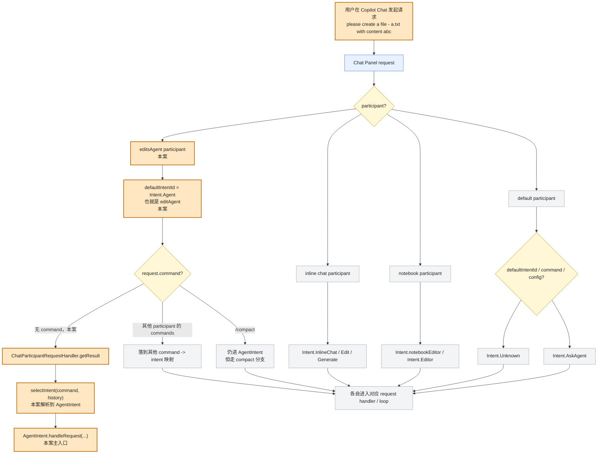

### 4.2 从 `AgentIntent` 进入 prompt 组装、provider 循环、tool loop 的总览图

这张图把“怎么一步一步组装 prompt、怎么多轮发给 provider、provider 返回后怎样进工具循环、怎样回到下一轮、最后怎样改文件/做 patch”压到一张架构图里。橙色依然是本案真实走过的路径。

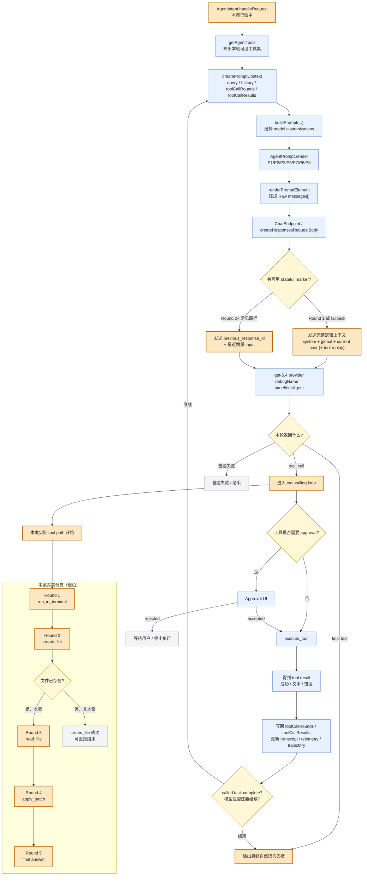

### 4.3 本案五轮真实时序

把上面两张“结构图”压回本案这一次的真实时序，就是下面这样：

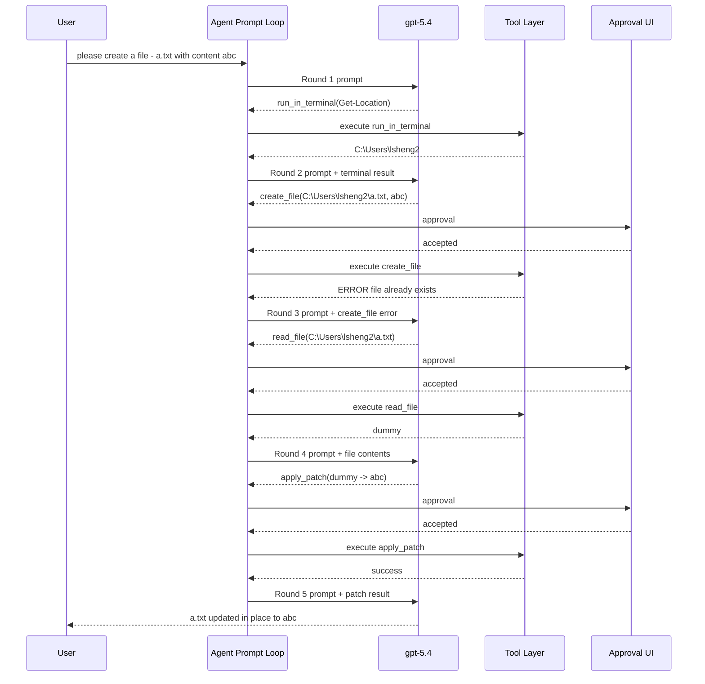

这张图和导出证据是能互相咬合的：

1. trajectory 给出了 4 次工具调用和 1 次最终回答
2. debug log 给出了 4 个 `execute_tool` span 和 5 个 `chat gpt-5.4` span
3. `invoke_agent GitHub Copilot Chat` 的总 span 里还记录了 `turn_count = 5`
4. [GitHub Copilot Chat.log](./GitHub%20Copilot%20Chat.log) 里还能看到 5 条连续的 `ccreq:* | [panel/editAgent]`，请求 ID 分别是 `91527465`、`920b29ed`、`f0c0a65a`、`a1570d24`、`84bb6208`

另外，这份新日志还补了一个很像 UI “Optimizing tool selection...” 的后台侧证据：在第一条主链请求前，它记录了两次 `[virtual-tools] Had to drop ... tools due to limit constraints`。这不能和 UI 字符串逐字等同，但至少说明主链开始前确实发生过工具集裁剪。

---

## 5. 真实发生了哪 5 轮模型调用

### 5.1 Round 1：先定位活动目录

trajectory 的第一个 agent step 很关键：

1. 文本是 “I need the active directory first so I can place a.txt in the right location...”
2. reasoning 明确在比较“直接创建”与“先探测目录”
3. 最终工具调用是 `run_in_terminal`
4. 命令是 `Get-Location | Select-Object -ExpandProperty Path`
5. 结果是 `C:\Users\lsheng2`

debug log 也把这一轮钉得很死：

1. `chat gpt-5.4` span 输出里有 `run_in_terminal`
2. 紧跟着出现 `execute_tool run_in_terminal`
3. `gen_ai.tool.call.result` 就是 `C:\Users\lsheng2`

而 [GitHub Copilot Chat.log](./GitHub%20Copilot%20Chat.log) 也从时间顺序上补强了这件事：第一条 `panel/editAgent` 之后，第二条 `panel/editAgent` 很快跟上，说明“先拿路径，再决定下一步”的轮转确实发生了，而不是导出器后处理时把多段内容拼在了一起。

这一步像是在地图上先拿到坐标，然后后面的文件操作都开始围绕这个坐标展开。

### 5.2 Round 2：尝试按“新建文件”分支执行

第二轮的 assistant 文本是：

`I found the current directory and am creating a.txt there with the requested content.`

然后模型发出：

```text
create_file(
  filePath = C:\Users\lsheng2\a.txt,
  content = abc
)
```

但工具结果不是成功，而是：

```text
ERROR: File already exists. You must use an edit tool to modify it.
```

这一步最重要的含义不是“报错了”，而是主流程发生了分叉：

1. 用户意图依然是“让最终文件内容变成 abc”
2. 但 `create_file` 工具只负责新建，不能覆写
3. 所以模型必须换一条达成同一用户目标的路径

### 5.3 Round 3：转入“读取现有内容”分支

第三轮 assistant 文本变成：

`a.txt already exists, so I'm checking its current contents before updating it safely to abc.`

然后发出：

```text
read_file(C:\Users\lsheng2\a.txt, 1, 20)
```

debug log 中的结果很干净：只读出了一个词，`dummy`。

也就是说，这一轮的任务只有一个：

1. 把“未知旧内容”变成“已知旧内容”
2. 为下一轮生成精确补丁创造条件

### 5.4 Round 4：生成精确补丁

第四轮 assistant 文本是：

`I'm replacing the existing placeholder content so the file ends up exactly as requested.`

这时模型发出的不是 `edit_file`，而是 `apply_patch`：

```diff
*** Begin Patch
*** Update File: C:\Users\lsheng2\a.txt
@@
-dummy
+abc
*** End Patch
```

这一轮非常像外科手术：

1. 先读出病灶是 `dummy`
2. 再只替换那一小块
3. 因而输出可以说“updated in place”

### 5.5 Round 5：生成最终自然语言回复

最后一轮模型不再调用工具，只输出总结：

`Created a.txt in the current PowerShell directory with content abc. The file was already present, so I updated it in place to match your requested content exactly.`

注意这句话故意保持“以用户目标为中心”的叙述：

1. 用户要的是 `a.txt` 里有 `abc`
2. 虽然技术路径经历了“创建失败 -> 读取 -> 打补丁”
3. 但最终还是按“已完成用户请求”来归纳

---

## 6. 为什么是 3 次 approval

这是本案最容易说错的地方。

如果只看工具链，一共 4 个工具调用；如果只看用户观察，又只有 3 次 approval。最合理的解释不是 “terminal + 两次编辑”，而是：

1. `create_file` 的外部写入确认
2. `read_file` 的外部读取确认
3. `apply_patch` 的外部写入确认

原因如下。

### 6.1 第一次 approval：`create_file`

`create_file` 的 `prepareInvocation(...)` 在 [../../src/extension/tools/node/createFileTool.tsx](../../src/extension/tools/node/createFileTool.tsx) 里会直接调用 `createEditConfirmation(...)`。

而 [../../src/extension/tools/node/editFileToolUtils.tsx](../../src/extension/tools/node/editFileToolUtils.tsx) 的 `createEditConfirmation(...)` 会检查目标 URI 是否：

1. 在工作区外
2. 是敏感文件
3. 没有权限

如果是工作区外文件，就会生成：

1. 标题 `Allow edits to sensitive files?`
2. 消息 `The model wants to edit files outside of your workspace (...)`
3. 并要求用户确认

这里的核心细节是：

1. approval 只是在授权“可以碰这个文件”
2. 它不保证工具业务语义一定成功
3. 所以用户即便批准了，`create_file` 仍然可能因为“文件已存在”而失败

[GitHub Copilot Chat.log](./GitHub%20Copilot%20Chat.log) 还单独记下了这一错误：

`Error from tool create_file with args {"filePath":"C:\\Users\\lsheng2\\a.txt","content":"abc"}: File already exists...`

这进一步证明第二轮不是模型理解错了用户意图，而是工具本身按设计拒绝了“覆盖式创建”。

### 6.2 第二次 approval：`read_file`

`read_file` 的 `prepareInvocation(...)` 在 [../../src/extension/tools/node/readFileTool.tsx](../../src/extension/tools/node/readFileTool.tsx) 中，先调用：

```ts
isFileExternalAndNeedsConfirmation(..., { readOnly: true })
```

对应逻辑在 [../../src/extension/tools/node/toolUtils.ts](../../src/extension/tools/node/toolUtils.ts) 里：

1. 工作区内文件，不需要确认
2. 额外白名单读路径，不需要确认
3. 其余存在的外部文件，读也要确认

而 `C:\Users\lsheng2\a.txt` 显然不在当前 workspace `d:\AIGC\vscode-copilot-chat_my` 下，所以它会返回一个确认请求：

1. 标题 `Allow reading external files?`
2. 消息大意是 “这个文件在当前 folder/workspace 之外”

这一步解释了为什么虽然只是读文件，用户仍然会看到 approval。

### 6.3 第三次 approval：`apply_patch`

`apply_patch` 的 `prepareInvocation(...)` 在 [../../src/extension/tools/node/applyPatchTool.tsx](../../src/extension/tools/node/applyPatchTool.tsx) 里，同样调用 `createEditConfirmation(...)`。

区别在于这次它还能生成补丁 diff 作为确认详情，所以这类 approval 一般更“重”，因为它不仅是权限门，还兼带变更预览。

从当前证据看，这第三次 approval 最符合用户“看到 3 次确认”的观察。

### 6.4 为什么不是 `run_in_terminal`

目前仓库内没有本案对应的 `run_in_terminal` 工具实现代码可对照，它更像宿主环境提供的外部工具能力。

而从“总数恰好为 3”这个事实看，最稳妥的解释是：

1. terminal 这一步没有额外 approval，或者不计入用户所说的那 3 次
2. 3 次 approval 都来自后面的 3 个外部文件访问

这比“terminal + 两次写入”更能和 `read_file` 的源码逻辑完全对齐。

### 6.5 一张 approval 归因图

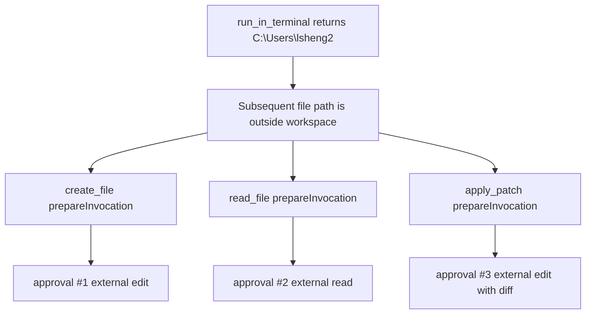

---

## 7. 为什么 `create_file` 失败后会自动转成 `read_file + apply_patch`

这不是 repo 里某个专门的“失败恢复器”在硬编码，而是工具循环自己完成的。

核心逻辑可以理解成：

1. 模型每一轮看到新的上下文
2. 工具结果会回填进下一轮 prompt
3. 下一轮模型基于最新事实重新规划

在 [../../src/extension/prompts/node/agent/agentPrompt.tsx](../../src/extension/prompts/node/agent/agentPrompt.tsx) 中，`AgentPrompt` 在用户消息后面会挂上 `ChatToolCalls`，也就是把前面轮次的工具调用与结果重新送回模型。

所以这次循环的心理模型大概是：

1. Round 1 只知道“用户想创建文件”
2. Round 2 知道“目标目录是 `C:\Users\lsheng2`”
3. Round 3 知道“`create_file` 失败，因为文件已存在”
4. Round 4 知道“现有内容是 `dummy`”
5. Round 5 知道“补丁已成功应用”

这就像每一轮都把最新病历贴回医生桌上，医生再开下一张单。

---

## 8. prompt 到底长什么样

### 8.1 主体结构不是一条 message，而是分层拼装

这条链和 `hello` 案例一样，主 prompt 仍然不是“一整坨 user text”，而是分层装配：

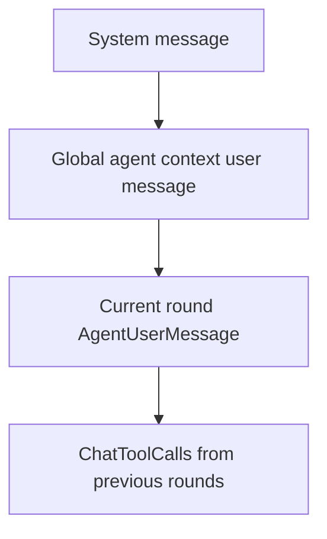

其中当前轮用户消息的形状由 [../../src/extension/prompts/node/agent/agentPrompt.tsx](../../src/extension/prompts/node/agent/agentPrompt.tsx) 里的 `AgentUserMessage` 直接生成，关键标签就是：

1. `<context>`
2. `<reminderInstructions>`
3. `<userRequest>`

也就是说，trajectory 第一步里看到的：

```xml
<context>...</context>
<reminderInstructions>...</reminderInstructions>
<userRequest>please create a file - a.txt with content abc</userRequest>
```

不是导出器临时包装出来的花活，而是 Agent prompt 的标准形状。

### 8.2 `AgentUserMessage` 会塞进哪些当前轮上下文

从 `AgentUserMessage.render(...)` 可以直接看出当前轮 message 会放入：

1. 当前日期
2. 编辑事件
3. notebook 变化摘要
4. terminal 状态
5. todo 上下文
6. hook 附加上下文
7. reminder instructions
8. 最终的 user request

这就解释了为什么 trajectory 里用户请求看起来不是一句裸文本，而是一封“带标签的操作说明书”。

### 8.3 为什么模型会先选 `run_in_terminal`

因为在 `<context>` 里，模型能看到 terminal 状态；在 `<reminderInstructions>` 里，它又被持续提醒：

1. 尽量先收集准确上下文
2. 不要乱猜路径
3. 终端命令串行执行

因此当用户只说 `a.txt` 而没给路径时，“先问活动目录”是很自然的第一步。

### 8.4 把第一轮 prompt 拆成编号片段

如果把“第一轮真正发给 `gpt-5.4` 的 prompt”拆成可追踪零件，它更接近下面这张装配图：

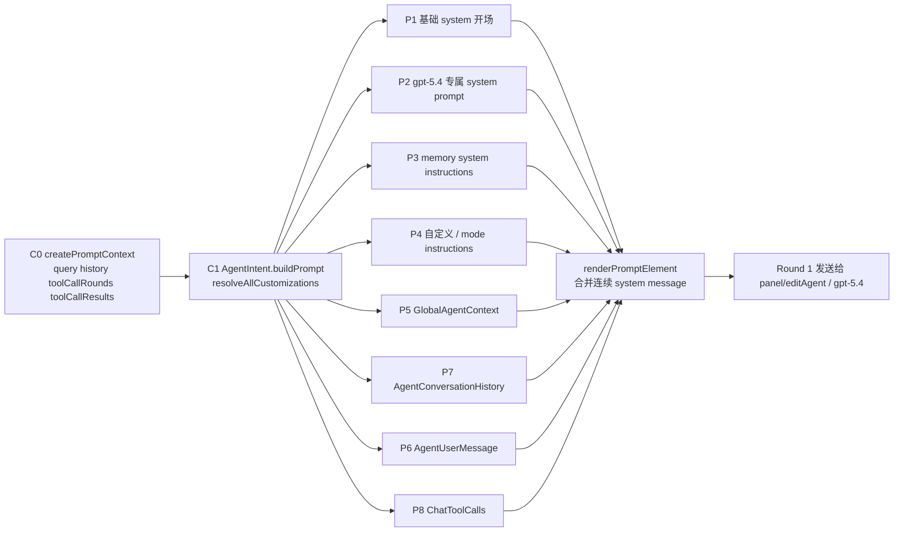

这张图里，真正决定“每一小段提示词从哪来”的不是单个 prompt 文件，而是四层串联：

1. [../../src/extension/intents/node/toolCallingLoop.ts](../../src/extension/intents/node/toolCallingLoop.ts) 的 `createPromptContext(...)` 先决定这轮有哪些原材料。
2. [../../src/extension/intents/node/agentIntent.ts](../../src/extension/intents/node/agentIntent.ts) 的 `buildPrompt(...)` 再决定本轮用哪套 model customizations。
3. [../../src/extension/prompts/node/agent/agentPrompt.tsx](../../src/extension/prompts/node/agent/agentPrompt.tsx) 的 `AgentPrompt.render(...)` 把这些材料排成 system / user / tool replay 三层骨架。
4. [../../src/extension/prompts/node/base/promptRenderer.ts](../../src/extension/prompts/node/base/promptRenderer.ts) 的 `renderPromptElement(...)` 最后把 TSX prompt 真正压成 `messages[]`。

对应到本案例，第一轮各编号片段可以落到下面这张表：

| 编号 | 最终长在 prompt 里的位置 | 主要来源 | 在什么时候装配 | 本案例 Round 1 是否出现 | 本案例可见字串样例 |
| --- | --- | --- | --- | --- | --- |
| C0 | 不是最终字符串，而是装配原料 | `createPromptContext(...)` | 每轮 loop 开始时 | 是 | 这层本身不是最终 prompt 文本，而是后面要被 render 的输入材料：`query = "please create a file - a.txt with content abc"`；`history = []`；`toolCallRounds = []` |
| P1 | 基础 system 开场，如 “You are an expert AI programming assistant...” | `AgentPrompt.render(...)` 里的 `baseAgentInstructions` | `buildPrompt(...)` 进入渲染时 | 是 | `You are an expert AI programming assistant, working with a user in the VS Code editor.` |
| P2 | 模型专属 system prompt | `PromptRegistry.resolveAllCustomizations(...)` 选中 `openai/gpt54Prompt.tsx` 的 `Gpt54Prompt` | `buildPrompt(...)` 解析 endpoint 后 | 是 | 这是一个很长的复合 system block，本案例可见代表性切片例如：`<coding_agent_instructions>You are a coding agent running in VS Code. You are expected to be precise, safe, and helpful.`；`<editing_constraints>- Always use apply_patch for manual code edits.`；`<task_execution>You are a coding agent. You must keep going until the query or task is completely resolved...` |
| P3 | memory 工具使用规则 | `MemoryInstructionsPrompt`，由 `AgentPrompt.render(...)` 包在 `SystemMessage` 中 | 与 P1/P2 同批装配 | 是 | 同样是复合块，代表性字串例如：`<memoryInstructions>As you work, consult your memory files to build on previous experience...`；`<memoryScopes>Memory is organized into the scopes defined below:`；`- User memory (/memories/) ...` |
| P4 | 自定义 instructions / mode instructions | `getAgentCustomInstructions()` | system/user 基础层装配时 | 本案例大概率为空或极少 | 本案例没有看到一个显眼的独立自定义块；如果有，通常会像 `modeInstructions` 或额外自定义 instruction 文本那样插进 system / user 层。也就是说，这一格在本案例更接近 `空`。 |
| P5 | 全局 user context：环境、workspace、用户偏好、memory 上下文 | `GlobalAgentContext` | 每轮 render 时取用，但可缓存 | 是 | 这块在 replay 里能直接看到，例如：`<environment_info>The user's current OS is: Windows</environment_info>`；`<workspace_info>There is no workspace currently open.</workspace_info>`；`<userMemory>The following are your persistent user memory notes...` |
| P7 | 历史对话 | `AgentConversationHistory` | 当前轮 render 时 | 本案例首轮为空 | 首轮基本就是 `空`。如果不是首轮，这里会长出 earlier user / assistant messages，而不是工具结果本身。 |
| P6 | 当前轮 user message | `AgentUserMessage` | 当前轮 render 时 | 是 | 本案例首轮最直观的样子就是：`<context>The current date is March 28, 2026.\nTerminals:\nTerminal: pwsh</context>`；`<reminderInstructions>You are an agent—keep going until the user's query is completely resolved...`；`<userRequest>please create a file - a.txt with content abc</userRequest>` |
| P8 | 当前轮已发生的工具调用及结果回放 | `ChatToolCalls` | 当前轮 render 时 | 本案例首轮为空 | 首轮这里也是 `空`；但从 Round 2 开始就会出现可见回放，例如：`assistant: I need the active directory first so I can place a.txt in the right location...`；`tool_call: run_in_terminal`；`tool_result: C:\Users\lsheng2` |

这里有两个很容易忽略的点：

1. `P2` 不是默认 prompt，而是 `gpt-5.4` 专属实现。`allAgentPrompts.ts` 会导入 `openai/gpt54Prompt.tsx`，后者通过 `PromptRegistry.registerPrompt(Gpt54PromptResolver)` 注册；`agentIntent.ts` 再用 `resolveAllCustomizations(...)` 把它选出来。
2. `P1 + P2 + P3` 虽然在源码里是三段 system 片段，但到了 `renderPromptElement(...)` 这一步会被折叠成连续的 system message，因此导出物里常常看不出原始分段边界。

### 8.5 `P6` 也就是 `AgentUserMessage`，内部又分四层

用户最容易在导出里看到的是 `P6`，因为 trajectory 里直接出现了：

```xml
<context>...</context>
<reminderInstructions>...</reminderInstructions>
<userRequest>please create a file - a.txt with content abc</userRequest>
```

但源码里它其实还可以继续拆：

| 子片段 | 导出里通常长什么样 | 来源 | 本案例作用 | 本案例可见字串样例 |
| --- | --- | --- | --- | --- |
| P6.1 | `<context>...</context>` | `AgentUserMessage.render(...)` 内的 `Tag name='context'` | 把日期、terminal 状态、todo、hook 上下文等塞进来 | `The current date is March 28, 2026.`；`Terminals:`；`Terminal: pwsh` |
| P6.2 | 编辑器上下文块 | `CurrentEditorContext` | 告诉模型当前编辑器/选择区状态 | 本案例未见到这一块实际落入导出；如果出现，典型字串会像：`<editorContext>The user's current file is ...`；`The current selection is from line ... to line ...` |
| P6.3 | `<reminderInstructions>...</reminderInstructions>` | `ReminderInstructionsClass` + `NotebookReminderInstructions` | 把“继续工作直到完成”“工具批次前先简短说明”等规则贴近用户请求重复一遍 | `You are an agent—keep going until the user's query is completely resolved...`；`Take action when possible...`；`Tool batches: You MUST preface each batch...` |
| P6.4 | `<userRequest>please create a file - a.txt with content abc</userRequest>` | `UserQuery`，标签名默认由 `PromptRegistry` 给出 `userRequest` | 放置用户原始目标 | `<userRequest>please create a file - a.txt with content abc</userRequest>` |

更细一点看：

1. `P6.1` 里的 terminal 相关文本来自 `TerminalStatePromptElement`，所以当用户没有给绝对路径时，模型天然会想先用终端问“当前目录在哪”。
2. `P6.3` 在这个案例里不是 generic default，而是 `gpt54Prompt.tsx` 里的 `Gpt54ReminderInstructions`，里面明确写着 “keep going until the user's query is completely resolved” 和 “Take action when possible”。这正是 `create_file` 失败后，模型没有停，而是继续改走 `read_file + apply_patch` 的提示词根源之一。
3. `P6.4` 只保留用户目标，不替模型做路径推断，所以它必须结合 `P6.1` 的环境上下文才知道下一步先拿目录。

### 8.6 本案例第一轮到底发出了哪些段，哪些段其实是空的

因为这次是“新会话里的第一条用户请求”，所以 Round 1 的实际形状比通用模板还要再瘦一点：

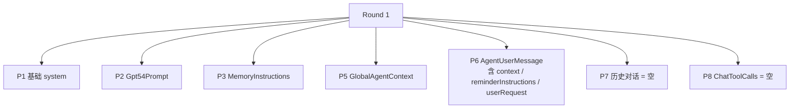

也就是说，本案第一轮没有“前面对话历史”，也没有“已执行工具结果”。模型第一次看到的核心信息主要就五块：

1. 一组 system 规则
2. 一组 `gpt-5.4` 专属 agent 规则
3. 一组 memory 使用规则
4. 一组全局环境 / workspace 信息
5. 一条带 `<context>`、`<reminderInstructions>`、`<userRequest>` 的当前轮用户消息

因此第一轮会选择 `run_in_terminal(Get-Location)`，并不需要靠“之前聊天里提过目录”才能做出来；它只靠首轮 prompt 自己已经足够。

### 8.7 第二到第五轮为什么不是“历史越来越长”，而是“工具回放越来越长”

这是本案最关键的 prompt 结构结论。

`createPromptContext(...)` 在每轮都会把：

1. `history` 设成 `conversation.turns.slice(0, -1)`，也就是只拿当前 turn 之前的历史
2. `query` 继续指向当前 turn 的用户请求
3. `toolCallRounds` 和 `toolCallResults` 带上本 turn 已发生的工具调用

而本案例从头到尾都还停留在“同一个 turn 里循环调用模型和工具”，所以会出现一个非常反直觉但很重要的现象：

1. Round 2、Round 3、Round 4、Round 5 的 `history` 依然几乎是空的
2. 变化最大的不是 `AgentConversationHistory`
3. 真正不断增长的是 `ChatToolCalls`

换句话说，在这个 create-file 案例里，prompt 的主增量不是“把前一次 assistant 说过的话都塞进历史”，而是“把已经做过的工具调用和工具结果，以结构化回放的形式追加到本轮 prompt 尾部”。

### 8.8 为什么后续轮次能复用老片段，而不用每次完全重算

后续轮次的 prompt 不是从零重写，而是“稳定层复用 + 增量层追加”：

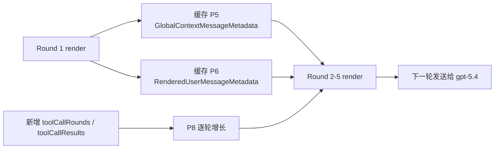

源码上，这个复用分两层：

1. `GlobalAgentContext` 会通过 `getOrCreateGlobalAgentContextContent(...)` 生成一次，然后把渲染后的结果保存到 `GlobalContextMessageMetadata`。只要 cache key 没变，后续轮次直接复用。
2. `AgentUserMessage` 在第一轮 render 完之后，`agentIntent.ts` 会把最后一个 user message 存进 `RenderedUserMessageMetadata`。之后 `AgentUserMessage.render(...)` 会优先走 `FrozenContentUserMessage`，不再重新拼一遍同样的 `<context> + <reminderInstructions> + <userRequest>`。

但这里必须立刻澄清一件很容易混淆的事：这里说的“复用”，首先是扩展端和 prompt 组装层的复用，不等于“第二轮到第五轮完全不把这些内容发给模型，只靠模型内部 KV cache 记着”。

### 8.9 `history` 很空，不等于模型什么都没收到

你如果把问题说得更尖锐一点，其实是在问：

1. Round 2 到 Round 5 既然 `history` 几乎为空
2. 那 `gpt-5.4` 凭什么还知道前面已经看过 system prompt、workspace 信息、用户请求、上一轮工具结果
3. 它到底靠的是本地对象缓存、服务端会话状态，还是模型内部 KV cache

源码给出的答案是：这三层都可能参与，但它们不是一回事，而且优先级是有先后的。

### 8.10 第一层：信息首先保存在扩展自己的状态里

最基础的一层，不在模型里，而在 Agent 自己的运行态里。

在 [../../src/extension/intents/node/toolCallingLoop.ts](../../src/extension/intents/node/toolCallingLoop.ts) 里，每一轮都会重新构造 `IBuildPromptContext`，里面带着：

1. `query`
2. `toolCallRounds`
3. `toolCallResults`
4. `conversation`
5. 各类 request / tools / variables

也就是说，对 Agent 来说，“前面发生过什么”首先不是靠模型替它记，而是靠扩展进程里的这些对象记。

换句话说：

1. `history` 为空，只表示“前几个 loop 还没有沉淀成独立 turn 历史”
2. 不表示“Agent 自己忘了前面发生过什么”
3. 真正的当前 turn 状态，主要保存在 `toolCallRounds`、`toolCallResults`、turn metadata 这些结构里

### 8.11 第二层：语义上仍然是“每轮重新发 prompt”，不是裸用 KV cache

从 prompt 构建链路看，Round 2 到 Round 5 并不是向模型只发一句“请继续”。

真实过程是：

1. `buildPrompt2(...)` 每轮都会重新调用 `buildPrompt(...)`
2. `buildPrompt(...)` 每轮都会重新 render `AgentPrompt`
3. `AgentPrompt` 每轮都会重新产出 `messages[]`
4. 然后这些 `messages[]` 再送到 endpoint 去发请求

所以从语义层说，模型每一轮看到的仍然是一份完整的“当前有效上下文”。

只是这份“完整上下文”在本案里不是靠 `history` 增长，而是靠下面两种方式维持：

1. 稳定前缀 `P1-P6` 继续作为 prompt 的前半段存在
2. 当前 turn 的新增状态通过 `P8 = ChatToolCalls` 结构化追加

因此更准确的说法不是：

1. 第二轮以后不再把前文发给模型

而是：

1. 第二轮以后，不再依赖 `AgentConversationHistory` 这一路来承载前文
2. 但 prompt 本身仍然会把“当前仍然有效的前文”重新组织后发出去

### 8.12 第三层：有“缓存优化”，但那不等于 Transformer 的原生 KV cache

这里最容易混的就是三个词：

1. 扩展端的 frozen content / metadata 复用
2. 提供方 API 的 prompt caching / stateful continuation
3. 模型推理时那种底层 Transformer KV cache

这三者不是同一个东西。

#### 8.12.1 扩展端 frozen content

`GlobalContextMessageMetadata` 和 `RenderedUserMessageMetadata` 的作用，是让扩展端别每轮都重新“语义生成”同样的 TSX 片段。

它解决的是：

1. prompt 组装重复劳动
2. 保证前面已经渲染好的 user message 不会被后续 agent 行为污染

它不等于：

1. 模型服务器一直保留上一轮的激活值

#### 8.12.2 cache breakpoint / prompt cache

[../../src/extension/intents/node/cacheBreakpoints.ts](../../src/extension/intents/node/cacheBreakpoints.ts) 写得很直白：在 agentic loop 中，每次请求都会尝试让“前一轮稳定不变的前缀”命中 cache，尤其是：

1. 当前 user message
2. 上一轮最后一个 tool result
3. 部分 system / custom instruction 前缀

这说明设计者明确预期：

1. 后续轮次仍然会把这些消息放进请求
2. 只是希望底层 provider 能对这些稳定前缀做 prompt cache 命中，减少重复计算

这是一种“请求级前缀缓存”优化，不是用户通常说的“同一次前向传播里模型把 KV 一直留在显存里”。

#### 8.12.3 Responses API 的 stateful continuation

对 OpenAI Responses 这条链路，代码还支持一种比普通 prompt cache 更强的机制：`statefulMarker -> previous_response_id`。

链路是这样的：

1. `toolCallingLoop.ts` 在接收模型流式返回时，如果 `delta.statefulMarker` 存在，就把它记到本轮 `ToolCallRound`。
2. [../../src/extension/prompts/node/panel/toolCalling.tsx](../../src/extension/prompts/node/panel/toolCalling.tsx) 渲染 `ChatToolCalls` 时，会把这个 marker 作为 `StatefulMarkerContainer` 塞回 assistant message。
3. [../../src/platform/endpoint/node/responsesApi.ts](../../src/platform/endpoint/node/responsesApi.ts) 在 `rawMessagesToResponseAPI(...)` 里会扫描这些 marker；如果找到匹配当前 model 的 marker，就提取成 `previous_response_id`，并把 marker 之前那段消息裁掉。
4. [../../src/platform/endpoint/common/statefulMarkerContainer.tsx](../../src/platform/endpoint/common/statefulMarkerContainer.tsx) 也直接说明了它就是“stateful marker that can be stored in raw chat messages”。

这说明在支持 Responses API 的情况下，后续轮次确实可能不必把全部旧消息原样再发一次，而是把“上一次响应的服务端句柄”带回去，让服务端接着那个 response state 继续。

但即便如此，它也更接近：

1. API 级 continuation state
2. provider 管理的会话状态引用

而不是：

1. 你可以简单想成“同一份 Transformer KV cache 从第一轮一直裸延续到第五轮”

因为从客户端代码视角，它仍然是在发新请求；只是新请求里可能带了 `previous_response_id` 这种状态句柄。

### 8.13 回到本案例，最稳妥的理解是什么

因此，对这次 create-file 的 5 轮调用，最稳妥的结论应该分三层说：

1. 语义正确性层面：不是靠模型自己凭空记忆。扩展端每轮都会重建 prompt，并把当前有效上下文重新送进请求。
2. 客户端实现层面：稳定片段主要保存在 `GlobalContextMessageMetadata`、`RenderedUserMessageMetadata`、`toolCallRounds`、`toolCallResults` 这些结构里。
3. 服务端性能优化层面：可能再叠加 `cacheBreakpoint`、`prompt_cache_key`，以及在 Responses API 场景下的 `previous_response_id` / `statefulMarker`。

所以如果只回答你那句“是不是 KV cache”，最严谨的回答是：

1. 不能简单说“是”
2. 也不能简单说“完全不是”
3. 更准确地说是：业务语义靠客户端重建和重发 prompt 保证，性能优化可能再利用 provider 侧的 prompt cache 或 stateful continuation；这和教科书里单次推理过程的底层 KV cache 不是同一个抽象层。

因此对这次 5 轮调用来说，最贴近真实情况的理解不是：

1. 每轮都重新现写一份完整 prompt

而是：

1. 稳定底座 `P1-P6` 大体保持不变
2. `P5` 和 `P6` 尽量走缓存/冻结内容
3. 唯一明显增长的是 `P8`，也就是：
4. Round 2 看到 `run_in_terminal` 结果
5. Round 3 再多看到 `create_file` 错误
6. Round 4 再多看到 `read_file` 返回 `dummy`
7. Round 5 再多看到 `apply_patch` 成功

这也是为什么你在日志上会感觉它像一个小型状态机，而不是五次彼此独立的大模型问答。

### 8.14 用这次真实导出，把第 1 到第 5 轮 prompt 并排摊开

如果只看这次导出的 [please_create_a_file___a_txt_with_content_abc_logs.chatreplay.json](./please_create_a_file___a_txt_with_content_abc_logs.chatreplay.json)，最有价值的不是把超长 prompt 全文抄出来，而是把每轮“模型可见上下文”的骨架并排对比。

下面这张表故意只保留四类内容：

1. 稳定前缀
2. 当前轮之前已经发生的 assistant/tool 回放
3. 新增的那一轮增量
4. 能证明“并非毫无优化地重算”的痕迹

表中省略号 `...` 表示中间有大量未变内容被省略。

另外，这里补一列 **provider 视角**。这一列不是直接从 `chatreplay.json` 抄出来的，因为导出文件展示的是“逻辑上的 requestMessages”；provider 真正收到的 Responses API body 需要再经过 [../../src/platform/endpoint/node/responsesApi.ts](../../src/platform/endpoint/node/responsesApi.ts) 的 `rawMessagesToResponseAPI(...)` 转换。也就是说：

1. 导出视角更接近“模型语义上等价看到了什么”
2. provider 视角更接近“线上的最终请求体长什么样”
3. `previous_response_id` 是 body 顶层字段，不是把一个 ID 文本块塞进 `input` 里面
4. 这批导出里还能看到两种不同外观的 provider 侧标识：
5. 一种是 replay 里的 `stateful_marker.value.marker`，长得像很长一串 opaque token
6. 另一种是 debug telemetry 里的 `gen_ai.response.id = 745fe291-e341-4dd4-8bc0-8a1872af5fca`，长得像 UUID
7. 从当前可见证据，不能简单把这两者当成同一个字段原样透传；所以表里会把“replay 可见 marker”与“telemetry 可见 response.id”分开写

| 轮次 | 导出快照里模型看到的主要 prompt 骨架 | provider 视角下更接近真实发送体的骨架 | provider 的本轮主要回复内容 | 相比上一轮新增了什么 | 这轮能看到的优化痕迹 | 应如何理解 |
| --- | --- | --- | --- | --- | --- | --- |
| Round 1 | `system: You are an expert AI programming assistant ... </instructions>` + `user(global): <environment_info>...<workspace_info>...<userMemory>...` + `user(current): <context>The current date is March 28, 2026...<reminderInstructions>...<userRequest>please create a file - a.txt with content abc</userRequest>` | `previous_response_id: <unset>` + `input: [system(...), user(global...), user(current...)]` | 回复文本：`I need the active directory first ...` + tool call `run_in_terminal`。Replay 里下一轮首次出现的返回 marker 是 `pOHJHhHgdAHV...P7OicvvADI`；telemetry 可见 `gen_ai.response.id = 745fe291-e341-4dd4-8bc0-8a1872af5fca` | 无 | 只有 `cacheType: "ephemeral"` 标记，尚未出现历史回放 | 首轮就是完整底座 prompt；provider 这边还没有可续接的 `previous_response_id` |
| Round 2 | 仍然有和 Round 1 基本相同的三段稳定前缀；其后追加 `assistant: [stateful_marker][thinking][phase] I need the active directory first ...` + `tool: C:\Users\lsheng2` | `previous_response_id: pOHJHhHgdAHV...P7OicvvADI` + `input: [function_call_output(call_id=run_in_terminal, output="C:\\Users\\lsheng2")]` | 回复文本：`I found the current directory and am creating a.txt there ...` + tool call `create_file`。Replay 里下一轮首次出现的返回 marker 是 `xwC2ngUkno5S...ZGYXE+IBUifByG`；telemetry 仍可见同一个 `gen_ai.response.id` UUID | 新增了上一轮 `run_in_terminal` 的 assistant 发言、tool call 和 tool result | 出现第一个 `stateful_marker`；从 debug log 看 `cache_read.input_tokens = 21760 / input_tokens = 21916` | 导出快照层像“前缀重复 + 追加终端结果”；但真正到 provider 时，更像“拿上一轮 marker 续接，再补这轮 tool output” |
| Round 3 | 仍然先出现同样的 system/global/current-user 三段前缀；后面依次有 `assistant(run_in_terminal)...` + `tool(C:\Users\lsheng2)` + `assistant(create_file)...` + `tool(ERROR: File already exists...)` | `previous_response_id: xwC2ngUkno5S...ZGYXE+IBUifByG` + `input: [function_call_output(call_id=create_file, output="ERROR: File already exists...")]` | 回复文本：`a.txt already exists, so I’m checking its current contents ...` + tool call `read_file`。Replay 里下一轮首次出现的返回 marker 是 `pNvJLZf6womY...CRqL4Vk003/Y`；telemetry 仍可见同一个 `gen_ai.response.id` UUID | 新增了 `create_file` 这轮 assistant/tool/error | 又出现新的 `stateful_marker`；`cache_read.input_tokens = 21888 / input_tokens = 22032` | 语义上模型继续看到了前两轮；但 wire-level 更接近“上一轮上下文句柄 + 这轮失败结果” |
| Round 4 | 同样的稳定前缀继续存在；后面依次回放 `run_in_terminal -> path`、`create_file -> error`，再追加 `assistant(read_file)...` + `tool(dummy)` | `previous_response_id: pNvJLZf6womY...CRqL4Vk003/Y` + `input: [function_call_output(call_id=read_file, output="dummy")]` | 回复文本：`I’m replacing the existing placeholder content ...` + tool call `apply_patch`。Replay 里下一轮首次出现的返回 marker 是 `AdH85KM02x7N...SVfepQyJ/AkOIoU`；telemetry 仍可见同一个 `gen_ai.response.id` UUID | 新增了 `read_file` 及其返回 `dummy` | 继续有 `stateful_marker`；`cache_read.input_tokens = 22016 / input_tokens = 22182` | provider 并不是每次都再吃一整段 system/global/current-user 文本；它更像在同一条 response 链上继续向前滚 |
| Round 5 | 稳定前缀照旧；后面回放 `run_in_terminal -> path`、`create_file -> error`、`read_file -> dummy`，再追加 `assistant(apply_patch)...` + `tool(success)`，随后模型输出 final answer | `previous_response_id: AdH85KM02x7N...SVfepQyJ/AkOIoU` + `input: [function_call_output(call_id=apply_patch, output="success")]` | 回复文本：`Created a.txt in the current PowerShell directory with content abc ...`。这轮之后没有 Round 6，所以本轮返回的 replay-visible marker 在当前导出里不可见；telemetry 仍可见 `gen_ai.response.id = 745fe291-e341-4dd4-8bc0-8a1872af5fca` | 新增了 `apply_patch` 成功这一轮 | 继续有 `stateful_marker`；`cache_read.input_tokens = 22144 / input_tokens = 22315` | 最后一轮从业务语义看拿到了完整闭环；从 provider 请求体看则像“延续上一个 response，再喂入最后一个工具成功结果” |

这里再强调一次：上表 provider 列里的 `previous_response_id`，在实现上是 body 顶层字段，不是把 ID 当文本塞进 `input`。`rawMessagesToResponseAPI(...)` 一旦识别出 marker，就会把 marker 所在 assistant message 之前的内容切掉，只保留后续增量消息。

另外，“本轮返回 marker”这一列的取值来自 **下一轮 requestMessages 里首次新增的 `stateful_marker`**。因此：

1. Round 1 返回的 marker，是 Round 2 请求里第一次出现的那一个
2. Round 2 返回的 marker，是 Round 3 请求里新增的那一个
3. 以此类推
4. Round 5 因为没有 Round 6，所以当前导出里看不到它返回的 replay-visible marker

如果把这三种“长相”直接摆在一起，本案大致是这样：

```json
// replay 里可见的 stateful_marker
{
    "type": "stateful_marker",
    "value": {
        "modelId": "gpt-5.4",
        "marker": "pOHJHhHgdAHVhp0cCqVLj46AvSD4TWGur3/BW...m4mXtk3Q0P7OicvvADI"
    }
}

// 下一轮真正发往 provider 的顶层字段
{
    "previous_response_id": "pOHJHhHgdAHVhp0cCqVLj46AvSD4TWGur3/BW...m4mXtk3Q0P7OicvvADI"
}

// debug telemetry 里可见的另一类高层 id
{
    "gen_ai.response.id": "745fe291-e341-4dd4-8bc0-8a1872af5fca"
}
```

#### 8.14.1 把这条续接链画成时序图

如果把“本轮 provider 回复了什么”“stateful_marker 落到哪里”“下一轮 previous_response_id 怎么带回去”这条链压成一张图，本案更接近下面这样：

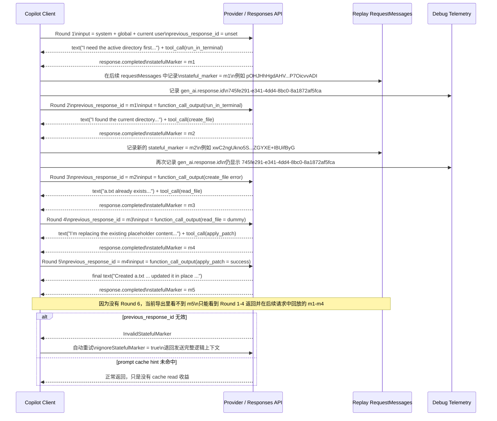

这张图里最容易记混的只有一点：

1. `m1/m2/m3/m4/m5` 对应的是 replay 可见的 `stateful_marker.value.marker` 这条链
2. `745fe291-e341-4dd4-8bc0-8a1872af5fca` 对应的是 debug telemetry 里可见的 `gen_ai.response.id`
3. 两者都和“续接”有关，但当前证据只能证明它们共存于同一轮链路，不能证明它们一定是同一个字段的原样暴露

#### 8.14.2 这三个名字不要混在一起

上面最容易绕晕人的地方，就是大家口头上都在说“response id”，但其实这里至少有三个不同层面的名字：

| 名字 | 出现位置 | 在本案例里长什么样 | 和下一轮续接的关系 |
| --- | --- | --- | --- |
| `stateful_marker.value.marker` | replay 导出里的 assistant content | 长 opaque token，例如 `pOHJHhHgdAHV...P7OicvvADI` | 这是当前最接近“下一轮要带回去”的那个值 |
| `previous_response_id` | 下一轮请求体顶层字段 | 不直接出现在 replay 导出里；根据组包逻辑，它会取上一轮 marker 的值 | 在客户端续接语义上，它和上一轮 marker 应视为同一个 continuation handle |
| `gen_ai.response.id` | debug telemetry / OTel span | 在本案例里是 UUID：`745fe291-e341-4dd4-8bc0-8a1872af5fca` | 它是另一类高层 response 标识；不能直接等同于 replay-visible marker |

所以如果把你的问题改写成严格一点的版本：

1. “上一轮 provider 回复出来的 marker，下一轮 agent 发给 provider 时，是否就作为 `previous_response_id` 回传？”
2. 对这个问题，答案应该是：**是，可以这样理解。**

但如果问题改写成：

1. “上一轮看到的 marker 和 telemetry 里的 `gen_ai.response.id` 是否其实就是同一个值？”
2. 对这个问题，答案应该是：**不能这样下结论。至少在本案例可见导出里，它们长得就不是同一个值。**

因此最安全的记法是：

1. `marker ~= 下一轮 previous_response_id`
2. `marker != 必然等于 telemetry 里的 response.id`
3. 只有在某些 provider / 某些直连路径里，provider-native `response.id` 和 continuation handle 才可能刚好重合

把这张表压成一句话就是：

1. 从导出快照看，Round 2 到 Round 5 都在继续带着前面有效上下文
2. 但从 token 计费和 stateful marker 看，它又绝不是“每轮原封不动、毫无优化地全量重算”

### 8.15 这次案例里，哪些内容看起来被“重复发送”，哪些内容看起来被“优化处理”

可以把这次 5 轮请求里的内容分成三层。

#### 第一层：导出快照里显式重复出现的内容

这一层最直观，在 [please_create_a_file___a_txt_with_content_abc_logs.chatreplay.json](./please_create_a_file___a_txt_with_content_abc_logs.chatreplay.json) 里肉眼就能看见：

1. 那段超长的 system prompt 在第 1 到第 5 轮都继续出现。
2. `user(global)` 里的 `<environment_info>...<workspace_info>...<userMemory>...` 在后几轮也继续出现。
3. `user(current)` 里的 `<context>...<reminderInstructions>...<userRequest>...` 在后几轮也继续出现。
4. 从第 2 轮开始，前面已经发生的 assistant/tool 回放会逐轮附加在后面。

所以如果你问“导出的 requestMessages 看起来是不是带着前文重复进入下一轮”，答案是：

1. 是

而且是非常明显地是。

#### 第二层：日志显示这些重复内容几乎都被 cache read 了

但如果只停在上一层，就会误以为 provider 每轮都把整份 prompt 从头重新编码一遍。这个结论和 debug log 对不上。

在 [agent-debug-log-fffe2648-51cb-4458-ab35-e593a94d6191.json](./agent-debug-log-fffe2648-51cb-4458-ab35-e593a94d6191.json) 里，5 轮 `panel/editAgent` 的关键指标是：

| 轮次 | `input_tokens` | `cache_read.input_tokens` | `input - cache_read` | `output_tokens` | 该怎么读 |
| --- | --- | --- | --- | --- | --- |
| Round 1 | 21549 | 4608 | 16941 | 348 | 首轮已有部分 cache read，但还没形成完整续接链；真正“未命中缓存、需要新处理”的输入仍然很大 |
| Round 2 | 21916 | 21760 | 156 | 78 | 从这里开始，几乎整份逻辑输入都已经能从缓存/续接链里读回，新增处理量只剩很薄一层 |
| Round 3 | 22032 | 21888 | 144 | 138 | 仍然是“少量新增 + 大量 cache read” |
| Round 4 | 22182 | 22016 | 166 | 105 | 同上 |
| Round 5 | 22315 | 22144 | 171 | 144 | 同上 |

这张表最好按下面这个口径读，不然很容易误解：

1. 这些数字不是 extension 自己从请求 JSON 里数出来的，而是 provider 返回、再被 telemetry 记录下来的 usage 指标。也就是说，`gen_ai.usage.input_tokens`、`gen_ai.usage.cache_read.input_tokens`、`gen_ai.usage.output_tokens` 都是 provider 口径，不是本地把 request body 重新 tokenize 的结果。
2. `input_tokens` 表示“这一轮在 provider 看来，参与本次推理的总输入 token”。它是逻辑总量，不等于“HTTP 请求体这次真的原样传了多少 token”。
3. `cache_read.input_tokens` 是 `input_tokens` 的一个子集，表示这些输入 token 虽然逻辑上仍属于本轮上下文，但 provider 认为它们可以直接从缓存/前态里读回，而不是重新做完整前缀处理。
4. `input_tokens - cache_read.input_tokens` 才更接近“这一轮真正新增、需要 provider 重新处理的那点输入”。本案第 2 到第 5 轮，这个数只剩 `156 / 144 / 166 / 171`，已经非常接近“上一轮 continuation 之上，再补一点新的 tool result / wrapper 文本”。
5. `output_tokens` 则是 provider 在这一轮实际生成出来的回答 token 数，和输入缓存命中不是一回事。

换句话说，Round 2 之后看到的不是“provider 每轮只看到了 156 个 token”，而更像是：

1. provider 在逻辑上仍然知道整段大约 22k token 的上下文
2. 但其中绝大多数已经被它当成可复用前缀或可续接状态，不需要再完整重算
3. 真正新喂进去、需要重新参与编码/推理准备的，只是最后那一小截增量

所以如果把问题拆成两层：

1. “这轮请求 wire-level 发过去的 body 会不会因为 `previous_response_id` 变短？”
答案是：大概率会。因为从源码和日志看，Round 2 以后请求更像 `previous_response_id + function_call_output(...)`，而不是每轮把完整 system/global/current-user/tool replay 原样重发一遍。
2. “那为什么 telemetry 里的 `input_tokens` 没有一起掉到一两百？”
答案是：因为这个字段更像 provider 侧的“逻辑输入总量”记账；有了 `previous_response_id` 之后，变化最明显的不是 `input_tokens` 本身骤降，而是 `cache_read.input_tokens` 几乎贴着它走，导致真正未缓存的增量只剩一百多。

因此，本案最合理的理解不是“provider 只看到了很少 token”，而是“provider 仍然基于完整上下文继续推理，但完整上下文里绝大部分是通过 cache read / stateful continuation 复用出来的”。

#### 第三层：Responses API 还额外做了 stateful continuation

这次案例还有一个比普通 prefix cache 更强的证据：`stateful_marker`。

在导出快照里，从第 2 轮开始，assistant 回放前面都会出现 `stateful_marker`；而在 debug log 里，还能看到另一类高层 telemetry id，5 轮的 `gen_ai.response.id` 都是同一个值：

`745fe291-e341-4dd4-8bc0-8a1872af5fca`

这里要特别补一句，避免把两者混为一谈：

1. replay 里看到的 `stateful_marker.value.marker`，长得像超长 opaque token
2. telemetry 里看到的 `gen_ai.response.id`，长得像 UUID
3. 在当前这批导出里，我们能确认两者都存在，但不能仅凭外观就断言它们是同一个字段的原样复制
4. 因此更稳妥的说法是：`previous_response_id` 至少与 replay-visible marker 处在同一条续接链上；而 telemetry 的 `response.id` 是另一组同时可见的 provider/网关侧高层标识

这和源码链路能正好扣上：

1. [../../src/extension/intents/node/toolCallingLoop.ts](../../src/extension/intents/node/toolCallingLoop.ts) 把流式返回里的 `delta.statefulMarker` 存到本轮 `ToolCallRound`。
2. [../../src/extension/prompts/node/panel/toolCalling.tsx](../../src/extension/prompts/node/panel/toolCalling.tsx) 再把它渲染回 assistant message。
3. [../../src/platform/endpoint/node/responsesApi.ts](../../src/platform/endpoint/node/responsesApi.ts) 在 `rawMessagesToResponseAPI(...)` 里扫描这些 marker，并把它们转成 `previous_response_id`；一旦转成功，就会把 marker 之前那段消息切掉。

也就是说，从“导出给人看的 prompt 快照”到“真正发给 Responses API 的请求体”之间，很可能还存在一步额外缩减：

1. 人类导出快照仍然展示完整逻辑上下文
2. 真正的 provider 请求则可能改写成：
3. `previous_response_id + 最近增量消息`

#### 8.15.1 `previous_response_id` 失效，和 prompt cache 不命中，不是一回事

这两个问题很容易混成一句“优化没命中怎么办”，但源码里其实是两套完全不同的行为。

第一种是 `previous_response_id` / `stateful marker` 这条续接链失效。

这时并不是“继续硬扛”，而是有明确回退逻辑：

1. [../../src/platform/endpoint/node/chatEndpoint.ts](../../src/platform/endpoint/node/chatEndpoint.ts) 里，如果 provider 返回 `InvalidStatefulMarker`，客户端会自动再发一次请求，并把 `ignoreStatefulMarker: true` 打开。
2. 这样第二次请求就不会再带那个失效的 `previous_response_id`，而是退回到“重新发送当前完整逻辑上下文”的路径。
3. [../../src/extension/byok/node/openAIEndpoint.ts](../../src/extension/byok/node/openAIEndpoint.ts) 还多做了一层保护：如果 `previous_response_id` 不是 OpenAI 原生 `resp_` 前缀，或者开启了 zero data retention，也会直接把这个字段清掉。

这里要特别注意一句措辞：**从这份代码能确认的是“客户端实现了自动 fallback / retry”**，而不是“某个通用协议强制规定收到无效 response id 后必须重发”。更接近事实的描述是：

1. provider / 网关侧先把这种失败归类成 `InvalidPreviousResponseId`
2. [../../src/extension/prompt/node/chatMLFetcher.ts](../../src/extension/prompt/node/chatMLFetcher.ts) 再把它翻译成客户端内部统一的 `ChatFetchResponseType.InvalidStatefulMarker`
3. 最后 [../../src/platform/endpoint/node/chatEndpoint.ts](../../src/platform/endpoint/node/chatEndpoint.ts) 看到这个类型，选择自动重发一次，并显式关闭 marker 续接

#### 8.15.1.1 把“正常续接”和“失效后重发”画成时序图

如果把这条逻辑按真正的发送/接收/重试路径压成一张图，更接近下面这样：

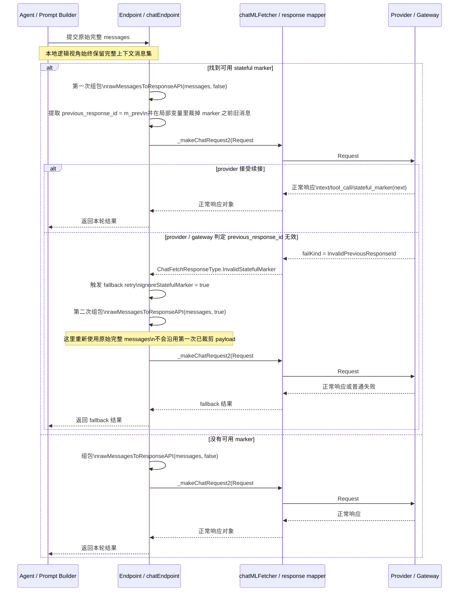

这张图想表达的核心只有三点：

1. Agent 侧每轮都会先重建“完整逻辑 prompt”，这是 prompt 层的真相。
2. 真正发给 provider 的 wire-level 请求，不一定等于那份完整 prompt；如果 marker 可用，发送出去的常常只是 `previous_response_id + 最近增量消息`。
3. “重发”不是默认每轮都会发生，而是只有当第一次续接请求先被 provider / gateway 判成 `InvalidPreviousResponseId`、再被 fetcher 映射成 `InvalidStatefulMarker` 时，Endpoint 才会显式发起第二次 fallback 请求。

这里还有一个很关键、但很容易误解的实现细节：fallback 并不是拿“第一次已经裁剪完的 payload”再发一遍，而是**重新从原始 `messages` 组包**。

1. [../../src/platform/endpoint/node/chatEndpoint.ts](../../src/platform/endpoint/node/chatEndpoint.ts) 的两次 `_makeChatRequest2(...)` 调用，传入的是同一份 `options`，只是第二次把 `ignoreStatefulMarker: true` 打开。
2. [../../src/platform/endpoint/node/responsesApi.ts](../../src/platform/endpoint/node/responsesApi.ts) 里的裁剪动作只是函数内部的局部变量重绑定：`messages = messages.slice(...)`。这会影响本次 request body 的构造结果，但不会反向修改外面的 `options.messages`。
3. 因此第二次 fallback 重试时，`rawMessagesToResponseAPI(...)` 会再次从原始完整消息集开始；由于这次 `ignoreStatefulMarker = true`，它不会再提取 `previous_response_id`，也就不会再走“裁掉 marker 之前旧消息”的分支。
4. 换句话说：第一次请求是“完整逻辑 prompt -> 裁剪成 continuation request”；第二次 fallback 请求则是“完整逻辑 prompt -> 不裁剪，直接发完整语义上下文”。

所以对第一种优化，更准确的说法是：

1. 它不是一个“可有可无的 cache hint”
2. 它是一个真正会影响请求体裁剪方式的续接句柄
3. 但一旦句柄无效，客户端有 fallback，会退回全量语义请求，而不是让整次 agent loop 直接失败

第二种是 prompt cache / cache hint 这条线。

这一条没有“命不中就报错”的语义。以 Anthropic Messages 路径为例：

1. [../../src/extension/intents/node/cacheBreakpoints.ts](../../src/extension/intents/node/cacheBreakpoints.ts) 只是给稳定位置打 `cache breakpoint`
2. [../../src/platform/endpoint/node/messagesApi.ts](../../src/platform/endpoint/node/messagesApi.ts) 只是把这些断点转成 `cache_control: { type: 'ephemeral' }`
3. 测试 [../../src/platform/endpoint/test/node/messagesApi.spec.ts](../../src/platform/endpoint/test/node/messagesApi.spec.ts) 也只验证“哪些块会被打上 `cache_control`”，没有任何“cache miss 要重试”的逻辑

所以对第二种优化，真实语义更像是：

1. 客户端告诉 provider：“这几段很稳定，值得你尝试复用”
2. provider 命中就省算力，不命中就当普通输入重新算
3. 请求本身不会因为 cache miss 而失败
4. 客户端通常也不需要为了 cache miss 再补发一次同样请求

也就是说：

1. `previous_response_id` 失效，更像“续接句柄坏了”，所以会触发 fallback / retry
2. prompt cache 不命中，更像“性能优化没赚到”，但业务语义仍然照常完成

#### 8.15.2 不同 provider 里，`response id` 和 `stateful_marker` 不是同一个概念

到这里可以下一个更一般化的结论：

1. `stateful_marker` 是 Copilot Chat 这一侧的**统一抽象**
2. `response id` 则往往是各家 provider / 网关 / SDK 自己暴露的**原生标识**
3. 两者在某些 provider 上可能几乎是一回事
4. 但跨 provider 绝不能假定“所有 response id 都等于可回传的 stateful_marker”

这个仓库里的实际实现更接近下面这张表：

| provider / 通道 | provider 原生返回的高层 id | `stateful_marker` 在这里意味着什么 | 下一轮怎么续接 | 是否需要特化处理 |
| --- | --- | --- | --- | --- |
| OpenAI / Responses API | `response.id` | 这里两者最接近。`responsesApi.ts` 在 `response.completed` 时把 `chunk.response.id` 作为 `statefulMarker` 抛回上层 | 下一轮通过顶层 `previous_response_id` 回传，同步裁掉 marker 之前的旧消息 | 需要。要走 `previous_response_id`，且要处理 `InvalidStatefulMarker` fallback |
| OpenAI-compatible 但不是 Responses API | 常见是普通 completion/chat id | 通常没有同等强度的 provider-native continuation 语义 | 不走 `previous_response_id` 这套；更多还是普通历史重发或其他机制 | 需要。不能把普通 response id 直接当 stateful continuation 句柄 |
| Anthropic / Messages API | 有 request / response 级 id，可进 telemetry | 在本仓库里 **不是** provider-native continuation 句柄。Anthropic 转换器会跳过 `StatefulMarker` data part | 主要靠 `cache_control` / prompt caching，不靠 `previous_response_id` | 需要。Anthropic 走 cache_control 语义，不走 OpenAI 的 previous_response_id |
| Gemini native | 有 request / response 级 id，可进 telemetry | 在本仓库里 **不是** provider-native continuation 句柄。Gemini 转换器也会过滤掉 `StatefulMarker` data part | 主要靠 provider 自己的缓存统计 / 普通上下文重发，不走 OpenAI 的续接字段 | 需要。不能把 Gemini 的 response id 当成 OpenAI 式续接句柄 |
| VS Code Language Model API 封装层 | 取决于底层模型提供者 | 这里 `stateful_marker` 是一个通用 data part，可以被编码/解码/透传 | 只有底层 provider 真的理解这种 marker 时，它才有续接意义 | 需要。这里是统一接口层，不保证各 provider 语义相同 |

源码证据也刚好支持这个分层：

1. [../../src/platform/endpoint/node/responsesApi.ts](../../src/platform/endpoint/node/responsesApi.ts) 在 `response.completed` 时直接把 `chunk.response.id` 作为 `statefulMarker` 抛出，并在下次组包时写到 `previous_response_id`。
2. [../../src/extension/byok/common/anthropicMessageConverter.ts](../../src/extension/byok/common/anthropicMessageConverter.ts) 明确跳过 `CustomDataPartMimeTypes.StatefulMarker`，说明 Anthropic 路径不会把它当成 provider-native continuation 句柄发回去。
3. [../../src/extension/byok/common/geminiMessageConverter.ts](../../src/extension/byok/common/geminiMessageConverter.ts) 也会过滤掉 `StatefulMarker` 和 `CacheControl` data part，说明 Gemini 路径同样不是这套续接协议。
4. [../../src/platform/endpoint/vscode-node/extChatEndpoint.ts](../../src/platform/endpoint/vscode-node/extChatEndpoint.ts) 则说明 VS Code LM API 这一层只是把 marker 编码成通用 data part 透传，本身不定义底层 provider 一定要如何解释它。

所以如果把你的问题压成一句最稳妥的话：

1. 对 OpenAI Responses 这类 provider，`response id` 和 `stateful_marker` 可以非常接近，甚至在实现上直接互转
2. 对 Anthropic、Gemini 这类 provider，这两个概念通常就分开了：response id 还在，但 stateful continuation 不走同一套协议
3. 因此跨 provider 必须做不同处理，不能拿一套 `previous_response_id` 逻辑通吃所有 provider

#### 8.15.3 不同 provider 对 cache 的处理、计费、和底层原理

上面那张表主要回答“代码里怎么接”。如果把问题再推进一步，问“provider 凭什么拿一个 ID 或 cache handle 就能少算 token、少收费”，那就要把**产品层**和**推理层**分开。

先给一个总判断：

1. `previous_response_id` / `stateful_marker` 更像**会话续接句柄**，它解决的是“上一轮状态怎么引用”
2. prompt cache / context cache 更像**前缀复用机制**，它解决的是“哪些输入前缀不必重新完整 prefill”
3. 是否少收费，取决于 provider 是否把“缓存读”单独计费或打折，而不是单看有没有 ID
4. 从公开资料看，OpenAI 和 Anthropic 都明确把这件事和 **key/value tensors / KV cache representations** 联系起来；Gemini/Vertex 更强调“cached context / cached prefix”的产品抽象，没有在公开文档里把实现细节直接说成 KV cache

下面这张表把“仓库实现、provider 产品、公开计费、和对 KV cache 的可确认关系”并排放在一起：

| provider | 仓库里的接入方式 | 公开文档里的 cache / state 机制 | 收费与折扣 | 和 KV cache 的关系 | 对本仓库最重要的启发 |
| --- | --- | --- | --- | --- | --- |
| OpenAI Responses API | 走 `stateful_marker -> previous_response_id`，并可选 `prompt_cache_key` / `prompt_cache_retention` | `previous_response_id` 用来续接上一轮 response；另外还有自动 Prompt Caching，基于 exact prefix 命中；`prompt_cache_key` 用来改善路由和命中率 | 官方文档写明 Prompt Caching 可“up to 90%”降低输入成本、降低延迟；但 `previous_response_id` 场景下，官方又明确写了“all previous input tokens ... are billed as input tokens” | 公开文档明确说 In-memory retention 把 cached prefixes 保存在 volatile GPU memory；Extended retention 明确说会 offload key/value tensors 到 GPU-local storage | 不能把 `previous_response_id` 和“自动省钱”画等号。要分开看：续接链解决状态，Prompt Caching 才解决明显折扣 |
| Anthropic Messages API | 不走 `previous_response_id`；主要走 `cache_control` / prompt caching；转换器会过滤掉 `StatefulMarker` data part | Prompt caching 支持 automatic 和 explicit breakpoints；基于 prefix hash + lookback window 命中；缓存顺序是 `tools -> system -> messages` | 官方定价非常清楚：5 分钟 cache write = 基础输入价的 1.25x，1 小时 cache write = 2x，cache read = 0.1x；命中后显著更便宜 | 官方 Data retention 小节明确写了：KV cache representations 和 cryptographic hashes held in memory only；这是目前三家里最直接把它和 KV 表征联系起来的文档之一 | Anthropic 这条线的“省钱”非常产品化、显式，而且和断点位置强相关；不是拿某个 response id 去续接 |
| Gemini API / Vertex AI | 本仓库里 Gemini 路径过滤 `StatefulMarker`；主要依赖 provider 自己的 implicit / explicit context caching | Gemini API 和 Vertex AI 都区分 implicit caching 与 explicit caching；显式缓存通过 cache resource / cached content name 引用；隐式缓存按相似前缀自动命中 | Gemini API 文档写 implicit caching 没有 cost saving guarantee；Vertex AI 文档则写 implicit caching 默认开启且 cached tokens 有 90% discount，explicit caching 也提供 90% 或 75% 的 discount，并且 explicit cache 还有 storage costs | 公开文档没有像 OpenAI/Anthropic 那样直接把实现写成 KV tensors，但明确说 cached content is a prefix，模型对 cached tokens 和 regular input tokens 不做语义区分 | 对 Gemini/Vertex，应该把它理解成 provider-managed context cache。能确认“前缀被复用并打折”，但不宜在文档里强说“它一定就是裸 KV cache” |
| VS Code Language Model API 通道 | `StatefulMarker` 被编码为通用 data part 透传 | 这一层只是抽象传输层，本身不定义底层模型要不要支持 continuation 或 cache | 无统一计费语义，完全取决于底层 provider | 无法单独谈 KV cache；这里只是把 provider 能力映射成统一接口 | 在扩展实现层可以统一保存/回放 marker，但真正能否省钱、如何命中，仍然是 provider-specific |

这张表背后，和你问题最相关的三条官方信息是：

1. OpenAI 的 [Conversation state](https://developers.openai.com/api/docs/guides/conversation-state) 文档明确说：即使使用 `previous_response_id`，链上之前的 input tokens 仍然按 input tokens 计费。所以“拿一个 response ID 继续”不自动等于“Agent 就不用为前文付钱”。
2. OpenAI 的 [Prompt caching](https://developers.openai.com/api/docs/guides/prompt-caching) 文档又明确说：Prompt Caching 可以把输入成本最多降到原来的 10%，而且 Extended retention 直接描述为把 key/value tensors 下沉到 GPU-local storage。这说明“是否便宜”主要取决于 prompt cache，而不是单纯的 response continuation。
3. Anthropic 的 [Prompt caching](https://platform.claude.com/docs/en/docs/build-with-claude/prompt-caching) 文档更直接：cache read 就是基础输入价的 0.1x，同时还写明保存的是 KV cache representations 和 cryptographic hashes。也就是说，Anthropic 公开承认它的产品级 prompt cache 和底层 KV 表征有直接关系。

如果把“provider 凭什么拿这个 ID / handle 就可以少算 token”翻译成工程语言，更接近下面这几个层次：

1. 不是“看到一个 ID，模型就神奇地不用算了”
2. 而是 provider 先用这个 ID 或 prefix-hash 去定位之前已经建立好的会话状态或缓存前缀
3. 如果命中，就不必把那一大段前缀重新做完整 prefill
4. 如果 provider 的计费系统把这部分记为 cached read，而不是 fresh input，那用户账单就会更便宜

但这里还有一个很重要的边界：

1. “provider 内部省算力” 不必然等于 “用户一定少付钱”
2. OpenAI 的 `previous_response_id` 就是一个现成例子：它显然帮助状态续接和低延迟，但官方又说此前输入仍计为 input tokens
3. 相反，Anthropic / Gemini / Vertex 的 prompt/context caching 文档则明确给了折扣模型，所以这些场景更接近“provider 省了算力，也把其中一部分好处让利给用户”

因此，关于“是不是和 LLM 的 KV cache 有直接关系”，最稳妥的回答是：

1. 对 OpenAI Prompt Caching 和 Anthropic Prompt Caching，可以说有直接关系，因为官方文档已经明确提到 key/value tensors 或 KV cache representations
2. 对 Gemini / Vertex context caching，只能说高度像一种 provider-managed prefix cache，公开文档没有把底层实现完全展开成 KV cache 细节
3. 对 `previous_response_id` 这种 response continuation 句柄，则更像“会话状态引用接口”；它可能借助底层缓存结构实现，但在产品语义上不等于“KV cache 折扣计费”本身

### 8.16 这次案例到底有没有发生“压缩历史”

如果这里的“压缩历史”指的是：

1. 因为 token 超限而触发 summarization / compaction，把前文改写成摘要

那么本案里没有看到直接证据。

原因有三条：

1. 输入 token 一直在 `21.5k -> 22.3k` 这个区间，只是小幅增长，没有出现逼近上限后骤降的形状。
2. 日志里没有出现“Compacted conversation”之类前台进度，也没有看到本案相关的超限回退痕迹。
3. 本案真正明显的优化痕迹是 `cache_read.input_tokens` 和 `stateful_marker`，不是摘要压缩后的新文本块。

所以更接近真实情况的说法不是：

1. 这 5 轮靠摘要把历史压短了

而是：

1. 这 5 轮在导出视角下仍然保留了完整逻辑上下文
2. 在 provider 视角下，则主要靠 cache read 和 `previous_response_id` 做优化

### 8.17 这次案例的“最像真相”的一句话结论

如果非要把这次日志压成一句最实用的话，我会这样说：

1. 第 2 到第 5 轮从导出快照上看，确实都继续带着前面有效 prompt 和前面工具回放
2. 但它们并不是“原封不动地每轮全量重算”
3. 实际优化逻辑主要有两层：
4. 第一层是稳定前缀命中 prompt cache，证据是 `cache_read.input_tokens` 在第 2 轮以后几乎贴着总输入 token 走
5. 第二层是 Responses API 的 `stateful_marker -> previous_response_id` 续接机制，证据是导出里连续出现 marker，且 5 轮共用同一个 `gen_ai.response.id`

所以对这次具体案例，最精确的表述应该是：

1. 逻辑语义上，前文一直都在
2. 导出快照上，前文看起来也确实被继续带入
3. 但 provider 侧很大概率已经把这些稳定前文转成“缓存读取 + 会话续接”，而不是每轮都把全部旧文本重新当新文本算一遍

---

## 9. 后台 sidecar 请求：哪些该算主流程，哪些不该

这次目录里除了主链证据，还多了几类小文件。如果不分层，很容易把它们误当成主循环步骤。

### 9.1 `title_*.copilotmd`

[title_b1faca75.copilotmd](./title_b1faca75.copilotmd) 对应的是 chat 标题生成。

源码在 [../../src/extension/prompt/node/title.ts](../../src/extension/prompt/node/title.ts) 和 [../../src/extension/prompts/node/panel/title.tsx](../../src/extension/prompts/node/panel/title.tsx)。

它会：

1. 取第一条用户请求
2. 用 `copilot-fast`
3. 生成一个简短标题

而 `copilot-fast` 在源码里别名到 `gpt-4o-mini`，所以导出里看到的 helper model 与源码是吻合的。

### 9.2 `progressMessages_*.copilotmd`

这组文件的 prompt 文本要求“generate exactly N unique progress messages”。

源码可对应到 [../../src/extension/inlineChat/node/progressMessages.ts](../../src/extension/inlineChat/node/progressMessages.ts) 与 [../../src/extension/prompts/node/inline/progressMessages.tsx](../../src/extension/prompts/node/inline/progressMessages.tsx)。

关键点是：

1. 这套实现属于 inline chat / editor progress message 体系
2. 它们确实是合法的 helper 请求
3. 但它们不应被视为“创建 a.txt”主链上的关键业务步骤

新补充的 [GitHub Copilot Chat.log](./GitHub%20Copilot%20Chat.log) 还把它们的顺序钉得更明确：两次 `progressMessages` 都发生在第一条 `panel/editAgent` 之前，所以更适合把它们理解为前台渲染/等待体验的后台预热，而不是主链中间插进去的推理步骤。

换句话说，它们更像舞台背后的字幕组，不是前台搬道具的工人。

### 9.3 `copilotLanguageModelWrapper_*.copilotmd`

这组文件能在 [../../src/extension/conversation/vscode-node/languageModelAccess.ts](../../src/extension/conversation/vscode-node/languageModelAccess.ts) 中找到 `debugName: 'copilotLanguageModelWrapper'` 的源码对应。

但本案里它们都返回了：

`Sorry, I can't assist with that.`

因此本报告把它们归类为：

1. 被导出器一并打包的旁路 helper span
2. 与主工具循环并不形成稳定因果链
3. 可以记录，但不应过度解读

这点也被 [GitHub Copilot Chat.log](./GitHub%20Copilot%20Chat.log) 校对了一次：它显示 `a44706d8` 出现在第二条 `panel/editAgent` 之后、`d087cabb` 出现在第四条 `panel/editAgent` 之后，时间上更像穿插的旁路 summarizer，而不是替代主模型决策的分支。

---

## 10. 一张“前台 / 后台”分层图

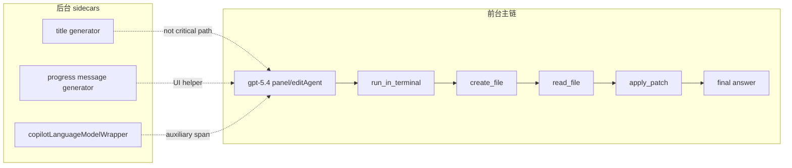

---

## 11. 导出物和源码，哪些地方能一一对上，哪些不能

### 11.1 能直接对上的

1. 4 次工具调用顺序
2. 每次工具输入参数
3. `create_file` 的失败原因
4. `read_file` 返回 `dummy`
5. `apply_patch` 的实际 patch 内容
6. 最终总结文本
7. title helper 的 prompt 和 model

### 11.2 需要靠源码反推的

1. 3 次 approval 的精确 UI 文案
2. approval 被接受后如何在下一轮回灌
3. sidecar spans 到 UI 中间态文案的逐字映射

这里有一个重要事实：

1. `please_create_a_file___a_txt_with_content_abc_logs.chatreplay.json` 里能看到多轮 request/response
2. 但 approval 的包体没有像工具调用那样完整裸露出来
3. 新补充的 [GitHub Copilot Chat.log](./GitHub%20Copilot%20Chat.log) 也没有把 approval 的 payload 或按钮文案直接打出来
4. 所以 approval 分析必须借助源码，而不能假装“是从 replay 或 extension log 直接读出来的”

### 11.3 approval 如何回灌下一轮

源码层面，这条链是存在的：

1. `ChatResponseStream.confirmation(...)` 会推送 `ChatResponseConfirmationPart`
2. `defaultIntentRequestHandler` 会在下一轮检查 `acceptedConfirmationData / rejectedConfirmationData`
3. `Turn.fromRequest(...)` 也会把这些确认数据挂到 turn 上

所以 approval 在协议层并不是“弹窗完就没了”，而是会变成下一轮请求的一部分上下文状态。

---

## 12. 从架构角度看，这个案例真正说明了什么

这个案例最有价值的地方，不是“Copilot 会创建文件”，而是它暴露了 Agent 主链的三个真实特征：

### 12.1 特征一：目标导向，而不是工具导向

用户目标是：

`让 a.txt 的内容最终变成 abc`

模型最初选择 `create_file`，只是它当下认为最便宜的实现路径。一旦工具结果表明这条路不通，它会立刻改走另一条仍能达成用户目标的路径。

### 12.2 特征二：每一轮都在吃“上一轮真实世界反馈”

这不是纯 prompt chaining，而是有外部世界反馈的闭环：

1. 终端给出目录
2. 文件系统给出“已存在”错误
3. 文件内容给出 `dummy`
4. 补丁执行层给出成功

每个反馈都像一张盖章回执，推动下一轮更贴近真实环境。

### 12.3 特征三：安全门插在工具层，不插在最终回答层

approval 不是在模型说话时弹，而是在具体工具准备执行时弹。

这意味着系统的安全模型不是：

1. 先相信模型
2. 再事后审计

而是：

1. 模型先提执行建议
2. 工具层检查资源类型与范围
3. 需要时让用户在关键门口签字
4. 通过后才允许真正触碰外部资源

这正是 Agent 模式比普通聊天更像“受控自动化”的地方。

---

## 13. 最后压缩成一段话

这次 `please create a file - a.txt with content abc` 看起来像一句很简单的话，底层却是一条典型的 Agent 闭环：`gpt-5.4` 先通过 terminal 确认活动目录，再尝试用 `create_file` 走最短路径；工具返回“文件已存在”后，下一轮模型马上转为读取现有内容；拿到 `dummy` 后，又用 `apply_patch` 精确把旧内容改成 `abc`；而因为整个目标路径都落在当前 workspace 外的 `C:\Users\lsheng2`，所以 `create_file`、`read_file`、`apply_patch` 三个外部文件访问分别触发了 approval。真正值得记住的不是“它创建了一个文件”，而是：这个系统会把用户目标、工具语义、外部世界反馈和权限门控四层同时织在一起，形成一个能自我修正、但仍受用户控制的工具循环。
