# Agent Mode 大代码库 Q&A 专题：通用机制与案例复盘

这个文件把原 [agent-mode-execution-design-part2.md](./agent-mode-execution-design-part2.md) 中与“大代码库 codebase Q&A”直接相关的内容单独抽出，作为一个专题文档维护。

这份报告现在明确拆成两部分：

1. 前半部分是**通用部分**，专门解释 Agent Mode 在大代码库 Q&A 中一般如何做搜索、检索增强、子代理委派、prompt augmentation 和 observability。
2. 后半部分是**案例部分**，专门复盘当前目录里这次 long-run execution 问题的真实 trajectory，解释它实际上用了哪些工具、走了多少轮、如何一步步收敛。

因此，这份文档的目标不再是“以当前案例为中心带出全部结论”，而是：

1. 先把通用 codebase Q&A 机制讲清楚。
2. 再把当前样本放到固定的偏后位置，作为一个可交叉验证的具体实例。

如果你只关心这一类问题，而不关心更广义的 Agent Mode 运行时控制协议，这个文件仍然是更合适的入口。

> 阅读方式：第 1 到 16 节回答“系统一般如何做大代码库 Q&A”；第 17 节之后回答“这次样本实际上怎么跑”。当前样本的 log 和 trajectory 可以为通用结论提供侧证，但不应直接替代通用描述本身。

---

## 第一部分：通用机制

## 1. 先给结论：大代码库 Q&A 不是单一 RAG，而是“多工具检索 + 多轮推理 + 可选子代理委派”的混合系统

把这类系统压成一句话：

> Copilot Chat Agent Mode 在大代码库 Q&A 中使用的不是单一 RAG，也不是单一文本搜索，而是由 prompt 和运行时共同约束的混合检索系统：高层概念可以走 `Codebase` / `semantic_search`，精确标识符可以走 `search_workspace_symbols`，精确关键词可以走 `grep_search`，广泛只读探索可以委托 `SearchSubagent`，最后再通过多轮 assistant turn 收敛成结构化解释。

从实现职责看，这个系统至少有四层：

1. 策略层：prompt 和 intent 共同告诉模型何时先搜、何时先读、何时应该继续收敛。
2. 工具层：`Codebase`、`FindTextInFiles`、`FindFiles`、`ReadFile`、`SearchWorkspaceSymbols`、`SearchSubagent` 分工不同。
3. 检索层：`Codebase` 背后不是单一检索器，而是 `WorkspaceChunkSearchService` 管理的混合 retrieval / rerank 体系。
4. 迭代层：主代理通常不会一次把事情做完，而是按轮次先定位、再验证、再收敛。

需要特别强调的是：这些都是**系统一般能力**，不等于任何一次具体样本都会把这些能力全部用一遍。

---

## 2. 主代理一般怎么决定先搜什么、再读什么

通用场景下，这类问题通常不是“某个函数怎么实现”，而是下面几类问题的组合：

1. 大代码库 codebase Q&A 的方法论是什么。
2. 具体用了哪些搜索工具。
3. 是否启用了 RAG、语义搜索、subagent 或 prompt augmentation。
4. prompt 和运行时是怎么把这些策略教给模型并约束它的。

所以主代理通常不会直接回答，而会先把问题拆成几个更小的研究子问题：

1. prompt 规则在哪里。
2. `SearchSubagent` 的边界在哪里。
3. `Codebase` 这一支的角色是什么。
4. `Codebase` 背后的 retrieval service 到底是单一还是混合。
5. 精确标识符与精确文本查找分别走哪条链。

对应的通用工具选择一般是：

1. 高层概念先 `Codebase` 或 `semantic_search`。
2. 固定关键词先 `grep_search`。
3. 明确文件再 `read_file`。
4. 已知函数、类型、类名时优先 `search_workspace_symbols`。
5. 搜索面过大时委托 `SearchSubagent`。

### 2.1 通用决策树

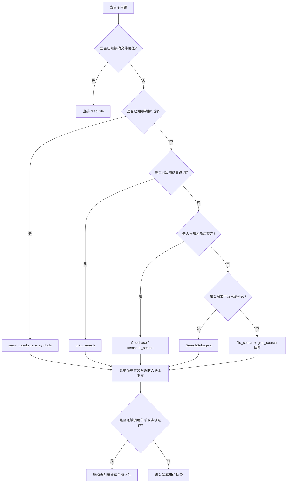
```mermaid
flowchart TD
    Q[当前子问题] --> A{是否已知精确文件路径?}
    A -->|是| R1[直接 read_file]
    A -->|否| B{是否已知精确标识符?}
    B -->|是| R2[search_workspace_symbols]
    B -->|否| C{是否已知精确关键词?}
    C -->|是| R3[grep_search]
    C -->|否| D{是否只知道高层概念?}
    D -->|是| R4[Codebase / semantic_search]
    D -->|否| E{是否需要广泛只读研究?}
    E -->|是| R5[SearchSubagent]
    E -->|否| R6[file_search + grep_search 试探]

    R2 --> F[读取命中定义附近的大块上下文]
    R3 --> F
    R4 --> F
    R5 --> F
    R6 --> F
    F --> G{是否还缺调用关系或实现边界?}
    G -->|是| H[继续查引用或读关键文件]
    G -->|否| I[进入答案组织阶段]
```

### 2.2 案例侧证

当前样本在这一节里不承担主叙事，只承担侧证角色。它说明两点：

1. 当语义搜索没有拿到有效结果时，主代理会自动退回到更确定性的 `grep_search + read_file` 路径。
2. 这说明上面的决策树不是“每次都走最复杂分支”，而是“按证据质量动态选择最稳妥的分支”。

---

## 3. 这到底算不算 RAG

严格说，`Codebase` 这条支路有很强的 RAG 气质，但整个 Agent Q&A 系统不等于 classic RAG。

原因是：

1. `Codebase` 会进入专门的 retrieval / prompt augmentation 链。
2. `CodebaseAgentPrompt` 明确要求它做“帮开发者找上下文”的工作，而不是直接生成最终答案。
3. `WorkspaceChunkSearchService` 内部同时准备了多类检索策略，而不是单一 embedding 最近邻。

当前相关组件至少包括：

1. `EmbeddingsChunkSearch`
2. `TfidfChunkSearch`
3. `TfIdfWithSemanticChunkSearch`
4. `CodeSearchChunkSearch`

因此更准确的术语是：

1. `Codebase` 是一个 RAG-like retrieval subsystem。
2. 整个大代码库 Q&A 是 tool-augmented iterative retrieval and reasoning。

### 3.1 混合检索结构图

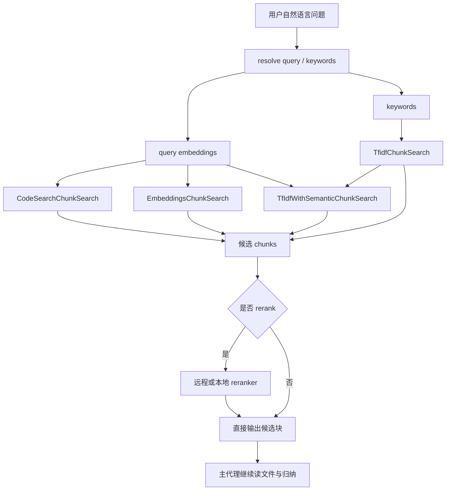
```mermaid
flowchart TD
    Q[用户自然语言问题] --> R[resolve query / keywords]
    R --> E[query embeddings]
    R --> K[keywords]

    E --> CS[CodeSearchChunkSearch]
    E --> ES[EmbeddingsChunkSearch]
    K --> TF[TfidfChunkSearch]
    E --> TS[TfIdfWithSemanticChunkSearch]
    TF --> TS

    ES --> M[候选 chunks]
    TF --> M
    TS --> M
    CS --> M

    M --> RR{是否 rerank}
    RR -->|是| R1[远程或本地 reranker]
    RR -->|否| O[直接输出候选块]
    R1 --> O
    O --> A[主代理继续读文件与归纳]
```

### 3.2 案例侧证

当前样本在这一节里同样只承担侧证角色。它提供的是边界信息，而不是主结论本身：

1. 系统整体具备 RAG-like 能力。
2. 但任何一次具体样本都可能只使用其中的局部能力。
3. 因此“系统能力”和“样本执行路径”必须分开叙述。

---

## 4. 逐轮 transcript 视角：主代理一般如何一步步收敛

从 transcript service 的事件模型来看，一次典型的大代码库 Q&A 会被拆成：

1. `session.start`
2. `user.message`
3. `assistant.turn_start`
4. `assistant.message`
5. `tool.execution_start`
6. `tool.execution_complete`
7. `assistant.turn_end`

这意味着系统不是“问一次、搜一次、答一次”，而是多轮闭环。

### 4.1 每轮一般在做什么

| 抽象轮次 | 主要目标 | 典型工具 | 产出 |
| --- | --- | --- | --- |
| Round 0 | 识别问题类型，确定搜索起点 | `Codebase`、`grep_search` | 候选模块列表 |
| Round 1 | 读 prompt / subagent / codebase 主入口 | `read_file` | 工具决策规则与边界 |
| Round 2 | 深挖底层检索系统 | `read_file`、`grep_search` | hybrid retrieval / rerank 证据 |
| Round 3 | 补齐精确标识符查找路径 | `search_workspace_symbols` 相关源码、`read_file` | 标识符搜索方法 |
| Round 4 | 停止继续搜并组织答案 | 无或很少工具 | 结构化解释 |

### 4.2 通用时序图

```mermaid
sequenceDiagram
    actor User
    participant Loop as ToolCallingLoop
    participant Transcript as SessionTranscriptService
    participant Model as LLM
    participant Tool as Search / Read Tools

    User->>Loop: 提问
    Loop->>Transcript: session.start
    Loop->>Transcript: user.message

    loop 每一轮
        Loop->>Transcript: assistant.turn_start
        Loop->>Model: buildPrompt + fetch
        Model-->>Loop: assistant text + tool calls
        Loop->>Transcript: assistant.message

        alt 有 tool calls
            loop 每个 tool call
                Loop->>Transcript: tool.execution_start
                Loop->>Tool: invoke
                Tool-->>Loop: result
                Loop->>Transcript: tool.execution_complete
            end
        else 无 tool calls
            Loop->>Loop: 判断是否停止或继续
        end

        Loop->>Transcript: assistant.turn_end
    end
```

### 4.3 案例侧证

当前样本在这一节里仍然只承担侧证角色。它交叉验证了这套通用框架里的两个关键点：

1. 主代理确实会多轮迭代，而不是一轮完成。
2. 当复杂分支没有被触发时，系统仍然能靠较保守的搜索工具完成收敛。

---

## 5. 报告结构：通用机制与案例复盘如何分开

为了避免把“当前样本实际发生了什么”和“系统一般还能支持什么”混成一团，这份报告从这里开始采取固定的分工：

1. 第 1 到 16 节只讲通用机制。
2. 这些通用机制可以引用当前样本的 log、trajectory、chatreplay 来做侧证。
3. 但这些侧证只负责证明“这种机制真实存在”或“这种路径真实可能发生”，不直接替代通用描述本身。
4. 第 17 节之后才单独进入案例复盘，按当前样本的真实 step 顺序讲它到底怎么跑。

换句话说，前半部分回答的是：

1. 系统一般如何对一个大代码库做问答和搜索。
2. 为什么 `Codebase`、`SearchSubagent`、`grep_search`、`search_workspace_symbols`、`read_file` 会分工存在。
3. 为什么 transcript、request logger、trajectory、OTel 需要联合阅读。

后半部分回答的是：

1. 这次 long-run execution 样本究竟用了哪些工具。
2. 它没触发哪些通用分支。
3. 它的真实轮次、真实顺序和真实收敛路径是什么。

也正因为如此，当前样本的内容应该固定放在偏后位置，而不是反向渗透到前半段通用描述里，造成读者把特例流程误当成系统默认流程。

---

## 6. `Codebase` 工具结果如何被注入主 prompt 和 metadata

`Codebase` 这条链的特殊之处在于：它不仅能像普通工具一样被调用，还能在 `buildPrompt()` 阶段被系统主动预取，然后注入 prompt augmentation 管道。

### 6.1 三个注入落点

`Codebase` 结果会同时进入：

1. references
2. `ChatVariablesCollection`
3. metadata（通过 `ToolResultMetadata` 和 `mergeMetadata(...)`）

所以它不是“只插入一段附件文本”，而是同时进入可渲染上下文层和运行时元数据层。

### 6.2 注入链路图

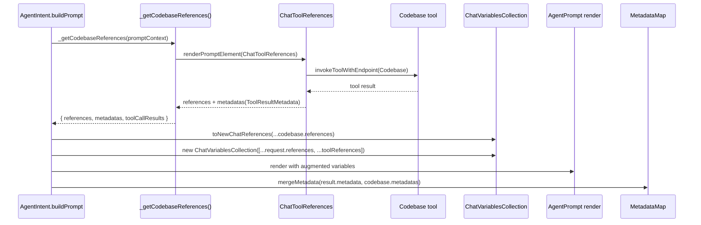
```mermaid
sequenceDiagram
        participant Agent as AgentIntent.buildPrompt
        participant Base as _getCodebaseReferences()
        participant ChatRefs as ChatToolReferences
        participant Codebase as Codebase tool
        participant Vars as ChatVariablesCollection
        participant Prompt as AgentPrompt render
        participant Meta as MetadataMap

        Agent->>Base: _getCodebaseReferences(promptContext)
        Base->>ChatRefs: renderPromptElement(ChatToolReferences)
        ChatRefs->>Codebase: invokeToolWithEndpoint(Codebase)
        Codebase-->>ChatRefs: tool result
        ChatRefs-->>Base: references + metadatas(ToolResultMetadata)
        Base-->>Agent: { references, metadatas, toolCallResults }

        Agent->>Vars: toNewChatReferences(...codebase.references)
        Agent->>Vars: new ChatVariablesCollection([...request.references, ...toolReferences])
        Agent->>Prompt: render with augmented variables
        Agent->>Meta: mergeMetadata(result.metadata, codebase.metadatas)
```

### 6.3 为什么主 prompt 会把 `Codebase` 从 `toolReferences` 中剔除

因为它的工作已经在 prompt build 阶段做完了。

系统会显式过滤掉 `ToolName.Codebase`，避免主 prompt 再把它当普通稳定工具引用继续暴露给模型，否则每轮都可能重复检索同样内容。

因此 `Codebase` 在这条路径里的语义，不是普通轮内 tool call，而是 prefetch + prompt injection。

---

## 7. `Codebase` 预取路径 vs 普通工具调用路径

这里最值得并排对照的是：普通工具调用路径是 model-driven invocation，而 `Codebase` 预取路径是 system-driven augmentation。

### 7.1 并排时序图

为了避免 VS Code Markdown preview 对复杂 `sequenceDiagram` 分段语法兼容不稳定，这里不用一张带 `rect rgb(...)` 分区的大图，而改成两张更稳的小图分别表示两条路径。

#### A. 普通工具调用路径

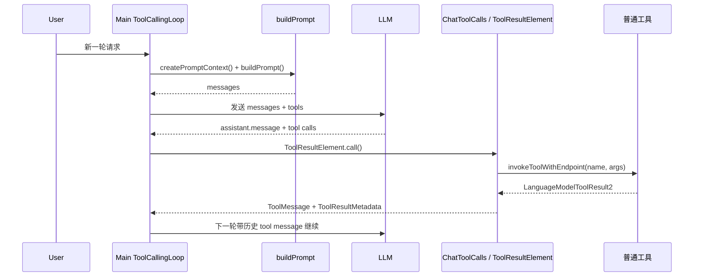
```mermaid
sequenceDiagram
    participant User
    participant MainLoop as Main ToolCallingLoop
    participant PromptBuilder as buildPrompt
    participant Model as LLM
    participant ToolBridge as ChatToolCalls / ToolResultElement
    participant GenericTool as 普通工具

    User->>MainLoop: 新一轮请求
    MainLoop->>PromptBuilder: createPromptContext() + buildPrompt()
    PromptBuilder-->>MainLoop: messages
    MainLoop->>Model: 发送 messages + tools
    Model-->>MainLoop: assistant.message + tool calls
    MainLoop->>ToolBridge: ToolResultElement.call()
    ToolBridge->>GenericTool: invokeToolWithEndpoint(name, args)
    GenericTool-->>ToolBridge: LanguageModelToolResult2
    ToolBridge-->>MainLoop: ToolMessage + ToolResultMetadata
    MainLoop->>Model: 下一轮带历史 tool message 继续
```

#### B. `Codebase` 预取路径

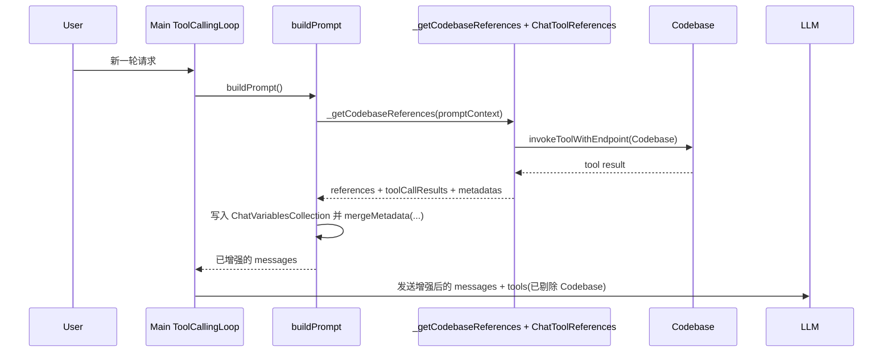
```mermaid
sequenceDiagram
    participant User
    participant MainLoop as Main ToolCallingLoop
    participant PromptBuilder as buildPrompt
    participant CodebaseRefs as _getCodebaseReferences + ChatToolReferences
    participant CodebaseTool as Codebase
    participant Model as LLM

    User->>MainLoop: 新一轮请求
    MainLoop->>PromptBuilder: buildPrompt()
    PromptBuilder->>CodebaseRefs: _getCodebaseReferences(promptContext)
    CodebaseRefs->>CodebaseTool: invokeToolWithEndpoint(Codebase)
    CodebaseTool-->>CodebaseRefs: tool result
    CodebaseRefs-->>PromptBuilder: references + toolCallResults + metadatas
    PromptBuilder->>PromptBuilder: 写入 ChatVariablesCollection 并 mergeMetadata(...)
    PromptBuilder-->>MainLoop: 已增强的 messages
    MainLoop->>Model: 发送增强后的 messages + tools(已剔除 Codebase)
```

### 7.2 对照表

| 对比维度 | 普通工具路径 | `Codebase` 预取路径 |
| --- | --- | --- |
| 触发点 | 模型响应中产生 `toolCalls` | `buildPrompt()` 主动调用 `_getCodebaseReferences()` |
| 结果进入 prompt 的形式 | 后续轮次的历史 `ToolMessage` | 本轮即刻注入 references / variables |
| metadata 落点 | `ToolResultMetadata` 跟随 `ToolMessage` | 通过 `mergeMetadata(...)` 并入最终 metadata |
| transcript 观感 | 明确能看到 tool execution 事件 | 更像 prompt augmentation |
| 控制权 | 模型先决定调不调用 | 系统先决定是否把结果注入本轮上下文 |

### 7.3 一句话总结

> 普通工具路径的核心是“模型先调用，系统再把结果写回历史”；`Codebase` 预取路径的核心是“系统先把检索结果注入 prompt，再让模型基于增强后的上下文继续推理”。

---

## 8. `SearchSubagent` 的 `toolMetadata(subAgentInvocationId)` 如何连到 trajectory / request logging

这个字段不是导出时顺带带上的说明，而是父工具调用、子代理 trajectory、debug log session 和 OTel trace 之间的显式连接键。

### 8.1 端到端链路图

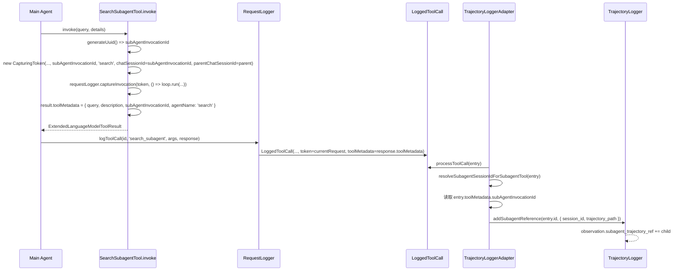
```mermaid
sequenceDiagram
        participant Main as Main Agent
        participant SSTool as SearchSubagentTool.invoke
        participant ReqLog as RequestLogger
        participant Logged as LoggedToolCall
        participant Adapter as TrajectoryLoggerAdapter
        participant Traj as TrajectoryLogger

        Main->>SSTool: invoke(query, details)
        SSTool->>SSTool: generateUuid() => subAgentInvocationId
        SSTool->>SSTool: new CapturingToken(..., subAgentInvocationId, 'search', chatSessionId=subAgentInvocationId, parentChatSessionId=parent)
        SSTool->>SSTool: requestLogger.captureInvocation(token, () => loop.run(...))
        SSTool->>SSTool: result.toolMetadata = { query, description, subAgentInvocationId, agentName: 'search' }
        SSTool-->>Main: ExtendedLanguageModelToolResult

        Main->>ReqLog: logToolCall(id, 'search_subagent', args, response)
        ReqLog->>Logged: LoggedToolCall(..., token=currentRequest, toolMetadata=response.toolMetadata)

        Adapter->>Logged: processToolCall(entry)
        Adapter->>Adapter: resolveSubagentSessionIdForSubagentTool(entry)
        Adapter->>Adapter: 读取 entry.toolMetadata.subAgentInvocationId
        Adapter->>Traj: addSubagentReference(entry.id, { session_id, trajectory_path })
        Traj-->>Traj: observation.subagent_trajectory_ref += child
```

### 8.2 关键点

1. `SearchSubagentTool` 会生成一个新的 `subAgentInvocationId`。
2. 同一个 ID 会被同时写入：
   - subagent loop options
   - `CapturingToken`
   - `ExtendedLanguageModelToolResult.toolMetadata`
3. request logger 会把 `response.toolMetadata` 保存在 `LoggedToolCall.toolMetadata`。
4. `TrajectoryLoggerAdapter` 会从这里读出 `subAgentInvocationId`，并生成 `subagent_trajectory_ref`。
5. OTel 还会用同一个 ID 连接父工具调用 span 与子代理 `invoke_agent` span。

### 8.3 职责对照表

| 组件 | 使用 `subAgentInvocationId` 的方式 | 主要职责 |
| --- | --- | --- |
| `SearchSubagentTool` | 生成 ID，写入 loop options、token、toolMetadata | 创建父子链路主键 |
| `CapturingToken` | 保存 session / parent session / debug label | 组织日志与会话归属 |
| request logger | 将 `response.toolMetadata` 写入 `LoggedToolCall` | 持久化工具级元数据 |
| trajectory adapter | 读取 `entry.toolMetadata.subAgentInvocationId` | 建立父工具调用到子 trajectory 的显式引用 |
| OTel tracing | 以 invocation ID 存取 trace context | 建立 execute_tool span 与 invoke_agent span 的父子关系 |

### 8.4 一句话总结

> `SearchSubagent` 返回的 `toolMetadata.subAgentInvocationId` 是一条运行时身份主键，而不是附属说明字段；request logger 负责把它保留下来，trajectory adapter 把它转成 `subagent_trajectory_ref`，OTel 则用它串起父工具 span 和子代理 span。

---

## 9. 总架构图：主代理、Codebase 预取、SearchSubagent、transcript、trajectory 如何合成一个系统

这一节对应后续方向 1：把前面分散讲的几条链，合成到同一张架构图里。

### 9.1 一张总图

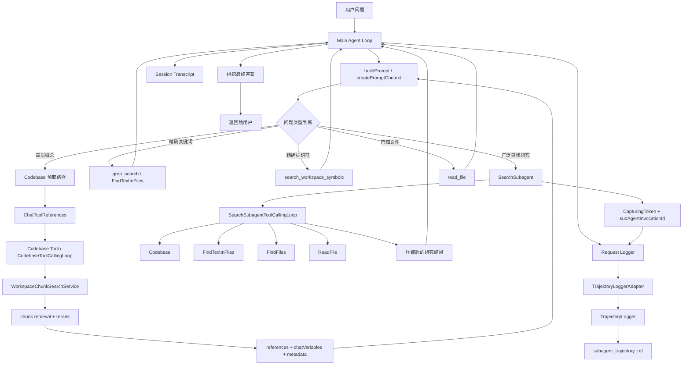
```mermaid
flowchart TD
    U[用户问题] --> M[Main Agent Loop]

    M --> P[buildPrompt / createPromptContext]
    P --> R{问题类型判断}

    R -->|高层概念| CBP[Codebase 预取路径]
    R -->|精确关键词| GT[grep_search / FindTextInFiles]
    R -->|精确标识符| SYM[search_workspace_symbols]
    R -->|广泛只读研究| SSA[SearchSubagent]
    R -->|已知文件| RF[read_file]

    CBP --> CTR[ChatToolReferences]
    CTR --> CBT[Codebase Tool / CodebaseToolCallingLoop]
    CBT --> WCS[WorkspaceChunkSearchService]
    WCS --> RR[chunk retrieval + rerank]
    RR --> AUG[references + chatVariables + metadata]
    AUG --> P

    SSA --> SUB[SearchSubagentToolCallingLoop]
    SUB --> S1[Codebase]
    SUB --> S2[FindTextInFiles]
    SUB --> S3[FindFiles]
    SUB --> S4[ReadFile]
    SUB --> SR[压缩后的研究结果]
    SR --> M

    GT --> M
    SYM --> M
    RF --> M

    M --> TX[Session Transcript]
    M --> RL[Request Logger]

    SSA --> TK[CapturingToken + subAgentInvocationId]
    TK --> RL
    RL --> TA[TrajectoryLoggerAdapter]
    TA --> TJ[TrajectoryLogger]
    TJ --> TR[subagent_trajectory_ref]

    M --> A[组织最终答案]
    A --> U2[返回给用户]
```

### 9.2 这张图最该记住的五个事实

1. 主代理不是直接面对整个代码库，而是先通过 prompt 决策选择检索路径。
2. `Codebase` 有两种面貌：既是工具，也是 prompt augmentation 管道的一部分。
3. `SearchSubagent` 不是普通并行搜索，而是一个被限制为只读研究的子 loop。
4. transcript 解决“过程可回放”，trajectory 解决“父子代理关系可结构化追踪”。
5. `subAgentInvocationId` 是把子代理日志、轨迹和 tracing 串起来的身份主键。

### 9.3 最短总结

> 从系统视角看，大代码库 Q&A 不是“找一个最强搜索器去搜”，而是“主代理用 prompt 决定检索路径，`Codebase` 提供预取式语义上下文增强，`SearchSubagent` 负责广泛只读研究，普通搜索工具补足精确查找，而 transcript / request logging / trajectory 再把整个过程记录成可解释、可追踪的执行链”。

---

## 10. `runSubagent` vs `search_subagent`：通用委派原语与专项研究 worker 的差别

这一节对应你刚才选的方向 1。

前面文档已经大量使用了 `SearchSubagent` 作为例子，但如果不把它和更底层的 `runSubagent` 分开，脑中还是会很容易混出一个模糊印象：

> 它们不都是“开一个子代理”吗？

答案是：**都属于“子代理”家族，但层级不同。**

1. `runSubagent` 更像底层通用委派原语。
2. `search_subagent` 是扩展内封装好的“只读代码库研究 worker”。
3. `execution_subagent` 则是同类专项封装里的“终端执行 worker”。

因此更准确的理解方式不是“它们是谁替代谁”，而是：

1. `runSubagent` 提供通用的 delegation 语义。
2. `search_subagent` / `execution_subagent` 提供为特定任务类型预配置好的 specialized subagent。

### 10.1 先给结论

把三者压成一句话：

> `runSubagent` 是通用“调用一个子代理”的底层能力；`search_subagent` 把它具体化为只读搜索 loop；`execution_subagent` 把它具体化为终端执行 loop。对于大代码库 Q&A，主 prompt 明确更偏向使用 `search_subagent`，而不是直接裸用通用委派原语。

### 10.2 一张分层图

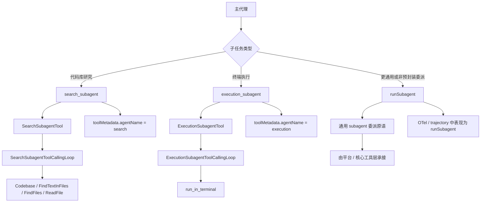
```mermaid
flowchart TD
    A[主代理] --> B{子任务类型}
    B -->|代码库研究| C[search_subagent]
    B -->|终端执行| D[execution_subagent]
    B -->|更通用或非预封装委派| E[runSubagent]

    C --> C1[SearchSubagentTool]
    C1 --> C2[SearchSubagentToolCallingLoop]
    C2 --> C3[Codebase / FindTextInFiles / FindFiles / ReadFile]

    D --> D1[ExecutionSubagentTool]
    D1 --> D2[ExecutionSubagentToolCallingLoop]
    D2 --> D3[run_in_terminal]

    E --> E1[通用 subagent 委派原语]
    E1 --> E2[由平台 / 核心工具层承接]

    C --> F[toolMetadata.agentName = search]
    D --> G[toolMetadata.agentName = execution]
    E --> H[OTel / trajectory 中表现为 runSubagent]
```

### 10.3 先看命名层：这三个名字本来就不在同一层

从 [toolNames.ts](../src/extension/tools/common/toolNames.ts) 可以直接看出，三者在工具表里是并列名字，但语义并不对称：

1. `ToolName.CoreRunSubagent = 'runSubagent'`
2. `ToolName.SearchSubagent = 'search_subagent'`
3. `ToolName.ExecutionSubagent = 'execution_subagent'`

其中最值得注意的是 `CoreRunSubagent` 这个名字。它已经在命名层提示了两件事：

1. 它属于 core 语义，而不是这个扩展自己做的专项业务工具。
2. 它描述的是“运行子代理”这一通用动作，而不是“运行搜索型子代理”或“运行执行型子代理”。

相对地，`search_subagent` 和 `execution_subagent` 从名字上就是任务导向的 specialized wrapper。

### 10.4 可用性层：主代理先决定是否暴露专项子代理

在 [agentIntent.ts](../src/extension/intents/node/agentIntent.ts#L107) 附近，当前扩展会显式按 feature flag 决定是否开放：

1. `ToolName.SearchSubagent`
2. `ToolName.ExecutionSubagent`

这说明至少在扩展自己的策略层里，系统并不是先鼓励模型直接使用裸 `runSubagent`，而是优先暴露这些已经带任务语义的专项工具。

对大代码库 Q&A 来说，这很重要，因为它意味着：

1. 主代理看到的不是“随便开一个子代理去研究”。
2. 而是“这里有一把专门给代码库研究准备好的子代理工具”。

### 10.5 prompt 层为什么明显偏向 `search_subagent` 和 `execution_subagent`

在 [defaultAgentInstructions.tsx](../src/extension/prompts/node/agent/defaultAgentInstructions.tsx#L113) 里，规则写得很直接：

1. 做代码库上下文搜索时，优先 `SearchSubagent`，而不是直接自己调用 `FindTextInFiles`、`Codebase`、`FindFiles`。
2. 做大多数终端执行任务时，优先 `ExecutionSubagent`，而不是直接使用 `run_in_terminal`。

这里最重要的一点不是“推荐哪个工具”，而是：**prompt 在主动把子代理从一种通用能力，提升成两条有明确任务边界的工作路径。**

也就是说，系统真正希望模型学会的是：

1. 研究任务走研究 worker。
2. 执行任务走执行 worker。
3. 不要把所有事情都直接摊平在主代理里自己做。

### 10.6 `search_subagent` 的本质：只读搜索 worker

从 [searchSubagentTool.ts](../src/extension/tools/node/searchSubagentTool.ts) 和 [searchSubagentToolCallingLoop.ts](../src/extension/prompt/node/searchSubagentToolCallingLoop.ts) 可以看出，`search_subagent` 的封装非常完整：

1. 独立生成 `subAgentInvocationId`
2. 创建新的 `Conversation`
3. 构造新的 `CapturingToken`
4. 运行 `SearchSubagentToolCallingLoop`
5. 把 `toolMetadata = { query, description, subAgentInvocationId, agentName: 'search' }` 写回结果

更关键的是，它的 loop 只开放：

1. `Codebase`
2. `FindFiles`
3. `FindTextInFiles`
4. `ReadFile`

这说明它不是“另一个全功能代理”，而是一个被故意缩成只读研究面的 worker。

### 10.7 `execution_subagent` 的本质：终端执行 worker

从 [executionSubagentTool.ts](../src/extension/tools/node/executionSubagentTool.ts) 和 [executionSubagentToolCallingLoop.ts](../src/extension/prompt/node/executionSubagentToolCallingLoop.ts) 可以看到，它和 `search_subagent` 的骨架几乎平行：

1. 也会生成新的 `subAgentInvocationId`
2. 也会创建新的 `Conversation`
3. 也会包进新的 `CapturingToken`
4. 也会把 `toolMetadata` 写回结果

但它的 specialization 完全不同：

1. `subAgentName` 固定为 `execution`
2. prompt 换成 `ExecutionSubagentPrompt`
3. 可用工具只剩 `run_in_terminal`
4. 最终要求返回 `<final_answer>` 形式的紧凑执行摘要

所以它不是研究 worker，而是“把一次小型执行任务压缩成交给终端工具的一条子 loop”。

### 10.8 从实现骨架看，`search_subagent` 和 `execution_subagent` 是一对对称包装器

如果只看扩展内实现，二者在结构上几乎是对称的：

| 维度 | `search_subagent` | `execution_subagent` |
| --- | --- | --- |
| 工具实现 | `SearchSubagentTool` | `ExecutionSubagentTool` |
| loop | `SearchSubagentToolCallingLoop` | `ExecutionSubagentToolCallingLoop` |
| `subAgentName` | `search` | `execution` |
| prompt | `SearchSubagentPrompt` | `ExecutionSubagentPrompt` |
| 允许工具 | `Codebase` / `FindFiles` / `FindTextInFiles` / `ReadFile` | `run_in_terminal` |
| 目标 | 只读研究与上下文压缩 | 小型执行任务与输出摘要 |
| 结果 metadata | `agentName: 'search'` | `agentName: 'execution'` |

这张表也说明：这两个工具都不是裸 subagent primitive，而是已经封装好任务域和工具边界的高阶接口。

### 10.9 那 `runSubagent` 到底扮演什么角色

在当前仓库里，`runSubagent` 更多出现在三类位置：

1. 工具名与类别定义，例如 [toolNames.ts](../src/extension/tools/common/toolNames.ts#L65)
2. OTel / trace context 传播逻辑，例如 [toolsService.ts](../src/extension/tools/vscode-node/toolsService.ts#L144)
3. trajectory / debug log 侧对子代理调用的观测，例如 `runSubagentToolCallToSessionId` 这类结构

这说明从扩展这一层往下看，`runSubagent` 更像：

1. 一个底层通用 delegation primitive
2. 专供平台 / 核心工具调用层识别与传播 trace 上下文
3. 让“父 execute_tool span -> 子 invoke_agent span”这条父子链可被观测系统识别

换句话说，`runSubagent` 更像子代理语义的基础设施名字，而 `search_subagent` / `execution_subagent` 更像面向模型的任务级封装。

### 10.10 为什么在可观测性里很多地方看到的是 `runSubagent`

看 [toolsService.ts](../src/extension/tools/vscode-node/toolsService.ts#L149)，当前 OTel 特殊处理写的是：

1. `if (String(name) === 'runSubagent') { ... }`

它会把当前 execute_tool span 的 trace context 存到：

1. `subagent:toolcall:${chatStreamToolCallId}`
2. `subagent:invocation:${subAgentInvocationId}`
3. `subagent:request:${chatRequestId}`

这说明在观测层，系统更关心的不是“这是搜索子代理还是执行子代理”，而是“这是不是一次通用意义上的子代理调用”。

也正因为如此，前面文档里讲 `SearchSubagent` metadata / trajectory 链时，`trajectoryLoggerAdapter` 会同时识别：

1. `runSubagent`
2. `search_subagent`

这表明专项子代理和通用子代理最终会在观测层汇合到同一类父子轨迹语义里。

### 10.11 主代理为什么更该优先调用专项子代理，而不是直接想着 `runSubagent`

从当前 prompt 和封装来看，原因很实际：

1. 专项子代理已经预先约束好了可用工具，降低模型误用空间。
2. prompt 里已经针对研究任务和执行任务分别写了使用建议。
3. 专项子代理会把返回格式、摘要方式、metadata、telemetry subtype 都一起标准化。

因此对主代理来说：

1. 要做代码库研究时，用 `search_subagent` 更像“调用一个研究 worker”。
2. 要做终端执行时，用 `execution_subagent` 更像“调用一个执行 worker”。
3. 直接思考 `runSubagent`，更像在碰底层委派原语，而不是在用已经调好边界的高阶接口。

### 10.12 一张职责对照表

| 维度 | `runSubagent` | `search_subagent` | `execution_subagent` |
| --- | --- | --- | --- |
| 层级 | 通用 delegation primitive | 专项研究 worker | 专项执行 worker |
| 任务语义 | 泛化的“开一个子代理” | 代码库上下文探索 | 终端执行与输出压缩 |
| 扩展内是否有完整 wrapper 实现 | 主要体现为工具名与观测链路识别 | 有 | 有 |
| prompt 是否明确鼓励主代理使用 | 没有看到同等强度的直接建议 | 有，明确优先用于 codebase exploration | 有，明确优先用于 terminal execution |
| 典型可用工具 | 不在这里由扩展内直接限定 | `Codebase` / `FindFiles` / `FindTextInFiles` / `ReadFile` | `run_in_terminal` |
| metadata 中的 agentName | 不固定，偏底层语义 | `search` | `execution` |
| 在可观测性层的角色 | 子代理调用的通用识别名 | 专项子代理，可回落到通用子代理轨迹语义 | 专项子代理，可回落到通用子代理轨迹语义 |

### 10.13 在大代码库 Q&A 语境下：为什么这里重点是 `search_subagent`

因为这个专题讨论的是“大代码库 Q&A”。在这个问题域里：

1. 研究任务远多于执行任务。
2. 需要的是只读检索、定位、阅读、汇总。
3. 所以 `search_subagent` 是更直接的主角。

`execution_subagent` 在这里更像一个对照组，它帮助你看清：

1. 子代理不是只有一种
2. 扩展是在把“通用 delegation”逐渐产品化成不同任务域的 specialized workers

而 `runSubagent` 则提醒你：这些 specialized workers 的背后，仍然有一层更通用的 subagent 语义基础设施。

### 10.14 一句话总结

> `runSubagent` 是“启动子代理”这一通用委派原语；`search_subagent` 和 `execution_subagent` 则是在这个原语之上，分别为“代码库研究”和“终端执行”预封装好的专项 worker。对于大代码库 Q&A，真正应该优先理解和使用的是 `search_subagent`，因为它把只读搜索边界、prompt 规则、返回格式和可观测性都一起标准化了。

---

## 11. 为什么到了观测层，很多事情都会回落成 `runSubagent` 语义

读到这里，一个很自然的问题是：

> 如果扩展已经把子代理封装成 `search_subagent` 和 `execution_subagent`，为什么在 OTel、trajectory、debug panel 等观测层里，仍然经常看到 `runSubagent` 这个名字？

答案是：**产品层和观测层在回答不同的问题。**

1. 产品层关心“用户/模型此刻在委托哪一类任务”。
2. 观测层关心“这是不是一次通用意义上的子代理调用，以及它和父工具调用/父代理 span 的关系是什么”。

也就是说，`search_subagent` / `execution_subagent` 是任务语义；`runSubagent` 更像观测层里的归一化语义。

### 11.1 先给结论

把这件事压成一句话：

> 在 prompt 和工具层，系统希望模型区分“研究子代理”和“执行子代理”；但在 telemetry、trace propagation 和 trajectory 里，系统更关心它们是否属于“子代理调用”这一通用范畴，因此很多链路会回落到 `runSubagent` 这个统一语义上。

### 11.2 一张语义分层图

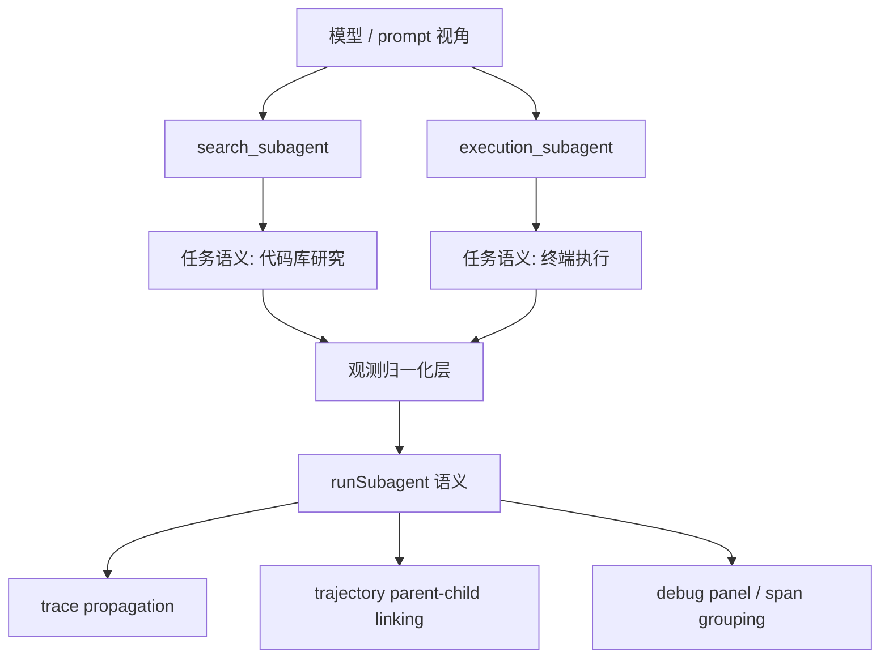
```mermaid
flowchart TD
    A[模型 / prompt 视角] --> B[search_subagent]
    A --> C[execution_subagent]

    B --> D[任务语义: 代码库研究]
    C --> E[任务语义: 终端执行]

    D --> F[观测归一化层]
    E --> F

    F --> G[runSubagent 语义]
    G --> H[trace propagation]
    G --> I[trajectory parent-child linking]
    G --> J[debug panel / span grouping]
```

这张图的重点是：

1. 上层需要保留任务差异。
2. 下层需要统一父子代理调用这一类结构关系。

### 11.3 trajectory adapter 就在做这种“上层差异、下层归一”的工作

看 [trajectoryLoggerAdapter.ts](../src/platform/trajectory/node/trajectoryLoggerAdapter.ts#L325)，当前实现会把以下两种工具都视为“subagent tool call”：

1. `runSubagent`
2. `search_subagent`

然后统一走：

1. `resolveSubagentSessionIdForSubagentTool(entry)`
2. `addSubagentReference(entry.id, { session_id, trajectory_path })`

这说明在 trajectory 层，系统真正想保住的核心结构不是“这到底是 search 还是 execution”，而是：

1. 父代理某一步调用了一个子代理
2. 这个父工具调用应该链接到哪个子 trajectory session

因此这里采用的是结构统一优先，而不是任务类型优先。

### 11.4 debug / OTel 也在做同样的归一化

看 [otelSpanToChatDebugEvent.ts](../src/extension/trajectory/vscode-node/otelSpanToChatDebugEvent.ts#L271)，并行子代理检测明确就是通过：

1. `execute_tool`
2. `toolName === 'runSubagent'`

来识别子代理调用组。

随后在展示层，它会再尝试从参数里抽出 `agentName`，把显示名修成：

1. `runSubagent (search)`
2. `runSubagent (execution)`

这个细节非常能说明问题：

1. 结构主语义仍然是 `runSubagent`
2. 任务语义则作为附加标签叠加上去

也就是说，在 debug panel 看起来像：

1. 先统一承认“这是子代理调用”
2. 再告诉你“它具体是哪类子代理”

### 11.5 为什么这种分层对架构更稳

如果观测层完全按产品层任务名分裂处理，会有两个问题：

1. 每加一种 specialized subagent，trace / trajectory / debug 适配器都要跟着新增一套平行逻辑。
2. 并行子代理、父子 span、父子 trajectory 这些通用结构关系就很难抽象成稳定公共逻辑。

而用 `runSubagent` 作为统一语义后：

1. 平台只需处理“一次子代理调用”的结构问题。
2. 任务差异可以留给 `agentName`、`description`、`toolMetadata`、prompt、子循环可用工具这些上层字段来表达。

这就是典型的“语义分层”：

1. 上层保留业务差异
2. 下层统一结构协议

### 11.6 一个总表：不同层分别关注什么

| 层 | 主要关心的问题 | 更偏向的名字 |
| --- | --- | --- |
| prompt / 产品行为层 | 这次委托是研究任务还是执行任务 | `search_subagent` / `execution_subagent` |
| 工具封装层 | 这条专项子任务该开放哪些工具、返回什么格式 | `SearchSubagentTool` / `ExecutionSubagentTool` |
| trace / trajectory / debug 层 | 这是不是一次子代理调用，它和父调用如何相连 | `runSubagent` |

### 11.7 一句话总结

> `search_subagent` 和 `execution_subagent` 让模型与产品层看到“哪一类子任务被委托”；`runSubagent` 则让观测层稳定地看到“发生了一次子代理调用”。前者负责任务语义，后者负责结构语义。

---

## 12. 子代理不是无限自治：它们也有自己的限额、停止协议和稳定性约束

前面已经讲了子代理如何被创建、如何接到父代理、如何回流到 transcript / trajectory。但如果不单独讲限制条件，很容易误以为：

> 只要开了子代理，它就会无限搜、无限执行，直到自己想停。

实际完全不是这样。子代理同样被包在 `ToolCallingLoop` 的控制协议里，只是它们的 prompt、工具边界和限额更收紧。

### 12.1 先给结论

把这件事压成一句话：

> `SearchSubagent` 和 `ExecutionSubagent` 不是自由扩张的第二主代理，而是“有固定工具边界、固定 tool-call 配额、固定返回格式、并受 SubagentStart / SubagentStop hook 约束”的受控 worker。

### 12.2 配置层已经把两者当成“有预算的小循环”

看 [configurationService.ts](../src/platform/configuration/common/configurationService.ts#L644)，当前配置里直接给了两组专门预算：

1. `SearchSubagentToolCallLimit`，默认 4
2. `ExecutionSubagentToolCallLimit`，默认 5

这说明系统从配置层就认定：

1. 搜索子代理应该是一个短、小、快速收敛的研究循环
2. 执行子代理也不是一个无限时长的 shell orchestrator，而是一个受限执行 loop

### 12.3 它们的 prompt 也在主动把停止条件写死

`SearchSubagentPrompt` 和 `ExecutionSubagentPrompt` 都做了一件非常关键的事情：

1. 明确规定最终回答必须是 `<final_answer>` 风格
2. 在接近最后一轮时，主动注入“现在必须给 final answer”的提醒

这意味着子代理并不是自己自由判断“什么时候差不多了”，而是 prompt 层已经在训练 / 约束它：

1. 搜索子代理的最终产物应是代码引用列表
2. 执行子代理的最终产物应是命令摘要

也就是说，它们的 stopping contract 比主代理更窄。

### 12.4 工具边界本身就是一种稳定性约束

这两类子代理最强的稳定性约束其实不是 token 数，而是可用工具被强行缩窄：

1. `SearchSubagent` 只能搜索和读文件
2. `ExecutionSubagent` 只能运行终端命令

这会直接带来两个效果：

1. 降低任务漂移风险，避免子代理自己跨越到不该做的工具域
2. 让返回结果更容易被主代理消费，因为输出语义更稳定

所以“限额”不仅是轮数限制，更是动作空间限制。

### 12.5 子代理同样受 `SubagentStart` / `SubagentStop` hook 控制

看 [toolCallingLoop.ts](../src/extension/intents/node/toolCallingLoop.ts#L585)，只要请求带 `subAgentInvocationId`：

1. 启动前就走 `SubagentStart`
2. 停止前就走 `SubagentStop`

并且在主循环里，如果 `SubagentStop` 返回 `shouldContinue`，系统会：

1. 显示 hook 阻断原因
2. 把原因写入 `stopHookReason`
3. 把格式化后的 hook context 再送入下一轮 prompt

也就是说，子代理也不是“自己想停就停”，而是同样可以被外部 stop policy 拦住继续工作。

### 12.6 子代理在 tracing 里也被显式标成“不是用户主动请求”

看 `SearchSubagentToolCallingLoop.fetch()` 和 `ExecutionSubagentToolCallingLoop.fetch()`：

1. 都会把 `userInitiatedRequest` 设成 `false`
2. telemetry subtype 分别写成 `subagent/search` 和 `subagent/execution`

这代表系统在 telemetry 语义上非常清楚：

1. 这是父代理内部派生出来的工作
2. 不是新的用户主请求

因此性能、并发、回放、会话统计时，都可以把它们和主请求分层看待。

### 12.7 一张约束矩阵

| 约束类型 | `SearchSubagent` | `ExecutionSubagent` |
| --- | --- | --- |
| tool-call limit | 默认 4 | 默认 5 |
| 最终输出 contract | `<final_answer>` + 代码引用列表 | `<final_answer>` + 命令摘要 |
| 可用工具 | 搜索 / 读文件 | `run_in_terminal` |
| stop hook | `SubagentStop` | `SubagentStop` |
| start hook | `SubagentStart` | `SubagentStart` |
| userInitiatedRequest | `false` | `false` |
| telemetry subtype | `subagent/search` | `subagent/execution` |

### 12.8 为什么这些约束对大代码库 Q&A 特别重要

因为大代码库 Q&A 最怕两件事：

1. 研究 worker 自己漂移成另一个主代理，做了一堆不该做的动作
2. 子代理拿到任务后无限扩张搜索范围，反而制造更多噪声

而当前设计就是在系统性防这两种失控：

1. 用工具边界防“越权”
2. 用 tool-call limit 防“无限扩张”
3. 用 final-answer contract 防“结果不可消费”
4. 用 start/stop hooks 防“策略失控”

### 12.9 一句话总结

> 子代理不是“第二个可以无限工作的主代理”，而是一个被 prompt、工具边界、hook 和 tool-call budget 同时收紧的小循环。它的价值不在于更自由，而在于更可控。

---

## 13. 一次子代理调用的完整生命周期：从 prompt 建议到 debug / trajectory 可见

前面几节已经把这条链拆散讲了：

1. prompt 如何鼓励主代理使用专项子代理
2. 工具实现如何创建 loop 和 metadata
3. request logger / trajectory / OTel 如何接住这些信息

这一节把它重新拼成一条真正完整的生命周期。

### 13.1 先给结论

把整条链压成一句话：

> 一次 `search_subagent` 调用，会先在主 prompt 中被推荐为更合适的研究手段；随后工具实现生成新的 `subAgentInvocationId`、子会话和 `CapturingToken`；子 loop 在 tracing 中继承父工具调用上下文；结果通过 `toolMetadata` 回流到 request logger；最终 trajectory adapter 再把这次父工具调用连接到一个独立的子 trajectory 上，而 debug panel 则把它展示为一次结构化的子代理调用。

### 13.2 端到端时序图

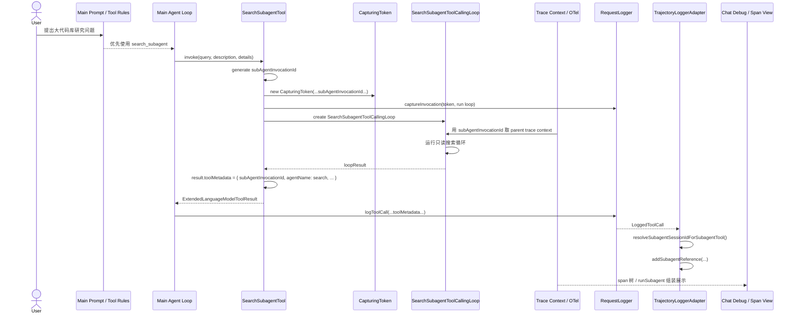
```mermaid
sequenceDiagram
        actor User
        participant MainPrompt as Main Prompt / Tool Rules
        participant Main as Main Agent Loop
        participant Tool as SearchSubagentTool
        participant Token as CapturingToken
        participant SubLoop as SearchSubagentToolCallingLoop
        participant OTel as Trace Context / OTel
        participant ReqLog as RequestLogger
        participant Adapter as TrajectoryLoggerAdapter
        participant Debug as Chat Debug / Span View

        User->>MainPrompt: 提出大代码库研究问题
        MainPrompt-->>Main: 优先使用 search_subagent
        Main->>Tool: invoke(query, description, details)

        Tool->>Tool: generate subAgentInvocationId
        Tool->>Token: new CapturingToken(...subAgentInvocationId...)
        Tool->>ReqLog: captureInvocation(token, run loop)

        Tool->>SubLoop: create SearchSubagentToolCallingLoop
        OTel->>SubLoop: 用 subAgentInvocationId 取 parent trace context
        SubLoop->>SubLoop: 运行只读搜索循环

        SubLoop-->>Tool: loopResult
        Tool->>Tool: result.toolMetadata = { subAgentInvocationId, agentName: search, ... }
        Tool-->>Main: ExtendedLanguageModelToolResult

        Main->>ReqLog: logToolCall(...toolMetadata...)
        ReqLog-->>Adapter: LoggedToolCall
        Adapter->>Adapter: resolveSubagentSessionIdForSubagentTool()
        Adapter->>Adapter: addSubagentReference(...)
        OTel-->>Debug: span 树 / runSubagent 组装展示
```

### 13.3 把生命周期拆成六个阶段

#### 阶段 A：主 prompt 决定“该不该委托”

这里的核心不是工具实现，而是主代理在 prompt 规则下先做出一个策略判断：

1. 当前任务是否属于代码库研究
2. 是否值得委托一个只读 worker 先去探索

这也是为什么子代理不是“底层自己冒出来”，而是主代理策略的一部分。

#### 阶段 B：工具实现生成新的身份与子会话

进入 `SearchSubagentTool.invoke()` 后，系统会立刻创建：

1. `subAgentInvocationId`
2. 新的 `Conversation`
3. 新的 `CapturingToken`
4. 新的子 loop

从这一刻开始，这次子代理调用已经不再只是“当前轮中的一个普通工具动作”，而是拥有了独立会话身份的子执行链。

#### 阶段 C：Tracing 继承父工具调用上下文

在工具执行层，系统会把父 execute_tool span 的上下文存到：

1. `subagent:invocation:${subAgentInvocationId}`

然后子 loop 启动时，会优先按这个 key 取 parent trace context。这样子代理的 `invoke_agent` span 就能真正挂在父工具调用下面。

#### 阶段 D：子代理自己的 transcript / tool rounds 发生在独立会话里

接下来子 loop 自己：

1. 执行 `SubagentStart`
2. 记录自己的 transcript
3. 跑自己的 tool-calling rounds
4. 受自己的 tool-call limit 和 `SubagentStop` 控制

这一阶段不再是主 transcript 里的普通细节，而是独立子会话内部的过程。

#### 阶段 E：结果通过 `toolMetadata` 回流到父链

子 loop 完成后，工具实现不会只返回一段文本，而是会额外把：

1. `subAgentInvocationId`
2. `agentName`
3. `description`

写到 `toolMetadata` 中。

这一步就是“把子会话身份重新带回父链”的关键桥。

#### 阶段 F：request logger / trajectory / debug 各自消费这些信息

最后这份结果会被三个可观测系统消费：

1. request logger：保留 toolMetadata 和 token
2. trajectory adapter：生成 `subagent_trajectory_ref`
3. debug / OTel 展示：把这次调用显示为结构化的子代理 span / tool call

也就是说，父链和子链最终不是靠推断重新拼上，而是靠显式身份字段重新合流。

### 13.4 一张阶段总表

| 阶段 | 关键动作 | 主要产物 |
| --- | --- | --- |
| A | 主 prompt 建议使用专项子代理 | 委托决策 |
| B | 工具实现生成 invocation ID、会话、token | 子代理身份 |
| C | 父工具调用 span 上下文传给子 loop | trace 父子关系 |
| D | 子 loop 独立执行、记录 transcript、受 hook/预算控制 | 子代理执行过程 |
| E | 结果写回 `toolMetadata` | 回流到父链的身份桥 |
| F | request logger / trajectory / debug 消费 metadata | 可追踪、可回放、可导出的父子结构 |

### 13.5 在整份报告里的位置

这一小节只回答一个承上启下的问题：为什么前面已经分别讲了委托、worker、metadata 和 observability，这里还要单独把 subagent 生命周期重新串起来。

1. 前面几节分别解释的是零件。
2. 这一节解释的是这些零件如何闭合成一条完整生命周期。
3. 所以它在整份报告里的作用，是把“局部机制视角”切回“完整闭环视角”。

### 13.6 一句话总结

> 子代理调用并不是“模型叫了一个工具，然后工具返回一段文本”这么简单；它实际上是一条被显式赋予身份、可独立执行、可被 tracing 继承、可被 trajectory 结构化链接、最后再回流父链的完整生命周期。

---

## 14. transcript、request logger、trajectory、OTel：四种可观测产物到底各管什么

前面已经多次分别提到 transcript、request logger、trajectory、OTel，但如果不把四者并排讲清楚，很容易再次混成一句很模糊的话：

> 反正系统会把过程都记下来。

这句话不够。更准确的说法是：**系统不是只有一份“日志”，而是至少有四种不同目的的可观测产物。它们都记录过程，但记录的对象、粒度、受众、以及“最适合回答什么问题”完全不同。**

### 14.1 先给结论

把四者压成一句话：

1. transcript 记录“对话轮次里发生了什么”。
2. request logger 记录“请求、工具、prompt trace 这些调试条目是什么”。
3. trajectory 记录“代理步骤、工具调用、观察结果、父子代理关系”的结构化执行轨迹。
4. OTel 记录“跨请求、跨工具、跨子代理的 span 层级与时序性能”。

也就是说，它们不是互相替代，而是四张不同视角的地图。

### 14.2 一张总对照图

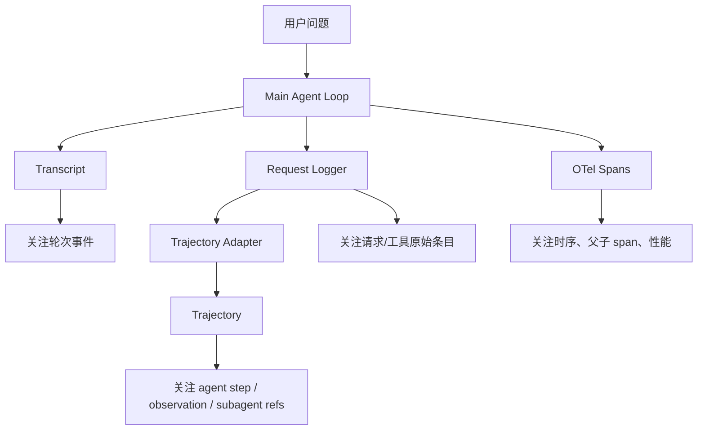
```mermaid
flowchart TD
    U[用户问题] --> M[Main Agent Loop]
    M --> T1[Transcript]
    M --> R1[Request Logger]
    M --> O1[OTel Spans]
    R1 --> TR[Trajectory Adapter]
    TR --> TJ[Trajectory]

    T1 --> A1[关注轮次事件]
    R1 --> A2[关注请求/工具原始条目]
    O1 --> A3[关注时序、父子 span、性能]
    TJ --> A4[关注 agent step / observation / subagent refs]
```

这张图最重要的是：

1. transcript 和 request logger 都离主循环很近。
2. trajectory 不是直接“主循环自己写”的，而是更多依赖 request logger 条目再做结构化抽取。
3. OTel 则平行地记录 span 层级，不直接等价于 transcript 或 trajectory。

### 14.3 四种产物的职责总表

| 产物 | 主要单元 | 最擅长回答的问题 | 最不适合回答的问题 |
| --- | --- | --- | --- |
| transcript | `session.start`、`assistant.turn_start`、`tool.execution_start/complete` | 这次对话分了几轮、每轮调用了哪些工具 | 精确的 span 层级或完整工具结果结构化关系 |
| request logger | `LoggedRequestInfo`、`LoggedToolCall`、prompt trace | 某次请求/某把工具具体传了什么、回了什么 | 整条代理轨迹的规范化父子图 |
| trajectory | agent step、tool call、observation、`subagent_trajectory_ref` | 代理是如何一步步做决策与观察的 | 原始 chat transcript 文本细枝末节 |
| OTel | `invoke_agent`、`execute_tool` 等 span | 哪个 span 是谁的父节点、并行度如何、耗时如何 | 用户视角的逐轮对话叙事 |

### 14.4 transcript：最像“对话回放”

从 [sessionTranscriptService.ts](../src/platform/chat/common/sessionTranscriptService.ts) 的 entry 定义可以看到，transcript 的核心是事件顺序：

1. `user.message`
2. `assistant.turn_start`
3. `assistant.message`
4. `tool.execution_start`
5. `tool.execution_complete`
6. `assistant.turn_end`

所以它最适合回答：

1. 这次会话分成了几轮
2. 每轮主代理当时想解决什么局部问题
3. 每轮触发了哪些工具

但它并不天然擅长表达：

1. 某个工具结果应该挂到哪个结构化 observation 上
2. 父代理与子代理的规范化轨迹引用关系
3. span 级并发与性能层级

### 14.5 request logger：最像“原始证据仓”

从 [requestLogger.ts](../src/platform/requestLogger/node/requestLogger.ts) 的类型定义看，request logger 保存的是：

1. 请求条目
2. 工具调用条目
3. prompt trace / element trace

尤其关键的是：

1. `LoggedToolCall` 会保留 `args`
2. `response`
3. `token`
4. `thinking`
5. `toolMetadata`

这让 request logger 更像：

1. 结构化原始证据仓
2. 后续 trajectory adapter 的“上游事实来源”

所以如果你要回答：

1. 这把工具到底返回了什么
2. `toolMetadata` 是否真的被保留下来
3. 当前捕获上下文 token 是什么

那么 request logger 往往比 transcript 更直接。

### 14.6 trajectory：最像“规范化代理行为图”

从 [trajectoryLogger.ts](../src/platform/trajectory/common/trajectoryLogger.ts) 看，trajectory 的核心对象是：

1. user step
2. agent step
3. tool calls
4. observations
5. `subagent_trajectory_ref`

它要回答的问题不是“日志里发生了什么”，而是：

1. 代理的每一步决策和观察怎样组成一条结构化执行轨迹
2. 哪个父工具调用派生出了哪个子 trajectory
3. 各步之间是否能被一个统一 schema 导出和分析

所以 trajectory 最适合面向：

1. 离线分析
2. 研究代理行为模式
3. 导出结构化父子代理图

### 14.7 OTel：最像“时序与层级的运行时骨架”

从 [genAiAttributes.ts](../src/platform/otel/common/genAiAttributes.ts) 以及相关 span 生成逻辑看，OTel 主要关心的是：

1. `invoke_agent`
2. `execute_tool`
3. tool arguments / tool result
4. `conversation_id`
5. `chat_session_id`
6. 父 span / 子 span 层级

它更适合回答：

1. 哪些子代理并行发生了
2. 某把工具耗时多久
3. 父工具调用 span 和子代理 span 是否正确接上

所以 OTel 更接近“运行时骨架”，而不是“用户叙事”。

### 14.8 四者是如何互补的

可以把这四者想成四种阅读模式：

1. transcript：读故事
2. request logger：看原始证据
3. trajectory：看结构化行为图
4. OTel：看时序和父子层级

如果只看其中一个，都会有盲区：

1. 只看 transcript，难以看清 `toolMetadata` 和父子 trajectory 链
2. 只看 request logger，容易失去“这轮对话到底在解决什么”
3. 只看 trajectory，可能看不到真实 prompt/工具返回的原始细节
4. 只看 OTel，容易失去用户可理解的语义上下文

### 14.9 一张最短选择表

| 你想回答的问题 | 最优先看什么 |
| --- | --- |
| 一次具体 codebase Q&A 分了几轮、每轮做了什么 | transcript |
| `search_subagent` 的 `toolMetadata` 有没有真的保存下来 | request logger |
| 父工具调用如何指向子代理轨迹 | trajectory |
| 父 tool span 和子代理 `invoke_agent` span 是否接上 | OTel |

### 14.10 一句话总结

> transcript、request logger、trajectory、OTel 都在记录“过程”，但它们不是四份重复日志：transcript 负责叙事顺序，request logger 负责原始证据，trajectory 负责规范化行为图，OTel 负责时序与层级骨架。真正深入理解 Agent Mode，必须把四者当成一组互补系统看。

---

## 15. `Codebase` 预取 vs `SearchSubagent` 委托：主代理到底先选哪一个

到了这里，专题里已经同时讲清楚了两条非常重要的路径：

1. `Codebase` 预取 / prompt augmentation
2. `SearchSubagent` 只读研究委托

接下来最值得澄清的问题就是：

> 主代理面对一个复杂代码库问题时，到底应该先走哪条？它们是互斥的、并列的，还是前后分层的？

答案是：**它们不是简单互斥，也不是完全平权并列；更准确的关系是“局部上下文增强”和“独立研究委托”两种不同规模的策略。**

### 15.1 先给结论

把这件事压成一句话：

> 当主代理只需要为当前这一轮 prompt 快速补一层语义上下文时，`Codebase` 预取更像局部增强；当问题范围已经大到需要一个独立 worker 去多轮只读探索时，`SearchSubagent` 更像外包一整个研究子任务。前者偏“把上下文拉进来”，后者偏“把研究工作派出去”。

### 15.2 一张决策分流图

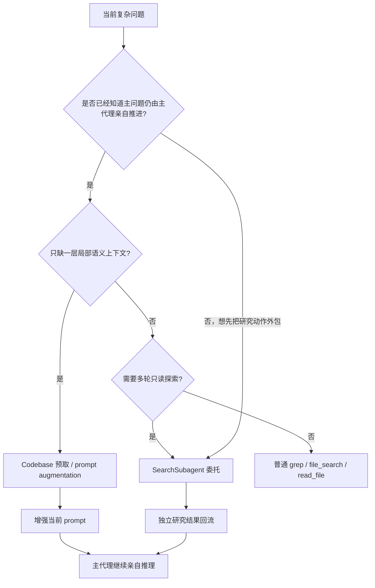
```mermaid
flowchart TD
    Q[当前复杂问题] --> A{是否已经知道主问题仍由主代理亲自推进?}
    A -->|是| B{只缺一层局部语义上下文?}
    B -->|是| C[Codebase 预取 / prompt augmentation]
    B -->|否| D{需要多轮只读探索?}
    D -->|是| E[SearchSubagent 委托]
    D -->|否| F[普通 grep / file_search / read_file]

    A -->|否，想先把研究动作外包| E
    C --> G[增强当前 prompt]
    E --> H[独立研究结果回流]
    G --> I[主代理继续亲自推理]
    H --> I
```

### 15.3 `Codebase` 更像“本轮 prompt 的局部上下文增强”

前面第 6、7 节已经讲过，`Codebase` 在这套机制里非常特殊：

1. 它可以在 `buildPrompt()` 阶段被主动预取
2. 它的结果可以直接进入 references / chat variables / metadata
3. 主 prompt 里还会故意把它从后续稳定 `toolReferences` 中剔掉，避免重复调用

这说明 `Codebase` 在主代理视角里，很多时候更像：

1. 给当前轮 prompt 快速补一层语义上下文
2. 让主代理自己继续做后续推理

也就是说，它本质上是“主代理仍亲自做事，只是先拿一点检索增强”。

### 15.4 `SearchSubagent` 更像“把研究过程整体外包出去”

而 `SearchSubagent` 则明显不是这种语义。它会：

1. 生成独立 `subAgentInvocationId`
2. 新建会话
3. 自己跑多轮搜索 loop
4. 返回压缩后的研究结果

这表示主代理在做的不是“给当前 prompt 补一点上下文”，而是：

1. 把一个研究子问题完整交给另一个 worker
2. 自己等着消费整理过的结果

因此它更像“任务级委托”，而不是“prompt 级增强”。

### 15.5 两者不是互斥关系，而是层级不同

在复杂问题里，现实情况往往是：

1. 主代理先用 `Codebase` 为当前轮补一层语义上下文
2. 发现问题范围仍然太大，转而委托 `SearchSubagent`
3. 子代理在自己的 loop 里也可能继续使用 `Codebase`

这说明两者不是非此即彼，而是嵌套关系完全可能成立：

1. `Codebase` 是 retrieval primitive / augmentation primitive
2. `SearchSubagent` 是 research worker

worker 当然可以在内部继续使用 retrieval primitive。

### 15.6 prompt 为什么会更强地鼓励 `SearchSubagent`

从默认 prompt 规则看，系统对 `SearchSubagent` 的鼓励语气明显更强。这背后的原因不是 `Codebase` 不重要，而是：

1. 主代理直接自己做大量搜索，很容易污染主 transcript 和主推理上下文
2. 主代理自己并行很多搜索，也更容易重复劳动
3. 一旦把“研究动作”封装进子代理，主代理就能保持更干净的主任务链

所以 prompt 倾向于把：

1. 大范围探索交给 `SearchSubagent`
2. 小范围语义增强留给 `Codebase`

### 15.7 一张职责对照表

| 维度 | `Codebase` 预取 | `SearchSubagent` 委托 |
| --- | --- | --- |
| 规模 | 当前 prompt 的局部增强 | 独立研究子任务 |
| 会话 | 仍在主代理当前轮内 | 新建子会话 |
| 产物 | references / variables / metadata | 压缩后的研究结果 + 独立轨迹 |
| 主代理角色 | 继续亲自推进后续推理 | 暂时把研究动作外包 |
| 典型用途 | 语义补充、快速找上下文 | 广泛探索、多轮缩小范围 |

### 15.8 一句话总结

> `Codebase` 预取更像“把检索结果拉进当前轮 prompt”，`SearchSubagent` 更像“把研究过程整体派出去”。前者增强主代理，后者暂时替主代理工作；两者不是互斥，而是不同层级的策略工具。

---

## 16. 这类系统最容易被误读的地方：几个常见反模式

专题写到这里，已经能把大部分主链讲通。但从工程理解上，最容易出问题的往往不是“没读到代码”，而是读到了代码却套错了抽象。

下面列几个最常见的误读方式。它们不是小瑕疵，而是会直接导致你对整个架构的判断跑偏。

### 16.1 反模式一：把整个系统理解成单一 RAG

这是最常见的误读。

为什么错：

1. `Codebase` 只是其中一条 retrieval-heavy 支路
2. 系统还同时依赖 `grep_search`、`search_workspace_symbols`、`read_file`、`SearchSubagent`
3. 主代理的核心能力不是“拿到检索结果”，而是“在多轮中决定继续搜、读、委托还是收敛”

正确理解：

1. `Codebase` 是 RAG-like subsystem
2. 整体是 tool-augmented iterative retrieval and reasoning

### 16.2 反模式二：把 `SearchSubagent` 看成“并行帮手”而不是独立研究 loop

为什么错：

1. 它不是主代理内部顺手多跑几次搜索
2. 它有自己的会话、自己的 `subAgentInvocationId`、自己的 transcript、自己的 tool-call budget
3. 它返回的是压缩后的研究结果，而不是主链内直接摊平的搜索细节

正确理解：

1. 它是一个被严格收窄能力边界的研究 worker
2. 主代理和它是父子协作，不是单层并行

### 16.3 反模式三：把 `Codebase` 也当成普通工具消息历史

为什么错：

1. 在通用 codebase Q&A 场景里，`Codebase` 可能在 `buildPrompt()` 阶段被预取
2. 它的结果会直接进入 references / chat variables / metadata
3. 主 prompt 里还会故意把它从普通 `toolReferences` 中剔掉

正确理解：

1. `Codebase` 既像工具，又像 prompt augmentation 管道
2. 它和普通“模型先调用、系统再写回历史”的工具协议不完全一样

### 16.4 反模式四：以为 transcript 就是全部真相

为什么错：

1. transcript 更偏对话事件顺序
2. request logger 才保留很多原始 `toolMetadata` / response 细节
3. trajectory 才表达结构化父子代理引用
4. OTel 才表达 span 层级和时序性能

正确理解：

1. transcript、request logger、trajectory、OTel 是互补系统
2. 不能用其中一个替代其他三个

### 16.5 反模式五：把 specialized subagent 和 `runSubagent` 完全等同

为什么错：

1. `search_subagent` / `execution_subagent` 处在任务级封装层
2. `runSubagent` 更像通用委派原语和观测层统一语义
3. 专项子代理在 prompt、工具边界、返回格式上都有自己额外的约束

正确理解：

1. 上层看到 specialized worker
2. 下层观测统一回落到通用 subagent 调用结构

### 16.6 一张“错误理解 vs 正确理解”总表

| 常见误读 | 为什么会出错 | 更准确的理解 |
| --- | --- | --- |
| 整个系统就是 RAG | 忽略了工具编排和多轮决策 | 它是混合检索 + 多轮推理系统 |
| `SearchSubagent` 只是一次并行搜索 | 忽略了独立会话和预算 | 它是独立研究 worker |
| `Codebase` 和普通工具完全一样 | 忽略了 prompt augmentation 路径 | 它是工具 + 预取增强双重角色 |
| transcript 足够解释一切 | 忽略其他三套观测系统 | 需要 transcript + request logger + trajectory + OTel 联读 |
| `search_subagent` 就等于 `runSubagent` | 混淆任务语义和结构语义 | specialized worker 建立在 generic delegation primitive 之上 |

### 16.7 为什么这一节重要

如果前 15 节是在建一套理解框架，那这一节的作用就是防止框架再次塌回几个常见误读里。

因为对这类系统来说，最危险的不是“不知道代码在哪”，而是：

1. 把不同层级的概念混成一个概念
2. 把不同职责的组件当成同一类组件
3. 用一个看似顺手的抽象，覆盖掉真实存在的分层设计

### 16.8 一句话总结

> 真正理解这个专题，不在于记住多少文件名，而在于避免把“检索 primitive”“研究 worker”“prompt augmentation”“结构化轨迹”“时序 tracing”这些原本分层清晰的概念重新揉成一团。

---

## 第二部分：案例复盘

## 17. 从一次真实 codebase Q&A 提问出发：把整条调用链按时间线串起来

前面各节已经把局部机制拆开讲清楚了，但这里要重新强调：这一节不再讲“系统理论上可能怎么跑”，而是专门根据当前目录里的 trajectory 重放**这一次真实样本**。

这一节要回答的问题只有一个：**用户问完 long-run execution 以后，这次 agent 实际按什么顺序收集证据、收紧范围、最后停下？**

### 17.1 先给结论

把这条链压成一句话：

> 这次真实样本不是“先做 `Codebase` 预取，再派 `SearchSubagent`”，而是“主代理连续 6 轮用 `grep_search + read_file` 做只读证据收集，逐轮把搜索空间从大而散收紧到 `toolCallingLoop`、`agentIntent`、`agentPrompt`、hooks 测试和 compaction 逻辑，最后再一次性综合回答”。

### 17.2 一条最短时间线

如果把这次真实样本压缩成最短时间线，可以写成：

1. 用户提出“为什么它能 long run execution 而不轻易退出”。
2. 第 1 轮先做宽范围 grep，确定该看执行循环、提示词、文档还是测试。
3. 第 2 轮锁定 `task_complete`、`autopilot` 和 `ToolCallingLoop`。
4. 第 3 轮补齐 prompt 规则、hooks 和长上下文压缩入口。
5. 第 4 轮深挖 stop hook、yield、retry、tool-call-limit 和 `buildPrompt()` 压缩逻辑。
6. 第 5 到 6 轮回收文档表述和源码锚点，准备最终回答。
7. 最后一轮不再调用工具，直接综合成结构化解释。

真正关键的不是“工具被调了 22 次”这件事本身，而是 agent 在这条线上不断做两类切换：

1. 在“继续放大搜索面”和“开始锁定关键文件”之间切换。
2. 在“继续补证据”和“证据已经足够，可以收口”之间切换。

### 17.3 用当前专题问题重放一次主链

这次真实样本的用户问题是：

> 请研究一下这个 Copilot chat 代码仓库是如何保证大语言模型在收到指令以后，可以 long run execution 而不轻易退出，草草收尾的。

按真实 trajectory 重放，主链更接近下面这 6 个阶段：

#### 阶段 A：先做宽范围定位，而不是直接下结论

第 1 轮的目标不是回答，而是确认“到底是 prompt 在约束，还是运行时在兜底”。

所以 agent 先做了三次宽范围 `grep_search`：

1. 在 `src/**` 里找 `continue until`、`done`、`finishReason`、`isComplete` 一类停止语义。
2. 在 `assets/**` 里找同类文案。
3. 在 `docs/**` 里找 execution loop、termination、complete 一类设计说明。

同一轮还试了一次 `semantic_search`，但返回空结果。也正因为这个失败，后续主链自然收敛到了更确定的 `grep_search + read_file` 组合。

#### 阶段 B：锁定显式完成协议

第 2 轮开始，问题已经明显收紧到 `task_complete` 和 `autopilot`：

1. `grep_search("task_complete")` 找到了 `toolCallingLoop.ts`、`agentIntent.ts` 和对应测试。
2. `read_file(toolCallingLoop.ts)` 直接读到了 `shouldAutopilotContinue()`、`MAX_AUTOPILOT_RETRIES`、`MAX_AUTOPILOT_ITERATIONS`、内部 stop hook 等实现。
3. `read_file(agentIntent.ts)` 读到了 `allowTools['task_complete'] = request.permissionLevel === 'autopilot'`。
4. `read_file(toolCallingLoopAutopilot.spec.ts)` 读到了“没调用 `task_complete` 时会持续 nudge，但也有上限”的测试。

这一轮结束后，主代理已经把“不要轻易退出”从一句 prompt 口号，缩小成了一个很具体的运行时协议问题。

#### 阶段 C：补齐 prompt、hook 和长上下文侧证据

第 3 轮不是换方向，而是补证据面：

1. `read_file(agentPrompt.tsx)` 读到了 autopilot 下“必须先总结，再调用 `task_complete`”的 prompt 规则。
2. `grep_search(agentIntent.ts)` 继续找 `buildPrompt`、`backgroundSummarizer`、`SummarizedConversationHistory`、`compact`。
3. `read_file(toolCallingLoopHooks.spec.ts)` 补 stop/subagent hook 的测试语义。
4. `read_file(docs/prompts.md)` 补产品侧对“端到端完成任务”“不要轻易停下”的文档描述。

到这一步，主代理其实已经开始形成一个三层结构：prompt 约束、完成协议、运行时控制面。

#### 阶段 D：深挖运行时兜底，而不是继续扩展搜索面

第 4 轮继续向深处读，但搜索面反而更窄：

1. `read_file(agentIntent.ts 366-650)` 深读 `buildPrompt()` 里的 background compaction 和 budget fallback。
2. `grep_search(toolCallingLoopHooks.spec.ts)` 和 `read_file(toolCallingLoopHooks.spec.ts 760-980)` 锁定 stop hook 如何阻止停止。
3. `grep_search(toolCallingLoop.ts)` 锁定 `yieldRequested`、自动重试、tool-call-limit 扩容到 200、autopilot internal stop hook。

这一轮很关键，因为它把“为什么能长跑”补成了完整闭环：不是只靠 prompt，也不是只靠 `task_complete`，而是连 stop hook、yield、retry、context compaction 都在兜底。

#### 阶段 E：回收辅助证据和最终锚点

第 5 到 6 轮不再扩展理论面，而是收尾：

1. `grep_search(agentPrompt.tsx)` 和 `grep_search(docs/prompts.md)` 回收明确的文案证据。
2. `read_file(copilotCLITools.ts)` 查看 `task_complete` 在工具层的参数与摘要语义。
3. 最后一轮再 grep `agentIntent.ts`、`toolCallingLoop.ts`，只是为了拿到最终回答所需的精确锚点。

这就是为什么最终回答里会同时出现架构解释和大量精确源码引用。它不是第一次看到结论就停，而是专门花了最后两轮把可引用证据补齐。

#### 阶段 F：证据闭合后一次性综合回答

到了最终 step 12，agent 已经不再调用任何工具，而是把前面 6 轮读到的内容压成四类机制：

1. prompt 要求。
2. 显式完成工具。
3. 停止前运行时拦截。
4. 长上下文与失败恢复。

这才是真正的收敛点。不是“我差不多懂了”，而是“我已经把核心机制、测试、提示词和边界条件都补齐了”。

### 17.4 用 transcript 视角看这条时间线

如果把这条时间线压成更接近真实样本的 transcript 风格，近似会是：

```text
Turn 1
    assistant.message: 先定位和“持续执行/何时停止”直接相关的文档、提示词和执行循环代码
    tool calls:
        - grep_search
        - grep_search
        - grep_search
        - semantic_search(empty)

Turn 2
    assistant.message: 已定位到核心点，继续读执行循环、工具集装配和 autopilot 测试
    tool calls:
        - grep_search(task_complete)
        - read_file
        - read_file
        - read_file

Turn 3
    assistant.message: 再补 prompt、hooks 和 compaction 证据
    tool calls:
        - read_file
        - grep_search
        - read_file
        - read_file

Turn 4
    assistant.message: 深挖 stop hook、yield、retry 和背景压缩
    tool calls:
        - read_file
        - grep_search
        - read_file
        - grep_search

Turn 5
    assistant.message: 回收 prompt / docs / task_complete 表达层证据
    tool calls:
        - grep_search
        - grep_search
        - read_file

Turn 6
    assistant.message: 回收最终源码锚点
    tool calls:
        - grep_search
        - grep_search
        - grep_search

Final
    assistant.message: 不再继续搜，直接输出综合解释
```

这段 transcript 有两个重要结论：

1. 它确实是多轮闭环，不是“一搜一答”。
2. 它的闭环主要靠主代理自己连续规划和重规划，而不是靠子代理展开第二条时间线。

### 17.5 用 request logger / trajectory 视角看同一条链

同一件事如果切到 request logger / trajectory 视角，会更像：

1. step 1 是用户消息。
2. step 2 到 step 7 都是 agent message + `tool_calls` + `observation`。
3. step 12 是最终回答，没有工具调用。
4. `final_metrics` 给出了这次样本的总账：`total_steps = 8`、`total_tool_calls = 22`。

这说明“同一条时间线”在不同观测系统里会变成不同表示：

1. transcript 强调轮次
2. request logger 强调原始请求/工具证据
3. trajectory 强调每个 step 的 message、tool_calls、observation 和最终统计

### 17.6 一张完整时序图

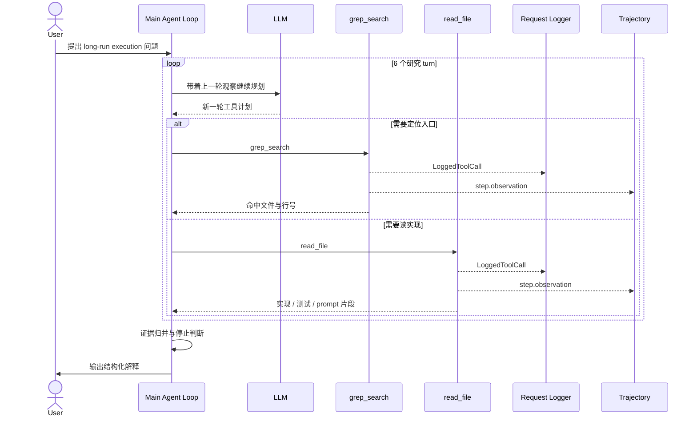
```mermaid
sequenceDiagram
    actor User
    participant Main as Main Agent Loop
    participant Model as LLM
    participant Search as grep_search
    participant Read as read_file
    participant RL as Request Logger
    participant TJ as Trajectory

    User->>Main: 提出 long-run execution 问题
    loop 6 个研究 turn
        Main->>Model: 带着上一轮观察继续规划
        Model-->>Main: 新一轮工具计划
        alt 需要定位入口
            Main->>Search: grep_search
            Search-->>RL: LoggedToolCall
            Search-->>TJ: step.observation
            Search-->>Main: 命中文件与行号
        else 需要读实现
            Main->>Read: read_file
            Read-->>RL: LoggedToolCall
            Read-->>TJ: step.observation
            Read-->>Main: 实现 / 测试 / prompt 片段
        end
    end

    Main->>Main: 证据归并与停止判断
    Main->>User: 输出结构化解释
```

### 17.6.1 把 6 个 turn 和 22 次工具调用压进一张主图

上面那张图强调的是骨架；下面这张图强调的是**这次真实样本每一轮到底做了什么**。

这里要先说明一个边界：trajectory 直接暴露的是每轮 assistant 的可见工作提示、工具调用和 observation，并不直接暴露“每一轮发给模型的完整 materialized prompt”。所以这张图里的“提示词”采用的是**本轮 assistant 工作提示 + 上一轮 observation 收敛出来的下一步目标**，而不是伪装成我们看到了完整隐藏 prompt。

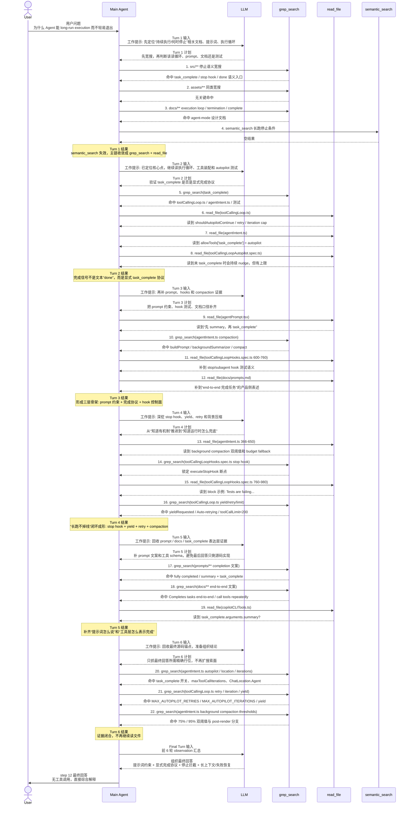
```mermaid
sequenceDiagram
    actor User
    participant AgentMain as Main Agent
    participant Model as LLM
    participant G as grep_search
    participant R as read_file
    participant S as semantic_search

    User->>AgentMain: 用户问题<br/>为什么 Agent 能 long-run execution 而不轻易退出

    AgentMain->>Model: Turn 1 输入<br/>工作提示: 先定位“持续执行/何时停止”相关文档、提示词、执行循环
    Model-->>AgentMain: Turn 1 计划<br/>先宽搜，再判断该读循环、prompt、文档还是测试
    AgentMain->>G: 1. src/** 停止语义宽搜
    G-->>AgentMain: 命中 task_complete / stop hook / done 语义入口
    AgentMain->>G: 2. assets/** 同类宽搜
    G-->>AgentMain: 无关键命中
    AgentMain->>G: 3. docs/** execution loop / termination / complete
    G-->>AgentMain: 命中 agent-mode 设计文档
    AgentMain->>S: 4. semantic_search 长跑停止条件
    S-->>AgentMain: 空结果
    Note over AgentMain: Turn 1 结果<br/>semantic_search 失效，主链收敛成 grep_search + read_file

    AgentMain->>Model: Turn 2 输入<br/>工作提示: 已定位核心点，继续读执行循环、工具装配和 autopilot 测试
    Model-->>AgentMain: Turn 2 计划<br/>验证 task_complete 是否是显式完成协议
    AgentMain->>G: 5. grep_search(task_complete)
    G-->>AgentMain: 命中 toolCallingLoop.ts / agentIntent.ts / 测试
    AgentMain->>R: 6. read_file(toolCallingLoop.ts)
    R-->>AgentMain: 读到 shouldAutopilotContinue / retry / iteration cap
    AgentMain->>R: 7. read_file(agentIntent.ts)
    R-->>AgentMain: 读到 allowTools['task_complete'] = autopilot
    AgentMain->>R: 8. read_file(toolCallingLoopAutopilot.spec.ts)
    R-->>AgentMain: 读到未 task_complete 时会持续 nudge，但有上限
    Note over AgentMain: Turn 2 结果<br/>完成信号不是文本“done”，而是显式 task_complete 协议

    AgentMain->>Model: Turn 3 输入<br/>工作提示: 再补 prompt、hooks 和 compaction 证据
    Model-->>AgentMain: Turn 3 计划<br/>把 prompt 约束、hook 测试、文档口径补齐
    AgentMain->>R: 9. read_file(agentPrompt.tsx)
    R-->>AgentMain: 读到“先 summary，再 task_complete”
    AgentMain->>G: 10. grep_search(agentIntent.ts compaction)
    G-->>AgentMain: 命中 buildPrompt / backgroundSummarizer / compact
    AgentMain->>R: 11. read_file(toolCallingLoopHooks.spec.ts 600-760)
    R-->>AgentMain: 补到 stop/subagent hook 测试语义
    AgentMain->>R: 12. read_file(docs/prompts.md)
    R-->>AgentMain: 补到“end-to-end 完成任务”的产品侧表述
    Note over AgentMain: Turn 3 结果<br/>形成三层骨架: prompt 约束 + 完成协议 + hook 控制面

    AgentMain->>Model: Turn 4 输入<br/>工作提示: 深挖 stop hook、yield、retry 和背景压缩
    Model-->>AgentMain: Turn 4 计划<br/>从“知道有机制”推进到“知道运行时怎么兜底”
    AgentMain->>R: 13. read_file(agentIntent.ts 366-650)
    R-->>AgentMain: 读到 background compaction 双阈值和 budget fallback
    AgentMain->>G: 14. grep_search(toolCallingLoopHooks.spec.ts stop hook)
    G-->>AgentMain: 锁定 executeStopHook 断点
    AgentMain->>R: 15. read_file(toolCallingLoopHooks.spec.ts 760-980)
    R-->>AgentMain: 读到 block 示例: Tests are failing...
    AgentMain->>G: 16. grep_search(toolCallingLoop.ts yield/retry/limit)
    G-->>AgentMain: 命中 yieldRequested / Auto-retrying / toolCallLimit<200
    Note over AgentMain: Turn 4 结果<br/>“长跑不掉线”闭环成形: stop hook + yield + retry + compaction

    AgentMain->>Model: Turn 5 输入<br/>工作提示: 回收 prompt / docs / task_complete 表达层证据
    Model-->>AgentMain: Turn 5 计划<br/>补 prompt 文案和工具 schema，避免最后回答只剩源码实现
    AgentMain->>G: 17. grep_search(prompts/** completion 文案)
    G-->>AgentMain: 命中 fully completed / summary + task_complete
    AgentMain->>G: 18. grep_search(docs/** end-to-end 文案)
    G-->>AgentMain: 命中 Completes tasks end-to-end / call tools repeatedly
    AgentMain->>R: 19. read_file(copilotCLITools.ts)
    R-->>AgentMain: 读到 task_complete.arguments.summary?
    Note over AgentMain: Turn 5 结果<br/>补齐“提示词怎么说”和“工具层怎么表示完成”

    AgentMain->>Model: Turn 6 输入<br/>工作提示: 回收最终源码锚点，准备组织结论
    Model-->>AgentMain: Turn 6 计划<br/>只抓最终回答所需精确行位，不再扩搜索面
    AgentMain->>G: 20. grep_search(agentIntent.ts autopilot / location / iterations)
    G-->>AgentMain: 命中 task_complete 开关、maxToolCallIterations、ChatLocation.Agent
    AgentMain->>G: 21. grep_search(toolCallingLoop.ts retry / iteration / yield)
    G-->>AgentMain: 命中 MAX_AUTOPILOT_RETRIES / MAX_AUTOPILOT_ITERATIONS / yield
    AgentMain->>G: 22. grep_search(agentIntent.ts background compaction thresholds)
    G-->>AgentMain: 命中 75% / 95% 双阈值与 post-render 分支
    Note over AgentMain: Turn 6 结果<br/>证据闭合，不再继续读文件

    AgentMain->>Model: Final Turn 输入<br/>前 6 轮 observation 汇总
    Model-->>AgentMain: 组织最终回答<br/>提示词约束 + 显式完成协议 + 停止拦截 + 长上下文/失败恢复
    AgentMain->>User: step 12 最终回答<br/>无工具调用，直接综合解释
```

这张图里最值得注意的不是“22 次调用很多”，而是这 22 次调用的分布非常克制：

1. 第 1 轮只有 1 次 `semantic_search`，失败后就不再恋战。
2. 后面 21 次几乎全是 `grep_search + read_file`，说明这次样本走的是“源码证据钉死”路线，不是“高级检索器花式编排”路线。
3. 最后一轮完全不再调工具，说明 agent 直到证据闭合以后才允许自己收口。

### 17.6.2 逐轮拆开看：每一轮怎么拿到下一轮的方向

如果主图强调的是“总账”，下面 6 张小图强调的就是：**每一轮到底拿到了什么新信息，以及这些信息如何决定下一轮继续搜什么。**

在进入逐轮正文之前，先把这份文档里的“叙事 Turn”与两份底层日志的编号关系钉死。否则后面一边看 `trajectory.json`，一边看 `chat.json`，很容易把“语义轮次”和“transport 轮次”混成同一个计数器。

| 叙事层叫法 | `trajectory.json` 对应 | `chat.json` 对应 | 这一跳的 marker / 说明 |
| --- | --- | --- | --- |
| 用户原始输入 | `step_id = 1` | `renderedUserMessage` / `renderedGlobalContext` | 还没有 assistant marker |
| Turn 1 | `step_id = 2` | `toolCallRounds[0]` | `xe/k4fCl...` |
| Turn 2 | `step_id = 3` | `toolCallRounds[1]` | `ScvjxuRo...` |
| Turn 3 | `step_id = 4` | `toolCallRounds[2]` | `gXWmaZOG...` |
| Turn 4 | `step_id = 5` | `toolCallRounds[3]` | `LTqg7y0C...` |
| Turn 5 | `step_id = 6` | `toolCallRounds[4]` | `rEbnmuTv...` |
| Turn 6 | `step_id = 7` | `toolCallRounds[5]` | `yq+9a6t1...` |
| pre-final 收束轮 | trajectory 不单独保留一节 | `toolCallRounds[6]` | `XpgGHnw2...`，仍然是 commentary + 3 个 grep |
| Final Turn | `step_id = 12` | `toolCallRounds[7]` | `phase = final_answer`，marker 为 `yVJYVms5...` |

这里最重要的不是编号本身，而是两个结论：

1. `trajectory.json` 记录的是“用户可见的语义轮次”，所以从 Turn 6 会直接跳到 `step_id = 12` 的最终回答。
2. `chat.json` 记录的是更细的 transport/history 轮次，所以它在 Final Turn 前还保留了一个 pre-final 收束轮。

后面正文里如果说“Turn 6 之后还有一跳”，指的就是这个差异：不是文档写错了，而是两份日志的抽样粒度本来就不一样。

#### Turn 1：先判断该往哪一类证据收缩

- 本轮可见工作提示：先定位“持续执行/何时停止”直接相关的文档、提示词和执行循环代码。
- 本轮工具批次：`grep_search` x 3，`semantic_search` x 1。
- 本轮核心收获：`semantic_search` 空结果；源码 grep 已经露出 `task_complete`、stop hook、termination 语义；文档 grep 暗示 execution loop 值得深读。
- 对下一轮的指导：从宽搜切到显式完成协议，直接读 `toolCallingLoop.ts`、`agentIntent.ts` 和 autopilot 测试。

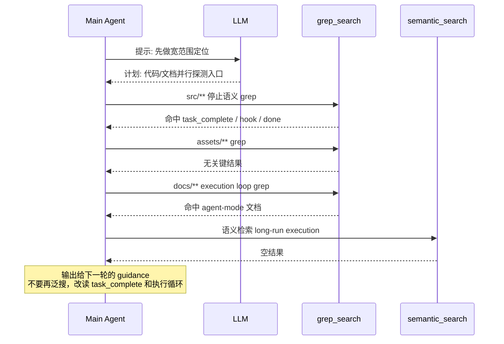
```mermaid
sequenceDiagram
    participant AgentMain as Main Agent
    participant Model as LLM
    participant G as grep_search
    participant S as semantic_search

    AgentMain->>Model: 提示: 先做宽范围定位
    Model-->>AgentMain: 计划: 代码/文档并行探测入口
    AgentMain->>G: src/** 停止语义 grep
    G-->>AgentMain: 命中 task_complete / hook / done
    AgentMain->>G: assets/** grep
    G-->>AgentMain: 无关键结果
    AgentMain->>G: docs/** execution loop grep
    G-->>AgentMain: 命中 agent-mode 文档
    AgentMain->>S: 语义检索 long-run execution
    S-->>AgentMain: 空结果
    Note over AgentMain: 输出给下一轮的 guidance<br/>不要再泛搜，改读 task_complete 和执行循环
```

#### Turn 1 补充：为什么这轮 prompt 会先导向“保守宽搜”

如果只看 UI 里的原始问题“请研究一下这个 Copilot chat 代码仓库是如何保证大语言模型在收到指令以后，可以 long run execution 而不轻易退出，草草收尾的”，很容易误以为模型第一步完全可以直接跳到 `toolCallingLoop.ts`。但从这次 replay 的真实输入看，Turn 1 送进模型的并不是一条裸 user text，而是一条结构化后的用户消息：同一个 message 里同时带了 `<context>`、`<reminderInstructions>`、`<userRequest>`。这不是推测，而是这次 trajectory 自己就把第一步 user message 记下来了；同时 [src/extension/prompts/node/agent/agentPrompt.tsx](../../../src/extension/prompts/node/agent/agentPrompt.tsx) 的 `AgentUserMessage.render()` 也明确说明当前轮会把日期、terminal 状态、todo/terminal 上下文、reminder instructions、编辑器上下文和用户请求一起渲染进消息。

这意味着 Turn 1 的“隐藏提示词”至少同时包含了三层约束，而不是只有那句中文问题本身。

1. 系统/模型层在强推“先建立上下文，不要先入为主”。在 [src/extension/prompts/node/agent/openai/gpt54Prompt.tsx](../../../src/extension/prompts/node/agent/openai/gpt54Prompt.tsx) 里，GPT-5.4 prompt 明说要先 examining the codebase，不要 without making assumptions or jumping to conclusions。对应的通用 agent 指令 [src/extension/prompts/node/agent/defaultAgentInstructions.tsx](../../../src/extension/prompts/node/agent/defaultAgentInstructions.tsx) 又进一步要求：如果不确定哪个工具相关，可以同时调多个工具；不要先假设，要先 gather context first。
2. 工具使用层在强推“先做问题分解，再决定检索器”。同一个默认指令文件和 replay spec [src/extension/replay/node/spec.chatreplay.json](../../../src/extension/replay/node/spec.chatreplay.json) 都反复强调：文件还不知道时，先把需求拆成更小概念；精确字符串适合 `grep_search`；不知道确切字符串时才用 `semantic_search` / Codebase；必要时可以并行做几路只读探测。
3. 当前轮 reminder 层在强推“先行动、先搜证据、不要遗漏需求”。这次 Turn 1 实际输入里的 `<reminderInstructions>` 不是空壳，它明确要求 keep going until resolved、take action when possible、requirements coverage 不要遗漏。这会把模型从“先给一个高层解释”推向“先确认证据面”。

所以 Turn 1 的广搜并不代表模型“没想清楚”，反而更像是它在服从 prompt 组合后的保守策略：**先判断这件事到底是 prompt 层问题、runtime loop 问题、还是文档里已有现成口径，再决定往哪条证据链收缩。** 这也和该轮 assistant commentary 完全一致：它第一句就说要把“靠提示约束”和“靠运行时机制兜底”两层拆开看。

再看这轮具体关键词，会发现它们不是随机拍出来的，而是把用户问题拆成了三组检索子问题。

1. 第一组是“完成/停止语义词”。`continue until|fully handled|until the task is complete|maxTurns|isComplete|areWeDone|finishReason|done` 这串词，本质上是在问：系统有没有显式完成协议、停止信号、轮次上限或 finish reason。这一组明显对应用户说的“不轻易退出、草草收尾”。
2. 第二组是“执行循环语义词”。`agent mode|execution loop|termination|stop condition|max turns|complete` 这串词在问的是：如果这不是单纯 prompt 文案，而是一个真正的执行器，它的 loop、termination、stop condition 写在哪里。这一组明显对应“long run execution”。
3. 第三组是“整句语义改写”。`agent execution loop stop condition continue until task complete long running execution tool calls finish in Copilot Chat agent mode` 不是为了精确命中某个标识符，而是在做一次语义兜底，看看代码库里是否有更接近自然语言描述的设计说明或代码片段。

这里最重要的判断是：**这些关键词族的形成是高度可解释的，但不是可精确反演的。** 我们能从 prompt 文件和 tool spec 里证明“模型被鼓励先分解问题、先 gather context、混合使用 grep 与 semantic search”；也能从 trajectory 里证明它确实这样做了；但我们不能把某个具体词，比如 `areWeDone`，硬说成来自某一行 prompt 文本。更合理的表述是：prompt 负责给出策略边界，具体落到哪些近义词、哪些 stop/completion 词簇，是模型在该策略边界内做的黑箱展开。

这也顺带解释了为什么 Turn 1 没有一上来就用 `SearchSubagent` 或直接读大文件。虽然某些模型 prompt 变体会偏好更激进的搜索代理，但这次真实样本的首轮目标只是“判方向”，不是“深挖实现”；而 `grep_search` + 一次 `semantic_search` 恰好是最低成本的方向判别器。等到 Turn 1 已经确认 `task_complete`、stop hook、execution loop 都浮出来以后，Turn 2 才开始直接读 [src/extension/intents/node/toolCallingLoop.ts](../../../src/extension/intents/node/toolCallingLoop.ts) 和 [src/extension/intents/node/agentIntent.ts](../../../src/extension/intents/node/agentIntent.ts)。

#### Turn 1 补充：agent 发送了什么给大模型，大模型回复了什么

前面已经解释了 Turn 1 为什么会出现“保守宽搜”，但如果把“prompt 装配”和“模型回复”混着讲，读起来还是容易短路。更清晰的读法是把 Turn 1 拆成两半：

1. agent 到底发了什么给 provider。
2. 大模型到底回了什么给 agent。

下面这一节按这个顺序展开，而且每一半都分成两层：

1. **provider / transport 层看到的外形**。
2. **render / assistant 可见层看到的外形**。

先约定一下颜色语义：

- **蓝色** 表示系统/模型侧装配。
- **黄色** 表示 reminder / workflow 约束。
- **绿色** 表示用户输入。
- **紫色** 表示工具 schema / 可用工具集合。
- **红色** 表示最可能把模型推向“保守宽搜”的关键片段。

##### 一、发送：Turn 1 的请求是怎么被装起来的

先看最靠近 provider 的那一层。Turn 1 送出去的并不是一句裸的用户问题，而更接近下面这种结构：

```text
provider payload (simplified)
{
    messages: [
        SystemMessage(base agent instructions + model-specific instructions),
        UserMessage(
            <context>...</context>
            <reminderInstructions>...</reminderInstructions>
            <userRequest>...</userRequest>
        )
    ],
    tools: [grep_search, semantic_search, read_file, ...],
    tool_choice: auto,
    previous_response_id: undefined
}
```

这里最需要强调的有三点：

1. Turn 1 的 provider payload 里**没有** `previous_response_id`，因为根本还没有上一轮 assistant response marker 可以引用。
2. 但它仍然可能已经带有 `cache breakpoint` 这类 request-side 标记，因为 cache 断点是在 render 之后、provider 提交之前补进去的；这和“有没有上一轮 response id”是两回事。
3. provider 实际接收的不是“提示词正文 + 用户问题”两段文本，而是 `messages + tools` 这种结构化对象。

##### Turn 1 的 render 层输出长什么样

如果把 provider payload 往回退一步，看 render 层刚拼完、但还没做 provider 转换之前，Turn 1 更接近下面这个样子：

```text
rendered messages (simplified)
[
    SystemMessage(
        system base
        + model-specific prompt
        + tool-use instructions
    ),
    UserMessage(
        <context>...</context>
        <reminderInstructions>...</reminderInstructions>
        <userRequest>...</userRequest>
    )
]

post-render augmentation (possible)
    [copilot_cache_control: { type: 'ephemeral' }]
```

Turn 1 在这一层有一个很重要的“格式判断”要单独说清楚：

1. `previous_response_id` 在 Turn 1 一定为空，因为它只能来自更早的 assistant round。
2. `stateful marker` 也不会出现在“发送前的历史消息里”，因为那是 provider 在 assistant 回复流中返回后，才会被写回历史轮次的。
3. `cache breakpoint` 则不同，它是请求侧后处理，所以**即便是 Turn 1**，从格式上也可以已经有 cache tag。

##### Turn 1 render 层里到底装了哪些内容

把 render 层再拆开，就能看清楚哪些是提示词部分，哪些是用户侧上下文，哪些是工具 sidecar：

| 层 | 来自哪里 | Turn 1 里大体长什么样 | 为什么和“保守宽搜”有关 |
| --- | --- | --- | --- |
| 系统基座 | [src/extension/prompts/node/agent/agentPrompt.tsx](../../../src/extension/prompts/node/agent/agentPrompt.tsx) | `You are an expert AI programming assistant...` | 先把模型设成 VS Code 里的 coding agent，而不是一次性问答器。 |
| 模型特化 prompt | [src/extension/prompts/node/agent/openai/gpt54Prompt.tsx](../../../src/extension/prompts/node/agent/openai/gpt54Prompt.tsx) | `build context by examining the codebase first`；`without making assumptions or jumping to conclusions` | 这是 Turn 1 不直接跳源码结论、而要先判方向的第一推动力。 |
| 通用工具规则 | [src/extension/prompts/node/agent/defaultAgentInstructions.tsx](../../../src/extension/prompts/node/agent/defaultAgentInstructions.tsx) | `If you aren't sure which tool is relevant, you can call multiple tools.`；`Don't make assumptions... gather context first.`；`When reading files, prefer large meaningful chunks...` | 它明确鼓励“先多路探测，再收缩”，这正是 Turn 1 的 grep+semantic 组合。 |
| 工具 schema | [src/extension/prompts/node/agent/agentPrompt.tsx](../../../src/extension/prompts/node/agent/agentPrompt.tsx) 的 `availableTools` 装配，以及运行时请求 payload | 文本里只会说 `There is a selection of tools...`；实际请求还会把可用工具名和参数 schema 一起发给模型。 | 这也是为什么模型能够合法地产生 `grep_search`、`semantic_search` 这类 tool calls。工具可用性不是用户正文的一部分，而是请求 sidecar。 |
| context | trajectory 里 Turn 1 的用户消息，见 [docs/example - database qna/18ecd237-a607-4ff4-8bd8-fb2effe16459.trajectory.json](./18ecd237-a607-4ff4-8bd8-fb2effe16459.trajectory.json) | `&lt;context&gt;date / terminals / cwd / exit code...&lt;/context&gt;` | 告诉模型这是一个真实仓库内的研究任务，不是脱离工作区的抽象问答。 |
| reminderInstructions | trajectory 中实际记录的 Turn 1 输入；对应实现见 [src/extension/prompts/node/agent/agentPrompt.tsx](../../../src/extension/prompts/node/agent/agentPrompt.tsx) 与 [src/extension/prompts/node/agent/openai/gpt54Prompt.tsx](../../../src/extension/prompts/node/agent/openai/gpt54Prompt.tsx) | `keep going until resolved`；`take action when possible`；`requirements coverage` | 它把模型从“先解释一下”推到“先做证据搜集”，所以首轮更容易选择探索式检索。 |
| userRequest | trajectory 中实际记录的 Turn 1 输入 | `请研究一下... 如何保证大语言模型... long run execution 而不轻易退出...` | 这句用户请求本身就把问题拆成了两个大方向：一是“为什么能持续执行”，二是“为什么不会草草收尾”。 |

##### Turn 1 提示词是怎么一步步装出来的

上面那张表是静态拆件图，下面这张图更像装配流水线：

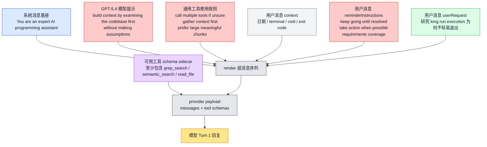
```mermaid
flowchart TD
        A[系统消息基座<br/>You are an expert AI programming assistant]:::system
        B[GPT-5.4 模型提示<br/>build context by examining the codebase first<br/>without making assumptions]:::critical
        C[通用工具使用规则<br/>call multiple tools if unsure<br/>gather context first<br/>prefer large meaningful chunks]:::critical
        D[用户消息 context<br/>日期 / terminal / cwd / exit code]:::context
        E[用户消息 reminderInstructions<br/>keep going until resolved<br/>take action when possible<br/>requirements coverage]:::critical
        F[用户消息 userRequest<br/>研究 long run execution 为何不轻易退出]:::user
        G[可用工具 schema sidecar<br/>至少包含 grep_search / semantic_search / read_file]:::tools
        H[render 层消息序列]:::merged
        I[provider payload<br/>messages + tool schemas]:::merged
        J[模型 Turn 1 回复]:::result

        A --> H
        B --> H
        C --> H
        D --> H
        E --> H
        F --> H
        G --> I
        H --> I
        I --> J

        classDef system fill:#dbeafe,stroke:#1d4ed8,color:#111827;
        classDef critical fill:#fecaca,stroke:#dc2626,color:#111827;
        classDef context fill:#f3f4f6,stroke:#6b7280,color:#111827;
        classDef user fill:#dcfce7,stroke:#16a34a,color:#111827;
        classDef tools fill:#e9d5ff,stroke:#7c3aed,color:#111827;
        classDef merged fill:#e5e7eb,stroke:#374151,color:#111827;
        classDef result fill:#fde68a,stroke:#d97706,color:#111827;
```

这张图最关键的一点是：**三组搜索词不在 A-G 这些上游装配片段里，它们要到 J 这一步才出现，也就是模型收到 Turn 1 请求包之后，自己生成出来的 tool call 参数。**

##### Turn 1 实际发给模型的用户消息骨架

如果只看 trajectory 里能直接观测到的用户消息部分，Turn 1 的骨架是这样的：

```xml
<context>
The current date is March 29, 2026.
Terminals: ...
Cwd: D:\AIGC\vscode-copilot-chat_my
Exit Code: 1
</context>
<reminderInstructions>
You are an agent—keep going until the user's query is completely resolved...
Take action when possible...
Requirements coverage...
</reminderInstructions>
<userRequest>
请研究一下这个 Copilot chat 代码仓库是如何保证大语言模型在收到指令以后，
可以 long run execution 而不轻易退出，草草收尾的
</userRequest>
```

读到这里，可以先把 Turn 1 的“发送侧”压成一句话：agent 发出去的是一份**结构化研究任务**，而不是一句“帮我解释一下”的自然语言短问句。

##### 二、回复：Turn 1 的模型输出是怎么长出来的

换到回复侧，也先看最靠近 provider 的那层。Turn 1 的 provider 返回，在语义上更接近下面这种外形：

```text
provider response (simplified)
{
    output_text_delta: "我先定位和‘Agent 持续执行/何时停止’直接相关的文档...",
    tool_calls: [
        grep_search(...src/**...),
        grep_search(...assets/**...),
        grep_search(...docs/**...),
        semantic_search(...)
    ],
    stateful_marker: optional
}
```

这里也有一个格式层次要先讲明白：

1. provider 返回的不只是最终一段 assistant 文本，还可能带 tool call 增量和可选的 `statefulMarker`。
2. 这个 `statefulMarker` 不是给用户看的正文，而是后面写回 assistant history、供 Turn 2 折叠成 `previous_response_id` 的 transport 元数据。
3. 所以“provider 返回外形”天然比“用户看到的 assistant 回复”更宽。

##### Turn 1 的 assistant 可见层完整外形

如果把 transport 元数据先拿掉，只保留 trajectory step 2 里真正可见的 assistant 回复，那么 Turn 1 的输出很短，完整展开就是：

```text
assistant.message
我先定位和“Agent 持续执行/何时停止”直接相关的文档、提示词和执行循环代码，目标是把“靠提示约束”和“靠运行时机制兜底”这两层拆开看。

tool_call_1
function_name: grep_search
arguments:
    query: continue until|fully handled|until the task is complete|maxTurns|isComplete|areWeDone|finishReason|done
    isRegexp: true
    includePattern: src/**
    maxResults: 200

tool_call_2
function_name: grep_search
arguments:
    query: continue until|fully handled|until the task is complete|maxTurns|isComplete|areWeDone|finishReason|done
    isRegexp: true
    includePattern: assets/**
    maxResults: 200

tool_call_3
function_name: grep_search
arguments:
    query: agent mode|execution loop|termination|stop condition|max turns|complete
    isRegexp: false
    includePattern: docs/**
    maxResults: 200

tool_call_4
function_name: semantic_search
arguments:
    query: agent execution loop stop condition continue until task complete long running execution tool calls finish in Copilot Chat agent mode
```

这就是 Turn 1 的“**assistant 可见层完整**”。它已经完整覆盖了用户最终能理解到的回复结构：1 条计划说明，加上 4 个 tool calls。

##### Turn 1 的 transport 层完整外形

如果再往下一层，把 provider 返回后写回历史、供后续轮次复用的元数据也算进去，那么 Turn 1 更接近下面这种形态：

```text
assistant.message (user-visible)
我先定位和“Agent 持续执行/何时停止”直接相关的文档、提示词和执行循环代码，目标是把“靠提示约束”和“靠运行时机制兜底”这两层拆开看。

assistant.tool_calls
    grep_search(...)
    grep_search(...)
    grep_search(...)
    semantic_search(...)

assistant.transport-metadata (optional)
    [response_id: <provider marker> with <modelId>]
```

这里的重点是：`[response_id: ...]` 这种东西不是模型“说出来”的自然语言，也不是 tool 参数；它只是系统把 provider 返回的 marker 挂回 assistant message 上，供下一轮请求复用。所以：

1. “assistant 可见层完整”回答的是：用户和工具执行器看到什么。
2. “transport 层完整”回答的是：为了让 Turn 2 能增量续写，还额外挂了什么元数据。

##### Turn 1 回复侧拆解表

| 模型回复组件 | 这次 Turn 1 的真实内容 | 为什么模型会这样回 |
| --- | --- | --- |
| assistant 计划说明 | `我先定位和“Agent 持续执行/何时停止”直接相关的文档、提示词和执行循环代码，目标是把“靠提示约束”和“靠运行时机制兜底”这两层拆开看。` | 这句话把问题重写成“两层证据链”：一层看 prompt / instructions，另一层看 runtime stop condition。它正好呼应了前面 prompt 里“先建立代码库上下文、不要过早下结论”的装配方向。 |
| tool call 1 | `grep_search`，正则查询完成/停止语义词，目标 `src/**` | 因为 userRequest 里直接问了“不轻易退出、草草收尾”，而 prompt 又鼓励先 gather context，所以模型先在源码里宽搜“完成/停止语义词”。 |
| tool call 2 | `grep_search`，同一组完成/停止语义词正则，目标 `assets/**` | 同一组 query 扩到 `assets/**`，说明模型没有假设“停止协议只会写在源码里”，而是在源码和 prompt 资产两边并行排查。 |
| tool call 3 | `grep_search`，查询 `agent mode / execution loop / termination / stop condition / max turns / complete`，目标 `docs/**` | 前两次是在找“完成协议”线索，这一次则把问题压到“execution loop / termination”这条文档与设计语义线上。 |
| tool call 4 | `semantic_search`，自然语言查询 agent execution loop / stop condition / task complete / long running execution | 这是最后的语义兜底。说明模型不是盲信 grep 必须命中，而是在 prompt 允许的范围内补了一次自然语言级探测。 |

##### Turn 1 发送 / 回复总结：它如何克制地指导 agent 行动

把 Turn 1 的发送和回复合在一起看，最值得注意的不是“模型很聪明”，而是这个系统对 agent 的引导方式很克制：

1. 发送侧没有把答案、关键词列表、甚至具体文件路径预写给模型，只是给了它一个强约束的研究框架：先 gather context、不要臆断、可以并行用多个工具。
2. 回复侧也没有立刻下实现结论，而是先交出一条研究计划，再做 4 个低成本、覆盖面广的 probes。
3. 这就是一种很典型的“受约束的自主性”：系统不规定模型具体搜什么词，但通过 prompt、workflow 提醒和工具供给，把它推向“先判方向、后收口”的轨道。
4. 对 Turn 2 的直接影响就是：Turn 2 已经不需要再重新发明搜索词，而是可以拿着 Turn 1 暴露出来的 `task_complete`、`stop condition`、`execution loop` 这些线索，转向直接读实现与测试。

从 Turn 2 开始，就没必要把 Turn 1 那套完整 system prompt anatomy 每轮都再抄一遍了，因为那些基座还在，只是**每一轮真正改变模型行为的，已经主要变成“历史 observation + 上轮工具结果 + 本轮新增提醒”**。所以下面几轮统一改用两张表：

1. 请求侧继承 / 新增了什么。
2. 回复侧实际生成了什么。

#### Turn 2：把“不要轻易停”收缩成完成协议

##### 先校正一下 Turn 2 以后要看的日志层次

从 Turn 2 开始，单看 `trajectory.json` 已经不够了。用户可见的“这一轮 agent 说了什么、调了哪些工具”，继续看 trajectory 就够；但你这次追问的 `statefulMarker`、cache breakpoint、以及 `previous_response_id` 这一层，真正能直接看到的是 `chat.json` 里的序列化结果。

这份 case 里，现有 artifacts **没有直接落出** provider wire payload 的 `previous_response_id` 字段本身；但它把这个字段的**来源对象**完整保存下来了，也就是每一轮 `toolCallRounds[*].statefulMarker`。从 [src/platform/endpoint/node/responsesApi.ts](../../../src/platform/endpoint/node/responsesApi.ts) 的实现来看，Responses API 真正发请求前，正是用这些 marker 去折叠前缀并生成 `previous_response_id`。

这也是为什么 Turn 2 以后要同时看两份日志：

1. `trajectory.json` 负责说明“用户可见 turn 语义”。
2. `chat.json` 负责说明“render/transport 层到底落成了什么对象”。

另外还有一个很容易误判的细节：`chat.json` 的 `toolCallRounds` 比 trajectory 更细。它在 Final Turn 前额外保留了一个“pre-final 收束 commentary round”，所以 marker 链会比我们在正文里按语义归纳出来的 Turn 计数多 1 跳。

```text
Turn 1 marker           xe/k4fCl...
Turn 2 marker           ScvjxuRo...
Turn 3 marker           gXWmaZOG...
Turn 4 marker           LTqg7y0C...
Turn 5 marker           rEbnmuTv...
Turn 6 marker           yq+9a6t1...
pre-final marker        XpgGHnw2...
final_answer marker     yVJYVms5...
```

##### Turn 2 完整发送外形：先完整渲染，再决定是否压缩提交

你刚才追问的关键点，其实正好要把 Turn 2 拆成两层看：

| 层次 | Turn 2 里到底包含什么 | 和 Turn 1 的关系 |
| --- | --- | --- |
| 完整渲染层 | 仍然会先渲染出一份“完整消息序列”：system prompt、模型特化 prompt、tool schema、原始 userRequest、全局 context 这些基座继续在；此外还会把 Turn 1 的 assistant 计划说明、4 个 tool calls、以及它们返回的 tool results / observation 作为 conversation history 拼进来。 | 所以 Turn 2 不是把 Turn 1 的搜索词命中结果“手工抄成一段新提示词”再附加上去，而是通过历史消息对象把 Turn 1 的 assistant 行为和工具结果带入下一轮。 |
| 发送前改写层 | 完整渲染完成后，系统还会先插入 cache breakpoints；如果当前 endpoint 走 Responses API，并且历史里存在与当前模型匹配的 `stateful marker`，那么 `rawMessagesToResponseAPI()` 会提取它，把它写成 `previous_response_id`，然后把真正提交给 provider 的 `input` 裁成“marker 之后的消息尾巴”。 | 所以“逻辑上完整继承 Turn 1”和“物理上把整段前缀原样重发”不是一回事。前者一定发生；后者只在没有可用 marker，或当前链路不是 Responses API 时才成立。 |

换句话说，Turn 2 的请求构造更接近下面这个模型：

```text
Step A: 先得到完整 render 结果
    system instructions
    + model-specific instructions
    + tool schema
    + original userRequest
    + global context
    + Turn 1 assistant message
    + Turn 1 tool calls
    + Turn 1 tool results / observations
    + Turn 2 当前待回答的 continuation context
```

这里最后这块很容易误解，单独拆开说：

1. 它**不是**模型在看到 Turn 1 回复后，自己再“脑补”或“摘要拼接”出来的一段文本。
2. 在普通 agent loop 里，这块其实来自客户端的 prompt 构造：`ToolCallingLoop.createPromptContext()` 先决定当前轮 `query` 是什么，再由 `AgentUserMessage` 把它渲染成一条新的 `UserMessage`。
3. 对普通的 Turn 2 来说，`query` 默认仍然是当前 turn 的原始用户请求，也就是 `this.turn.request.message`，不是从 Turn 1 的 assistant 回复里反推出来的二次问题。
4. 只有在“显式 continuation”场景里，这个 `query` 才会被改写成 `Please continue`；如果是 stop hook 阻止收尾，则会改写成 `formatHookContext([...])` 包出来的阻止原因。
5. 这条当前轮 `UserMessage` 一旦第一次 render 完成，还会被存进 `RenderedUserMessageMetadata` 冻结下来，后续轮次优先复用这个 frozen content，而不是每轮根据最新工具结果重新改写用户消息。

这里还要再补一个你这次追问最关心的区分：**代码里“可能走到的分支”不等于“这次样本真的走到了该分支”**。

1. “显式 continuation” 这条分支，代码上通常要求当前 turn 本身就是 continuation 类请求，`createPromptContext()` 才会把 `query` 改写成 `Please continue`。
2. “stop hook” 这条分支，代码上要求前一轮 stop hook 明确阻止收尾，并把理由写进 `stopHookReason` / `hookContext`，下一轮才会把 `query` 改写成 hook reason。
3. 这次 case 的实际 `chat.json` 里，没有搜到真实的 `"Please continue"`、`"hookContext":`，也没有 continuation 确认类 request 字段；Turn 2 的 `renderedUserMessage` 里仍然直接包含原始 `<userRequest>...</userRequest>`。
4. 所以这次样本从 Turn 2 到 Final Turn，实际展示的是“普通下一轮 + 历史继承 + marker 压缩”这条主路径，而不是“显式 continuation”或“stop hook 改写 query”这两条特殊路径。

对应代码链路是：

- `ToolCallingLoop.createPromptContext()` 决定 `query / isContinuation / hasStopHookQuery / additionalHookContext`，见 [src/extension/intents/node/toolCallingLoop.ts](../../../src/extension/intents/node/toolCallingLoop.ts)。
- `AgentPrompt` 把 `AgentConversationHistory + AgentUserMessage + ChatToolCalls` 组装成完整 prompt，见 [src/extension/prompts/node/agent/agentPrompt.tsx](../../../src/extension/prompts/node/agent/agentPrompt.tsx)。
- `AgentUserMessage` 真正把 `context / reminderInstructions / userRequest` 渲染成当前轮用户消息；若已有 `RenderedUserMessageMetadata`，则直接复用 frozen content，见 [src/extension/prompts/node/agent/agentPrompt.tsx](../../../src/extension/prompts/node/agent/agentPrompt.tsx)。
- 首次 render 后，冻结后的用户消息会在 `AgentIntentInvocation.buildPrompt()` 里写回 turn metadata，见 [src/extension/intents/node/agentIntent.ts](../../../src/extension/intents/node/agentIntent.ts)。

所以更精确地说，Turn 2 这一项不是“模型自己组装出来的 continuation context”，而是“**当前 turn 的用户消息快照**”。它可能包含：原始 query、chat variables、edited file events、terminal/todo/editor context、reminderInstructions，以及 hook 注入的附加上下文；但这些都来自 prompt builder，不来自 Turn 1 assistant 文本本身。

可以把 Turn 2 的 prompt 装配关系压成下面这张小图：

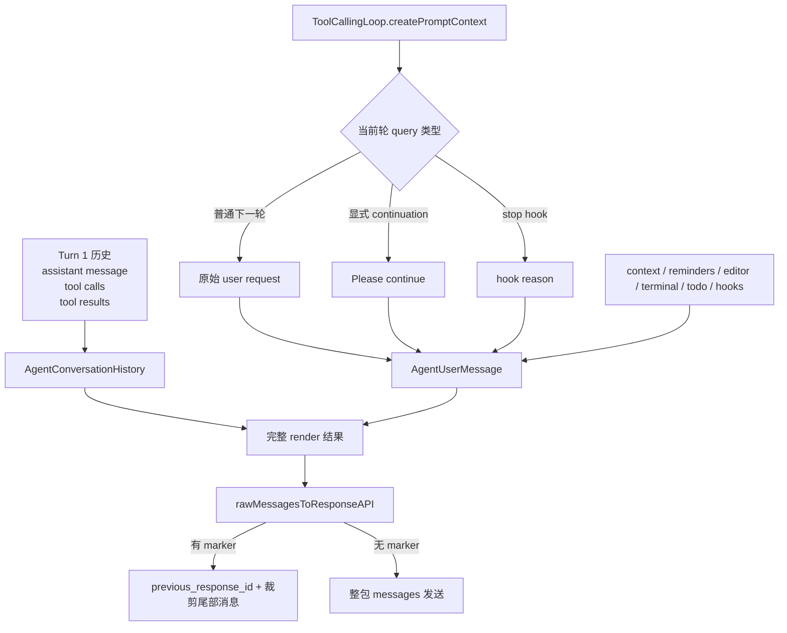
```mermaid
flowchart TD
    A["Turn 1 历史<br/>assistant message<br/>tool calls<br/>tool results"] --> B["AgentConversationHistory"]

    C["ToolCallingLoop.createPromptContext"] --> D{"当前轮 query 类型"}
    D -->|"普通下一轮"| E["原始 user request"]
    D -->|"显式 continuation"| F["Please continue"]
    D -->|"stop hook"| G["hook reason"]

    E --> H["AgentUserMessage"]
    F --> H
    G --> H

    I["context / reminders / editor / terminal / todo / hooks"] --> H

    B --> J["完整 render 结果"]
    H --> J

    J --> K["rawMessagesToResponseAPI"]
    K -->|"有 marker"| L["previous_response_id + 裁剪尾部消息"]
    K -->|"无 marker"| M["整包 messages 发送"]
```

这张图里最重要的是：

1. 左边 `AgentConversationHistory` 那条线，负责把 Turn 1 的 assistant 行为和 tool observations 带进来。
2. 右边 `AgentUserMessage` 那条线，负责生成“当前轮用户消息快照”。
3. 这两条线是在 render 阶段合流，不是模型先读完左边历史，再自己写出右边那段 continuation 文本。
4. 最后 `rawMessagesToResponseAPI()` 才决定要不要把前缀折叠成 `previous_response_id`；这一步属于发送前压缩，不属于 prompt 语义生成。

```text
Step B: 再做发送前变换
    add cache breakpoints
    if (have compatible stateful marker && endpoint uses Responses API) {
        previous_response_id = <Turn 1 response marker>
        input = only messages after that marker
    } else {
        input = full rendered messages
    }
```

这也回答了“是不是严格按照 Turn 1 的 Q 命中结果，把它做文字叠加，然后再拔出去”这个问题：**不是先做一段人工摘要文本再替换掉**，而是先保留完整消息对象级继承，再在 provider 提交前，把可复用的前缀折叠成 `previous_response_id`。如果 provider 认为这个 marker 无效，请求层还会自动退回到“忽略 marker，重新整包发送”那条兜底路径。

##### Turn 2 的 transport 侧真实 log 骨架

这一轮如果只看 `chat.json`，最关键的不是某个抽象概念，而是能直接看到下面这类序列化骨架：

```json
{
    "responseId": "response_5e94cfd6-dd07-473d-a308-a36d5e514367",
    "renderedUserMessage": [
        {
            "type": 1,
            "text": "<context>...<reminderInstructions>...<userRequest>...</userRequest>"
        },
        {
            "type": 3,
            "cacheType": "ephemeral"
        }
    ],
    "renderedGlobalContext": [
        {
            "type": 1,
            "text": "<environment_info>...<workspace_info>..."
        },
        {
            "type": 3,
            "cacheType": "ephemeral"
        }
    ],
    "toolCallRounds": [
        {
            "response": "我先定位和‘Agent 持续执行/何时停止’直接相关的文档...",
            "statefulMarker": "xe/k4fCl...",
            "toolCalls": ["grep_search", "grep_search", "grep_search", "semantic_search"]
        },
        {
            "response": "已经定位到核心点了：这套仓库不是只靠一句‘继续干直到完成’的 system prompt...",
            "statefulMarker": "ScvjxuRo...",
            "toolCalls": ["grep_search", "read_file", "read_file", "read_file"]
        }
    ]
}
```

就这次样本本身来说，Turn 2 这里实际走到的是上面小图里的“普通下一轮”分支，不是 `Please continue`，也不是 stop hook reason。能直接看到的证据就是：`renderedUserMessage` 里仍然是原始 `<userRequest>...</userRequest>`，而不是 continuation 文本或 hookContext 文本。

这里可以直接确认两件事：

1. `cacheType: "ephemeral"` 确实已经出现在 render 结果边界上，这就是这份 case 里最接近“cache breakpoint 已落盘”的直接证据。
2. Turn 2 之前的上一轮 marker `xe/k4fCl...` 已经被保存在 `toolCallRounds[0].statefulMarker`，所以 Turn 2 在发送前确实具备“折叠前缀”的原材料；只是这份日志没有把折叠后的 wire 字段 `previous_response_id` 原样打印出来。

##### Turn 2 的回复在 log 里长什么样

Turn 2 自己的回复在 `chat.json` 里不是单纯一段可见文本，而是“可见文本 + 工具批次 + 新 marker”的组合：

```json
{
    "response": "已经定位到核心点了：这套仓库不是只靠一句‘继续干直到完成’的 system prompt，而是把‘完成信号’和‘停止闸门’做成了运行时协议。下一步我直接读执行循环、工具集装配和对应测试，把这条链条闭合起来。",
    "toolCalls": [
        {
            "name": "grep_search",
            "arguments": "{\"query\":\"task_complete\",...}"
        },
        {
            "name": "read_file",
            "arguments": "{\"filePath\":\"...toolCallingLoop.ts\",\"startLine\":330,\"endLine\":980}"
        },
        {
            "name": "read_file",
            "arguments": "{\"filePath\":\"...agentIntent.ts\",\"startLine\":1,\"endLine\":260}"
        },
        {
            "name": "read_file",
            "arguments": "{\"filePath\":\"...toolCallingLoopAutopilot.spec.ts\",\"startLine\":1,\"endLine\":340}"
        }
    ],
    "statefulMarker": "ScvjxuRo..."
}
```

所以从 Turn 2 开始，真正要记住的结构不是“assistant 说了一段话”，而是“assistant 产出了一段话，并把这一轮压成一个新的可复用 stateful marker”。

##### Turn 2 请求侧继承 / 新增表

| 请求侧组成 | 这一轮相对上一轮继承 / 新增了什么 | 它如何把检索策略从“宽搜”推向“收口” |
| --- | --- | --- |
| 历史 observation | 继承了 Turn 1 的 3 组 query 命中结果：`task_complete`、`autopilot`、`stop condition`、`execution loop` 已经浮出水面。 | 这让模型不再需要继续做语义泛搜，而是可以直接围绕“完成信号”和“停止闸门”闭合证据链。 |
| 本轮高层目标 | trajectory 里的本轮说明是：`已经定位到核心点了... 下一步我直接读执行循环、工具集装配和对应测试`。 | 这相当于把问题从“它为什么不轻易停”收缩成“完成协议在 runtime 里怎么落地”。 |
| 工具选择约束 | Turn 1 已经把精确锚点扇出来，所以这一轮继续继承“prefer large meaningful chunks”的规则，但不再需要 `semantic_search` 兜底。 | 于是动作自然变成 `1 个精确 grep + 3 个大块 read_file`。 |

##### Turn 2 回复侧拆解表

| 回复侧组件 | 这轮真实产出 | 对下一轮的作用 |
| --- | --- | --- |
| assistant 计划说明 | `这套仓库不是只靠一句“继续干直到完成”的 system prompt，而是把“完成信号”和“停止闸门”做成了运行时协议。` | 把后续阅读重心明确压到 runtime protocol，而不是继续停留在 prompt 口号层。 |
| tool batch | `grep_search(task_complete)`，随后大块读取 `toolCallingLoop.ts`、`agentIntent.ts`、`toolCallingLoopAutopilot.spec.ts`。 | 这一组调用把“入口开关 + loop 判停 + 测试固化”一次拼成闭环。 |
| 新增 observation | `task_complete` 只在 `autopilot` 下开放；`shouldAutopilotContinue()` 会持续 nudge；测试明确验证未调用 `task_complete` 时不会轻易停。 | 本轮结束后，completion gate 已经从“猜测”升级成“源码 + 测试共同验证的事实”。 |

- 本轮可见工作提示：已经定位到核心点，继续读执行循环、工具集装配和 autopilot 测试。
- 本轮工具批次：`grep_search(task_complete)` x 1，`read_file` x 3。
- 本轮核心收获：`task_complete` 只在 `autopilot` 下开放；`shouldAutopilotContinue()` 会在未完成时持续 nudge；测试明确验证了这一行为。
- 对下一轮的指导：光有运行时协议还不够，要补 prompt 和 hook 侧证据，确认这不是单点实现。

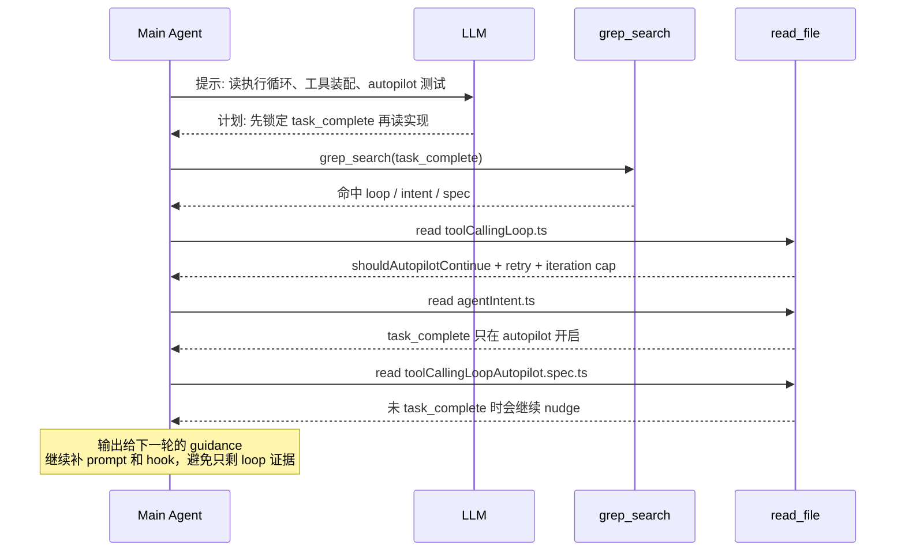
```mermaid
sequenceDiagram
    participant AgentMain as Main Agent
    participant Model as LLM
    participant G as grep_search
    participant R as read_file

    AgentMain->>Model: 提示: 读执行循环、工具装配、autopilot 测试
    Model-->>AgentMain: 计划: 先锁定 task_complete 再读实现
    AgentMain->>G: grep_search(task_complete)
    G-->>AgentMain: 命中 loop / intent / spec
    AgentMain->>R: read toolCallingLoop.ts
    R-->>AgentMain: shouldAutopilotContinue + retry + iteration cap
    AgentMain->>R: read agentIntent.ts
    R-->>AgentMain: task_complete 只在 autopilot 开启
    AgentMain->>R: read toolCallingLoopAutopilot.spec.ts
    R-->>AgentMain: 未 task_complete 时会继续 nudge
    Note over AgentMain: 输出给下一轮的 guidance<br/>继续补 prompt 和 hook，避免只剩 loop 证据
```

#### Turn 2 补充：为什么这一轮不再泛搜，而是“1 个 grep + 3 个大块 read_file”

Turn 2 的关键变化不是“找到了更多文件”，而是**prompt 里的目标函数变了**。到 Turn 1 结束时，模型已经知道这件事高度集中在 `task_complete`、`autopilot`、`stop`、`execution loop` 这一簇语义上，所以它不再需要继续用宽关键词猜方向，而是要把“完成协议到底怎么落地”一次读透。trajectory 里的本轮工作提示也已经从“定位文档、提示词和执行循环代码”收缩成“直接读执行循环、工具集装配和测试”。

这一步很符合默认 agent 指令的两个具体约束。第一，[src/extension/prompts/node/agent/defaultAgentInstructions.tsx](../../../src/extension/prompts/node/agent/defaultAgentInstructions.tsx) 明确要求不要在没有上下文时做假设，但一旦方向明确，就应该继续 gather context 直到把任务做完整。第二，同一个文件还要求 `read_file` 优先读“大块、有意义的上下文”，而不是连续的小切片。所以这一轮的动作变成了一个很典型的“收口组合”：先用一次 `grep_search(task_complete)` 把精确锚点扇入，再分别大块读取实现文件和测试文件。

为什么是这三个文件，也可以从用户问题本身反推出来。用户问的不是“哪段 prompt 让它别停”，而是“代码仓库如何保证它不轻易退出”。这类“如何保证”的问题，天然要求至少三类证据同时在场：

1. 运行时主逻辑里确实有这个协议，所以读 [src/extension/intents/node/toolCallingLoop.ts](../../../src/extension/intents/node/toolCallingLoop.ts)。
2. 这个协议不是对所有模式一视同仁，而是和 agent/autopilot 权限绑定，所以读 [src/extension/intents/node/agentIntent.ts](../../../src/extension/intents/node/agentIntent.ts)。
3. 这不是阅读者的主观解读，而是被测试固化过的行为，所以读 [src/extension/intents/test/node/toolCallingLoopAutopilot.spec.ts](../../../src/extension/intents/test/node/toolCallingLoopAutopilot.spec.ts)。

换句话说，Turn 2 的检索策略已经不是“搜索更多概念”，而是在 prompt 的“不要假设、把任务做完整”约束下，把 Turn 1 找到的概念压缩成一个可验证的协议闭环。它之所以不继续用 `semantic_search`，不是因为 semantic 不好用，而是因为这时 exact anchor 已经出现了，继续语义泛搜的边际收益已经很低。

#### Turn 3：补 prompt、hook 和文档口径

##### 一、发送：Turn 3 在 transport 层长什么样

Trajectory 里的 Turn 3，在 `chat.json` 里对应 `toolCallRounds[2]`。它的发送语义和 Turn 2 一样，仍然分两层：逻辑上继承了 Turn 1 + Turn 2 的完整历史；物理上如果 endpoint 走 Responses API，则可以把“上一跳已确认的前缀”折成 `previous_response_id`。这份 case 能直接看到的，是上一跳 marker 已经落成 `ScvjxuRo...`，本轮再继续生成新的 round object：

```json
{
    "response": "执行循环和测试已经证实了最关键的一层：`autopilot` 不是‘模型文本说 done 就结束’...",
    "toolCalls": [
        "read_file(agentPrompt.tsx 90-170)",
        "grep_search(agentIntent.ts compaction)",
        "read_file(toolCallingLoopHooks.spec.ts 600-760)",
        "read_file(docs/prompts.md 150-290)"
    ],
    "statefulMarker": "gXWmaZOG..."
}
```

这一轮在本案例里也没有看到真实的显式 continuation 或 stop-hook query。它仍然是普通 query 分支，只是继续继承前面几轮的 history 和 marker。

也就是说，Turn 3 并不是“把 Turn 2 读到的事实改写成一段摘要，再作为新 user prompt 附加进去”；它仍然是 conversation history 继承，只是 transport 层可以把这段历史压缩引用。

##### 二、回复：Turn 3 为什么会留下新的 marker

对用户可见的层面，Turn 3 只是“我再补读两块”；但对 transport 层，它的真实新增物不只是 4 个 tool calls，还有一个新的 `statefulMarker = gXWmaZOG...`。这意味着下一轮不需要重新证明“前两轮发生过什么”，而是可以把 Turn 3 本身也压入可复用前缀里。

##### Turn 3 请求侧继承 / 新增表

| 请求侧组成 | 这一轮相对上一轮继承 / 新增了什么 | 它为什么会把模型推向跨层补证据 |
| --- | --- | --- |
| 历史 observation | 上一轮已经证明：completion gate 确实存在，而且和 `autopilot` 权限绑定。 | 剩下的问题不再是“有没有”，而是“它是不是整个系统跨层一致的设计”。 |
| 本轮新增目标 | trajectory 里的本轮说明是：`执行循环和测试已经证实了最关键的一层... 我再补读两块...`。 | 这等于告诉模型：runtime 证据够了，下一步去补 prompt、hook、context compaction 这些控制面支柱。 |
| 可复用锚点 | 上一轮已读过 `agentIntent.ts` 与 `toolCallingLoop.ts`，因此这一轮只需要沿着现成文件继续读补充分支，不必重新 discovery。 | 于是工具模式切到 `读 prompt`、`grep compaction`、`读 hooks spec`、`读 docs` 的异构取证。 |

##### Turn 3 回复侧拆解表

| 回复侧组件 | 这轮真实产出 | 对下一轮的作用 |
| --- | --- | --- |
| assistant 计划说明 | `autopilot 不是“模型文本说 done 就结束”，而是“必须显式调用 task_complete 才放行”... 再补 stop hook / yield / retry / 长上下文压缩。` | 把研究对象从单一 completion gate 扩成完整 control plane。 |
| tool batch | 读取 `agentPrompt.tsx`，grep `agentIntent.ts` 里的 compaction / summarizer 入口，读取 `toolCallingLoopHooks.spec.ts` 与 `docs/prompts.md`。 | 这一步不再新增主执行链，而是在补 prompt 层、hook 生命周期、文档口径三类异构证据。 |
| 新增 observation | prompt 明写“先 summary，再 `task_complete`”；`agentIntent.ts` 已经显露 `BackgroundSummarizer` / `SummarizedConversationHistory`；hooks spec 让 stop/subagent/session hook 这条控制面进入视野；`docs/prompts.md` 补到 end-to-end completion 口径。 | 下一轮就可以顺着这些入口深挖 stop hook、yield、retry、background compaction 的运行时闭环。 |

- 本轮可见工作提示：再补 prompt、hooks 和 compaction 证据。
- 本轮工具批次：`read_file` x 3，`grep_search` x 1。
- 本轮核心收获：prompt 明说“先 summary，再 `task_complete`”；hooks 测试说明 stop/subagent stop 也是控制面一部分；`docs/prompts.md` 补到“端到端完成任务”的产品口径。
- 对下一轮的指导：从“有这些机制”转到“这些机制在运行时如何形成兜底闭环”。

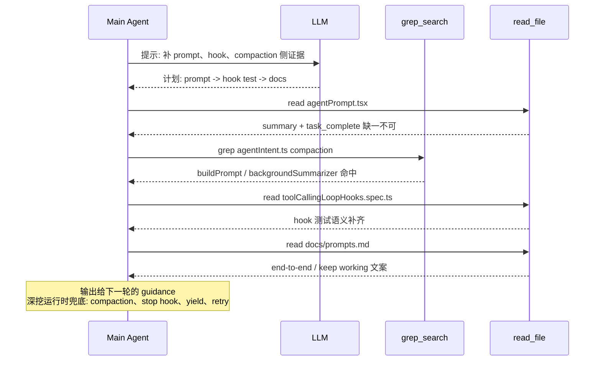
```mermaid
sequenceDiagram
    participant AgentMain as Main Agent
    participant Model as LLM
    participant G as grep_search
    participant R as read_file

    AgentMain->>Model: 提示: 补 prompt、hook、compaction 侧证据
    Model-->>AgentMain: 计划: prompt -> hook test -> docs
    AgentMain->>R: read agentPrompt.tsx
    R-->>AgentMain: summary + task_complete 缺一不可
    AgentMain->>G: grep agentIntent.ts compaction
    G-->>AgentMain: buildPrompt / backgroundSummarizer 命中
    AgentMain->>R: read toolCallingLoopHooks.spec.ts
    R-->>AgentMain: hook 测试语义补齐
    AgentMain->>R: read docs/prompts.md
    R-->>AgentMain: end-to-end / keep working 文案
    Note over AgentMain: 输出给下一轮的 guidance<br/>深挖运行时兜底: compaction、stop hook、yield、retry
```

#### Turn 3 补充：为什么这一轮开始跨层补 prompt、hook 和 docs

Turn 2 已经证明了运行时里有显式完成协议，但只停在这里还不够回答“如何保证”。因为如果只看 loop 和测试，仍然可能把这套行为误读成“某个实现细节碰巧这样写了”。Turn 3 的真实策略变化，是从“证明机制存在”转向“证明这不是单点偶然，而是跨层一致设计”。

这轮为什么会选 prompt、hook、docs 这三层，核心原因正是当前轮 prompt 里已经同时带着 `<reminderInstructions>` 和结构化 `<userRequest>`。前者持续施压“不要遗漏需求，要把问题彻底解释清楚”；后者问的是“仓库如何保证”，这天然要求把产品口径、prompt 约束和运行时控制面连起来。于是模型没有继续沿着 `toolCallingLoop.ts` 往下深挖，而是补了三块缺失层：

1. 读 [src/extension/prompts/node/agent/agentPrompt.tsx](../../../src/extension/prompts/node/agent/agentPrompt.tsx)，确认 autopilot 下 prompt 本身就会再加一层“先 summary，再 `task_complete`”的系统提醒。
2. 读 [src/extension/intents/test/node/toolCallingLoopHooks.spec.ts](../../../src/extension/intents/test/node/toolCallingLoopHooks.spec.ts)，确认停止前并不是“模型一说停就停”，还存在 hook 侧的拦截控制面。
3. 读 [docs/prompts.md](../prompts.md)，确认文档口径也在强调 complete tasks end-to-end、call tools repeatedly，而不是把这件事仅仅留给某段源码自己兜底。

从检索模式上看，Turn 3 其实体现了一种很典型的 agent 收敛动作：**当主因已经大致确定后，下一轮并不一定继续深挖同一文件，而是去找“支撑这条解释成立的异构证据”。** 这也是为什么它在这一轮用了“1 个 grep 锁 compaction 入口 + 3 个 read_file 覆盖 prompt/test/docs”，而不是继续扩大搜索面。

更细一点说，这轮之所以开始看 hook，而不是马上去看 retry/yield，是因为 stop hook 更接近“控制面能否阻止草草收尾”这个原始问题。也就是说，Turn 3 的关键词选择已经不再围绕“完成协议”本身，而是在围绕“还有哪些机制能阻止它过早结束”。这一步本质上是问题重写，不是简单的文件切换。

#### Turn 4：深挖运行时兜底闭环

##### 一、发送：Turn 4 已经进入 marker 链中段

Turn 4 在 `chat.json` 里对应 `toolCallRounds[3]`。到这一步，历史链已经至少有 `xe/k4fCl... -> ScvjxuRo... -> gXWmaZOG...` 三跳，所以它的发送侧不再像 Turn 2 那样还要解释“有没有可压缩前缀”，而是默认已经处在一个稳定的 stateful continuation 里。日志里能直接看到的是本轮 round object：

```json
{
    "response": "我现在补的是‘长跑不掉线’的另外两条支柱：一条是上下文压缩，另一条是停止前的 hook 拦截。",
    "toolCalls": [
        "read_file(agentIntent.ts 366-650)",
        "grep_search(toolCallingLoopHooks.spec.ts stop hook)",
        "read_file(toolCallingLoopHooks.spec.ts 760-980)",
        "grep_search(toolCallingLoop.ts yield/retry/limit)"
    ],
    "statefulMarker": "LTqg7y0C..."
}
```

但这里的 `stateful continuation` 仍然只是 transport/history 意义上的连续轮次，不等于 `query = Please continue`。这次样本的 Turn 4 也没有显示出 stop hook 改写 query 的实际发送痕迹。

这里最值得注意的是：本轮研究对象已经从“完成协议是否存在”变成“长链路支撑件是否齐全”，而 marker 链保证它可以不丢前情地持续深挖。

##### 二、回复：Turn 4 的输出不只是文字，而是新的 continuation checkpoint

用户看到的是一句工作提示和 4 次工具调用；transport 层真正新增的是 `LTqg7y0C...` 这个 checkpoint。后面 Turn 5 再去回收 prompt 文案和 schema 时，继承的就不只是“存在 completion gate”这件事，而是连 compaction / stop hook / yield / retry 这些运行时证据也一起被带上了。

##### Turn 4 请求侧继承 / 新增表

| 请求侧组成 | 这一轮相对上一轮继承 / 新增了什么 | 它为什么把问题改写成“长跑支撑机制” |
| --- | --- | --- |
| 历史 observation | 现在已经知道 completion gate 存在，而且 prompt / docs 也在持续强调 end-to-end completion。 | 所以新的缺口不再是“能不能继续干”，而是“为什么长链路不会被 context、错误、外部 stop 信号拖垮”。 |
| 本轮新增目标 | trajectory 的本轮说明直接把目标写成：`长跑不掉线的另外两条支柱：上下文压缩 + 停止前 hook 拦截`。 | 这把问题从“完成协议”升级成“运行时兜底闭环”。 |
| 现成入口 | 上一轮已经把 compaction 相关 import 和 hooks spec 文件带进上下文，所以本轮只需要顺着这些入口做 targeted read / grep。 | 工具上体现为：大块读 `buildPrompt()`，再用两次 grep 精确钉 stop hook 与 loop fallback 分支。 |

##### Turn 4 回复侧拆解表

| 回复侧组件 | 这轮真实产出 | 对下一轮的作用 |
| --- | --- | --- |
| assistant 计划说明 | `我现在补的是“长跑不掉线”的另外两条支柱：一条是上下文压缩，另一条是停止前的 hook 拦截。` | 明确把“别轻易停”和“长跑跑得住”拆成两条控制面支柱。 |
| tool batch | 读取 `agentIntent.ts` 的 `buildPrompt()` 大段实现，grep stop hook 相关测试，再读 stop hook case，最后 grep `toolCallingLoop.ts` 的 `yieldRequested` / retry / tool limit 扩容。 | 这一批调用直接把 background compaction、stop hook veto、yield、retry、limit 扩容并排摆到台面上。 |
| 新增 observation | `buildPrompt()` 有 75% / 95% 双阈值 background compaction；Stop hook 可返回 `decision=block` 和理由继续 loop；`yieldRequested` 在 autopilot 下不会轻易 break；失败可自动 retry，tool-call limit 可向 200 扩容。 | 到这里，“为什么能持续跑”已经不再只靠 prompt 或完成工具，而是完整 runtime fallback stack。 |

- 本轮可见工作提示：深挖 stop hook、yield、retry 和背景压缩。
- 本轮工具批次：`read_file` x 2，`grep_search` x 2。
- 本轮核心收获：`buildPrompt()` 里有 75% / 95% 双阈值 background compaction；stop hook 可以显式阻止退出；loop 还会处理 yield、自动重试和 tool-call-limit 扩容。
- 对下一轮的指导：实现面已经够了，接下来回收表达层证据和工具 schema，准备最终回答的叙述层。

```mermaid
sequenceDiagram
    participant AgentMain as Main Agent
    participant Model as LLM
    participant G as grep_search
    participant R as read_file

    AgentMain->>Model: 提示: 深挖 stop hook / yield / retry / compaction
    Model-->>AgentMain: 计划: 先读 buildPrompt，再钉 stop hook 和 loop 细节
    AgentMain->>R: read agentIntent.ts 366-650
    R-->>AgentMain: background compaction 双阈值
    AgentMain->>G: grep hook spec stop hook
    G-->>AgentMain: 锁定 executeStopHook 测试段
    AgentMain->>R: read hook spec 760-980
    R-->>AgentMain: block 示例: Tests are failing...
    AgentMain->>G: grep toolCallingLoop.ts yield/retry/limit
    G-->>AgentMain: 命中 yield / auto-retry / limit<200
    Note over AgentMain: 输出给下一轮的 guidance<br/>回收 prompt 文案和 task_complete schema，补回答的可解释层
```

#### Turn 4 补充：为什么这一轮专门深挖 compaction、hook、yield、retry

到 Turn 3 结束时，模型其实已经知道“它不会轻易停”至少有两条原因：prompt 在催，autopilot 协议在卡。但用户问题里还有一个词没有被真正吃透，就是 `long run execution`。这不是“别停”就够了，它还隐含着另外两个子问题：长链路上下文会不会塌，执行中遇到错误或外部停止信号时会不会提前断。所以 Turn 4 的检索策略自然从“完成信号”切换成“长跑支撑机制”。

这一轮的文件选择非常说明问题。它没有再回去读新的 prompt 文件，而是直接进 [src/extension/intents/node/agentIntent.ts](../../../src/extension/intents/node/agentIntent.ts) 的 `buildPrompt()` 大段实现，原因是 compaction 不再是文案层概念，而是 prompt 构造阶段的运行时策略；同时它又去钉 [src/extension/intents/test/node/toolCallingLoopHooks.spec.ts](../../../src/extension/intents/test/node/toolCallingLoopHooks.spec.ts) 里的 stop hook block case，以及 [src/extension/intents/node/toolCallingLoop.ts](../../../src/extension/intents/node/toolCallingLoop.ts) 里的 `yieldRequested`、auto-retry、tool-call-limit 扩容逻辑，原因是这些才是“长跑中途不塌掉”的兜底件。

从 prompt 角度看，这一轮的行为也很好解释。默认 agent 指令反复强调的是“把任务做完整”，而不是“找到第一条解释就停”。一旦模型在前两轮已经得到了 completion protocol，它就会自然发现解释仍然不完整，因为它还没回答：

1. 上下文变长时怎么办。
2. 出现 transient error 时怎么办。
3. 系统要求 yield 或接近工具调用上限时怎么办。
4. stop hook 阻止退出时，原因如何重新喂回下一轮 prompt。

所以 Turn 4 的检索不再像 Turn 2 那样围绕一个标识符展开，而是围绕一组“续跑支撑机制”展开。这也是为什么它采用的是“2 次 targeted read + 2 次精确 grep”的组合：现在不是在找入口，而是在补齐漏掉的运行时边角。换句话说，这一轮是从“完成协议”升级到“长链路控制面”。

#### Turn 5：回收 prompt 文案和工具层语义

##### 一、发送：Turn 5 已经从 discovery 转入 packaging，但 transport 结构没变

Turn 5 在 `chat.json` 里对应 `toolCallRounds[4]`。这一轮语义上已经开始从 discovery 切换到 packaging，所以工具数变少，动作也更像 citation / wording harvesting；但 transport 层的结构并没有变，仍然是“可见回复 + 工具批次 + 新 marker”：

```json
{
    "response": "核心链路已经比较清楚了：这套设计是‘提示词约束 + 显式完成协议 + 停止拦截 + 上下文压缩 + 错误重试/额度扩展’叠加起来...",
    "toolCalls": [
        "grep_search(src/extension/prompts/** fully completed...)",
        "grep_search(docs/** complete tasks end-to-end...)",
        "read_file(copilotCLITools.ts 220-260)"
    ],
    "statefulMarker": "rEbnmuTv..."
}
```

这一轮同样没有实际发出显式 continuation 或 stop-hook query；它只是普通多轮 agent 请求继续向“准备回答”阶段收口。

这正好说明：Turn 5 虽然研究目标已经从“继续发现”切到“准备回答”，但它仍然是一轮正常的 tool-calling round，而不是直接开始 final answer。

##### 二、回复：Turn 5 为什么仍然要生成 marker

因为最终回答还没开始，系统仍然需要一个新的 continuation checkpoint，把“prompt 文案、docs 口径、task_complete schema 已经回收完”这个事实写回历史。这个 checkpoint 在日志里就是 `statefulMarker = rEbnmuTv...`。

##### Turn 5 请求侧继承 / 新增表

| 请求侧组成 | 这一轮相对上一轮继承 / 新增了什么 | 它为什么要回到“表达层证据” |
| --- | --- | --- |
| 历史 observation | 运行时主链已经基本闭合：入口 lane、completion gate、stop hook、retry、yield、compaction 都已出现。 | 剩下的问题不再是实现有没有，而是最终回答时如何把这些实现翻译成用户能直接理解的语义。 |
| 本轮新增目标 | trajectory 的本轮说明已经改成：`核心链路已经比较清楚了... 最后我再补一处 prompt/文档侧证据`。 | 这说明模型开始从 discovery 切到 packaging。 |
| 检索成本约束 | 由于主理解已经完成，本轮不再需要大块重读 runtime 文件，只要回收 prompt 文案、docs 口径和 tool schema。 | 因此动作缩成 `2 个 grep + 1 个短 read_file`。 |

##### Turn 5 回复侧拆解表

| 回复侧组件 | 这轮真实产出 | 对下一轮的作用 |
| --- | --- | --- |
| assistant 计划说明 | `这套设计是“提示词约束 + 显式完成协议 + 停止拦截 + 上下文压缩 + 错误重试/额度扩展”叠加起来...` | 这实际上已经给最终答案搭好了 5 段式提纲。 |
| tool batch | grep prompt 里 `fully completed the task` / `task is not complete`，grep docs 里 end-to-end completion 文案，再读取 `copilotCLITools.ts` 里的 `TaskCompleteTool` schema。 | 把 runtime 机制重新翻译回“模型被如何要求完成任务”这层语义。 |
| 新增 observation | prompt 明写“fully completed the task”与“summary + `task_complete` 缺一不可”；`docs/prompts.md` 强调 complete tasks end-to-end / don't give up；`task_complete` 的工具 schema 只带一个可选 `summary` 字段。 | 这让最终回答可以同时说清“runtime 怎么卡”与“完成在工具层如何被显式建模”。 |

- 本轮可见工作提示：回收 prompt / docs / `task_complete` 表达层证据。
- 本轮工具批次：`grep_search` x 2，`read_file` x 1。
- 本轮核心收获：prompt 与 docs 都在反复强调“complete tasks end-to-end”；工具层 `task_complete` 只带一个可选 `summary` 字段，说明“完成”被显式建模成单独工具。
- 对下一轮的指导：不再扩展理论，只回收最终引用所需的精确源码锚点。

```mermaid
sequenceDiagram
    participant AgentMain as Main Agent
    participant Model as LLM
    participant G as grep_search
    participant R as read_file

    AgentMain->>Model: 提示: 回收 prompt / docs / task_complete 语义
    Model-->>AgentMain: 计划: 文案对照 + 工具 schema
    AgentMain->>G: grep prompts/** fully completed / summary
    G-->>AgentMain: 命中 task_complete 文案
    AgentMain->>G: grep docs/** end-to-end / call tools repeatedly
    G-->>AgentMain: 命中 prompts.md 行文
    AgentMain->>R: read copilotCLITools.ts
    R-->>AgentMain: task_complete.arguments.summary?
    Note over AgentMain: 输出给下一轮的 guidance<br/>下一轮只取最终 answer 需要的精确行位
```

#### Turn 5 补充：为什么又回到 prompt 文案和 tool schema，而不是继续往 runtime 深挖

Turn 5 看上去像是在“后退”，其实是在做最后一次证据整形。到 Turn 4 为止，模型已经掌握了大量实现细节，但如果直接据此回答，最终产物会很容易变成一段只有工程师能读懂的源码流水账。用户问的是“如何保证它能 long run execution 而不轻易退出”，这要求最终解释既要讲控制面，也要讲对模型来说“完成”到底是怎么被表达和要求的。因此 Turn 5 回到 prompt 文案和 `task_complete` schema，本质上是在把深层实现翻译回可解释语义。

这一轮只用了 2 次 grep 和 1 次小范围 `read_file`，也说明它的目标已经不是 discovery，而是 packaging：

1. 在 [src/extension/prompts/node/agent/agentPrompt.tsx](../../../src/extension/prompts/node/agent/agentPrompt.tsx) 里，回收“fully completed the task”“先给 summary 再 `task_complete`”这些直白文案。
2. 在 [docs/prompts.md](../prompts.md) 里，回收 complete tasks end-to-end、call tools repeatedly、don't give up 这种更高层的产品/调优口径。
3. 在 [src/extension/chatSessions/copilotcli/common/copilotCLITools.ts](../../../src/extension/chatSessions/copilotcli/common/copilotCLITools.ts) 里，确认 `task_complete` 的参数模型只有一个可选 `summary`，也就是“完成”在工具层就是被显式建模成一个独立动作，而不是普通回答里的某句自然语言。

这说明 Turn 5 的策略已经从“再多找一个机制”转成“把已有机制翻译成最终回答可以直接使用的语言”。从 prompt 角度看，这也正符合这类 agent 在后期的常见行为模式：当源码理解已经足够时，下一轮不再追求新增发现，而是去找最能降低解释成本的证据形态。`grep_search` 在这里扮演的不是搜索器，而是“文案回收器”。

#### Turn 6：停止扩面，只回收最终锚点

##### 一、发送：Turn 6 对应的是“最后一次 citation harvest”轮

Turn 6 在 `chat.json` 里对应 `toolCallRounds[5]`。这一轮已经不再读大段文件，只做 3 次 `grep_search` 去钉精确行位，所以它在 transport 层也呈现出一种很明显的“临近收口”形态：工具仍在调用，但全部是低成本、精定位动作。

```json
{
    "response": "我已经拿到足够的源码证据了，最后整理时我会把‘为什么它能持续跑’和‘为什么它仍然是可控的’分开讲...",
    "toolCalls": [
        "grep_search(agentIntent.ts autopilot / location / iterations)",
        "grep_search(toolCallingLoop.ts retry / iteration / yield)",
        "grep_search(agentIntent.ts background compaction)"
    ],
    "statefulMarker": "yq+9a6t1..."
}
```

本案例的 Turn 6 也还是普通 query 分支，没有出现 `Please continue` 或 hook reason 作为当前轮 query 的直接证据。

这说明 Turn 6 在 transport 层仍然不是 final answer，它只是最后一次把“最终引用所需锚点”写回可复用历史。

##### 二、回复：Turn 6 的 marker 还不是最终答案前的最后一跳

如果只看 trajectory，很容易以为 Turn 6 之后就直接进入 Final Turn；但 `chat.json` 更细，它告诉我们中间其实还有一个“pre-final 收束 commentary round”。所以 `yq+9a6t1...` 是 Turn 6 的 marker，但并不是 final_answer 真正继承的最后一个 marker。

##### Turn 6 请求侧继承 / 新增表

| 请求侧组成 | 这一轮相对上一轮继承 / 新增了什么 | 它为什么只剩 citation harvesting |
| --- | --- | --- |
| 历史 observation | 结论层已经闭合：入口 lane、显式完成、stop hook、yield / retry / limit、background compaction、prompt / docs 口径都已经在手。 | 剩下缺的不是理解，而是最终回答时每一段该落在哪个源码锚点上。 |
| 本轮新增目标 | trajectory 的本轮说明是：`我已经拿到足够的源码证据了... 分开讲“为什么它能持续跑”和“为什么它仍然是可控的”`。 | 这相当于明确进入 final drafting 前的 citation harvest 阶段。 |
| 成本最小化策略 | 由于文件内容已经读过，本轮不再用 `read_file` 重复理解，而是只用 `grep_search` 抓精确行位。 | 这正是 agent 后期最典型的行为：停止扩面，开始收口。 |

##### Turn 6 回复侧拆解表

| 回复侧组件 | 这轮真实产出 | 对最终轮的作用 |
| --- | --- | --- |
| assistant 计划说明 | `我已经拿到足够的源码证据了... 最后整理时我会把“为什么它能持续跑”和“为什么它仍然是可控的”分开讲。` | 直接规定了最终回答的叙述结构。 |
| tool batch | grep `agentIntent.ts` 里的 `task_complete` 开关、`maxToolCallIterations`、`ChatLocation.Agent`；grep `toolCallingLoop.ts` 的 retry / iteration / yield；grep background compaction threshold 相关注释与分支。 | 把最终答案里最关键的引用点一次性钉死。 |
| 新增 observation | 精确拿到了 `task_complete` 只在 autopilot 开启、Agent lane 的 `overrideRequestLocation` / `maxToolCallIterations`、`MAX_AUTOPILOT_RETRIES=3` / `MAX_AUTOPILOT_ITERATIONS=5`、以及 background compaction 的 75% / 95% 阈值锚点。 | 因此 Final Turn 已经不需要任何新工具调用，只要组织答案即可。 |

- 本轮可见工作提示：回收最终源码锚点。
- 本轮工具批次：`grep_search` x 3。
- 本轮核心收获：把 `task_complete` 开关、`maxToolCallIterations`、`ChatLocation.Agent`、retry / iteration cap / yield、background compaction 阈值都钉到了最终回答可直接引用的源码位置。
- 对下一轮的指导：证据已经闭合，不再调用工具，直接组织最终答复。

```mermaid
sequenceDiagram
    participant AgentMain as Main Agent
    participant Model as LLM
    participant G as grep_search

    AgentMain->>Model: 提示: 回收最终源码锚点
    Model-->>AgentMain: 计划: 只抓 answer 所需精确行位
    AgentMain->>G: grep agentIntent.ts autopilot / location / iterations
    G-->>AgentMain: 命中 task_complete 开关、maxToolCallIterations、ChatLocation.Agent
    AgentMain->>G: grep toolCallingLoop.ts retry / iteration / yield
    G-->>AgentMain: 命中 MAX_AUTOPILOT_RETRIES / MAX_AUTOPILOT_ITERATIONS / yield
    AgentMain->>G: grep agentIntent.ts background compaction thresholds
    G-->>AgentMain: 命中 75% / 95% 双阈值与 post-render 分支
    Note over AgentMain: 输出给最终轮的 guidance<br/>停止搜索，开始综合回答
```

#### Turn 6 补充：为什么这一轮只做精确锚点回收

Turn 6 最值得注意的不是“又 grep 了 3 次”，而是**它已经不再试图增加理解，只是在回收坐标**。前五轮之后，模型对这次问题的核心解释其实已经闭合了：prompt 会催完成、tool set 会把 `task_complete` 变成显式完成信号、loop 会在 stop 前继续 nudge、hook 会拦截过早退出、background compaction/retry/yield/limit 扩容会支撑长链路继续跑。剩下没完成的工作，只是把这些结论各自钉到最终回答能直接引用的位置上。

这一步为什么不用 `read_file`，而改成全 `grep_search`，也很符合 prompt 的后期策略。默认指令里有一句非常关键：不要在 tool call 之后重复自己，要从上一步继续往前走。放在这里，它的实际含义就是：既然文件内容已经读过，下一步就不该再用大块 `read_file` 重复建立理解，而应该用最小成本提取精确锚点。因此这一轮的 3 次 grep 分别承担了三种“定位”职责：

1. 在 [src/extension/intents/node/agentIntent.ts](../../../src/extension/intents/node/agentIntent.ts) 里定位 `task_complete` 开关、`maxToolCallIterations` 和 `ChatLocation.Agent`。
2. 在 [src/extension/intents/node/toolCallingLoop.ts](../../../src/extension/intents/node/toolCallingLoop.ts) 里定位 `MAX_AUTOPILOT_RETRIES`、`MAX_AUTOPILOT_ITERATIONS`、`yieldRequested` 和 autopilot continue 相关逻辑。
3. 在 [src/extension/intents/node/agentIntent.ts](../../../src/extension/intents/node/agentIntent.ts) 里定位 background compaction 的 75% / 95% 双阈值与 post-render 分支。

所以 Turn 6 的 prompt 作用，不再是驱动模型“搜什么概念”，而是在驱动它“停止扩面、准备收口”。这也是为什么这轮之后就自然进入 Final Turn 了。严格说，Turn 6 已经不是研究轮，而是最终回答前的 citation-harvesting 轮。

#### Final Turn：不再搜，直接回答

##### 一、发送：Final Turn 在真实日志里其实分成两跳

这一点是 `chat.json` 相比 trajectory 最有价值的补充：trajectory 把最后阶段压成“Turn 6 -> Final Turn”，但 transport 层实际上还多保留了一个 pre-final 收束 round。

先是一个仍带工具调用的 commentary round：

```json
{
    "response": "我补完了。可以明确地说，这套实现不是靠‘模型更自觉’来防止草草收尾，而是把‘继续执行’做成了一个有完成协议、有停止拦截、有预算管理的运行时。下面我给你整理成源码导向的结论。",
    "toolCalls": [
        "grep_search(toolCallingLoop.ts Stop hook result...)",
        "grep_search(agentPrompt.tsx task_complete wording)",
        "grep_search(test/node/*.spec.ts should keep nudging... )"
    ],
    "statefulMarker": "XpgGHnw2..."
}
```

这个 pre-final round 仍然不是显式 continuation 或 stop-hook query，它只是最后一次 citation harvest。最终 `final_answer` 那一跳更是纯综合输出，没有再构造新的特殊 continuation query。

然后才是最终的 `final_answer` round：

```json
{
    "response": "这套仓库不是靠一句‘请持续工作直到完成’去赌模型自觉，而是把‘不要草草收尾’做成了运行时协议...",
    "toolCalls": [],
    "phase": "final_answer",
    "statefulMarker": "yVJYVms5..."
}
```

所以从 transport 角度看，Final Turn 真正继承的最近一跳不是 Turn 6 的 `yq+9a6t1...`，而是 pre-final round 的 `XpgGHnw2...`。这就是为什么 `chat.json` 的 marker 链会比正文里按语义压缩后的 Turn 数多出一跳。

##### 二、回复：Final Turn 为什么可以不再调用工具

因为到 `phase: "final_answer"` 这一跳，所有需要补的锚点都已经在前一轮收齐了。它不再需要产出新的 observation，只需要把已有 observation 从“runtime 事实”翻译成“用户能直接理解的结构化机制说明”。这也是为什么最终 round 的 `toolCalls` 为空，但仍然会留下一个 final `statefulMarker = yVJYVms5...`。

##### Final Turn 请求侧继承 / 新增表

| 请求侧组成 | Final Turn 真正带着什么进场 | 它如何决定最终答案的结构 |
| --- | --- | --- |
| 6 轮累计 observation | 已经累计到 5 类证据：Agent lane、显式完成协议、stop hook / autopilot continue、yield / retry / limit fallback、background compaction，以及 prompt / docs / tool schema 的表达层证据。 | 所以最终回答不再需要 discovery，而是把这些 observation 压缩成几条机制解释。 |
| 上轮新增叙述目标 | 上一轮已经明确：最终要把“为什么它能持续跑”和“为什么它仍然可控”分开讲。 | 这解释了为什么 Final Turn 的答案不是流水账，而是先给总论，再按机制分段。 |
| 精确源码锚点 | Turn 6 刚刚回收了 `agentIntent.ts`、`toolCallingLoop.ts`、`agentPrompt.tsx`、测试文件与 docs 的精确行位。 | 因此 Final Turn 可以直接输出源码级答案，而无需再读文件确认。 |

##### Final Turn 回复侧拆解表

| 回复侧组件 | Final Turn 真实产出 | 应该怎么理解 |
| --- | --- | --- |
| 开场总论 | `不是靠一句“请持续工作直到完成”去赌模型自觉，而是把“不要草草收尾”做成了运行时协议。` | 这是前 6 轮所有 observation 的压缩版 thesis。 |
| 结构化正文 | 答案按 7 个编号段展开：Agent lane、显式完成协议、内部 stop hook、yield 抑制、retry / tool-call-limit 扩容、外部 Stop hook veto、background compaction。 | 这说明模型没有再去“讲故事”，而是在把前面 6 轮的证据分桶归并。 |
| 边界条件 | 最后单独补了一句：最强 completion gate 主要属于 `autopilot`；普通 agent mode 也会多轮执行，但没有这么硬的 `task_complete` 闸门。 | 这一步很关键，因为它避免把 autopilot 的强约束误写成所有 agent request 的通用性质。 |
| 工具调用 | 无新 tool calls。 | 这是证据闭合的标志：Final Turn 已经进入纯综合输出阶段。 |

- 本轮可见工作提示：没有新的工具计划。
- 本轮工具批次：无。
- 本轮核心动作：把前 6 轮 observation 压成 4 类机制说明，也就是提示词约束、显式完成协议、停止前拦截、长上下文与失败恢复。
- 这正是这次样本最重要的信号：**agent 不是“看起来差不多了就停”，而是“证据闭合以后才停”。**

```mermaid
sequenceDiagram
    participant AgentMain as Main Agent
    participant Model as LLM
    actor User

    AgentMain->>Model: 输入: 前 6 轮 observation 汇总
    Model-->>AgentMain: 输出: 组织成 4 类机制
    AgentMain->>User: 最终结构化解释
    Note over AgentMain,User: Final turn 无工具调用<br/>只做证据归并与结论输出
```

### 17.7 这一节真正想说明什么

如果只记一件事，那就是：

1. 这次样本不是线性的“搜一次然后答”。
2. 它也不是“系统自动走了最复杂的 `Codebase + SearchSubagent` 分支”。
3. 它实际展示的是另一种很常见的 agent 工作方式：主代理自己连续多轮规划检索，再用少量高确定性的工具把证据钉死。

换句话说，这次样本真正说明的不是“高级检索器一定会被用上”，而是**即便只用 `grep_search + read_file`，Agent 也会通过多轮重规划把一个抽象问题逐步压缩成可验证的源码级结论。**

### 17.8 一句话总结

> 当前这次真实样本，可以看成“一条由主代理自己驱动的 6 轮只读研究链”：先宽搜、再锁点、再补机制、再回收锚点，最后才允许自己停下来做综合回答。

---

## 18. 把主代理、搜索子代理、执行子代理放进同一张总图里

如果第 17 节解决的是“时间上怎么推进”，这一节解决的就是“结构上到底有哪三条链，它们各自做什么，又怎么互相对接”。

因为只要把三条链放到一张图里，很多前面看起来零散的结论就会立刻变得稳定：

1. 为什么主代理应该尽量保持 orchestration 角色
2. 为什么 `search_subagent` 和 `execution_subagent` 都不是另一个主代理
3. 为什么观测层又会把它们统一回 `runSubagent` 语义

### 18.1 先给结论

把三条链压成一句话：

> 主代理负责拆问题、选路径、做最终收敛；`search_subagent` 负责只读研究；`execution_subagent` 负责受限执行；三者在任务语义上分工明确，但在可观测结构上又都能回收到统一的子代理调用模型里。

### 18.2 一张三链总图

```mermaid
flowchart TD
    U[用户请求] --> M[Main Agent Loop]

    M --> MP[主提示词与策略判断]
    MP --> MC{选择哪类动作}

    MC -->|本轮上下文增强| CB[Codebase 预取]
    MC -->|精确定位/验证| FT[grep_search / search_workspace_symbols / read_file]
    MC -->|大范围只读研究| SS[search_subagent]
    MC -->|受限执行任务| ES[execution_subagent]

    CB --> M
    FT --> M

    SS --> SS1[SearchSubagent Loop]
    SS1 --> SS2[Codebase]
    SS1 --> SS3[FindTextInFiles]
    SS1 --> SS4[FindFiles]
    SS1 --> SS5[ReadFile]
    SS5 --> SSR[研究摘要 + toolMetadata]
    SSR --> M

    ES --> ES1[ExecutionSubagent Loop]
    ES1 --> ES2[run_in_terminal]
    ES2 --> ESR[执行摘要 + toolMetadata]
    ESR --> M

    M --> OUT[最终解释 / 方案 / 结论]

    SS --> OBS[runSubagent 统一子代理语义]
    ES --> OBS
    OBS --> TX[Transcript / Request Logger / Trajectory / OTel]
```

### 18.3 三条链各自的“职责中心”不同

三条链最根本的差别不在名字，而在职责中心：

| 链 | 职责中心 | 最擅长做什么 | 最不该做什么 |
| --- | --- | --- | --- |
| 主代理 | orchestration | 拆问题、选工具、判断收敛、组织最终答案 | 把所有探索工作都自己摊平做完 |
| `search_subagent` | research | 只读探索、压缩上下文、缩小搜索范围 | 越权执行、长期占据主任务链 |
| `execution_subagent` | action | 执行终端任务、返回紧凑执行摘要 | 承担大范围代码研究工作 |

这张表背后的设计意图非常明确：

1. 把“思考怎么做”尽量留给主代理
2. 把“广泛搜集材料”下沉给搜索子代理
3. 把“具体执行动作”下沉给执行子代理

### 18.4 为什么这样分层更稳

如果没有这种三链分工，系统就会很快退化成两个极端之一：

1. 主代理什么都自己做，导致主链过长、上下文嘈杂、研究步骤污染最终推理
2. 子代理变成全能代理，导致边界不清、轨迹失真、可观测性难归一

现在这套设计实际上是在同时避免这两个极端：

1. 主代理保持 orchestration
2. specialized subagent 保持单一任务域
3. 观测层保持统一结构协议

### 18.5 为什么 `Codebase` 不单独算第四条代理链

这也是一个很容易混淆的点。

`Codebase` 很重要，但它通常不该被理解成第四条“代理链”，原因是：

1. 它更像 retrieval primitive / prompt augmentation primitive
2. 它既可以被主代理用，也可以被 `search_subagent` 内部用
3. 它本身不承担“独立会话 + 独立目标 + 独立收敛”的 worker 角色

所以更合理的说法是：

1. 主代理、搜索子代理、执行子代理是三条角色链
2. `Codebase` 是这些角色链都可能复用的检索 primitive

### 18.6 用同一套观测语言重新描述三条链

如果切到观测层，这三条链又可以被重新描述成：

1. 一条父代理主轨迹
2. 若干子代理引用节点
3. 每个子代理节点下各自展开的子轨迹

此时：

1. `search_subagent` 和 `execution_subagent` 的任务差异仍然存在
2. 但它们都被归到“subagent invocation”这一共同结构语义里

这就是为什么在 debug / trajectory / tracing 视角里，经常会感觉：

1. 上层是三条不同职责链
2. 下层又像一套统一的父子代理协议

这不是矛盾，而是设计目标。

### 18.7 一张“产品层 vs 观测层”对照图

```mermaid
flowchart LR
    subgraph ProductLayer[产品与任务语义层]
        M1[Main Agent]
        S1[search_subagent]
        E1[execution_subagent]
    end

    subgraph ObservabilityLayer[观测与结构语义层]
        P1[Parent Agent Trajectory]
        C1[Subagent Invocation]
        C2[Subagent Invocation]
        O1[Transcript / Request Logger / OTel]
    end

    M1 --> S1
    M1 --> E1

    M1 --> P1
    S1 --> C1
    E1 --> C2
    C1 --> O1
    C2 --> O1
```

### 18.8 在整份报告里的位置

这一小节只回答一个承上启下的问题：为什么在案例时间线之后，还要再补一张主代理、搜索子代理、执行子代理的结构总图。

1. 第 17 节解决的是时间顺序。
2. 第 18 节解决的是角色分层。
3. 两节合在一起，才把前文的通用机制落实成既能按时间理解、又能按职责理解的完整图景。

### 18.9 一句话总结

> 主代理、搜索子代理、执行子代理构成的是“三条职责不同、观测上可归一”的协作链：主代理负责编排与收敛，搜索子代理负责研究，执行子代理负责动作，而 `Codebase` 这样的检索 primitive 则在这些链之间被复用，而不是自成一条独立代理链。

---

## 19. 术语总表：把这一专题里的关键概念统一成一套词汇

到这里，专题里已经反复出现了很多关键词。如果不在最后把这些词重新压成一套统一词汇表，读者很容易出现两种情况：

1. 每个词都见过，但边界仍然有些重叠
2. 局部理解正确，但换到另一节时又把不同层的概念混在一起

所以这一节不再引入新机制，只做一件事：**把前文高频概念统一成一套可复用的术语表。**

### 19.1 先给结论

把这一专题最重要的术语压成一句话：

> `Codebase` 是 retrieval / augmentation primitive，`SearchSubagent` 和 `ExecutionSubagent` 是 specialized workers，`runSubagent` 是更底层的通用委派语义，transcript / request logger / trajectory / OTel 则是四套互补的可观测系统。

### 19.2 核心术语总表

| 术语 | 最短定义 | 所在层级 | 最容易和谁混淆 |
| --- | --- | --- | --- |
| `Codebase` | 面向代码语义检索的 retrieval primitive，也可作为 prompt augmentation 管道的一部分 | 检索层 / prompt augmentation 层 | 普通 tool call、完整子代理 |
| `SearchSubagent` / `search_subagent` | 只读代码库研究 worker，用于大范围搜索、阅读、压缩研究结果 | specialized subagent 层 | 普通并行搜索、主代理自己查到底 |
| `ExecutionSubagent` / `execution_subagent` | 受限执行 worker，用于把小型执行任务压缩到子 loop 里完成 | specialized subagent 层 | 主代理直接 `run_in_terminal` |
| `runSubagent` | 通用“调用一个子代理”的结构语义 / delegation primitive | 通用委派与观测归一层 | `search_subagent`、`execution_subagent` |
| transcript | 按轮次记录对话与工具事件的回放型记录 | 会话事件层 | request logger、trajectory |
| request logger | 保留请求、工具、prompt trace、metadata 等原始证据的记录层 | 原始调试证据层 | transcript、trajectory |
| trajectory | 把 agent step、tool call、observation、父子代理引用结构化表达出来的轨迹层 | 结构化执行轨迹层 | transcript |
| OTel | 以 span 形式记录运行时层级、时序和性能的 tracing 系统 | 运行时 tracing 层 | transcript、trajectory |
| `subAgentInvocationId` | 串联父工具调用、子会话、trajectory 引用和 tracing 的身份主键 | 跨层连接键 | 普通 tool call id |
| prompt augmentation | 在模型生成 tool call 之前，系统先把检索结果注入 prompt 的路径 | prompt 构建层 | 普通 tool history |
| retrieval primitive | 负责“找材料”的基础能力，不等于独立 agent | 检索层 | worker、subagent |
| specialized worker | 为某类任务预封装好工具边界、prompt 和输出 contract 的子代理 | 任务封装层 | 通用 delegation primitive |

### 19.3 最容易混淆的三组概念

前面最容易反复混掉的，基本就是下面三组。

#### A. `Codebase` vs `SearchSubagent`

正确区分方式：

1. `Codebase` 负责“找语义相关材料”
2. `SearchSubagent` 负责“围绕一个研究子任务，多轮地使用若干搜索/读文件能力并压缩结果”

因此：

1. `Codebase` 更像 primitive
2. `SearchSubagent` 更像 worker

#### B. `search_subagent` vs `runSubagent`

正确区分方式：

1. `search_subagent` 是任务语义，表示“代码库研究 worker”
2. `runSubagent` 是更底层的结构语义，表示“发生了一次子代理委派”

因此：

1. 上层 prompt 更关心 `search_subagent`
2. 下层观测更容易统一到 `runSubagent`

#### C. transcript vs request logger vs trajectory vs OTel

正确区分方式：

1. transcript 用来看轮次叙事
2. request logger 用来看原始请求与工具证据
3. trajectory 用来看结构化父子轨迹
4. OTel 用来看 span 层级和时序性能

因此它们是四种视角，不是四份重复日志。

### 19.4 一张“从下到上”的术语分层图

```mermaid
flowchart BT
    A[OTel / Span 层级与时序]
    B[Trajectory / 结构化执行轨迹]
    C[Request Logger / 原始请求与工具证据]
    D[Transcript / 轮次事件回放]
    E[runSubagent / 通用委派结构语义]
    F[search_subagent / execution_subagent / specialized workers]
    G[Codebase / grep_search / search_workspace_symbols / retrieval primitives]
    H[Main Agent / orchestration]

    A --> B
    B --> C
    C --> D
    E --> A
    F --> E
    G --> F
    G --> H
    H --> F
```

这张图表达的是：

1. 最上层是主代理如何编排
2. 中间层是检索 primitive 和 specialized workers 如何分工
3. 下层是观测系统如何从不同角度记录这些动作

### 19.5 一张“看到这个词时应该立刻想到什么”速查表

| 看到的词 | 应该立刻想到什么 |
| --- | --- |
| `Codebase` | 不是单纯普通工具，它可能走预取增强路径 |
| `SearchSubagent` | 不是一次搜索，而是一条受限只读研究 loop |
| `ExecutionSubagent` | 不是主代理自己执行，而是受限执行 worker |
| `runSubagent` | 这是子代理委派的通用结构语义 |
| transcript | 先想“轮次回放” |
| request logger | 先想“原始请求与工具证据仓” |
| trajectory | 先想“结构化步骤与父子引用” |
| OTel | 先想“span、父子层级、耗时” |
| `subAgentInvocationId` | 先想“跨系统串联子代理身份的主键” |

### 19.6 为什么术语统一很重要

因为这个专题真正难的地方，不是机制本身特别多，而是：

1. 同一件事在不同层会用不同名字描述
2. 不同东西又会在某一层被统一回一个更通用的语义
3. 如果术语不收束，读者很容易在不同章节之间来回漂移

例如：

1. 产品层看到的是 `search_subagent`
2. 观测层又常常回到 `runSubagent`
3. 而它内部又可能继续调用 `Codebase`

如果没有这张术语表，这三个词很容易被误当成同一类对象。

### 19.7 在整份报告里的位置

这一小节只回答一个承上启下的问题：为什么在前文已经讲完机制和案例之后，还要再单独收束成一套术语表。

1. 前 1 到 18 节解决的是机制理解和案例复盘。
2. 这一节不增加新机制，只负责把前文知识压缩成一套统一 vocabulary。
3. 所以它在整份报告里的作用，是把“已经理解”进一步变成“可以稳定复用的概念边界”。

也就是说，读完整份报告后，至少应该稳定记住下面这组最短映射：

1. 主代理负责 orchestration
2. `Codebase` 负责 retrieval / augmentation
3. `SearchSubagent` 负责 research
4. `ExecutionSubagent` 负责 action
5. `runSubagent` 负责通用子代理结构语义
6. transcript / request logger / trajectory / OTel 负责四种不同观测视角

### 19.8 一句话总结

> 这个专题真正需要统一的不是“文件名记忆”，而是术语边界：`Codebase` 是 primitive，`SearchSubagent`/`ExecutionSubagent` 是 workers，`runSubagent` 是通用委派语义，transcript / request logger / trajectory / OTel 是四套互补观测系统。只要这组词汇不再混淆，整套架构的理解就会稳定很多。

---

## 20. 从工具实现看：先拆 `Codebase`，它到底是怎么做出来的

可以，而且最合适的起点确实就是 `Codebase`。

原因很简单：在这个 scenario flow 里，`Codebase` 既是最常被误解的一把工具，也是最能体现这套系统“不是单一搜索器，而是多层编排”的一个例子。

前面文档主要从“它在流程里扮演什么角色”来讲；这一节改成另一个视角：**如果你把 `Codebase` 当成一个工程对象来看，它的实现分成哪几层，每层用了什么技术。**

### 20.1 先给结论

把 `Codebase` 压成一句话：

> `Codebase` 不是一个薄薄的“semantic_search API 包装器”，而是一条分层实现链：最外层是 VS Code tool 入口，中间层是一个专用的 `ToolCallingLoop` 与专用 prompt，再往下是 `WorkspaceChunkSearchService` 统一调度的混合检索系统，而真正的检索实现又结合了远程 code search、本地 embeddings、本地 TF-IDF、TF-IDF 到 semantic chunk 的转换、可选 reranker，以及对本地 diff 的补偿搜索。

### 20.2 先看实现分层

| 层 | 主要文件 | 核心职责 |
| --- | --- | --- |
| 工具入口层 | [src/extension/tools/node/codebaseTool.tsx](../src/extension/tools/node/codebaseTool.tsx) | 暴露 `Codebase` 工具、接住调用、决定走直接检索还是专用 agent loop |
| 专用 loop 层 | [src/extension/prompt/node/codebaseToolCalling.ts](../src/extension/prompt/node/codebaseToolCalling.ts) | 运行 `CodebaseToolCallingLoop`，给 `Codebase` 一个独立的小型工具调用循环 |
| 专用 prompt 层 | [src/extension/prompts/node/panel/codebaseAgentPrompt.tsx](../src/extension/prompts/node/panel/codebaseAgentPrompt.tsx) | 给 code search agent 注入任务边界、工具使用规则和上下文 |
| prompt 注入层 | [src/extension/prompts/node/panel/chatVariables.tsx](../src/extension/prompts/node/panel/chatVariables.tsx) | 把结果转成 variables / references / user message 片段，供 prompt 消费 |
| 检索调度层 | [src/platform/workspaceChunkSearch/node/workspaceChunkSearchService.ts](../src/platform/workspaceChunkSearch/node/workspaceChunkSearchService.ts) | 统一管理 chunk search 策略、rerank、embedding 计算和结果过滤 |
| 检索策略层 | `codeSearchChunkSearch.ts`、`embeddingsChunkSearch.ts`、`tfidfChunkSearch.ts`、`tfidfWithSemanticChunkSearch.ts` | 真正做远程索引搜索、本地向量检索、本地关键词检索和混合补偿 |

这张表最重要，因为它说明 `Codebase` 根本不是一个单点实现，而是一条很清楚的 pipeline。

### 20.3 最外层：`CodebaseTool` 本身是一个 VS Code Language Model Tool

在 [src/extension/tools/node/codebaseTool.tsx](../src/extension/tools/node/codebaseTool.tsx) 里，`CodebaseTool` 实现的是 `vscode.LanguageModelTool<ICodebaseToolParams>`。

这意味着它首先是一把标准的模型工具，具备几件非常典型的工具层能力：

1. 定义输入 schema，比如 `query`、`includeFileStructure`、`scopedDirectories`
2. 暴露 `invoke(...)`
3. 暴露 `prepareInvocation(...)`
4. 产出 `ExtendedLanguageModelToolResult`

也就是说，从 VS Code LM API 视角看，`Codebase` 跟别的工具一样，先是一个合规的 tool provider。

但它的特殊性在于：它不是只在 `invoke()` 里做一次远程请求，然后把字符串吐出来。

### 20.4 第二层：它内部有两种执行模式

`CodebaseTool.invoke(...)` 里最关键的一个分支是：

1. 普通模式：直接做 workspace chunk search，然后返回 prompt-tsx 内容
2. agent 模式：转去 `invokeCodebaseAgent(...)`，启动 `CodebaseToolCallingLoop`

这个切换由几个条件决定：

1. 当前是否匿名用户
2. `CodeSearchAgentEnabled` 配置是否打开
3. 是否存在 `scopedDirectories`
4. 当前是否已经在 subagent 内，避免再次套娃

所以 `Codebase` 并不是固定一条实现链，而是一个带 mode switch 的工具。

换句话说，它既可以像普通 semantic retrieval tool 一样直接返回上下文，也可以像一个小型专用 agent 那样自己跑 loop。

### 20.5 第三层：直接模式里，它不是自己手写字符串，而是走 prompt-tsx 渲染

在直接模式下，`CodebaseTool` 最核心的一步不是“手工拼 markdown”，而是调用：

1. `renderPromptElementJSON(...)`
2. `WorkspaceContextWrapper`
3. `WorkspaceContext`

然后把结果包装成：

1. `LanguageModelPromptTsxPart`
2. `ExtendedLanguageModelToolResult`

这说明 `Codebase` 的直接返回内容本质上也是 prompt component 渲染结果，而不是随手构造的一段纯文本。

这里用到的技术点主要有：

1. `@vscode/prompt-tsx` 组件化 prompt 构造
2. `TokenLimit` 控制结果大小
3. `PromptReference` 收集引用
4. `ChatVariablesCollection` 参与后续 prompt 注入

这也是为什么 `Codebase` 特别适合做 prompt augmentation，而不只是工具消息历史。

### 20.6 第四层：agent 模式里，它其实启动了一条专用 `ToolCallingLoop`

在 [src/extension/prompt/node/codebaseToolCalling.ts](../src/extension/prompt/node/codebaseToolCalling.ts) 里，`CodebaseToolCallingLoop` 直接继承 `ToolCallingLoop`。

这件事非常关键，因为它说明：

1. `Codebase` 不只是一个 retrieval API
2. 它还能被提升成一个有自己 prompt、自己 fetch、自己 tool set 的小型 agent

这一层用到的技术包括：

1. `ToolCallingLoop` 统一循环框架
2. `PromptRenderer` 渲染专用 prompt
3. endpoint 选择与 fallback
4. transcript / request logger / OTel 这套 loop 基础设施

具体看实现，有几个重要点：

1. `buildPrompt(...)` 用的是 `CodebaseAgentPrompt`
2. `getAvailableTools()` 只开放带 `vscode_codesearch` tag 的工具
3. `fetch(...)` 强制 `temperature: 0`
4. `fetch(...)` 把它标记为非用户主动请求

这表示这个 loop 被设计成：

1. 任务边界很窄
2. 更偏 deterministic search
3. 专门为了“帮另一个 agent 找上下文”

### 20.7 第五层：`CodebaseAgentPrompt` 是一张“代码搜索专家”提示词

在 [src/extension/prompts/node/panel/codebaseAgentPrompt.tsx](../src/extension/prompts/node/panel/codebaseAgentPrompt.tsx) 里，这个 prompt 的角色设定非常明确：

1. 你是 code search expert
2. 你的任务是帮开发者找上下文
3. 你可以用工具，但不要写代码
4. 先判断任务复杂度，再决定搜多少
5. 规则上明确区分 `Codebase`、`SearchWorkspaceSymbols`、`FindTextInFiles`

这里体现的不是“模型自己悟”，而是 prompt engineering 在直接教这把工具怎么搜索。

从技术角度看，这一层主要利用了：

1. Prompt TSX 组件化消息构建
2. `HistoryWithInstructions` 保留上下文历史
3. `ChatToolCalls` / `ChatVariablesAndQuery` 把工具调用轮次和变量一起喂给模型
4. `workspaceChunkSearch.isAvailable()` 动态改变工具使用说明

所以 `Codebase` 的行为不是只由后端搜索算法决定的，prompt 本身也是实现的一部分。

### 20.8 第六层：真正做检索的是 `WorkspaceChunkSearchService`

真正的 workspace semantic retrieval 调度发生在 [src/platform/workspaceChunkSearch/node/workspaceChunkSearchService.ts](../src/platform/workspaceChunkSearch/node/workspaceChunkSearchService.ts)。

这层可以看成 `Codebase` 的搜索中台。它负责：

1. 初始化可用 embedding type
2. 决定服务是否 available
3. 统一调度具体搜索策略
4. 过滤 ignored files
5. 做 rerank
6. 发 telemetry

这里最重要的实现事实有三个：

1. 它不是单一策略，而是同时持有 `EmbeddingsChunkSearch`、`CodeSearchChunkSearch`、`TfidfChunkSearch`、`TfIdfWithSemanticChunkSearch`
2. 它会尽早异步计算 query embeddings，减少后续等待
3. 它支持两种 rerank：远程 reranker 和本地 embedding distance rerank

所以从工程形态上看，`WorkspaceChunkSearchService` 更像一个 strategy orchestrator，而不是某一个具体搜索器。

### 20.9 `Codebase` 用到的第一类技术：远程 code search 索引

`WorkspaceChunkSearchService` 当前优先调用的核心策略其实是 `CodeSearchChunkSearch`，见 [src/platform/workspaceChunkSearch/node/codeSearch/codeSearchChunkSearch.ts](../src/platform/workspaceChunkSearch/node/codeSearch/codeSearchChunkSearch.ts)。

它的技术特点是：

1. 利用远程 code search index，而不是只靠本地扫描
2. 追踪每个 repo 的 remote index 状态
3. 支持 GitHub / ADO 等不同远端来源
4. 支持 external ingest，用来覆盖不在 code search repo 范围内的文件

从实现描述看，它的基本思路是：

1. 先让远程索引返回一批相似文件或 chunk 上下文
2. 再结合本地 embeddings / tf-idf 对本地变更部分补偿

这说明 `Codebase` 的“semantic search”并不是一句“算向量然后最近邻”这么简单，它首先就是一个远程索引增强系统。

### 20.10 `Codebase` 用到的第二类技术：本地 diff 感知补偿搜索

`CodeSearchChunkSearch` 最工程化、也最容易被忽略的部分，是它对本地 diff 的处理。

它会：

1. 计算工作区相对于已索引提交的本地 diff
2. 如果 diff 太大，直接判定不值得做细粒度补偿
3. 如果 diff 可控，就对这些 diffed files 单独跑本地搜索
4. 再把远程 code search 结果、external ingest 结果、local diff 搜索结果合并

这里用到的技术点包括：

1. `CodeSearchWorkspaceDiffTracker`
2. `diffWithIndexedCommit(...)`
3. `RelativePattern` 对 diff files 做 include/exclude
4. timeout 控制，比如 `localDiffSearchTimeout = 15000`

这层的意义很大：远程索引永远有滞后，但用户当前工作区往往已经改过很多文件，所以 `Codebase` 必须有本地补偿机制。

### 20.11 `Codebase` 用到的第三类技术：本地 embeddings 检索

在 [src/platform/workspaceChunkSearch/node/embeddingsChunkSearch.ts](../src/platform/workspaceChunkSearch/node/embeddingsChunkSearch.ts) 里，本地 embeddings 策略使用的是 `WorkspaceChunkEmbeddingsIndex`。

这里的“本地”很容易误读，所以先补一句：这里主要是指 **本地索引、本地缓存和本地点积排序**；从当前实现绑定看，真正的 embedding 向量计算默认走 `RemoteEmbeddingsComputer` 和远端 embeddings endpoint，不是在扩展进程里本地跑一个向量模型。

它的实现特点包括：

1. 对工作区 chunk 建本地 embedding index
2. 先算 query embeddings，再做向量相似度检索
3. 针对较小 workspace 或较小 diff subset 做精细搜索
4. 对索引规模有自动/手动上限控制

也就是说，这里用到的核心技术就是典型的向量检索：

1. chunking
2. embedding computation
3. local vector index
4. nearest-neighbor style similarity ranking

但它不是无限制开启的，而是受 workspace 大小和配置控制。

### 20.12 `Codebase` 用到的第四类技术：本地 TF-IDF 关键词检索

在 [src/platform/workspaceChunkSearch/node/tfidfChunkSearch.ts](../src/platform/workspaceChunkSearch/node/tfidfChunkSearch.ts) 里，本地关键词检索并不是临时 `grep` 一下，而是：

1. 建一个 TF-IDF worker
2. 为 workspace files 建本地索引
3. 对 query 做 tokenization
4. 在 worker 里做 tf-idf search

这里最值得注意的是两个工程实现点：

1. 它是 worker 化的，不把全文索引和搜索全压在主线程
2. 它有本地持久化数据库 `local-index.1.db`

所以这不是“低配搜索”，而是一个认真实现的本地 lexical retrieval 子系统。

### 20.13 `Codebase` 用到的第五类技术：TF-IDF 到 semantic chunk 的桥接

在 [src/platform/workspaceChunkSearch/node/tfidfWithSemanticChunkSearch.ts](../src/platform/workspaceChunkSearch/node/tfidfWithSemanticChunkSearch.ts) 里，系统做了一件很实用的事：

1. 先用 TF-IDF 找到 lexical 上最相关的一批结果
2. 再调用 `WorkspaceChunkEmbeddingsIndex.toSemanticChunks(...)`
3. 把这些结果转换成更语义化的 chunk 集

这其实是一种典型 hybrid retrieval：

1. 先用便宜、快、稳的 lexical search 粗召回
2. 再用 semantic 能力细化 chunk 粒度

它的价值在于：当纯 embeddings 太慢、或 diff subset 太大时，还能保住搜索质量。

### 20.14 `Codebase` 用到的第六类技术：远程 reranker 与本地 rerank

回到 `WorkspaceChunkSearchService`，检索结果出来以后并不会直接原样返回。

它还有一层排序优化：

1. 如果 `enableRerank` 打开且远程 reranker 可用，就先走远程 reranker
2. 如果远程 reranker 不可用或失败，就退回本地 rerank
3. 本地 rerank 会重新计算 embedding distance，并过滤掉低质量尾部结果

不过这里还要补一个实现细节：**远程 reranker 是通用检索层的可选能力，不是 `Codebase` 默认每次都会走的主路径。**

在当前代码里：

1. `WorkspaceContext` 调 `searchFileChunks(...)` 时并没有显式打开 `enableRerank`
2. `enableRerank: true` 目前能直接看到的显式调用点主要是在 `semanticSearchTextSearchProvider`
3. 所以对这一专题里的 `Codebase` 来说，更准确的说法是“底层具备远程 reranker 能力；默认主链主要依赖本地 rerank，某些调用方才会显式打开远程 rerank”

这说明 `Codebase` 不只是“搜得到”，而是很在意最终送进 prompt 的排序质量；只是这个“排序优化”本身也分默认路径和可选增强路径。

### 20.15 `Codebase` 用到的第七类技术：忽略规则、token budget 和 telemetry

再往工程实现看，还有三类配套技术非常重要：

1. ignore filtering
通过 `IIgnoreService.isCopilotIgnored(...)` 过滤不该进入上下文的文件。

2. token budget 驱动的 result sizing
`getMaxChunks(...)` 会根据 `tokenBudget` 和 `MAX_CHUNK_SIZE_TOKENS` 控制最多带多少 chunk。

3. 全链路 telemetry
从 `codebaseToolInvoked` 到 `workspaceChunkSearchStrategy`、`tfIdfChunkSearch.perf.*`、`embeddingsChunkSearch.perf.*`、`codeSearchChunkSearch.search.success`，几乎每层都有 telemetry。

这意味着 `Codebase` 不是一个只追求“功能跑通”的工具，而是一个被严密监控性能、索引状态和质量折中的系统。

### 20.15.1 一张总表：7 种技术分别用到了哪些工具/组件

如果把前面 7 种技术压成一张横向对照表，可以更清楚地看到：`Codebase` 并不是在“挑一个搜索器”，而是在组合多种工具和组件。

| 技术 | 主要实现/组件 | 在 `Codebase` 里对应的工具或子系统 | 主要作用 |
| --- | --- | --- | --- |
| 远程 code search 索引 | `CodeSearchChunkSearch`、`CodeSearchRepo`、`ExternalIngestIndex` | `WorkspaceChunkSearchService` 的首选搜索策略 | 先从远程索引中取回候选文件/候选 chunk |
| 本地 diff 感知补偿搜索 | `CodeSearchWorkspaceDiffTracker`、`diffWithIndexedCommit(...)`、`searchLocalDiff(...)` | `CodeSearchChunkSearch` 内部的本地补偿子流程 | 弥补远程索引滞后，覆盖本地未索引改动 |
| 本地 embeddings 检索 | `EmbeddingsChunkSearch`、`WorkspaceChunkEmbeddingsIndex` | 本地向量检索子系统 | 对小工作区或小 diff 子集做语义相似度搜索 |
| 本地 TF-IDF 检索 | `TfidfChunkSearch`、`tfidfWorker`、`local-index.1.db` | 本地 lexical retrieval 子系统 | 用关键词统计方法快速粗召回 |
| TF-IDF 到 semantic chunk 的桥接 | `TfIdfWithSemanticChunkSearch`、`toSemanticChunks(...)` | hybrid retrieval 子系统 | 先 lexical 粗召回，再转 semantic chunk |
| 远程 reranker 与本地 rerank | `IRerankerService`、`rerankResultIfNeeded(...)`、`scoreChunks(...)` | 排序优化子系统 | 提高最终送入 prompt 的结果顺序质量 |
| ignore / token budget / telemetry | `IIgnoreService`、`getMaxChunks(...)`、MSFT telemetry events | 控制与观测子系统 | 控制结果规模、过滤噪声、记录性能和质量指标 |

这张表最值得注意的地方是：

1. 真正意义上的“工具入口”仍然只有 `CodebaseTool`
2. 但它背后挂着一整组检索和控制组件
3. 所以 `Codebase` 更像一个组合式检索系统，而不是单点工具实现

### 20.15.2 再看一张表：这 7 种技术里哪些直接调用大模型，哪些没有

这里最容易产生误解的是：很多人会把“semantic search”自动等同于“直接问一次大模型”。

在这个仓库里，情况要细很多。下面这张表专门回答：**这 7 种技术里，哪些真的直接调用了模型，调用的是哪类模型；哪些其实根本不是大模型调用，而是传统 IR、索引或工程控制机制。**

| 技术 | 是否直接调用通用聊天大模型 | 是否调用其他模型能力 | 实际主要依赖的技术 |
| --- | --- | --- | --- |
| 远程 code search 索引 | 否 | 通常不以聊天大模型为主 | 远程代码索引、repo 状态跟踪、远端搜索服务 |
| 本地 diff 感知补偿搜索 | 否 | 取决于内部选用 embeddings 子搜索与否 | Git diff 跟踪、文件子集筛选、超时与 merge 策略 |
| 本地 embeddings 检索 | 否 | 是，调用 embedding model | chunking、向量化、向量索引、相似度计算 |
| 本地 TF-IDF 检索 | 否 | 否 | TF-IDF、tokenization、worker 化全文索引 |
| TF-IDF 到 semantic chunk 的桥接 | 否 | 是，依赖 embeddings index 的语义能力 | lexical 粗召回 + embedding 驱动的 semantic chunk 转换 |
| 远程 reranker 与本地 rerank | 否 | 可能会调用专用 reranker model；本地 rerank 不调用聊天模型 | reranker service、embedding distance 重新排序、低质量尾部过滤 |
| ignore / token budget / telemetry | 否 | 否 | 规则过滤、预算裁剪、性能与质量观测 |

如果再说得更精确一点：

1. 这 7 种技术里，没有哪一种是在“直接调用通用聊天大模型来替你搜代码”
2. 真正可能调用模型能力的，主要是 embeddings 和 reranker 这两类
3. 但它们调用的也不是主对话用的 generative chat model，而是更专用的表征或排序能力

### 20.15.3 一张更偏工程判断的总结表

如果你从工程视角问“这些技术到底更像 AI，还是更像经典搜索/系统工程”，可以再压成下面这张表：

| 技术 | 更偏 AI 还是更偏传统系统 | 原因 |
| --- | --- | --- |
| 远程 code search 索引 | 更偏系统工程 | 核心是远程索引、repo 状态、搜索基础设施 |
| 本地 diff 感知补偿搜索 | 更偏系统工程 | 核心是工作区状态跟踪和结果合并 |
| 本地 embeddings 检索 | 更偏 AI 检索 | 核心是 embedding 表征与相似度搜索 |
| 本地 TF-IDF 检索 | 更偏传统 IR | 核心是统计关键词检索 |
| TF-IDF 到 semantic chunk 的桥接 | 混合型 | 既有 lexical IR，也有 semantic 转换 |
| 远程 reranker 与本地 rerank | 混合型 | 远程侧偏模型排序，本地侧偏向量距离计算 |
| ignore / token budget / telemetry | 更偏系统工程 | 核心是质量控制、资源预算和观测 |

所以从大方向上看，`Codebase` 的技术画像其实是：

1. 外层是工程化搜索编排
2. 中间混入少量 AI-native 检索能力
3. 底层仍然大量依赖传统 IR 和系统工程手段

这也解释了为什么它在效果上看起来像“智能语义搜索”，但实现上绝不是“把问题直接扔给大模型”。

### 20.15.4 这里说的“远程”到底是什么意思

在这一组工具里，“远程”不是一个抽象形容词，而是很具体的工程语义：

> 这一步不是在当前 VS Code 扩展进程、本地 worker、本地缓存或本地索引里完成，而是通过网络请求发到外部服务去做。

所以它和“本地”的边界大致是这样：

| 能力 | “远程”具体指什么 | “本地”具体指什么 |
| --- | --- | --- |
| remote code search | 请求远端 repo / 索引服务 | 在扩展里做 repo 状态管理、diff 跟踪、结果拼接 |
| remote reranker | `fetch(rerankEndpointUrl, ...)` 发到实验配置下发的 HTTP endpoint | 用返回的排序结果重排 chunks，或退回本地 embedding distance 排序 |
| remote embeddings | 调 embeddings endpoint / chunks endpoint，请远端把文本转成向量 | 在本地缓存向量、做 dot product、做 top-k 排序 |

换句话说：

1. “远程”不等于“主聊天模型又被调了一次”
2. “远程”更不等于“所有语义能力都是在 prompt 里问模型”
3. 这里很多远程能力其实是专用服务，例如 code search、embedding、rerank

### 20.15.5 远程 reranker 到底做什么

如果只看 `RerankerService` 的实现，它做的事其实很具体：

1. 从实验系统拿到 `rerankEndpointUrl`
2. 只有 `enableRerank` 打开且 endpoint 存在时，才真正发请求
3. 请求体不是整个 prompt，而是“一个 query + 一组候选文档块”

它送到远端的内容长这样：

1. `query`
    这里不是裸 query，而是被包装成一段 rerank prompt，大意是“判断 Document 是否满足 Query 和 Instruct，答案只能是 yes/no”
2. `documents`
    是当前候选 chunks 的纯文本数组，每个元素会被包装成 `<Document>: ...` 的格式

所以远程 reranker 的职责不是“帮你重新找文件”，而是：

> 对已经召回出来的候选 chunks 做相关性重排。

它返回的也不是新的 chunk 内容，而是类似下面这种结构：

1. `index`
    指向原始 `documents` 数组里的位置
2. `relevance_score`
    这个候选项的相关性分数

本地收到结果以后，真正的使用方式是：

1. 按 `relevance_score` 降序排序
2. 按 `index` 回到原始 `documents` / `chunks` 数组里重排
3. 如果远端没返回某些文档，就把漏掉的文档按原顺序补回去
4. 最终只把重排后的 chunk 列表继续往上交

所以它 return 回来的核心产物不是“文本答案”，而是：

1. 一个排序映射
2. 可选的相关性分数

从输入输出形状推断，这更像一个专用 reranker / cross-encoder 风格服务，而不是主对话里那种生成式 chat completion。仓库里没有这个 endpoint 的服务端代码，所以这一步只能做到“基于调用协议的强推断”，不能把具体模型名说死。

### 20.15.6 embeddings 在这里到底怎么用

embeddings 这条链比 reranker 更值得拆清楚，因为它在这个仓库里既用于“建索引”，也用于“在线打分”。

先说能直接从源码确认的事实：

1. 运行时注入给 `IEmbeddingsComputer` 的实现是 `RemoteEmbeddingsComputer`
2. 它会向远端 embeddings endpoint 发请求，而不是在本地扩展进程里跑 embedding 模型
3. 已知 embedding type 至少有两种：`text-embedding-3-small-512` 和 `metis-1024-I16-Binary`

这里有两条主要用法。

第一条：query embeddings

1. `WorkspaceChunkSearchService.toQueryWithEmbeddings(...)` 会先把 query resolve 成字符串
2. 然后调用 `computeEmbeddings('query', [queryStr], ...)`
3. 返回一个 query vector
4. 后面本地用它去和 chunk embeddings 做 `distance(...)` 点积排序

第二条：document / chunk embeddings

这一条又分成两个子路径。

1. 建索引路径
    `WorkspaceChunkEmbeddingsIndex` 会调用 chunks endpoint 的 `computeChunksAndEmbeddings(...)`
    它送去远端的是整份文件内容，以及 `path`、`language_id`、`local_hashes`、`embedding_model` 这些元数据
    远端返回的是分好块的 `chunks`，并且每个 chunk 可以直接带 embedding 向量回来
2. 在线重打分路径
    当本地需要给一批 chunk 临时补分时，`scoreChunks(...)` 会把每个 chunk 变成类似 `File: path + fenced code block` 的字符串
    然后调用 `computeEmbeddings('document', chunkStrings, ...)`
    远端返回一组 document embeddings，本地再和 query embedding 做相似度计算

所以“什么内容会被拿去远端做 embedding”这个问题，答案不是单一一种：

1. 有时是 resolve 后的 query 文本
2. 有时是带路径和代码块包装的 chunk 文本
3. 有时是整份文件内容，由 chunks service 一次性做 chunking + embedding

那 embeddings return 回来的内容是什么？

1. 对 `RemoteEmbeddingsComputer` 来说，返回的是 `Embeddings`，本质是一个向量数组
2. 对 chunks endpoint 来说，返回的是 chunk 列表，每个 chunk 里可附带一个 embedding 向量

这些返回值回到本地以后怎么用？

1. 放进 `WorkspaceChunkEmbeddingsIndex` 之类的本地索引/缓存
2. 用 `distance(...)` 做点积相似度计算
3. 用 `rankEmbeddings(...)` 或 `scoreChunks(...)` 选 top-k
4. 再参与最终的 chunk 排序、过滤和 prompt 裁剪

最后回答“这里需不需要大语言模型”这个问题，要分两层说：

1. 如果你说的是“生成式聊天大模型”，那从当前调用链看，embedding 这一步不是在复用主对话的 chat completion
2. 如果你说的是“远端模型能力”，那答案是需要，因为 embedding 向量就是远端服务算出来的

更精确一点：

1. `text-embedding-3-small` 这类名字已经明确指向专用 embedding model，而不是通用聊天模型
2. `RemoteEmbeddingsComputer` 的 OTel 也把这类请求记成 `GenAiOperationName.EMBEDDINGS`
3. 仓库里看不到远端服务端代码，所以 `metis` 背后到底是不是某个内部模型或内部封装服务，只能做有限推断

如果借外部公开资料做一个最保守的旁证，OpenAI 的 embeddings 文档把 `text-embedding-3-small` 明确归类为 embeddings API，用来把文本变成向量，再做 search / ranking / retrieval；这和仓库里的使用方式是对得上的。

### 20.15.7 一张图看清楚：remote code search、remote embeddings、local rerank、remote reranker 的先后关系

这里最容易误解的地方在于：很多人会把这几种能力脑补成一条单线流水线，仿佛一定是：

1. 先 remote code search
2. 再 remote embeddings
3. 再 remote reranker
4. 最后返回

但从当前实现看，真实情况更接近“分层 + 并行 + 可选增强”：

```mermaid
flowchart TD
    A["CodebaseTool / WorkspaceContext"] --> B["WorkspaceChunkSearchService"]
    B --> C["CodeSearchChunkSearch strategy"]

    C --> D["并行启动 remote code search"]
    C --> E["并行启动 local diff search"]
    C --> F["可选 external ingest search"]

    D --> G["远端 code index 返回候选 chunks"]

    E --> H{"diff 子集是否较小"}
    H -->|是| I["EmbeddingsChunkSearch"]
    H -->|否| J["TfIdfWithSemanticChunkSearch"]

    I --> K["远端 embeddings / chunks endpoint"]
    K --> L["本地 cache / index / dot product 排序"]

    J --> M["本地 TF-IDF 检索"]

    G --> N["合并 remote code search / external ingest / local diff 结果"]
    F --> N
    L --> N
    M --> N

    N --> O{"是否显式开启 enableRerank<br/>且远端 reranker 可用"}
    O -->|是| P["remote reranker 重排"]
    O -->|否| Q["local rerank / local filtering"]

    P --> R["最终 chunks 进入 prompt"]
    Q --> R
```

如果把这张图压成几句工程化结论，就是：

1. remote code search 主要负责第一轮候选召回，尤其针对已经有远程索引的 repo
2. remote embeddings 主要出现在两处：一处是本地 diff 子集的语义搜索，一处是 chunking + embedding 的远端预计算
3. local rerank 是通用兜底层，负责在本地按 embedding distance 重新排序并裁掉低质量尾部
4. remote reranker 位于更外层，是结果合并之后的可选增强，不是默认必经路径

还可以再精确一点看“谁先谁后”：

1. 在 `CodeSearchChunkSearch.searchWorkspace(...)` 里，remote code search 和 local diff search 是并行启动的
2. local diff search 内部又会优先试 embeddings search，超时或子集过大时再转 TF-IDF 路径
3. 等 remote code search、external ingest、local diff 三路结果合并之后，才轮到 `WorkspaceChunkSearchService` 决定要不要做额外 rerank
4. 如果没有显式打开 `enableRerank`，就直接走本地 rerank / filtering 路径

所以这几类能力的关系更准确地说是：

1. remote code search 是第一层召回能力
2. remote embeddings 是语义表征能力，既服务于索引，也服务于在线打分
3. local rerank 是默认排序整理层
4. remote reranker 是可选的最终精排层

这也是为什么你不能把“远程”简单理解成同一种东西：

1. remote code search 在做候选召回
2. remote embeddings 在做向量表征
3. remote reranker 在做候选重排

三者都远程，但职责完全不同。

### 20.16 一张最短“执行链”表

| 阶段 | 发生了什么 | 主要技术 |
| --- | --- | --- |
| 工具入口 | 模型或系统调用 `CodebaseTool` | VS Code Language Model Tool API |
| 返回模式选择 | 决定直接模式还是 codebase agent 模式 | 配置开关、身份判断、subagent 防嵌套 |
| prompt 生成 | 渲染 `WorkspaceContext` 或 `CodebaseAgentPrompt` | Prompt TSX |
| 检索调度 | 进入 `WorkspaceChunkSearchService` | strategy orchestration |
| 远程搜索 | 使用 code search index | remote code search / repo status / external ingest |
| 本地补偿 | 对 diff 文件做 embeddings 或 tf-idf 子搜索 | diff tracking / vector search / lexical search |
| 排序与过滤 | rerank、ignore、token budget 裁剪 | reranker / embedding distance / ignore service |
| 结果包装 | 生成 references、toolResultMessage、prompt parts | PromptReference / MarkdownString / ToolResult |

### 20.17 为什么 `Codebase` 值得先讲

因为它几乎把这个仓库里几种关键技术都串起来了：

1. prompt engineering
2. tool API
3. tool-calling loop
4. semantic retrieval
5. lexical retrieval
6. vector embeddings
7. remote indexing
8. diff-aware local compensation
9. reranking
10. telemetry

所以它不是“scenario flow 里的一把工具”，而更像这个 scenario 的一个缩影。

### 20.18 一句话总结

> 从实现角度看，`Codebase` 是一个“工具入口 + 专用 agent loop + Prompt TSX + 混合检索中台 + 远程索引 + 本地 diff 补偿 + rerank + telemetry”组合起来的系统，而不是单一 semantic search 函数。也正因为它叠了这么多层，前面流程里它才会同时表现为工具、prompt augmentation 管道和 retrieval primitive。

---

## 21. 从工具实现看：`SearchSubagent` 到底是怎么工作的

前面拆完 `Codebase` 以后，下一步最自然就是拆 `SearchSubagent`。

因为这两者虽然都会出现在“代码库探索”场景里，但它们的工程角色并不一样：

1. `Codebase` 更像 retrieval primitive
2. `SearchSubagent` 更像 research worker

所以这一节不再把它当“另一个搜索工具”来讲，而是把它当成：**一个被主代理调用、拥有自己 loop、自己 prompt、自己工具白名单、自己返回协议的只读研究子代理。**

### 21.1 先给结论

把 `SearchSubagent` 压成一句话：

> 它不是替主代理做一次普通搜索，而是主代理把“去代码库里搜、读、缩小范围、最后给我一批关键片段”这一整段研究工作，委托给一个专门的只读子代理去完成。

所以从实现角度看，它至少有 6 层：

1. 主代理 prompt 对它的偏好指令
2. `search_subagent` 工具入口
3. `SearchSubagentToolCallingLoop` 子循环
4. `SearchSubagentPrompt` 专用提示词
5. 限定的搜索工具白名单
6. 子代理结果回填、hydration 和 trajectory 链接

### 21.2 主代理为什么会倾向调用它

这一点不是猜的，而是主代理 prompt 里直接写出来的。

在默认 agent instructions 里，有一条明确规则：

1. 对代码库探索，优先用 `SearchSubagent`
2. 而不是直接反复调用 `FindTextInFiles`、`Codebase`、`FindFiles`
3. 它被描述为一种“先快速注入上下文，再由主代理自己继续解决”的方式

这说明产品意图非常明确：

1. 主代理不要亲自把一连串只读搜索都摊平在主链里
2. 更好的做法是，把这段探索过程打包给一个只读研究 worker

### 21.3 最外层：`search_subagent` 其实就是一个独立工具入口

`SearchSubagentTool` 的入口参数很简单，但很有意思：

1. `query`
    自然语言搜索目标
2. `description`
    用户可见的调用描述
3. `details`
    给子代理的更长任务说明

这里最重要的不是参数有多复杂，而是它进入工具后做的第一件事：

1. 把 `query` 和 `details` 拼成一段完整 search instruction
2. 从当前 workspace 里拿 `cwd`
3. 生成一个全新的 `subAgentInvocationId`
4. 新建一个只有一条用户 turn 的子会话 `Conversation`

换句话说，它不是“把 query 丢给一个 API”，而是：

1. 为子代理造一段自己的初始对话
2. 给它单独的 invocation id
3. 再交给专门的 loop 去跑

### 21.4 第二层：它真的会启动一条专用 `ToolCallingLoop`

`SearchSubagentTool` 不会自己直接搜索文件，而是创建 `SearchSubagentToolCallingLoop`。

这件事很关键，因为一旦进入 `ToolCallingLoop`，语义就完全变了：

1. 子代理会自己决定这一轮要不要调工具
2. 工具结果会进入下一轮 prompt
3. 它可以在多轮里逐步缩小范围
4. 到达回合上限后必须结束并产出最终结果

所以 `SearchSubagent` 的本质不是“一次 search request”，而是“一段受限的多轮搜索过程”。

### 21.5 第三层：它有自己的 prompt，而且输出协议被写死得很严格

`SearchSubagentPrompt` 没复用主代理的大 prompt，而是自己定义了一套很短、很硬的规则：

1. 你是一个用 search tools 收集信息的 coding research assistant
2. 你可以在代码库里搜索和读文件
3. 当你搜索充分以后，最终答案里只能返回 `final_answer` 标签
4. `final_answer` 内部要列出 `absolute/path:lineStart-lineEnd` 这种代码引用

这意味着这个子代理的训练目标不是“给出最终解决方案”，而是：

1. 找到证据
2. 把证据压缩成若干文件路径 + 行号范围
3. 把这些引用交回父代理

它在最后一轮还会被再次提醒：

1. allotted iterations 已经结束
2. 现在必须输出 `final_answer`

所以这条链的产品目标很清楚：**它返回的是研究结果，不是最终用户答案。**

### 21.6 第四层：它不是全工具代理，而是一个只读搜索白名单代理

`SearchSubagentToolCallingLoop.getAvailableTools()` 会做一层强限制。

允许进入子代理的工具只有：

1. `Codebase`
2. `FindFiles`
3. `FindTextInFiles`
4. `ReadFile`

这说明它的权限边界非常明确：

1. 只能搜
2. 只能读
3. 不能写
4. 不能执行命令

所以它虽然是 subagent，但不是通用 worker，而是一个 **read-only code research subagent**。

### 21.7 `Codebase` 在这里扮演什么角色

这个点很重要，因为它把第 20 节和第 21 节接起来了。

在 `SearchSubagent` 的工具白名单里，`Codebase` 依然存在，这意味着：

1. `SearchSubagent` 不是 `Codebase` 的替代品
2. 它更像是一个可以在内部继续使用 `Codebase` 的上层研究 worker

但是它和主链里直接调用 `Codebase` 又不一样：

1. 当 `Codebase` 在 subagent 上下文里被调用时，系统会避免再起一层嵌套的 codebase-agent loop
2. 所以在 `SearchSubagent` 里，`Codebase` 更像一个被约束住的语义搜索 primitive
3. `SearchSubagent` 负责多轮探索，`Codebase` 负责其中某一轮的语义检索增强

这就形成了非常清楚的层级关系：

1. `SearchSubagent` 是 worker
2. `Codebase` 是 worker 可调用的 retrieval primitive

### 21.8 第五层：它甚至可以换专用模型，或者走 agentic proxy

`SearchSubagentToolCallingLoop` 在选 endpoint 时，有三种路径：

1. 如果开启 `SearchSubagentUseAgenticProxy`，就走 `ProxyAgenticSearchEndpoint`
    默认模型名会落到 `agentic-search-v3`
2. 如果配置了 `SearchSubagentModel`，就尝试用指定 chat endpoint
3. 如果都没有，就退回主代理当前 request 的 endpoint

这说明 `SearchSubagent` 从架构上并不是“只能借主代理顺手跑一下”。

它本来就是被设计成可以：

1. 单独换模型
2. 单独换 endpoint
3. 甚至挂到专门的 agentic proxy 上

这也解释了为什么它更像“专项研究 worker”，而不是“主代理的一次普通工具调用”。

### 21.9 第六层：它的 fetch 也刻意和主代理区分开

在 `fetch(...)` 里，它还做了几件很像“子代理身份声明”的事情：

1. `debugName` 是 `searchSubagentTool`
2. `temperature` 被固定成 `0`
3. telemetry `subType` 写成 `subagent/search`
4. `requestKindOptions` 明确标成 `{ kind: 'subagent' }`
5. `userInitiatedRequest` 被明确设成 `false`

这几项组合在一起，说明系统在网络请求层也把它当成一个明确的子代理通道，而不是主对话的普通 continuation。

### 21.10 它最后到底 return 什么给父代理

这一步是 `SearchSubagent` 和一般“帮你搜一下”最大的不同点。

子代理 loop 跑完以后，`SearchSubagentTool` 会拿到最后一轮 response，然后做两步后处理：

1. 读出最后的文本结果
2. 调 `parseFinalAnswerAndHydrate(...)` 去解析并回填代码片段

`parseFinalAnswerAndHydrate(...)` 并不要求一大段自然语言摘要，它真正要找的是：

1. `path:start-end`
2. 也就是文件路径 + 行号范围

然后它会：

1. 打开对应文件
2. 读取那段代码
3. 把原来的路径行替换成真正带代码块的文本

所以父代理最终拿到的，不只是：

1. “去看某文件某几行”

而是已经被 hydration 过的结果：

1. 文件路径
2. 行号范围
3. 真实代码片段

这就是为什么从主代理体验上看，`SearchSubagent` 更像“把研究结果打包带回来”，而不是只返回一个引用列表。

### 21.11 它怎么和父代理的轨迹、日志、tool call 关联起来

这条链里最值得看的工程点，是 `subAgentInvocationId` 怎么一路传到底。

`SearchSubagentTool` 在启动时会生成一个新的 `subAgentInvocationId`，然后这个 id 会同时进入：

1. 子代理自己的 `CapturingToken`
2. 子代理 prompt context 的 `tools.subAgentInvocationId`
3. 子代理工具结果里的 `toolMetadata.subAgentInvocationId`

它的作用至少有三层：

1. 让子代理拥有自己独立的 session / log 文件
2. 让 nested tool calls 都被归到同一个 subagent invocation 下
3. 让父代理的那次 `search_subagent` tool call 能明确链接到这个子会话轨迹

在 trajectory 适配层，`search_subagent` 被当成和 `runSubagent` 同类的“subagent tool call”处理；只要 `toolMetadata` 里有 `subAgentInvocationId`，就能把父工具调用和子代理 trajectory 明确连起来。

所以这里不是模糊的“应该能关联上”，而是一条显式的工程链接：

1. tool call
2. tool metadata
3. subagent session id
4. trajectory reference

### 21.12 一张总图：`SearchSubagent` 的实现链

```mermaid
flowchart TD
     A["主代理决定需要代码库研究 worker"] --> B["调用 search_subagent"]
     B --> C["SearchSubagentTool"]

     C --> D["拼接 search instruction"]
     C --> E["生成 subAgentInvocationId"]
     C --> F["新建子会话 Conversation"]
     C --> G["启动 SearchSubagentToolCallingLoop"]

     G --> H["选择 endpoint / model / agentic proxy"]
     G --> I["注入 subAgentInvocationId 和 subAgentName"]
     G --> J["渲染 SearchSubagentPrompt"]
     G --> K["限制工具白名单"]

     K --> L["Codebase"]
     K --> M["FindFiles"]
     K --> N["FindTextInFiles"]
     K --> O["ReadFile"]

     J --> P["多轮搜索与读文件"]
     L --> P
     M --> P
     N --> P
     O --> P

     P --> Q["最终输出 final_answer 里的 path:start-end"]
     Q --> R["parseFinalAnswerAndHydrate"]
     R --> S["打开文件并回填真实代码片段"]
     S --> T["ExtendedLanguageModelToolResult 返回父代理"]

     E --> U["toolMetadata / capturing token / trajectory reference"]
     T --> U
```

这张图最重要的不是“它调用了哪些类”，而是它把 `SearchSubagent` 的 3 个身份分开了：

1. 对主代理来说，它是一个工具
2. 对子代理内部来说，它是一段独立 loop
3. 对观测系统来说，它是一条带 `subAgentInvocationId` 的独立子轨迹

### 21.13 一张职责对照表

| 层次 | `SearchSubagent` 在做什么 | 这层的关键价值 |
| --- | --- | --- |
| 主代理策略层 | 作为默认推荐的代码库探索 worker | 避免主链被大量只读搜索污染 |
| 工具入口层 | 接收 `query / description / details` | 把研究任务标准化成一次子代理启动 |
| 子循环层 | 自己跑多轮 tool-calling | 能逐轮缩小范围，而不是一次性搜索 |
| prompt 层 | 强制最终输出代码引用 | 让返回值稳定可消费 |
| 工具权限层 | 只允许搜和读 | 保持只读、低风险、职责单纯 |
| 返回层 | hydration 成真实代码片段 | 让父代理直接消费证据而非裸引用 |
| 观测层 | 用 `subAgentInvocationId` 链接父子轨迹 | 让 transcript / trajectory / debug log 对得上 |

### 21.14 它和 `Codebase` 的关系，最终应该怎么理解

现在可以把第 20 节和这一节合在一起看了。

最准确的关系不是：

1. `SearchSubagent` 比 `Codebase` 更高级
2. 或者 `Codebase` 是 `SearchSubagent` 的旧版本

而是：

1. `Codebase` 解决的是“怎么做高质量语义检索”
2. `SearchSubagent` 解决的是“谁来负责把搜索过程跑完并把证据带回来”

所以：

1. `Codebase` 偏 retrieval primitive
2. `SearchSubagent` 偏 research orchestration

前者偏“搜索能力本身”，后者偏“把搜索工作委托给谁做”。

### 21.15 一句话总结

> 从实现上看，`SearchSubagent` 不是“又一个搜索工具”，而是“一个带专用 prompt、专用 loop、只读工具白名单、专用输出协议和显式父子轨迹链接的代码研究子代理”；它可以在内部继续调用 `Codebase`，但自己承担的是研究 worker，而不是检索 primitive 的角色。

---

## 22. 从工具实现看：`ExecutionSubagent` 到底是怎么工作的

如果说 `SearchSubagent` 是代码库研究 worker，那 `ExecutionSubagent` 就是命令执行 worker。

它们两者在结构上很像：

1. 都是专项 subagent tool
2. 都有自己的 `ToolCallingLoop`
3. 都有自己的 prompt
4. 都会生成 `subAgentInvocationId`
5. 都会把最终结果作为 tool result 返回父代理

但真正落到实现以后，`ExecutionSubagent` 比 `SearchSubagent` 更“窄”，也更像一个被严格收缩权限的命令执行器。

### 22.1 先给结论

把 `ExecutionSubagent` 压成一句话：

> 它不是让主代理直接拿到一整段终端原始输出，而是把“一小段执行任务”委托给一个只能用终端工具的子代理去完成，再把压缩后的命令摘要交回父代理。

所以它最核心的设计目标不是“获得更多执行权限”，而是：

1. 把执行过程从主链里隔离出去
2. 避免冗长终端输出污染主 transcript
3. 强制子代理在有限回合内把执行结果压缩成结构化摘要

### 22.2 主代理为什么会倾向调用它

和 `SearchSubagent` 一样，这个偏好不是猜的，而是主 prompt 里直接写出来的。

默认 agent instructions 对它的定位非常明确：

1. 大多数 execution task 和 terminal command，优先用 `ExecutionSubagent`
2. `run_in_terminal` 只在少数场景里保留
3. 尤其当输出很长时，用 `ExecutionSubagent` 更合适，因为它只返回相关部分而不是整段原始输出
4. 而且 prompt 还明确要求不要并行调用多个 `ExecutionSubagent`

这说明在产品策略上，它承担的是：

1. 命令执行的默认工作流
2. 输出压缩和污染隔离
3. 顺序执行而非并行轰炸终端

### 22.3 最外层：`execution_subagent` 也是一个独立工具入口

`ExecutionSubagentTool` 的输入比 `SearchSubagent` 更简单：

1. `query`
    说明要执行什么、希望观察什么输出
2. `description`
    用户可见的调用描述

工具入口收到后，会立刻做下面几件事：

1. 把输入组装成一段 execution instruction
2. 拿到当前 request 和父会话 session
3. 生成新的 `subAgentInvocationId`
4. 新建一个只含一条用户消息的子会话 `Conversation`
5. 启动 `ExecutionSubagentToolCallingLoop`

所以它和 `SearchSubagent` 一样，也不是“直接执行一条命令”，而是先构造一个独立子任务上下文。

### 22.4 第二层：它也会进入自己的多轮 `ToolCallingLoop`

`ExecutionSubagentTool` 的核心不是直接调终端，而是交给 `ExecutionSubagentToolCallingLoop` 去跑。

这意味着子代理内部也具备多轮行为：

1. 可以先跑一条命令
2. 再根据返回结果决定下一条命令
3. 最后在回合耗尽前输出最终摘要

所以 `ExecutionSubagent` 不是“单命令包装器”，而是“执行导向的受限 agent loop”。

### 22.5 第三层：它的 prompt 不是让它吐完整日志，而是强制压缩成 `final_answer`

`ExecutionSubagentPrompt` 的系统消息写得非常直接：

1. 你是一个执行一系列终端命令的小型 execution-focused assistant
2. 可以根据任务需要调整命令，而不是机械照抄用户输入
3. 要遵守 `SafetyRules`
4. 最终只能返回 `final_answer`
5. `final_answer` 里要按“Command / Summary”格式给出紧凑摘要

这说明它的目标函数是：

1. 把执行任务跑通
2. 在必要时做最小量适配
3. 最后压缩出简洁执行报告

而不是：

1. 把整个终端 transcript 原样交回主代理

和 `SearchSubagent` 对比一下就很清楚：

1. `SearchSubagent` 的输出 contract 是“代码引用列表”
2. `ExecutionSubagent` 的输出 contract 是“命令摘要列表”

### 22.6 第四层：它的工具白名单更窄，实际上只有一把核心工具

`ExecutionSubagentToolCallingLoop.getAvailableTools()` 只允许一个核心工具进入子代理：

1. `run_in_terminal`

这意味着它和 `SearchSubagent` 的风格非常不同：

1. `SearchSubagent` 还有若干只读搜索 primitive 可以组合
2. `ExecutionSubagent` 几乎就是围绕终端执行构建的一条单工具 loop

所以它的“agentic”更多体现在：

1. 先执行什么
2. 再执行什么
3. 如何根据前一步输出调整下一步

而不是体现在“可选很多不同工具”。

### 22.7 第五层：它也可以换模型，但没有 `SearchSubagent` 那种 agentic proxy 分支

`ExecutionSubagentToolCallingLoop.getEndpoint()` 也支持单独选模型：

1. 如果配置了 `ExecutionSubagentModel`，就尝试拿那个 chat endpoint
2. 如果该模型不支持 tool calls，就回退到父 request 的 endpoint
3. 如果获取失败，也回退到父 request 的 endpoint

但它和 `SearchSubagent` 的一个重要差异是：

1. 这里看不到 `agentic proxy` 那种专门分支
2. 它只是“可单独选模型”，不是“可切到专门搜索代理后端”

所以从架构成熟度看，`ExecutionSubagent` 更像：

1. 专项 loop + 专项 prompt + 专项工具白名单
2. 但 endpoint 策略比 `SearchSubagent` 简单一些

### 22.8 第六层：它在 prompt 里还会主动拿终端状态做上下文

`ExecutionSubagentPrompt` 里有一个搜索 worker 没有的组件：

1. `TerminalStatePromptElement`

它会把当前终端状态塞进 prompt，这意味着子代理在开始执行之前，不是完全盲目的。

从设计意图上看，这很合理：

1. 执行任务高度依赖当前终端上下文
2. 当前目录、已有会话状态、已有命令痕迹，都会影响下一步执行策略

所以 `ExecutionSubagent` 不只是“能调终端”，它还会显式把终端状态作为 prompt 上下文的一部分。

### 22.9 第七层：它的 fetch 也带着明显的子代理身份

和 `SearchSubagent` 一样，`ExecutionSubagent` 的 fetch 也会做一些显式标记：

1. `debugName` 是 `executionSubagentTool`
2. `temperature` 固定成 `0`
3. `userInitiatedRequest` 设成 `false`
4. telemetry `subType` 写成 `subagent/execution`

这说明它在请求层也不是主链 continuation，而是明确的子代理调用。

不过这里也能看到一个小差异：

1. `SearchSubagent` 显式传了 `requestKindOptions: { kind: 'subagent' }`
2. `ExecutionSubagent` 当前这段 fetch 里没看到对应字段

所以如果要非常严谨地说，这两者在“网络请求层对子代理身份的显式程度”上并不是完全镜像对称的。

### 22.10 它最后 return 给父代理的是什么

这一步和 `SearchSubagent` 的差异尤其大。

`ExecutionSubagentTool` 在 loop 完成后：

1. 如果成功，就拿最后一轮 response 文本
2. 如果失败，就拼一段失败消息
3. 直接把这段文本包成 `ExtendedLanguageModelToolResult`
4. 再附上 `toolMetadata = { query, description, subAgentInvocationId, agentName: 'execution' }`

这里最值得注意的是：

1. 它没有像 `SearchSubagent` 那样做 `parseFinalAnswerAndHydrate(...)`
2. 也就是说，它不会再把结果二次解析成结构化的命令对象或补充原始终端片段

所以父代理拿到的是：

1. 子代理自己压缩好的 `final_answer` 文本
2. 再加上一份 metadata

这说明 `ExecutionSubagent` 的 contract 更依赖子代理 prompt 自己把摘要写好，而不是像 `SearchSubagent` 那样由工具层再做一次 hydration。

### 22.11 它和 `run_in_terminal` 的分工应该怎么理解

如果只看实现，最容易问的一句是：

> 它内部反正还是只会用 `run_in_terminal`，那为什么不让主代理直接调 `run_in_terminal`？

答案是：两者解决的问题层级不同。

`run_in_terminal` 解决的是：

1. 真正执行某一条命令
2. 返回命令输出

`ExecutionSubagent` 解决的是：

1. 多轮执行流程由谁来跑
2. 长输出如何被压缩
3. 主 transcript 如何避免塞满命令和日志
4. 主代理如何拿到一段已经收敛好的执行摘要

所以关系不是替代，而是分层：

1. `run_in_terminal` 是执行 primitive
2. `ExecutionSubagent` 是执行 orchestration worker

### 22.12 它和 `SearchSubagent` 的一个重要不对称点：观测链目前看并不完全同级

这里要专门说一个实现上很值得注意的地方。

从当前 `TrajectoryLoggerAdapter` 的显式判断看，被当成“subagent tool call”专门加 `subagentReference` 的，是：

1. `runSubagent`
2. `search_subagent`

但没有看到 `execution_subagent` 出现在这个显式分支里。

这意味着：

1. `ExecutionSubagentTool` 仍然会生成 `subAgentInvocationId`
2. 也仍然会把这个 id 写进 `toolMetadata`
3. 但至少从当前 adapter 的显式逻辑看，它不像 `search_subagent` 那样被专门识别成一个要补 `subagent_trajectory_ref` 的工具类型

所以更严谨的说法应该是：

1. `ExecutionSubagent` 在 request logging 和 metadata 层已经具备子代理身份
2. 但它在 trajectory adapter 里的显式父子引用处理，目前看不如 `SearchSubagent` 那么直接、那么明显

这是一个实现细节上的不对称点，也说明这两条 subagent 链虽然外观相似，但工程完备度不完全一致。

### 22.13 一张总图：`ExecutionSubagent` 的实现链

```mermaid
flowchart TD
     A["主代理决定需要执行 worker"] --> B["调用 execution_subagent"]
     B --> C["ExecutionSubagentTool"]

     C --> D["拼接 execution instruction"]
     C --> E["生成 subAgentInvocationId"]
     C --> F["新建子会话 Conversation"]
     C --> G["启动 ExecutionSubagentToolCallingLoop"]

     G --> H["选择 execution endpoint / model"]
     G --> I["注入 subAgentInvocationId 和 subAgentName"]
     G --> J["渲染 ExecutionSubagentPrompt"]
     G --> K["注入 TerminalStatePromptElement"]
     G --> L["限制工具白名单"]

     L --> M["run_in_terminal"]
     M --> N["多轮执行与观察输出"]
     J --> N
     K --> N

     N --> O["最终输出 final_answer 里的 Command / Summary"]
     O --> P["直接作为 tool result 文本返回父代理"]
     E --> Q["toolMetadata 记录 subAgentInvocationId"]
     P --> Q
```

这张图最值得注意的是：

1. 它的内部工具链极短
2. 但 loop 语义仍然完整
3. 所以它的复杂度主要不在“工具组合”，而在“多轮执行 + 输出压缩”

### 22.14 一张职责对照表

| 层次 | `ExecutionSubagent` 在做什么 | 关键价值 |
| --- | --- | --- |
| 主代理策略层 | 作为默认命令执行 worker | 避免主链被终端输出淹没 |
| 工具入口层 | 接收 `query / description` | 把执行任务包装成一次子代理启动 |
| 子循环层 | 多轮调用终端工具 | 可以根据前一步结果决定下一步命令 |
| prompt 层 | 强制输出 `final_answer` 摘要 | 压缩执行过程，避免直接回传整段日志 |
| 工具权限层 | 只开放 `run_in_terminal` | 保持职责聚焦，边界清晰 |
| 返回层 | 直接返回子代理压缩后的文本 | 让父代理消费摘要而不是原始流式输出 |
| 观测层 | 记录 `subAgentInvocationId` 和 metadata | 保留子代理身份，但显式 trajectory 链接目前看不如 `SearchSubagent` 明显 |

### 22.15 它和 `SearchSubagent` 放在一起看，应该怎么理解

现在可以把两条 subagent 链并排看了：

1. `SearchSubagent` 解决“去哪里搜、搜完拿什么证据回来”
2. `ExecutionSubagent` 解决“谁来把命令跑完，并把结果压缩后带回来”

所以两者虽然外观很像，但本质上分别对应两种完全不同的 worker：

1. research worker
2. execution worker

它们各自下面又挂着不同 primitive：

1. `SearchSubagent` 下面挂 `Codebase / FindFiles / FindTextInFiles / ReadFile`
2. `ExecutionSubagent` 下面几乎只挂 `run_in_terminal`

这也解释了为什么前者更像“组合式只读研究”，后者更像“受控的执行循环”。

### 22.16 一句话总结

> 从实现上看，`ExecutionSubagent` 是一个“把多轮命令执行委托出去、在子循环内部只开放终端工具、并强制把长输出压缩成 `final_answer` 摘要再回传”的 execution worker；它和 `run_in_terminal` 的关系，不是替代，而是 orchestration worker 与 execution primitive 的关系。

---

## 23. 再往下一层：通用 `runSubagent` 原语到底是什么

前面第 21、22 节分别讲了两个“产品化过的专项 worker”：

1. `SearchSubagent`
2. `ExecutionSubagent`

但如果再往下一层看，会发现仓库里还存在一个更底层、更通用的名字：`runSubagent`。

它和前两者的关系，不是“又一个并列 worker”，而更像：

1. `runSubagent` 是通用委派原语
2. `SearchSubagent` / `ExecutionSubagent` 是在这个思路之上封装出的专项委派形态

### 23.1 先给结论

一句话说透：

> `runSubagent` 代表“主代理把一个子任务委托给另一个 agent 去做”的通用能力；而 `SearchSubagent`、`ExecutionSubagent` 是把这个能力收束成特定 prompt、特定工具白名单、特定 endpoint 策略之后形成的专用 worker。

### 23.2 为什么说它是“原语”，不是又一个普通工具

从 [toolNames.ts](../src/extension/tools/common/toolNames.ts) 可以看到，仓库把它定义成核心工具名：`ToolName.CoreRunSubagent = 'runSubagent'`。

而在 [toolCalling.tsx](../src/extension/prompts/node/panel/toolCalling.tsx) 里，它又被放进 `toolsCalledInParallel` 集合。这两个信号叠在一起，说明它的定位不是某个业务细节工具，而是：

1. 主代理可以直接调用的核心委派能力
2. 还天然支持并行派发多个子代理

也就是说，它更接近“spawn worker / delegate task”这种控制面 primitive，而不是 `read_file`、`find_files` 那种具体工作面 primitive。

### 23.3 这个仓库里为什么几乎看不到它的“本地实现类”

这次代码追踪里，一个很关键的现象是：

1. 我们能在工具名、OTel、trajectory、history/UI 回放层大量看到 `runSubagent`
2. 但看不到一个像 `searchSubagentTool.ts` / `executionSubagentTool.ts` 那样清晰的本地实现类

这说明从当前仓库暴露出的边界来看，`runSubagent` 更像：

1. 一个由宿主/核心 chat 能力提供的通用 subagent 调用契约
2. 当前扩展仓主要负责消费它的结果、传播它的上下文、把它接入观测和 UI

这和 [vscode.proposed.chatParticipantAdditions.d.ts](../src/extension/vscode.proposed.chatParticipantAdditions.d.ts) 里 `ChatSubagentToolInvocationData` 的存在是吻合的：

1. 它有 `description`
2. `agentName`
3. `prompt`
4. `result`

也就是 UI 层明确为“子代理调用”预留了一套专门的数据结构，而不是把它当普通 tool invocation 文本处理。

### 23.4 仓库代码里，`runSubagent` 主要出现在哪几条链上

从这次可见源码看，`runSubagent` 最主要出现在四条链上：

1. tool schema / tool name
2. request logger 捕获上下文
3. trajectory 父子轨迹关联
4. OTel span 父子层级与 debug 命名

换句话说，仓库现在对它的处理重点不是“怎么执行 subagent”，而是“subagent 一旦存在，怎么把它和父代理严密接起来”。

### 23.5 request logger 这一层，`runSubagent` 负责把 child invocation 编进捕获上下文

在 [defaultIntentRequestHandler.ts](../src/extension/prompt/node/defaultIntentRequestHandler.ts) 里，子代理请求会被包进 `CapturingToken`。

关键字段包括：

1. `subAgentInvocationId`
2. `subAgentName`
3. `chatSessionId`
4. `parentChatSessionId`
5. `debugLogLabel`

而 [capturingToken.ts](../src/platform/requestLogger/common/capturingToken.ts) 的定义又说明，这些字段不是装饰信息，而是后续几套日志系统共享的关联键。

尤其重要的是两点：

1. 子代理请求可以拥有自己的 `chatSessionId`
2. 它还可以显式带着 `parentChatSessionId`

所以 request logger 这一层实际上在做的是：

1. 给子代理 invocation 单独分组
2. 同时保留它和父会话的从属关系

### 23.6 OTel 这一层，`runSubagent` 是少数被特殊对待的工具名

在 [toolsService.ts](../src/extension/tools/vscode-node/toolsService.ts) 里，`invokeTool()` 会对所有工具打 `execute_tool` span。

但只有当工具名是 `runSubagent` 时，代码才会额外把当前 tool call 的 trace context 存到：

1. `subagent:toolcall:${chatStreamToolCallId}`
2. `subagent:invocation:${subAgentInvocationId}`
3. `subagent:request:${chatRequestId}`

这段逻辑的意义非常直接：

> 子代理后续自己的 `invoke_agent` span，不应该挂到祖父节点上，而应该显式挂到“父代理这一次 execute_tool runSubagent”之下。

所以从 OTel 角度看，`runSubagent` 不是普通工具，而是 parent span 和 child agent span 之间的桥。

### 23.7 trajectory 这一层，`runSubagent` 是父轨迹引用子轨迹的关键锚点

在 [trajectoryLoggerAdapter.ts](../src/platform/trajectory/node/trajectoryLoggerAdapter.ts) 里，有一个非常直白的状态表：

1. `runSubagentToolCallToSessionId`

同时，adapter 在处理工具调用时会特别检查：

1. `entry.name === 'runSubagent'`
2. `entry.name === 'search_subagent'`

一旦命中，它就会尝试把该 tool call 解析成一个 `subagentReference`，其中包含：

1. `session_id`
2. `trajectory_path`

所以在 trajectory 语义里，`runSubagent` 的作用不是“记录调用过一个工具”，而是：

1. 在父 step 上挂一个“这个工具其实派生出了一条 child trajectory”的引用
2. 让父子代理图可以被规范化导出

### 23.8 debug / history / UI 这一层，`runSubagent` 还有一套单独的展示语义

这里有两条证据很关键。

第一条，在 [otelSpanToChatDebugEvent.ts](../src/extension/trajectory/vscode-node/otelSpanToChatDebugEvent.ts) 里，debug 事件转换会专门识别 `runSubagent`，并尝试把它显示成：

1. `runSubagent (agentName)`

第二条，在 [chatHistoryBuilder.spec.ts](../src/extension/chatSessions/vscode-node/test/chatHistoryBuilder.spec.ts) 里，测试明确要求：

1. 父 `Task` tool result 之后要插入 subagent 的工具调用
2. 所有这些子工具调用都带同一个 `subAgentInvocationId`

这说明 UI / 历史回放要表达的并不是“父工具返回了一段文本”，而是：

1. 父工具引出了一个子代理
2. 子代理内部还做了自己的工具调用序列

### 23.9 `runSubagent` 和 `SearchSubagent` / `ExecutionSubagent` 到底怎么区分

最不容易混淆的一种说法是：

1. `runSubagent` 回答的是“我能不能委派一个子代理出去做事”
2. `SearchSubagent` 回答的是“如果委派的是只读研究 worker，它该怎么被约束”
3. `ExecutionSubagent` 回答的是“如果委派的是执行 worker，它该怎么被约束”

所以前者是 delegation primitive，后两者是 specialized workers。

### 23.10 一张分层图

```mermaid
flowchart TD
    A[主代理] --> B[runSubagent 通用委派原语]
    B --> C[child agent invocation]

    C --> D[SearchSubagent 风格封装]
    C --> E[ExecutionSubagent 风格封装]

    D --> F[只读 prompt]
    D --> G[只读工具白名单]
    D --> H[研究结果回流]

    E --> I[执行 prompt]
    E --> J[run_in_terminal 白名单]
    E --> K[命令摘要回流]

    B --> L[request logger 关联]
    B --> M[trajectory 父子引用]
    B --> N[OTel 父子 span]
    B --> O[debug/UI 子代理展示]
```

### 23.11 一句话总结

> `runSubagent` 不是“第三种专项 worker”，而是更底层的委派原语；当前仓库对它的可见实现重点，主要不在业务逻辑本身，而在于如何把 child invocation 在 request logger、trajectory、OTel、UI/history 这几层严密串回父代理。

---

## 24. 主代理、`SearchSubagent`、`ExecutionSubagent` 的四套观测系统对照

前面第 14 节讲的是四套系统各自“是什么”；现在要回答的是另一个更实现化的问题：

> 当对象从主代理变成 `SearchSubagent`、再变成 `ExecutionSubagent` 时，transcript、request logger、trajectory、OTel 这四套系统到底是不是同样完整地覆盖？

答案是：**不是完全同级。**

### 24.1 先给结论

最短结论可以压成三句：

1. transcript 基本是三者都覆盖，因为它挂在通用 `ToolCallingLoop` 上
2. request logger 也基本三者都覆盖，因为三者最终都跑在 `captureInvocation` / `CapturingToken` 这套捕获链里
3. trajectory 和 OTel 对 subagent 的“父子显式关联”目前并不完全对称，`runSubagent` 最强，`search_subagent` 次之，`execution_subagent` 目前看最弱

### 24.2 transcript：最像“谁在跑 loop，谁就有逐轮事件”

从 [toolCallingLoop.ts](../src/extension/intents/node/toolCallingLoop.ts) 和 [sessionTranscriptService.ts](../src/extension/chat/vscode-node/sessionTranscriptService.ts) 可以看到，transcript 记录的是：

1. `startSession`
2. `logUserMessage`
3. `logAssistantTurnStart`
4. `logAssistantMessage`
5. `logToolExecutionStart`
6. `logToolExecutionComplete`
7. `logAssistantTurnEnd`

而 `SearchSubagentToolCallingLoop` 和 `ExecutionSubagentToolCallingLoop` 都直接继承 `ToolCallingLoop`，并且都注入了 `ISessionTranscriptService`。

所以 transcript 这一层的特征是：

1. 主代理有
2. `SearchSubagent` 也有
3. `ExecutionSubagent` 也有

它的覆盖条件更像“有没有进入标准 loop”，而不是“是不是主代理”。

### 24.3 request logger：最像“谁进入捕获上下文，谁就能留下原始证据”

在 [defaultIntentRequestHandler.ts](../src/extension/prompt/node/defaultIntentRequestHandler.ts) 里，请求会被包进 `CapturingToken` 后交给 `requestLogger.captureInvocation(...)`。

而 [requestLoggerImpl.ts](../src/extension/prompt/vscode-node/requestLoggerImpl.ts) 又表明，request logger 会保存：

1. request
2. tool call
3. prompt trace
4. `toolMetadata`

这意味着 request logger 的判断标准不是“是不是主请求”，而是：

1. 有没有被 capture
2. 有没有 token 可分组

从当前代码看，主代理和两个专项 subagent 都跑在这套捕获机制上，所以它们在 request logger 上都能留下比较完整的原始证据。

### 24.4 OTel：主代理最完整，`runSubagent` 拥有最强的显式父子桥接

OTel 这一层要分成两件事看：

1. 有没有自己的 span
2. 父子 span 是否被显式、稳定地接上

第一件事上，三者都能产生自己的 `invoke_agent` / `chat` / `execute_tool` 相关 span，因为这些逻辑都在通用 loop 和 tools service 里。

但第二件事上并不对称。

在 [toolsService.ts](../src/extension/tools/vscode-node/toolsService.ts) 里，只有工具名是 `runSubagent` 时，才会专门保存 trace context，供 child `invoke_agent` span 回接父工具调用。

所以 OTel 上最强的显式父子桥接是：

1. 父 `execute_tool runSubagent`
2. 子 `invoke_agent ...`

这也是为什么 [otelSpanToChatDebugEvent.ts](../src/extension/trajectory/vscode-node/otelSpanToChatDebugEvent.ts) 会专门识别 `runSubagent`，甚至把它显示成 `runSubagent (agentName)`。

### 24.5 trajectory：主代理和 `runSubagent` / `search_subagent` 之间的链最清楚

在 [trajectoryLoggerAdapter.ts](../src/platform/trajectory/node/trajectoryLoggerAdapter.ts) 里，显式被识别为“subagent tool call”的名字目前是：

1. `runSubagent`
2. `search_subagent`

adapter 会把这类工具调用尽量解析成 `subagentReference`，也就是父 step 上的 child trajectory 链接。

这意味着：

1. 主代理本身当然有完整主轨迹
2. 通用 `runSubagent` 有最标准的 child trajectory 锚点
3. `SearchSubagent` 也被显式纳入这套父子轨迹引用逻辑

### 24.6 为什么说 `ExecutionSubagent` 目前看是“四套观测里最不对称的那个”

关键点就在上一节的名单里：`trajectoryLoggerAdapter` 的显式判断里没有 `execution_subagent`。

这不意味着 `ExecutionSubagent` 没有日志、没有 span、没有 transcript；更准确地说是：

1. 它有自己的 loop 级事件
2. 也有 request logger 证据
3. 也会产生命令执行相关 span
4. 但在“父工具调用显式挂 child trajectory reference”这件事上，当前可见代码没有看到和 `search_subagent` 同级的专门处理

所以它的弱点不是“看不到”，而是“父子结构化关联没有那么一眼直达”。

### 24.7 debug file logger：更接近 OTel 视角，而不是 transcript 视角

在 [chatDebugFileLoggerService.ts](../src/extension/chat/vscode-node/chatDebugFileLoggerService.ts) 里，有一句非常关键的注释：

> tool calls、model turns、subagent invocations come from OTel spans which are the source of truth.

再看它的 `_spanToEntry()`，会把 span 转成：

1. `tool_call`
2. `llm_request`
3. `subagent`
4. `generic`

这说明 debug file logger 本质上更靠近：

1. OTel span 投影
2. 不是 transcript 那种逐轮对话叙事

所以如果你在 debug log 里看到 subagent，很大程度上是在看 OTel 世界观映射过来的结果。

### 24.8 历史/UI 回放：它更关注“怎么在父 turn 里嵌回子工具序列”

从 [chatHistoryBuilder.ts](../src/extension/chatSessions/vscode-node/chatHistoryBuilder.ts) 和对应测试 [chatHistoryBuilder.spec.ts](../src/extension/chatSessions/vscode-node/test/chatHistoryBuilder.spec.ts) 可以看到，历史/UI 回放关心的是：

1. 一个父 `Task` tool result 是否对应某个 subagent session
2. 这个 subagent session 里的工具调用要不要插回父 response
3. 插回去时是否统一带上 `subAgentInvocationId`

这套逻辑和 transcript / trajectory / OTel 都不完全一样，它更偏向“用户在聊天界面里怎样看见 subagent 的内部动作”。

### 24.9 一张对照表

| 观测系统 | 主代理 | `SearchSubagent` | `ExecutionSubagent` | 这一层最值得记住的点 |
| --- | --- | --- | --- | --- |
| transcript | 强 | 强 | 强 | 只要进入 `ToolCallingLoop`，通常就会有逐轮 transcript 事件 |
| request logger | 强 | 强 | 强 | 三者都能通过 `CapturingToken` 留下 request / tool / prompt trace 原始证据 |
| trajectory | 强 | 较强 | 中 | `runSubagent` / `search_subagent` 有显式 child trajectory 关联，`execution_subagent` 当前可见代码里不如前两者直接 |
| OTel | 强 | 中 | 中 | 三者都有 span，但显式父子桥接对 `runSubagent` 最友好 |
| debug file logger | 强 | 中到较强 | 中 | 它更多是 OTel 的落盘投影，不是 transcript 的另一份拷贝 |
| history / UI 回放 | 强 | 较强 | 取决于上游如何注入 | 它关注的是“父 turn 里怎么嵌回 subagent 内部工具序列” |

### 24.10 如果排查问题，应该先看哪一层

可以用下面这张最短排障表：

1. 想确认“子代理到底有没有逐轮跑起来”时，先看 transcript
2. 想确认“prompt、tool args、toolMetadata 到底是什么”时，先看 request logger
3. 想确认“父工具调用有没有挂上 child trajectory ref”时，先看 trajectory
4. 想确认“父 span 和子 agent span 是否正确接上、有没有并行”时，先看 OTel / debug file logger
5. 想确认“聊天界面为什么这样显示 subagent 工具链”时，去看 history/UI 回放链

### 24.11 一句话总结

> 这四套观测系统对主代理、`SearchSubagent`、`ExecutionSubagent` 不是机械等价覆盖：transcript 和 request logger 更像通用底座，trajectory 和 OTel 则更依赖显式的父子关联桥接；在当前可见实现里，`runSubagent` 最像一等公民，`SearchSubagent` 次之，`ExecutionSubagent` 在结构化父子关联上还不如前两者直接。
